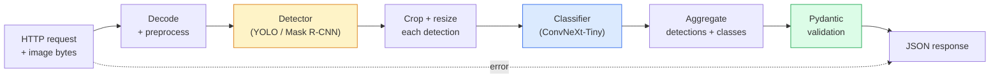

# 构建完整视觉管道  कैपस्टोन

> उत्पादन स्तर विजन प्रणाली मॉडल और नियमों से बनी एक श्रृंखला है, और डेटा अनुबंध के माध्यम से 串联起来── इस चरण के घटक तैयार हैं; यह कपास्टोन उन्हें अंत से अंत तक जोड़ देगा──

**Type:** Build
**Languages:** Python
**Prerequisites:** Phase 4 Lessons 01-15
**Time:** ~120 minutes

## 学习目标
- डिजाइन एक उत्पादन स्तर दृष्टि पाइपलाइन, ऑब्जेक्ट का परीक्षण करने के लिए, उसके वर्गों के लिए, और आउटपुट संरचनात्मक JSON, एक ही समय में सभी विफल पथों को संसाधित करने के लिए
-                                                                                                                                                                                                                                                               
- टर्मिनल के लिए एक बेंचमार्क करें, पहला बोतल गला पहचानें।
-  न्यूनतम फास्टएपीआई सेवा जारी करना, छवि अपलोड करना, पाइपलाइन चलाना, और वर्गीकरण के साथ वापस आना  परिणाम

## 问题
单个视觉模型 非常有用;视觉产品是由它们组成的链条──零售货架审计是检测仪 加产品分类器 再加价格-OCR管道──自动驾驶是2D检测仪 加3D检测仪加段机加跟踪仪加规划仪──医疗预查是分类器加地区分类器加临床医生 UI──

इन लिंक को जोड़ना, सही है, एमएल प्रोटोटाइप और उत्पाद के महत्वपूर्ण भागों को अलग करना। मॉडल के बीच प्रत्येक इंटरफ़ेस एक नया बग स्रोत है। प्रत्येक निर्देशांक परिवर्तन, प्रत्येक सामान्यीकरण, प्रत्येक मास्क आकार परिवर्तन, सभी एक पाइपलाइन की शक्ति पर निर्भर करता है।

इस कपाट पत्थर  न्यूनतम उपलब्ध पाइपलाइन का निर्माणः डिटेक्शन + वर्गीकरण + संरचित आउटपुट + सेवा परत。 चरण 4 में अन्य सामग्री इस ढांचे में सम्मिलित की जा सकती हैः把 मुखौटा R-CNN 换成 YOLOv8, जोड़ें OCR सिर, जोड़ें सेगमेंटेशन शाखा, जोड़ें ट्रैकर。 संरचना स्थिर है;组件是插拔的。

## 概念
### पाइपलाइन



七个阶段── दो मॉडल चरण 开销很大;另五个阶段则是错误 最常出现的地方──

### 使用 Pydantic 定义 डेटा अनुबंध

प्रत्येक मॉडल सीमा एक वर्गीकृत वस्तु में बदल जाती है।

```
Detection(
    box: tuple[float, float, float, float],   # (x1, y1, x2, y2), absolute pixels
    score: float,                              # [0, 1]
    class_id: int,                             # from detector's label map
    mask: Optional[list[list[int]]],           # RLE-encoded if present
)

PipelineResult(
    image_id: str,
    detections: list[Detection],
    classifications: list[Classification],
    inference_ms: float,
)
```

जब डिटेक्टर  वापस आ रहा है `(cx, cy, w, h)`नहीं `(x1, y1, x2, y2)`,Pydantic का सत्यापन होगा सीमा में विफल, आप तुरंत समस्या का पता लगाएंगे, बजाय एक नीचे की फसल को करने के लिए, यह सिर्फ चुपचाप वापस रिक्त क्षेत्र में है।

### 延迟花在哪里

 लगभग हर दृष्टि पाइपलाइन  तृप्त 三条事实:

1. **Preprocessing 通常是最大的单个模块。**解码 JPEG、转换颜色空间、尺寸, ये सब सीपीयू-बंद हैं, और आसानी से अनदेखी की जाती हैं──
2. **Detector 主导 GPU 时间。**70-90% के GPU  समय का पता लगाने के आगे पास ऊपर
3. **Postprocessing（NMS、RLE encode/decode）在 GPU 上便宜，在 CPU 上昂贵。**तक़रीब ही असली लक्ष्य वातावरण से प्रोफ़ाइल बनाना है

वितरण को समझना, ताकि अनुकूलन को प्राथमिकता वाली सूची में बदल दिया जा सके।

### विफलता मोड

- **Empty detections** 返回空列表, मत崩──记录 log──
- **Out-of-bounds boxes** कटौती 前 क्लैंप तक छवि आकार 
- **Tiny crops** लघु से वर्गीकृत 
- **Corrupt upload** 返回带有具体错误代码的400 प्रतिक्रिया, 500 नहीं 
- **Model load failure** सेवा स्टार्टअप में विफलता, बजाय पहले अनुरोध में विफलता 

उत्पादन स्तर पाइपलाइन एक सामान्यीकरण लिखने के बजाय प्रत्येक स्थिति को संभाल लेगी।`try/except`इसे असफलता से छिपा कर रखो। प्रत्येक असफलता का नाम और जवाब है।

### बैचिंग

उत्पादन स्तर सेवा 会服务多个客户──跨请求对检测和分类 进行批发可成倍提升吞吐量──代价是: प्रतीक्षा批发 填满会带来额外延迟──典型设置:最多收集20ms的请求,合并成批发,处理,再发发回应──`torchserve`和 `triton`मूल जीवन समर्थन इस बिंदु; लोड करने योग्य लघु सेवा आमतौर पर खुद को लागू करेगा माइक्रो-बैचर


```figure
v4-vision-pipeline
```

##  इसे निर्माण
### 步骤 1: डेटा अनुबंध

```python
from pydantic import BaseModel, Field
from typing import List, Optional, Tuple

class Detection(BaseModel):
    box: Tuple[float, float, float, float]
    score: float = Field(ge=0, le=1)
    class_id: int = Field(ge=0)
    mask_rle: Optional[str] = None


class Classification(BaseModel):
    detection_index: int
    class_id: int
    class_name: str
    score: float = Field(ge=0, le=1)


class PipelineResult(BaseModel):
    image_id: str
    detections: List[Detection]
    classifications: List[Classification]
    inference_ms: float
```

五秒钟的代码, किसी भी कठोर पाइपलाइन के लिए 省一小时调试时间──

### 步骤 2: एक न्यूनतम पाइपलाइन 类

```python
import time
import numpy as np
import torch
from PIL import Image

class VisionPipeline:
    def __init__(self, detector, classifier, class_names,
                 device="cpu", min_crop=32):
        self.detector = detector.to(device).eval()
        self.classifier = classifier.to(device).eval()
        self.class_names = class_names
        self.device = device
        self.min_crop = min_crop

    def preprocess(self, image):
        """
        image: PIL.Image or np.ndarray (H, W, 3) uint8
        returns: CHW float tensor on device
        """
        if isinstance(image, Image.Image):
            image = np.asarray(image.convert("RGB"))
        tensor = torch.from_numpy(image).permute(2, 0, 1).float() / 255.0
        return tensor.to(self.device)

    @torch.no_grad()
    def detect(self, image_tensor):
        return self.detector([image_tensor])[0]

    @torch.no_grad()
    def classify(self, crops):
        if len(crops) == 0:
            return []
        batch = torch.stack(crops).to(self.device)
        logits = self.classifier(batch)
        probs = logits.softmax(-1)
        scores, cls = probs.max(-1)
        return list(zip(cls.tolist(), scores.tolist()))

    def run(self, image, image_id="anonymous"):
        t0 = time.perf_counter()
        tensor = self.preprocess(image)
        det = self.detect(tensor)

        crops = []
        detections = []
        valid_indices = []
        for i, (box, score, cls) in enumerate(zip(det["boxes"], det["scores"], det["labels"])):
            x1, y1, x2, y2 = [max(0, int(b)) for b in box.tolist()]
            x2 = min(x2, tensor.shape[-1])
            y2 = min(y2, tensor.shape[-2])
            detections.append(Detection(
                box=(x1, y1, x2, y2),
                score=float(score),
                class_id=int(cls),
            ))
            if (x2 - x1) < self.min_crop or (y2 - y1) < self.min_crop:
                continue
            crop = tensor[:, y1:y2, x1:x2]
            crop = torch.nn.functional.interpolate(
                crop.unsqueeze(0),
                size=(224, 224),
                mode="bilinear",
                align_corners=False,
            )[0]
            crops.append(crop)
            valid_indices.append(i)

        class_preds = self.classify(crops)

        classifications = []
        for valid_idx, (cls_id, cls_score) in zip(valid_indices, class_preds):
            classifications.append(Classification(
                detection_index=valid_idx,
                class_id=int(cls_id),
                class_name=self.class_names[cls_id],
                score=float(cls_score),
            ))

        return PipelineResult(
            image_id=image_id,
            detections=detections,
            classifications=classifications,
            inference_ms=(time.perf_counter() - t0) * 1000,
        )
```

प्रत्येक इंटरफ़ेस वर्गीकृत है। प्रत्येक असफलता पथ में स्पष्ट प्रसंस्करण निर्णय हैं।

### 步骤 3: कनेक्ट एक डिटेक्टर और एक वर्गीकरण

```python
from torchvision.models.detection import maskrcnn_resnet50_fpn_v2
from torchvision.models import convnext_tiny

# Use ImageNet-pretrained weights for a realistic pipeline without training
detector = maskrcnn_resnet50_fpn_v2(weights="DEFAULT")
classifier = convnext_tiny(weights="DEFAULT")
class_names = [f"imagenet_class_{i}" for i in range(1000)]

pipe = VisionPipeline(detector, classifier, class_names)

# Smoke test with a synthetic image
test_image = (np.random.rand(400, 600, 3) * 255).astype(np.uint8)
result = pipe.run(test_image, image_id="demo")
print(result.model_dump_json(indent=2)[:500])
```

### 步骤 4: फास्टएपीआई सेवा

```python
from fastapi import FastAPI, UploadFile, HTTPException
from io import BytesIO

app = FastAPI()
pipe = None  # initialised on startup

@app.on_event("startup")
def load():
    global pipe
    detector = maskrcnn_resnet50_fpn_v2(weights="DEFAULT").eval()
    classifier = convnext_tiny(weights="DEFAULT").eval()
    pipe = VisionPipeline(detector, classifier, class_names=[f"c{i}" for i in range(1000)])

@app.post("/detect")
async def detect_endpoint(file: UploadFile):
    if file.content_type not in {"image/jpeg", "image/png", "image/webp"}:
        raise HTTPException(status_code=400, detail="unsupported image type")
    data = await file.read()
    try:
        img = Image.open(BytesIO(data)).convert("RGB")
    except Exception:
        raise HTTPException(status_code=400, detail="cannot decode image")
    result = pipe.run(img, image_id=file.filename or "upload")
    return result.model_dump()
```

उपयोग `uvicorn main:app --host 0.0.0.0 --port 8000`运行。使用 `curl -F 'file=@dog.jpg' http://localhost:8000/detect`测试──

### 步骤 5: बेंचमार्क इस पाइपलाइन

```python
import time

def benchmark(pipe, num_runs=20, image_size=(400, 600)):
    img = (np.random.rand(*image_size, 3) * 255).astype(np.uint8)
    pipe.run(img)  # warm up

    stages = {"preprocess": [], "detect": [], "classify": [], "total": []}
    for _ in range(num_runs):
        t0 = time.perf_counter()
        tensor = pipe.preprocess(img)
        t1 = time.perf_counter()
        det = pipe.detect(tensor)
        t2 = time.perf_counter()
        crops = []
        for box in det["boxes"]:
            x1, y1, x2, y2 = [max(0, int(b)) for b in box.tolist()]
            x2 = min(x2, tensor.shape[-1])
            y2 = min(y2, tensor.shape[-2])
            if (x2 - x1) >= pipe.min_crop and (y2 - y1) >= pipe.min_crop:
                crop = tensor[:, y1:y2, x1:x2]
                crop = torch.nn.functional.interpolate(
                    crop.unsqueeze(0), size=(224, 224), mode="bilinear", align_corners=False
                )[0]
                crops.append(crop)
        pipe.classify(crops)
        t3 = time.perf_counter()
        stages["preprocess"].append((t1 - t0) * 1000)
        stages["detect"].append((t2 - t1) * 1000)
        stages["classify"].append((t3 - t2) * 1000)
        stages["total"].append((t3 - t0) * 1000)

    for stage, times in stages.items():
        times.sort()
        print(f"{stage:12s}  p50={times[len(times)//2]:7.1f} ms  p95={times[int(len(times)*0.95)]:7.1f} ms")
```

CPU ऊपर का विशिष्ट आउटपुटः पूर्वप्रक्रिया ~3 ms, 300-500 ms का पता लगाएं, 20-40 ms को वर्गीकृत करें, कुल 350-550 ms को वर्गीकृत करें।

## इसका उपयोग करें
उत्पादन ढाँचा अंतिम रूप से उसी संरचना में प्राप्त होगा, अतिरिक्तः

- **Model versioning** 始终在回应 中记录 मॉडल नाम 和 वजन हैश。
- **Per-request trace IDs**  रिकॉर्ड प्रत्येक अनुरोध के प्रत्येक चरण का समय, ताकि आप धीमी प्रतिक्रिया और चरण 关联起来
- **Fallback path** यदि वर्गीकरण समय समाप्ति, लौटें नहीं वर्गीकरण का पता लगाने के बजाय, पूरे अनुरोध 失败
- **Safety filters** NSFW / PII फ़िल्टर 在分类 之后、响应 离开服务 之前运行。
- **Batch endpoint** एक `/detect_batch`, छवि यूआरएल को स्वीकार करें 列表 बड़े पैमाने पर प्रसंस्करण के लिए उपयोग किया जाता है。

 उत्पादन सेवा के लिए,`torchserve``Triton Inference Server`和 `BentoML`开箱即可处理批发,版本, मेट्रिक्स तथा स्वास्थ्य जांच`FastAPI`适合原型 和小规模产品──

## 交付 यह
本课会产出:

- `outputs/prompt-vision-service-shape-reviewer.md` एक संकेत, देखने सेवा की जांच के लिए 代码中的 अनुबंध/ प्रतिक्रिया आकार 违规,并指出第一个破解 bug──
- `outputs/skill-pipeline-budget-planner.md` एक कौशल, निर्धारित लक्ष्य लटेंसी तथा आउटपुट, प्रत्येक पाइपलाइन चरण के लिए समय बजट का वितरण,并标记哪个阶段会最先超出预算──

## अभ्यास
1. **(Easy)**प्रत्येक चरण के औसत समय, तथा प्रत्येक चरण के प्रतिबिंब की पहचान संख्या का विवरण
2. **(Medium)** दे `Detection`添加 मुखौटा आउटपुट फ़ील्ड,并将其编码为RLE──验证 यहां तक कि 10 ऑब्जेक्ट छवि, JSON भी 1MB में रहता है निम्न──
3. **(Hard)**एक माइक्रो बैचर जोड़ेंः अधिकतम 10 एमएस की फसल एकत्र करें, एक जीपीयू कॉल के साथ उन सभी को वर्गीकृत करें, फिर अनुरोध पर परिणाम वापस करें।

## 关键术语
| Term | What people say | What it actually means |
|------|----------------|----------------------|
| Pipeline | “系统” | 由 preprocessing、inference 和 postprocessing step 组成的有序链条，每一对 step 之间都有类型化 interface |
| Data contract | “schema” | 每个 stage 的 input 和 output 都必须符合的 Pydantic / dataclass 定义；在边界处捕获 integration bug |
| Preprocessing | “model 之前” | 解码、颜色转换、resizing、normalising；通常是最大的 CPU 时间消耗点 |
| Postprocessing | “model 之后” | NMS、mask resize、threshold、RLE encode；在 GPU 上便宜，在 CPU 上昂贵 |
| Microbatcher | “先收集再 forward” | 在固定窗口内等待多个 request，然后运行一次 batched forward pass 的 aggregator |
| Trace ID | “Request id” | 每个 request 的标识符，会在每个 stage 记录，因此 slow request 可以端到端追踪 |
| Failure code | “命名错误” | 每类 failure 都有具体 error code，而不是泛化的 500；支持 client retry logic |
| Health check | “Readiness probe” | 一个低成本 endpoint，用于报告 service 是否可以响应；loadbalancer 依赖它 |

## 延伸阅读
- [Full Stack Deep Learning — Deploying Models](https://fullstackdeeplearning.com/course/2022/lecture-5-deployment/) 生产级 ML तैनाती का क्लासिक विवरण
- [BentoML docs](https://docs.bentoml.com) 支持批发, संस्करण और माप के सेवा ढांचे
- [torchserve docs](https://pytorch.org/serve/) PyTorch 官方 सेवा पुस्तकालय
- [NVIDIA Triton Inference Server](https://developer.nvidia.com/triton-inference-server) 支持批发和多型的高吞吐量服务
