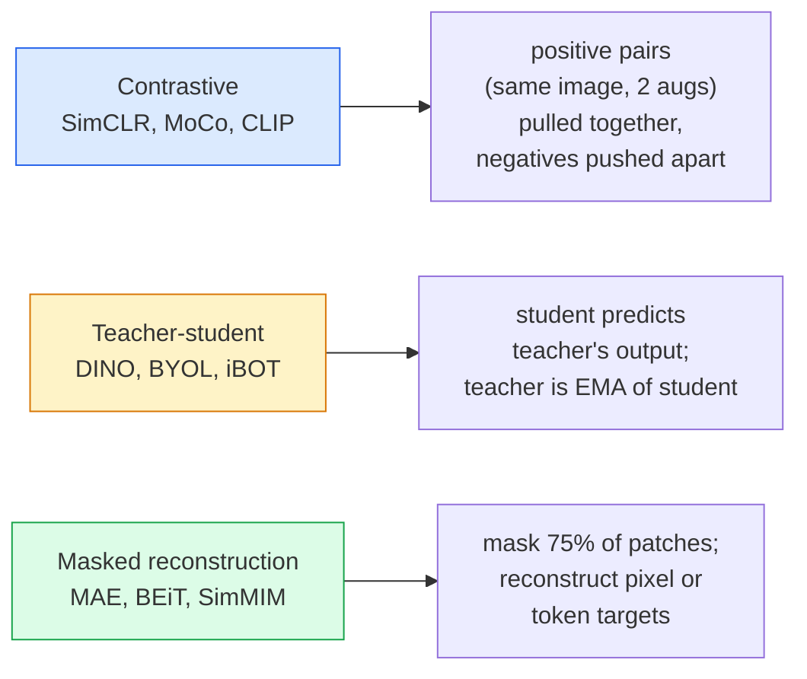

# स्व-निरीक्षण दृष्टि  सिमकलर, डिनो, एमएई

> Labels are supervised vision bottle── स्व-नियंत्रित पूर्व प्रशिक्षण 移除它们: 100M 张无标记图像中学习视觉特征,再在 10k 张有标记图像上精细调──

**类型：**学习 + 构建
**语言：**पायथन
**先修要求：**चरण 4 पाठ 04(चित्र वर्गीकरण),चरण 4 पाठ 14(ViT)
**时间：** 75 मिनट

## 学习目标

- 理三大 स्व-नियंत्रित परिवार  विपरीत  सिमसीएलआर)  शिक्षक-छात्रा  डिनो)  मुखौटा पुनर्निर्माण  एमएई)  并说明每种在优化什么
- शून्य से प्राप्त करने के लिए InfoNCE हानि,并 समझाएँ क्यों बैच आकार 512 के लिए उपलब्ध है, जबकि बैच आकार 32 के लिए विफल होगा
-  समझाएँ कि क्यों MAE का 75% मास्किंग अनुपात किसी भी तरह से निर्धारित नहीं है, तथा यह BERT लेख के 15% से कुछ अलग है
- DINOv2 या MAE ImageNet चेकपोस्ट का उपयोग करें  रैखिक जांच और शून्य शॉट निकासी करें

## 问题

पर्यवेक्षित इमेजनेट में 1.3 मिलियन 张 के साथ चिह्नित छवियां हैं, अनुमानित चिह्नित लागत 10 मिलियन डॉलर है। मेडिकल और औद्योगिक डेटासेट छोटे हैं, चिह्नित लागत भी अधिक है। प्रत्येक दृष्टि  टीम सभी पूछता हैः क्या हम पहले सस्ते बिना चिह्नित डेटा पर प्रीट्रेन कर सकते हैं  यूट्यूब 、 वेब क्रॉल  वेब कैमरा फुटेज  सैटेलाइट स्वीप  फिर छोटे पैमाने पर चिह्नित संग्रह पर ठीक-ठीक?

स्व-नियंत्रित सीखने यही उत्तर है। एक आधुनिक स्व-नियंत्रित वीटी, जो कि लायन या जेएफटी में प्रशिक्षण के बाद ठीक-ठीक ण में, पर्यवेक्षित इमेजनेट 准确率 को प्राप्त या पार कर सकता है। यह पर्यवेक्षित प्री-प्रशिक्षण की तुलना में भी बेहतर है।

概念上的转变是:प्रिटेक्स्ट टास्क  模型被训练完成的任务  无必是下游任务──关键在于它是否迫使模型学习有用特征──预测灰度尺度 图像的颜色、旋转图像并让模型分类旋转角度、面具补丁并重建它们

## 概念

### तीन परिवार



### विपरीत सीखने (SimCLR)

取一张图像,应用两次随机增强,获得两次视图――将二者送入同一个编码加投影头――最小化一个损失,含义是 ये दो सम्मिलित 应该接近,并且这个 सम्मिलित 应该远离批量中所有其他图像的 सम्मिलित──

```
Loss for positive pair (z_i, z_j) among 2N views per batch:

   L_ij = -log( exp(sim(z_i, z_j) / tau) / sum_k in batch \ {i} exp(sim(z_i, z_k) / tau) )

sim = cosine similarity
tau = temperature (0.1 standard)
```

यह InfoNCE हानि है। यह प्रत्येक सकारात्मक को कई नकारात्मक को आवश्यकता है, इसलिए बैच आकार  बहुत महत्वपूर्ण  SimCLR  512-8192  आवश्यक है।

### शिक्षक-छात्रा ((DINO)

दो संरचनाएं एक ही नेटवर्कः छात्र और शिक्षक──शिक्षक छात्र है 权重的指数动平均(EMA)──二者都看到同一图像的增强视图──学生的输出被训练为匹配教师的输出 没有明显的负面──

```
loss = CE( student_output(view_1),  teacher_output(view_2) )
     + CE( student_output(view_2),  teacher_output(view_1) )

teacher_weights = m * teacher_weights + (1 - m) * student_weights   (m ≈ 0.996)
```

क्यों यह नहीं गिरता 成预测一个常量:शिक्षक का输遇被集中了(减去每维度的平均值)并磨损了(除以较小温度) ・中心化 防止某个维度占主导;磨损 防止输出崩为均──

DINOv2  आकार के आधार है, DINOv2 में 142M 张 क्यूरेट छवियों 上训练── आय की विशेषता है वर्तमान शून्य-शॉट दृश्य निकासी तथा घने भविष्यवाणी के SOTA──

### मास्क पुनर्निर्माण (MAE)

मास्क एक ViT 输入 में 75% पैचों  केवल 25%  प्रेषण  प्रविष्टि एन्कोडर  एक छोटा डिकोडर  प्राप्त एन्कोडर  आउटपुट तथा मास्क स्थित स्थितियों के मास्क टोकन,  को मास्क पैचों के पिक्सेल को पुनः बनाने के लिए प्रशिक्षित किया गया है

```
Encoder:  visible 25% of patches -> features
Decoder:  features + mask tokens at masked positions -> reconstructed pixels
Loss:     MSE between reconstructed and original pixels on masked patches only
```

让 MAE 有效的关键设计选择:

- **75% mask ratio** 很高──迫使编码学习语义特征; पुनः निर्माण 25% 会接近微不足道(相邻像素的相关性太强,到CNN都能轻松完成)
- **Asymmetric encoder/decoder** बड़े प्रकार के ViT एन्कोडर केवल दृश्य पैच देखें; छोटा डिकोडर(8-परत,512-dim) पुनः निर्माण को संसाधित करना
- **Pixel-space reconstruction target** बीईटी के मुकाबले टोकनकृत लक्ष्य अधिक सरल, और वीईटी पर परिणाम बेहतर है।

प्रैक्टिस के बाद, डिकोडर छोड़ दिया गया।

### 15% के बजाय 75% क्यों?

BERT मास्क 15% के टोकन──MAE मास्क 75%── अंतर सूचना घनत्व में है──

- प्राकृतिक भाषा प्रत्येक टोकन के 很高──预测 15% टोकन 仍然很难, क्योंकि प्रत्येक मुखौटा स्थिति में कई व्यवहार्य पूर्णताएं हैं──
- छवि पैचों के  बहुत कम  एक अनवक्षित क्षेत्र का अक्सर लगभग सटीक रूप से निर्णय ले सकते हैं मास्क पैच के पिक्सलों के लिए                                                                                                                                                                                                                                             

75%  पर्याप्त उच्च, सरल अंतरिक्ष के बाहर प्रस्थान को हल करने में असमर्थ बनाता है; एन्कोडर  छवि सामग्री प्रदर्शित करना चाहिए

### रैखिक जांच मूल्यांकन

स्व-निरीक्षण पूर्व प्रशिक्षण के बाद, मानक मूल्यांकन है**linear probe**:结 एन्कोडर, जिस पर ImageNet लेबल के आधार पर 训练一个单层线性分类器――报告顶级准确性――

- सिमकलर रेसनेट-50: लगभग 71%(2020)
- DINO ViT-S/16: लगभग 77%(2021)
- MAE ViT-L/16: लगभग 76%(2022)
- DINOv2 ViT-g/14: लगभग 86%(2023)

रैखिक जांच लक्षणों की गुणवत्ता का शुद्ध माप है; ठीक-ठीक से सामान्य रूप से 2-5 अंक बढ़ते हैं, लेकिन सिर को फिर से प्रशिक्षित करने के प्रभाव में भी शामिल होते हैं।


```figure
data-augmentation
```

##  इसे निर्माण

### 步骤 1: दो दृश्य वृद्धि पाइपलाइन

```python
import torch
import torchvision.transforms as T

two_view_train = lambda: T.Compose([
    T.RandomResizedCrop(96, scale=(0.2, 1.0)),
    T.RandomHorizontalFlip(),
    T.ColorJitter(0.4, 0.4, 0.4, 0.1),
    T.RandomGrayscale(p=0.2),
    T.ToTensor(),
])


class TwoViewDataset(torch.utils.data.Dataset):
    def __init__(self, base):
        self.base = base
        self.aug = two_view_train()

    def __len__(self):
        return len(self.base)

    def __getitem__(self, i):
        img, _ = self.base[i]
        v1 = self.aug(img)
        v2 = self.aug(img)
        return v1, v2
```

प्रत्येक __getitem__ return same image के दो बढ़े हुए दृश्य; कोई लेबल की आवश्यकता नहीं है。

### 步骤 2: सूचना हानि

```python
import torch.nn.functional as F

def info_nce(z1, z2, tau=0.1):
    """
    z1, z2: (N, D) L2-normalised embeddings of paired views
    """
    N, D = z1.shape
    z = torch.cat([z1, z2], dim=0)  # (2N, D)
    sim = z @ z.T / tau              # (2N, 2N)

    mask = torch.eye(2 * N, dtype=torch.bool, device=z.device)
    sim = sim.masked_fill(mask, float("-inf"))

    targets = torch.cat([torch.arange(N, 2 * N), torch.arange(0, N)]).to(z.device)
    return F.cross_entropy(sim, targets)
```

调用前先对嵌入  एल 2 सामान्यीकरण करें。`tau=0.1` SimCLR 默认值;  कम का मूल्य हानि और अधिक बढ़ेगा,  अधिक नकारात्मकताओं की आवश्यकता होगी

### 步骤 3: स्वच्छता जांच InfoNCE

```python
z1 = F.normalize(torch.randn(16, 32), dim=-1)
z2 = z1.clone()
loss_same = info_nce(z1, z2, tau=0.1).item()
z2_random = F.normalize(torch.randn(16, 32), dim=-1)
loss_random = info_nce(z1, z2_random, tau=0.1).item()
print(f"InfoNCE with identical pairs:  {loss_same:.3f}")
print(f"InfoNCE with random pairs:     {loss_random:.3f}")
```

समान जोड़े                                                                                                                                                                                                                                                                                                                                                                                                                                                                                                                           

### 步骤 4:MAE शैली का मास्क

```python
def random_mask_indices(num_patches, mask_ratio=0.75, seed=0):
    g = torch.Generator().manual_seed(seed)
    n_keep = int(num_patches * (1 - mask_ratio))
    perm = torch.randperm(num_patches, generator=g)
    visible = perm[:n_keep]
    masked = perm[n_keep:]
    return visible.sort().values, masked.sort().values


num_patches = 196
visible, masked = random_mask_indices(num_patches, mask_ratio=0.75)
print(f"visible: {len(visible)} / {num_patches}")
print(f"masked:  {len(masked)} / {num_patches}")
```

简单、快速,并且对给定种子是决定性的的──真实MAE 实现将对其进行批发,并保留每个样品的面具──

## इसका उपयोग करें

DINOv2 2026 के लिए उत्पादन मानक हैः

```python
import torch
from transformers import AutoImageProcessor, AutoModel

processor = AutoImageProcessor.from_pretrained("facebook/dinov2-base")
model = AutoModel.from_pretrained("facebook/dinov2-base")
model.eval()

# Per-image embeddings for zero-shot retrieval
with torch.no_grad():
    inputs = processor(images=[pil_image], return_tensors="pt")
    outputs = model(**inputs)
    embedding = outputs.last_hidden_state[:, 0]  # CLS token
```

सोडा 768-dim एम्बेडिंग आधुनिक छवि पुनर्प्राप्ति, घने पत्राचार और शून्य-शॉट स्थानांतरण पाइपलाइनों के骨干 है।

 छवि-पाठ एम्बेडमेंट,SigLIP या OpenCLIP के लिए;`timm`रेपो ने सभी एमएई चेकपोस्ट प्रदान किए हैं।

## 交付 यह

本课会产出:

- `outputs/prompt-ssl-pretraining-picker.md` एक संकेत, डेटासेट आकार के आधार पर  गणना 和 डाउनस्ट्रीम कार्य  चुनें SimCLR / MAE / DINOv2──
- `outputs/skill-linear-probe-runner.md` एक कौशल, arbitrary frozen encoder + labelled dataset 编写线性探测评――

## अभ्यास

1. **（Easy）**验证: ⇒ अच्छे इम्बेडमेंट के लिए, तापमान में कमी से InfoNCE हानि घट जाएगी; ⇒ किसी भी इम्बेडमेंट के लिए, तापमान में कमी से हानि बढ़ेगी── उत्पन्न एक ⇒`tau in [0.05, 0.1, 0.2, 0.5]`प्रति हानि का चित्रण
2. **（Medium）** एक DINO शैली केंद्र बफर को प्राप्त करना प्रदर्शन यदि केंद्र नहीं होता है, तो छात्र कई युगों में होगा 
3. **（Hard）**प्रयोग पाठ 10 में TinyUNet 作为脊柱,在CIFAR-100上训练 MAE──报告 10、50 和 200 कालखंड 时的线性探测精度──展示在同一个1000-图像子组上,MAE-pretrained-linear probe 优于从头监督的线性探测──

## 关键术语

| Term | 人们的说法 | 实际含义 |
|------|----------------|----------------------|
| Self-supervised | “Label-free” | 一种 pretext task，用于从无标注数据中产生有用 representations |
| Pretext task | “假任务” | SSL 期间使用的 objective（reconstruct patches、match views）；pretraining 后会被丢弃 |
| Linear probe | “Frozen encoder + linear head” | 标准 SSL 评估：只在 frozen features 之上训练一个 linear classifier |
| InfoNCE | “Contrastive loss” | 对 cosine similarities 做 softmax；positive pair 是目标类别，所有其他项都是 negatives |
| EMA teacher | “Moving-average teacher” | 权重是 student 的 exponential moving average 的 teacher；BYOL、MoCo、DINO 使用它 |
| Mask ratio | “隐藏的 patches 百分比” | MAE 期间被 mask 的 patches 比例；vision 为 75%，text 为 15% |
| Representation collapse | “Constant output” | SSL 失败模式：encoder 对所有输入输出一个常量 Vector；通过 centring、sharpening 或 negatives 防止 |
| DINOv2 | “生产级 SSL backbone” | Meta 2023 年的 self-supervised ViT；2026 年最强的通用 image features |

## 延伸阅读

- [SimCLR (Chen et al., 2020)](https://arxiv.org/abs/2002.05709) विपरीत शिक्षा 参考
- [DINO (Caron et al., 2021)](https://arxiv.org/abs/2104.14294) 带动力,中心, तीक्ष्णता
- [MAE (He et al., 2022)](https://arxiv.org/abs/2111.06377) 面向 ViT के मास्क ऑटोकोडर पूर्व प्रशिक्षण
- [DINOv2 (Oquab et al., 2023)](https://arxiv.org/abs/2304.07193) स्व-निरीक्षण वीटी  उत्पादन स्तर की विशेषता तक विस्तार
