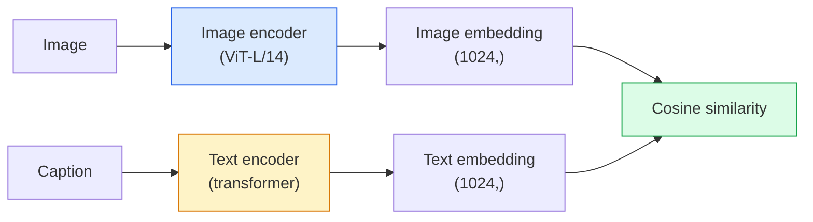

# खुली वक्सावली दृष्टि  CLIP

> एक छवि एन्कोडर और एक पाठ एन्कोडर को एक प्रशिक्षण से शुरू करें, एक ही बिंदु पर एक ही बिंदु पर एक ही बिंदु पर एक ही बिंदु पर एक ही बिंदु पर एक ही बिंदु पर एक ही बिंदु पर एक ही बिंदु पर एक ही बिंदु पर एक ही बिंदु पर एक ही बिंदु पर एक ही बिंदु पर एक ही बिंदु पर एक ही बिंदु पर एक ही बिंदु पर एक ही बिंदु पर एक ही बिंदु पर एक ही बिंदु पर एक ही बिंदु पर एक ही बिंदु पर एक ही बिंदु पर एक ही बिंदु पर एक ही बिंदु पर एक ही बिंदु पर एक ही बिंदु पर एक ही बिंदु पर एक ही बिंदु पर एक ही बिंदु पर एक ही बिंदु पर एक ही बिंदु पर एक ही बिंदु पर एक ही बिंदु पर एक ही बिंदु पर एक ही जगह पर एक ही जगह पर एक ही जगह पर एक ही एक को एक कोडिंग के साथ एक को एक कोडिंग के साथ एक को एक को प्रशिक्षित करने के लिए एक ही तकनीक है।

**Type:** Build + Use
**Languages:** Python
**Prerequisites:** Phase 4 Lesson 14 (ViT), Phase 4 Lesson 17 (Self-Supervised)
**Time:** ~45 分钟

## 学习目标

- 解释 CLIP के दो टावर वास्तुकला 和 विपरीत प्रशिक्षण उद्देश्य
- पूर्व प्रशिक्षित CLIP (या SigLIP) का उपयोग करके शून्य शॉट वर्गीकरण करने के लिए, किसी भी कार्य-विशिष्ट प्रशिक्षण की आवश्यकता नहीं है
- शून्य से शून्य-शॉट वर्गीकरण प्राप्त करनाःकोड वर्ग प्रम्प्ट्स ∞ कॉसिन समानता का गणना ∞ argmax
- 区分 CLIP、SigLIP、OpenCLIP तथा LLaVA/LLaMA-vision मॉडल ये 2026 में किसका उपयोग करेंगे

## 问题

传统 वर्गीकरणकर्ता है बंद-वाक्य संग्रहः एक 1000 वर्ग ImageNet मॉडल केवल 1000 个标签预测 कर सकता है── प्रत्येक नई श्रेणी के लिए लेबल डेटा और पुनः प्रशिक्षण के प्रमुख की आवश्यकता होती है──

CLIP(Radford et al., OpenAI 2021) ने कहा कि वेब से 抓取的 400M 个 (छवि, कैप्शन) जोड़े में ऊपर प्रशिक्षण, एक मॉडल प्राप्त किया जा सकता है, यह किसी भी वर्ग संग्रह में 分类 के रूप में अनुमान लगा सकता है, जबकि ये वर्ग केवल प्राकृतिक भाषा का वर्णन करते हैं।

इस प्रकार की क्षमता शून्य शॉट स्थानांतरण就是 प्रत्येक आधुनिक दृष्टि प्रणाली Clip-परिवार चेकपॉइंट से 开始的原因──Detection(Grounding DINO、OWL-ViT) Segmentation(CLIPSeg、SAM)  Retrieval、content moderation、VLMs 和 text-to-image generation ⇒Clip-style joint embeddings ⇒ इसके ऊपर स्थापित हैं।

## 概念

### दो टावर



दो एन्कोडर  最后都会通过线性投影 投影到相同的嵌入维度 ((CLIP-B/32 为 512,CLIP-L/14 为 1024) ⋅ L2 सामान्यीकरण और कॉस्सीन समानता का गणना करें

###  लक्ष्य

给定一个包含 N 个 (छवि, कैप्शन) जोड़े का बैच,构建一个NxN समानता मैट्रिक्स──训练两个编码器,使 diagonal(matching pairs) के उच्च समानता, जबकि ऑफ-diagonals(non-matching) के साथ कम समानता──

```
sim_matrix = image_embeddings @ text_embeddings.T / tau

loss_i2t = cross_entropy(sim_matrix,       targets=arange(N))
loss_t2i = cross_entropy(sim_matrix.T,     targets=arange(N))
loss = (loss_i2t + loss_t2i) / 2
```

यह सममित है, क्योंकि छवि-से-पाठ और पाठ-से-चित्र पुनर्प्राप्ति सभी उपयोग करने योग्य होना चाहिए।`tau`(तापमान) आमतौर पर स्कॉलर पैरामीटर के रूप में, प्रारंभिककरण 0.07 है।

### बेहतर हानि

सिगलिप ((झाई एट अल., 2023) प्रति जोड़ी सिगमोइड के साथ  softmax को बदल दिया गयाः

```
loss = mean over pairs of log(1 + exp(-y_ij * sim_ij))
y_ij = +1 if matching, -1 otherwise
```

प्रति जोड़ी हानि  हटा दिया CLIP आवश्यक बैच स्तर मानकीकरण──SigLIP छोटे बैच आकारों में नीचे प्रशिक्षण बेहतर है, और समान डेटा मात्रा में नीचे मेल या CLIP से अधिक है──

### शून्य शॉट वर्गीकरण

给定一个训练好的 CLIP:

1. प्रत्येक वर्ग के लिए,组合一个提示:"एक {class} की एक तस्वीर"
2. उपयोग पाठ एन्कोडर सभी वर्ग संकेतों को एन्कोड -> `T`आकार (सी, डी) ः
3. एन्कोड परीक्षण छवि -> `I`आकार (1, डी) ः
4. समानता = `I @ T.T`आकार (1, C) ◊
5. Argmax -> पूर्वानुमानित वर्ग。

शीघ्र इंजीनियरिंग 很重要──OpenAI 为 ImageNet 发布了80 个提示模板("एक {}"、"एक {}"的模糊照片"",एक {}"的草图、...)── प्रत्येक वर्ग के सभी टेम्पलेट्स के एम्बेडमेंट्स 取平均,可以额外提升 1-3% शीर्ष-1 सटीकता──

### 2026 साल CLIP शैली के मॉडल का उपयोग

- **Zero-shot classification**直接使用──
- **Image retrieval** एक बार性 एन्कोड सभी छवियों, में निष्कर्ष 时 एम्बेड क्वेरी
- **Text-conditioned detection**Grounding DINO、OWL-ViT होगा क्लिप पाठ टॉवर 包装在探测器 周围──
- **Text-conditioned segmentation**CLIPSeg;SAM 通过 CLIP 使用 पाठ-प्रोम्प्ट इनपुट──
- **VLMs**LLaVA、Qwen-VL、InternVL CLIP-परिवार दृष्टि एन्कोडर 接入 LLM。
- **Text-to-image gen**स्थिर विसारण、DALL-E 3 以 CLIP पाठ एम्बेडमेंट 为条件──

एक बार जब आप साझा एम्बेडिंग स्थान है, प्रत्येक दृष्टि + भाषा कार्य दूर गणना में बदल जाएगा।


```figure
clip-contrastive
```

##  इसे निर्माण

### 步骤 1: एक बहुत छोटा दो-tower मॉडल

वास्तविक CLIP ViT + ट्रांसफार्मर है। इस कोर्स में, टावरों को पूर्व-उपलब्ध सुविधाओं के आधार पर छोटे एमएलपी हैं, इसलिए प्रशिक्षण संकेत CPU पर भी देखा जा सकता है।

```python
import torch
import torch.nn as nn
import torch.nn.functional as F


class TwoTower(nn.Module):
    def __init__(self, img_in=128, txt_in=64, emb=64):
        super().__init__()
        self.image_proj = nn.Sequential(nn.Linear(img_in, 128), nn.ReLU(), nn.Linear(128, emb))
        self.text_proj = nn.Sequential(nn.Linear(txt_in, 128), nn.ReLU(), nn.Linear(128, emb))
        self.logit_scale = nn.Parameter(torch.ones([]) * 2.6592)  # ln(1/0.07)

    def forward(self, img_feats, txt_feats):
        i = F.normalize(self.image_proj(img_feats), dim=-1)
        t = F.normalize(self.text_proj(txt_feats), dim=-1)
        return i, t, self.logit_scale.exp()
```

दो प्रक्षेपण साझा-अवकाश आउटपुट शिक्षित तापमान शैली सच्चा क्लिप एपीआई समान 

### 步骤 2:विपक्षीय हानि

```python
def clip_loss(image_emb, text_emb, logit_scale):
    N = image_emb.size(0)
    sim = logit_scale * image_emb @ text_emb.T
    targets = torch.arange(N, device=sim.device)
    l_i = F.cross_entropy(sim, targets)
    l_t = F.cross_entropy(sim.T, targets)
    return (l_i + l_t) / 2
```

सममित── उच्चतम लॉजिट_स्केल = अधिक तेज सॉफ्टमैक्स = अधिक आत्मविश्वास, लेकिन कोई अनिश्चित风险──

### 步骤 3: शून्य-शॉट वर्गीकरण

```python
@torch.no_grad()
def zero_shot_classify(model, image_feats, class_text_feats, class_names):
    """
    image_feats:      (N, img_in)
    class_text_feats: (C, txt_in)   one averaged embedding per class
    """
    i = F.normalize(model.image_proj(image_feats), dim=-1)
    t = F.normalize(model.text_proj(class_text_feats), dim=-1)
    sim = i @ t.T
    pred = sim.argmax(dim=-1)
    return [class_names[p] for p in pred.tolist()]
```

प्रत्येक चरण एक पंक्ति में। यह उत्पादन क्लिप चेकपॉइंट में उपयोग की जाने वाली सटीक शून्य-शॉट प्रक्रिया है।

### 步骤 4: स्वच्छता जांच

```python
torch.manual_seed(0)
model = TwoTower()

img = torch.randn(8, 128)
txt = torch.randn(8, 64)
i, t, scale = model(img, txt)
loss = clip_loss(i, t, scale)
print(f"batch size: {i.size(0)}   loss: {loss.item():.3f}")
```

 के लिए  के साथ शुरू होने के मॉडल,  के नुकसान  के करीब होना चाहिए `log(N) = log(8) = 2.08`यह संरचना के सममित क्रॉस-एंट्रोपी लक्ष्य को अभी तक नहीं सीखा है

## इसका उपयोग करें

OpenCLIP 2026 के लिए सामुदायिक मान्यता हैः

```python
import open_clip
import torch
from PIL import Image

model, _, preprocess = open_clip.create_model_and_transforms("ViT-B-32", pretrained="laion2b_s34b_b79k")
tokenizer = open_clip.get_tokenizer("ViT-B-32")

image = preprocess(Image.open("dog.jpg")).unsqueeze(0)
text = tokenizer(["a photo of a dog", "a photo of a cat", "a photo of a car"])

with torch.no_grad():
    image_features = model.encode_image(image)
    text_features = model.encode_text(text)
    image_features = image_features / image_features.norm(dim=-1, keepdim=True)
    text_features = text_features / text_features.norm(dim=-1, keepdim=True)
    probs = (100.0 * image_features @ text_features.T).softmax(dim=-1)

print(probs)
```

SigLIP 更新, छोटे पैमाने पर प्रशिक्षण बेहतर, और नए काम के लिए अधिक अनुकूलः`google/siglip-base-patch16-224` हागिंग फेस 同时提供两者──

## 交付 यह

本课会产出:

- `outputs/prompt-zero-shot-class-picker.md`एक प्रॉम्प्ट, जो किसी दिए गए वर्ग 列表和 डोमेन 时 में उपयोग किया जाता है, शून्य-शॉट CLIP  डिज़ाइन वर्ग टेम्पलेट्स हेतु 
- `outputs/skill-image-text-retriever.md`एक कौशल, किसी भी CLIP चेकपॉइंट के साथ  छवि एम्बेडिंग सूचकांक का निर्माण, पाठ-द्वारा-सवाल और छवि-द्वारा-सवाल का समर्थन करें。

## अभ्यास

1. **（Easy）**पूर्व प्रशिक्षित ओपनक्लिप ViT-B/32 का उपयोग करें, और CIFAR-10 上80 टेम्पलेट प्रॉम्प्ट सेट का उपयोग करें शून्य-शॉट वर्गीकरण करें।
2. **（Medium）**एक ही CIFAR-10 कार्य में ऊपर तुलना एकल टेम्पलेट (("एक {} की एक तस्वीर") 80 टेम्पलेट औसत एम्बेडिंग्स के साथ
3. **（Hard）**建立一个零镜像检索索索引: क्लिप के साथ 1,000张图像 एम्बेड करें, FAISS सूचकांक का निर्माण करें,自然语言描述 के साथ क्वेरी करें।

## 关键术语

| Term | 人们怎么说 | 它实际意味着什么 |
|------|----------------|----------------------|
| Two-tower | "Dual encoder" | 独立的 image 和 text encoders，末端是 shared-dim projection head |
| Zero-shot | "No task-specific training" | 在 inference 时分类到仅由文本描述的 classes；不接触 labels |
| Temperature / logit_scale | "tau" | 在 softmax 前缩放 similarity matrix 的 learned scalar |
| Prompt template | "A photo of a {}" | 包裹 class names 的自然语言包装器；平均多个 templates 会提升 zero-shot accuracy |
| CLIP | "Image+text model" | 2021 年的 OpenAI model；2026 年该领域的通用语汇 |
| SigLIP | "Sigmoid CLIP" | 将 softmax 替换为 per-pair sigmoid；在小 batch 下训练更好 |
| OpenCLIP | "Open reproduction" | 社区在 LAION 上训练的 CLIP variants；open-source pipelines 的 production default |
| VLM | "Vision-language model" | CLIP-family encoder 加上 LLM，训练用来回答关于 images 的问题 |

## 延伸阅读

- [CLIP：从自然语言监督中学习可迁移视觉模型（Radford et al., 2021）](https://arxiv.org/abs/2103.00020)
- [SigLIP：用于 Language-Image Pre-Training 的 Sigmoid Loss（Zhai et al., 2023）](https://arxiv.org/abs/2303.15343)
- [OpenCLIP](https://github.com/mlfoundations/open_clip) समुदाय कोडबेस
- [DINOv2 vs CLIP vs MAE：features comparison](https://huggingface.co/blog/dinov2) समाहित并排 उपयोग मामलों का एचएफ गाइड
