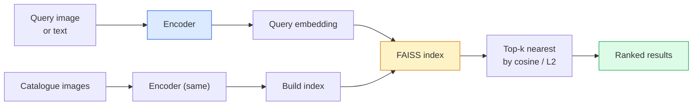

# छवि पुनर्प्राप्ति और मीट्रिक सीखने

> रिकवरी प्रणाली इम्बेडिंग स्पेस के भीतर दूरी के अनुसार उम्मीदवारों के क्रम से संबंधित है।

**Type:** Build
**Languages:** Python
**Prerequisites:** Phase 4 Lesson 14 (ViT), Phase 4 Lesson 18 (CLIP)
**Time:** ~45 minutes

## 学习目标
- 解释三小段、矛盾和 प्रॉक्सी आधारित मीट्रिक सीखने के नुकसान,并为给定数据集选择合适的方法
- L2 मानकीकरण एवं कॉसिन समानता को सही ढंग से प्राप्त करने के लिए,并审计 "एक ही वस्तु" और "एक ही वर्ग" प्राप्त करने के बीच अंतर
- निर्माण FAISS सूचकांक, प्रयोग पाठ और चित्र पूछताछ यह,并为延续查询集 报告 recall@K
- DINOv2、CLIP 和 SigLIP उपयोग करने के लिए बंद-से-शेल्फ एम्बेडिंग रीढ़ की हड्डी,并知道各自何时胜出

## 问题
रिट्रीवल उत्पादन विज़ुअल सिस्टम में मौजूद नहीं हैः डुप्लिकेट डिटेक्शन, रिवर्स इमेज सर्च, विज़ुअल सर्च, "समान उत्पादों को ढूंढें")

两个设计决策决定整个系统──Embedding,也就是由什么模型产生 Vector──Index,也就是如何在规模化场景中找到近邻──到2026年,都已商品化了(DINOv2 用于Embedding,FAISS 用于索引), इससे बढ़ी है门:难点在定义你的应用中*什么算相似*, फिर塑造嵌入空间,让距离与这个定义匹配──

यह एक छोटी और उच्च स्तरीय शैक्षणिक विषय है।

## 概念
### एक नज़र में प्राप्त करना



### चार हार परिवार

| Loss | Requires | Pros | Cons |
|------|----------|------|------|
| **Contrastive** | (anchor, positive) + negatives | 简单，可用于任何 pair label | 没有大量 negatives 时收敛较慢 |
| **Triplet** | (anchor, positive, negative) | 直观；可直接控制 margin | Hard-triplet mining 成本高 |
| **NT-Xent / InfoNCE** | Pairs + batch-mined negatives | 可扩展到大 batch | 需要大 batch 或 momentum queue |
| **Proxy-based (ProxyNCA)** | 仅 class labels | 快速、稳定、无需 mining | 在小数据集上可能 overfit 到 proxies |

अधिकांश उत्पादन उपयोग मामलों के लिए, पहले पूर्व-प्रशिक्षित रीढ़ की हड्डी से शुरू करें; केवल जब आपके परीक्षण संग्रह में प्रदर्शन में कमी हो, तो मीट्रिक-लर्निंग फाइन-ट्यूनिंग को पुनः शामिल करें।

### औपचारिक रूप से त्रिभुज हानि

```
L = max(0, ||f(a) - f(p)||^2 - ||f(a) - f(n)||^2 + margin)
```

एंकर डाल `a`拉近 सकारात्मक `p`, इसे नकारात्मक से बाहर धक्का `n`,并使用 `margin`确保间隔──三图结构 किसी भी समानता क्रम में पंचायन हो सकता है──

खनन 很重要:आसान त्रिगुट`n`已离 `a`很远) योगदान零 हानि; केवल कठिन त्रिगुण 才能教会模型── अर्द्ध कठिन खनन(`n`तुलना`p`इससे भी आगे लेकिन अभी भी मार्जिन में) 2016 में फेसनेट का कार्यक्रम है, और आज भी प्रमुख है।

### कॉसिन समानता बनाम L2

两种计量,两套约定:

- **Cosine**:वेक्टर 之间角── L2 मानकीकृत एम्बेडमेंट्स की आवश्यकता है──
- **L2**:यूक्लिडियन दूरी── कच्चे या सामान्यीकृत एम्बेडिंग में इस्तेमाल की जा सकती है, लेकिन आमतौर पर L2-नियमित + वर्ग L2 搭配──

अधिकांश आधुनिक नेटवर्क के लिए, दोनों समान मूल्य के होते हैंः`||a|| = ||b|| = 1`时,`||a - b||^2 = 2 - 2 cos(a, b)`选择与你的嵌入 训练一致的约定;混用会改变 "नज़दीक" के अर्थ

### याद@के

标准 रिकवरी मेट्रिकः

```
recall@K = fraction of queries where at least one correct match is in the top K results
```

并排报告 recall@1、@5、@10──若 recall@10 高于0.95而 recall@1 低于0.5,说明 एम्बेडिंग स्पेस 结构正确,但排序有噪音;可以尝试更长的细节或重排序步骤──

 दोहरी पहचान के लिए, सटीकता@K अधिक महत्वपूर्ण है, क्योंकि प्रत्येक झूठी सकारात्मक सभी उपयोगकर्ता द्वारा देखे जाने वाले त्रुटियां हैं।

### FAISS एक पैराग्राफ में

फेसबुक एआई समानता खोज──事实标准的近邻搜索 库──三种索引 选择:

- `IndexFlatIP`/`IndexFlatL2` क्रूर बल、精确、无需训练──可用到大约1M वेक्टर──
- `IndexIVFFlat`  K 个 कोशिकाओं में विभाजित, केवल निकटतम कुछ कोशिकाओं को खोजें──近似、快速、需要训练数据──
- `IndexHNSW` ग्राफ आधारित, बड़ी संख्या में पूछताछ के लिए सबसे तेज़, सूचकांक आकार 较大──

 के लिए 100k वेक्टर, आप cosine समानता में सोच सकते हैं ऊपर उपयोग `IndexFlatIP` 10 एम के लिए उपयोग `IndexIVFFlat`◊ 100 एम + के लिए,结合产品量化`IndexIVFPQ`)。

### उदाहरण स्तर बनाम श्रेणी स्तर की खोज

 दो समान लेकिन बहुत अलग समस्याएँ:

- **Category-level** "मेरे कैटलॉग में बिल्ली खोजें──" वर्ग-सशर्त समानता; ऑफ-द-शेल्फ CLIP / DINOv2 एम्बेडमेंट्स 效果很好──
- **Instance-level** "मेरे कैटलॉग में यह निश्चित उत्पाद* ढूंढें"                                                                                                                                                                                                                                                      

चयन मॉडल से पहले, हमेशा पहले पूछें कि आप किसका समाधान कर रहे हैं।


```figure
metric-embedding
```

##  इसे निर्माण
### 步骤 1: ट्रिपलट हानि

```python
import torch
import torch.nn.functional as F

def triplet_loss(anchor, positive, negative, margin=0.2):
    d_ap = F.pairwise_distance(anchor, positive, p=2)
    d_an = F.pairwise_distance(anchor, negative, p=2)
    return F.relu(d_ap - d_an + margin).mean()
```

एक पंक्ति ः L2 मानकीकृत या कच्चे एम्बेडेड के लिए उपयुक्त

### 步骤 2: अर्ध-कठिन खनन

给定一批嵌入和标签,为每一个头 找到最难的半硬负面──

```python
def semi_hard_negatives(emb, labels, margin=0.2):
    dist = torch.cdist(emb, emb)
    same_class = labels[:, None] == labels[None, :]
    diff_class = ~same_class
    N = emb.size(0)

    positives = dist.clone()
    positives[~same_class] = float("-inf")
    positives.fill_diagonal_(float("-inf"))
    pos_idx = positives.argmax(dim=1)

    semi_hard = dist.clone()
    semi_hard[same_class] = float("inf")
    d_ap = dist[torch.arange(N), pos_idx].unsqueeze(1)
    semi_hard[dist <= d_ap] = float("inf")
    neg_idx = semi_hard.argmin(dim=1)

    fallback_mask = semi_hard[torch.arange(N), neg_idx] == float("inf")
    if fallback_mask.any():
        hardest = dist.clone()
        hardest[same_class] = float("inf")
        neg_idx = torch.where(fallback_mask, hardest.argmin(dim=1), neg_idx)
    return pos_idx, neg_idx
```

प्रत्येक एंकर को वर्ग में सबसे कठिन सकारात्मक, साथ ही एक से अधिक सकारात्मक और अधिक दूर लेकिन सीमा के भीतर अर्ध-कठोर नकारात्मक प्राप्त होगा।

### 步骤 3: याद@K

```python
def recall_at_k(query_emb, gallery_emb, query_labels, gallery_labels, k=1):
    sim = query_emb @ gallery_emb.T
    _, top_k = sim.topk(k, dim=-1)
    matches = (gallery_labels[top_k] == query_labels[:, None]).any(dim=-1)
    return matches.float().mean().item()
```

L2 मानकीकृत सम्मिलित ऊपर के अनुसार आंतरिक उत्पाद 取 शीर्ष-k, बराबर के अनुसार कॉसीन 取 शीर्ष-k;; रिपोर्ट कम से कम एक सही पड़ोसी के पूछताछ औसत अनुपात में से एक है।

### 步骤 4: इसे एक साथ रखना

```python
import torch
import torch.nn as nn
from torch.optim import Adam

class Encoder(nn.Module):
    def __init__(self, in_dim=128, emb_dim=64):
        super().__init__()
        self.net = nn.Sequential(
            nn.Linear(in_dim, 128), nn.ReLU(),
            nn.Linear(128, emb_dim),
        )

    def forward(self, x):
        return F.normalize(self.net(x), dim=-1)

torch.manual_seed(0)
num_classes = 6
protos = F.normalize(torch.randn(num_classes, 128), dim=-1)

def sample_batch(bs=32):
    labels = torch.randint(0, num_classes, (bs,))
    x = protos[labels] + 0.15 * torch.randn(bs, 128)
    return x, labels

enc = Encoder()
opt = Adam(enc.parameters(), lr=3e-3)

for step in range(200):
    x, y = sample_batch(32)
    emb = enc(x)
    pos_idx, neg_idx = semi_hard_negatives(emb, y)
    loss = triplet_loss(emb, emb[pos_idx], emb[neg_idx])
    opt.zero_grad(); loss.backward(); opt.step()
```

 कुछ सौ चरणों के बाद, एम्बेडिंग क्लस्टर प्रत्येक वर्ग एक क्लस्टर का गठन करेगा

## इसका उपयोग करें
2026 साल का उत्पादन:

- **DINOv2 + FAISS** 通用 दृश्य पुनर्प्राप्ति──可 ऑफ द शेल्फ 使用──
- **CLIP + FAISS** जब पूछताछ होती है
- **Fine-tuned DINOv2 + FAISS** उदाहरण स्तर की खोज, चेहरे की पुनः पहचान, फैशन, ई-कॉमर्स
- **Milvus / Weaviate / Qdrant**  FAISS या HNSW के प्रबंधित वेक्टर DB रैपर के आसपास

SOTA उदाहरण पुनर्प्राप्ति के लिए,配方是:DINOv2 रीढ़ की हड्डी, जोड़ एम्बेडिंग सिर, उदाहरण-लेबल जोड़े में 上用三小单或 InfoNCE हानि ठीक-ठीक, और FAISS में स्थापित सूचकांक

## 交付 यह
本课产出:

- `outputs/prompt-retrieval-loss-picker.md` एक संकेत, के लिए प्रयोग किया जाता है  समस्या चयन त्रिकोणीय / InfoNCE / ProxyNCA。
- `outputs/skill-recall-at-k-runner.md` एक कौशल, का उपयोग करने के लिए लिखने के लिए干净的回忆@K मूल्यांकन हर्न, समाहित ट्रेन/वॉल/गैलेरी विभाजन 和正确的数据契约──

## अभ्यास
1. **(Easy)**运行 उपर्युक्त खेलौना उदाहरण── पीसीए 绘制训练前后的嵌入,观察六个集群 如何形成──
2. **(Medium)**添加 ProxyNCA हानि 实现: प्रत्येक वर्ग एक सीखा "प्रॉक्सी", कॉस्मीन समानता में ऊपर मानक क्रॉस-एन्ट्रोपी करना
3. **(Hard)**取 1,000 张 ImageNet सत्यापन छवियों, HuggingFace के माध्यम से DINOv2 生成 एम्बेडिंग्स, FAISS फ्लैट इंडेक्स का निर्माण,并报告以同一批图像为查询 时的回忆@{1, 5, 10}(应为 1.0),以及以持久的分割和 ImageNet लेबल 作为 ground truth 时的结果──

## 关键术语
| Term | What people say | What it actually means |
|------|----------------|----------------------|
| Metric learning | "Shape the space" | 训练一个 encoder，使其输出空间中的距离反映目标相似度 |
| Triplet loss | "Pull and push" | L = max(0, d(a, p) - d(a, n) + margin)；经典的 metric-learning Loss |
| Semi-hard mining | "Useful negatives" | 比 positive 更远但仍在 margin 内的 negatives；经验上信息量最大 |
| Proxy-based loss | "Class prototypes" | 每个 class 一个 learned proxy；对 similarity-to-proxies 做 cross-entropy；无需 pair mining |
| Recall@K | "Top-K hit rate" | top K 中至少有一个正确结果的查询比例 |
| Instance retrieval | "Find this exact thing" | 细粒度匹配；off-the-shelf features 通常表现不足 |
| FAISS | "The NN library" | Facebook 的 nearest-neighbour 库；支持精确和近似 indexes |
| HNSW | "Graph index" | Hierarchical navigable small world；内存开销小的快速近似 NN |

## 延伸阅读
- [FaceNet: A Unified Embedding for Face Recognition (Schroff et al., 2015)](https://arxiv.org/abs/1503.03832) त्रिपुट हानि / अर्ध-कठिन खनन 论文
- [In Defense of the Triplet Loss for Person Re-Identification (Hermans et al., 2017)](https://arxiv.org/abs/1703.07737) त्रिपुरा बारीक-ट्यूनिंग 实践指南
- [FAISS documentation](https://github.com/facebookresearch/faiss/wiki) प्रत्येक सूचकांक, प्रत्येक व्यापार-बदला
- [SMoT: Metric Learning Taxonomy (Kim et al., 2021)](https://arxiv.org/abs/2010.06927) 现代 हानि  उसके संबंध में समग्र
