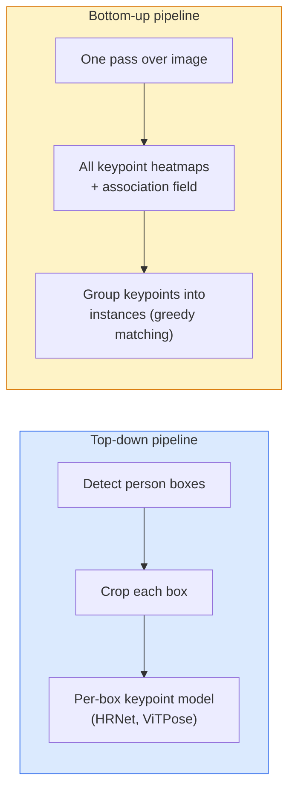

# कुंजी बिंदु का पता लगाना और स्थिति अनुमान

> एक आसन एक समूह कीवर्ड है। एक कीवर्ड डिटेक्टर एक हीटमैप रेग्रेसर है। बाकी सब कुछ लेखांकन है।

**Type:** Build
**Languages:** Python
**Prerequisites:** Phase 4 Lesson 06 (Detection), Phase 4 Lesson 07 (U-Net)
**Time:** ~45 分钟

## 学习目标
- 区分 ऊपर-नीचे और नीचे-ऊपर स्थिति अनुमान,并说明各自何时使用
- उपयोग Gaussian-प्रति कुंजी बिंदु लक्ष्य के लिए K 个 कुंजी बिंदुओं रिग्रेशन हीटमैप, और निष्कर्ष 提提取 कुंजी बिंदु निर्देशांक
- 解释 भाग आत्मीयता क्षेत्र (PAFs), तथा नीचे-ऊपर पाइपलाइन  कैसे 关联成 उदाहरण
- उपयोग मीडियापाइप पोज़ या एमएमपीओज़ उत्पादन स्तर की कुंजी बिंदु अनुमान बनाने, और उनके आउटपुट प्रारूप को समझने

## 问题
मुख्य कार्य There are many names:human pose ((17 个体关节) 、face landmarks ((68 या 478 个点) 、hand ((21 个点) 、animal pose、robotic object pose、medical anatomy landmarks──它们都共享同一个结构:在一个物体上检测 K 个离散点,并输出它们的 (x, y) निर्देशांक──

आसन अनुमान गति कैप्चर है, फिटनेस ऐप, खेल विश्लेषण, इशारा नियंत्रण, एनीमेशन, एआर परीक्षण और रोबोटिक पकड़ के आधार पर है।

工程问题在于尺度──单图、单人 Pose 是一个20ms 问题──人群中的多人 Pose 要在30fps下运行,则是一个完全不同的结构问题──

## 概念
### ऊपर-नीचे बनाम नीचे-ऊपर



- **Top-down** पहले लोगों का परीक्षण करें, प्रत्येक फसल पर पुनः काम करें 运行 प्रति व्यक्ति कीवर्ड मॉडल── सटीकता दर उच्चतम; साथ ही लोगों की संख्या में वृद्धि हो।
- **Bottom-up** एक बार आगे गुजरें 预测 सभी कुंजी बिंदुओं के साथ एक संघ क्षेत्र; पुनः उन्हें विभाजित करें  भीड़ का आकार 如何, खपत समय恒定──

शीर्ष-नीचे (HRNet, ViTPose) = सही रैंकिंग अग्रणी योजना; नीचे-ऊपर (OpenPose, HigherHRNet) = भीड़भाड़ वाली दृश्यों के बीच में संचलन अग्रणी योजना।

### हीटमैप रिग्रेशन

सीधे नहीं वापसी`(x, y)`, बल्कि प्रत्येक कुंजी बिंदु के लिए एक        `H x W`गर्मी नक्शा, वास्तविक स्थान के केंद्र में एक गौसीन ब्लेब है।

```
target[k, y, x] = exp(-((x - cx_k)^2 + (y - cy_k)^2) / (2 sigma^2))
```

निष्कर्ष में, प्रत्येक हीटमैप के argmax = पूर्वानुमान की कुंजी बिंदु स्थान है

क्यों हीटमैप प्रत्यक्ष प्रतिगमन से बेहतर हैंः नेटवर्क का अंतरिक्ष संरचना (conv सुविधा मानचित्र) प्राकृतिक के लिए तैयार अंतरिक्ष आउटपुट;;गॉसियन लक्ष्य भी नियमितता के प्रभाव पर उठते हैं  लघु स्थानिकरण त्रुटि  उत्पन्न होती है  कम हानि, बजाय शून्य 

### उपपिक्सेल स्थानिकरण

Argmax  give integer坐标── उप-पिक्सेल सटीकता प्राप्त करने के लिए, argmax  और उसके आस-पास के क्षेत्रों के लिए उपयुक्त पैराबॉल, या उपयोग के लिए सामान्य ऑफसेट `(dx, dy) = 0.25 * (heatmap[y, x+1] - heatmap[y, x-1], ...)`दिशाएँ

### भाग संबद्धता क्षेत्र (PAFs)

OpenPose नीचे-ऊपर संघ की तकनीक के साथ उपयोग किया जाता है। प्रत्येक जोड़े के लिए लिंक की कुंजी बिंदुओं के लिए (उदाहरण के लिए बाएं कंधे से बाएं कंधे तक), एक 2-चैनल क्षेत्र की भविष्यवाणी करें, एक बिंदु से दूसरे बिंदु की ओर इशारा करने वाले इकाई वेक्टर को कोड करें।

```
For each connection (limb):
  PAF channels: 2 (unit vector x, y)
  Line integral: sum over sample points of (PAF . line_direction)
  Higher integral = stronger match
```

यह विधि सुंदर है और प्रति व्यक्ति फसल की आवश्यकता नहीं है।

### COCO कुंजी बिंदु

标准的体姿数据集:每个人 17 个关键点,使用PCK (Procent of Correct Keypoints) 和OKS (OJECT Keypoint Similarity)作为指标──OKS 是 IoU के कीपॉइंट एनालॉग,也是COCO mAP@OKS 报告的指标──

### 2D बनाम 3D

- **2D pose** छवि निर्देशांक; उत्पादन गुणवत्ता प्राप्त कर चुकी है
- **3D pose** दुनिया / कैमरा निर्देशांक; अभी भी सक्रिय अनुसंधान दिशाएँ──常见方法:
  - एक छोटे से MLP के साथ 2D भविष्यवाणियों 3D में ऊपर उठाने के लिए होगा
  - 直接从图像做3D regression(PyMAF, MHFormer)
  - बहु-दृश्य सेटअप (सीएमयू पैनॉप्टिक) जमीन सत्य के लिए उपयोग किया जाता है


```figure
cv3-pose-heatmap
```

##  इसे निर्माण
### 步骤 1: गौशियन हीटमैप लक्ष्य

```python
import numpy as np
import torch

def gaussian_heatmap(size, cx, cy, sigma=2.0):
    yy, xx = np.meshgrid(np.arange(size), np.arange(size), indexing="ij")
    return np.exp(-((xx - cx) ** 2 + (yy - cy) ** 2) / (2 * sigma ** 2)).astype(np.float32)

hm = gaussian_heatmap(64, 32, 32, sigma=2.0)
print(f"peak: {hm.max():.3f} at ({hm.argmax() % 64}, {hm.argmax() // 64})")
```

 चैनल अक्ष के साथ  कुंजी बिंदु प्रति गर्मी मानचित्रों को ढेर, हम पूर्ण लक्ष्य tensor प्राप्त करते हैं 

### 步骤 2: छोटे कुंजी बिंदु सिर

एक यू-नेट शैली मॉडल, आउटपुट K 个 हीटमैप चैनल

```python
import torch.nn as nn
import torch.nn.functional as F

class TinyKeypointNet(nn.Module):
    def __init__(self, num_keypoints=4, base=16):
        super().__init__()
        self.down1 = nn.Sequential(nn.Conv2d(3, base, 3, 2, 1), nn.ReLU(inplace=True))
        self.down2 = nn.Sequential(nn.Conv2d(base, base * 2, 3, 2, 1), nn.ReLU(inplace=True))
        self.mid = nn.Sequential(nn.Conv2d(base * 2, base * 2, 3, 1, 1), nn.ReLU(inplace=True))
        self.up1 = nn.ConvTranspose2d(base * 2, base, 2, 2)
        self.up2 = nn.ConvTranspose2d(base, num_keypoints, 2, 2)

    def forward(self, x):
        h1 = self.down1(x)
        h2 = self.down2(h1)
        h3 = self.mid(h2)
        u1 = self.up1(h3)
        return self.up2(u1)
```

输入 `(N, 3, H, W)`, आउटपुट`(N, K, H, W)`                                                                                                                                                                                                                                                              

### 步骤 3: इन्फरेंस  कुंजी बिंदु निर्देशांक निकालें

```python
def heatmap_to_coords(heatmaps):
    """
    heatmaps: (N, K, H, W)
    returns:  (N, K, 2) float coordinates in image pixels
    """
    N, K, H, W = heatmaps.shape
    hm = heatmaps.reshape(N, K, -1)
    idx = hm.argmax(dim=-1)
    ys = (idx // W).float()
    xs = (idx % W).float()
    return torch.stack([xs, ys], dim=-1)

coords = heatmap_to_coords(torch.randn(2, 4, 32, 32))
print(f"coords: {coords.shape}")  # (2, 4, 2)
```

इन्फेरेंस 时只需一行── उप-पिक्सेल परिष्करण के लिए,在 argmax 周围插值──

### 步骤 4: सिंथेटिक कुंजी बिंदु डेटासेट

很简单: 白色帆布上画四个点,并学习预测它们──

```python
def make_synthetic_sample(size=64):
    img = np.ones((3, size, size), dtype=np.float32)
    rng = np.random.default_rng()
    kps = rng.integers(8, size - 8, size=(4, 2))
    for cx, cy in kps:
        img[:, cy - 2:cy + 2, cx - 2:cx + 2] = 0.0
    hms = np.stack([gaussian_heatmap(size, cx, cy) for cx, cy in kps])
    return img, hms, kps
```

यह काम काफी सरल है, छोटा मॉडल एक मिनट में इसे सीख सकता है।

### 步骤 5: प्रशिक्षण

```python
model = TinyKeypointNet(num_keypoints=4)
opt = torch.optim.Adam(model.parameters(), lr=3e-3)

for step in range(200):
    batch = [make_synthetic_sample() for _ in range(16)]
    imgs = torch.from_numpy(np.stack([b[0] for b in batch]))
    hms = torch.from_numpy(np.stack([b[1] for b in batch]))
    pred = model(imgs)
    # Upsample pred to full resolution
    pred = F.interpolate(pred, size=hms.shape[-2:], mode="bilinear", align_corners=False)
    loss = F.mse_loss(pred, hms)
    opt.zero_grad(); loss.backward(); opt.step()
```

## इसका उपयोग करें
- **MediaPipe Pose** Google का उत्पादन स्तर की स्थिति अनुमानक; प्रदान वेबजीएल + मोबाइल रनटाइम, देरी 10ms से कम है।
- **MMPose**(OpenMMLab)  全面的研究代码库; समाहित प्रत्येक प्रकार की SOTA वास्तुकला 及 पूर्व प्रशिक्षित वजन──
- **YOLOv8-pose**                                                                                                                                                                                                                                                              
- **transformers HumanDPT / PoseAnything** खुले शब्दावली की स्थिति के साथ किसी भी वस्तु के लिए प्रयोग किया गया है, किसी भी कुंजी बिंदु सेट के लिए)

## 交付 यह
本课产出:

- `outputs/prompt-pose-stack-picker.md` एक संकेत, लटेंसी, भीड़ के आकार के आधार पर, तथा 2D बनाम 3D  आवश्यकता MediaPipe / YOLOv8-pose / HRNet / ViTPose को चुनें。
- `outputs/skill-heatmap-to-coords.md` एक कौशल, प्रत्येक उत्पादन स्थिति मॉडल को लिखने के लिए उपयोग किया जाता है  उप-पिक्सेल हीटमैप-को-ऑर्डिनेटेड रूटीन

## अभ्यास
1. **(Easy)**संश्लेषित 4-बिंदु डेटासेट में ऊपर प्रशिक्षण छोटे कुंजी बिंदु मॉडल―― रिपोर्ट 200 कदम पश्चात पूर्वानुमानित और सही कुंजी बिंदु  के बीच औसत L2 त्रुटि──
2. **(Medium)**添加子像素精炼:给定 argmax स्थिति,沿 x 和 y 方向使用邻近像素 拟合1D पैराbola──报告对整数 argmax的精度增──
3. **(Hard)**️ एक 2 व्यक्ति सिंथेटिक डेटासेट का निर्माण करें, जिसमें से प्रत्येक छवि ️ दो 4-की पॉइंट पैटर्न उदाहरण दिखाए️ प्रशिक्षण एक PAF के साथ नीचे-ऊपर पाइपलाइन, पूर्वानुमान कौन सा कुंजी बिंदु ️ किस उदाहरण का है,并评估 OKS️

## 关键术语
| Term | 人们怎么说 | 它实际是什么意思 |
|------|----------------|----------------------|
| Keypoint | "一个 landmark" | object 上的一个特定有序点（joint、corner、feature） |
| Pose | "skeleton" | 属于一个 instance 的一组有序 keypoints |
| Top-down | "先 detect，再 pose" | Two-stage pipeline：person detector + per-crop keypoint model；准确率最高 |
| Bottom-up | "先 pose，后 group" | Single-pass all-keypoint prediction + grouping；在 crowd size 上耗时恒定 |
| Heatmap | "Gaussian target" | 每个 keypoint 一个 H x W tensor，峰值位于真实位置；首选的 Regression target |
| PAF | "Part Affinity Field" | 编码 limb directions 的 2-channel unit vector field；用于把 keypoints 分组为 instances |
| OKS | "Keypoint IoU" | Object Keypoint Similarity；COCO 的 pose metric |
| HRNet | "High-Resolution Net" | 主流 top-down keypoint architecture；全程保留 high-res features |

## 延伸阅读
- [OpenPose (Cao et al., 2017)](https://arxiv.org/abs/1812.08008) PAFs का उपयोग नीचे-ऊपर; अभी भी इस विधि का सबसे अच्छा विवरण सामग्री है
- [HRNet (Sun et al., 2019)](https://arxiv.org/abs/1902.09212) ऊपर से नीचे 参考架构
- [ViTPose (Xu et al., 2022)](https://arxiv.org/abs/2204.12484) उपयोग सादा ViT 作为 मुद्रा रीढ़ की हड्डी;
- [MediaPipe Pose](https://developers.google.com/mediapipe/solutions/vision/pose_landmarker) 生产级实时姿;2026年部署最快的堆
