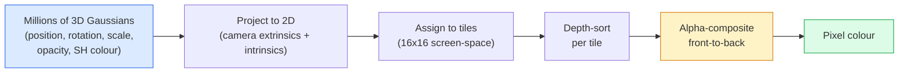

# 3 डी गैसियन स्प्लैटिंग को शून्य से प्राप्त करने के लिए

> एक दृश्य एक समूह है जिसमें लाखों 3 डी गौसीयन ँ शामिल हैं ँ। प्रत्येक गौसीयन शहर में स्थिति, अभिविन्यास, पैमाने, अस्पष्टता, साथ ही एक दृश्य दिशा पर निर्भर रंग ँ है ँ।

**类型：**构建
**语言：**पायथन
**先修要求：**चरण 4 पाठ 13 (3D Vision & NeRF) चरण 1 पाठ 12 (टेन्सर ऑपरेशन) चरण 4 पाठ 10 (विभाजन मूल बातें वैकल्पिक)
**时间：**≈ 90 मिनट

## 学习目标

- explication why till 2026 years, 3D Gaussian Splating  ने नेआरएफ को बदल दिया है, जो फोटोरेलिस्टिक 3D पुनर्निर्माण का उत्पादन मानक योजना बन गया है
- प्रत्येक गौसीयन के छह वर्गों के तत्वों को वर्णन करना (स्थिति, घूर्णन चतुर्भुज, पैमाने, अस्पष्टता, गोलाकार सामंजस्य रंग, वैकल्पिक विशेषता), तथा प्रत्येक वर्ग में कितने योगदान हैं
-                                                                                                                                                                                                                                                                                                                                                                                                                                                                                                                              `alpha`रचना के 2 डी Gaussian splating rasterizer, फिर 3 डी  स्थिति कैसे एक ही चक्र में परिलक्षित करने के लिए बताता है
- उपयोग `nerfstudio``gsplat`या `SuperSplat`20-50 张照片 एक दृश्य का पुनर्निर्माण,并导出为 `KHR_gaussian_splatting`glTF विस्तार या OpenUSD 26.03 `UsdVolParticleField3DGaussianSplat`योजना

## 问题

NeRF एक MLP के वजन के लिए दृश्य भंडारण करेगा। प्रत्येक पिक्सेल को एक रे के साथ एक MLP क्वेरी करने की आवश्यकता होती है। प्रशिक्षण में कुछ घंटे लगते हैं, रैंकिंग में कुछ सेकंड लगते हैं, और वजन को संपादित नहीं किया जा सकता है। यदि आप एक कुर्सी को स्थानांतरित करना चाहते हैं, तो आपको फिर से प्रशिक्षण देना होगा।

3 डी गौसीयन स्प्लैटिंग(Kerbl、Kopanas、Leimkühler、Drettakis,SIGGRAPH 2023) ने यह सब कुछ बदल दिया है। एक दृश्य एक स्पष्ट 3 डी गौसीयन 集合 है। 染色 GPU पर 100+ fps  पर किए गए रास्टराइजेशन में किया जाता है। प्रशिक्षण केवल कुछ मिनटों की आवश्यकता होती है। संपादन सीधे हैः平移部分 गौसीयन, आप बस चौरस में हैं। 2026 तक, क्रोनोस समूह ने गौसीयन स्प्लैट्स के लिए ग्लोफ एक्सटेंशन, ओपनयूएसडी 26.03  पहले से ही अंतर्निहित गौसीयन स्प्लैट स्कीम, ज़िललो और रेंडर अपार्टमेंट सामग्री का उपयोग किया है, जबकि अधिकांश 3 डी पुनर्निर्माण के बारे में नए शोध लेख सभी कोर 3 डी जीएस विचारधारा के परिवर्तन हैं।

मन का मॉडल बहुत सरल है, लेकिन गणित में पर्याप्त गतिविधि भाग हैं, ताकि अधिकांश परिचय रास्टरीकरण से शुरू हो, फिर प्रोजेक्शन और गोलाकार सामंजस्यों से कूद जाए।

## 核心概念

### एक गौशियन  क्या ले जाने के लिए

एक 3 डी गौशियन अंतरिक्ष में एक पैरामीटर ब्लाब है, जिसमें ये गुण हैंः

```
position         mu         (3,)    centre in world coordinates
rotation         q          (4,)    unit quaternion encoding orientation
scale            s          (3,)    log-scales per axis (exponentiated at render time)
opacity          alpha      (1,)    post-sigmoid opacity [0, 1]
SH coefficients  c_lm       (3 * (L+1)^2,)   view-dependent colour
```

घूर्णन + पैमाने एक 3x3 सह-परिवर्तन का निर्माण करेगाः`Sigma = R S S^T R^T` यही गौशियन  3D में आकार है गोलाकार सामंजस्य  रंग  देखने की दिशा  परिवर्तन: विशिष्ट हाइलाइट्स 微微 चमक दृश्य-निर्भर चमक, प्रति दृश्य बनावटों को संग्रहीत करने की आवश्यकता नहीं है SH डिग्री 3  का उपयोग करें, प्रत्येक रंग चैनल में 16  गुणांक हैं, यानि प्रत्येक गौशियन  केवल रंग  48  फ्लोट  की आवश्यकता है

एक दृश्य में आमतौर पर 1-5 मिलियन गौसीयन होते हैं। प्रत्येक में लगभग 60 फ्लोट संग्रहीत होते हैं। 3 + 4 + 3 + 1 + 48 + मिक्स) । एक पांच मिलियन गौसीयन दृश्य लगभग 240 एमबी है, जो प्रति बिंदु बनावट के बराबर बिंदु बादल के साथ होता है, जो उच्च रिज़ॉल्यूशन में पुनः प्रस्तुत किए गए NeRF MLP वजन के बराबर होता है।

### यह रेस्टराइजिंग है, न कि रेत मार्चिंग



五个步骤,全都对 GPU友好──没有每像素的 MLP查询──一张RTX 3080 Ti 可以在 147fps 染 600万个位置──

### प्रक्षेपण 步骤

 स्थित विश्व `mu`、 3D सह-परिवर्तन `Sigma`3 डी Gaussian, स्क्रीन स्थिति के लिए एक तस्वीर `mu'`、 2D सह-परिवर्तन `Sigma'`का 2 डी गौशियन:

```
mu' = project(mu)
Sigma' = J W Sigma W^T J^T          (2 x 2)

W = viewing transform (rotation + translation of camera)
J = Jacobian of the perspective projection at mu'
```

2D Gaussian के पदचिह्न एक दीर्घवृत्त है, उसके轴是`Sigma'`इस दीर्घवृत्त के प्रत्येक पिक्सेल को इस गौशियन के योगदान का अधिग्रहण होता है, जिसका वजन `exp(-0.5 * (p - mu')^T Sigma'^-1 (p - mu'))`

### अल्फा-संयोजन 规则

对于一个像素,覆盖它的高ussians会按前向排序 排序 排序 排序 排序 排序 排序 排序 排序 排序 排序 排序 排序 排序 排序 排序 排序 排序 排序 排序 排序 排序 排序 排序 排序 排序 排序 排序 排序 排序 排序 排序 排序 排序 排序 排序 排序 排序 排序 排序 排序 排序 排序 排序 排序 排序 排序 排序 排序 排序 排序 排序 排序 排序 排序 排序 排序 排序 排序 排序 排序 排序 排序 排序 排序 排序 排序 排序 排序 排序 排序 排序 排序 排序 排序 排序 排序 排序 排序 排序 排序 排序 排序 排序 排序 排序 排序 排序 排序 排序 排序 排序 排序 排序 排序 排序 排序 排序 排序 排序 排序 排序 排序 排序 排序 排序 排序 排序 排序 排序 排序 排序 排序 排序 排序 排排排排排排排 排 排 排 排 排 排 排 排 排 排 排 排 排 排 排 排 排 排 排 排 排 排 排 排 排 排 排 排 排 排 排 排 排 排 排 排 排 排 排 排 排 排 排 排 排 排 排 排 排 排 排 排 排 排 排 排 排 排 排 排 排 排 排 排 排 排 排 排 排 排 排

```
C_pixel = sum_i alpha_i * T_i * c_i

T_i = prod_{j < i} (1 - alpha_j)       transmittance up to i
alpha_i = opacity_i * exp(-0.5 * d^T Sigma'^-1 d)   local contribution
c_i = eval_SH(SH_i, view_direction)    view-dependent colour
```

यह के साथ**NeRF 的 volumetric render 是同一个方程**, केवल इस तथ्य के बावजूद कि यह एक स्पष्ट दुर्लभ गौसीन संच पर गणना करता है, न कि कि एक किरण के ऊपर घने नमूनों पर गणना करता है।

### क्यों यह अंतर करने योग्य है

प्रत्येक चरण:प्रोजेक्शन, टाइल असाइनमेंट, अल्फा कंपोजिटिंग, एसएच मूल्यांकन, सभी के मुकाबले गौशियन 参数 is differentiable के लिए ⋅ दिए गए ग्राउंड-सत्य छवि, गणना रेंडर पिक्सेल हानि, रास्टरर के माध्यम से  बैकप्रॉप करें, ग्रेडिएंट निस्तारण 更新所有`(mu, q, s, alpha, c_lm)` लगभग 30,000 बार पुनरावृत्ति के बाद, Gaussians सही स्थान, आकार और रंग मिलेगा

### घनत्व और काटने

                                                                                                                                                                                                                                                              

- **Clone**: किसी गौशियन का ग्रेडिएंट परिमाण  बहुत उच्च है लेकिन पैमाने  बहुत छोटा है, इसके वर्तमान स्थान पर एक गौशियन को विकसित करना है।
- **Split**: जब किसी बड़े पैमाने पर गौसी का ग्रेडिएंट 很高时, इसे दो छोटे गौसी में तोड़ देगा।
- **Prune**: हटाने अस्पष्टता 低于值的 गौशियन──它们没有贡献──

घनत्व प्रत्येक N बार पुनरावृत्ति 运行一次── एक परिदृश्य आमतौर पर लगभग 100k 个初始高西人 (SfM बिंदुओं द्वारा प्रारम्भिक) से प्रशिक्षण के समाप्त होने तक 1-5M तक बढ़ता है──

### उपयोग एक वाक्य में गोलाकार हार्मोनिक्स को समझने के लिए

दृश्य-निर्भर रंग है इकाई गेंद सतह पर फ़ंक्शन `c(direction)` गोलाकार सामंजस्य बल पर फ़ुअरी आधार है  डिग्री तक काटि़ गई है `L`, प्रत्येक चैनल मिलेगा`(L+1)^2`个 आधार फ़ंक्शन── एक नए दृष्टिकोण से रंग का आकलन करने के लिए,就是将学到的SH गुणांक与在观测方向上求值的基础做点产品──डिग्री 0 = एक गुणांक = निरंतर रंग──डिग्री 3 = 16 个 गुणांक = 足以捕捉到兰伯特色、स्पेक्सुलर 和轻微反射──3D गौशियन स्प्लैटिंग 论文默认使用度 3──

### 2026 साल की उत्पादन तकनीक

```
1. Capture         smartphone / DJI drone / handheld scanner
2. SfM / MVS       COLMAP or GLOMAP derives camera poses + sparse points
3. Train 3DGS      nerfstudio / gsplat / inria official / PostShot (~10-30 min on RTX 4090)
4. Edit            SuperSplat / SplatForge (clean floaters, segment)
5. Export          .ply -> glTF KHR_gaussian_splatting or .usd (OpenUSD 26.03)
6. View            Cesium / Unreal / Babylon.js / Three.js / Vision Pro
```

### 4D के साथ जनरेटिव 变体

- **4D Gaussian Splatting**:Gaussians is the time of time function; प्रयोग किया जाता है volumetric वीडियो(सुपरमैन 2026, ए $एपी रॉकी के "हेलीकॉप्टर")
- **Generative splats**: पाठ-से-स्पलैट मॉडल ((वर्ल्ड लैब्स की मर्मर), हम पूर्ण दृश्य से बाहर होश में आ सकते हैं
- **3D Gaussian Unscented Transform**:NVIDIA NuRec स्वायत्त ड्राइविंग सिमुलेशन के लिए उपयोग किया जाता है


```figure
cv3-gaussian-splat
```

##  इसे निर्माण

### 步骤 1: एक 2D गौशियन

हम पहले एक 2D रास्टर बनाने के लिए हैं।

```python
import torch
import torch.nn as nn
import torch.nn.functional as F


def eval_2d_gaussian(means, covs, points):
    """
    means:  (G, 2)      centres
    covs:   (G, 2, 2)   covariance matrices
    points: (H, W, 2)   pixel coordinates
    returns: (G, H, W)  density at every pixel for every Gaussian
    """
    G = means.size(0)
    H, W, _ = points.shape
    flat = points.view(-1, 2)
    inv = torch.linalg.inv(covs)
    diff = flat[None, :, :] - means[:, None, :]
    d = torch.einsum("gpi,gij,gpj->gp", diff, inv, diff)
    density = torch.exp(-0.5 * d)
    return density.view(G, H, W)
```

`einsum`会对每 (गॉसियन, पिक्सेल) जोड़ी 计算平方形式 `diff^T Sigma^-1 diff`

### 步骤 2:2D स्प्लैटिंग रास्टर

आगे-पीछे अल्फा-संयोजन──2डी में गहराई 没有意义,所以我们使用一个学会的每高斯式尺度来表示顺序──

```python
def rasterise_2d(means, covs, colours, opacities, depths, image_size):
    """
    means:     (G, 2)
    covs:      (G, 2, 2)
    colours:   (G, 3)
    opacities: (G,)     in [0, 1]
    depths:    (G,)     per-Gaussian scalar used for ordering
    image_size: (H, W)
    returns:   (H, W, 3) rendered image
    """
    H, W = image_size
    yy, xx = torch.meshgrid(
        torch.arange(H, dtype=torch.float32, device=means.device),
        torch.arange(W, dtype=torch.float32, device=means.device),
        indexing="ij",
    )
    points = torch.stack([xx, yy], dim=-1)

    densities = eval_2d_gaussian(means, covs, points)
    alphas = opacities[:, None, None] * densities
    alphas = alphas.clamp(0.0, 0.99)

    order = torch.argsort(depths)
    alphas = alphas[order]
    colours_sorted = colours[order]

    T = torch.ones(H, W, device=means.device)
    out = torch.zeros(H, W, 3, device=means.device)
    for i in range(means.size(0)):
        a = alphas[i]
        out += (T * a)[..., None] * colours_sorted[i][None, None, :]
        T = T * (1.0 - a)
    return out
```

यह जल्दी नहीं है, वास्तव में टाइल आधारित CUDA कर्नेल का उपयोग किया जाएगा, लेकिन गणित पूरी तरह से सही है, और पूरी तरह से भेदभाव योग्य है।

### चरण 3: एक प्रशिक्षित 2 डी स्प्लैट दृश्य

```python
class Splats2D(nn.Module):
    def __init__(self, num_splats=128, image_size=64, seed=0):
        super().__init__()
        g = torch.Generator().manual_seed(seed)
        H, W = image_size, image_size
        self.means = nn.Parameter(torch.rand(num_splats, 2, generator=g) * torch.tensor([W, H]))
        self.log_scale = nn.Parameter(torch.ones(num_splats, 2) * math.log(2.0))
        self.rot = nn.Parameter(torch.zeros(num_splats))  # single angle in 2D
        self.colour_logits = nn.Parameter(torch.randn(num_splats, 3, generator=g) * 0.5)
        self.opacity_logit = nn.Parameter(torch.zeros(num_splats))
        self.depth = nn.Parameter(torch.rand(num_splats, generator=g))

    def covs(self):
        s = torch.exp(self.log_scale)
        c, si = torch.cos(self.rot), torch.sin(self.rot)
        R = torch.stack([
            torch.stack([c, -si], dim=-1),
            torch.stack([si, c], dim=-1),
        ], dim=-2)
        S = torch.diag_embed(s ** 2)
        return R @ S @ R.transpose(-1, -2)

    def forward(self, image_size):
        covs = self.covs()
        colours = torch.sigmoid(self.colour_logits)
        opacities = torch.sigmoid(self.opacity_logit)
        return rasterise_2d(self.means, covs, colours, opacities, self.depth, image_size)
```

`log_scale``opacity_logit`和 `colour_logits`                                                                                                                                                                                                                                                              

### 步骤 4: 2D Gaussians को लक्ष्य छवि के लिए उपयुक्त बनाने

```python
import math
import numpy as np

def make_target(size=64):
    yy, xx = np.meshgrid(np.arange(size), np.arange(size), indexing="ij")
    img = np.zeros((size, size, 3), dtype=np.float32)
    # Red circle
    mask = (xx - 20) ** 2 + (yy - 20) ** 2 < 10 ** 2
    img[mask] = [1.0, 0.2, 0.2]
    # Blue square
    mask = (np.abs(xx - 45) < 8) & (np.abs(yy - 40) < 8)
    img[mask] = [0.2, 0.3, 1.0]
    return torch.from_numpy(img)


target = make_target(64)
model = Splats2D(num_splats=64, image_size=64)
opt = torch.optim.Adam(model.parameters(), lr=0.05)

for step in range(200):
    pred = model((64, 64))
    loss = F.mse_loss(pred, target)
    opt.zero_grad(); loss.backward(); opt.step()
    if step % 40 == 0:
        print(f"step {step:3d}  mse {loss.item():.4f}")
```

经过200步,64 个高西人会收收到这两个形状中──这是整个思路:在显式几何原始上做渐进下降──

### 步骤 5: 2D से 3D तक

3D  विस्तार  संरक्षण  एक ही चक्र ∙ नया भाग शामिल हैः

1. प्रत्येक गौशियन का घूर्णन एक कोण के बजाय एक चतुर्भुज है।
2. सह-अंतर`R S S^T R^T`, उनमें से `R`द्वारा क्वैटरनियन 构建,`S = diag(exp(log_scale))`
3. प्रक्षेपण `(mu, Sigma) -> (mu', Sigma')`उपयोग कैमरा बाहरी, तथा में `mu`处的视角投影 जैकोबियन。
4. रंग  गोलाकार-हार्मोनिक्स विस्तार में बदल जाता है; दृश्य दिशा में  इसे आकलन करना
5. गहराई-प्रकार वास्तविक कैमरा-स्पेस z से, बल्कि सीखा स्केलार से आया है

प्रत्येक उत्पादन को पूरा करना`gsplat``inria/gaussian-splatting``nerfstudio`) सभी GPU पर टाइल आधारित CUDA कर्नेल के साथ करते हैं

### 步骤 6: गोलाकार हार्मोनिक्स मूल्यांकन

सर्वोच्च तक डिग्री 3 के SH आधार प्रत्येक चैनल में 16 ◦ मूल्यांकनः

```python
def eval_sh_degree_3(sh_coeffs, dirs):
    """
    sh_coeffs: (..., 16, 3)   last dim is RGB channels
    dirs:      (..., 3)       unit vectors
    returns:   (..., 3)
    """
    C0 = 0.282094791773878
    C1 = 0.488602511902920
    C2 = [1.092548430592079, 1.092548430592079,
          0.315391565252520, 1.092548430592079,
          0.546274215296039]
    x, y, z = dirs[..., 0], dirs[..., 1], dirs[..., 2]
    x2, y2, z2 = x * x, y * y, z * z
    xy, yz, xz = x * y, y * z, x * z

    result = C0 * sh_coeffs[..., 0, :]
    result = result - C1 * y[..., None] * sh_coeffs[..., 1, :]
    result = result + C1 * z[..., None] * sh_coeffs[..., 2, :]
    result = result - C1 * x[..., None] * sh_coeffs[..., 3, :]

    result = result + C2[0] * xy[..., None] * sh_coeffs[..., 4, :]
    result = result + C2[1] * yz[..., None] * sh_coeffs[..., 5, :]
    result = result + C2[2] * (2.0 * z2 - x2 - y2)[..., None] * sh_coeffs[..., 6, :]
    result = result + C2[3] * xz[..., None] * sh_coeffs[..., 7, :]
    result = result + C2[4] * (x2 - y2)[..., None] * sh_coeffs[..., 8, :]

    # degree 3 terms omitted here for brevity; full 16-coefficient version in the code file
    return result
```

सीखना `sh_coeffs`存储该高斯的在每个方向上的颜色──在 rendering time,将其与当前视觉方向 求值,就得到一个3向量 RGB──

## इसका उपयोग करें

असली 3DGS 工作请使用 `gsplat`(मेटा) या `nerfstudio`:

```bash
pip install nerfstudio gsplat
ns-download-data example
ns-train splatfacto --data path/to/data
```

`splatfacto`यह एक तंत्रिका स्टूडियो का 3DGS ट्रेनर है।

2026 वर्ष के लिए ध्यान देने योग्य निर्यात विकल्पः

- `.ply`:原始 गौशियन बादल(可移植,文件最大)
- `.splat`:PlayCanvas / सुपरस्प्ले क्वांटिज़्ड 格式──
- glTF `KHR_gaussian_splatting`:Khronos 标准,可在观众 间移植(2026年 2月 RC)
- ओपनयूएसडी `UsdVolParticleField3DGaussianSplat`:USD-नेटिव, NVIDIA Omniverse और Vision Pro पाइपलाइनों के लिए उपयोग किया जाता है

对于4D / गतिशील दृश्यों,`4DGS`和 `Deformable-3DGS`उपयोग समय-विभिन्न साधनों के साथ अस्पष्टता  विस्तार एक ही तंत्र 

## 交付 यह

本课会产出:

- `outputs/prompt-3dgs-capture-planner.md`: एक संकेत, एक विशिष्ट परिदृश्य प्रकार की योजना कैप्चर सत्र के लिए प्रयोग किया जाता है
- `outputs/skill-3dgs-export-router.md`: एक कौशल, के आधार पर उपयोग किया जा रहा है नीचे游 दर्शक या इंजन 选择合适的出口格式(`.ply`/`.splat`/ glTF / USD)

## अभ्यास

1. **（简单）**एक और सिंथेटिक छवि में ऊपर 2D स्प्लैट ट्रेनर ऊपर चल रहा है`num_splats``[16, 64, 256]`मध्य परिवर्तन,并चित्रण प्रत्येक परिस्थिति में MSE बनाम चरण की वक्र---आउट प्राप्ति घटाने बिंदु---
2. **（中等）** विस्तारित 2D rasteriser, इसे प्रति-गॉसियन आरजीबी रंगों का समर्थन करने के लिए, ये रंग  डिग्री-2 हार्मोनिक के माध्यम से  view angle ── एक समूह में लक्ष्य छवि पर प्रशिक्षण,并验证模型能重建二者──
3. **（困难）**क्लोन`nerfstudio`, अपने स्वयं के किसी भी दृश्य के 20 张 तस्वीरें कैप्चर करें`splatfacto`导出到glTF `KHR_gaussian_splatting`, और दर्शक(Three.js `GaussianSplats3D`、SuperSplat、Babylon.js V9) 中打开──報告訓練時間、Gaussians 数量和染 fps──

## 关键术语

| Term | 人们通常怎么说 | 它实际意味着什么 |
|------|----------------|----------------------|
| 3DGS | "Gaussian splats" | 将场景显式表示为数百万个 3D Gaussians，每个 Gaussian 带有 position、rotation、scale、opacity、SH colour |
| Covariance | "Shape of the Gaussian" | `Sigma = R S S^T R^T`；一个 Gaussian 的 orientation 与 anisotropic scale |
| Alpha compositing | "Back-to-front blend" | 与 NeRF 的 volumetric render 相同的方程，但现在作用在显式稀疏集合上 |
| Densification | "Clone and split" | 在 reconstruction under-fit 的位置自适应添加新 Gaussians |
| Pruning | "Delete low-opacity" | 移除训练过程中 opacity 已塌缩到接近零的 Gaussians |
| Spherical harmonics | "View-dependent colour" | 球面上的 Fourier basis；将 colour 存储为 viewing direction 的函数 |
| Splatfacto | "nerfstudio's 3DGS" | 2026 年训练 3DGS 最简单的路径 |
| `KHR_gaussian_splatting` | "glTF standard" | Khronos 2026 extension，使 3DGS 能在 viewers 和 engines 之间移植 |

## 延伸阅读

- [3D Gaussian Splatting for Real-Time Radiance Field Rendering (Kerbl et al., SIGGRAPH 2023)](https://repo-sam.inria.fr/fungraph/3d-gaussian-splatting/) 原始论文
- [gsplat (Meta/nerfstudio)](https://github.com/nerfstudio-project/gsplat) 生产级 CUDA रास्टराइज़र
- [nerfstudio Splatfacto](https://docs.nerf.studio/nerfology/methods/splat.html) 参考 प्रशिक्षण योजना
- [Khronos KHR_gaussian_splatting extension](https://github.com/KhronosGroup/glTF/blob/main/extensions/2.0/Khronos/KHR_gaussian_splatting/README.md) 2026 साल का ट्रांसप्लांट योग्य प्रारूप
- [OpenUSD 26.03 release notes](https://openusd.org/release/) `UsdVolParticleField3DGaussianSplat`योजना
- [THE FUTURE 3D State of Gaussian Splatting 2026](https://www.thefuture3d.com/blog-0/2026/4/4/state-of-gaussian-splatting-2026) 行业概览
