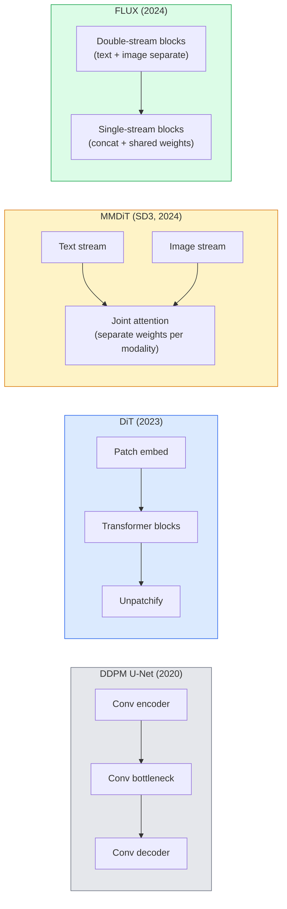

# विसारण ट्रांसफार्मर और सुधारित प्रवाह

> यू-नेट प्रसार का रहस्य नहीं है. इसे ट्रांसफार्मर के रूप में बदल दें, शोर कार्यक्रम को सीधे मार्ग के प्रवाह में बदलें, आप अचानक SD3 ✓ FLUX प्राप्त करते हैं, साथ ही 2026 के प्रत्येक पाठ-से-छवि मॉडल को भी प्राप्त करते हैं।

**类型：**学习 + 构建
**语言：**पायथन
**前置要求：**चरण 4 पाठ 10 (विभाजन डीडीपीएम), चरण 4 पाठ 14 (वीटी), चरण 7 पाठ 02 (स्व-ध्यान)
**时间：** 75 मिनट

## 学习目标

- 追踪 U-Net DDPM(Lection 10) से Diffusion Transformer (DiT) 、MMDiT (SD3), तथा एकल+डबल-स्ट्रीम DiT (FLUX) के विकास तक
-  व्याख्या सुधारित प्रवाहः क्यों शोर और डेटा के बीच की सीधी रेखा 轨迹   के लिए मॉडल 20 चरणों के बजाय 1000 चरणों को पूरा करने के लिए अनुमति देता है
-  एक छोटे से डीटी ब्लॉक और एक सही प्रवाह प्रशिक्षण लूप को प्राप्त करना, दोनों 100 लाइन के भीतर नियंत्रित
- आर्किटेक्चर के अनुसार パラमीटर गिनती 和 लाइसेंसिंग 区分 मॉडल वेरिएंट्स(SD3、FLUX.1-dev、FLUX.1-schnell、Z-Image、Qwen-Image)

## 问题

पाठ 10 यू-नेट डेनोइज़र का उपयोग करके एक डीडीपीएम का निर्माण किया गया। इस संयोजन ने 2020-2023 वर्ष: यू-नेट + बीटा शेड्यूल + शोर-पूर्वानुमान हानि का नेतृत्व किया।

2026 के प्रत्येक अग्रिम पाठ-से-छवि मॉडल से पहले ही यह पार हो चुका है। स्थिर विसारण 3、FLUX、SD4、Z-Image、Qwen-Image、Hunyuan-Image कोई यू-नेट का उपयोग नहीं करता है। वे विसारण ट्रांसफार्मर (DiT) ̊SD3 और FLUX का उपयोग करते हैं।

यह परिवर्तन महत्वपूर्ण है, क्योंकि यह विसारक आधारित छवि उत्पादन है                                                                                                                                                                                                                                                                                                                                                                                                                                                                                                                

## 核心概念

### यू-नेट से ट्रांसफार्मर तक



- **DiT**(पीबल्स और Xie, 2023)  एक समान ViT के साथ ट्रांसफार्मर  बदलना U-नेट, लटेंट पैचों में 上运行── के माध्यम से अनुकूलन परत मानदंड (AdaLN)  कंडीशनिंग किया जाना──
- **MMDiT**(SD3, Esser et al., 2024) 为文字 टोकन和图像 टोकन 使用两个拥有独立权重的流,并共享一个共同关注――
- **FLUX**(ब्लैक फॉरेस्ट लैब्स, 2024) 前 N 个块 像 SD3 一样采用双流,后续块将代币连锁并共享重量(单流),以提高更深层结构的效率──
- **Z-Image**(2025) 6B पैरामीटर के उच्च दक्षता वाले एकल-प्रवाह डीटी ने बिना किसी लागत के विस्तार के विचार को चुनौती दी है।

### 用一段话解释 सुधारित प्रवाह

डीडीपीएम आगे की प्रक्रिया को एक शोर SDE के रूप में परिभाषित करेगा, जिसमें से `x_t`️️️️️️️️️️️️️️️️️️️️️️️️️️️️️️️️️️️️️️️️️️️️️️️️️️️️️️️️️️️️️️️️️️️️️️️️️️️️️️️️️️️️️️️️️️️️️️️️️️️️️️️️️️️️️️️️️️️️️️️️️️️️️️️️️️️️️️️️️️️️️️️️️️️️️️️️️️️️️️️️️️️️️️️️️️️️️️️️️️️️️️️️️️️️️️️️️️️️️️️️️️️️️️️️️️️️️️️️️️️️️️️️️️️️️️️️️️️️️️️️️️️️️️️️️️️️️️️️️️️️️️️️️️️️️️️️️️️️️️️️️️️️️️️️️️️️️️️️️️️️️️️️️️️️️️️️️️️️️️️️️️️️️️️️️️️️️️️️️️️️️️️️️️️️️️️️️️️️️️️️️️️️️️️️️️️️️️️️️️️️️️️️️️️️️️️️️️️️️️️️️️️️️️️️️️️️️️️️️️️️️️️️️️️️️️️️️️️️️️️️️️️️️️️️️️️️️️️️️️️️️️️️️️️️️️️️️️️️️️️️️️️️️️️️️️️️️️️️️️️️️️️️️️️️

शुद्ध प्रवाह  परिभाषित किया साफ़ डेटा और शुद्ध शोर  के बीच**直线**插值:

```
x_t = (1 - t) * x_0 + t * epsilon,     t in [0, 1]
```

 प्रशिक्षण एक नेटवर्क गति का अनुमान लगाने के लिए `v_theta(x_t, t) = epsilon - x_0` यानि साफ डेटा से शोर के सीधे मार्ग की दिशा में आगे की दिशा में`dx_t/dt`)。 उदाहरण के लिए, आप शोर से तरफ़ा डेटा की ओर बढ़ते हुए इस गति को तरफ़ा करते हैं।

SD3 को कहा जाएगा**Rectified Flow Matching**◊FLUX、Z-Image 和大多数 2026 साल मॉडल 使用相同的目标──典型推断:20-30 个 艾勒步骤(确定性),相比旧 DDPM 体系中的 50+ DDIM कदम──蒸 / टर्बो / त्वरण / LCM वेरिएंट इसे 1-4 步 तक घटा सकते हैं

### एडाएलएन कंडीशनिंग

डीटीएस के माध्यम से**adaptive layer norm**में समय चरण 和 वर्ग/पाठ 上做conditioning: सेconditioning वेक्टर 中预测 `scale`和 `shift`, और LayerNorm  के बाद लागू करते हैं. यह यू-नेट में FiLM शैली मॉड्यूलेशन से अधिक शुद्ध है, यह भी प्रत्येक आधुनिक DiT की मानक प्रथा है.

```
cond -> MLP -> (scale, shift, gate)
norm(x) * (1 + scale) + shift, then residual add * gate
```

### SD3 और FLUX के बीच पाठ एन्कोडर

- **SD3**उपयोग तीन पाठ एन्कोडरः दो CLIP मॉडल + T5-XXL。 एम्बेडिंग्स को संश्लेषित किया गया 后作为文字 कंडीशनिंग 送入图像流──
- **FLUX**एक क्लिप-एल + T5-XXL प्रयोग करें
- **Qwen-Image / Z-Image**स्वयं विकसित पाठ एन्कोडरों के लिए अपने आधार LLM के साथ वैरिएंट्स का उपयोग करना

पाठ एन्कोडर SD3/FLUX 之所以比SD1.5更能理解提示的重要原因──单独T5-XXL 就有4.7B पैरामीटर──

### वर्गीकरणकर्ता मुक्त मार्गदर्शन 仍然成立

सुधारित प्रवाह  परिवर्तन नमूना है, न कि कंडीशनिंग। वर्गीकरण मुक्त मार्गदर्शन  प्रशिक्षण समय 10%  संभावना छोड़ दें पाठ, इन्फरेन्स 混合 सशर्त 和 बिना शर्त भविष्यवाणियों) में सुधारित प्रवाह में समान रूप से अनुकूलित।

### स्थिरता  टर्बो  श्नेल  एलसीएम

चार नाम एक ही विचार की ओर इशारा करते हैंः एक धीमी गति से कई चरणों का मॉडल डिस्टिल कर एक त्वरित कुछ चरणों का मॉडल बन जाए。

- **LCM (Latent Consistency Model)** एक छात्र को प्रशिक्षित करें, उसे किसी भी मध्यवर्ती से सक्षम बनाएँ `x_t`एक कदम पूर्वानुमान अंतिम `x_0`
- **SDXL Turbo / FLUX schnell** विरोधी विसारण डिस्टिलिशन का उपयोग  प्रशिक्षण के 1-4 步 मॉडल
- **SD Turbo**将 OpenAI शैली के अनुरूपता मॉडल 适配到潜伏传播──

 किसी भी नए मॉडल के उत्पादन सेवा आमतौर पर एक पूर्ण गुणवत्ता  चेकपॉइंट और एक turbo / quick संस्करण को एक साथ जारी करती है।

### 2026 वर्ष का मॉडल परिदृश्य

| Model | Size | Architecture | License |
|-------|------|--------------|---------|
| Stable Diffusion 3 Medium | 2B | MMDiT | SAI Community |
| Stable Diffusion 3.5 Large | 8B | MMDiT | SAI Community |
| FLUX.1-dev | 12B | Double + Single Stream DiT | non-commercial |
| FLUX.1-schnell | 12B | same, distilled | Apache 2.0 |
| FLUX.2 | — | iterated FLUX.1 | mixed |
| Z-Image | 6B | S3-DiT (Scalable Single-Stream) | permissive |
| Qwen-Image | ~20B | DiT + Qwen text tower | Apache 2.0 |
| Hunyuan-Image-3.0 | ~80B | DiT | research |
| SD4 Turbo | 3B | DiT + distillation | SAI Commercial |

FLUX.1-schnell 2026 वर्ष का ओपन-सोर्स 默认选择──Z-Image 效率 अग्रणी──FLUX.2 和 SD4 वर्तमान गुणवत्ता सबसे भरोसेमंद मॉडल──

### क्यों यह चरण परिवर्तन महत्वपूर्ण है

डीडीपीएम + यू-नेट 能工作──DiT + सुधारित प्रवाह 工作得**更好、更快，并且扩展得更干净**◊ यह परिवर्तन एनएलपी के समान है RNNs से ट्रांसफार्मर के लिए परिवर्तनः दो प्रकार की वास्तुकला                                                                                                                                                                                                                                                                                                                                                                                                                                                                                                  


```figure
cv3-rectified-flow
```

##  इसे निर्माण

### 步骤 1:带 AdaLN का डीटी ब्लॉक

```python
import torch
import torch.nn as nn


class AdaLNZero(nn.Module):
    """
    Adaptive LayerNorm with a gate. Predicts (scale, shift, gate) from the conditioning.
    Init such that the whole block starts as identity ("zero init").
    """

    def __init__(self, dim, cond_dim):
        super().__init__()
        self.norm = nn.LayerNorm(dim, elementwise_affine=False)
        self.mlp = nn.Linear(cond_dim, dim * 3)
        nn.init.zeros_(self.mlp.weight)
        nn.init.zeros_(self.mlp.bias)

    def forward(self, x, cond):
        scale, shift, gate = self.mlp(cond).chunk(3, dim=-1)
        h = self.norm(x) * (1 + scale.unsqueeze(1)) + shift.unsqueeze(1)
        return h, gate.unsqueeze(1)


class DiTBlock(nn.Module):
    def __init__(self, dim=192, heads=3, mlp_ratio=4, cond_dim=192):
        super().__init__()
        self.adaln1 = AdaLNZero(dim, cond_dim)
        self.attn = nn.MultiheadAttention(dim, heads, batch_first=True)
        self.adaln2 = AdaLNZero(dim, cond_dim)
        self.mlp = nn.Sequential(
            nn.Linear(dim, dim * mlp_ratio),
            nn.GELU(),
            nn.Linear(dim * mlp_ratio, dim),
        )

    def forward(self, x, cond):
        h, gate1 = self.adaln1(x, cond)
        a, _ = self.attn(h, h, h, need_weights=False)
        x = x + gate1 * a
        h, gate2 = self.adaln2(x, cond)
        x = x + gate2 * self.mlp(h)
        return x
```

`AdaLNZero`एक शुरुआत पहचान मानचित्रण है, क्योंकि इसके एमएलपी वजन को शून्य के रूप में आरंभ किया गया है। प्रशिक्षण से पहचान से ब्लॉक को धीरे-धीरे शुरू किया जाएगा; यह महत्वपूर्ण रूप से गहरे स्तरीय ट्रांसफार्मर विसारण मॉडल को स्थिर करेगा।

### 步骤 2: एक छोटी सी डीआईटी

```python
def timestep_embedding(t, dim):
    import math
    half = dim // 2
    freqs = torch.exp(-math.log(10000) * torch.arange(half, device=t.device) / half)
    args = t[:, None].float() * freqs[None]
    return torch.cat([args.sin(), args.cos()], dim=-1)


class TinyDiT(nn.Module):
    def __init__(self, image_size=16, patch_size=2, in_channels=3, dim=96, depth=4, heads=3):
        super().__init__()
        self.patch_size = patch_size
        self.num_patches = (image_size // patch_size) ** 2
        self.patch = nn.Conv2d(in_channels, dim, kernel_size=patch_size, stride=patch_size)
        self.pos = nn.Parameter(torch.zeros(1, self.num_patches, dim))
        self.time_mlp = nn.Sequential(
            nn.Linear(dim, dim * 2),
            nn.SiLU(),
            nn.Linear(dim * 2, dim),
        )
        self.blocks = nn.ModuleList([DiTBlock(dim, heads, cond_dim=dim) for _ in range(depth)])
        self.norm_out = nn.LayerNorm(dim, elementwise_affine=False)
        self.head = nn.Linear(dim, patch_size * patch_size * in_channels)

    def forward(self, x, t):
        n = x.size(0)
        x = self.patch(x)
        x = x.flatten(2).transpose(1, 2) + self.pos
        t_emb = self.time_mlp(timestep_embedding(t, self.pos.size(-1)))
        for blk in self.blocks:
            x = blk(x, t_emb)
        x = self.norm_out(x)
        x = self.head(x)
        return self._unpatchify(x, n)

    def _unpatchify(self, x, n):
        p = self.patch_size
        h = w = int(self.num_patches ** 0.5)
        x = x.view(n, h, w, p, p, -1).permute(0, 5, 1, 3, 2, 4).reshape(n, -1, h * p, w * p)
        return x
```

### 步骤 3: सुधारित प्रवाह प्रशिक्षण

```python
import torch.nn.functional as F

def rectified_flow_train_step(model, x0, optimizer, device):
    model.train()
    x0 = x0.to(device)
    n = x0.size(0)
    t = torch.rand(n, device=device)
    epsilon = torch.randn_like(x0)
    x_t = (1 - t[:, None, None, None]) * x0 + t[:, None, None, None] * epsilon

    target_velocity = epsilon - x0
    pred_velocity = model(x_t, t)

    loss = F.mse_loss(pred_velocity, target_velocity)
    optimizer.zero_grad()
    loss.backward()
    optimizer.step()
    return loss.item()
```

DDPM के साथ शोर-पूर्वानुमान हानि ((10 प) 相比: संरचना समान, लक्ष्य अलग──我们不再预测噪音 `epsilon`, बल्कि पूर्वानुमान **velocity** `epsilon - x_0`, यह डेटा से ध्वनि की ओर सीधे दिशा में प्रवेश करता है।

### 步骤 4:ईलर नमूना

सुधारित प्रवाह एक ओडीई है। ईलर की विधि सबसे सरल विधि है, और एक अच्छी प्रशिक्षित सुधारित प्रवाह मॉडल के लिए, 20+ चरणों में  लगभग उच्च-क्रम के हलकों के साथ एक ही सटीक है।

```python
@torch.no_grad()
def rectified_flow_sample(model, shape, steps=20, device="cpu"):
    model.eval()
    x = torch.randn(shape, device=device)
    dt = 1.0 / steps
    t = torch.ones(shape[0], device=device)
    for _ in range(steps):
        v = model(x, t)
        x = x - dt * v
        t = t - dt
    return x
```

20 步── एक अच्छी प्रशिक्षण मॉडल में, यह 1000-चरण डीडीपीएम के मुकाबले नमूने उत्पन्न करेगा──

### 步骤 5: अंत तक धुएं का परीक्षण

```python
import numpy as np

def synthetic_blobs(num=200, size=16, seed=0):
    rng = np.random.default_rng(seed)
    out = np.zeros((num, 3, size, size), dtype=np.float32)
    yy, xx = np.meshgrid(np.arange(size), np.arange(size), indexing="ij")
    for i in range(num):
        cx, cy = rng.uniform(4, size - 4, size=2)
        r = rng.uniform(2, 4)
        mask = (xx - cx) ** 2 + (yy - cy) ** 2 < r ** 2
        colour = rng.uniform(-1, 1, size=3)
        for c in range(3):
            out[i, c][mask] = colour[c]
    return torch.from_numpy(out)
```

इस डेटाबेस पर सही प्रवाह के साथ प्रशिक्षण एक ।`TinyDiT`◊500 कदम ◊500 कदम ◊500 कदम ◊500 कदम ◊500 कदम ◊500 कदम ◊500 कदम ◊500 कदम ◊500 कदम ◊500 कदम ◊500 कदम ◊500 कदम ◊500 कदम ◊500 कदम ◊500 कदम ◊500 कदम ◊500 कदम ◊500 कदम ◊500 कदम ◊500 कदम ◊500 कदम ◊500 कदम ◊500 कदम ◊500 कदम ◊500 कदम ◊500 कदम ◊500 कदम ◊500 कदम ◊500 कदम ◊500 कदम ◊500 कदम ◊500 कदम ◊500 कदम ◊500 कदम ◊500 कदम ◊500 कदम ◊500 कदम ◊500 कदम ◊500 कदम ◊500 कदम ◊5 कदम ◊5 कदम ◊5 कदम ◊5 कदम ◊5 कदम ◊5 कदम ◊5 कदम ◊5 कदम ◊5 कदम ◊5 कदम ◊5 कदम ◊5 कदम ◊5 कदम ◊5 कदम ◊5 कदम ◊5 कदम ◊5 कदम ◊5 कदम ◊5 कदम

## इसका उपयोग करें

对于使用FLUX / SD3 / Z-Image 的真实图像生成,`diffusers`प्रत्येक मॉडल के लिए  प्रदान एक एकीकृत एपीआईः

```python
from diffusers import FluxPipeline, StableDiffusion3Pipeline
import torch

pipe = FluxPipeline.from_pretrained(
    "black-forest-labs/FLUX.1-schnell",
    torch_dtype=torch.bfloat16,
).to("cuda")

out = pipe(
    prompt="a golden retriever surfing a tsunami, hyperrealistic, studio lighting",
    guidance_scale=0.0,           # schnell was trained without CFG
    num_inference_steps=4,
    max_sequence_length=256,
).images[0]
out.save("surf.png")
```

तीन पंक्ति`FLUX.1-schnell`चार चरण पूरा करना---把 मॉडल आईडी 换成 `black-forest-labs/FLUX.1-dev`, यह सीएफजी के साथ 20-30 कदम नीचे उच्च गुणवत्ता प्राप्त करने के लिए संभव है।

 के लिए SD3:

```python
pipe = StableDiffusion3Pipeline.from_pretrained(
    "stabilityai/stable-diffusion-3.5-large",
    torch_dtype=torch.bfloat16,
).to("cuda")
out = pipe(prompt, guidance_scale=3.5, num_inference_steps=28).images[0]
```

## 交付 यह

本课会产出:

- `outputs/prompt-dit-model-picker.md` में दी गई निश्चित गुणवत्ता、延迟和许可 约束时, में SD3、FLUX.1-dev、FLUX.1-schnell、Z-Image、SD4 Turbo 之间做选择──
- `outputs/skill-rectified-flow-trainer.md` एक पूर्ण सुधारित प्रवाह प्रशिक्षण लूप को लिखें, जिसमें AdaLN DiT और Euler नमूनाकरण शामिल है

## अभ्यास

1. **（简单）**संश्लेषण में संश्लेषित ब्लब डेटासेट में ऊपर प्रशिक्षण में TinyDiT 500 चरणों── तुलना करें 10、20 और 50  Euler चरणों के उपयोग से उत्पन्न नमूने──
2. **（中等）**通过把一个学习类嵌入 拼接到时间嵌入 上,加入文本调节(按颜色划分的10个斑点 类) △分别用类0、5 和 9 采样,并验证颜色匹配──
3. **（困难）**计算在同样大小的网络、同样数据、同样训练步数下, सुधारित-प्रवाह और डीडीपीएम 版本生成样本 之间的 Fréchet दूरी (FID प्रॉक्सी) ⋅ रिपोर्ट哪一个收更快──

## 关键术语

| Term | 人们常说 | 实际含义 |
|------|----------------|----------------------|
| DiT | “Diffusion transformer” | 替代 U-Net 作为 diffusion denoiser 的 Transformer；在 patchified latents 上运行 |
| AdaLN | “Adaptive layer norm” | 通过学习到的 scale、shift、gate 进行 timestep/text conditioning，并在 LayerNorm 之后应用；每个现代 DiT 的标准做法 |
| MMDiT | “Multi-modal DiT (SD3)” | 为 text tokens 和 image tokens 使用独立 weight streams，并共享一个 joint self-attention |
| Single-stream / double-stream | “FLUX trick” | 前 N 个 blocks 为 double-stream（每种 modality 使用独立 weights），后续 blocks 为 single-stream（concat + shared weights），以提升效率 |
| Rectified flow | “Straight-line noise-to-data” | data 与 noise 之间的线性插值；网络预测 velocity；inference 所需 ODE steps 更少 |
| Velocity target | “epsilon - x_0” | rectified flow 中的 Regression target；从 clean data 指向 noise |
| CFG guidance | “classifier-free guidance” | 混合 conditional 与 unconditional predictions；rectified-flow models 中仍然使用 |
| Schnell / turbo / LCM | “1-4 step distillation” | 从 full-quality models distill 得到的小步数 variants；用于生产实时场景 |

## 延伸阅读

- [Scalable Diffusion Models with Transformers (Peebles & Xie, 2023)](https://arxiv.org/abs/2212.09748)DiT 论文
- [Scaling Rectified Flow Transformers (Esser et al., SD3 paper)](https://arxiv.org/abs/2403.03206) बड़े पैमाने पर MMDiT तथा सुधारित प्रवाह
- [FLUX.1 model card and technical report (Black Forest Labs)](https://huggingface.co/black-forest-labs/FLUX.1-dev)डबल + एकल प्रवाह 细节
- [Z-Image: Efficient Image Generation Foundation Model (2025)](https://arxiv.org/html/2511.22699v1)6B एकल प्रवाह डीआईटी
- [Elucidating the Design Space of Diffusion (Karras et al., 2022)](https://arxiv.org/abs/2206.00364) प्रत्येक प्रसार  डिजाइन व्यापार-बंद का संदर्भ
- [Latent Consistency Models (Luo et al., 2023)](https://arxiv.org/abs/2310.04378)LCM-LoRA  कैसे 4 चरणों में निष्कर्ष निकालना
