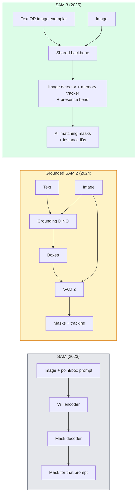

# SAM 3 और ओपन-वोकैब्यूलरी सेगमेंट

> 模型 एक पाठ प्रम्प्ट और एक छवि दे, तो प्रत्येक उपयुक्त वस्तु के मास्क प्राप्त कर सकते हैं SAM 3  इसे एक अलग आगे की पास में बदल दें 

**类型：**उपयोग + 构建
**语言：**पायथन
**先修要求：**चरण 4 पाठ 07 (यू-नेट), चरण 4 पाठ 08 (मास्क आर-सीएनएन), चरण 4 पाठ 18 (सीएलआईपी)
**时间：**~ 60 मिनट

## 学习目标

- 区分 SAM(केवल दृश्य संकेत) 、 ग्राउंड SAM / SAM 2(डिटेक्टर + SAM) और SAM 3(प्रोम्प्टेबल अवधारणा विभाजन के माध्यम से 原生支持文字 संकेत)
- 解释 SAM 3 架构:साझा रीढ़ + छवि डिटेक्टर + मेमोरी आधारित वीडियो ट्रैकर + उपस्थिति सिर + डिस्कॉपल डिटेक्टर-ट्रैकर डिजाइन
- उपयोग गले लगाना चेहरा `transformers`SAM 3 集成 पाठ-प्रेरित पता लगाने, विभाजन और वीडियो ट्रैकिंग
- ]]> लटेंसी, अवधारणा जटिलता एवं तैनाती लक्ष्य के आधार पर, SAM 3 ]] ग्राउंड SAM 2 ]]YOLO-World और SAM-MI ]] के बीच चयन करें

## 问题

2023 का SAM एक केवल दृश्य प्रम्प्ट का समर्थन करने वाला मॉडल हैः आप एक बिंदु पर क्लिक करें या एक बॉक्स खींचें, यह एक मुखौटा पर लौटता है।

SAM 3(Meta,2025 साल 11 月, ICLR 2026) इस वर्ग को संक्षिप्त किया गया है। यह एक संक्षिप्त नाम शब्द संक्षिप्त शब्द या एक छवि उदाहरण को स्वीकार करता है।**Promptable Concept Segmentation (PCS)**◊结合 2026 年 3 月的对象多复制更新(SAM 3.1), यह एक ही अवधारणा के कई उदाहरणों को वीडियो में उच्च प्रभाव से ट्रैक कर सकता है──

इस वर्ग में इस पर ध्यान केंद्रित किया गया है कि यह किस संरचनात्मक परिवर्तन को प्रतिनिधित्व करता है। 2D विभाजन, पता लगाने और पाठ-छवि ग्राउंडिंग को एक मॉडल में एकीकृत कर दिया गया है। उत्पादन का मुद्दा यह नहीं है कि मैं किस पाइपलाइन को जोड़ना चाहता हूं, बल्कि यह है कि कौन सा त्वरित मॉडल मेरे उपयोग के मामले को संभाल सकता है।

## 概念

### 三代模型



### 可 शीघ्र का अवधारणा विभाजन

concept prompt 是一个简短的名词短语`"yellow school bus"``"striped red umbrella"``"hand holding a mug"`) या एक छवि उदाहरण── मॉडल प्रति छवि में प्रत्येक मैच के लिए अवधारणा के उदाहरण  लौटें विभाजन मुखौटे, और प्रत्येक मैच के लिए अद्वितीय उदाहरण आईडी लौटें──

यह क्लासिक दृश्य-उत्कृष्ट SAM से तीन अलग-अलग है:

1. 提供提示: एक पाठ संकेत 返回所有匹配项──
2. खुली शब्दावलीः अवधारणा हो सकती है जो भी प्राकृतिक भाषा में वर्णित हो सके।
3. एक बार कई उदाहरणों पर लौटें, प्रत्येक के बजाय एक मास्क पर लौटें।

### 关键架构组件

- **Shared backbone**: एक वीटी 处理 छवि──डिटेक्टर हेड तथा मेमोरी आधारित ट्रैकर 都从中读取信息──
- **Presence head**: पूर्वानुमान अवधारणा क्या छवि में मौजूद है।
- **Decoupled detector-tracker**:चित्र स्तर की पहचान और वीडियो स्तर की ट्रैकिंग
- **Memory bank**:跨 फ्रेम  भंडारण प्रत्येक उदाहरण की सुविधाओं, वीडियो ट्रैकिंग के लिए प्रयोग किया जाता है

### बड़े पैमाने पर प्रशिक्षण

SAM 3 में **400 万个 unique concepts**ऊपर प्रशिक्षण, ये अवधारणाएं एक डेटा इंजन द्वारा उत्पन्न, इस इंजन द्वारा AI + 人工审核代标注并修正──新 **SA-CO benchmark**इसमें 270 हजार अद्वितीय अवधारणाएं शामिल हैं, जो पिछले बेंचमार्क की तुलना में 50 गुना बड़ी हैं।

### SAM 3.1 वस्तु बहुपद

2026 साल 3 月更新:**Object Multiplex** एक प्रकार की साझा-स्मृति  तंत्र की शुरूआत की गई, जिसका उपयोग एक ही अवधारणा के कई उदाहरणों को एक साथ ट्रैक करने के लिए किया जाता है इस समय, N  उदाहरणों का ट्रैक करना मतलब है कि N  स्वतंत्र स्मृति बैंकों की आवश्यकता है मल्टीप्लेक्स इसे साझा स्मृति में संकुचित करेगा, और प्रति-उपस्थिति प्रश्नों का उपयोग करेगा परिणाम सटीकता का त्याग किए बिना, बहु-वस्तु ट्रैकिंग को काफी तेजी से गति देगा

### 2026 साल में जमीन पर SAM  अभी भी महत्वपूर्ण परिदृश्य

- जब आपको विशिष्ट खुले शब्दावली डिटेक्टर को बदलने की आवश्यकता होती है
- जब SAM 3 लाइसेंस ((HF 上 गेट) बनने में बाधा
- जब आप SAM 3 के जोखिम के तत्वों की तुलना में अधिक नियंत्रण डिटेक्टर सीमा की जरूरत है
- डिटेक्टर घटक के अध्ययन/अब्लेशन कार्य हेतु प्रयोग किया गया है।

मॉड्यूलर पाइपलाइनों का अभी भी मूल्य है। अधिकांश उत्पादन कार्यों के लिए, एसएएम 3 एक सरल उत्तर है।

### यलो-वर्ल्ड बनाम सैम 3

- **YOLO-World**: केवल खुला-वाक्य संग्रह डिटेक्टर( बिना मास्क)。 वास्तविक समय──当你需要高fps बॉक्स 时最合适──
- **SAM 3**: पूर्ण खंडन + ट्रैकिंग──更慢,但输出更丰富──

生产场景划分:YOLO-World 适合快速检测-केवल पाइपलाइनों(रोबोटिक नेविगेशन、फास्ट डैशबोर्ड),SAM 3 适合任何需要面具或跟踪的场景──

### SAM-MI 效率

SAM-MI(2025-2026) SAM के डिकोडर बोतल गला को हल करना

- **Sparse point prompting**: प्रयोग कम मात्रा में精心选择的点, बजाय घने संकेत;将解码器调用 减少 96%──
- **Shallow mask aggregation**:将粗略 मुखौटा भविष्यवाणियाँ 合并成一个更清晰的 मुखौटा──
- **Decoupled mask injection**:decoder 接收预计算的 मुखौटा सुविधाओं, बजाय पुनः运行──

结果: ओपन-वोकैबुलरी बेंचमार्क में ऊपर की तुलना में ग्राउंड-एसएएम  लगभग 1.6× स्पीडअप

### तीन मॉडल का आउटपुट प्रारूप

它们都返回相同的一般结构(盒 + लेबल + स्कोर + मास्क + आईडी), यह बहुत मददगार हैः आपकी डाउन游 पाइपलाइन को किस मॉडल के आधार पर चल रही है, इसके आधार पर विभाजन करने की आवश्यकता नहीं है।


```figure
cv3-open-vocab
```

## 构建

### 步骤 1: शीघ्र निर्माण

 एक सहायक का निर्माण करें,  उपयोगकर्ता वाक्य को SAM 3 अवधारणा प्रम्प्ट्स 列表 में परिवर्तित करें 列表── यह  उपयोगकर्ता के प्रवेश की सामग्री और  मॉडल के खपत की सामग्री के बीच की सीमा है

```python
def split_concepts(sentence):
    """
    Heuristic splitter for multi-concept prompts.
    Returns list of short noun phrases.
    """
    for sep in [",", ";", "and", "or", "&"]:
        if sep in sentence:
            parts = [p.strip() for p in sentence.replace("and ", ",").split(",")]
            return [p for p in parts if p]
    return [sentence.strip()]

print(split_concepts("cats, dogs and balloons"))
```

SAM 3 प्रत्येक बार आगे जाने के लिए  एक अवधारणा स्वीकार करें; बहु-धारणा प्रश्नों के लिए, उन्हें लूप या थोक में संसाधित करें।

### 步骤 2: पोस्ट प्रोसेसिंग सहायक

SAM 3 के कच्चे आउटपुट को शुद्ध पता लगाने के लिए परिवर्तित करना, हमारे चरण 4 पाठ 16 के पाइपलाइन अनुबंध के अनुरूप।

```python
from dataclasses import dataclass
from typing import List

@dataclass
class ConceptDetection:
    concept: str
    instance_id: int
    box: tuple          # (x1, y1, x2, y2)
    score: float
    mask_rle: str       # run-length encoded


def rle_encode(binary_mask):
    flat = binary_mask.flatten().astype("uint8")
    runs = []
    prev, count = flat[0], 0
    for v in flat:
        if v == prev:
            count += 1
        else:
            runs.append((int(prev), count))
            prev, count = v, 1
    runs.append((int(prev), count))
    return ";".join(f"{v}x{c}" for v, c in runs)
```

यहां तक कि कई उच्च रिज़ॉल्यूशन मास्क भी हैं, RLE भी प्रतिक्रिया पेलोड को बनाए रखने में सक्षम है। SAM 2 ̊ SAM 3 ̊ ग्राउंडेड SAM 2 ̊

### 步骤 3:统一的 खुले-शब्द विभाजन इंटरफ़ेस

आप जो भी बैकेंड है उसे आप ही बदल सकते हैं।

```python
from abc import ABC, abstractmethod
import numpy as np

class OpenVocabSeg(ABC):
    @abstractmethod
    def detect(self, image: np.ndarray, concept: str) -> List[ConceptDetection]:
        ...


class StubOpenVocabSeg(OpenVocabSeg):
    """
    Deterministic stub used for pipeline testing when real models are not loaded.
    """
    def detect(self, image, concept):
        h, w = image.shape[:2]
        return [
            ConceptDetection(
                concept=concept,
                instance_id=0,
                box=(w * 0.2, h * 0.3, w * 0.5, h * 0.8),
                score=0.89,
                mask_rle="0x100;1x50;0x200",
            ),
            ConceptDetection(
                concept=concept,
                instance_id=1,
                box=(w * 0.55, h * 0.25, w * 0.85, h * 0.75),
                score=0.74,
                mask_rle="0x80;1x40;0x220",
            ),
        ]
```

असली `SAM3OpenVocabSeg`उपवर्ग 会封装 `transformers.Sam3Model`和 `Sam3Processor`

### 步骤 4: हागिंग फेस SAM 3 用法(参考)

实际模型的 `transformers`集成:

```python
from transformers import Sam3Processor, Sam3Model
import torch

processor = Sam3Processor.from_pretrained("facebook/sam3")
model = Sam3Model.from_pretrained("facebook/sam3").eval()

inputs = processor(images=pil_image, return_tensors="pt")
inputs = processor.set_text_prompt(inputs, "yellow school bus")

with torch.no_grad():
    outputs = model(**inputs)

masks = processor.post_process_masks(
    outputs.masks, inputs.original_sizes, inputs.reshaped_input_sizes
)
boxes = outputs.boxes
scores = outputs.scores
```

एक त्वरित, एक बार सभी मैचों को वापस करने के लिए एक बार调用

### 步骤 5: मापने जमीन SAM 2  मुफ्त में क्या प्रदान करता है

एक ईमानदार बेंचमार्कः वास्तविक पाइपलाइन में SAM 3 के साथ जमीन पर SAM 2 के बजाय क्या होगा?

- लटेंसी:SAM 3 省掉一次前进通过(没有独立探测器),但模型本身更重;通常总体持平或略有速度up──
- सटीकता:SAM 3 दुर्लभ या संरचनात्मक अवधारणाओं में`"striped red umbrella"`) ऊपर स्पष्ट बेहतर── में सामान्य शब्द अवधारणाओं 上相近──
- लचीलापनः ग्राउंड SAM 2  आपको डिटेक्टरों को बदलने की अनुमति देता हैDINO-X、फ्लोरेंस-2、ग्राउंडिंग DINO 1.5);SAM 3 मोनोलिथिक है

结论:SAM 3  2026 साल के ओपन-वोकैब सेग के लिए एक मर्मत विकल्प है  जब आपको डिटेक्टर लचीलापन या अलग लाइसेंस शर्तों की आवश्यकता होती है 时, ग्राउंडेड SAM 2  अभी भी सही जवाब है

## उपयोग

生产部署模式:

- **Real-time annotation**:SAM 3 + CVAT का लेबल-जैसे-टेक्सट-प्रॉम्प्ट फीचर──标注员选择一个标签名称;SAM 3 预标注每个匹配的实例──再进行审核和修复──
- **Video analytics**:SAM 3.1 ऑब्जेक्ट मल्टीप्लेक्स मल्टी-ऑब्जेक्ट ट्रैकिंग के लिए उपयोग किया जाता है;将 फ्रेम 输入 स्मृति आधारित ट्रैकर。
- **Robotics**:SAM 3 उपयोग के लिए खुले-शब्दों के साथ हेरफेर करना;
- **Medical imaging**: चिकित्सा अवधारणाओं में ऊपर ठीक से सुसंगत SAM 3; HF में आवेदन करने की आवश्यकता है

अल्ट्रालिटिक्स अपने पायथन पैकेज में SAM 3 को कवर किया गया हैः

```python
from ultralytics import SAM

model = SAM("sam3.pt")
results = model(image_path, prompts="yellow school bus")
```

YOLO और SAM 2 के साथ एक ही इंटरफ़ेस का उपयोग करें

## 交付

本课会产出:

- `outputs/prompt-open-vocab-stack-picker.md`: एक लटेंसी के आधार पर, अवधारणा जटिलता एवं लाइसेंसिंग  चुनें SAM 3 / ग्राउंडेड SAM 2 / YOLO-World / SAM-MI का संकेत 👇
- `outputs/skill-concept-prompt-designer.md`: एक将用户话语转换为格式良好的SAM 3 अवधारणा प्रम्प्ट्स का कौशल(विभाजन、विविधा、पतन) 

## अभ्यास

1. **（Easy）**10 张图像上运行 SAM 3,并使用你自己选择的概念提示──与同一批图像上的 SAM 2 + Grounding DINO 1.5对比──报告每模型错过了哪些概念──
2. **（Medium）**एक क्लिक-टू-इनक्यूड / क्लिक-टू-एक्सक्लूड  UI:text prompt  वापसी उम्मीदवार उदाहरणों; उपयोगकर्ता क्लिक करें आरक्षित कुछ गणनाओं को सकारात्मक 
3. **（Hard）**स्व-परिभाषित अवधारणा सेट में (उदाहरण के लिए 5 प्रकार के इलेक्ट्रॉनिक घटक) पर ठीक-ठीक SAM 3, प्रत्येक प्रकार के 20 张 लेबल वाली छवियों के साथ तुलना करें।

## 关键术语

| Term | 人们通常怎么说 | 实际含义 |
|------|----------------|----------------------|
| Open-vocabulary segmentation | “Segment by text” | 为自然语言描述的 objects 生成 masks，而不是使用固定 label set |
| PCS | “Promptable Concept Segmentation” | SAM 3 的核心任务：给定一个 noun-phrase 或 image exemplar，segment 所有匹配 instances |
| Concept prompt | “The text input” | 简短名词短语或 image exemplar；不是完整句子 |
| Presence head | “Is it here?” | SAM 3 中的模块，用于在 localisation 之前判断 concept 是否存在于 image 中 |
| SA-CO | “SAM 3 benchmark” | 包含 270K concepts 的 open-vocabulary segmentation benchmark；比以往 open-vocab benchmarks 大 50 倍 |
| Object Multiplex | “SAM 3.1 update” | Shared-memory multi-object tracking；快速联合跟踪多个 instances |
| Grounded SAM 2 | “Modular pipeline” | Detector + SAM 2 级联；当 detector 替换很重要时仍然相关 |
| SAM-MI | “Efficient SAM variant” | Mask Injection，相比 Grounded-SAM 实现 1.6x speedup |

## 延伸阅读

- [SAM 3: Segment Anything with Concepts (arXiv 2511.16719)](https://arxiv.org/abs/2511.16719)
- [SAM 3.1 Object Multiplex (Meta AI, March 2026)](https://ai.meta.com/blog/segment-anything-model-3/)
- [SAM 3 model page on Hugging Face](https://huggingface.co/facebook/sam3)
- [Grounded SAM 2 tutorial (PyImageSearch)](https://pyimagesearch.com/2026/01/19/grounded-sam-2-from-open-set-detection-to-segmentation-and-tracking/)
- [Ultralytics SAM 3 docs](https://docs.ultralytics.com/models/sam-3/)
- [SAM3-I: Instruction-aware SAM (arXiv 2512.04585)](https://arxiv.org/abs/2512.04585)
