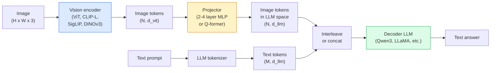

# दृष्टि-भाषा मॉडल  ViT-MLP-LLM 模式

> विजन एन्कोडर इमेज को टोकन में परिवर्तित करेगा। एमएलपी प्रोजेक्टर इन टोकन को एमएलएम के एम्बेडिंग स्पेस में मैगरेट करेगा। भाषा मॉडल 完成剩下工作── यह मॉडल  ViT-MLP-LLM  यानि 2026 साल में सभी उत्पादन वर्ग VLM का साझा संरचना──

**类型：**学习 + 使用
**语言：**पायथन
**前置要求：**चरण 4 पाठ 14 (ViT), चरण 4 पाठ 18 (CLIP), चरण 7 पाठ 02 (स्व-ध्यान)
**时间：**~ 75 मिनट

## 学习目标

- व्याख्या व्याख्या तीन घटक प्रत्येक योगदान क्या
- से आयाम, संदर्भ लंबाई और बेंचमार्क प्रदर्शन  कोण तुलना Qwen3-VL,InternVL3.5
-  समझाएँ DeepStack: क्यों कई स्तरों ViT सुविधाओं एक ही अंतिम स्तर की सुविधा की तुलना में अधिक सक्षम दृष्टि-भाषा संरेखण
- उत्पादन वातावरण में क्रॉस-मोडल त्रुटि दर (CMER) का उपयोग करके VLM भ्रम को मापने के लिए, और इस संकेत के आधार पर कार्रवाई करने के लिए

## 问题

CLIP (चरण 4 पाठ 18) छवि और पाठ को साझा एम्बेडिंग स्थान प्रदान करने के लिए, यह शून्य-शॉट वर्गीकरण और पुनर्प्राप्ति का समर्थन करने के लिए पर्याप्त है। यह इस चित्र में कितने लाल वाहन हैं इसका उत्तर नहीं दे सकता है?

विजन-भाषा मॉडल (VLMs)  Qwen3-VL、InternVL3.5、LLaVA-Next、GLM-4.6V  CLIP-परिवार छवि एन्कोडर 接到一个完整语言模型上──模型看一张图像加一个问题,然后生成答案──到2026年, ओपन सोर्स VLMs 在多模拟基准 (MMMU, MMBench, DocVQA, ChartQA, MathVista, OSWorld) 上已经可以比肩甚至超过GPT-5 和 Gemini-2.5-Pro──

यह एक मानक संरचना है। मॉडल के बीच अंतर यह है कि किस वीटी का उपयोग करना है। यह एक एलएलएम है। प्रशिक्षण डेटा और संरेखण नुस्खा।

## 概念

### वीआईटी-एमएलपी-एलएलएम 架构



1. **Vision encoder** 预训练 ViT(CLIP-L/14、SigLIP、DINOv3, या ठीक से ट्यून किए गए संस्करण)
2. **Projector** एक छोटा सा मॉड्यूल (~ 2-4 层 MLP, या Q-former), दृष्टि टोकन को LLM के एम्बेडिंग आयाम में प्रदर्शित करेगा।
3. **LLM** केवल डेकोडर भाषा मॉडल(Qwen3、Llama、Mistral、GLM、InternLM) ・・・按序读取 दृष्टि + पाठ टोकन,并生成文本。

मूलतः उपरोक्त तीनों भागों को प्रशिक्षित किया जा सकता है। अभ्यास में, दृष्टि एन्कोडर और LLM का अधिकांश हिस्सा ठंडे, केवल प्रशिक्षित प्रोजेक्टर को बनाए रखा जा सकता है, ताकि कम लागत से कई अरबों पैरामीटर पैमाने के संकेतों को संभाला जा सके।

### डीपस्टैक

सामान्य प्रक्षेपण केवल अंतिम स्तर की वीटी परतों का उपयोग करते हुए किया जाता है। डीपस्टैक (Qwen3-VL) कई वीटी गहराई से ले जाने वाली सुविधाओं से होगा और उन्हें ढेर करेगा।

### तीन प्रशिक्षण चरण

现代 VLMs 分阶段 प्रशिक्षण:

1. **Alignment** विज़िशन विटी एवं एलएलएम── केवल छवि-कैप्शन जोड़े में 上训练 प्रोजेक्टर──教会 प्रोजेक्टर 将视觉空间 映射到语言空间──
2. **Pre-training** 解所有部分── बड़े पैमाने पर交错图像-文字 डेटा(500M+ जोड़े) 上训练──构建模型的视觉知识──
3. **Instruction tuning** 在精选的(图像, प्रश्न, उत्तर) 三元组上精细调──教会对话行为 和任务格式── इस कदम से दृष्टि-जागरूक एलएम को उपलब्ध सहायक में बदल दिया गया──

अधिकांश लोरा फाइन-ट्यून्स 3 चरण के लिए छोटे पैमाने पर टैग डेटासेट का उपयोग करेंगे।

### 模型家族比较(2026 साल की शुरुआत)

| Model | Params | Vision encoder | LLM | Context | Strengths |
|-------|--------|----------------|-----|---------|-----------|
| Qwen3-VL-235B-A22B (MoE) | 235B (22B active) | custom ViT + DeepStack | Qwen3 | 256K | 综合 SOTA，GUI agent |
| Qwen3-VL-30B-A3B (MoE) | 30B (3B active) | custom ViT + DeepStack | Qwen3 | 256K | 更小的 MoE 替代方案 |
| Qwen3-VL-8B (dense) | 8B | custom ViT | Qwen3 | 128K | 生产环境 dense 默认选择 |
| InternVL3.5-38B | 38B | InternViT-6B | Qwen3 + GPT-OSS | 128K | MMBench / MMVet 表现强 |
| InternVL3.5-241B-A28B | 241B (28B active) | InternViT-6B | Qwen3 | 128K | 可与 GPT-4o 竞争 |
| LLaVA-Next 72B | 72B | SigLIP | Llama-3 | 32K | 开放，易于 fine-tune |
| GLM-4.6V | ~70B | custom | GLM | 64K | Open-source，OCR 强 |
| MiniCPM-V-2.6 | 8B | SigLIP | MiniCPM | 32K | 适合边缘部署 |

### दृश्य एजेंट

Qwen3-VL-235B ने OSWorld में वैश्विक शीर्ष प्रदर्शन हासिल किया, OSWorld की ओर बढ़ रहा है**visual agents**इसके बाद, यह सामान्य टेबल के काम को पूरा करने के लिए बंद हो सकता है। यह 2026 के अधिकांश वर्षों में है।

### एजेंटिक 能力 + RoPE 变体

वीएलएम                                                                                                                                                                                                                                                                                                                                                                                                                                                                                                                           **什么时候**◊Qwen3-VL से T-RoPE(समय पर घूर्णन स्थिति एम्बेडमेंट) विकसित करने के लिए**基于文本的时间 alignment**, यानि स्पष्ट समय टिकट पाठ टोकन वीडियो फ्रेम के साथ 交错――模型看`<timestamp 00:32>`फ्रेम, शीघ्र, हम समय के संबंध पर विचार कर सकते हैं

### संरेखण 问题

爬取数据集 में 12% छवि-पाठ जोड़े 包含并未完全由图像支的描述── इस प्रकार के डेटा प्रशिक्षण के साथ VLM 会学会幻觉化, यानी वस्तु निर्माण, गलत पठन, संख्याएँ, बनावट संबंध, उत्पादन वातावरण में, यह सबसे प्रमुख विफलता मॉडल है──

Skywork.ai                                                                                                                                                                                                                                                                                                                                                                                                                                                                                                                          **Cross-Modal Error Rate (CMER)**इसे ट्रैक करने के लिएः

```
CMER = fraction of outputs where the text confidence is high but the image-text similarity (via a CLIP-family checker) is low
```

उच्च सीएमईआर का अर्थ है कि मॉडल आत्मविश्वास से कह रहे हैं कि सामग्री को चित्र द्वारा समर्थित नहीं किया गया है। CMER की निगरानी करते हुए, इसे उत्पादन केपीआई के रूप में माना जाता है, उनके तैनाती में भौं की दर में लगभग 35% की कमी आई है।

### प्रयोग LoRA / QLoRA  बारीक- बारीक ट्यूनिंग करने के लिए

70B VLM के लिए पूर्ण ठीक-ठीक करने के लिए  अधिकांश टीम की क्षमता से परे है। ध्यान + प्रोजेक्टर परतों में LoRA का उपयोग करके 16-64 पर रैंक करें, या 4-बिट बेस वजन के QLoRA का उपयोग करके, एक एकल चार्ज A100 / H100 में स्थापित किया जा सकता है।$100-$5,000  गणना लागत,2-10 小时训练时间──

### स्थानिक तर्क  अभी भी कमजोर

当前 VLMs में स्थानिक तर्क बेंचमार्क ((ऊपर-नीचे,बाएं-दाएं,गणना, दूरी) पर स्कोर 50-60% है।


```figure
v4-vlm-projector
```

##  इसे निर्माण

### 步骤 1: प्रोजेक्टर

यह आपके सबसे नियमित प्रशिक्षण का हिस्सा है।

```python
import torch
import torch.nn as nn


class Projector(nn.Module):
    def __init__(self, vit_dim=768, llm_dim=4096, hidden=4096):
        super().__init__()
        self.net = nn.Sequential(
            nn.Linear(vit_dim, hidden),
            nn.GELU(),
            nn.Linear(hidden, llm_dim),
        )

    def forward(self, x):
        return self.net(x)
```

输入 एक `(N_patches, d_vit)`टोकन टेंसर---输出是 `(N_patches, d_llm)`LLM प्रत्येक लाइन को एक और टोकन के रूप में आउटपुट करता है

### 步骤 2: 端到端组装 ViT-MLP-LLM

नीचे न्यूनतम VLM के आगे पास 骨架──真实代码会使用 `transformers`यहाँ अवधारणाओं का प्रदर्शन किया गया है।

```python
class MinimalVLM(nn.Module):
    def __init__(self, vit, projector, llm, image_token_id):
        super().__init__()
        self.vit = vit
        self.projector = projector
        self.llm = llm
        self.image_token_id = image_token_id  # placeholder token in text prompt

    def forward(self, image, input_ids, attention_mask):
        # 1. vision features
        vision_tokens = self.vit(image)                     # (B, N_patches, d_vit)
        vision_embeds = self.projector(vision_tokens)       # (B, N_patches, d_llm)

        # 2. text embeddings
        text_embeds = self.llm.get_input_embeddings()(input_ids)  # (B, M, d_llm)

        # 3. replace image placeholder tokens with vision embeds
        merged = self._merge(text_embeds, vision_embeds, input_ids)

        # 4. run LLM
        return self.llm(inputs_embeds=merged, attention_mask=attention_mask)

    def _merge(self, text_embeds, vision_embeds, input_ids):
        out = text_embeds.clone()
        expected = vision_embeds.size(1)
        for b in range(input_ids.size(0)):
            positions = (input_ids[b] == self.image_token_id).nonzero(as_tuple=True)[0]
            if len(positions) != expected:
                raise ValueError(
                    f"batch item {b} has {len(positions)} image tokens but vision_embeds has {expected} patches."
                    " Every sample in the batch must be pre-padded to the same number of image placeholder tokens.")
            out[b, positions] = vision_embeds[b]
        return out
```

文本中 `<image>`स्थान धारक टोकन को वास्तविक छवि एम्बेडमेंट में बदल दिया जाएगा, LLaVA、Qwen-VL और InternVL उपयोग का सभी एक ही मोड है。

### 步骤 3: CMER 计算

एक हल्के मात्रा में चलन जाँच करते समय

```python
import torch.nn.functional as F


def cross_modal_error_rate(image_emb, text_emb, text_confidence, sim_threshold=0.25, conf_threshold=0.8):
    """
    image_emb, text_emb: embeddings of image and generated text (normalised internally)
    text_confidence:     mean per-token probability in [0, 1]
    Returns:             fraction of high-confidence outputs with low image-text alignment
    """
    image_emb = F.normalize(image_emb, dim=-1)
    text_emb = F.normalize(text_emb, dim=-1)
    sim = (image_emb * text_emb).sum(dim=-1)        # cosine similarity
    high_conf_low_sim = (text_confidence > conf_threshold) & (sim < sim_threshold)
    return high_conf_low_sim.float().mean().item()
```

CMER को उत्पादन KPI के रूप में उपयोग करना। अंत बिंदु के अनुसार  शीघ्र प्रकार  ग्राहक इसे अलग से नियंत्रित करता है।

### 步骤 4: खिलौना VLM वर्गीकरण(可运行)

演示 प्रोजेक्टर 可以训练的──伪造的ViT विशेषता输入; एक छोटा LLM शैली टोकन 预测类别──

```python
class ToyVLM(nn.Module):
    def __init__(self, vit_dim=32, llm_dim=64, num_classes=5):
        super().__init__()
        self.projector = Projector(vit_dim, llm_dim, hidden=64)
        self.head = nn.Linear(llm_dim, num_classes)

    def forward(self, vision_tokens):
        projected = self.projector(vision_tokens)
        pooled = projected.mean(dim=1)
        return self.head(pooled)
```

आप सिंथेटिक में कर सकते हैं (विशेषता, वर्ग) जोड़े ऊपर उपयोग नहीं 200 कदम 拟合它, यह पर्याप्त है यह स्पष्ट करने के लिए प्रोजेक्टर पैटर्न है प्रभावी है 

## इसका उपयोग करें

2026 साल उत्पादन टीम VLM का उपयोग करने के तीन तरीकेः

- **Hosted API** ओपनएआई विजन、एंट्रोपिक क्लाउड विजन、गूगल जेमिनी विजन、零 बुनियादी ढांचा, विक्रेता जोखिम
- **Open-source self-host** 通过 `transformers`和 `vllm`प्रयोग Qwen3-VL या InternVL3.5── पूर्ण नियंत्रण, पूर्व期投入更高──
- **在领域数据上 fine-tune**                                                                                                                                                                                                                                                              `vllm`या `TGI`सेवाएँ

```python
from transformers import AutoProcessor, AutoModelForVision2Seq
import torch
from PIL import Image

model_id = "Qwen/Qwen3-VL-8B-Instruct"
processor = AutoProcessor.from_pretrained(model_id)
model = AutoModelForVision2Seq.from_pretrained(model_id, torch_dtype=torch.bfloat16, device_map="auto")

messages = [{
    "role": "user",
    "content": [
        {"type": "image", "image": Image.open("plot.png")},
        {"type": "text", "text": "What does this chart show?"},
    ],
}]
inputs = processor.apply_chat_template(messages, add_generation_prompt=True, tokenize=True, return_dict=True, return_tensors="pt").to("cuda")
generated = model.generate(**inputs, max_new_tokens=256)
answer = processor.decode(generated[0][inputs["input_ids"].shape[1]:], skip_special_tokens=True)
```

`apply_chat_template`छुपा हुआ है`<image>`स्थान धारक टोकनकरण; मॉडल会在内部处理 merge──

## 交付 यह

本课会产出:

- `outputs/prompt-vlm-selector.md` सटीकता, विलंबता, संदर्भ लंबाई तथा बजट के मामले में Qwen3-VL / InternVL3.5 / LLaVA-Next / API को चुनें。
- `outputs/skill-cmer-monitor.md` 生成代码, क्रॉस-मोडल त्रुटि दर का उपयोग करके उत्पादन श्रेणी VLM एंडपॉइंट के लिए उपकरण, एंडपॉइंट के डैशबोर्ड के साथ-साथ अलर्टिंग थ्रॉवल के साथ-साथ

## अभ्यास

1. **（简单）**️️️️️️️️️️️️️️️️️️️️️️️️️️️️️️️️️️️️️️️️️️️️️️️️️️️️️️️️️️️️️️️️️️️️️️️️️️️️️️️️️️️️️️️️️️️️️️️️️️️️️️️️️️️️️️️️️️️️️️️️️️️️️️️️️️️️️️️️️️️️️️️️️️️️️️️️️️️️️️️️️️️️️️️️️️️️️️️️️️️️️️️️️️️️️️️️️️️️️️️️️️️️️️️️️️️️️️️️️️️️️️️️️️️️️️️️️️️️️️️️️️️️️️️️️️️️️️️️️️️️️️️️️️️️️️️️️️️️️️️️️️️️️️️️️️️️️️️️️️️️️️️️️️️️️️️️️️️️️️️️️️️️️️️️️️️️️️️️️️️️️️️️️️️️️️️️️️️️️️️️️️️️️️️️️️️️️️️️️️️️️️️️️️️️️️️️️️️️️️️️️️️️️️️️️️️️️️️️️️️️️️️️️️️️️️️️️️️️️️️️️️️️️️️️️️️️️️️️️️️️️️️️️️️️️️️️️️️️️️️️️️️️️️️️️️️️️️️️️️️️️️️️️
2. **（中等）**लक्ष्य क्षेत्र के 500 张带 कैप्शन 图像上, LoRA के साथ रैंक 16) ठीक-ट्यून Qwen2.5-VL-3B या LLaVA-1.6-7B── तुलना शून्य-शॉट और ठीक-ट्यून MMBench शैली सटीकता──
3. **（困难）**VLM का छवि एन्कोडर को डीफ़ोर्ड से SigLIP/CLIP 替换为 DINOv3──只重新训练 प्रोजेक्टर(झमे हुए LLM + जमे हुए DINOv3)──测量密集预测任务(गणना、空间推理)

## 关键术语

| Term | 人们常说 | 实际含义 |
|------|----------------|----------------------|
| ViT-MLP-LLM | “VLM pattern” | Vision encoder + projector + language model；每个 2026 年 VLM 都如此 |
| Projector | “桥梁” | 2-4 层 MLP（或 Q-former），将 vision tokens 映射到 LLM embedding space |
| DeepStack | “Qwen3-VL feature trick” | stack 多层级 ViT features，而不是只使用最后一层 |
| Image token | “<image> placeholder” | text stream 中的 special token，会被 projected vision embeddings 替换 |
| CMER | “Hallucination KPI” | Cross-Modal Error Rate；当 text confidence 高但 image-text similarity 低时，该值较高 |
| Visual agent | “会点击的 VLM” | 通过 tool calls 操作 GUI（OSWorld、mobile、web）的 VLM |
| Q-former | “固定数量的 token bridge” | BLIP-2 风格的 projector，产出固定数量的 visual query tokens |
| Alignment / pre-training / instruction tuning | “三个阶段” | 标准 VLM 训练 pipeline |

## 延伸阅读

- [Qwen3-VL Technical Report (arXiv 2511.21631)](https://arxiv.org/abs/2511.21631)
- [InternVL3.5 Advancing Open-Source Multimodal Models (arXiv 2508.18265)](https://arxiv.org/html/2508.18265v1)
- [LLaVA-Next series](https://llava-vl.github.io/blog/2024-05-10-llava-next-stronger-llms/)
- [BentoML: Best Open-Source VLMs 2026](https://www.bentoml.com/blog/multimodal-ai-a-guide-to-open-source-vision-language-models)
- [MMMU: Multi-discipline Multimodal Understanding benchmark](https://mmmu-benchmark.github.io/)
- [VLMs in manufacturing (Robotics Tomorrow, March 2026)](https://www.roboticstomorrow.com/story/2026/03/when-machines-learn-to-see-like-experts-the-rise-of-vision-language-models-in-manufacturing/26335/)
