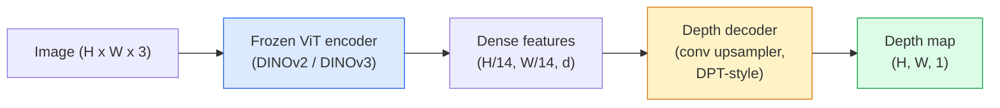

# एकाक्षीय गहराई और ज्यामिति अनुमान

> गहराई का नक्शा एक एकल-मार्ग छवि है, जिसमें से प्रत्येक पिक्सेल कैमरे की दूरी को दर्शाता है। अतीत में, अगर कोई स्टीरियो या लिडर नहीं है, तो केवल एक RGB से यह असंभव माना जाता है। 2026 तक, एक विज़िट वीटी एन्कोडर के साथ हल्के स्तर के सिर, केवल कुछ सौ अंक के प्रभाव को प्राप्त कर सकता है।

**类型：**构建 + 使用
**语言：**पायथन
**前置要求：**चरण 4 पाठ 14 (वीटी), चरण 4 पाठ 17 (स्व-निरीक्षण दृष्टि), चरण 4 पाठ 07 (यू-नेट)
**时间：**≈ 60 मिनट

## 学习目标

- 区分 सापेक्ष गहराई 和 मीट्रिक गहराई,并说明每个生产级模型(MiDaS, Marigold, Depth Anything V3, ZoeDepth) हल कौन सा है
- प्रयोग गहराई कुछ भी V3(DINOv2 रीढ़ की हड्डी) अनावश्यक माप के मामले में, के लिए किसी भी एकल张图像预测 गहराई
- 解释为什么单张图像中形成的单张图像中形成的单张图像中形成的单张图像中形成的单张图像中形成的单张图像中形成的单张图像中形成的单张图像中形成的单张图像中形成的单张图像中形成的单张图像中形成的单张图像中建立的单张图像中建立的单张图像中建立的单张图像中建立的单张图像从单张图像中建立的单张图像从从从从从从单张图像中建立的单张图像中建立的单张图像从从单张图像中建立的单张图像从从从单张图像中建立的单个图像中建立的单个图像从单张图像中建立的单个图像从单个图像中建立的单个图像从单个图像从单个图像中建立的单个图像从单个图像的单个图像从从单个图像中建立的单个图像的单个图像从单个图像的单个图像的单个图像的单个图像的图像的图像的图像的图像的图像的图像的图像的图像的图像的图像的图像的图像的图像的图像
- उपयोग गहराई नक्शा और पिनहोल कैमरा अंतर्निहित 2D पता लगाने  उन्नत 3D अंक

## 问题

गहराई 2 डी कंप्यूटर दृष्टि में कमी का एक धुरी है। RGB को दिए जाने पर, आप जानते हैं कि वस्तुएं छवि विमान में दिखाई देती हैं; लेकिन आप नहीं जानते कि वे कितनी दूर हैं।

मोनोकुलर गहराई अनुमान, अर्थात् एक एकल张 आरजीबी फ्रेम से  पूर्वानुमान गहराई, अतीत में हमेशा पैदा模糊且不可靠的输出──2026 वर्ष तक, बड़े पूर्व प्रशिक्षित एन्कोडर  इस बिंदु को बदल दियाः गहराई कुछ भी V3 उपयोग结的 DINOv2 रीढ़ की हड्डी,并生成能够泛化到室内、室外、医学和卫星 डोमेन के गहराई के नक्शे──Marigold 重新表述为条件分散问题──ZoeDepth 回归真实的 метриक दूरी──

गहराई भी 2D डिटेक्शन और 3D समझ के बीच का पुल हैः पता लगाने वाले बॉक्स के पिक्सल  गहराई से गुणा, आप 2D ऑब्जेक्ट  को 3D बिंदु बादल में उन्नत कर सकते हैं यह प्रत्येक AR अवरुद्ध प्रणाली  प्रत्येक बाधा-अवरोध पाइपलाइन, तथा प्रत्येक  उठाओ कप के रोबोट के केंद्र 

## 概念

### सापेक्ष बनाम मीट्रिक गहराई

- **Relative depth** 没有真实世界单位的有序 `z`पिक्सेल ए पिक्सेल बी से अधिक निकट है, लेकिन दूरी अनुपात नहीं है  तय करने के लिए मीटर 
- **Metric depth** कैमरे से निकल    मीटर 计 के निरपेक्ष दूरी  要求模型 学到图像线索与真实距离之间的统计关系

MiDaS 和 गहराई कुछ भी V3 生成 सापेक्ष गहराई──Marigold 生成 सापेक्ष गहराई──ZoeDepth、UniDepth 和 Metric3D 生成 मीट्रिक गहराई──मीट्रिक मॉडल कैमरा अंतर्निहित के प्रति संवेदनशील; सापेक्ष मॉडल 则不敏感──

### एन्कोडर-डेकोडर 模式



गहराई कुछ भी V3 结 एन्कोडर, केवल प्रशिक्षण डीपीटी शैली का डेकोडर──एन्कोडर 丰富的功能提供;डेकोडर इन सुविधाओं 插值回图像解析度,并归归深度──

### क्यों एक ही चित्र भी गहराई पैदा कर सकता है

एक张 2D 图像 contains many with depth related monocular cues:

- **Perspective** 3D 中的平行线在 2D 中会收──
- **Texture gradient**  दूर की सतह में अधिक संक्षिप्त बनावट होती है
- **Occlusion order** निकटतम वस्तुओं को  दूरस्थ वस्तुओं को  आच्छादित करेंगे
- **Size constancy** 已知物体 कार मनुष्य) निकटतम पैमाने प्रदान करते हैं
- **Atmospheric perspective** बाहरी दृश्यों में, दूर स्थित वस्तुएं दिखती हैं और अधिक 、 अधिक偏蓝──

इन संकेतों को एक अरब से अधिक चित्रों पर प्रशिक्षित किए गए वीटी में शामिल किया गया है। जब तक पर्याप्त डेटा, पर्याप्त रीढ़ की हड्डी, पर्याप्त मजबूत, मोनोकुलर गहराई, और यहां तक कि कोई स्पष्ट 3 डी निगरानी नहीं है, तब तक उचित सटीकता तक पहुंच सकती है।

### एकाकी गहराई नहीं कर सकते

-  कोई अंतर्निहित या परिदृश्य में ज्ञात वस्तु , प्राप्त नहीं किया जा सकता **absolute metric scale** नेटवर्क कप कप  के दुगुने दूरी कप कप कप कप कप कप कप कप कप कप कप कप कप कप कप कप कप कप कप कप कप कप कप कप कप कप कप कप कप कप कप कप कप कप कप कप कप कप कप कप कप कप कप कप कप कप कप कप कप कप कप कप कप कप कप कप कप कप कप कप कप कप कप कप कप कप कप कप कप कप कप कप कप कप कप कप कप कप कप कप कप कप कप कप कप कप कप कप कप कप कप कप कप कप कप कप कप कप कप कप कप कप कप कप कप कप कप कप कप कप कप कप कप कप कप कप कप कप कप कप कप कप कप
- **Occluded geometry** कुर्सी के पीछे का चेहरा अदृश्य, अकल्पनीय है।
- **真正无 texture / reflective surfaces** दर्पण, ग्लास, समान दीवारें, नेटवर्क, रिपोर्ट की गहराई, जो कि उचित है, लेकिन गलत है।

### 2026 साल की गहराई कुछ भी V3

- प्रयोग原生 DINOv2 ViT-L/14 作为编码器(结)
- डीपीटी डिकोडर
- विभिन्न स्रोतों से चित्रित चित्र जोड़े में फोटोमेट्रिक स्थिरता के अलावा, स्पष्ट गहराई की निगरानी की आवश्यकता नहीं है)
- 能够从 **任意数量的 visual inputs 中预测空间一致的 geometry，无论是否已知 camera poses**
- एकोक्षीय गहराई में, किसी भी दृश्य ज्यामिति, दृश्य रेंडरिंग, कैमरा पोज अनुमान,

यह 2026 में एक गहनता की आवश्यकता है।

### Marigold  उपयोग के लिए गहराई के प्रसार

Marigold(Ke et al., CVPR 2024)将深度估计 重新表述为条件图像-to-image diffusion──Conditioning:RGB──Target:depth map──pre-trained Stable Diffusion 2 U-Net 作为脊柱──输出深度maps 在对象边界处格外清晰──权衡:inference 比 feed-forward models 更慢(10-50 个 个 个 个 个 否定步骤)──

### अंतर्निहित और पिनहोल कैमरा

गहराई में ले जाएगा`d` के पिक्सेल `(u, v)`提升为相机坐标 中的3D点 `(X, Y, Z)`:

```
fx, fy, cx, cy = camera intrinsics
X = (u - cx) * d / fx
Y = (v - cy) * d / fy
Z = d
```

अंतर्निहित EXIF मेटाडेटा, कैलिब्रेशन पैटर्न, या मोनोकुलर अंतर्निहित अनुमानक से प्राप्त होते हैं।

### मूल्यांकन

दो मानक माप:

- **AbsRel**(मूर्त सापेक्ष त्रुटि):`mean(|d_pred - d_gt| / d_gt)`越低越好── उत्पादन श्रेणी के मॉडल आमतौर पर 0.05-0.1──
- **delta < 1.25**(तारे की सटीकता):满足 `max(d_pred/d_gt, d_gt/d_pred) < 1.25`                                                                                                                                                                                                                                                              

️️️️️️️️️️️️️️️️️️️️️️️️️️️️️️️️️️️️️️️️️️️️️️️️️️️️️️️️️️️️️️️️️️️️️️️️️️️️️️️️️️️️️️️️️️️️️️️️️️️️️️️️️️️️️️️️️️️️️️️️️️️️️️️️️️️️️️️️️️️️️️️️️️️️️️️️️️️️️️️️️️️️️️️️️️️️️️️️️️️️️️️️️️️️️️️️️️️️️️️️️️️️️️️️️️️️️️️️️️️️️️️️️️️️️️️️️️️️️️️️️️️️️️️️️️️️️️️️️️️️️️️️️️️️️️️️️️️️️️️️️️️️️️️️️️️️️️️️️️️️️️️️️️️️️️️️️️️️️️️️️️️️️️️️️️️️️️️️️️️️️️️️️️️️️️️️️️️️️️️️️️️️️️️️️️️️️️️️️️️️️️️️️️️️️️️️️️️️️️️️️️️️️️️️️️️️️️️️️️️️️️️️️️️️️️️️️️️️️️️️️️️️️️️️️️️️️️️️️️️️️️️️️️️️️️️️️️️️️️️️️️️️️️️️️️️️️️️️️️️️️️️️️️️️


```figure
depth-sweep
```

## 构建

### 步骤 1: गहराई मीट्रिक

```python
import torch

def abs_rel_error(pred, target, mask=None):
    if mask is not None:
        pred = pred[mask]
        target = target[mask]
    return (torch.abs(pred - target) / target.clamp(min=1e-6)).mean().item()


def delta_accuracy(pred, target, threshold=1.25, mask=None):
    if mask is not None:
        pred = pred[mask]
        target = target[mask]
    ratio = torch.maximum(pred / target.clamp(min=1e-6), target / pred.clamp(min=1e-6))
    return (ratio < threshold).float().mean().item()
```

∞ ∞ ∞ ∞ ∞ ∞ ∞ ∞ ∞ ∞ ∞ ∞ ∞ ∞ ∞ ∞ ∞ ∞ ∞ ∞ ∞ ∞ ∞ ∞ ∞ ∞ ∞ ∞ ∞ ∞ ∞ ∞ ∞ ∞ ∞ ∞ ∞ ∞ ∞ ∞ ∞ ∞ ∞ ∞ ∞ ∞ ∞ ∞ ∞ ∞ ∞ ∞ ∞ ∞ ∞ ∞ ∞ ∞ ∞ ∞ ∞ ∞ ∞ ∞ ∞ ∞ ∞ ∞ ∞ ∞ ∞ ∞ ∞ ∞ ∞ ∞ ∞ ∞ ∞ ∞ ∞ ∞ ∞ ∞ ∞ ∞ ∞ ∞ ∞ ∞ ∞ ∞ ∞ ∞ ∞ ∞ ∞ ∞ ∞ ∞ ∞ ∞ ∞ ∞ ∞ ∞ ∞ ∞ ∞ ∞ ∞ ∞ ∞ ∞ ∞ ∞ ∞ ∞ ∞ ∞ ∞ ∞ ∞ ∞ ∞ ∞ ∞ ∞ ∞ ∞ ∞ ∞ ∞ ∞ ∞ ∞ ∞ ∞ ∞ ∞ ∞ ∞ ∞ ∞ ∞ ∞ ∞ ∞ ∞ ∞ ∞ ∞ ∞ ∞ ∞ ∞ ∞ ∞ ∞ ∞ ∞ ∞ ∞ ∞ ∞ ∞ ∞ ∞ ∞ ∞ ∞ ∞ ∞ ∞ ∞ ∞ ∞ ∞ ∞ ∞ ∞ ∞ ∞ ∞ ∞ ∞ ∞ ∞ ∞ ∞ ∞ ∞ ∞ ∞ ∞ ∞ ∞ ∞ ∞ ∞ ∞ ∞ ∞ ∞ ∞ ∞ ∞ ∞ ∞ ∞ ∞ ∞ ∞ ∞ ∞ ∞ ∞ ∞ ∞ ∞ ∞ ∞ ∞ ∞ ∞ ∞ ∞ ∞ ∞ ∞ ∞ ∞ ∞ ∞ ∞ ∞ ∞ ∞ ∞ ∞ ∞ ∞ ∞

### 步骤 2:स्केल-एंड-शिफ्ट संरेखण

 सापेक्ष-गहन मॉडल के लिए,  गणितीय मापकों में  पूर्वानुमान  यथार्थ के लिए `a * pred + b = target`न्यूनतम वर्गों को फिट करनाः

```python
def align_scale_shift(pred, target, mask=None):
    if mask is not None:
        p = pred[mask]
        t = target[mask]
    else:
        p = pred.flatten()
        t = target.flatten()
    A = torch.stack([p, torch.ones_like(p)], dim=1)
    coeffs, *_ = torch.linalg.lstsq(A, t.unsqueeze(-1))
    a, b = coeffs[:2, 0]
    return a * pred + b
```

时,先运行 `align_scale_shift`, पुनः运行 `abs_rel_error`

### 步骤 3: गहिराई 升升为点云

```python
import numpy as np

def depth_to_point_cloud(depth, intrinsics):
    H, W = depth.shape
    fx, fy, cx, cy = intrinsics
    v, u = np.meshgrid(np.arange(H), np.arange(W), indexing="ij")
    z = depth
    x = (u - cx) * z / fx
    y = (v - cy) * z / fy
    return np.stack([x, y, z], axis=-1)


depth = np.random.uniform(0.5, 4.0, (240, 320))
intr = (320.0, 320.0, 160.0, 120.0)
pc = depth_to_point_cloud(depth, intr)
print(f"point cloud shape: {pc.shape}  (H, W, 3)")
```

एक फ़ंक्शन, सभी 3 डी-लिफ्ट किए गए अनुप्रयोगों के लिए लागू किया गया है।`.ply`, और मेशलैब या क्लाउड कम्पैयर में खोले।

### 步骤 4: सिंथेटिक गहराई दृश्य के साथ धुएं परीक्षण करें

```python
def synthetic_depth(size=96):
    yy, xx = np.meshgrid(np.arange(size), np.arange(size), indexing="ij")
    # Floor: linear gradient from near (top) to far (bottom)
    depth = 1.0 + (yy / size) * 4.0
    # Box in the middle: closer
    mask = (np.abs(xx - size / 2) < size / 6) & (np.abs(yy - size * 0.6) < size / 6)
    depth[mask] = 2.0
    return depth.astype(np.float32)


gt = torch.from_numpy(synthetic_depth(96))
pred = gt + 0.3 * torch.randn_like(gt)  # simulated prediction
aligned = align_scale_shift(pred, gt)
print(f"before align  absRel = {abs_rel_error(pred, gt):.3f}")
print(f"after align   absRel = {abs_rel_error(aligned, gt):.3f}")
```

### 步骤 5: गहराई कुछ भी V3 使用方式(उद्धरण)

```python
import torch
from transformers import pipeline
from PIL import Image

pipe = pipeline(task="depth-estimation", model="LiheYoung/depth-anything-v2-large")

image = Image.open("street.jpg").convert("RGB")
out = pipe(image)
depth_np = np.array(out["depth"])
```

तीन पंक्ति`out["depth"]` PIL ग्रेस्केल;                                                                                                                                                                                                                                                           

## उपयोग

- **Depth Anything V3**(मेटा एआई / बाइटडेंस, 2024-2026)  सापेक्ष गहराई का默认选择──生产中最快的 ViT-大脊椎模型──
- **Marigold**(ETH, 2024)  सर्वोच्च दृश्य गुणवत्ता,अवसर 慢──
- **UniDepth**(ETH, 2024)  मीट्रिक गहराई,并带 कैमरा आंतरिक अनुमान──
- **ZoeDepth**(इंटेल, 2023)  मीट्रिक गहराई; पुराने से अधिक, लेकिन अभी भी विश्वसनीय है
- **MiDaS v3.1** विरासत लेकिन स्थिर;适合作为比较基线──

आकृतिगत समावेशन ढाँचाः

1. आरजीबी फ्रेम तक पहुँच गया
2. गहराई मॉडल 生成 गहराई का नक्शा
3. डिटेक्टर 生成盒子──
4.  गहराई के माध्यम से बॉक्स सेंट्रोइड 升升到3D; यदि बिंदु बादल है, तो इसके साथ 
5. नीचे नीचेःएआर अवरुद्ध, पथ नियोजन, वस्तु आकार अनुमान, स्टीरियो प्रतिस्थापन

 वास्तविक समय के लिए उपयोग, गहराई कुछ भी V2 छोटा ((INT8 क्वांटिज़्ड) उपभोक्ता GPU पर ऊपर 518x518 तक पहुँच सकता है लगभग 30 fps

## 交付

本课会生成:

- `outputs/prompt-depth-model-picker.md`                                                                                                                                                                                                                                                              
- `outputs/skill-depth-to-pointcloud.md` एक गहराई से नक्शे  बिंदु बादलों का निर्माण करने की कौशल, सही ढंग से आंतरिक संसाधित और बाहर ले जाने के लिए `.ply`

## अभ्यास

1. **（Easy）**आपके डेस्कटॉप पर किसी भी 10 张图像上运行 गहराई कुछ भी V2──将深度保存为灰度 PNGs并检查──找出一个预测深度看起来错误的对象,并解释为什么单极线索 失败了──
2. **（Medium）**给定 गहराई कुछ भी V2 के RGB + गहराई, इसे बिंदु बादल में उन्नत किया जाएगा और उपयोग नहीं किया जाएगा `open3d`染──比较两个场景(室内/室外),并记录哪个看起来更可信──
3. **（Hard）**拍摄五对图像, प्रति对只改变一个已知物体的位置 (उदाहरण के लिए बोतल向近处移动30 सेमी) ⋅ उपयोग करें UniDepth 在两张图像上预测米特里深度──报告预测的距离与真实30 सेमी的差异──

## 关键术语

| Term | 人们常说 | 实际含义 |
|------|----------------|----------------------|
| Monocular depth | "Single-image depth" | 从一帧 RGB 进行 depth estimation，不使用 stereo 或 LiDAR |
| Relative depth | "Ordered depth" | 没有真实世界单位的有序 z-values |
| Metric depth | "Absolute distance" | 以 metres 表示的 depth；需要 calibration 或使用 metric supervision 训练的 model |
| AbsRel | "Absolute relative error" | |d_pred - d_gt| / d_gt 的平均值；标准 depth metric |
| Delta accuracy | "delta < 1.25" | prediction 位于 ground truth 25% 以内的 pixels 占比 |
| Pinhole camera | "fx, fy, cx, cy" | 用于将 (u, v, d) 提升到 (X, Y, Z) 的 camera model |
| DPT | "Dense Prediction Transformer" | 位于冻结 ViT encoders 之上的 conv-based decoder，用于 depth |
| DINOv2 backbone | "The reason it works" | 无需 depth labels 即可跨 domains 泛化的 self-supervised features |

## 延伸阅读

- [Depth Anything V3 paper page](https://depth-anything.github.io/) उपयोग DINOv2 एन्कोडर के SOTA एकाक्षीय गहराई
- [Marigold (Ke et al., CVPR 2024)](https://marigoldmonodepth.github.io/)  प्रसार के आधार पर गहराई का अनुमान
- [UniDepth (Piccinelli et al., 2024)](https://arxiv.org/abs/2403.18913) 带 अंतर्निहित के मीट्रिक गहराई
- [MiDaS v3.1 (Intel ISL)](https://github.com/isl-org/MiDaS) कैनोनिक सापेक्ष गहराई आधार
- [DINOv3 blog post (Meta)](https://ai.meta.com/blog/dinov3-self-supervised-vision-model/) 提升 गहराई सटीकता के एन्कोडर परिवार
