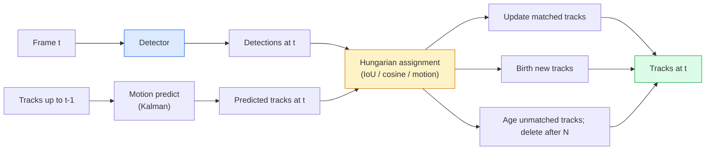

# मल्टी-ऑब्जेक्ट ट्रैकिंग और वीडियो मेमोरी

> ट्रैकिंग है पता लगाने 加 संघटन──检测每一── अनुसार आईडी होगा वर्तमान के पता लगाने 匹配上一 के निशान──

**Type:** Build
**Languages:** Python
**Prerequisites:** Phase 4 Lesson 06 (YOLO Detection), Phase 4 Lesson 08 (Mask R-CNN), Phase 4 Lesson 24 (SAM 3)
**Time:** ~60 分钟

## 学习目标

- 区分 ट्रैकिंग-दर-डिटेक्शन 与 क्वेरी आधारित ट्रैकिंग,并说出算法家族名称(SORT, DeepSORT, ByteTrack, BoT-SORT, SAM 2 मेमोरी ट्रैकर, SAM 3.1 ऑब्जेक्ट मल्टीप्लेक्स)
- 零 से प्राप्त IoU + हंगेरियन असाइनमेंट, क्लासिक ट्रैकिंग-बैक-डिटेक्शन के लिए
-  SAM 2 की मेमोरी बैंक की व्याख्या, और यह क्यों IoU आधारित संघ से अधिक संभाल कर सकते हैं अवरुद्ध
- 读懂三种跟踪指标(MOTA, IDF1, HOTA),并为给定用例 选择最重要的一项

## 问题

डिटेक्टर आपको बताएगा कि एक ही वस्तुओं में कहाँ है। ट्रैकर आपको बताएगा कि फ्रेम क्या है।`t`मध्य में कौन सी पहचान और फ्रेम `t-1`एक ही वस्तु है। इसके बिना, आप वस्तुओं को गिन नहीं सकते हैं। एक लाइन के पार जाने की संख्या, एक गेंद का लगातार पालन नहीं कर सकते हैं, या यह पता नहीं चल सकता है कि कार 4 8 सेकंड के लिए सड़क पर खड़ी है।

प्रत्येक अनुप्रेषण वीडियो के लिए उत्पादों का ट्रैकिंग महत्वपूर्ण हैंः खेल विश्लेषण, निगरानी, स्वायत्त ड्राइविंग, चिकित्सा वीडियो विश्लेषण, वन्यजीव निगरानी, शब्द चिन्ह गणना।

2026 में दो नए मॉडल आएंगे।**SAM 2 memory-based tracking**(उपयोग करें विशेषता-स्मृति 替代 motion-model association) और **SAM 3.1 Object Multiplex**(एक ही अवधारणा के कई उदाहरणों में साझा स्मृति)

## 核心概念

### ट्रैकिंग-डेटेक्शन



2026 में आप जो भी ट्रैकर मिलेंगे, वे इस चक्र के सभी चर हैं।

- **SORT**(2016): Kalman filter + IoU हंगेरियन──简单、快速,没有外观模型──
- **DeepSORT**(2017): SORT + प्रत्येक ट्रैक एक एक सीएनएन आधारित उपस्थिति सुविधा ((ReID एम्बेडिंग) 更多能处理交叉场景──
- **ByteTrack**(2021): निम्न विश्वसनीयता का पता लगाने के लिए एक दूसरे चरण के रूप में संबद्ध होना; उपस्थिति की आवश्यकता नहीं है, लेकिन MOT17 में प्रदर्शन अग्रणी है।
- **BoT-SORT**(2022): बाइट + कैमरा गति मुआवजा + ReID。
- **StrongSORT / OC-SORT** बाइटट्रैक के बाद का तरीका, बेहतर गति और उपस्थिति के साथ

### एक段话 समझना Kalman फ़िल्टर

Kalman फिल्टर के लिए प्रत्येक ट्रैक  एक सह-परिवर्तन स्थिति बनाए रखें `(x, y, w, h, dx, dy, dw, dh)`  में प्रत्येक , यह पहले निरंतर गति मॉडल का उपयोग **predict** स्थिति, और फिर उपयुक्त करने के लिए पता लगाने के साथ **update**️ जब भविष्यवाणी की अनिश्चितता                                                                                                                                                                                                                                                          

प्रत्येक क्लासिक ट्रैकर गति-पूर्वानुमान चरण में होगा Kalman फ़िल्टर का उपयोग करके

### हंगेरियन एल्गोरिथ्म

给定一个 `M x N`लागत मैट्रिक्स(ट्रैक एक्स डिटेक्शन), खोजत बनाना कुल लागत 最小一对一任务──成本通常是`1 - IoU(track_bbox, detection_bbox)`, या उपस्थिति सुविधाओं का नकारात्मक कॉस्साइन समानता──Runtime is O(((M+N) ^3);当 M、N最高约为1000 时,通过 `scipy.optimize.linear_sum_assignment`Python में काफी तेजी से

### ByteTrack के प्रमुख विचार

标准 ट्रैकर 会丢弃低置信度 पता लगाने(< 0.5)。ByteTrack 会保留它们作为 **second-stage candidates**पहले ट्रैक को उच्च विश्वास की पहचान के साथ मेल खाए, फिर अप्रयुक्त ट्रैक को थोड़ा ढीला आईओयू सीमा के साथ मेल खाने दें।

### SAM 2 मेमोरी आधारित ट्रैकिंग

SAM 2 通过维护 प्रति-उपक्रम स्थान-समय विशेषताएं **memory bank**                                                                                                                                                                                                                                                              

没有Kalman filter,也没有匈牙利 assignment──Association 隐含在记忆-注意中──

优点:
- 鲁棒 (स्मृति 会跨多携带实例身份)
- के साथ SAM 3 के पाठ संकेत 结合时支持 खुला-वाक्य संग्रह。
- 无需单独的运动模型──

缺点:
- बाइटट्रैक की तुलना में अधिक धीमी गति से कई वस्तुओं को ट्रैक करने के लिए।
- मेमोरी बैंक 会增长; संदर्भ विंडो 受限──

### SAM 3.1 वस्तु बहुपद

इस प्रकार, प्रत्येक उदाहरण के लिए एक स्वतंत्र मेमोरी बैंक को बनाए रखना होगा। 50 个 个 个 个 个 个 个 个 个 个 个 个 个 个 个 个 个 个 个 个 个 个 个 个 个 个 个 个 个 个 个 个 个 个 个 个 个 个 个 个 个 个 个 个 个 个 个 个 个 个 个 个 个 个 个 个 个 个 个 个 个 个 个 个 个 个 个 个 个 个 个 个 个 个 个 个 个 个 个 个 个 个 个 个 个 个 个 个 个 个 个 个 个 个 个 个 个 个 个 个 个 个 个 个 个 个 个 个 个 个 个 个 个 个 个 个 个 个 个 个 个 个 个 个 个 个 个 个 个 个 个 个 个 个 个 个 个 个 个 个 个 个 个 个 个 个 个 个 个 个 个 个 个 个 个 个 个 个 个 个 个 个 个 个 个 个 个 个 个 个 个 个 个 个 个 个 个 个 个 个 个 个 个 个 个 个 个 个 个 个 个 个 个 个 个 个 个 个 个 个 个 个 个 个 个 个 个 个 个 个 个 个 个 个 个 个 个 个 个 个 个 个 个 个 个 个 个 个 个 个 个 个 个 个 个 个 个 个 个 个 个 个 个 个 个 **per-instance query tokens**                                                                                                                                                                                                                                                              

मल्टीप्लेक्स 2026 साल के भीड़ ट्रैकिंग का नया默认选择:कंसर्ट भीड़, गोदाम श्रमिक, यातायात चौराहे

### 需要掌握的三种计量

- **MOTA (Multi-Object Tracking Accuracy)** 1 - (FN + FP + ID स्विच) / GT。 त्रुटि प्रकार 加权; यह एक होगा पता लगाने और संघ विफलताओं 混合 के एकल मीट्रिक──
- **IDF1 (ID F1)** आईडी सटीकता और याद करने के सामंजस्यपूर्ण अर्थों में से एक है।
- **HOTA (Higher Order Tracking Accuracy)** 分解为 पता लगाने की सटीकता (DetA) और संघ की सटीकता (AssA)  से 2020 साल से लेकर अब तक के सामुदायिक मानकों; सबसे व्यापक 

对于监视(कौन कौन है): रिपोर्ट IDF1──对于体育分析(计数通证):HOTA──对于一般学术比较:HOTA──


```figure
cv3-track-assoc
```

##  इसे निर्माण

### 步骤 1:  IoU के आधार पर लागत मैट्रिक्स

```python
import numpy as np


def bbox_iou(a, b):
    """
    a, b: [x1, y1, x2, y2] 的 (N, 4) arrays。
    返回 (N_a, N_b) IoU matrix。
    """
    ax1, ay1, ax2, ay2 = a[:, 0], a[:, 1], a[:, 2], a[:, 3]
    bx1, by1, bx2, by2 = b[:, 0], b[:, 1], b[:, 2], b[:, 3]
    inter_x1 = np.maximum(ax1[:, None], bx1[None, :])
    inter_y1 = np.maximum(ay1[:, None], by1[None, :])
    inter_x2 = np.minimum(ax2[:, None], bx2[None, :])
    inter_y2 = np.minimum(ay2[:, None], by2[None, :])
    inter = np.clip(inter_x2 - inter_x1, 0, None) * np.clip(inter_y2 - inter_y1, 0, None)
    area_a = (ax2 - ax1) * (ay2 - ay1)
    area_b = (bx2 - bx1) * (by2 - by1)
    union = area_a[:, None] + area_b[None, :] - inter
    return inter / np.clip(union, 1e-8, None)
```

### 步骤 2: 最小 SORT 风格 ट्रैकर

के लिए सरल रूप से,省略 स्थिर गति काल्मन; यहाँ उपयोग सरल IoU संघ; उत्पादन वातावरण में, काल्मन भविष्यवाणी अनिवार्य है।`sort`पायथन पैकेज 提供完整版本──

```python
from scipy.optimize import linear_sum_assignment


class Track:
    def __init__(self, tid, bbox, frame):
        self.id = tid
        self.bbox = bbox
        self.last_frame = frame
        self.hits = 1

    def update(self, bbox, frame):
        self.bbox = bbox
        self.last_frame = frame
        self.hits += 1


class SimpleTracker:
    def __init__(self, iou_threshold=0.3, max_age=5):
        self.tracks = []
        self.next_id = 1
        self.iou_threshold = iou_threshold
        self.max_age = max_age

    def step(self, detections, frame):
        if not self.tracks:
            for d in detections:
                self.tracks.append(Track(self.next_id, d, frame))
                self.next_id += 1
            return [(t.id, t.bbox) for t in self.tracks]

        track_boxes = np.array([t.bbox for t in self.tracks])
        det_boxes = np.array(detections) if len(detections) else np.empty((0, 4))

        iou = bbox_iou(track_boxes, det_boxes) if len(det_boxes) else np.zeros((len(track_boxes), 0))
        cost = 1 - iou
        cost[iou < self.iou_threshold] = 1e6

        matched_track = set()
        matched_det = set()
        if cost.size > 0:
            row, col = linear_sum_assignment(cost)
            for r, c in zip(row, col):
                if cost[r, c] < 1.0:
                    self.tracks[r].update(det_boxes[c], frame)
                    matched_track.add(r); matched_det.add(c)

        for i, d in enumerate(det_boxes):
            if i not in matched_det:
                self.tracks.append(Track(self.next_id, d, frame))
                self.next_id += 1

        self.tracks = [t for t in self.tracks if frame - t.last_frame <= self.max_age]
        return [(t.id, t.bbox) for t in self.tracks]
```

60 行── प्रति फ्रेम पता लगाने, प्रति फ्रेम ट्रैक आईडी वापस करना──真实系统也会加入卡尔曼预测、ByteTrack के दूसरे चरण के पुन-मिलान,以及 उपस्थिति सुविधाएँ──

### 步骤 3: सिंथेटिक ट्रयाक्टोरिया टेस्ट

```python
def synthetic_frames(num_frames=20, num_objects=3, H=240, W=320, seed=0):
    rng = np.random.default_rng(seed)
    starts = rng.uniform(20, 200, size=(num_objects, 2))
    velocities = rng.uniform(-5, 5, size=(num_objects, 2))
    frames = []
    for f in range(num_frames):
        dets = []
        for i in range(num_objects):
            cx, cy = starts[i] + f * velocities[i]
            dets.append([cx - 10, cy - 10, cx + 10, cy + 10])
        frames.append(dets)
    return frames


tracker = SimpleTracker()
for f, dets in enumerate(synthetic_frames()):
    tracks = tracker.step(dets, f)
```

तीनों वस्तुएँ जो सीधे-सीधी गति में स्थित हैं, उन्हें सभी 20 में अपनी-अपनी पहचान बनाए रखनी चाहिए।

### 步骤 4: आईडी स्विच मेट्रिक्स

```python
def count_id_switches(tracks_per_frame, gt_per_frame):
    """
    tracks_per_frame:  list of list of (track_id, bbox)
    gt_per_frame:      list of list of (gt_id, bbox)
    返回 ID switches 的数量。
    """
    prev_assignment = {}
    switches = 0
    for tracks, gts in zip(tracks_per_frame, gt_per_frame):
        if not tracks or not gts:
            continue
        t_boxes = np.array([b for _, b in tracks])
        g_boxes = np.array([b for _, b in gts])
        iou = bbox_iou(g_boxes, t_boxes)
        for g_idx, (gt_id, _) in enumerate(gts):
            j = iou[g_idx].argmax()
            if iou[g_idx, j] > 0.5:
                t_id = tracks[j][0]
                if gt_id in prev_assignment and prev_assignment[gt_id] != t_id:
                    switches += 1
                prev_assignment[gt_id] = t_id
    return switches
```

यह एक सरलीकृत, IDF1 के करीब मीट्रिक हैः एक ग्राउंड-सत्य वस्तु का आंकलन करने के लिए और उसे आवंटित अनुमानित ट्रैक आईडी की संख्या को बदलने के लिए।`py-motmetrics`和 `TrackEval`मध्य में

## इसका उपयोग करें

2026 के उत्पादन स्तर के ट्रैकरः

- `ultralytics` YOLOv8 + 内置 बाइटट्रैक / बोट-सॉर्ट`results = model.track(source, tracker="bytetrack.yaml")`默认选择
- `supervision`(रोबोफ्लो)  बाइटट्रैक रैपर प्लस एनोटेशन उपयोगिताएँ。
- SAM 2 / SAM 3.1  通过 `processor.track()` स्मृति आधारित ट्रैकिंग करें。
- कस्टम स्टैकः डिटेक्टर (YOLOv8 / RT-DETR) + `sort-tracker`/`OC-SORT`/`StrongSORT`

选择方式:

- 30+ fps नीचे के पैदल यात्री / कारों / बक्सेः**ByteTrack with ultralytics**
- लोगों के समूह में एक प्रकार के कई उदाहरणः**SAM 3.1 Object Multiplex**
- 带有可识别的外观 के भारी अस्थिरता:**DeepSORT / StrongSORT**(ReID सुविधाएँ)
- खेल / जटिल बातचीतः**BoT-SORT**या सीखे ट्रैकरों ((MOTRv3)

## 交付 यह

本课会产出:

- `outputs/prompt-tracker-picker.md`   दृश्य प्रकार के आधार पर  छुपाने के पैटर्न तथा विलंबता बजट 选择 SORT / ByteTrack / BoT-SORT / SAM 2 / SAM 3.1。
- `outputs/skill-mot-evaluator.md` 编写一个完整的评估带,用于地面真理轨迹 评估MOTA / IDF1 / HOTA。

## अभ्यास

1. **(Easy)**उपरोक्त सिंथेटिक ट्रैकर का उपयोग करके 3、10 और 30 वस्तुओं को अलग-अलग चलाने के लिए करें। प्रत्येक स्थिति में आईडी-स्विच की गणना की रिपोर्ट करें।
2. **(Medium)**之前加入常速加尔曼预测步骤──展示短暂(2-3 )
3. **(Hard)**集成 SAM 2 का मेमोरी आधारित ट्रैकर(通过 `transformers`) एक प्रतिस्थापन ट्रैकर बैकेंड के रूप में।

## 关键术语

| Term | 常见说法 | 实际含义 |
|------|----------------|----------------------|
| Tracking-by-detection | “先 detect 再 associate” | Per-frame detector + 基于 IoU / appearance 的 Hungarian assignment |
| Kalman filter | “Motion predict” | Linear dynamics + covariance，用于平滑 track predictions 和处理 occlusion |
| Hungarian algorithm | “Optimal assignment” | 求解 minimum-cost bipartite matching 问题；`scipy.optimize.linear_sum_assignment` |
| ByteTrack | “低置信度 second pass” | 将未匹配 tracks 重新匹配到低置信度 detections，以恢复短暂 occlusions |
| DeepSORT | “SORT + appearance” | 添加 ReID feature 用于跨帧匹配；更利于保持 ID |
| Memory bank | “SAM 2 trick” | 跨帧存储的 per-instance spatio-temporal features；cross-attention 替代显式 association |
| Object Multiplex | “SAM 3.1 shared memory” | 使用带 per-instance queries 的单一 shared memory，实现快速 many-object tracking |
| HOTA | “现代 tracking metric” | 分解为 detection 和 association accuracy；社区标准 |

## 延伸阅读

- [SORT (Bewley et al., 2016)](https://arxiv.org/abs/1602.00763) 最小 ट्रैकिंग-बॉडी डिटेक्शन 论文
- [DeepSORT (Wojke et al., 2017)](https://arxiv.org/abs/1703.07402) 添加 उपस्थिति सुविधा
- [ByteTrack (Zhang et al., 2022)](https://arxiv.org/abs/2110.06864) 低置信度 दूसरा पास
- [BoT-SORT (Aharon et al., 2022)](https://arxiv.org/abs/2206.14651) कैमरा गति मुआवजा
- [HOTA (Luiten et al., 2020)](https://arxiv.org/abs/2009.07736) 分解式 ट्रैकिंग मीट्रिक
- [SAM 2 video segmentation (Meta, 2024)](https://ai.meta.com/sam2/) मेमोरी आधारित ट्रैकर
- [SAM 3.1 Object Multiplex (Meta, March 2026)](https://ai.meta.com/blog/segment-anything-model-3/)
