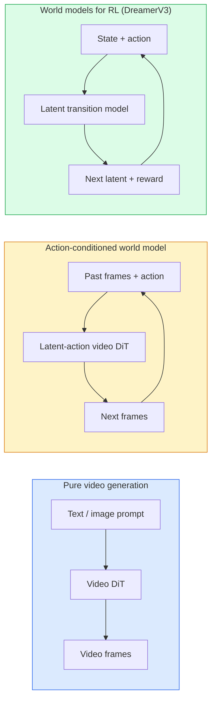

# विश्व मॉडल और वीडियो प्रसारण

> एक वीडियो मॉडल जो भविष्य के कुछ सेकंड के दृश्यों की भविष्यवाणी कर सकता है, वह एक विश्व अनुकरणीय है। इसे गतिशीलता में स्थितिबद्ध करने के लिए, आपको एक सीखा गेम इंजन मिलता है।

**Type:** Learn + Build
**Languages:** Python
**Prerequisites:** Phase 4 Lesson 10 (Diffusion), Phase 4 Lesson 12 (Video Understanding), Phase 4 Lesson 23 (DiT + Rectified Flow)
**Time:** ~75 分钟

## 学习目标
- 解释纯视频生成模型(सोरा 2) और एक्शन-कंडीशनिंग वर्ल्ड मॉडल(जेनी 3, ड्रीमर V3) के बीच अंतर
-  विवरण वीडियो DiT:स्पेस-टाइमरल पैच  3D स्थिति एन्कोडिंग 跨 `(T, H, W)`टोकन का संयुक्त ध्यान
- 追踪 World Model 如何接入机器人:VLM 规划 → वीडियो मॉडल 模拟 → उलट गतिशीलता 输出动作
- 针对给定用例 ((Creative video、interactive sim、autonomous-driving synthesis) 在 Sora 2、Genie 3、Runway GWM-1 Worlds、Wan-Video 和 HunyuanVideo 之间做选择

## 问题
视频生成和世界模型在2026年走向融合―― एक सक्षम उत्पन्न连贯一分钟视频的模型, किसी अर्थ में पहले से ही सीख चुका है कि दुनिया कैसे गतिशील हैः वस्तु स्थायित्व, गुरुत्वाकर्षण, कारणता, शैली―― यदि आप इस पूर्वानुमान को गति में स्थितिबद्ध करते हैं (((向左走、打开门), वीडियो मॉडल एक सीखने योग्य सिम्युलेटर बन जाएगा, खेल इंजन, ड्राइविंग सिम्युलेटर या रोबोटिक्स वातावरण को बदल सकता है――

इसका प्रभाव बहुत विशिष्ट है। जीन 3 को एक ही छवि से बनाया जा सकता है। यह एक ही छवि से बनाया जा सकता है। यह एक ही दृश्य से बनाया गया है। यह एक ही दृश्य से बनाया गया है।

यह कक्षा चरण 4 की है। यह छवि निर्माण, वीडियो समझ और एजेंटिक तर्क को मुख्यधारा के अध्ययन में परिवर्तित वास्तुकला पैटर्न से जोड़ती है।

## 概念
### विश्व मॉडल की तीन श्रेणी प्रणाली



- **Sora 2**                                                                                                                                                                                                                                                              
- **Genie 3****GWM-1 Worlds****Mirage / Magica**वे क्रिया-संशोधित विश्व मॉडल हैं। वे दृश्य वीडियो में लटके कार्यों का अनुमान लगाते हैं, फिर भविष्य को गतिशीलता में परिष्कृत करते हैं। वे परस्पर क्रियाशील हैंः आप बटन दबाएं या मोबाइल कैमरा, दृश्य पर प्रतिक्रिया होगा।
- **DreamerV3**和经典 RL World Model 家族 लटेंट स्पेस में भविष्यवाणी करने के लिए,并带有显然行动条件, आधारित इनाम संकेत 训练――视觉性较弱; लेकिन नमूना-कुशल RL के लिए अधिक उपयोगी──

### वीडियो डीआईटी वास्तुकला

```
Video latent:          (C, T, H, W)
Patchify (spatial):    grid of P_h x P_w patches per frame
Patchify (temporal):   group P_t frames into a temporal patch
Resulting tokens:      (T / P_t) * (H / P_h) * (W / P_w) tokens
```

स्थिति कोडिंग 3D है: प्रत्येक के लिए `(t, h, w)`坐标使用 घूर्णन या सीखा एम्बेडिंग──ध्यान हो सकता हैः

- **Full joint** सभी टोकन सभी टोकन पर उपस्थित होते हैं  N 个 टोकन के लिए O  N ^ 2) 对长视频来说代价过高──
- **Divided** 交替执行 temporal attention(एक ही स्थानिक स्थिति、跨时间:`(H*W) * T^2`) और स्थानिक ध्यान(एक ही समय की गति、跨空间:`T * (H*W)^2`)―टाइमस्फॉमर तथा अधिकांश वीडियो डायट इस तरह से उपयोग करते हैं―
- **Window** में `(t, h, w)`中使用局部窗户──Video Swin इस तरह से प्रयोग करें──

प्रत्येक 2026 के वीडियो प्रसारण मॉडल इन तीनों में से एक का उपयोग करेगा, फिर से AdaLN कंडीशनिंग (पाठ 23) और सुधारित प्रवाह को जोड़कर।

### 基于动作的 कंडीशनिंगःलैटिन एक्शन मॉडल

जीन 通过判别式地预测一对连续之间的动作,为每一学习一个 **latent action** तब मॉडल का डिकोडर  शर्त लगाता है कि यह अनुमानित लटेंट एक्शन ऊपर है, न कि स्पष्ट कीबोर्ड के बटन पर।  जब उपयोगकर्ता एक लटेंट एक्शन निर्दिष्ट कर सकता है, तो मॉडल उस एक्शन के अनुरूप निम्न को उत्पन्न करेगा।

सोरा  पूरी तरह से गतिशील इंटरफेस को छोड़ दिया गया है ∙ इसका डिकोडर अतीत के अंतरिक्ष-समय टोकन से 预测 अगले अंतरिक्ष-समय टोकनों ∙ तुरंत केवल स्थितिबद्ध प्रारंभ बिंदु; उत्पन्न करने के दौरान कुछ भी नहीं है जो इसे नियंत्रित कर सकता है ∙

### भौतिक विश्वसनीयता

सोरा 2 की 2026 की घोषणा स्पष्ट रूप से घोषित हो गई है।**physical plausibility**: वजन, संतुलन, वस्तु स्थायित्व, कारण-परिणाम, टीम द्वारा कृत्रिम मूल्यांकन के माध्यम से विश्वसनीयता स्कोर मापने; सोरा 1 के मुकाबले, इस मॉडल में गिरावट वाली वस्तुओं, भूमिका के टकराव और जानबूझकर विफल होने (एक बार असफलता) जैसे परिदृश्यों में स्पष्ट सुधार हुआ है।

तर्कसंगतता  अभी भी मुख्य विफलता मॉडल है ∙2024-2025 साल के लोग खाए इटली面 या कांच के कप के साथ पानी पीने के वीडियो ने मॉडल की कमी का खुलासा किया स्थायी वस्तु प्रतिनिधित्व ∙2026 साल के मॉडल ∙Sora 2 ∙Runway Gen-5 ∙HunyuanVideo) इन समस्याओं को कम किया, लेकिन नहीं मिटाया ∙

### स्वयंचलित दुनिया मॉडल

ड्राइविंग विश्व मॉडल                                                                                                                                                                                                                                                             

- **Cosmos-Drive-Dreams**(NVIDIA)  RL प्रशिक्षण के लिए 生成数分钟驾驶视频──
- **Gaia-2**(वैव)  नीति मूल्यांकन के लिए प्रक्षेपवक्र-संशोधित दृश्य संश्लेषण हेतु प्रयोग किया गया है。
- **DrivingWorld**(टेस्ला)  模拟多样气候, दिन का समय, यातायात की स्थिति
- **Vista**(बाइटडांस)  响应式驾驶场景合成──

उन्होंने खर्चीले वास्तविक दुनिया डेटा संग्रह को बदल दिया, जैसे कि रात के समय सड़क पर चलने वाले लोगों के लिए, या वाहनों के लिए, या तो इन प्रकारों को एकत्र करने के लिए लाखों मील की दूरी पर ड्राइविंग की आवश्यकता होती है।

### 机器人技术:VLM + वीडियो मॉडल + उल्टा गतिशीलता

तीन घटक रोबोटिक्स लूप में आ रहा हैः

1. **VLM**解析目标(拿起红色杯子), उच्च स्तरीय कार्रवाई अनुक्रम नियोजन करना──
2. **Video generation model**模拟执行每动作会是什么样子,预测未来 N  टिप्पणियाँ──
3. **Inverse dynamics model**提取会产生这些观察的具体动机命令──

यह इनाम आकार और नमूना-भारी आरएल के स्थान पर आया है। विश्व मॉडल  जिम्मेदार कल्पना; विपरीत गतिशीलता                                                                                                                                                                                                                                                                                                                                                                                                                                                                                                   

### मूल्यांकन

- **Visual quality** FVD (Fréchet Video Distance) 、 उपयोगकर्ता अध्ययन。
- **Prompt alignment** प्रत्येक  क्लिप्स स्कोर、 वीक्यूए शैली मूल्यांकन──
- **Physical plausibility**                                                                                                                                                                                                                                                              
- **Controllability**(आक्रामक विश्व मॉडल के लिए)  कार्रवाई → अवलोकन स्थिरता;你能否回到以前的状态?

### 2026 साल का मॉडल संस्करण

| Model | Use | Parameters | Output | License |
|-------|-----|------------|--------|---------|
| Sora 2 | text-to-video, audio | — | 1-min 1080p + audio | API only |
| Runway Gen-5 | text/image-to-video | — | 10s clips | API |
| Runway GWM-1 Worlds | interactive world | — | infinite 3D rollout | API |
| Genie 3 | interactive world from image | 11B+ | playable frames | research preview |
| Wan-Video 2.1 | open text-to-video | 14B | high-quality clips | non-commercial |
| HunyuanVideo | open text-to-video | 13B | 10s clips | permissive |
| Cosmos / Cosmos-Drive | autonomous driving sim | 7-14B | driving scenes | NVIDIA open |
| Magica / Mirage 2 | AI-native game engine | — | modifiable worlds | product |


```figure
v4-world-rollout
```

##  इसे निर्माण
### 步骤 1: वीडियो के 3D patchify

```python
import torch
import torch.nn as nn


class VideoPatch3D(nn.Module):
    def __init__(self, in_channels=4, dim=64, patch_t=2, patch_h=2, patch_w=2):
        super().__init__()
        self.proj = nn.Conv3d(
            in_channels, dim,
            kernel_size=(patch_t, patch_h, patch_w),
            stride=(patch_t, patch_h, patch_w),
        )
        self.patch_t = patch_t
        self.patch_h = patch_h
        self.patch_w = patch_w

    def forward(self, x):
        # x: (N, C, T, H, W)
        x = self.proj(x)
        n, c, t, h, w = x.shape
        tokens = x.reshape(n, c, t * h * w).transpose(1, 2)
        return tokens, (t, h, w)
```

एक कदम के समान नाभिक के 3 डी कन्भ में अंतरिक्ष-समय पैच करने वाला होगा।`(T, H, W) -> (T/2, H/2, W/2)`网格──

### 步骤 2: 3D घूर्णन स्थिति एन्कोडिंग

रोटरिक पोजीशन एम्बेडमेंट (RoPE) 分別沿 `t``h``w`轴应用:

```python
def rope_3d(tokens, t_dim, h_dim, w_dim, grid):
    """
    tokens: (N, T*H*W, D)
    grid: (T, H, W) sizes
    t_dim + h_dim + w_dim == D
    """
    T, H, W = grid
    n, seq, d = tokens.shape
    if t_dim + h_dim + w_dim != d:
        raise ValueError(f"t_dim+h_dim+w_dim ({t_dim}+{h_dim}+{w_dim}) must equal D={d}")
    assert seq == T * H * W
    t_idx = torch.arange(T, device=tokens.device).repeat_interleave(H * W)
    h_idx = torch.arange(H, device=tokens.device).repeat_interleave(W).repeat(T)
    w_idx = torch.arange(W, device=tokens.device).repeat(T * H)
    # Simplified: just scale channels by frequencies. Real RoPE rotates pairs.
    freqs_t = torch.exp(-torch.log(torch.tensor(10000.0)) * torch.arange(t_dim // 2, device=tokens.device) / (t_dim // 2))
    freqs_h = torch.exp(-torch.log(torch.tensor(10000.0)) * torch.arange(h_dim // 2, device=tokens.device) / (h_dim // 2))
    freqs_w = torch.exp(-torch.log(torch.tensor(10000.0)) * torch.arange(w_dim // 2, device=tokens.device) / (w_dim // 2))
    emb_t = torch.cat([torch.sin(t_idx[:, None] * freqs_t), torch.cos(t_idx[:, None] * freqs_t)], dim=-1)
    emb_h = torch.cat([torch.sin(h_idx[:, None] * freqs_h), torch.cos(h_idx[:, None] * freqs_h)], dim=-1)
    emb_w = torch.cat([torch.sin(w_idx[:, None] * freqs_w), torch.cos(w_idx[:, None] * freqs_w)], dim=-1)
    return tokens + torch.cat([emb_t, emb_h, emb_w], dim=-1)
```

यह एक सरलीकृत योजक रूप है। वास्तविक रोपी चैनल पर आवृत्ति के अनुसार घूमता है।

### 步骤 3: विभाजित ध्यान ब्लॉक

```python
class DividedAttentionBlock(nn.Module):
    def __init__(self, dim=64, heads=2):
        super().__init__()
        self.time_attn = nn.MultiheadAttention(dim, heads, batch_first=True)
        self.space_attn = nn.MultiheadAttention(dim, heads, batch_first=True)
        self.ln1 = nn.LayerNorm(dim)
        self.ln2 = nn.LayerNorm(dim)
        self.ln3 = nn.LayerNorm(dim)
        self.mlp = nn.Sequential(nn.Linear(dim, 4 * dim), nn.GELU(), nn.Linear(4 * dim, dim))

    def forward(self, x, grid):
        T, H, W = grid
        n, seq, d = x.shape
        # time attention: same (h, w), across t
        xt = x.view(n, T, H * W, d).permute(0, 2, 1, 3).reshape(n * H * W, T, d)
        a, _ = self.time_attn(self.ln1(xt), self.ln1(xt), self.ln1(xt), need_weights=False)
        xt = (xt + a).reshape(n, H * W, T, d).permute(0, 2, 1, 3).reshape(n, seq, d)
        # space attention: same t, across (h, w)
        xs = xt.view(n, T, H * W, d).reshape(n * T, H * W, d)
        a, _ = self.space_attn(self.ln2(xs), self.ln2(xs), self.ln2(xs), need_weights=False)
        xs = (xs + a).reshape(n, T, H * W, d).reshape(n, seq, d)
        xs = xs + self.mlp(self.ln3(xs))
        return xs
```

समय ध्यान प्रत्येक स्थानिक स्थिति में 内跨时间 attend;space attention 在每一内跨位置 attend── दो O(T^2 + (HW) ^2) 操作 के साथ, एक O((THW) ^2) 操作 के साथ, यह TimeSformer 和每个现代 वीडियो DiT का केंद्र है──

### 步骤 4: 组合一个小视频 DiT

```python
class TinyVideoDiT(nn.Module):
    def __init__(self, in_channels=4, dim=64, depth=2, heads=2):
        super().__init__()
        self.patch = VideoPatch3D(in_channels=in_channels, dim=dim, patch_t=2, patch_h=2, patch_w=2)
        self.blocks = nn.ModuleList([DividedAttentionBlock(dim, heads) for _ in range(depth)])
        self.out = nn.Linear(dim, in_channels * 2 * 2 * 2)

    def forward(self, x):
        tokens, grid = self.patch(x)
        for blk in self.blocks:
            tokens = blk(tokens, grid)
        return self.out(tokens), grid
```

यह एक काम करने योग्य वीडियो जनरेटर नहीं है; यह एक संरचनात्मक प्रदर्शन है, प्रत्येक भाग के आकार को सही साबित करता है।

### 步骤 5: 检查形状

```python
vid = torch.randn(1, 4, 8, 16, 16)  # (N, C, T, H, W)
model = TinyVideoDiT()
out, grid = model(vid)
print(f"input  {tuple(vid.shape)}")
print(f"tokens grid {grid}")
print(f"output {tuple(out.shape)}")
```

पैचिंग 后预期 `grid = (4, 8, 8)`且 `out = (1, 256, 32)`;head 随后投影到每一个代币对应的空间-时间补丁, तैयार-un-patchify 回视频──

## इसका उपयोग करें
2026 के उत्पादन यात्रा मोडः

- **Sora 2 API**(OpenAI)  पाठ-से-वीडियो、同步音频── प्रीमियम मूल्य निर्धारण──
- **Runway Gen-5 / GWM-1**(रनवे)  छवि-टू-वीडियो आंतरिक दुनियाएँ
- **Wan-Video 2.1 / HunyuanVideo**                                     
- **Cosmos / Cosmos-Drive**(NVIDIA)  ड्राइविंग सिमुलेशन खुला वजन 
- **Genie 3** अनुसंधान पूर्वावलोकन, आवश्यकताएँ आवेदन

构建互动世界模型演示:从 Wan-Video 开始以获得质量,再叠加一个潜伏动作适配器来实现交互性――自动驾驶模拟:Cosmos-Drive是2026年的开放参考――

现实中的 रोबोटिक्स स्टैक:

1. भाषा लक्ष्य -> VLM (Qwen3-VL) -> उच्च स्तरीय योजना──
2. योजना -> लटेंट-एक्शन वीडियो मॉडल -> कल्पना रोलआउट──
3. रोलआउट -> रिवर्स डायनामिक्स मॉडल -> निम्न स्तर की कार्रवाई──
4. 执行 Actions -> अवलोकन चरण 1 में वापस किया गया

## 交付 यह
本课产出:

- `outputs/prompt-video-model-picker.md`                                                                                                                                                                                                                                                              
- `outputs/skill-physical-plausibility-checks.md` एक परिभाषित स्वचालित जांच (अवस्तु स्थायित्व, गुरुत्वाकर्षण, निरंतरता) कौशल, जो प्रसव से पहले किसी भी उत्पादन वीडियो को जांचने में उपयोग किया जाता है।

## अभ्यास
1. **(Easy)**計算一个 5 秒 360p 视频在补丁-t=2、补丁-h=8、补丁-w=8 时的代币数――推理这个规模下关注的内存需求――
2. **(Medium)**ऊपर दिए गए विभाजित ध्यान ब्लॉक को पूर्ण संयुक्त ध्यान ब्लॉक में बदलें,并测量形和参数数量── व्याख्या क्यों वास्तविक वीडियो मॉडल 必须使用 विभाजित ध्यान──
3. **(Hard)**构建一个最小潜伏动作视频模型:使用 `(frame_t, action_t, frame_{t+1})`तीन गुना 数据集(任意简单 2D खेल), प्रशिक्षण एक कार्रवाई आधारित एम्बेडिंग  शर्तों लघु वीडियो DiT,并展示不同动作会产生不同的下一──

## 关键术语
| Term | What people say | What it actually means |
|------|----------------|----------------------|
| World model | “Learned simulator” | 一个在给定 state 和 action 时预测未来 observations 的模型 |
| Video DiT | “Spacetime transformer” | 使用 3D patchification 和 divided attention 的 Diffusion transformer |
| Latent action | “Inferred control” | 从帧对中推断出的离散或连续 action latent；用于条件化 next-frame generation |
| Divided attention | “Time then space” | 每个 block 中的两个 attention 操作：先跨时间，再跨空间，用来让 O(N^2) 保持可控 |
| Object permanence | “Things stay real” | video models 必须学会的场景属性；在食物、玻璃器皿上的经典失败模式 |
| FVD | “Fréchet Video Distance” | FID 的视频等价物；主要 visual quality metric |
| Inverse dynamics model | “Observations to actions” | 给定 `(state, next state)`，输出连接二者的 action；闭合 robotics loop |
| Cosmos-Drive | “NVIDIA driving sim” | 用于 RL 和 evaluation 的 open-weights autonomous-driving world model |

## 延伸阅读
- [Sora technical report (OpenAI)](https://openai.com/index/video-generation-models-as-world-simulators/)
- [Genie: Generative Interactive Environments (Bruce et al., 2024)](https://arxiv.org/abs/2402.15391) लटेंट एक्शन वर्ल्ड मॉडल
- [TimeSformer (Bertasius et al., 2021)](https://arxiv.org/abs/2102.05095) वीडियो ट्रांसफार्मर के साथ विभाजित ध्यान
- [DreamerV3 (Hafner et al., 2023)](https://arxiv.org/abs/2301.04104) RL के विश्व मॉडल के साथ
- [Cosmos-Drive-Dreams (NVIDIA, 2025)](https://research.nvidia.com/labs/toronto-ai/cosmos-drive-dreams/) ड्राइविंग वर्ल्ड मॉडल
- [Top 10 Video Generation Models 2026 (DataCamp)](https://www.datacamp.com/blog/top-video-generation-models)
- [From Video Generation to World Model — survey repo](https://github.com/ziqihuangg/Awesome-From-Video-Generation-to-World-Model/)
