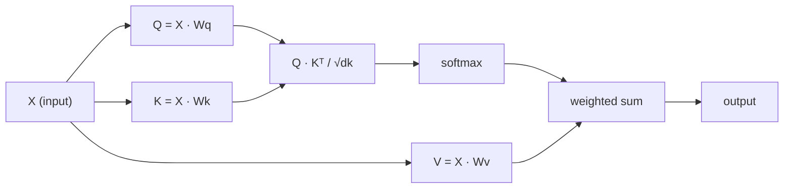

# से शून्य आत्म-ध्यान प्राप्त करना

> ध्यान एक प्रश्न पत्र है, जिसमें से प्रत्येक शब्द में प्रश्न होता हैः मेरे लिए कौन महत्वपूर्ण है?并学习答案──

**类型：**构建
**语言：**पायथन
**先修要求：**चरण 3 (गहन सीखने का मूल), चरण 5 पाठ 10 (अनुक्रम से अनुक्रम)
**时间：**~ 90 मिनट

## 学习目标

- 仅使用NumPy 零 零 零 实现 零 零 零 零 零 零 零 零 零 零 零 零 零 零 零 零 零 零 零 零 零 零 零 零 零 零 零 零 零 零 零 零 零 零 零 零 零 零 零 零 零 零 零 零 零 零 零 零 零 零 零 零 零 零 零 零 零 零 零 零 零 零 零 零 零 零 零 零 零 零 零 零 零 零 零 零 零 零 零 零    零 零 零 零 零 零  零 零                                                                                                                                                                                                                                                                                                                            
- 构建多头注意层,用于拆分头、计算并行注意,并拼接结果
-  ट्रैकिंग ध्यान मैट्रिक्स  कैसे पकड़ें टोकन  संबंध,并解释为什么除以 sqrt(d_k) softmax 和 को रोक सकता है
-  लागू कारणों का मुखौटा,将 द्विदिश ध्यान 转换为 ऑटोरेग्रेसिव(डेकोडर शैली) ध्यान

## 问题

RNNs एक बार एक टोकन को संसाधित करते हैं। जब आप 50 टोकन तक पहुंच जाते हैं, तो पहले टोकन से प्राप्त जानकारी को 50 बार संपीड़ित किया जाता है।

2014 के बहदानु ध्यान 论文 प्रदर्शन समझ कैसेः चलो डिकोडर को प्रत्येक एन्कोडर 位置 पर वापस देखें, और यह निर्णय लें कि वर्तमान चरणों पर कौन से स्थान महत्वपूर्ण हैं। लेकिन यह अभी भी RNN के ऊपर में जोड़ा गया है। 2017 के "ध्यान ही आपको चाहिए" 论文 ने एक और भी महत्वपूर्ण प्रश्न उठायाः यदि ध्यान ही एकमात्र तंत्र है? कोई पुनरावृत्ति नहीं है।

आत्म-विचार  क्रम में प्रत्येक स्थान को एक ही समवर्ती चरण में प्रत्येक अन्य स्थान पर उपस्थित करने में सक्षम बनाना  यही कारण है कि ट्रांसफार्मर  तेजी  विस्तार और प्रभुत्व धारण करते हैं

## 概念

### डेटाबेस पूछताछ

ध्यान को एक सॉफ्ट डेटाबेस क्वेरी के रूप में कल्पना करेंः

```
Traditional database:
  Query: "capital of France"  -->  exact match  -->  "Paris"

Attention:
  Query: "capital of France"  -->  similarity to ALL keys  -->  weighted blend of ALL values
```

प्रत्येक टोकन तीन वेक्टर उत्पन्न करेगाः
- **Query (Q)**मैं क्या तलाश कर रहा हूँ?
- **Key (K)**मैं क्या शामिल हूँ?
- **Value (V)** अगर चुना जाता है, मैं क्या जानकारी प्रदान करता हूँ?

एक क्वेरी सभी कुंजी के डॉट उत्पाद के साथ ध्यान अंक उत्पन्न करेगा──高分表示 यह कुंजी 匹配我的查询── ये अंक मूल्य के साथ होगा 加权──输出是值的加权和──

### Q、K、V 计算

प्रत्येक टोकन एम्बेडिंग तीन सीखने प्राप्त वजन मैट्रिक्स के माध्यम से होगा  परिकल्पना करने के लिएः

```
Input embeddings (sequence of n tokens, each d-dimensional):

  X = [x1, x2, x3, ..., xn]       shape: (n, d)

Three weight matrices:

  Wq  shape: (d, dk)
  Wk  shape: (d, dk)
  Wv  shape: (d, dv)

Projections:

  Q = X @ Wq    shape: (n, dk)      each token's query
  K = X @ Wk    shape: (n, dk)      each token's key
  V = X @ Wv    shape: (n, dv)      each token's value
```

एक टोकन के लिए, दृश्य से ऊपर देखेंः

```
             Wq
  x_i ------[*]------> q_i    "What am I looking for?"
       |
       |     Wk
       +----[*]------> k_i    "What do I contain?"
       |
       |     Wv
       +----[*]------> v_i    "What do I offer?"
```

### ध्यान मैट्रिक्स

एक बार जब आप सभी टोकन के Q,K,V, ध्यान अंक प्राप्त करते हैं, तो एक मैट्रिक्स बन जाएगाः

```
Scores = Q @ K^T    shape: (n, n)

              k1    k2    k3    k4    k5
        +-----+-----+-----+-----+-----+
   q1   | 2.1 | 0.3 | 0.1 | 0.8 | 0.2 |   <- how much q1 attends to each key
        +-----+-----+-----+-----+-----+
   q2   | 0.4 | 1.9 | 0.7 | 0.1 | 0.3 |
        +-----+-----+-----+-----+-----+
   q3   | 0.2 | 0.6 | 2.3 | 0.5 | 0.1 |
        +-----+-----+-----+-----+-----+
   q4   | 0.9 | 0.1 | 0.4 | 1.7 | 0.6 |
        +-----+-----+-----+-----+-----+
   q5   | 0.1 | 0.3 | 0.2 | 0.5 | 2.0 |
        +-----+-----+-----+-----+-----+

Each row: one token's attention over the entire sequence
```

एक बार एक क्वेरी देखें  कैसे सभी कुंजी को साफ़ करें: प्रत्येक पंक्ति को प्रत्येक टोकन 打分, सॉफ्टमैक्स  को वजन में बदल दें, जबकि संदर्भ वेक्टर = मानों का अतिरिक्त शक्ति मिश्रण

```figure
attention-matrix
```

### क्यों संकुचित करना?

यदि dk = 64,dot उत्पाद हो सकता है कि कुछ दशकों की सीमा तक पहुँच जाए, तो इसे सॉफ्टमैक्स में डालकर ग्रेडिएंट गायब क्षेत्र में लाया जाए।

```
Scaled scores = (Q @ K^T) / sqrt(dk)
```

यह संख्यात्मक मान को नरम अधिकतम के भीतर बनाए रखेगा ताकि उपयोगी ग्रेडिएंट उत्पन्न हो सके।

### सॉफ्टमैक्स स्कोर को वजन में बदल देगा

Softmax 会将原始分数 转换为每一行概率分布:

```
Raw scores for q1:   [2.1, 0.3, 0.1, 0.8, 0.2]
                            |
                         softmax
                            |
Attention weights:   [0.52, 0.09, 0.07, 0.14, 0.08]   (sums to ~1.0)
```

अब, प्रत्येक टोकन में वजन का एक समूह है, यह दर्शाता है कि यह अन्य प्रत्येक टोकन में भाग लेना चाहिए।

### मूल्य के अतिरिक्त अधिकार और

प्रत्येक टोकन का अंतिम आउटपुट सभी मूल्य वेक्टरों का अतिरिक्त अधिकार है:

```
output_i = sum( attention_weight[i][j] * v_j  for all j )

For token 1:
  output_1 = 0.52 * v1 + 0.09 * v2 + 0.07 * v3 + 0.14 * v4 + 0.08 * v5
```

### 完整流程



एक सूत्र

```
Attention(Q, K, V) = softmax( Q @ K^T / sqrt(dk) ) @ V
```

```figure
softmax-attention-scaling
```

##  इसे निर्माण

### 步骤 1: शून्य से सॉफ्टमैक्स को प्राप्त करना

Softmax 会将原始logits 转换为概率──数值稳定性 हेतु, पहले अधिकतम मूल्य घटाएँ──

```python
import numpy as np

def softmax(x):
    shifted = x - np.max(x, axis=-1, keepdims=True)
    exp_x = np.exp(shifted)
    return exp_x / np.sum(exp_x, axis=-1, keepdims=True)

logits = np.array([2.0, 1.0, 0.1])
print(f"logits:  {logits}")
print(f"softmax: {softmax(logits)}")
print(f"sum:     {softmax(logits).sum():.4f}")
```

### 步骤 2: स्केलेड डॉट-प्रोडक्ट ध्यान

核心函数──接收 Q、K、V मैट्रिक्स,并返回注意输出 和重量矩阵──

```python
def scaled_dot_product_attention(Q, K, V):
    dk = Q.shape[-1]
    scores = Q @ K.T / np.sqrt(dk)
    weights = softmax(scores)
    output = weights @ V
    return output, weights
```

### 步骤 3:带学习投影的 स्व-ध्यान कक्षा

एक पूर्ण स्व-विचार मॉड्यूल, जिसमें Xvier-जैसे स्केलिंग के उपयोग से Wq、Wk、Wv वजन मैट्रिक्स शामिल हैं।

```python
class SelfAttention:
    def __init__(self, d_model, dk, dv, seed=42):
        rng = np.random.default_rng(seed)
        scale = np.sqrt(2.0 / (d_model + dk))
        self.Wq = rng.normal(0, scale, (d_model, dk))
        self.Wk = rng.normal(0, scale, (d_model, dk))
        scale_v = np.sqrt(2.0 / (d_model + dv))
        self.Wv = rng.normal(0, scale_v, (d_model, dv))
        self.dk = dk

    def forward(self, X):
        Q = X @ self.Wq
        K = X @ self.Wk
        V = X @ self.Wv
        output, weights = scaled_dot_product_attention(Q, K, V)
        return output, weights
```

### 步骤 4: एक वाक्य में चलना

एक वाक्य में बनायें झूठी एम्बेडिंग,并观察注意重量──

```python
sentence = ["The", "cat", "sat", "on", "the", "mat"]
n_tokens = len(sentence)
d_model = 8
dk = 4
dv = 4

rng = np.random.default_rng(42)
X = rng.normal(0, 1, (n_tokens, d_model))

attn = SelfAttention(d_model, dk, dv, seed=42)
output, weights = attn.forward(X)

print("Attention weights (each row: where that token looks):\n")
print(f"{'':>6}", end="")
for token in sentence:
    print(f"{token:>6}", end="")
print()

for i, token in enumerate(sentence):
    print(f"{token:>6}", end="")
    for j in range(n_tokens):
        w = weights[i][j]
        print(f"{w:6.3f}", end="")
    print()
```

### 步骤 5: ASCII हीटमैप का उपयोग可视化 ध्यान

映射为字符,快速获得视觉结果──

```python
def ascii_heatmap(weights, tokens, chars=" ░▒▓█"):
    n = len(tokens)
    print(f"\n{'':>6}", end="")
    for t in tokens:
        print(f"{t:>6}", end="")
    print()

    for i in range(n):
        print(f"{tokens[i]:>6}", end="")
        for j in range(n):
            level = int(weights[i][j] * (len(chars) - 1) / weights.max())
            level = min(level, len(chars) - 1)
            print(f"{'  ' + chars[level] + '   '}", end="")
        print()

ascii_heatmap(weights, sentence)
```

## इसका उपयोग करें

पिटॉर्च की `nn.MultiheadAttention` doing right is what we are just building, इसके अलावा कई सिर विभाजन और आउटपुट प्रोजेक्शन शामिल हैंः

```python
import torch
import torch.nn as nn

d_model = 8
n_heads = 2
seq_len = 6

mha = nn.MultiheadAttention(embed_dim=d_model, num_heads=n_heads, batch_first=True)

X_torch = torch.randn(1, seq_len, d_model)

output, attn_weights = mha(X_torch, X_torch, X_torch)

print(f"Input shape:            {X_torch.shape}")
print(f"Output shape:           {output.shape}")
print(f"Attention weight shape: {attn_weights.shape}")
print(f"\nAttn weights (averaged over heads):")
print(attn_weights[0].detach().numpy().round(3))
```

关键区别:बहु-हेड ध्यान 会并行运行多个注意功能, प्रत्येक के पास अपने स्वयं के Q、K、V प्रोजेक्शन हैं,大小为 dk = d_model / n_heads,然后拼接结果──这让模型能够同时参加不同类型的关系──

## 交付 यह

本课会产出:
- `outputs/prompt-attention-explainer.md`- एक डेटाबेस पूछताछ वर्ग के माध्यम से ध्यान के संकेत की व्याख्या करने के लिए

## अभ्यास

1. 修改 `scaled_dot_product_attention`, इसे एक चयन योग्य मास्क मैट्रिक्स स्वीकार करने दें, softmax  से पहले कुछ स्थानों को नकारात्मक के लिए सेट किया जाएगा
2. से शून्य प्राप्त बहु-मुख्य ध्यान:将 Q、K、V 拆分为`n_heads`个块,在每个块上运行注意,拼接,并通过最终重量矩阵 Wo 投影
3.  दो समान लंबाई के अलग-अलग वाक्य लें, उन्हें एक ही स्व-विचार उदाहरण में दर्ज करें, और उनके ध्यान पैटर्न की तुलना करें── क्या बदल गया है? क्या नहीं बदल रहा है?

## 关键术语

| Term | 人们常说 | 实际含义 |
|------|----------------|----------------------|
| Query (Q) | “问题 Vector” | 输入的一个学习投影，表示这个 Token 正在寻找什么信息 |
| Key (K) | “标签 Vector” | 一个学习投影，表示这个 Token 包含什么信息，并会与 queries 进行匹配 |
| Value (V) | “内容 Vector” | 一个学习投影，携带会基于 attention scores 被聚合的实际信息 |
| Scaled dot-product attention | “Attention 公式” | softmax(QK^T / sqrt(dk)) @ V - 缩放可以防止高维中的 softmax 饱和 |
| Self-attention | “Token 看自己和其他 Token” | Q、K、V 都来自同一序列的 Attention，让每个位置都能 attend 到其他每个位置 |
| Attention weights | “关注程度” | 位置上的概率分布，由 scaled dot products 上的 softmax 产生 |
| Multi-head attention | “并行 Attention” | 使用不同 projections 运行多个 attention functions，然后拼接结果，以获得更丰富的 representations |

## 延伸阅读

- [Attention Is All You Need (Vaswani et al., 2017)](https://arxiv.org/abs/1706.03762)- मूल ट्रांसफार्मर 论文
- [The Illustrated Transformer (Jay Alammar)](https://jalammar.github.io/illustrated-transformer/)- पूर्ण संरचना के लिए सबसे अच्छा दृश्य व्याख्या
- [The Annotated Transformer (Harvard NLP)](https://nlp.seas.harvard.edu/annotated-transformer/)- 带解释的逐行 PyTorch 实现
