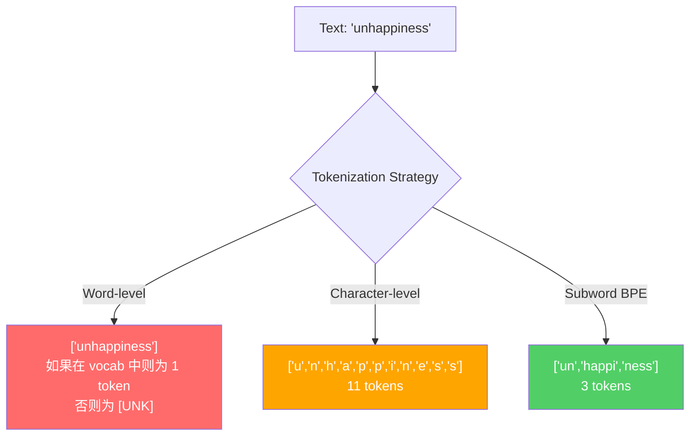
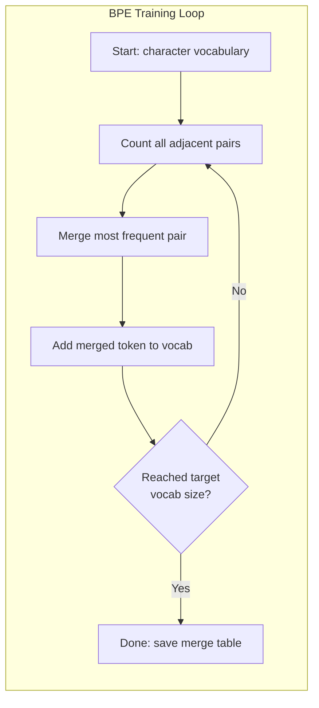
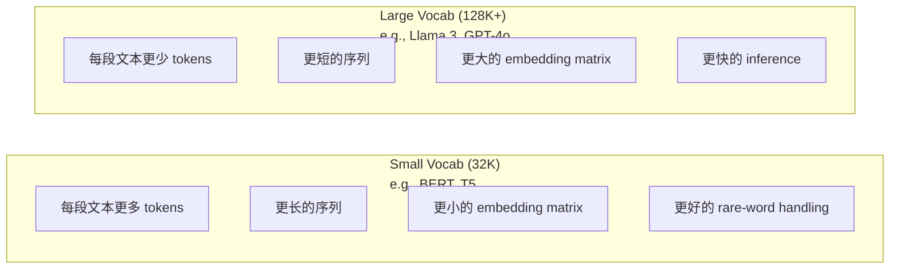

# टोकन बनाने वालेः बीपीई, वर्डपीस, सैंटेंसपीस

> आपका LLM 不读取英文──它读取整数── टोकनीज़र यह तय करता है कि ये整数 क्या अर्थ है या क्या वे बर्बाद हैं──

**Type:** Build
**Languages:** Python
**Prerequisites:** Phase 05 (NLP Foundations)
**Time:** ~90 minutes

## 学习目标
- BPE, WordPiece और Unigram टोकनकरण एल्गोरिदम को शून्य से लागू करने से, उनकी विलय रणनीतियों की तुलना करें
- 解释词汇大小会产生长序列, 过大会浪费嵌入参数
- 分析不同语言和代码中的 टोकनाइज़ेशन कलाकृतियाँ, पहचान विशिष्ट टोकनाइजर्स 在哪里失效
- उपयोग करें tiktoken और वाक्य टुकड़े पुस्तकालयों के लिए पाठ टोकन बनाने के लिए, और चेक उत्पन्न टोकन आईडी

## 问题
आपका LLM 不读取英文──它不读取任何语言──它读取数字──

"हैलो, दुनिया! " से [15496, 11, 995, 0] के बीच का अंतर, टोकनराइज़र है। प्रत्येक शब्द, प्रत्येक रिक्त स्थान, प्रत्येक अंक अंक प्रतीक, सभी को पहले पूर्णांक में परिवर्तित किया जाना चाहिए, मॉडल इसे संभाल सकता है। यह परिवर्तन मध्यम नहीं है। यह कुछ परिकल्पनाओं को मॉडल में डालता है, लेकिन इन परिकल्पनाओं के बाद इसे रद्द नहीं किया जा सकता है।

यदि यहाँ गलत किया जाए, तो मॉडल को बर्बाद करने की क्षमता होगी, कई टोकन का उपयोग करके कॉड करने के लिए। "दुर्भाग्य से" एक के बजाय चार टोकन बन जाएगा।

आप GPT-4 या क्लाउड  पर प्रक्षेपित प्रत्येक एपीआई कॉल, सभी टोकन 定价── मॉडल उत्पन्न प्रत्येक टोकन                                                                                                                                                                                                                                               

## 概念
### 三种失败的方法 (三种失败的方法)

पाठ को संख्यात्मक रूप से परिवर्तित करने के तीन स्पष्ट तरीके हैं।

**Word-level tokenization**按空格和标点切分──" बिल्ली बैठी" 会变成 ["The", "cat", "sat"]──很简单──但"tokenization" 怎么办?"GPT-4o"`[UNK]`token -- यह मॉडल में बोल मैं पूरी तरह से नहीं जानता यह क्या है── केवल अंग्रेजी में एक मिलियन से अधिक शब्द हैं। फिर कोड, URL, विज्ञान गणना विधि और अन्य 100 भाषाओं को जोड़कर, आपको एक असीमित शब्दावली की आवश्यकता है

**Character-level tokenization**走向另一个方向──"हैलो"会变成 ["h", "e", "l", "l", "l", "o"]── शब्दावली 很小(几百个字符)──永远不会有未知代号──但序列会变得极长──一个本本是10个字级代号的句子,会变成50个字符级代号──模型必须学会"t", h",、"e" 放在一起表示"the"--把注意力消耗在一个人类三岁就能学会的东西上──

**Subword tokenization**找到了平衡点──常见词保持完整:"the" 是一个代币──罕见词会分解成有意义的片段:"不快乐" 变成 ["un", "happy", "ness"]──词典保持可控(30K到128K टोकन)──序列保持较短──未知 टोकन 基本消失,因为任何词都可以由子词的部分构建出来──

प्रत्येक आधुनिक LLM में सबवर्ड टोकनाइजेशन का उपयोग किया जाता है।



### बीपीईः बाइट जोड़ी एन्कोडिंग

बीपीई एक गहन संपीड़न एल्गोरिथ्म है, जिसे बाद में टोकनकरण के लिए पुनः उपयोग किया गया। यह विचार एक सूचक कार्ड पर लिखा जा सकता है।

एक नए टोकन में विलय हो जाता है। यह प्रक्रिया तब तक दोहराई जाती है जब तक कि लक्ष्य शब्दावली आकार नहीं पहुंच जाता है।

नीचे एक बहुत ही छोटे से कॉर्पस पर चल रहे बीपीई में शामिल है, जिसमें "नीचे" ̊"सबसे कम" और "नवीनतम" शामिल हैंः

```
Corpus（带 word frequencies）:
  "lower"  x5
  "lowest" x2
  "newest" x6

Step 0 -- 从字符开始:
  l o w e r       (x5)
  l o w e s t     (x2)
  n e w e s t     (x6)

Step 1 -- 统计相邻 pairs:
  (e,s): 8    (s,t): 8    (l,o): 7    (o,w): 7
  (w,e): 13   (e,r): 5    (n,e): 6    ...

Step 2 -- Merge 最高频 pair (w,e) -> "we":
  l o we r        (x5)
  l o we s t      (x2)
  n e we s t      (x6)

Step 3 -- 重新统计并 merge (e,s) -> "es":
  l o we r        (x5)
  l o we s t      (x2)    <- 'es' 只由 'e'+'s' 形成，不是 'we'+'s'
  n e we s t      (x6)    <- 等等，'we' 前面有 'e'，'we' 后面有 's'

实际精确跟踪如下:
  在 "we" merge 之后，剩余 pairs:
  (l,o): 7   (o,we): 7   (we,r): 5   (we,s): 8
  (s,t): 8   (n,e): 6    (e,we): 6

Step 3 -- Merge (we,s) -> "wes" 或 (s,t) -> "st"（同为 8，选第一个）:
  Merge (we,s) -> "wes":
  l o we r        (x5)
  l o wes t       (x2)
  n e wes t       (x6)

Step 4 -- Merge (wes,t) -> "west":
  l o we r        (x5)
  l o west        (x2)
  n e west        (x6)

...继续，直到达到目标 vocab size。
```

विलय तालिका ही टोकन बनाने वाला है। नए लेख को कोड करने के लिए, विलय के क्रम के अनुसार अभ्यास करना सीखना है। प्रशिक्षण निकाय तय करता है कि कौन से विलय हैं, और यह चयन स्थायी रूप से मॉडल को देखने के लिए सामग्री का निर्माण करेगा।



### बाइट-स्तर बीपीई (जीपीटी-2, जीपीटी-3, जीपीटी-4)

标准 BPE 在 यूनिकोड वर्णों 上运行──बाइट-स्तरीय BPE 在原始字节(0-255) 上运行── यह आपको एक अच्छा 256 के लिए बुनियादी शब्दावली देगा, किसी भी भाषा या एन्कोडिंग को संभाल सकता है, और कभी भी अज्ञात टोकन नहीं उत्पन्न करेगा──

जीपीटी-2 ने इस पद्धति को पेश किया। बुनियादी शब्दावली को कवर करता है। प्रत्येक संभावित बाइट को कवर करता है।

- जीपीटी-2: 50,257 टोकन
- GPT-3.5/GPT-4: ~100,256 टोकन (cl100k_base एन्कोडिंग)
- GPT-4o: 200,019 टोकन (o200k_base encoding)

### WordPiece (BERT)

WordPiece BPE की तरह दिखता है, लेकिन चयन विलय के तरीके अलग है। यह मूल आवृत्ति का उपयोग नहीं करता है, बल्कि प्रशिक्षण डेटा की संभावना को अधिकतम करता हैः

```
BPE merge criterion:      count(A, B)
WordPiece merge criterion: count(AB) / (count(A) * count(B))
```

BPE  प्रश्न है:  कौन सा जोड़ा सबसे अधिक बार होता है?  WordPiece  प्रश्न है:  कौन सा जोड़ा एक बार होने की आवृत्ति अपेक्षाकृत अधिक होती है?  यह छोटा सा अंतर अलग-अलग शब्दावली उत्पन्न करता है。 WordPiece  उन लोगों को पसंद करता है जो आश्चर्यजनक रूप से विलय करते हैं, न कि केवल बार-बार विलय करते हैं。

WordPiece भी उपयोग "##" उपसर्ग को जारी रखने के उपशब्दों को प्रदर्शित करने के लिएः

```
"unhappiness" -> ["un", "##happi", "##ness"]
"embedding"   -> ["em", "##bed", "##ding"]
```

"##" उपसर्ग  tell you this piece 延续前一个 टोकन──BERT WordPiece का उपयोग करें, शब्दावली 为 30,522 टोकन── प्रत्येक BERT संस्करण -- DistilBERT, ROBERTa का टोकनराइज़र 实际上是BPE,但BERT本身是 WordPiece──

### वाक्यछंद (लमा, टी5)

SentencePiece इसे एक मूल यूनिकोड वर्ण 流 के रूप में डाला गया है, जिसमें रिक्त वर्ण शामिल हैं। इसमें कोई पूर्व-टोकेनाइजेशन कदम नहीं है।

वाक्यपीस  समर्थन दो प्रकार के एल्गोरिदमः
- **BPE mode**: मानक बीपीई के समान विलय तर्क, मूल वर्ण क्रम में प्रयोग किया जाता है
- **Unigram mode**: एक बड़ी शब्दावली से  प्रारंभ, फिर 代移除 पूरे संभावना  प्रभावित न्यूनतम टोकन  यह BPE की उलट向 प्रक्रिया है  नहीं मिला है, बल्कि छंटनी 

Llama 2 उपयोग वाक्यपीस BPE, शब्दावली 为 32,000 टोकन。T5 उपयोग वाक्यपीस यूनिग्राम, शब्दावली 为 32,000 टोकन。 ध्यान दें: Llama 3 切换到了基于 टिक टोकन के बाइट-स्तरीय BPE टोकन,包含 128,256 टोकन。

### शब्दावली आकार व्यापार

यह एक वास्तविक इंजीनियरिंग निर्णय है, और इसके परिणाम भी हैं।



具体数字── एक 128K शब्दावली 和 4,096 维 एम्बेडिंग के लिए, केवल एम्बेडिंग मैट्रिक्स ही 128,000 x 4,096 = 5.24 अरब पैरामीटर हैं── 32K शब्दावली के लिए, तो यह 1.31 अरब पैरामीटर है── केवल इसलिए कि टोकनराइज़र 选择不同,就会产生 400M पैरामीटर का अंतर──

लेकिन बड़ी शब्दावली में अधिक सक्रियता होगी। संक्षिप्त पाठों में। 32K शब्दावली में 100 टोकन की आवश्यकता हो सकती है, 128K शब्दावली में केवल 70 टोकन की आवश्यकता हो सकती है। इसका मतलब है कि पीढ़ी के दौरान आगे की अवधि में 30% की कमी हो सकती है।

趋势很明确:शब्द संग्रह आकार 正在增长──GPT-2 使用 50,257──GPT-4 使用 ~100K──Llama 3 使用 128K──GPT-4o 使用 200K──

| Model | Vocab Size | Tokenizer Type | Avg Tokens per English Word |
|-------|-----------|----------------|---------------------------|
| BERT | 30,522 | WordPiece | ~1.4 |
| GPT-2 | 50,257 | Byte-level BPE | ~1.3 |
| Llama 2 | 32,000 | SentencePiece BPE | ~1.4 |
| GPT-4 | ~100,256 | Byte-level BPE | ~1.2 |
| Llama 3 | 128,256 | Byte-level BPE (tiktoken) | ~1.1 |
| GPT-4o | 200,019 | Byte-level BPE | ~1.0 |

### बहुभाषी कर

मुख्य रूप से अंग्रेजी आधारित टोकनवादियों को अन्य भाषाओं के लिए बहुत ही क्रूर है। जीपीटी-2 के टोकनवादियों में औसत प्रत्येक शब्द को 2-3 टोकन की आवश्यकता होती है।

यही कारण है कि लैमा 3 ने 32K से 128K तक शब्दावली का विस्तार किया है।


```figure
tokenizer-bpe
```

```figure
tokenizer-tradeoff
```

##  इसे निर्माण
### 步骤 1: वर्ण-स्तर टोकन

मूल से शुरू करें। चरित्र स्तर के टोकनराइज़र प्रत्येक वर्ण को उसके यूनिकोड कोड बिंदु पर प्रदर्शित करेगा।

```python
class CharTokenizer:
    def encode(self, text):
        return [ord(c) for c in text]

    def decode(self, tokens):
        return "".join(chr(t) for t in tokens)
```

"हैलो" बदल जाएगा [104, 101, 108, 108, 111]. प्रत्येक अक्षर अपने स्वयं के टोकन हैं.

### 步骤 2: स्क्रैच से BPE Tokenizer

◊ हम मूल बाइट्स में हैं ◊ हम पहले से ही एक साथ हैं ◊ हम पहले से ही एक साथ हैं ◊ हम पहले से ही एक साथ हैं ◊ हम पहले से ही एक साथ हैं ◊ हम पहले से ही एक साथ हैं ◊ हम पहले से ही एक साथ हैं ◊ हम पहले से ही एक साथ हैं ◊ हम पहले से ही एक साथ हैं ◊ हम पहले से ही एक साथ हैं ◊ हम पहले से ही एक साथ हैं ◊ हम पहले से ही एक साथ हैं ◊ हम पहले से ही एक साथ हैं ◊ हम पहले से ही एक साथ हैं ◊ हम पहले से ही एक साथ हैं ◊ हम पहले से ही एक साथ हैं ◊ हम पहले से ही एक साथ हैं ◊ हम पहले से ही एक साथ हैं ◊ हम पहले से ही एक साथ हैं ◊ हम पहले से एक साथ हैं ◊ हम पहले से एक साथ हैं ◊ हम पहले से एक साथ हैं ◊ हम पहले से एक साथ हैं ◊ हम एक साथ हैं ◊ हम एक साथ हैं ◊ हम एक साथ हैं ◊ हम ◊ हम ◊ हम ◊ हम ◊ हम ◊ हम ◊ हम ◊ हम ◊ हम 

```python
from collections import Counter

class BPETokenizer:
    def __init__(self):
        self.merges = {}
        self.vocab = {}

    def _get_pairs(self, tokens):
        pairs = Counter()
        for i in range(len(tokens) - 1):
            pairs[(tokens[i], tokens[i + 1])] += 1
        return pairs

    def _merge_pair(self, tokens, pair, new_token):
        merged = []
        i = 0
        while i < len(tokens):
            if i < len(tokens) - 1 and tokens[i] == pair[0] and tokens[i + 1] == pair[1]:
                merged.append(new_token)
                i += 2
            else:
                merged.append(tokens[i])
                i += 1
        return merged

    def train(self, text, num_merges):
        tokens = list(text.encode("utf-8"))
        self.vocab = {i: bytes([i]) for i in range(256)}

        for i in range(num_merges):
            pairs = self._get_pairs(tokens)
            if not pairs:
                break
            best_pair = max(pairs, key=pairs.get)
            new_token = 256 + i
            tokens = self._merge_pair(tokens, best_pair, new_token)
            self.merges[best_pair] = new_token
            self.vocab[new_token] = self.vocab[best_pair[0]] + self.vocab[best_pair[1]]

        return self

    def encode(self, text):
        tokens = list(text.encode("utf-8"))
        for pair, new_token in self.merges.items():
            tokens = self._merge_pair(tokens, pair, new_token)
        return tokens

    def decode(self, tokens):
        byte_sequence = b"".join(self.vocab[t] for t in tokens)
        return byte_sequence.decode("utf-8", errors="replace")
```

प्रशिक्षण लूप BPE का मूल है: आङ्कनीक जोड़े, विलय 胜出的 जोड़ी,重复── प्रत्येक विलय में टोकन की कुल संख्या में कमी आएगी──经过`num_merges`轮 के बाद, शब्द संग्रह 256 से 256+ आधार बाइट्स तक बढ़ता है

एन्कोडिंग होगा अनुसार सीखने तक के सटीक क्रम क्रम में आवेदन विलयों। यह महत्वपूर्ण है। यदि विलय 1  ने "th" बनाया है, विलय 5  ने "the" बनाया है, तो एन्कोडिंग  को पहले आवेदन विलय 1 करना होगा, इस प्रकार "the" 才能在 merge 5 से "th" + "e" 形成──

डिकोडिंग एक उलट向 प्रक्रिया हैः शब्दकोश में प्रत्येक टोकन आईडी को खोजें, बाइट्स कनेक्ट करें, फिर UTF-8 को डिकोड करें

### 步骤 3: एन्कोड और डिकोड राउंडट्रिप

```python
corpus = (
    "The cat sat on the mat. The cat ate the rat. "
    "The dog sat on the log. The dog ate the frog. "
    "Natural language processing is the study of how computers "
    "understand and generate human language. "
    "Tokenization is the first step in any NLP pipeline."
)

tokenizer = BPETokenizer()
tokenizer.train(corpus, num_merges=40)

test_sentences = [
    "The cat sat on the mat.",
    "Natural language processing",
    "tokenization pipeline",
    "unhappiness",
]

for sentence in test_sentences:
    encoded = tokenizer.encode(sentence)
    decoded = tokenizer.decode(encoded)
    raw_bytes = len(sentence.encode("utf-8"))
    ratio = len(encoded) / raw_bytes
    print(f"'{sentence}'")
    print(f"  Tokens: {len(encoded)} (from {raw_bytes} bytes) -- ratio: {ratio:.2f}")
    print(f"  Roundtrip: {'PASS' if decoded == sentence else 'FAIL'}")
```

संपीड़न अनुपात  बताओ टोकनीज़र है多有效── अनुपात 为0.50 表示 Tokenizer will text compress to original bytes 一半数 Tokens──越低越好── 在训练 corpus上,ratio 会很好── 在"असंतुष्ट" इस तरह के आउट-ऑफ-डिस्ट्रीब्यूशन 文本上(यह नहीं दिखाई दिया corpus में),ratio 会更差 -- टोकनीज़र 会对未见的模式回归到字符级编码──

### 步骤 4: टिकटोक के साथ तुलना करें

```python
import tiktoken

enc = tiktoken.get_encoding("cl100k_base")

texts = [
    "The cat sat on the mat.",
    "unhappiness",
    "Hello, world!",
    "def fibonacci(n): return n if n < 2 else fibonacci(n-1) + fibonacci(n-2)",
    "Geschwindigkeitsbegrenzung",
]

for text in texts:
    our_tokens = tokenizer.encode(text)
    tiktoken_tokens = enc.encode(text)
    tiktoken_pieces = [enc.decode([t]) for t in tiktoken_tokens]
    print(f"'{text}'")
    print(f"  Our BPE:   {len(our_tokens)} tokens")
    print(f"  tiktoken:  {len(tiktoken_tokens)} tokens -> {tiktoken_pieces}")
```

tiktoken पूरी तरह से एक ही एल्गोरिथ्म का उपयोग करता है, लेकिन यह 100 GB 文本 पर प्रशिक्षित है, और इसमें 100,000 合并 शामिल हैं।

### 步骤 5: शब्दावली विश्लेषण

```python
def analyze_vocabulary(tokenizer, test_texts):
    total_tokens = 0
    total_chars = 0
    token_usage = Counter()

    for text in test_texts:
        encoded = tokenizer.encode(text)
        total_tokens += len(encoded)
        total_chars += len(text)
        for t in encoded:
            token_usage[t] += 1

    print(f"Vocabulary size: {len(tokenizer.vocab)}")
    print(f"Total tokens across all texts: {total_tokens}")
    print(f"Total characters: {total_chars}")
    print(f"Avg tokens per character: {total_tokens / total_chars:.2f}")

    print(f"\nMost used tokens:")
    for token_id, count in token_usage.most_common(10):
        token_bytes = tokenizer.vocab[token_id]
        display = token_bytes.decode("utf-8", errors="replace")
        print(f"  Token {token_id:4d}: '{display}' (used {count} times)")

    unused = [t for t in tokenizer.vocab if t not in token_usage]
    print(f"\nUnused tokens: {len(unused)} out of {len(tokenizer.vocab)}")
```

यह आपके शब्दावली में ज़िपफ़ वितरण का खुलासा करेगा। कुछ टोकन 占据主导(空格、"the"、"e") ∼ अधिकांश टोकन  बहुत कम उपयोग किए जाते हैं। उत्पादन स्तर के टोकन बनाने वाले इस वितरण के आसपास अनुकूलन करेंगे।

## इसका उपयोग करें
आपका स्क्रैच बीपीई काम कर सकता है. अब देखिए उत्पादन स्तर के उपकरण क्या हैं.

### टिक टॉक (ओपनएआई)

```python
import tiktoken

enc = tiktoken.get_encoding("cl100k_base")

text = "Tokenizers convert text to integers"
tokens = enc.encode(text)
print(f"Tokens: {tokens}")
print(f"Pieces: {[enc.decode([t]) for t in tokens]}")
print(f"Roundtrip: {enc.decode(tokens)}")
```

tiktoken उपयोग Rust 编写,并提供 Python बंधन── यह प्रति सेकंड 数百万 टोकन को कोड कर सकता है── इसी तरह BPE एल्गोरिथम, औद्योगिक स्तर पर कार्यान्वयन──

### गले लगाना चेहरा टोकन

```python
from tokenizers import Tokenizer
from tokenizers.models import BPE
from tokenizers.trainers import BpeTrainer
from tokenizers.pre_tokenizers import ByteLevel

tokenizer = Tokenizer(BPE())
tokenizer.pre_tokenizer = ByteLevel()

trainer = BpeTrainer(vocab_size=1000, special_tokens=["<pad>", "<eos>", "<unk>"])
tokenizer.train(["corpus.txt"], trainer)

output = tokenizer.encode("The cat sat on the mat.")
print(f"Tokens: {output.tokens}")
print(f"IDs: {output.ids}")
```

गले लगाना फेस टोकनराइज़र लाइब्रेरी  नीचे की परत भी रुस्ट है  यह कुछ ही सेकंड में GB स्तर के कॉर्पोस पर आधारित  प्रशिक्षण BPE  यह है कि आप अपने आप को प्रशिक्षित मॉडल  उपयोग करेंगे उपकरण

### लामा का टोकन लोड करना

```python
from transformers import AutoTokenizer

tokenizer = AutoTokenizer.from_pretrained("meta-llama/Llama-3.1-8B")

text = "Tokenizers are the unsung heroes of LLMs"
tokens = tokenizer.encode(text)
print(f"Token IDs: {tokens}")
print(f"Tokens: {tokenizer.convert_ids_to_tokens(tokens)}")
print(f"Vocab size: {tokenizer.vocab_size}")

multilingual = ["Hello world", "Hola mundo", "Bonjour le monde"]
for text in multilingual:
    ids = tokenizer.encode(text)
    print(f"'{text}' -> {len(ids)} tokens")
```

Llama 3 की 128K शब्दावली गैर-अंग्रेजी पाठ के संपीड़न के लिए GPT-2 की 50K शब्दावली से स्पष्ट रूप से बेहतर है। आप इसे स्वयं सत्यापित कर सकते हैं।

## 交付 यह
本课会产出 `outputs/prompt-tokenizer-analyzer.md`-- एक दोहराया जा सकता है संकेत, किसी भी पाठ और मॉडल संयोजन के टोकनकरण दक्षता का विश्लेषण करने के लिए उपयोग किया जाता है।

## अभ्यास
1. 修改 BPE Tokenizer,让它在每个 merge step 打印词汇――观察 "t" + "h" 如何变成 "th",然后 "th" + "e" 如何变成 "the"――跟踪常见英文词如何一步组装出来──

2. 向 BPE Tokenizer 添加 विशेष टोकन(`<pad>``<eos>``<unk>`)── उन्हें 0、1、2,并相应地移动所有其他 टोकन── एक पूर्व-टोकेनाइजेशन चरण को प्राप्त करने के लिए, BPE 之前运行白空中切分──

3. 实现 WordPiece merge criterion (संभावना अनुपात का उपयोग करें, आवृत्ति नहीं)  एक ही शरीर पर, एक ही merge संख्यात्मक प्रशिक्षण BPE और WordPiece के साथ  तुलना उत्पन्न शब्दावली -  कौन सा उपशब्द उत्पन्न होता है भाषाशास्त्र में अधिक अर्थपूर्ण?

4. एक बहुभाषी टोकनराइज़र दक्षता बेंचमार्क बनाएं── चयन करें英语、西班牙语、中文、韩语和阿拉伯语各 10 个句子──使用Tiktoken(cl100k_base) प्रत्येक वाक्य के लिए टोकन बनाएं,并测量平均每字符 टोकन──量化每种语言的"बहुभाषी कर"──

5. एक ही लेख पर संपीड़न अनुपात को प्राप्त करने के लिए अपने BPE Tokenizer को एक बड़े कॉर्पस में प्रशिक्षित करें। यह आपको कॉर्पस आकार, विलय संख्या और संपीड़न गुणवत्ता के बीच संबंध को समझने के लिए मजबूर करेगा।

## 关键术语
| Term | What people say | What it actually means |
|------|----------------|----------------------|
| Token | “一个词” | 模型 vocabulary 中的一个单元 -- 可以是字符、subword、word，或 multi-word chunk |
| BPE | “某种压缩东西” | Byte Pair Encoding -- 迭代 merge 出现最频繁的相邻 token pair，直到达到目标 vocabulary size |
| WordPiece | “BERT 的 Tokenizer” | 类似 BPE，但 merges 最大化 likelihood ratio count(AB)/(count(A)*count(B))，而不是原始 frequency |
| SentencePiece | “一个 Tokenizer library” | 一种 language-agnostic Tokenizer，在没有 pre-tokenization 的情况下直接处理原始 Unicode，并支持 BPE 和 Unigram algorithms |
| Vocabulary size | “它知道多少词” | 唯一 Tokens 的总数：GPT-2 有 50,257，BERT 有 30,522，Llama 3 有 128,256 |
| Fertility | “不是 Tokenizer 术语” | 每个词的平均 Tokens 数 -- 衡量 Tokenizer 在不同语言上的效率（1.0 是理想值，3.0 表示模型要多工作三倍） |
| Byte-level BPE | “GPT 的 Tokenizer” | 在原始 bytes（0-255）而不是 Unicode characters 上运行的 BPE，保证任何输入都不会产生 unknown tokens |
| Merge table | “Tokenizer 文件” | 训练期间学习到的有序 pair merges 列表 -- 这就是 Tokenizer 本身，而且顺序很重要 |
| Pre-tokenization | “按空格切分” | 在 subword tokenization 之前应用的规则：whitespace splitting、digit separation、punctuation handling |
| Compression ratio | “Tokenizer 有多高效” | 生成的 Tokens 数除以输入 bytes 数 -- 越低表示压缩越好，inference 越快 |

## 延伸阅读
- [Sennrich et al., 2016 -- "Neural Machine Translation of Rare Words with Subword Units"](https://arxiv.org/abs/1508.07909)-- इस लेख में BPE को NLP में पेश किया जाएगा, 1994 में एक संपीड़न एल्गोरिथ्म को आधुनिक टोकनकरण के आधार में बदल दिया जाएगा।
- [Kudo & Richardson, 2018 -- "SentencePiece: A simple and language independent subword tokenizer"](https://arxiv.org/abs/1808.06226)-- भाषा-अज्ञानी टोकनकरण, बहुभाषी मॉडल को व्यावहारिक बनाने
- [OpenAI tiktoken repository](https://github.com/openai/tiktoken)-- उपयोग Rust 编写并带有Python बाध्यकारी के उत्पादन स्तर BPE 实现, द्वारा GPT-3.5/4/4o उपयोग
- [Hugging Face Tokenizers documentation](https://huggingface.co/docs/tokenizers)-- रस्ट सेक्सन के उत्पादन स्तर टोकनराइज़र प्रशिक्षण
