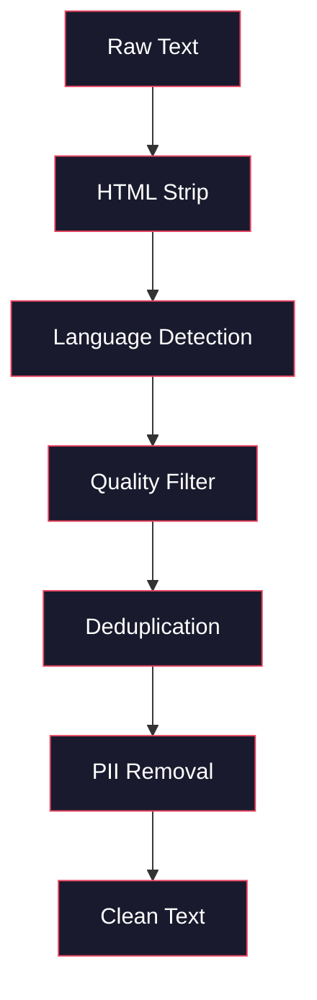
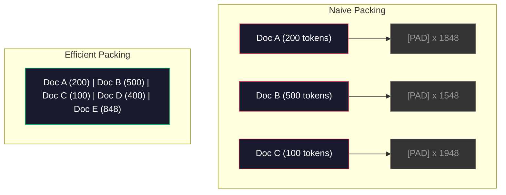

# पूर्व-शिक्षण की डेटा पाइपलाइन

> 模型 एक आरेख है  यह आपके द्वारा दिए गए किसी भी डेटा को प्रतिबिंबित करेगा  इसे कचरा दें, यह कचरा को सही प्रवाह में प्रतिबिंबित करेगा

**Type:** Build
**Languages:** Python
**Prerequisites:** Phase 10, Lessons 01-02 (Tokenizers, Building a Tokenizer)
**Time:** ~90 minutes

## 学习目标

-  एक स्ट्रीमिंग डेटा पाइपलाइन का निर्माण, जब तक कि सभी डेटा को स्मृति में नहीं लोड किया जाता है, तब तक TB स्तर के ग्रंथों के लिए टोकनाइज़ेशन, ब्लॉक, शफल और बैच
- 实现真实预训管道 中使用的数据质量过器(डिडप्लिकेशन、भाषा का पता लगाना、सामग्री फ़िल्टरिंग)
- स्थायी लंबाई प्रशिक्षण क्रम,并正确处理 ध्यान मास्क 和文档边界
- प्रोफ़ाइल पाइपलाइन पारगमन, डेटा लोडर 能跟上 GPU 训练速度 सुनिश्चित करें

## 问题

आप पहले से ही एक Tokenizer है. अब आप डेटा की जरूरत है.

एक डेटासेट नहीं है। यह एक CSV फ़ाइल नहीं है। बल्कि टीबी श्रेणी के ग्रंथों में से एक है। यह एक निश्चित लंबाई अनुक्रम है, जो कि एक त्वरित बैच के रूप में पर्याप्त गति से उपलब्ध है। यह सुनिश्चित करने के लिए कि आपका 8-जीपीयू समूह कभी भी अगले बैच का इंतजार नहीं करेगा।

अधिकांश लोगों ने सोचा कि एक LLM के प्रशिक्षण का केंद्र मॉडल संरचना है। यह नहीं है। लामा 3 ने 15.6 ट्रिलियन टोकन का उपयोग किया। GPT-3 ने 300 बिलियन का उपयोग किया। डीपसईक-वी 2 ने 8.1 ट्रिलियन का उपयोग किया। इन तीनों की संरचना का आकार एक ही हैः एक ढेर में ट्रांसफार्मर ब्लॉक, जिसमें ध्यान और पूर्ववर्ती परतें शामिल हैं।

डीपमाइंड के चिंचिला पेपर ने इस बात को सटीक रूप से समझाया है। दिए गए गणना बजट, मॉडल पैरामीटर और प्रशिक्षण टोकन संख्या के बीच एक उत्कृष्ट अनुपात है। चिंचिला ने दिखाया है कि 2022 में अधिकांश मॉडल गंभीर रूप से अंडरट्रेन हैंः उनके द्वारा देखे गए डेटा की मात्रा के मुकाबले, उनके पैरामीटर बहुत अधिक हैं।

आपका डेटा पाइपलाइन तय करता है कि आपका मॉडल भाषा या शोर सीखता है।

## 核心概念

### डेटा कहां से आया है

प्रत्येक बड़े भाषा मॉडल को विभिन्न स्रोतों के मिश्रित डेटा पर प्रशिक्षित किया जाता है। अधिकांश प्रयोगशालाओं के लिए, सटीक डेटा संरचनाएं सख्ती से गोपनीय हैं, लेकिन हम पहले से ही पर्याप्त जानते हैं, इन श्रेणियों को समझने के लिए।

| Source | Size | Quality | Used By |
|--------|------|---------|---------|
| Common Crawl | ~250 TB raw | 低（需要大量过滤） | GPT-3, Llama, most open models |
| Wikipedia | ~20 GB | 高 | Every major LLM |
| GitHub code | ~1 TB+ | 中等（大量重复、废弃代码） | StarCoder, CodeLlama, DeepSeek-Coder |
| Books (BookCorpus, Pile) | ~100 GB | 高 | GPT-2, GPT-3, early models |
| Academic papers (arXiv, S2ORC) | ~100 GB | STEM 领域质量高 | Llama, Galactica |
| StackOverflow, Reddit | ~100 GB | 中等 | Llama, Falcon |
| Curated web (C4, RefinedWeb) | ~5 TB | 中高（已预过滤） | T5, Falcon |

लामा 3 ने इसके डेटा मिश्रण अनुपात का खुलासा कियाः लगभग 50% वेब डेटा, 25% कोड, 13% किताबें और अकादमिक पत्र, 8% गणित डेटा, साथ ही 4% बहुभाषी वेब डेटा। कुल मात्रा 15.6 ट्रिलियन टोकन है, जो 5 टीबी से अधिक के मूल स्रोत से है।

उदाहरण और कुल मात्रा भी महत्वपूर्ण है। वेब डेटा 太多,模型将变成Reddit 复读机――code 太少,它就无法编程──数学 太少,它就会在推理上失败──把这个混合比例调对,是训练LLM最困难的部分之一,而且没有公式可用:它需要实验和评估──

### डाटा सफाई

मूल वेब डेटा 很脏── एक विशिष्ट सामान्य क्रॉल डंप 包含:

- HTML टैग और जावास्क्रिप्ट
- 模板化 हेडर, फीट, नेविगेशन मेनू
- 重复页面(पूर्ण重复和近似重复)
- 机器生成的垃圾
- व्यक्तिगत रूप से पहचान योग्य जानकारी (PII)
- 低质量文本(关键词列表、SEO स्पैम)
- 以文本形式编码的非文本内容

् ् ् ् ् ् ् ् ् ् ् ् ् ् ् ् ् ् ् ् ् ् ् ् ् ् ् ् ् ् ् ् ् ् ् ् ् ् ् ् ् ् ् ् ् ् ् ् ् ् ् ् ् ् ् ् ् ् ् ् ् ् ् ् ् ् ् ् ् ् ् ् ् ् ् ् ् ् ् ् ् ् ् ् ् ् ् ् ् ् ् ् ् ् ् ् ् ् ् ् ् ् ् ् ् ् ् ् ् ् ् ् ् ् ् ् ् ् ् ् ् ् ् ् ् ् ् ् ् ् ् ् ् ् ् ् ् ् ् ् ् ् ् ् ् ् ् ् ् ् ् ् ् ् ् ् ् ् ् ् ् ् ् ् ् ् ् ् ् ् ् ् ् ् ् ् ् ् ् ् ् ् ् ् ् ् ् ् ् ् ् ् ् ् ् ् ् ् ् ् ् ् ् ् ् ् ् ् ् ् ् ् ् ् ् ् ् ् ् ् ् ् ् ् ् ् ् ् ् ् ् ् ् ् ् ् ् ् ् ् ् ् ् ् ् ् ् ् ् ् ् ् ् ् ्



हर कदम से शोर खत्म हो जाएगाः

**HTML stripping:**移除所有标记──只保留可见文本内容──像 `trafilatura`या `readability`इस प्रकार की पुस्तकालय लेख सामग्री को उठाएगी, साथ ही निर्देशित, विज्ञापन और ढाँचाबद्ध सामग्री को त्याग देगी।

**Language detection:**उपयोग फास्टटेक्स्ट का भाषा पहचान मॉडल (FASTTExt Language Identification Model) (lid.176.bin) प्रत्येक दस्तावेज़ पर वर्गीकरण किया जाए।

**Quality filtering:**यहाँ पर दिलचस्प होना शुरू हो गया है। (RefinedWeb(Falcon 背后的数据集) गुंतागुंती पर आधारित फ़िल्टर का उपयोग करता हैः पहले विकिपीडिया पर एक छोटे से भाषा मॉडल को प्रशिक्षित करें, फिर प्रत्येक दस्तावेज़ को एक विभाजन दें।

**Deduplication:**单个最有影响力的清洗步骤――Common Crawl 包含海量重复页面:法律免责声明、cookie notifications、服务条款──重复数据 पर प्रशिक्षण会浪费计算,并可能导致模型记忆并逐字吐出特定段落──

**PII removal:**姓名、电子邮件地址、电话号码、社会安全号码── संरचनात्मक PII के लिए उपयोग Regex पर आधारित जांच, ऊपर नीचे दिए गए में से姓名 के लिए उपयोग NER मॉडल──

### उपयोग MinHash करना

精确排版 很容易: प्रत्येक दस्तावेज़ के लिए हैश करें,重复项移除──但真正的问题是近似重复──两份相同新闻文章的复制,周围广告略有不同,就是近似重复──内容 95% समान, लेकिन字节比较不一致──

MinHash + स्थान-संवेदनशील हैशिंग (LSH) इस समस्या का उच्च प्रभाव से समाधान कर सकता है।


सोचो जैसेः

1. **Shingling:**将每个文档转换为 n-gram 集合(例如词或字符的 5 ग्राम) ――"快速棕狐"使用3字的 shingles 会变成 {"快速棕色","快速棕狐"}。

2. **MinHash:**प्रत्येक दस्तावेज़ के शेन्डल सेट के लिए, गणना k 个 हैश 值 ⋅ प्रत्येक हैश 值 अलग हैश फ़ंक्शन नीचे सभी शेन्डल के न्यूनतम हैश ⋅ इस प्रकार एक निश्चित आकार का  हस्ताक्षर ⋅ बनाया जाएगा, जो किसी भी दो दस्तावेज़ों के बीच जैकार्ड समानता का अनुमान लगाने के लिए उपयोग किया जाएगा ⋅

3. **LSH:** MinHash हस्ताक्षर के अनुसार, इसे बाल्टों में विभाजित करें।

4. **Verify:**प्रत्येक उम्मीदवार जोड़े के लिए, जैकार्ड समानता की गणना करें। यदि समानता  मूल्य से अधिक है, तो आमतौर पर 0.8 है, तो उनमें से एक को हटा दिया जाता है।

लामा टीम ने बताया कि उन्होंने डिडप्लिकेशन के माध्यम से लगभग 38% वेब डेटा को हटा दिया। यह एक छोटा सा आंकड़ा नहीं है।

### अनुक्रम पैकिंग

आपके मॉडल की अपेक्षा है कि आपके दस्तावेज़ की लंबाई स्थिर हो। कुछ 50 टोकन हैं। कुछ 50,000 टोकन हैं।

简单做法: प्रत्येक दस्तावेज़ पैड को अधिकतम क्रम लंबाई तक रखें।

बेहतर अभ्यासः एक क्रम में कई दस्तावेज पैक को एक क्रम में रखें, क्रम के अंत टोकन का उपयोग करके नहीं करें। एक 2048 टोकन का क्रम में तीन लघु दस्तावेज हो सकते हैं, मध्य में [EOS] टोकन का उपयोग करके।



ध्यान मास्क 必須正确设置──同一个包装序列 中,Document A का टोकन 不应关注 दस्तावेज़ B का टोकन──这需要一个区块斜角注意 मास्क──

长文档会在序列边界处被切断或分断成块――分断点很重要:句子中分断会迫使模型看到不完整的思路――有些管道会尽可能把分断分成齐到段落或句子边界――

### चिंचिला स्केलिंग कानून

 फिक्स्ड गणना बजट के लिए C(以 FLOPs 衡量), सबसे优模型大小 N 和 डेटासेट 大小 D  निम्नानुसार हैः

```
N_opt ~ C^0.5
D_opt ~ C^0.5
```

ा अभ्यास में, इसका मतलब है कि आपको बड़े पैमाने पर समान अनुपात में विस्तार करना चाहिए मॉडल आकार और डेटासेट आकार।

| Model | Parameters | Training Tokens | Chinchilla-Optimal? |
|-------|-----------|----------------|-------------------|
| GPT-3 | 175B | 300B | 否（undertrained 3-4x） |
| Chinchilla | 70B | 1.4T | 是（按设计） |
| Llama 2 | 70B | 2T | Overtrained（有意为之） |
| Llama 3 | 70B | 15T | 严重 overtrained |

Llama 3 ने Chinchilla के कानून का उल्लंघन किया है। मेटा ने पाया कि अधिक डेटा पर ओवरट्रेनिंग, दूर-उत्तम गणना अनुपात, निष्कर्ष के लिए अधिक उपयुक्त मॉडल उत्पन्न करेगा। अतिरिक्त प्रशिक्षण लागत केवल एक बार भुगतान की जाती है, लेकिन छोटे मॉडल दीर्घकालिक सेवा समय लागत कम है। इसे कभी-कभी इन्फरेंस-उत्तम स्केलिंग दृष्टिकोण कहा जाता है, और 2024 से यह उद्योग मानक बन गया है।


```figure
l5-data-pipeline
```

##  इसे निर्माण

### 步骤 1: पाठ सफाई

剥离 HTML、规范化白空间、移除文本内容──我们将使用公共域文本(项目 Gutenberg)作为小型体库──

```python
import re

def clean_text(text):
    text = re.sub(r"<[^>]+>", "", text)
    text = re.sub(r"http\S+", "", text)
    text = re.sub(r"[^\x20-\x7E\n]", "", text)
    text = re.sub(r"\n{3,}", "\n\n", text)
    text = re.sub(r" {2,}", " ", text)
    return text.strip()

def quality_filter(text, min_words=50, max_ratio_caps=0.3, max_ratio_special=0.1):
    words = text.split()
    if len(words) < min_words:
        return False
    caps_ratio = sum(1 for w in words if w.isupper()) / len(words)
    if caps_ratio > max_ratio_caps:
        return False
    special_chars = sum(1 for c in text if not c.isalnum() and not c.isspace())
    if special_chars / max(len(text), 1) > max_ratio_special:
        return False
    return True
```

यह गुणवत्ता फ़िल्टर एसईओ स्पैम को पकड़ने वाला होगा (सभी कैप्स) ✓ मशीन उत्पन्न शोर ✓ उच्च विशेष वर्ण अनुपात) ✓ और स्टब पृष्ठ ✓ ✓ ✓ ✓ ✓ ✓ ✓ ✓ ✓ ✓ ✓ ✓ ✓ ✓ ✓ ✓ ✓ ✓ ✓ ✓ ✓ ✓ ✓ ✓ ✓ ✓ ✓ ✓ ✓ ✓ ✓ ✓ ✓ ✓ ✓ ✓ ✓ ✓ ✓ ✓ ✓ ✓ ✓ ✓ ✓ ✓ ✓ ✓ ✓ ✓ ✓ ✓ ✓ ✓ ✓ ✓ ✓ ✓ ✓ ✓ ✓ ✓ ✓ ✓ ✓ ✓ ✓ ✓ ✓ ✓ ✓ ✓ ✓ ✓ ✓ ✓ ✓ ✓ ✓ ✓ ✓ ✓ ✓ ✓ ✓ ✓ ✓ ✓ ✓ ✓ ✓ ✓ ✓ ✓ ✓ ✓ ✓ ✓ ✓ ✓ ✓ ✓ ✓ ✓ ✓ ✓ ✓ ✓ ✓ ✓ ✓ ✓ ✓ ✓ ✓ ✓ ✓ ✓ ✓ ✓ ✓ ✓ ✓ ✓ ✓ ✓ ✓ ✓ ✓ ✓ ✓ ✓ ✓ ✓ ✓ ✓ ✓ ✓ ✓ ✓ ✓ ✓ ✓ ✓ ✓ ✓ ✓ ✓ ✓ ✓ ✓ ✓ ✓ ✓ ✓ ✓ ✓ ✓ ✓ ✓ ✓ ✓ ✓ ✓ ✓ ✓ ✓ ✓ ✓ ✓ ✓ ✓ ✓ ✓ ✓ ✓ ✓ ✓ ✓ ✓ ✓ ✓ ✓ ✓ ✓ ✓ ✓ ✓ ✓ ✓ ✓ ✓ ✓ ✓ ✓ ✓ ✓ ✓ ✓ ✓ ✓ ✓ ✓ ✓ ✓ ✓ ✓ ✓ ✓ ✓ ✓ ✓ ✓ ✓ ✓ ✓ ✓ ✓ ✓ ✓ ✓ ✓ ✓ ✓ ✓ ✓ ✓ ✓ ✓ ✓ 

### 步骤 2: MinHash डिडप्लिकेशन

零实现 MinHash──不需要外部库,只需要 `hashlib`

```python
import hashlib
from collections import defaultdict

def get_shingles(text, k=5):
    words = text.lower().split()
    if len(words) < k:
        return set()
    return {" ".join(words[i:i+k]) for i in range(len(words) - k + 1)}

def minhash_signature(shingles, num_hashes=128):
    signature = []
    for i in range(num_hashes):
        min_hash = float("inf")
        for shingle in shingles:
            h = int(hashlib.sha256(f"{i}:{shingle}".encode()).hexdigest(), 16)
            min_hash = min(min_hash, h)
        signature.append(min_hash)
    return signature

def lsh_buckets(signature, bands=16):
    rows_per_band = len(signature) // bands
    buckets = []
    for b in range(bands):
        start = b * rows_per_band
        band_data = tuple(signature[start:start + rows_per_band])
        bucket_hash = hashlib.md5(str(band_data).encode()).hexdigest()
        buckets.append((b, bucket_hash))
    return buckets

def deduplicate(documents, threshold=0.8, num_hashes=128, bands=16):
    signatures = []
    shingle_sets = []
    for doc in documents:
        shingles = get_shingles(doc)
        shingle_sets.append(shingles)
        signatures.append(minhash_signature(shingles, num_hashes))

    bucket_map = defaultdict(list)
    for doc_idx, sig in enumerate(signatures):
        for band_id, bucket_hash in lsh_buckets(sig, bands):
            bucket_map[(band_id, bucket_hash)].append(doc_idx)

    duplicate_pairs = set()
    for bucket_docs in bucket_map.values():
        if len(bucket_docs) < 2:
            continue
        for i in range(len(bucket_docs)):
            for j in range(i + 1, len(bucket_docs)):
                duplicate_pairs.add((bucket_docs[i], bucket_docs[j]))

    removed = set()
    for i, j in duplicate_pairs:
        if i in removed or j in removed:
            continue
        s1, s2 = shingle_sets[i], shingle_sets[j]
        if not s1 or not s2:
            continue
        jaccard = len(s1 & s2) / len(s1 | s2)
        if jaccard >= threshold:
            removed.add(j)

    return [doc for idx, doc in enumerate(documents) if idx not in removed], len(removed)
```

`num_hashes=128`和 `bands=16`参数 नियंत्रण सटीक-स्मृति व्यापार-off── अधिक हैश अधिक सटीक समानता देगा  अनुमान── अधिक बैंड यादृच्छिकता में सुधार करेगा पकड़ें अधिक重复项),代价是更多的虚假积极── ये मान विशिष्ट वेब पाठ पर अच्छा प्रभाव 

### 步骤 3: टोकन और नहीं打包序列

 प्राप्त करने के लिए शुद्ध और deduplicated के पाठ, इसके लिए टोकनकरण, और प्रशिक्षण के लिए इस्तेमाल किया जाता है फिक्स्ड लंबाई क्रम में शामिल किया गया है

```python
def tokenize_corpus(documents, tokenizer):
    all_tokens = []
    for doc in documents:
        tokens = tokenizer.encode(doc)
        all_tokens.extend(tokens)
        all_tokens.append(tokenizer.eos_id)
    return all_tokens

def pack_sequences(token_ids, seq_length, pad_id=0):
    sequences = []
    attention_masks = []
    for i in range(0, len(token_ids), seq_length):
        seq = token_ids[i:i + seq_length]
        mask = [1] * len(seq)
        if len(seq) < seq_length:
            pad_count = seq_length - len(seq)
            seq = seq + [pad_id] * pad_count
            mask = mask + [0] * pad_count
        sequences.append(seq)
        attention_masks.append(mask)
    return sequences, attention_masks
```

### 步骤 4: प्रशिक्षण के लिए उपयोग किया डेटा लोडर

产出包装序列的随机批量──这是训练循环 消费的内容──

```python
import random

class PreTrainingDataLoader:
    def __init__(self, sequences, attention_masks, batch_size, shuffle=True):
        self.sequences = sequences
        self.attention_masks = attention_masks
        self.batch_size = batch_size
        self.shuffle = shuffle

    def __len__(self):
        return (len(self.sequences) + self.batch_size - 1) // self.batch_size

    def __iter__(self):
        indices = list(range(len(self.sequences)))
        if self.shuffle:
            random.shuffle(indices)
        for start in range(0, len(indices), self.batch_size):
            batch_idx = indices[start:start + self.batch_size]
            batch_seqs = [self.sequences[i] for i in batch_idx]
            batch_masks = [self.attention_masks[i] for i in batch_idx]
            yield batch_seqs, batch_masks
```

### 步骤 5: डेटासेट सांख्यिकी

計算重要数字:总 टोकन 数、唯一 टोकन 数、 संपीड़न अनुपात、文档长度分布──

```python
from collections import Counter

def compute_statistics(documents, token_ids, sequences, tokenizer_vocab_size):
    total_chars = sum(len(d) for d in documents)
    total_tokens = len(token_ids)
    unique_tokens = len(set(token_ids))
    compression_ratio = total_chars / total_tokens

    doc_lengths = [len(d.split()) for d in documents]
    avg_doc_length = sum(doc_lengths) / max(len(doc_lengths), 1)
    max_doc_length = max(doc_lengths) if doc_lengths else 0
    min_doc_length = min(doc_lengths) if doc_lengths else 0

    token_counts = Counter(token_ids)
    top_tokens = token_counts.most_common(10)

    non_pad_tokens = sum(sum(1 for t in seq if t != 0) for seq in sequences)
    total_positions = sum(len(seq) for seq in sequences)
    utilization = non_pad_tokens / max(total_positions, 1)

    stats = {
        "total_documents": len(documents),
        "total_characters": total_chars,
        "total_tokens": total_tokens,
        "unique_tokens": unique_tokens,
        "vocab_utilization": unique_tokens / tokenizer_vocab_size,
        "compression_ratio": compression_ratio,
        "avg_doc_length_words": avg_doc_length,
        "max_doc_length_words": max_doc_length,
        "min_doc_length_words": min_doc_length,
        "num_sequences": len(sequences),
        "sequence_utilization": utilization,
        "top_10_tokens": top_tokens,
    }
    return stats
```

संपीड़न अनुपात  बताओ टोकनइज़र इस कॉर्पस में ऊपर है और अधिक उच्च प्रभावकारिता है  अंग्रेजी पाठ आमतौर पर प्रत्येक टोकन के लिए लगभग 3-4  वर्ण संपीड़ित होता है  यदि आप प्रत्येक टोकन 1.5  वर्ण देखते हैं, तो अपने टोकनइज़र 切分得太激进── यदि आप 8 + देखते हैं, तो यह बहुत विशिष्ट क्षेत्र के विलय को सीख गया है 

अनुक्रम उपयोग  आपको बताएं पैक अनुक्रम में से कुछ वास्तविक डेटा है, पैडिंग के बजाय।

## इसका उपयोग करें

### HuggingFace डेटासेट के मुकाबले

通过 HuggingFace के डेटासेट लाइब्रेरी 卡载同一个体,并比较管道 速度──

```python
from datasets import load_dataset
from transformers import AutoTokenizer

ds = load_dataset("wikitext", "wikitext-2-raw-v1", split="train")
tokenizer = AutoTokenizer.from_pretrained("meta-llama/Meta-Llama-3-8B")

import time

start = time.time()
tokenized = ds.map(
    lambda x: tokenizer(x["text"], truncation=True, max_length=2048),
    batched=True,
    num_proc=4,
)
hf_time = time.time() - start
total_tokens = sum(len(t) for t in tokenized["input_ids"])
print(f"HuggingFace: {total_tokens:,} tokens in {hf_time:.2f}s ({total_tokens/hf_time:,.0f} tokens/sec)")
```

HuggingFace पाइपलाइन में नीचे Rust टोकनाइज़र का उपयोग किया जाता है, और 4 个核心上进行并行处理.

## 交付 यह

इस कोर्स में एक त्वरित, परीक्षण और परीक्षण के लिए एक परीक्षा दी गई है।`outputs/prompt-data-quality-checker.md`

## अभ्यास

1. **Easy:**उपयोग एक सरल प्रारंभ式 विधि ({{lang-on}}) 字符集分析)                                                                                                                                                                                                                                                      
2. **Medium:**MinHash के पास-डिडप्लिकेशन के अलावा, SHA-256 हैश का उपयोग करके सटीक डिडप्लिकेशन को प्राप्त करें।
3. **Hard:**एक गुंतागुंत आधारित गुणवत्ता फ़िल्टर का निर्माण करें── विकिपीडिया पर 文本上训练一个小型大gram भाषा मॉडल, 根据 गुंतागुंत 给每个文档打分,并移除底部20%──比较在过和未过数据上训练时的模型输出质量──

## 关键术语

| Term | 人们通常怎么说 | 它真正的含义 |
|------|----------------|----------------------|
| Common Crawl | “互联网” | 一个每月抓取 web 的非营利组织：约 250TB 原始数据，是大多数 LLM 训练数据的起点 |
| MinHash | “某种 hashing trick” | 一种使用固定大小 signature 来估计集合间 Jaccard similarity 的技术：支持大规模 near-duplicate detection |
| LSH | “Locality-Sensitive Hashing” | 一种把相似项分到同一 bucket 的方法：将 pairwise comparisons 从 O(n^2) 降到接近线性 |
| Sequence packing | “拼接文档” | 用正确的 attention masks 把多个文档放入固定长度序列：消除 padding 浪费 |
| Chinchilla scaling | “在更多数据上训练” | 对于固定计算预算，最优性能要求模型大小和训练 Token 数大致等比例扩展 |
| Fertility | “Tokens per word” | 每个词平均对应的 Token 数：GPT-4 中英文约为 1.3，非拉丁文字系统更高 |
| Data mixing | “选择训练数据” | code、text、math、multilingual data 之间的比例：没有公式，需要实验 |
| Perplexity filter | “质量打分” | 使用小型语言模型给文档打分：高 perplexity 意味着文本不像干净的 reference data |
| Deduplication | “移除副本” | 消除完全重复和近似重复文档：通常会移除 30-40% 的原始 web data |
| Attention mask | “要看哪些 Token” | 一种 binary mask，用于阻止 packed sequences 中跨文档边界的 Attention |

## 延伸阅读

- [Hoffmann et al., 2022 -- Training Compute-Optimal Large Language Models (Chinchilla)](https://arxiv.org/abs/2203.15556)--  परिवर्तन हम समझते हैं डेटा आकार के तरीके के बारे में लेख
- [Penedo et al., 2023 -- The RefinedWeb Dataset for Falcon LLM](https://arxiv.org/abs/2306.01116)-- 如何将普通爬行 过成高质量数据
- [Touvron et al., 2023 -- Llama 2: Open Foundation and Fine-Tuned Chat Models](https://arxiv.org/abs/2307.09288)-- Llama 2 के डेटा पाइपलाइन 细节
- [Lee et al., 2022 -- Deduplicating Training Data Makes Language Models Better](https://arxiv.org/abs/2107.06499)- क्यों डिडप्लिकेशन आपके विचार से अधिक महत्वपूर्ण है
- [Broder, 1997 -- On the Resemblance and Containment of Documents](https://ieeexplore.ieee.org/document/666900)-- मूल MinHash कागज
- [Meta, 2024 -- Llama 3 Technical Report](https://arxiv.org/abs/2407.21783)-- 15.6T टोकन DATA मिक्सिंग रेशियो फ़िल्टरिंग पाइपलाइन
