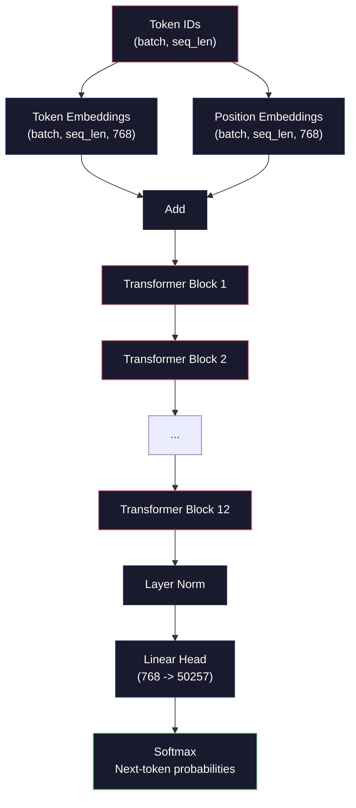
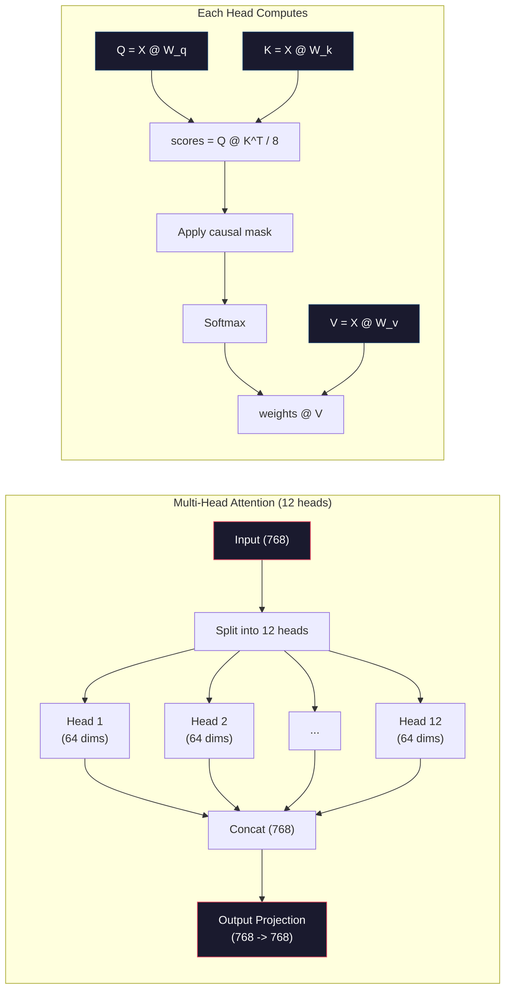
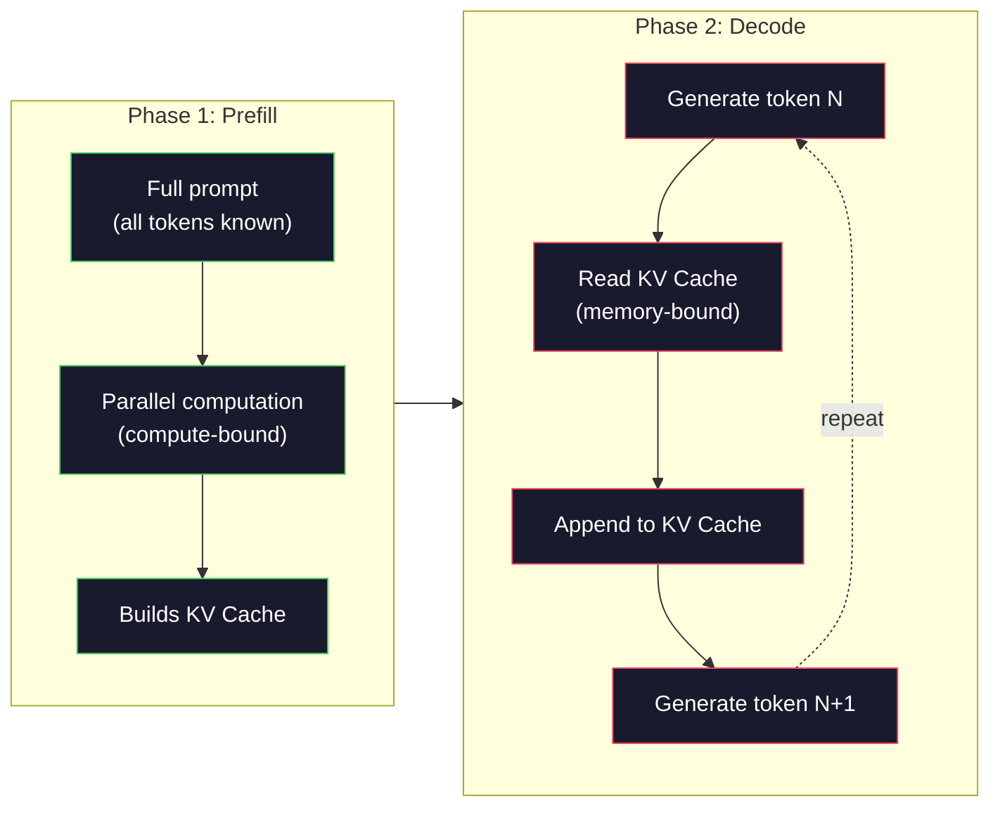

# 零 प्री-ट्रेनिंग एक मिनी GPT(124M 参数)

> GPT-2 Small में 1.24 अरब पैरामीटर होते हैं। यानी 12 ट्रांसफार्मर लेयर, 12 Attention Head, और 768 维 Embedding। आप इसे एक एकल ब्लॉक GPU पर कुछ घंटों में शून्य से प्रशिक्षण ले सकते हैं। अधिकांश लोग ऐसा कभी नहीं करते हैं। वे पूर्व-प्रशिक्षित चेकपॉइंट का उपयोग करते हैं। लेकिन यदि आप व्यक्तिगत रूप से प्रशिक्षण नहीं लेते हैं, तो आप वास्तव में नहीं समझते हैं कि आप जिस मॉडल पर निर्भर हैं उस मॉडल के अंदर क्या होता है।

**类型：**निर्माण
**语言：**पाथोन (numpy के साथ)
**前置要求：**चरण 10,पाठ 01-03(टोकनीजर्स,टोकनीजर्स का निर्माण, डेटा पाइपलाइन)
**时间：**~ 120 मिनट

## 学习目标
- 架构 (GPT-2) 参数: टोकन एम्बेडिंग, स्थिति एम्बेडिंग, ट्रांसफार्मर ब्लॉक, तथा भाषा मॉडल हेड
- उपयोग अगले टोकन भविष्यवाणी और क्रॉस-एंट्रोपी हानि, में अभ्यास GPT मॉडल
- 实现带 तापमान नमूनाकरण के साथ शीर्ष-के/टॉप-पी फ़िल्टरिंग का ऑटोरेग्रेसिव 文本生成
- 监控 training loss curves,并验证模型学到了连贯的语言模式

## 问题
आप जानते हैं कि ट्रांसफार्मर क्या है. आप उन चित्रों को देख चुके हैं. आपको ध्यान देने की आवश्यकता है.

ये सब का मतलब यह नहीं है कि आप समझते हैं कि मॉडल के निर्माण के दौरान क्या हुआ।

GPT-2 छोटा (वजन बंधन के साथ) 124,438,272 个参数 हैं। प्रत्येक घटक को प्रशिक्षण लूप के माध्यम से संचालित किया जाता हैः आगे की पार, गणना हानि, पीछे की पार, नवीनीकृत अधिकार। 12 个 ट्रांसफार्मर ब्लॉक। प्रत्येक ब्लॉक 12 个 ध्यान हेड है। एक 768 维 के एम्बेडिंग स्पेस में एक है। इसमें 50,257 个 टोकन की शब्दावली शामिल है। प्रत्येक मॉडल में एक टोकन उत्पन्न होता है। प्रत्येक मॉडल में 1.24 बिलियन 个参数 शामिल होते हैं।

यदि आपने कभी भी यह सब अपने हाथों से नहीं बनाया है, तो आप एक ब्लैक बॉक्स का उपयोग कर रहे हैं। आप एपीआई का उपयोग कर सकते हैं। आप ठीक-ठीक कर सकते हैं। लेकिन जब समस्या आती है, तो मॉडल हलक में आता है, खुद को दोहराता है, निर्देशों का पालन करने से इनकार करता है।

इस वर्ग में शून्य से निर्माण GPT-2 Small── नहीं PyTorch── नहीं numpy── नहीं है। प्रत्येक बार मैट्रिक्स गुणन सभी दृश्यमान हैं। प्रत्येक ग्रेडिएंट आपके कोड द्वारा गणना की जाती है।

## 概念
### जीपीटी वास्तुकला

जीपीटी एक स्व-निष्क्रिय भाषा मॉडल है। इसका अर्थ है कि यह एक बार एक टोकन उत्पन्न करता है, प्रत्येक टोकन सभी टोकनों के आधार पर होता है। यह संरचना ट्रांसफार्मर डिकोडर ब्लॉक के एक समूह का एक ढेर है।

नीचे टोकन आईडी से अगले टोकन संभावनाओं के लिए पूर्ण गणना ग्राफ हैः

1. टोकन आईडी 输入。आकारः (बैच_साइज, seq_len)。
2. टोकन एम्बेडिंग खोज── प्रत्येक आईडी 映射到一个 768 维 वेक्टर──आकारः (बच_साइज, seq_len, 768)。
3. स्थिति एम्बेडिंग खोज── प्रत्येक स्थिति(0, 1, 2, ...)映射到一个768 维 वेक्टर──形相同──
4. 将 टोकन एम्बेड + स्थिति एम्बेड 相加──
5. 通過 12 个 ट्रांसफार्मर ब्लॉक──
6. अंतिम परत सामान्यीकरण
7. रैखिक प्रक्षेपण तक शब्दावली आकार──आकारः (बैच_साइज, सेक्_लेन, वोकैब_साइज)──
8. सॉफ्टमैक्स  प्राप्त概率──

यही पूरा मॉडल है। कोई झुकना नहीं है। कोई पुनरावृत्ति नहीं है। केवल एम्बेडिंग, ध्यान, फ़ीडफ़ॉर्वर्ड नेटवर्क और परत मानदंड, 12 बार संकलित हैं।



### ट्रांसफार्मर ब्लॉक

12 个区间中的每个都遵循同样模式──पूर्व-नियमित 架构(GPT-2 使用 पूर्व-नियमित, बजाय मूल ट्रांसफार्मर 那样的后-नियमित):

1. लेयरनॉर्म
2. बहु-उपदेही आत्म-ध्यान
3. शेष कनेक्शन ((把 इनपुट 加回来)
4. लेयरनॉर्म
5. फ़ीड-फॉरवर्ड नेटवर्क (MLP)
6. शेष कनेक्शन ((把 इनपुट 加回来)

शेष कनेक्शन 至关重要──没有它们,在后扩散过程中,渐进到达块1时会消失──有它们,渐进可以通过跳路从损失 直接流向任意层──这就是为什么你可以堆叠12、32,甚至96块(GPT-4传闻使用120个) ⋅

### ध्यान: 核心机制

स्व-ध्यान 让每个 टोकन 查看前面所有 टोकन,并决定应该关注每个 टोकन 多少──下面是数学形式──

प्रत्येक टोकन स्थिति के लिए, इनपुट से  गणना तीन वेक्टरः
- **Query (Q)**मैं क्या खोज रहा हूँ?
- **Key (K)**मैं क्या शामिल है?
- **Value (V)**मैं क्या सूचना ले कर आया हूँ?

```
Q = input @ W_q    (768 -> 768)
K = input @ W_k    (768 -> 768)
V = input @ W_v    (768 -> 768)

attention_scores = Q @ K^T / sqrt(d_k)
attention_scores = mask(attention_scores)   # causal mask: -inf for future positions
attention_weights = softmax(attention_scores)
output = attention_weights @ V
```

कारण मास्क जीपीटी को स्व-निष्क्रिय विशेष तंत्र प्रदान करता है। स्थिति 5 0-5 की स्थिति में भाग ले सकता है, लेकिन 6、7、8 की स्थिति में भाग नहीं ले सकता है।

**Multi-head attention**एक सिर हो सकता है एक शब्द का पता लगाएं (उपयोग करने के लिए) एक अन्य शब्द हो सकता है एक शब्द का पता लगाएं (उपयोग करने के लिए) एक अन्य शब्द हो सकता है एक शब्द का पता लगाएं (उपयोग करने के लिए) एक शब्द का पता लगाएं (उपयोग करने के लिए) एक शब्द का पता लगाएं (उपयोग करने के लिए) एक शब्द का पता लगाएं (उपयोग करने के लिए) एक शब्द का पता लगाएं (उपयोग करने के लिए) एक शब्द का पता लगाएं (उपयोग करने के लिए) एक शब्द का पता लगाएं (उपयोग करने के लिए) एक शब्द का पता लगाएं (उपयोग करने के लिए) एक शब्द का पता लगाएं (उपयोग करने के लिए) एक शब्द का पता लगाएं (उपयोग करने के लिए)



इसके अलावा sqrtd_ksqrt64) = 8 है स्केलिंग. इसके बिना, उच्च आयाम वेक्टर का डॉट उत्पाद बहुत बड़ा हो जाएगा, इसे सॉफ्टमैक्स 推至 ग्रेडिएंट 几乎为零的区域──यह मूल  ध्यान है All You Need पेपर 中的关键洞见之一──

### KV कैशः 推理为什么快

训练时,你会一次处理整个序列──Inference 时,你会一次生成一个代币──如果没有优化,生成代币 N 需要为前面所有N-1 个代币 重新计算注意──对于每个生成代币,这是O(N),对于长度为N的序列,总体是O(N^2) 的注意分 计算,并且还会重复执行大量输入侧矩阵乘点──

KV कैश  इस समस्या को हल किया गया है। प्रत्येक टोकन के लिए  गणना K 和 V 后, उन्हें सहेजें। जब टोकन N + 1 时, आपको केवल नए टोकन के लिए 计算 Q,并查找所有之前 टोकन के कैश किए गए K 和 V ⋅ को ढूंढने की आवश्यकता है। यह K 和 V 计算 के प्रति टोकन लागत को O  N से O  तक कम करेगा।

对于包含12层和12头的GPT-2,KV缓存会为每个代币 存储2(K + V) x 12层 x 12头 x 64 dims = 18,432 个值。对于1024-Token क्रम,这在FP32下大约是75MB──对于拥有128层的Llama 3 405B,单个序列的KV缓存可能超过10GB──这就是为什么长文段推断受记忆约束──

### पूर्व-पूर्ति बनाम डिकोडः 推理的两个阶段

जब आप LLM को इंटरप्रेन्ट  भेजते हैं, तब इन्फरेन्स को दो अलग-अलग चरणों में विभाजित किया जाता है

**Prefill**会并行处理您的整个提示──所有Token都已知,所以模型可以同时计算所有位置的注意──这个阶段是计算的GPU 正在在全吞吐量执行矩阵乘法──在A100上,一个1000-Token提示的预填需要大约20-50ms──

**Decode**एक बार एक टोकन उत्पन्न होगा। प्रत्येक नया टोकन सभी पिछले टोकन पर निर्भर करेगा। यह चरण GPU मेमोरी से है। यह मैट्रिक्स मैथमैटिक्स के बजाय मैट्रिक्स मैथ्स से है। अधिकांश समय मेमोरी रीडिंग का इंतजार कर रहा है। GPT-2 के लिए, प्रत्येक डिकोडिंग चरण में लगभग FLOPs की आवश्यकता होती है।

इस प्रकार के अंतर उत्पादन प्रणाली के लिए महत्वपूर्ण है। प्रीफिल आउटपुट GPU गणना के साथ  विस्तार  अधिक FLOPS = 更快 प्रीफिल)  डेकोड आउटपुट  स्मृति बैंडविड्थ  विस्तार  更快 记忆 = 更快 解码)  यही कारण है कि NVIDIA का H100 A100 के मुकाबले 重点提升  मेमोरी बैंडविड्थ  यह सीधे टोकन पीढ़ी को गति देगा।



### प्रशिक्षण चक्र

訓練 LLM 就是 अगले टोकन की भविष्यवाणी──给定 टोकन [0, 1, 2, ..., N-1],预测 टोकन [1, 2, 3, ..., N]──लॉस फ़ंक्शन 是模型预测概率分布与真实下一个 टोकन 之间交叉──

एक प्रशिक्षण चरणः

1. **Forward pass**: 让批 通过全部 12 个块── get प्रत्येक स्थिति के लॉजिट्स(पूर्व-मॉफ्टमैक्स स्कोर)──
2. **Compute loss**:logits और लक्ष्य टोकनों के बीच क्रॉस-एंट्रोपी
3. **Backward pass**: वापसी बैकप्रॉपेगरेशन 为全部 124M 参数计算 ग्रेडिएंट。
4. **Optimizer step**:更新权重──GPT-2 使用带学习速度升温 和 कॉस्मीन क्षय के आदम──

सीखने की दर की तालिका तुलना में आप कल्पना करते हैं अधिक महत्वपूर्ण है। GPT-2 में पहले 2,000 चरणों में 0 से गर्म हो जाओ, उच्चतम सीखने की दर तक, फिर कॉसिन वक्र के अनुसार घट जाओ।

### जीपीटी-2 छोटाः संख्याएँ

| Component | Shape | Parameters |
|-----------|-------|------------|
| Token embeddings | (50257, 768) | 38,597,376 |
| Position embeddings | (1024, 768) | 786,432 |
| Per-block attention (W_q, W_k, W_v, W_out) | 4 x (768, 768) | 2,359,296 |
| Per-block FFN (up + down) | (768, 3072) + (3072, 768) | 4,718,592 |
| Per-block LayerNorms (2x) | 2 x 768 x 2 | 3,072 |
| Final LayerNorm | 768 x 2 | 1,536 |
| **Total per block** | | **7,080,960** |
| **Total (12 blocks)** | | **85,054,464 + 39,383,808 = 124,438,272** |

आउटपुट प्रोजेक्शन(लॉगिस हेड) के साथ टोकन एम्बेडिंग मैट्रिक्स 共享权重── यह वजन बांधने इसे 38M 参数 कम करता है,并提升性能, क्योंकि यह इनपुट और आउटपुट के लिए मॉडल को मजबूर करता है उपयोग एक ही प्रतिनिधित्व स्थान──


```figure
sampling-decoder
```

##  इसे निर्माण
### 步骤 1: सम्मिलित परत

टोकन एम्बेडिंग 50,257 个可能 टोकन के प्रत्येक में एक 768 维 वेक्टर में प्रदर्शित किया जाएगा।

```python
import numpy as np

class Embedding:
    def __init__(self, vocab_size, embed_dim, max_seq_len):
        self.token_embed = np.random.randn(vocab_size, embed_dim) * 0.02
        self.pos_embed = np.random.randn(max_seq_len, embed_dim) * 0.02

    def forward(self, token_ids):
        seq_len = token_ids.shape[-1]
        tok_emb = self.token_embed[token_ids]
        pos_emb = self.pos_embed[:seq_len]
        return tok_emb + pos_emb
```

प्रारंभिककरण 0.02 के मानक विचलन का उपयोग करता है, GPT-2 पेपर से प्राप्त है── बहुत बड़ा, प्रारंभिक आगे पास्स 会产生极端值,破坏训练稳定性── बहुत छोटा, प्रारंभिक आउटपुट सभी इनपुट 几乎相同,让早期渐进信号 失去作用──

### 步骤 2: 带因果化面具的自我注意

पहले एकल-मुख ध्यान प्राप्त करें―― कारणात्मक मुखौटा 会在软max 之前把未来位置 设置为负无限, सुनिश्चित करें कि प्रत्येक स्थिति केवल स्वयं और更早的位置 पर ध्यान केंद्रित कर सके――

```python
def attention(Q, K, V, mask=None):
    d_k = Q.shape[-1]
    scores = Q @ K.transpose(0, -1, -2 if Q.ndim == 4 else 1) / np.sqrt(d_k)
    if mask is not None:
        scores = scores + mask
    weights = np.exp(scores - scores.max(axis=-1, keepdims=True))
    weights = weights / weights.sum(axis=-1, keepdims=True)
    return weights @ V
```

softmax 实现会在指数化前减去最大值──否则,exp(large_number) 会溢出成无限──这是一个数值稳定性技巧,并不会改变输出,因为对于任意常数 c,softmax(x - c) = softmax(x)。

### 步骤 3: मल्टी हेड ध्यान

 768 维 इनपुट 拆分 12 个头,每头 64 维──每头 独立计算 注意──将结果连锁,并项目 回 768 维──

```python
class MultiHeadAttention:
    def __init__(self, embed_dim, num_heads):
        self.num_heads = num_heads
        self.head_dim = embed_dim // num_heads
        self.W_q = np.random.randn(embed_dim, embed_dim) * 0.02
        self.W_k = np.random.randn(embed_dim, embed_dim) * 0.02
        self.W_v = np.random.randn(embed_dim, embed_dim) * 0.02
        self.W_out = np.random.randn(embed_dim, embed_dim) * 0.02

    def forward(self, x, mask=None):
        batch, seq_len, d = x.shape
        Q = (x @ self.W_q).reshape(batch, seq_len, self.num_heads, self.head_dim).transpose(0, 2, 1, 3)
        K = (x @ self.W_k).reshape(batch, seq_len, self.num_heads, self.head_dim).transpose(0, 2, 1, 3)
        V = (x @ self.W_v).reshape(batch, seq_len, self.num_heads, self.head_dim).transpose(0, 2, 1, 3)

        scores = Q @ K.transpose(0, 1, 3, 2) / np.sqrt(self.head_dim)
        if mask is not None:
            scores = scores + mask
        weights = np.exp(scores - scores.max(axis=-1, keepdims=True))
        weights = weights / weights.sum(axis=-1, keepdims=True)
        attn_out = weights @ V

        attn_out = attn_out.transpose(0, 2, 1, 3).reshape(batch, seq_len, d)
        return attn_out @ self.W_out
```

reshape-transpose-reshape यह套操作是多头目注意中最容易让人困惑的部分──发生的是:形状为 (बैच, seq_len, 768) का तन्सर 变成 (बैच, seq_len, 12, 64),再变成 (बैच, 12, seq_len, 64)──现在 12 个头中的每个都有自己的 (seq_len, 64) 矩阵 来运行 Attention──注意 结束后,我们反向执行这个过程:((बैच, 12, seq_len, 64) 变成 (बैच, seq_len, 12, 64),再变成 (बैच, seq_len, 768)──

### 步骤 4: ट्रांसफार्मर ब्लॉक

एक पूर्ण ट्रांसफार्मर ब्लॉक: लेयरनॉर्म ٬ लेयरनॉर्म ٬ लेयरनॉर्म ٬ लेयरनॉर्म ٬ लेयरनॉर्म ٬ लेयरनॉर्म ٬ लेयरनॉर्म ٬ लेयरनॉर्म ٬ लेयरनॉर्म ٬ लेयरनॉर्म ٬ लेयरनॉर्म ٬ लेयरनॉर्म ٬ लेयरनॉर्म ٬ लेयरनॉर्म ٬ लेयरनॉर्म ٬ लेयरनॉर्म ٬ लेयरनॉर्म ٬ लेयरनॉर्म ٬ लेयरनॉर्म ٬ लेयरनॉर्म ٬ लेयरनॉर्म ٬ लेयरनॉर्म ٬ लेयरनॉर्म ٬ लेयरनॉर्म ٬ लेयरनॉर्म ٬ लेयरनॉर्म ٬ लेयरनॉर्म ٬ लेयरनॉर्म ٬ लेयरनॉर्म ٬ लेयरनॉर्म ٬ लेयरनॉर्म ٬ लेयरनॉम 

```python
class LayerNorm:
    def __init__(self, dim, eps=1e-5):
        self.gamma = np.ones(dim)
        self.beta = np.zeros(dim)
        self.eps = eps

    def forward(self, x):
        mean = x.mean(axis=-1, keepdims=True)
        var = x.var(axis=-1, keepdims=True)
        return self.gamma * (x - mean) / np.sqrt(var + self.eps) + self.beta


class FeedForward:
    def __init__(self, embed_dim, ff_dim):
        self.W1 = np.random.randn(embed_dim, ff_dim) * 0.02
        self.b1 = np.zeros(ff_dim)
        self.W2 = np.random.randn(ff_dim, embed_dim) * 0.02
        self.b2 = np.zeros(embed_dim)

    def forward(self, x):
        h = x @ self.W1 + self.b1
        h = np.maximum(0, h)  # GELU approximation: ReLU for simplicity
        return h @ self.W2 + self.b2


class TransformerBlock:
    def __init__(self, embed_dim, num_heads, ff_dim):
        self.ln1 = LayerNorm(embed_dim)
        self.attn = MultiHeadAttention(embed_dim, num_heads)
        self.ln2 = LayerNorm(embed_dim)
        self.ffn = FeedForward(embed_dim, ff_dim)

    def forward(self, x, mask=None):
        x = x + self.attn.forward(self.ln1.forward(x), mask)
        x = x + self.ffn.forward(self.ln2.forward(x))
        return x
```

फ़ीडफ़ॉर्वर्ड नेटवर्क 768 维 इनपुट  विस्तार  3,072 维(4x) को लागू करेगा, एक गैर-रेखीयता लागू करेगा, फिर 768 维─ को वापस प्रोजेक्ट करेगा। इस विस्तार-संकुचन पैटर्न                                                                                                                                                                                                                                                                                                                                                                                                                                                                   

### 步骤 5: पूर्ण जीपीटी मॉडल

堆叠 12 个 ट्रांसफार्मर ब्लॉक──在前面加入嵌入层,在后面加入输出投影──

```python
class MiniGPT:
    def __init__(self, vocab_size=50257, embed_dim=768, num_heads=12,
                 num_layers=12, max_seq_len=1024, ff_dim=3072):
        self.embedding = Embedding(vocab_size, embed_dim, max_seq_len)
        self.blocks = [
            TransformerBlock(embed_dim, num_heads, ff_dim)
            for _ in range(num_layers)
        ]
        self.ln_f = LayerNorm(embed_dim)
        self.vocab_size = vocab_size
        self.embed_dim = embed_dim

    def forward(self, token_ids):
        seq_len = token_ids.shape[-1]
        mask = np.triu(np.full((seq_len, seq_len), -1e9), k=1)

        x = self.embedding.forward(token_ids)
        for block in self.blocks:
            x = block.forward(x, mask)
        x = self.ln_f.forward(x)

        logits = x @ self.embedding.token_embed.T
        return logits

    def count_parameters(self):
        total = 0
        total += self.embedding.token_embed.size
        total += self.embedding.pos_embed.size
        for block in self.blocks:
            total += block.attn.W_q.size + block.attn.W_k.size
            total += block.attn.W_v.size + block.attn.W_out.size
            total += block.ffn.W1.size + block.ffn.b1.size
            total += block.ffn.W2.size + block.ffn.b2.size
            total += block.ln1.gamma.size + block.ln1.beta.size
            total += block.ln2.gamma.size + block.ln2.beta.size
        total += self.ln_f.gamma.size + self.ln_f.beta.size
        return total
```

ध्यान दें वजन बान्धनेः`logits = x @ self.embedding.token_embed.T`◊ आउटपुट प्रोजेक्शन 复用 टोकन एम्बेडिंग मैट्रिक्स(转置) ◊ यह सिर्फ एक बचत सेमेंटरी के कौशल का नहीं है── इसका मतलब है कि मॉडल एक ही वेक्टर स्थान का उपयोग करके टोकन को समझने के लिए टोकन (मेंड) और预测 टोकन (आउटपुट) ◊

### 步骤 6: प्रशिक्षण लूप

 वास्तविक 124M 参数 प्रशिक्षण के लिए, आपको GPU और PyTorch की आवश्यकता है यह प्रशिक्षण लूप एक शुद्ध नंबरी के साथ चलने वाले छोटे मॉडल पर प्रदर्शन तंत्र में है हम इसे चलाने के लिए एक छोटे से मॉडल का उपयोग करते हैं 4 परतें 4 सिर 128 डिम्स

```python
def cross_entropy_loss(logits, targets):
    batch, seq_len, vocab_size = logits.shape
    logits_flat = logits.reshape(-1, vocab_size)
    targets_flat = targets.reshape(-1)

    max_logits = logits_flat.max(axis=-1, keepdims=True)
    log_softmax = logits_flat - max_logits - np.log(
        np.exp(logits_flat - max_logits).sum(axis=-1, keepdims=True)
    )

    loss = -log_softmax[np.arange(len(targets_flat)), targets_flat].mean()
    return loss


def train_mini_gpt(text, vocab_size=256, embed_dim=128, num_heads=4,
                   num_layers=4, seq_len=64, num_steps=200, lr=3e-4):
    tokens = np.array(list(text.encode("utf-8")[:2048]))
    model = MiniGPT(
        vocab_size=vocab_size, embed_dim=embed_dim, num_heads=num_heads,
        num_layers=num_layers, max_seq_len=seq_len, ff_dim=embed_dim * 4
    )

    print(f"Model parameters: {model.count_parameters():,}")
    print(f"Training tokens: {len(tokens):,}")
    print(f"Config: {num_layers} layers, {num_heads} heads, {embed_dim} dims")
    print()

    for step in range(num_steps):
        start_idx = np.random.randint(0, max(1, len(tokens) - seq_len - 1))
        batch_tokens = tokens[start_idx:start_idx + seq_len + 1]

        input_ids = batch_tokens[:-1].reshape(1, -1)
        target_ids = batch_tokens[1:].reshape(1, -1)

        logits = model.forward(input_ids)
        loss = cross_entropy_loss(logits, target_ids)

        if step % 20 == 0:
            print(f"Step {step:4d} | Loss: {loss:.4f}")

    return model
```

Loss 一开始接近 ln(vocab_size)  256-Token के बाइट-स्तरीय शब्दावली के लिए,也就是 ln(256) = 5.55──随机模型会给每个 टोकन 分配相等概率── प्रशिक्षण के साथ-साथ, Loss 会下降,因为模型学会预测常见模式:如 t 后面的 th、句号后面的空格,等等──

उत्पादन में, आप एडम ऑप्टिमाइज़र का उपयोग करेंगे, ग्रेडिएंट संचय के साथ संयोजन, सीखने की दर वार्मिंग और ग्रेडिएंट क्लिपिंग.

### 步骤 7: पाठ पीढ़ी

पीढ़ी प्रयोग प्रशिक्षण अच्छा मॉडल एक बार पूर्वानुमान एक टोकन── प्रत्येक पूर्वानुमान सभी से बाहर निकालने वितरण में नमूना(या लालच से  argmax)──

```python
def generate(model, prompt_tokens, max_new_tokens=100, temperature=0.8):
    tokens = list(prompt_tokens)
    seq_len = model.embedding.pos_embed.shape[0]

    for _ in range(max_new_tokens):
        context = np.array(tokens[-seq_len:]).reshape(1, -1)
        logits = model.forward(context)
        next_logits = logits[0, -1, :]

        next_logits = next_logits / temperature
        probs = np.exp(next_logits - next_logits.max())
        probs = probs / probs.sum()

        next_token = np.random.choice(len(probs), p=probs)
        tokens.append(next_token)

    return tokens
```

तापमान  नियंत्रण随机性──तापमान 1.0 使用原始分布──तापमान 0.5 会让分布更尖(更确定模型更经常选择顶级选择)──तापमान 1.5 会让分布更平坦(更随机低概率 टोकन 获得更大的机会)──तापमान 0.0 लालची डिकोडिंग(总是选择最高概率 टोकन)──

`tokens[-seq_len:]`यह विंडो आवश्यक है, क्योंकि मॉडल में अधिकतम संदर्भ लंबाई है।

## इसका उपयोग करें
### 完整训练与生成 डेमो

```python
corpus = """The transformer architecture has revolutionized natural language processing.
Attention mechanisms allow the model to focus on relevant parts of the input.
Self-attention computes relationships between all pairs of positions in a sequence.
Multi-head attention splits the representation into multiple subspaces.
Each attention head can learn different types of relationships.
The feedforward network provides nonlinear transformations at each position.
Residual connections enable gradient flow through deep networks.
Layer normalization stabilizes training by normalizing activations.
Position embeddings give the model information about token ordering.
The causal mask ensures autoregressive generation during training.
Pre-training on large text corpora teaches the model general language understanding.
Fine-tuning adapts the pre-trained model to specific downstream tasks."""

model = train_mini_gpt(corpus, num_steps=200)

prompt = list("The transformer".encode("utf-8"))
output_tokens = generate(model, prompt, max_new_tokens=100, temperature=0.8)
generated_text = bytes(output_tokens).decode("utf-8", errors="replace")
print(f"\nGenerated: {generated_text}")
```

छोटे भाषाओं और छोटे मॉडल पर, उत्पन्न पाठ सबसे अधिक केवल आधा-संक्रमण का गणना कर सकता है। यह प्रशिक्षण पाठ से कुछ बाइट-स्तर पैटर्न तक सीखता है, लेकिन GPT-2 की तरह 40GB प्रशिक्षण डेटा और पूर्ण 124M परमानुओं के ढांचे का उपयोग करके सामान्यीकरण करने में असमर्थ है।

## 交付 यह
本课会产出 `outputs/prompt-gpt-architecture-analyzer.md` एक जीपीटी शैली के किसी भी मॉडल का विश्लेषण करने के लिए 架构选择的提示──把模型卡或技术报告 交给它, यह पैरामीटर आवंटन को तोड़ देगा、注意设计和规模 निर्णय──

## अभ्यास
1. मॉडल को 12/12 के बजाय 24 परतों और 16 सिरों का उपयोग करने के लिए बदला जाएगा।

2. 实现 GELU सक्रियण फ़ंक्शन(GELU(x) = x * 0.5 * (1 + erf(x / sqrt(2)))),并替换输送网络 中的 ReLU──分别使用两种激活 训练500步,并比较最终损失──

3. 给生成函数 添加KV缓存──在第一次前传后,存储每层的K和V,并后续代币中复用它们──测量速度:分别在有缓存和无缓存的情况下产生200个代币,并比较墙钟时间──

4. 实现 शीर्ष-के नमूनाकरण ((केवल विचार करें概率最高的 k 个 टोकन) और शीर्ष-पी नमूनाकरण ((अग्रणी नमूनाकरणः考虑累计概率超过 p 的最小的 टोकन 集合) ⋅ तापमान 0.8 下比较顶-k=50与顶-p=0.95 的输出质量──

5. 构建一个训练损失曲线图案设计者──训练模型1000 कदम,并绘制损失 vs. step──识别三个阶段:快速初始下降(学习常见字节)、较慢的中间阶段(学习字节模式) 以及平面(在小语料上过化)──无论你训练的是128-dimen model 还是GPT-4,这条曲线的形状都是一样的──

## 关键术语
| Term | What people say | What it actually means |
|------|----------------|----------------------|
| Autoregressive | “它一次生成一个词” | 每个输出 Token 都基于所有之前的 Token——模型预测 P(token_n \| token_0, ..., token_{n-1}) |
| Causal mask | “它看不到未来” | 一个由 -infinity 值组成的 upper-triangular Matrix，用于在训练期间阻止 Attention 指向未来 position |
| Multi-head attention | “多种 Attention pattern” | 将 Q、K、V 拆成并行 heads（例如 GPT-2 中 12 个 head，每个 64 dims），让每个 head 学习不同的关系类型 |
| KV Cache | “用于提速的缓存” | 存储来自之前 Token 的已计算 Key 和 Value tensors，以避免 autoregressive generation 期间的冗余计算 |
| Prefill | “处理 prompt” | 第一个 inference 阶段，所有 prompt Token 并行处理——在 GPU FLOPS 上 compute-bound |
| Decode | “生成 Token” | 第二个 inference 阶段，Token 一次生成一个——在 GPU bandwidth 上 memory-bound |
| Weight tying | “共享 embeddings” | 对 input Token embeddings 和 output projection head 使用同一个 Matrix——在 GPT-2 中节省 38M 参数 |
| Residual connection | “Skip connection” | 将 input 直接加到 sublayer 的 output 上（x + sublayer(x)）——支持 deep networks 中的 Gradient flow |
| Layer normalization | “规范化 activations” | 沿 feature dimension 规范化到 mean 0 和 variance 1，并带有可学习的 scale 与 bias 参数 |
| Cross-entropy loss | “预测错得有多离谱” | -log(分配给正确 next Token 的概率)，在所有 position 上取平均——标准 LLM 训练目标 |

## 延伸阅读
- [Radford et al., 2019 -- "Language Models are Unsupervised Multitask Learners" (GPT-2)](https://cdn.openai.com/better-language-models/language_models_are_unsupervised_multitask_learners.pdf)-- 介绍 124M से 1.5B 参数家族 के GPT-2 पेपर
- [Vaswani et al., 2017 -- "Attention Is All You Need"](https://arxiv.org/abs/1706.03762)--  प्रस्तावित स्केल बिंदु उत्पाद ध्यान 和 बहु-हेड ध्यान का मूल ट्रांसफार्मर कागज
- [Llama 3 Technical Report](https://arxiv.org/abs/2407.21783)-- मेटा  16K GPUs का उपयोग कैसे करें जीपीटी वास्तुकला  विस्तार करने के लिए 405B 参数
- [Pope et al., 2022 -- "Efficiently Scaling Transformer Inference"](https://arxiv.org/abs/2211.05102)-- KV कैश विश्लेषण के साथ पूर्व-भरण बनाम डिकोड  औपचारिक कागज
