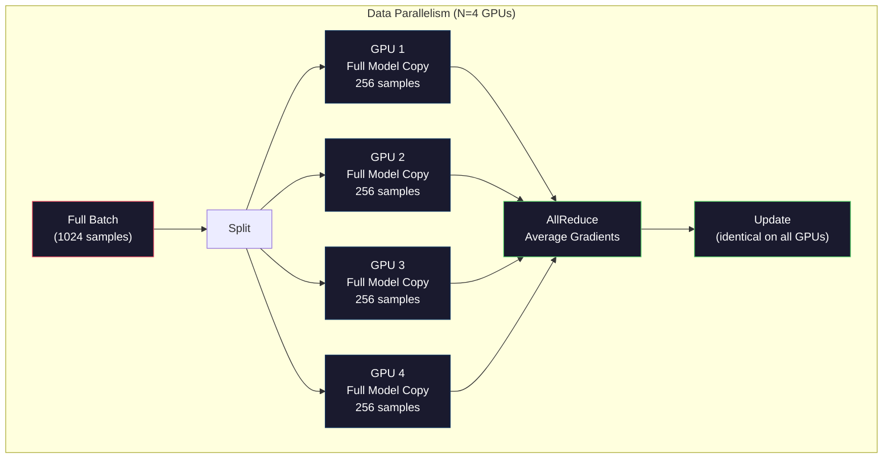
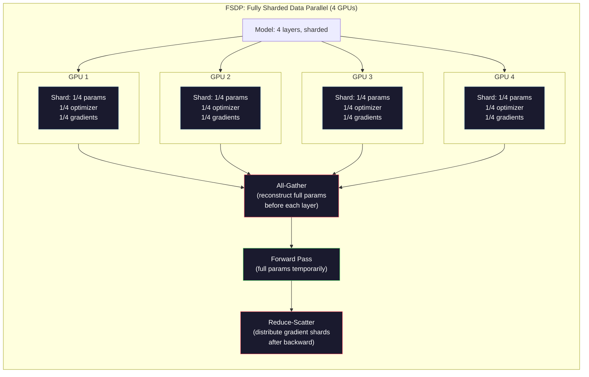
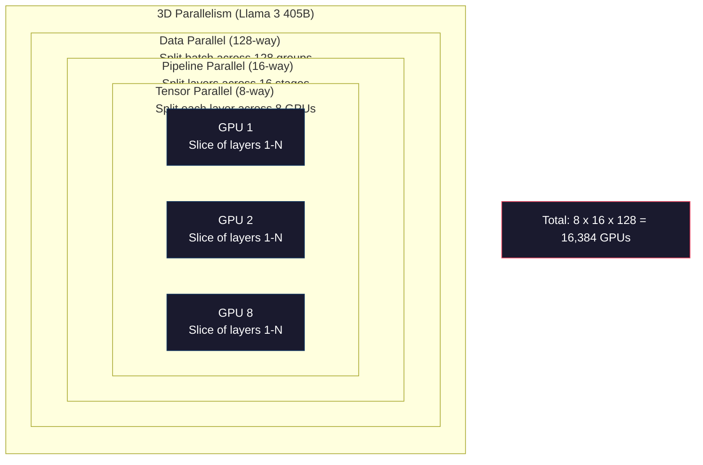

# स्केलिंगःवितरित प्रशिक्षण,FSDP,DeepSpeed

> आपके 124M मॉडल का प्रशिक्षण एक GPU के ब्लॉक पर पूरा हो चुका है। अब 70 बिलियन तत्वों का परीक्षण किया जा रहा है।

**Type:** Build
**Languages:** Python
**Prerequisites:** Phase 10, Lesson 04 (Pre-Training a Mini GPT)
**Time:** ~120 minutes

## 学习目标
- 解释三种平行性 (Data、Tensor、Pipeline), तथा मॉडल आकार और समूह आकार के आधार पर निर्णय लेना कि उन्हें कब उपयोग करने की आवश्यकता है
- उपयोग PyTorch DDP 实现 डेटा समानांतर प्रशिक्षण, और कई ब्लॉक GPU  के बीच समवर्ती ग्रेडिएंट
- 计算给定模型规模的显存预算(वेज + अनुकूलक राज्य + ग्रेडिएंट + सक्रियण), न्यूनतम हार्डवेयर आवश्यकता निर्धारित करने के लिए
-  configure FSDP या DeepSpeed ZeRO चरण, मॉडेल स्टेटस को कई ब्लॉक GPU पर विभाजित करेगा, जिससे एकल कार्ड पर प्रदर्शित मॉडल से अधिक क्षमता होगी

## 问题
एक 7B 参数 मॉडल FP16 时, केवल वजन आवश्यक 14GB──亚当优化器会为每个参数额外存储两副本──第一时刻和第二时刻估计)──这也需要28GB──Backpropagation 期间的 Gradients 再增加14GB──还没有存储任何激活,你已经用掉了56GB──

एक NVIDIA A100 के 80GB के साथ स्पष्ट भंडारण

80GB में 56GB का उपभोग हो चुका है। केवल 24GB दे सक्रियण, यानि आगे के पास 期间 गणना किए गए मध्य मूल्य, उन्हें बैकप्रपॉगरेशन उपयोग तक बनाए रखना होगा। 2048-टोकेन अनुक्रम और 4096 आयामी मॉडल के लिए, एकल स्तरीय सक्रियण के लिए लगभग 64MB ∼32 स्तरीय उपयोग किए जाते हैं। प्रत्येक नमूना 2GB ∼ बैच आकार के लिए 8 ⋅ बैच आकार के लिए 16GB ∼ आप 24GB ∼ बैच आकार के लिए 12 ∼ बैच आकार के लिए विस्फोट स्पष्ट रूप से मौजूद है।

现在试试 70B 参数――仅重量:FP16 下 140GB──单块GPU 放不下──你至少需要2块A100(2 x 80GB = 160GB)才能只放下重量──加上优化状态和梯度,需要的GPU 远不止这些:最低3+块,实际上通常取决于碎片化策略,需要8-16块──

Llama 3 405B उपयोग 16,384 ब्लॉक NVIDIA H100 GPUs  प्रशिक्षण。 इस प्रशिक्षण को चलाने के लिए अनुमानित लागत लगभग 1 बिलियन डॉलर गणना 成本。DeepSeek V3 通过更巧妙的架构(विशेषज्ञों का मिश्रण प्रत्येक टोकन का अर्थ है केवल एक छोटा सा घटक सक्रिय करें) और प्रशिक्षण दक्षता, लगभग 560 मिलियन डॉलर के साथ एक तुलनात्मक मॉडल को प्रशिक्षित करें。

इस कोर्स में बड़े पैमाने पर प्रशिक्षण को संभव बनाने के लिए चार प्रकार की रणनीतियाँ हैंः डेटा समानांतरत्व、टेन्सर समानांतरत्व、 पाइपलाइन समानांतरत्व और पूर्ण रूप से टुकड़े टुकड़े किए गए डेटा समानांतरत्व── आप पहले शुद्ध पायथन का उपयोग करेंगे 模拟 प्रत्येक रणनीति, उसकी तंत्र को समझें, फिर वितरित प्रशिक्षण ढांचे से संपर्क करें──

## 概念
### क्यों वितरित करने की आवश्यकता है

नीचे वास्तविक मॉडल का स्पष्ट अस्तित्व गणना है। प्रत्येक संख्या गणना से बाहर है, आकलन नहीं है।

| Model | Params | Weights (FP16) | Adam States | Gradients (FP16) | Total (no activations) |
|-------|--------|----------------|-------------|------------------|----------------------|
| GPT-2 Small | 124M | 248 MB | 992 MB | 248 MB | 1.5 GB |
| Llama 3 8B | 8B | 16 GB | 64 GB | 16 GB | 96 GB |
| Llama 3 70B | 70B | 140 GB | 560 GB | 140 GB | 840 GB |
| Llama 3 405B | 405B | 810 GB | 3,240 GB | 810 GB | 4,860 GB |

आदम राज्यों यह एक ही वास्तविक स्पष्ट भंडारण हत्यारा है──आदम प्रत्येक घटक भंडारण के लिए चल रहा है औसत (m) और चल रहे भिन्नता (v), दोनों FP32 हैं── 70B  मॉडल के लिए, यह 70B x 4 बाइट्स x 2 = 560GB── केवल अनुकूलक की आवश्यकता होती है सात ब्लॉक A100──

单块H100有80GB──Llama 3 405B至少需要61块H100才能容纳重量、优化器和梯度──加上激活,数量也将继续增加──Meta使用16384块GPU不是因为他们想这样,而是因为他们必须这样──

### डेटा समानांतर

सबसे सरल वितरित रणनीति──把完整模型复制到N块GPU──把每个训练批次 拆成N个相等部分──每个块GPU在自己的数据片上运行前进和后进通过──后进通过 之后,在所有GPU 之间平均梯度──每个块GPU使用相同的平均梯度 更新自己的重量 副本,从而保持所有副本同步──

**优点：**पारगमन निकटता 线性扩展──N 块 GPU प्रत्येक चरण 处理 N 倍数据──通信 केवल ग्रेडिएंट औसत तक सीमित है, और संगणक के साथ ओवरलैप किया जा सकता है──

**缺点：**प्रत्येक GPU ब्लॉक में पूर्ण मॉडल, अनुकूलक अवस्था और ग्रेडिएंट होते हैं। 70B मॉडल के लिए, प्रत्येक GPU ब्लॉक में 840GB की आवश्यकता होती है। डेटा समानांतरता एक एकल GPU ब्लॉक के प्रमुख भंडारण को कम नहीं करेगी। यह केवल प्रशिक्षण समय को कम करेगा।

**计算：**प्रभावी बैच आकार = प्रति_gpu_batch_size x N。 N=64 块 GPU 且 प्रति-GPU बैच 为 16, प्रभावी बैच 为 1,024。 Llama 3 उपयोग का प्रभावी बैच आकार है प्रति चरण 16000000 टोकन。



### टेन्सर समानांतर

एक एकल परत को कई GPUs में विभाजित करें 上。 एक बार मैट्रिक्स गुणन को कई GPUs में विभाजित किया जाता है, प्रत्येक GPU खंड 计算结果 का हिस्सा。

考虑 feedforward layer 中一个形 为 (8192, 8192) के वजन मैट्रिक्स── 4 वे टेन्सर समानांतर का उपयोग करते समय, प्रत्येक GPU का एक (8192, 2048) टुकड़ा होता है── प्रत्येक GPU का उपयोग अपने टुकड़े के साथ एक आंशिक परिणाम उत्पन्न करने के लिए किया जाता है── आंशिक परिणामों को एकत्रित किया जाता है── सभी-कम या सभी-कट) के माध्यम से पूर्ण आउटपुट उत्पन्न करता है──

**优点：** प्रति ब्लॉक GPU  के मॉडल वजन 显存占用── एक 70B 模型 को 8 块 GPU  तक विभाजित किया गया है, जिसका अर्थ है कि प्रत्येक ब्लॉक GPU  के पास लगभग 8.75B 参数 आकार का वजन है──

**缺点：**प्रत्येक स्तर के बाद सभी उच्च गति वाले GPU 间通信 की आवश्यकता होती है। प्रत्येक चरण के बाद सभी घटने से लटेंसी बढ़ जाती है। यह NVLink में एक ही बिंदु पर GPU 间 900 GB/s पर अच्छा प्रभाव पड़ता है, लेकिन InfiniBand के माध्यम से 400 Gb/s, लगभग 50 GB/s के कनेक्शन के बिंदुओं के बीच प्रभाव में अंतर होता है।

**真实用法：**मेगाट्रॉन-एलएम ने टेंसर समानांतर का निर्माण किया है।

### पाइपलाइन समानांतरता

按层 拆分模型──GPU 1 运行层 1-8──GPU 2 运行层 9-16──GPU 3 运行层 17-24──GPU 4 运行层 25-32──数据流经管道:GPU 1 计算自己的层并把激活 发送给 GPU 2,GPU 2 计算自己的层 后发送给 GPU 3,依此类推──

**优点：**GPU 间通信极少, केवल传层 边界处的激活;相比梯度或重量, ये डेटा बहुत छोटा है.

**缺点：**पाइपलाइन बुलबुले── जब GPU 4 माइक्रो-बैच 1 के आगे के पास की गणना कर रहा है, GPU 1、2、3 सभी खाली स्थिति में हैं(वे पहले ही अपना आगे का भाग पूरा कर चुके हैं 部分)──पछाड़ के पास 期间,模式反过来── उपयोग करना साफ़ पाइपलाइन 时,N 个 पाइपलाइन चरण का GPU उपयोग 只有1/N──

**GPipe and PipeDream**通过把批发 拆分微批发 来解决泡 问题──GPU 1 一完成微批发 1 的前进,就开始处理微批发 2──这让不同管道阶段的计算发生重叠──使用M 个微批发 和 N 个阶段 时,泡 降为 (N-1) /M──N=4阶段、M=16微批发 时,泡 为 3/16 = 18.75% निष्क्रिय समय──

### FSDP: पूर्णतः टुकड़े टुकड़े किए गए डेटा समानांतर

FSDP ने डेटा समानांतरता की विस्तारशीलता और स्क्रैडिंग की स्पष्ट भंडारण दक्षता को जोड़ा है। प्रत्येक GPU ब्लॉक में पूर्ण मॉडल का एक प्रति नहीं है, बल्कि केवल 1/N के पैरामीटर, ग्रेडिएंट और ऑप्टिमाइज़र स्टेटस हैं।

किसी एक परत के आगे पास करने से पहले, FSDP 会运行 **all-gather**, सभी GPU के ऊपर पूर्ण पैरामीटर  एकत्रित करने के लिए प्रत्येक GPU के स्पष्ट भंडारण में  आगे पास  के बाद, प्रत्येक GPU  त्याग गैर-स्थानीय पैरामीटर के दौरान, सभी को पुनः संचालित, ताकि पुनः निर्माण के लिए ग्रेडिएंट गणना के पैरामीटर के लिए  के बाद  के बाद,**reduce-scatter**ग्रेडिएंट शार्ट्स का विभाजन करें, प्रत्येक GPU के प्रति केवल 1/N ग्रेडिएंट को संग्रहीत करें।

**70B 模型在 8 块 GPU 上的计算：**

| Component | Without FSDP | With FSDP |
|-----------|-------------|-----------|
| Weights (FP16) | 140 GB per GPU | 17.5 GB per GPU |
| Adam States (FP32) | 560 GB per GPU | 70 GB per GPU |
| Gradients (FP16) | 140 GB per GPU | 17.5 GB per GPU |
| **Total** | **840 GB per GPU** | **105 GB per GPU** |

⇒ बिना FSDP ⇒ आप 70B 模型 को 80GB GPU के एक ही ब्लॉक में नहीं रख सकते हैं ⇒ 8GB GPU के FSDP ⇒ उपयोग के बाद, प्रत्येक GPU का उपयोग 105GB, आदि, यह अभी भी नहीं छोड़ता है ⇒ आपको प्रत्येक GPU के ब्लॉक को 80GB से कम करने के लिए कम से कम 16 ब्लॉक GPU की आवश्यकता होगी ⇒ या FSDP को सक्रियण नियंत्रण बिंदु के साथ जोड़कर उपयोग करें ⇒ बैकवर्ड ⇒ समय के दौरान पुनः गणना करें सक्रियण, उन्हें स्टोर करने के बजाय) ⇒

通信 लागत वैनिला डेटा समानांतर से अधिक है, क्योंकि प्रत्येक स्तर से पहले सभी को इकट्ठा करने की आवश्यकता होती है।



### डीपस्पीड ज़ेरो

डीपस्पीड के ज़ेरो (Zero Redundancy Optimizer) में अवधारणा में FSDP के समान है, लेकिन माइक्रोसॉफ्ट द्वारा स्वतंत्र रूप से विकसित किया गया है। यह तीन चरणों को परिभाषित करता है, प्रत्येक चरण का टुकड़ाकरण और सक्रियणः

| Stage | Shards | Memory Savings | Communication |
|-------|--------|---------------|---------------|
| ZeRO-1 | 仅 Optimizer states | ~4x reduction | 与 data parallel 相同 |
| ZeRO-2 | + Gradients | ~8x reduction | 略多 |
| ZeRO-3 | + Parameters | ~Nx reduction (N GPUs) | 每层 All-gather |

ZeRO-3 等价于 FSDP──命名不同,机制相同──DeepSpeed 证明这个概念后,PyTorch 添加了FSDP 作为原生实现──

डीपस्पीड ने भी ZeRO-Offload को पेश किया है। यह ऑप्टिमाइज़र राज्यों को CPU RAM तक उतार देता है। CPU RAM अधिक सस्ता और अधिक क्षमता वाला है। और ZeRO-Infinity।

### मिश्रित सटीकता प्रशिक्षण

现代训练会同时使用多种浮点格式:

- **Forward pass**:FP16 या BF16(16-बिट) ️ स्पष्ट भंडारण FP32 का आधा है──मैटमूलस में टेंसर कोर ऊपर运行速度快2倍──
- **Master weights**:FP32(32 बिट) ✿ द्वारा अनुकूलक 维护, उपयोग किया जाता है वजन अद्यतन 期间保持数值精度──
- **Loss scaling**: पीछे की ओर गुजरते हुए पूर्व में हानि  गुणा करने के लिए एक बड़ी सामान्य संख्या, FP16 ग्रेडिएंट को रोकने के लिए नीचे के लिए शून्य ⋅ अनुकूलन चरण पूर्व में पुनः विभाजित करने के लिए एक ही सामान्य संख्या ⋅

BF16(Brain Float 16) में FP32 के समान एक्सपोनेंट रेंज है, लेकिन सटीकता कम है, जबकि FP32 है 23) । यह बहुत कम नुकसान स्केलिंग की आवश्यकता है, क्योंकि यह समान रेंज के मानों को प्रदर्शित कर सकता है।

गूगल के टीपीयू मूल रूप से बीएफ16 के साथ-साथ एनवीआईडीए के ए100 और एच100 के साथ-साथ एफपी16 और बीएफ16 का समर्थन करते हैं। उद्योग मूल रूप से बीएफ16 की ओर रुख कर चुका है, क्योंकि इससे नुकसान स्केलिंग की समस्या को समाप्त कर दिया गया है।

**7B 模型的显存对比：**

| Precision | Weights | Optimizer | Gradients | Total |
|-----------|---------|-----------|-----------|-------|
| FP32 everywhere | 28 GB | 56 GB | 28 GB | 112 GB |
| Mixed (BF16 + FP32 master) | 14 GB | 56 GB | 14 GB | 84 GB |

इस मॉडल पर, मिश्रित परिशुद्धता 省 28GB ∙ अनुकूलन राज्य                                                                                                                                                                                                                                                                                                                                                                                                                                                                                                            

### मेगाट्रॉन-एलएम 3 डी समानांतरता के साथ

वास्तविक बड़े पैमाने पर प्रशिक्षण सभी तीन समानांतरों को जोड़ देगाः

- **Data parallelism**跨节点组(扩展 बैच आकार)
- **Tensor parallelism**में节点内 (प्लेस परतों को 8 块 GPU में तोड़)
- **Pipeline parallelism**跨节点(把 परत समूह  तोड़ टू多台机器)

लामा 3 405B में 16,384 块 H100 ऊपरः
- प्रत्येक खंड में 8-तरफ़ा tensor समानांतर (GPU)
- 跨节点 16 मार्ग पाइपलाइन समानांतर (16 चरण)
- 余余维度上 128-तरफ़ा डेटा समानांतरता(16,384 / 8 / 16 = 128)

यह 3D विघटन ((8 x 16 x 128 = 16,384) = है कि हजारों GPUs के लिए विस्तार करने के लिए विधि।

डीपसईक V3 ने विभिन्न तरीकों का उपयोग किया है। इनकी मिक्स ऑफ एक्सपर्ट आर्किटेक्चर प्रत्येक टोकन में केवल 671B को सक्रिय करती है। इनकी संख्या 37B है। इसका मतलब है कि प्रत्येक GPU ब्लॉक को केवल गणना की आवश्यकता होती है।




```figure
paged-kv-cache
```

##  इसे निर्माण
### 步骤 1: डेटा समानांतरता का अनुकरण करें

एक बैच को ढ़लना 模拟的GPU 上── प्रत्येक GPU ब्लॉक को अपने ही शेड में 计算 फॉरवर्ड पास── औसत ग्रेडिएंट(((((((((((((((((((((((((((((((((((((((((((((((((((((((((((((((((((((((((((((((((((((((((((((((((((((((((((((((((((((((((((((((((((((((((((((((((((((((((((((((((((((((((((((((((((((((((((((((((((((((((((((((((((((((((((((((((((((((((((((((((((((((((((((((((((((((((((((((((((((((((((((((((((((((((((((((((((((((((((((((((((((((((((((((((((((((((((((((((((((((((((((((((((((((((((((((((((((((((((((((((((((((((((((((((((((((((((((((((((((((((((((((((((((((((((((((((((((((

```python
import numpy as np

def simulate_data_parallelism(data, num_gpus, model_fn):
    batch_size = len(data)
    shard_size = batch_size // num_gpus
    remainder = batch_size % num_gpus

    gpu_losses = []
    gpu_gradients = []

    offset = 0
    for gpu_id in range(num_gpus):
        extra = 1 if gpu_id < remainder else 0
        shard = data[offset:offset + shard_size + extra]
        offset += shard_size + extra

        loss, grad = model_fn(shard)
        gpu_losses.append(loss)
        gpu_gradients.append(grad)

    avg_loss = np.mean(gpu_losses)
    avg_gradient = np.mean(gpu_gradients, axis=0)

    return avg_loss, avg_gradient
```

सभी-कम करने का संचालन (अर्थात् औसत ग्रेडिएंट) डेटा समानांतरता में एकमात्र संचार है। अभ्यास में, NVIDIA GPU 上会 NCCL पुस्तकालय का उपयोग करता है, यह रिंग सभी-कम करने का काम करता हैः प्रत्येक GPU ब्लॉक अपने ग्रेडिएंट का 1/N अपने पड़ोसी GPU को भेजता है, दूसरे पक्ष से समीप GPU को 1/N प्राप्त करता है, N-1 के माध्यम से, प्रत्येक GPU ब्लॉक के पास पूर्ण औसत है।

### 步骤 2: टेंसर समानांतरता का अनुकरण करें

वजन मैट्रिक्स को कई GPUs में विभाजित करें।

```python
def simulate_tensor_parallelism(input_data, weight_matrix, num_gpus):
    d_in, d_out = weight_matrix.shape
    assert d_out % num_gpus == 0, f"d_out {d_out} not divisible by num_gpus {num_gpus}"
    shard_size = d_out // num_gpus

    partial_results = []
    for gpu_id in range(num_gpus):
        start = gpu_id * shard_size
        end = start + shard_size
        weight_shard = weight_matrix[:, start:end]

        partial = input_data @ weight_shard
        partial_results.append(partial)

    full_output = np.concatenate(partial_results, axis=-1)

    direct_output = input_data @ weight_matrix
    error = np.abs(full_output - direct_output).max()

    return full_output, error
```

त्रुटि 应该严格为零(或机器epsilon) ――टेन्सर समानांतर गणित में सटीक है, इसका परिणाम एक GPU के एक ब्लॉक पर पूर्ण मटूल के साथ गणना करने के साथ होता है △ कटौती के साथ आउटपुट आयाम  किया जाता है, इसलिए प्रत्येक GPU का उत्पादन विभिन्न स्तंभों का टुकड़ा, संकेतन होगा पुनः निर्माण पूर्ण परिणाम

对于列- సమాంతర रैखिक परतों(切分输出 आयाम),你执行 concatenate──对于列- సమాంతर (पंक्ति- समानांतर) 切分输入 आयाम),你执行 sum──在变压器 FFN 中,第一个线性(扩展) 列- సమాంతर (पंक्ति- समानांतर) 则第二个线性(合同) 则使用列- समानांतर──这样可以避免两层之间一次全减──

### 步骤 3: पाइपलाइन समानांतरता का अनुकरण करें

मॉडल परतों को ् ् ् ् ् ् ् ् ् ् ् ् ् ् ् ् ् ् ् ् ् ् ् ् ् ् ् ् ् ् ् ् ् ् ् ् ् ् ् ् ् ् ् ् ् ् ् ् ् ् ् ् ् ् ् ् ् ् ् ् ् ् ् ् ् ् ् ् ् ् ् ् ् ् ् ् ् ् ् ् ् ् ् ् ् ् ् ् ् ् ् ् ् ् ् ् ् ् ् ् ् ् ् ् ् ् ् ् ् ् ् ् ् ् ् ् ् ् ् ् ् ् ् ् ् ् ् ् ् ् ् ् ् ् ् ् ् ् ् ् ् ् ् ् ् ् ् ् ् ् ् ् ् ् ् ् ् ् ् ् ् ् ् ् ् ् ् ् ् ् ् ् ् ् ् ् ् ् ् ् ् ् ् ् ् ् ् ् ् ् ् ् ् ् ् ् ् ् ् ् ् ् ् ् ् ् ् ् ् ् ् ् ् ् ् ् ् ् ् ् ् ् ् ् ् ् ् ् ् ् ् ् ् ् ् ् ् ् ् ् ् ् ् ् ् ् ् ् ् ् ् ् ्

```python
def simulate_pipeline_parallelism(num_layers, num_stages, num_microbatches):
    layers_per_stage = num_layers // num_stages

    timeline = {}
    clock = 0

    for mb in range(num_microbatches):
        for stage in range(num_stages):
            start_time = max(
                timeline.get((stage, mb - 1, "fwd"), (0, 0))[1] if mb > 0 else 0,
                timeline.get((stage - 1, mb, "fwd"), (0, 0))[1] if stage > 0 else 0,
            )
            end_time = start_time + layers_per_stage
            timeline[(stage, mb, "fwd")] = (start_time, end_time)

    last_fwd_end = max(v[1] for v in timeline.values())

    for mb in range(num_microbatches - 1, -1, -1):
        for stage in range(num_stages - 1, -1, -1):
            deps = [last_fwd_end]
            if mb < num_microbatches - 1 and (stage, mb + 1, "bwd") in timeline:
                deps.append(timeline[(stage, mb + 1, "bwd")][1])
            if stage < num_stages - 1 and (stage + 1, mb, "bwd") in timeline:
                deps.append(timeline[(stage + 1, mb, "bwd")][1])
            start_time = max(deps)
            end_time = start_time + layers_per_stage
            timeline[(stage, mb, "bwd")] = (start_time, end_time)

    total_time = max(v[1] for v in timeline.values())
    compute_time = num_microbatches * num_stages * layers_per_stage * 2
    bubble_fraction = 1.0 - compute_time / (total_time * num_stages)

    return timeline, total_time, bubble_fraction
```

4 चरणों का उपयोग करें और 1 माइक्रो बैच का उपयोग करें, बुलबुले का अंश 75% है, यानि किसी भी समय चार ब्लॉक GPU में तीन ब्लॉक रिक्त हैं। 16 माइक्रो बैच का उपयोग करते समय, यह लगभग 19% तक कम हो जाता है।

### 步骤 4: मेमोरी कैलकुलेटर

计算任意模型规模训练时的精确显存需求──

```python
def memory_calculator(
    params_billions,
    precision_bytes=2,
    optimizer="adam",
    num_gpus=1,
    sharding="none",
    sequence_length=2048,
    batch_size_per_gpu=1,
    hidden_dim=None,
    num_layers=None,
):
    params = params_billions * 1e9

    weight_memory = params * precision_bytes

    if optimizer == "adam":
        optimizer_memory = params * 4 * 2
    elif optimizer == "sgd":
        optimizer_memory = params * 4
    else:
        optimizer_memory = 0

    gradient_memory = params * precision_bytes

    total_no_activation = weight_memory + optimizer_memory + gradient_memory

    if hidden_dim and num_layers:
        activation_per_layer = (
            sequence_length * batch_size_per_gpu * hidden_dim * precision_bytes * 4
        )
        activation_memory = activation_per_layer * num_layers
    else:
        activation_memory = params * precision_bytes * 0.5

    if sharding == "fsdp" or sharding == "zero3":
        weight_memory /= num_gpus
        optimizer_memory /= num_gpus
        gradient_memory /= num_gpus
    elif sharding == "zero2":
        optimizer_memory /= num_gpus
        gradient_memory /= num_gpus
    elif sharding == "zero1":
        optimizer_memory /= num_gpus

    per_gpu_total = weight_memory + optimizer_memory + gradient_memory + activation_memory

    return {
        "params_billions": params_billions,
        "weights_gb": weight_memory / 1e9,
        "optimizer_gb": optimizer_memory / 1e9,
        "gradients_gb": gradient_memory / 1e9,
        "activations_gb": activation_memory / 1e9,
        "per_gpu_total_gb": per_gpu_total / 1e9,
        "total_across_gpus_gb": per_gpu_total * num_gpus / 1e9,
        "fits_on_80gb": per_gpu_total / 1e9 <= 80,
        "num_gpus": num_gpus,
        "sharding": sharding,
    }
```

इस कैलकुलेटर ने प्रत्येक एमएल इंजीनियर के प्रश्न का उत्तर दियाः मुझे कितने GPU ब्लॉक की आवश्यकता है?

### 步骤 5: मिश्रित परिशुद्धता सिमुलेशन

FP32、FP16 तथा मिश्रित परिशुद्धता प्रशिक्षण के प्रयोग की तुलना करें

```python
def mixed_precision_comparison(params_billions):
    params = params_billions * 1e9

    fp32_weights = params * 4
    fp32_optimizer = params * 4 * 2
    fp32_gradients = params * 4
    fp32_total = fp32_weights + fp32_optimizer + fp32_gradients

    fp16_weights = params * 2
    fp16_master = params * 4
    fp16_optimizer = params * 4 * 2
    fp16_gradients = params * 2
    fp16_total = fp16_weights + fp16_master + fp16_optimizer + fp16_gradients

    mixed_weights = params * 2
    mixed_optimizer = params * 4 * 2
    mixed_gradients = params * 2
    mixed_total = mixed_weights + mixed_optimizer + mixed_gradients

    return {
        "fp32_total_gb": fp32_total / 1e9,
        "fp16_with_master_gb": fp16_total / 1e9,
        "mixed_bf16_gb": mixed_total / 1e9,
        "savings_vs_fp32": 1 - mixed_total / fp32_total,
    }
```

अधिकांश लोगों के लिए, सबसे बड़ी अप्रत्याशितता यह हैः मिश्रित परिशुद्धता नहीं करेगी स्पष्ट बचत में कमी। ऑप्टिमाइज़र राज्यों में।

## इसका उपयोग करें
### सभी सिमुलेशन चलाएँ

```python
def run_all_demos():
    print("=" * 70)
    print("DATA PARALLELISM SIMULATION")
    print("=" * 70)

    np.random.seed(42)
    data = np.random.randn(64, 32)
    weight = np.random.randn(32, 16)

    def model_fn(batch):
        output = batch @ weight
        loss = np.mean(output ** 2)
        grad = 2 * batch.T @ (batch @ weight) / len(batch)
        return loss, grad

    for n_gpus in [1, 2, 4, 8]:
        loss, grad = simulate_data_parallelism(data, n_gpus, model_fn)
        print(f"  {n_gpus} GPUs: loss={loss:.4f}, grad_norm={np.linalg.norm(grad):.4f}")

    print()
    print("=" * 70)
    print("TENSOR PARALLELISM SIMULATION")
    print("=" * 70)

    x = np.random.randn(4, 8192)
    W = np.random.randn(8192, 8192)

    for n_gpus in [1, 2, 4, 8]:
        output, error = simulate_tensor_parallelism(x, W, n_gpus)
        print(f"  {n_gpus} GPUs: output_shape={output.shape}, max_error={error:.2e}")

    print()
    print("=" * 70)
    print("PIPELINE PARALLELISM SIMULATION")
    print("=" * 70)

    for n_mb in [1, 4, 8, 16, 32]:
        _, total_t, bubble = simulate_pipeline_parallelism(32, 4, n_mb)
        print(f"  {n_mb:2d} micro-batches: total_time={total_t:4d}, bubble={bubble:.1%}")

    print()
    print("=" * 70)
    print("MEMORY CALCULATOR")
    print("=" * 70)

    configs = [
        (7, "none", 1),
        (7, "fsdp", 8),
        (70, "none", 1),
        (70, "fsdp", 8),
        (70, "fsdp", 16),
        (405, "fsdp", 64),
        (405, "fsdp", 128),
    ]

    print(f"  {'Model':>8} {'Sharding':>8} {'GPUs':>5} {'Per-GPU':>10} {'Fits 80GB':>10}")
    print("  " + "-" * 50)
    for params, shard, gpus in configs:
        result = memory_calculator(params, num_gpus=gpus, sharding=shard)
        fits = "Yes" if result["fits_on_80gb"] else "No"
        print(f"  {params:>6}B {shard:>8} {gpus:>5} {result['per_gpu_total_gb']:>8.1f}GB {fits:>10}")

    print()
    print("=" * 70)
    print("MIXED PRECISION COMPARISON")
    print("=" * 70)

    for params_b in [7, 13, 70, 405]:
        result = mixed_precision_comparison(params_b)
        print(f"  {params_b}B: FP32={result['fp32_total_gb']:.0f}GB, "
              f"Mixed BF16={result['mixed_bf16_gb']:.0f}GB, "
              f"Savings={result['savings_vs_fp32']:.0%}")
```

## 交付 यह
本课会产出 `outputs/prompt-distributed-training-planner.md`एक त्वरित, यह मॉडल आकार और उपलब्ध हार्डवेयर को प्राप्त करता है, फिर एक पूर्ण वितरित प्रशिक्षण योजना उत्पन्न करता हैः समानांतरता रणनीति, स्मृति बजट, संचार ओवरहेड और अपेक्षित आउटपुट।

## अभ्यास
1. 修改记忆计算器,加入激活检查点击――使用检查点击时,只在每第 K 层存储激活中典型 K=1,表示全部重算)――显示记忆计算交易:检查点能节省多少显存,以及会让训练变慢多少(पूर्ण检查点击大约增加33%计算)?

2. 扩展管道平行模拟,实现 PipeDream 使用的 1F1B(एक आगे, एक पीछे) अनुसूची──对4 चरण和8 सूक्ष्म-बैच, इसे साफ़ अनुसूची के बुलबुला अंश के साथ तुलना करें──1F1B अनुसूची 应该具有更低的峰值内存,因为它更早开始回转过──

3.  एक ग्रेडिएंट संचय सिम्युलेटर को प्राप्त करें  हर माइक्रो-बैच में  后都 सभी-कम नहीं, बल्कि स्थानीय स्तर पर K 步 gradients को जमा करें, फिर सभी-कम करें  दिखाएं कि यह कैसे संचार को K 倍 कम करता है, साथ ही साथ पूरी तरह से समान अंतिम ग्रेडिएंट उत्पन्न करता है

4. निर्माण एक लागत अनुमानक मुद्रण आकार  लक्ष्य टोकन संख्या जीपीयू प्रकार A100 पर $2/hr，H100 at $3.50/घं) तथा समानांतरता रणनीति, अनुमानित कुल प्रशिक्षण लागत (USD) $100M，DeepSeek V3 成本约 $5.6M

5. मेमोरी कैलकुलेटर में शामिल हों ZeRO-Offload── मान लें कि प्रत्येक खंड में 512GB CPU RAM और 2TB NVMe हो। प्रदर्शन करें कि अनुकूलक राज्यों को CPU तक उतारने के बाद, कैसे 70B मॉडल को 16 ब्लॉक GPU की आवश्यकता से 4 ब्लॉक GPU पर प्रशिक्षित करने में सक्षम बनाने के लिए, कीमत अनुकूलक चरणों है 变化慢 30-50%──

## 关键术语
| Term | What people say | What it actually means |
|------|----------------|----------------------|
| Data parallelism | “把模型复制到每块 GPU” | 每块 GPU 处理不同的 data shard；每一步之后通过 all-reduce 平均 gradients |
| Tensor parallelism | “把一层拆到多块 GPU 上” | 切分 weight matrices，让每块 GPU 计算 matmul 的一部分；需要高速 NVLink interconnect |
| Pipeline parallelism | “把 layers 拆到多块 GPU 上” | 每块 GPU 运行不同的一组 layers；数据通过 pipeline 流动，并使用 micro-batches 减少 bubbles |
| FSDP | “Shard everything” | Fully Sharded Data Parallel：每块 GPU 持有 1/N 的 weights、gradients 和 optimizer states；计算前执行 all-gather |
| ZeRO | “DeepSpeed 版本的 FSDP” | Zero Redundancy Optimizer，包含 3 个 stages：shard optimizer（Stage 1）、+ gradients（Stage 2）、+ parameters（Stage 3） |
| All-reduce | “在 GPU 之间求平均” | collective operation，让每块 GPU 最终都拥有所有 GPU 输入的 sum（或 average），通常实现为 ring all-reduce |
| All-gather | “从所有 GPU 收集” | collective operation，让每块 GPU 最终都拥有所有 GPU 数据的 concatenation；FSDP 中用于重建完整 parameters |
| Reduce-scatter | “求和并分发” | collective operation，对数据进行 reduce（sum）并把不同 chunks scatter 到不同 GPU；FSDP 中用于 gradient sharding |
| Mixed precision | “用 half precision 训练” | forward/backward 使用 FP16/BF16，optimizer states 使用 FP32；节省约 25% 显存，而不是 50%，因为 optimizer 占主导 |
| Pipeline bubble | “pipeline 中的 idle time” | GPU 等待上一 stage 数据时处于空闲的时间比例；可通过使用更多 micro-batches 降低 |

## 延伸阅读
- [Rajbhandari et al., 2020 -- "ZeRO: Memory Optimizations Toward Training Trillion Parameter Models"](https://arxiv.org/abs/1910.02054)-- 定义三个碎片阶段的DeepSpeed ZeRO पेपर
- [Shoeybi et al., 2020 -- "Megatron-LM: Training Multi-Billion Parameter Language Models Using Model Parallelism"](https://arxiv.org/abs/1909.08053)-- NVIDIA 面向变压器 的 tensor समानांतर
- [Narayanan et al., 2021 -- "Efficient Large-Scale Language Model Training on GPU Clusters Using Megatron-LM"](https://arxiv.org/abs/2104.04473)-- 结合数据、टेन्सर 和 पाइपलाइन के 3D समानांतर
- [Zhao et al., 2023 -- "PyTorch FSDP: Experiences on Scaling Fully Sharded Data Parallel"](https://arxiv.org/abs/2304.11277)-- PyTorch का मूल जीवन FSDP 实现
- [Llama 3 Technical Report](https://arxiv.org/abs/2407.21783)-- 16,384 GPU प्रशिक्षण के 3D समानांतर 细节
- [DeepSeek-V3 Technical Report](https://arxiv.org/abs/2412.19437)-- एमओई वास्तुकला  कैसे होगा प्रशिक्षण लागत एक संख्यात्मक स्तर को कम
