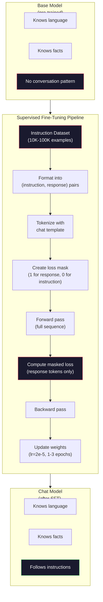

# निर्देश ट्यूनिंग (SFT)

> आधार मॉडल 会预测下一个代币――仅此而已―― यह निर्देशों का पालन नहीं करेगा, प्रश्नों का उत्तर नहीं देगा, न ही हानिकारक अनुरोधों को अस्वीकार करेगा――SFT है टोकन 预测器 और उपयोगी सहायक 之间的桥梁──आपने कभी बातचीत की है प्रत्येक मॉडल - क्लाउड、GPT、Llama Chat-- 都经历过这个步骤──

**类型：**निर्माण
**语言：**पायथन (नम्पी के साथ)
**前置要求：**चरण 10, पाठ 04 (मिनी जीपीटी का पूर्व प्रशिक्षण)
**时间：**~ 90 मिनट

## 学习目标

- 实现 पर्यवेक्षित सूक्ष्म समायोजन (SFT),将 आधार भाषा मॉडल 转换为遵循指令的助手
- उपयोग समाहित प्रणाली, उपयोगकर्ता और सहायक भूमिकाओं के चैट टेम्पलेट्स  स्वरूपण प्रशिक्षण डेटा,并对非 सहायक टोकन 屏蔽 हानि
- explicit why SFT is necessary: आधार मॉडल प्रश्नों के उत्तर देने के बजाय पाठ को जारी रखेगा
- 通过在保留的指令集 上比较基模型与细调模型的回复,评估 SFT 质量

## 问题

आप पाठ 04 में एक मॉडल को प्रशिक्षित करते हैं। एक क्रम निर्धारित करते हुए, यह अगले टोकन का पूर्वानुमान कर सकता है। "ट्रांसफॉर्मर आर्किटेक्चर" में इसे दर्ज करने के बाद, यह "प्राकृतिक भाषा प्रसंस्करण में क्रांति लाया है" का उत्पादन कर सकता है। अगले टोकन भविष्यवाणी करने के लिए, यह बहुत शक्तिशाली है।

现在试试这个:向它输入 "फ्रांस की राजधानी क्या है? " आधार मॉडल "पेरिस" का उत्तर नहीं देगा। यह इस मोड को जारी रखेगा। यह "जर्मनी की राजधानी क्या है? स्पेन की राजधानी क्या है?", क्योंकि यह इस मोड को प्राप्त करने में सक्षम है। या यह एक प्रश्न है जो कई लोग पूछते हैं। यह एक उचित अगली टोकन निरंतरता है। यह मॉडल 没有* उत्तर* का अवधारणा है। यह केवल जानता है* जारी रखें*।

यही GPT-3 के बीच अंतर है (आधार मॉडल,2020 साल जून में जारी) और ChatGPT के बीच अंतर है (इंस्ट्रक्शन-ट्यून,2022 साल में जारी) ।

स्टैनफोर्ड अल्पाका  सबूत आप लाखों उदाहरणों की जरूरत नहीं है। 2023 साल 3 月, वे केवल GPT-3.5 के साथ उत्पन्न 52,000 निर्देशों-प्रतिक्रिया के साथ लामा 7B के लिए ठीक-ठीक समायोजन किया गया। कुल लागतः 600 美元। परिणाम एक निर्देश का पालन करने में सक्षम है। प्रश्न का उत्तर और बातचीत करने के लिए चैटबॉट। यह चैटजीपीटी की तरह नहीं है, लेकिन 600 美元 और कुछ घंटे के प्रशिक्षण के साथ, यह आश्चर्यजनक रूप से करीब आ गया है।

मेटा के लामा 2 चैट ने शुरुआती एसएफटी चरण में केवल लगभग 27,000 उच्च गुणवत्ता वाले उदाहरणों का उपयोग किया।

## 概念

### SFT 实际做了什么

पर्यवेक्षित ठीक-ट्यूनिंग  प्रशिक्षण से पहले के प्रशिक्षण चक्र को जारी रखता है - आगे की उत्तीर्णता  गणना हानि  पिछड़े पास  अद्यतन वजन  लेकिन एक और प्रकार का डेटा उपयोग किया जाता है

```json
{
  "system": "You are a helpful assistant.",
  "user": "What is the capital of France?",
  "assistant": "The capital of France is Paris."
}
```

मॉडल 已知道 पेरिस फ्रांस की राजधानी है। यह विकिपीडिया में है। शिक्षण और वेब पेज पर पूर्व प्रशिक्षण 中学到了这一点──SFT मॉडल नया तथ्य नहीं सिखाता है। यह मॉडल को एक नया प्रकार का व्यवहार सिखाता हैः जब आप समस्या देखते हैं, तो प्रतिक्रिया उत्पन्न करें── जब आप निर्देश देखते हैं, तो पूरक उत्पन्न करें── जब आप प्रतिकूल अनुरोध देखते हैं, तो उत्पन्न अस्वीकार करें──

इसे समझा जा सकता है। प्री-ट्रेनिंग 给模型 知识──SFT 给模型 礼仪──

### डाटा प्रारूप

उद्योग में मुख्य रूप से तीन प्रकार के प्रारूप हैं। प्रत्येक प्रारूप में एक ही जानकारी को कोड किया जाता है।

**Alpaca Format**(स्टैनफोर्ड, मार्च 2023):

```json
{
  "instruction": "Summarize the following article in 3 sentences.",
  "input": "The European Central Bank raised interest rates...",
  "output": "The ECB increased rates by 25 basis points..."
}
```

简单且广泛使用──`input`字段是可选的-- 许多指令不需要额外上下文──斯坦福 发表了52,000 类似格式的例子,由GPT-3.5 以 600 美元的成本生成──这开启了开源指令调节运动──

**ShareGPT Format**(संयुक्त राष्ट्र, 2023):

```json
{
  "conversations": [
    {"from": "system", "value": "You are a helpful assistant."},
    {"from": "human", "value": "What causes tides?"},
    {"from": "gpt", "value": "Tides are caused by the gravitational pull of the Moon..."},
    {"from": "human", "value": "How often do they occur?"},
    {"from": "gpt", "value": "Most coastal areas experience two high tides and two low tides per day..."}
  ]
}
```

支持多轮对话── परंपरागत रूप से, "से" 字段使用 "मानव" 和 "gpt",不管实际模型是什么──Vicuna उपयोग उपयोगकर्ता साझा ChatGPT प्रतिलेखों में से पकड़े गए 70,000 条 ShareGPT 对话进行训练──

**ChatML Format**(ओपनएआई, जो कई ओपन सोर्स मॉडल द्वारा प्रयोग किया जाता है):

```
<|im_start|>system
You are a helpful assistant.<|im_end|>
<|im_start|>user
What is the capital of France?<|im_end|>
<|im_start|>assistant
The capital of France is Paris.<|im_end|>
```

प्रयोग विशेष टोकन(`<|im_start|>``<|im_end|>`)来分隔角色──这些Token 会在细节调整期间 添加到Tokenizer的词汇中──Qwen、Yi 和许多其他模型使用ChatML──

तीन प्रकार के प्रारूप एक ही बात को पूरा करते हैंः वे मॉडल को बताते हैं यह निर्देश है, यह प्रतिक्रिया है, सीखना यह मॉडल है

### यह क्यों प्रभावी है

मॉडल 已从预训中学会了语言――它见过数十亿问题后跟答,命令后跟补,以及人与人之间的对话的例子―― ये मॉडल 已编码在重量中――

एसएफटी इस संभावित क्षमता पर ध्यान केंद्रित करेगा। मॉडल को अब उपरोक्त से खुद को यह तय करने की आवश्यकता नहीं है कि प्रश्न का उत्तर देना चाहिए या फिर इसे जारी रखना चाहिए।

यही कारण है कि 27,000 उदाहरण पर्याप्त हैं। आप अंग्रेजी भाषा का एक मॉडल नहीं पढ़ाते हैं। आप इसे दुनिया के बारे में तथ्य नहीं पढ़ाते हैं। आप इसे एक सरल व्यवहार सिखाते हैं।

### छिपा हुआ नुकसान

यह एसएफटी में सबसे महत्वपूर्ण तकनीकी विवरण है, और अधिकांश पाठ्यक्रमों को इसे छोड़ दिया जाएगा।

पूर्व प्रशिक्षण के दौरान, आप प्रत्येक टोकन पर ध्यान देंगे  गणना हानि. मॉडल सीखना पूर्वानुमान क्रम में प्रत्येक अगला टोकन. SFT के दौरान, आप केवल * प्रतिक्रिया* टोकन पर ध्यान देंगे  गणना हानि. निर्देश टोकन उपयोग पर नीचे लिखा गया है, लेकिन मॉडल नहीं होगा क्योंकि गलतियों  पूर्वानुमान  उन्हें दंडित किया जाएगा।

क्यों? क्योंकि आप नहीं चाहते मॉडल 学会*生成* निर्देश──你希望它学会*响应* निर्देश── यदि आप निर्देश पर ध्यान केंद्रित करते हैं तो आप प्रशिक्षण मॉडल में हैं 预测 "फ्रांस की राजधानी क्या है?", जैसे यह केवल एक प्रश्नकर्ता है── यह ग्रेडिएंट 信号 को बर्बाद कर देगा,并可能让模型对自己的角色产生混──

實踐中,你會创建一個損失面膜: प्रतिक्रिया टोकन 为 1, निर्देश टोकन 为 0──在取平均之前,将每一个 टोकन的損失 乘以这个面膜──

```
Tokens:    [SYS] You are helpful [USER] What is the capital? [ASST] Paris is the capital [EOS]
Loss mask:   0    0    0     0      0     0   0  0     0       1     1    1   1     1      1
```

 केवल `[ASST]`后后的 टोकन 会贡献 Loss──model 在前进传递期间将看到完整对话(यह सही प्रतिक्रिया उत्पन्न करने के लिए निर्देश की आवश्यकता होती है), लेकिन केवल इसके पूर्वानुमान प्रतिक्रिया के प्रभाव के आधार पर वजन अपडेट करना है──

### 训练 हाइपरपरपरमीटर

एसएफटी के उपयोग के हाइपरपैरामीटर पूर्व-प्रशिक्षण से काफी अलग हैं।

| Parameter | Pre-Training (Llama 2 7B) | SFT (Llama 2 Chat) |
|-----------|---------------------------|---------------------|
| Learning rate | 3e-4 (peak) | 2e-5 |
| Epochs | 1（单次遍历数据） | 2 |
| Batch size | 4M tokens | 64 examples |
| Warmup steps | 2,000 | 0-100 |
| Weight decay | 0.1 | 0.0-0.1 |
| Data size | 2T tokens | 27,000 examples |

एसएफटी की सीखने की दर 低15倍── यह बहुत महत्वपूर्ण है── फाइन-ट्यूनिंग के दौरान अत्यधिक सीखने की दर 会破坏预训练知识──模型会忘记它学到的内容,并过适到小型细调数据集上──这是灾难性忘记──

两个时代意味着模型会看到每个训练示例两次――在小数据集上超过3时代会导致记忆化--模型 开始逐字复现训练示例,而不是泛化――

### भूलना विनाशकारी

सूक्ष्म-ट्यूनिंग सामान्य क्षमता को खराब कर सकता है। निर्देशों के बाद डेटा पर प्रशिक्षण बहुत लंबे समय तक, मॉडल को कोड लिखने, गणित करने या रचनात्मक पाठ उत्पन्न करने की क्षमता खो सकती है।

三种缓解方式:

1. **低 learning rate。**1ई-5 से 5ई-5 तक--- छोटे अपडेट का मतलब है कि पूर्व-प्रशिक्षित सुविधाओं पर कम नुकसान होगा---

2. **短训练。**1-3 कालों में                                                                                                                                                                                                                                                             

3. **混入 pre-training 数据。**Llama 2 Chat 将一小部分(2-5%) मूल पूर्व प्रशिक्षण डेटा एसएफटी डेटासेट में शामिल किया गया है।

### असली संख्या

10,000  उच्च गुणवत्ता निर्देश जोड़े में एक 7B मॉडल को ठीक से ट्यून करें, एक एकल NVIDIA A100 80GB GPU का उपयोग करके लगभग 1 घंटा की आवश्यकता हैः

- 10,000 उदाहरण x 平均 512 टोकन = 5.12M टोकन
- 2 युग =  कुल 10.24M टोकन
- A100 के लिए 7B मॉडल ठीक-ट्यूनिंग का संचलनः ~ 3,000 टोकन/सेकंड
- 10.24M / 3,000 = ~3,400 सेकंड = ~57 मिनट

 हमारे मिनी जीपीटी के लिए 4 परतें, 128 डिम्स), प्रशिक्षण लगभग क्षणिक है  फोकस समझ तंत्र है, आकार नहीं 




```figure
loss-masking
```

## 构建

### 步骤 1: निर्देश डेटासेट

 एक सिंथेटिक निर्देश डेटासेट का निर्माण करें️ उत्पादन वातावरण में, स्केल एआई और मानव जैसे कंपनियां इन डेटा को लिखने के लिए कृत्रिम मार्करों को नियोजित करें️ हम उन्हें प्रक्रियात्मक तरीके से बनाएँ, प्रदर्शन प्रारूप में️

```python
import numpy as np

INSTRUCTION_DATA = [
    {
        "instruction": "What is the capital of France?",
        "response": "The capital of France is Paris."
    },
    {
        "instruction": "Explain gravity in one sentence.",
        "response": "Gravity is the force that attracts objects with mass toward each other."
    },
    {
        "instruction": "Write a haiku about the ocean.",
        "response": "Waves crash on the shore, salt and foam beneath the sun, endless blue expanse."
    },
    {
        "instruction": "What is 15 multiplied by 7?",
        "response": "15 multiplied by 7 is 105."
    },
    {
        "instruction": "Name three programming languages.",
        "response": "Three programming languages are Python, Rust, and TypeScript."
    },
    {
        "instruction": "Summarize photosynthesis.",
        "response": "Photosynthesis converts sunlight, water, and carbon dioxide into glucose and oxygen."
    },
    {
        "instruction": "What year did World War II end?",
        "response": "World War II ended in 1945."
    },
    {
        "instruction": "Define machine learning.",
        "response": "Machine learning is a field where algorithms learn patterns from data to make predictions."
    },
]
```

八个例子非常少──斯坦福阿尔帕卡使用了52,000个――但是无论你有8个还是有52,000个,机制都是相同的: टोकन化, मुखौटा,仅对响应计算损失──

### 步骤 2: 使用 चैट टेम्पलेट  टोकन बनाने

 निर्देश-उत्तर जोड़े 转换为带有特殊角色标记的符号 序列── ये अंक 告诉模型指示 在哪里结束,响应 从哪里开始──

```python
SPECIAL_TOKENS = {
    "INST_START": 253,
    "INST_END": 254,
    "RESP_START": 255,
}


def tokenize_instruction_pair(instruction, response, vocab_size=256):
    inst_tokens = list(instruction.encode("utf-8"))
    resp_tokens = list(response.encode("utf-8"))

    inst_tokens = [min(t, vocab_size - 4) for t in inst_tokens]
    resp_tokens = [min(t, vocab_size - 4) for t in resp_tokens]

    tokens = (
        [SPECIAL_TOKENS["INST_START"]]
        + inst_tokens
        + [SPECIAL_TOKENS["INST_END"]]
        + [SPECIAL_TOKENS["RESP_START"]]
        + resp_tokens
    )

    return tokens


def create_loss_mask(tokens):
    mask = np.zeros(len(tokens), dtype=np.float32)
    in_response = False

    for i, token in enumerate(tokens):
        if token == SPECIAL_TOKENS["RESP_START"]:
            in_response = True
            continue
        if in_response:
            mask[i] = 1.0

    return mask
```

हानि मास्क के लिए निर्देश टोकन 全部为零, प्रतिक्रिया टोकन 全部为一。`RESP_START`टोकन वास्तविक मास्क 0 है, क्योंकि यह विभाजक है, प्रतिक्रिया का हिस्सा नहीं है  सामग्री

### 步骤 3: मास्क क्रॉस-एंट्रोपी हानि

标准 क्रॉस-एंट्रोपी, लेकिन गुणा हानि मुखौटा― केवल प्रतिक्रिया टोकन 会贡献 ग्रेडिएंट―

```python
def masked_cross_entropy_loss(logits, targets, loss_mask):
    batch, seq_len, vocab_size = logits.shape
    logits_flat = logits.reshape(-1, vocab_size)
    targets_flat = targets.reshape(-1)
    mask_flat = loss_mask.reshape(-1)

    max_logits = logits_flat.max(axis=-1, keepdims=True)
    log_softmax = logits_flat - max_logits - np.log(
        np.exp(logits_flat - max_logits).sum(axis=-1, keepdims=True)
    )

    per_token_loss = -log_softmax[np.arange(len(targets_flat)), targets_flat]

    masked_loss = per_token_loss * mask_flat
    num_response_tokens = mask_flat.sum()
    if num_response_tokens == 0:
        return 0.0
    loss = masked_loss.sum() / num_response_tokens

    return loss
```

分母是 `num_response_tokens`, नहीं `seq_len` यदि कुल क्रम की लंबाई को छोड़कर, अधिक लंबाई के निर्देशों को विरलैश किया जाएगा ग्रेडिएंट 信号── यदि उत्तर टोकन को छोड़कर, यह सुनिश्चित किया जा सकता है कि निर्देश  लंबाई कैसे भी हो, प्रत्येक प्रतिक्रिया टोकन का वजन समान हो

### 步骤 4: एसएफटी प्रशिक्षण चक्र

复用课堂04 中的MiniGPT── प्रशिक्षण चक्र लगभग पूर्व-प्रशिक्षण के समान दिखता है, केवल निर्देश स्वरूपण और छिपे हुए नुकसान को शामिल किया गया है──

```python
import sys
import os
sys.path.insert(0, os.path.join(os.path.dirname(__file__), "..", "..", "04-pre-training-mini-gpt", "code"))
from main import MiniGPT, LayerNorm, FeedForward, MultiHeadAttention, TransformerBlock, Embedding


def sft_train(model, dataset, num_epochs=2, lr=2e-5, seq_len=64):
    formatted_data = []
    for example in dataset:
        tokens = tokenize_instruction_pair(example["instruction"], example["response"])
        mask = create_loss_mask(tokens)
        formatted_data.append((tokens, mask))

    print(f"SFT Training: {len(formatted_data)} examples, {num_epochs} epochs, lr={lr}")
    print(f"Total tokens: {sum(len(t) for t, _ in formatted_data):,}")
    print()

    losses = []

    for epoch in range(num_epochs):
        epoch_loss = 0.0
        num_batches = 0

        indices = np.random.permutation(len(formatted_data))

        for idx in indices:
            tokens, mask = formatted_data[idx]

            if len(tokens) < 3:
                continue
            if len(tokens) > seq_len:
                tokens = tokens[:seq_len]
                mask = mask[:seq_len]

            input_ids = np.array(tokens[:-1]).reshape(1, -1)
            target_ids = np.array(tokens[1:]).reshape(1, -1)
            loss_mask = np.array(mask[1:]).reshape(1, -1)

            logits = model.forward(input_ids)
            loss = masked_cross_entropy_loss(logits, target_ids, loss_mask)

            batch_size, s_len, v_size = logits.shape
            probs = np.exp(logits - logits.max(axis=-1, keepdims=True))
            probs = probs / probs.sum(axis=-1, keepdims=True)
            dlogits = probs.copy()
            dlogits[np.arange(batch_size)[:, None], np.arange(s_len), target_ids] -= 1.0

            mask_expanded = loss_mask[:, :, np.newaxis]
            num_resp = loss_mask.sum()
            if num_resp > 0:
                dlogits = dlogits * mask_expanded / num_resp

            for block in model.blocks:
                block.ffn.W1 -= lr * np.random.randn(*block.ffn.W1.shape) * 0.01
                block.ffn.W2 -= lr * np.random.randn(*block.ffn.W2.shape) * 0.01
                block.ffn.b1 -= lr * np.random.randn(*block.ffn.b1.shape) * 0.01
                block.ffn.b2 -= lr * np.random.randn(*block.ffn.b2.shape) * 0.01

            epoch_loss += loss
            num_batches += 1
            losses.append(loss)

        avg_loss = epoch_loss / max(num_batches, 1)
        print(f"Epoch {epoch + 1}/{num_epochs} | Avg Loss: {avg_loss:.4f}")

    return model, losses
```

सीखने की दर है 2e-5,与Llama 2 चैट 匹配──将它与预训中使用的 3e-4对比-- 小 15 倍── ग्रेडिएंट 被面具:指示令令令令令令令令令令令令令令令令令令令令令令令令令令令令令令令令令令令令令令令令令令令令令令令令令令令令令令令令令令令令令令令令令令令令令令令令令令令令令令令令令令令令令令令令令令令令令令令令令令令令令令令令令令令令令令令令令令令令令令令令令令令令令令令令令令令令令令令令令令令令令令令令令令令令令令令令令令令令令令令令令令令令令令令令令令令令令令令令令令令令令令令令令令令令令令令令令令令令令令令令令令令令令令令令令令令令令令令令令令令令令令令令令令令令令令令令令令令令令令令令令令令令令令令令令令令令令令令令令令令令令令令令令令令令令令令令令令令令令令令令令令令令令令令令令令令令令令令令令令令令令令令令令令令令令令令令令令令令令令令令令令令令令令令令令令令令令令令令令令令令令令令令令令令令令令令令令令令令令令令令令令令令令令令令令令令令令令令令令令令令令令令令令令令令令令令令令令令令令令令令令令令令令令令令令令令令令令令令令令令令令令令令令令令令令令令令令令令令令令令令令令令令令令令令令令令令令令令令令令令令令令令令令

### 步骤 5: बेस और एसएफटी मॉडल की तुलना करें

एसएफटी का पूरा अर्थ व्यवहार में परिवर्तन में है। हम इस बिंदु को मापने के लिए जांच मॉडल के माध्यम से  कैसे प्रतिक्रिया करें निर्देश-फॉर्मेट इनपुट के साथ कच्चे पाठ के निरंतरता 

```python
def generate_response(model, prompt_tokens, max_new_tokens=50, temperature=0.8):
    tokens = list(prompt_tokens)
    seq_len = model.embedding.pos_embed.shape[0]

    for _ in range(max_new_tokens):
        context = np.array(tokens[-seq_len:]).reshape(1, -1)
        logits = model.forward(context)
        next_logits = logits[0, -1, :]

        next_logits = next_logits / max(temperature, 1e-8)
        probs = np.exp(next_logits - next_logits.max())
        probs = probs / probs.sum()
        probs = np.clip(probs, 1e-10, 1.0)
        probs = probs / probs.sum()

        next_token = np.random.choice(len(probs), p=probs)
        tokens.append(int(next_token))

    return tokens


def evaluate_instruction_following(model, instructions):
    print("Evaluating instruction following:")
    print("-" * 50)

    for instruction in instructions:
        tokens = (
            [SPECIAL_TOKENS["INST_START"]]
            + [min(t, 252) for t in list(instruction.encode("utf-8"))]
            + [SPECIAL_TOKENS["INST_END"]]
            + [SPECIAL_TOKENS["RESP_START"]]
        )

        output = generate_response(model, tokens, max_new_tokens=30, temperature=0.6)
        response_start = len(tokens)
        response_tokens = output[response_start:]
        response_bytes = bytes([t for t in response_tokens if t < 128])
        response_text = response_bytes.decode("utf-8", errors="replace")

        print(f"  Q: {instruction}")
        print(f"  A: {response_text[:80]}")
        print()
```

केवल 8 उदाहरणों के छोटे मॉडल में, प्रतिक्रिया का कोई वास्तविक अर्थ नहीं होगा। यह अपेक्षित है। महत्वपूर्ण है कि मॉडल प्रतिक्रिया मार्कर पर आउटपुट उत्पन्न करता है, बजाय अधिक निर्देश उत्पन्न करना जारी रखता है।

### 步骤 6: 衡量 विनाशकारी भूल

तुलना SFT पूर्व-पिछले मॉडल के अगले टोकन भविष्यवाणी क्षमता  यदि SFT  सामान्य क्षमता को नुकसान पहुंचाया, कच्चे पाठ ऊपर का नुकसान होगा उच्च

```python
def measure_forgetting(model, test_text, seq_len=64):
    tokens = np.array(list(test_text.encode("utf-8")[:512]))

    total_loss = 0.0
    num_windows = 0

    for start in range(0, len(tokens) - seq_len - 1, seq_len):
        input_ids = tokens[start:start + seq_len].reshape(1, -1)
        target_ids = tokens[start + 1:start + seq_len + 1].reshape(1, -1)

        logits = model.forward(input_ids)

        batch, s_len, vocab_size = logits.shape
        logits_flat = logits.reshape(-1, vocab_size)
        targets_flat = target_ids.reshape(-1)

        max_logits = logits_flat.max(axis=-1, keepdims=True)
        log_softmax = logits_flat - max_logits - np.log(
            np.exp(logits_flat - max_logits).sum(axis=-1, keepdims=True)
        )

        loss = -log_softmax[np.arange(len(targets_flat)), targets_flat].mean()
        total_loss += loss
        num_windows += 1

    return total_loss / max(num_windows, 1)
```

वास्तविक ठीक-ठीक में, आप पूरे प्रशिक्षण प्रक्रिया के दौरान इस मीट्रिक का पालन करेंगे। यदि कच्चे पाठ का नुकसान 10 से 15% से अधिक हो जाता है, तो यह आपके एसएफटी की अत्यधिक उत्तेजना का संकेत देगा।

## उपयोग

### 完整 SFT पाइपलाइन डेमो

```python
if __name__ == "__main__":
    np.random.seed(42)

    test_text = """The transformer architecture processes sequences through self-attention.
Each layer applies multi-head attention followed by a feedforward network.
Residual connections and layer normalization stabilize deep networks.
The model learns to predict the next token given all previous tokens."""

    print("=" * 70)
    print("INSTRUCTION TUNING (SFT) DEMO")
    print("=" * 70)
    print()

    model = MiniGPT(
        vocab_size=256, embed_dim=128, num_heads=4,
        num_layers=4, max_seq_len=128, ff_dim=512
    )
    print(f"Model: {model.count_parameters():,} parameters")
    print(f"Config: 4 layers, 4 heads, 128 dims (mini GPT from Lesson 04)")
    print()

    print("PRE-SFT: Measuring base model loss on raw text")
    base_loss = measure_forgetting(model, test_text)
    print(f"  Base model loss: {base_loss:.4f}")
    print()

    print("=" * 70)
    print("SFT TRAINING")
    print("=" * 70)

    model, losses = sft_train(
        model, INSTRUCTION_DATA, num_epochs=3, lr=2e-5, seq_len=128
    )

    print()
    print("POST-SFT: Measuring fine-tuned model loss on raw text")
    sft_loss = measure_forgetting(model, test_text)
    print(f"  SFT model loss: {sft_loss:.4f}")
    print(f"  Change: {((sft_loss - base_loss) / base_loss * 100):+.1f}%")
    if abs(sft_loss - base_loss) / base_loss < 0.15:
        print("  Minimal forgetting (< 15% change)")
    else:
        print("  Significant forgetting detected")
    print()

    print("=" * 70)
    print("INSTRUCTION FOLLOWING EVALUATION")
    print("=" * 70)
    print()

    test_instructions = [
        "What is the capital of France?",
        "Name a programming language.",
        "Define gravity.",
    ]
    evaluate_instruction_following(model, test_instructions)

    print("=" * 70)
    print("DATA FORMAT EXAMPLES")
    print("=" * 70)
    print()

    for i, example in enumerate(INSTRUCTION_DATA[:3]):
        tokens = tokenize_instruction_pair(example["instruction"], example["response"])
        mask = create_loss_mask(tokens)
        resp_count = int(mask.sum())
        total_count = len(tokens)
        print(f"  Example {i + 1}: {total_count} tokens, {resp_count} response tokens ({resp_count/total_count:.0%} of sequence)")
        print(f"    Instruction: {example['instruction']}")
        print(f"    Response: {example['response']}")
        print()

    print("=" * 70)
    print("TRAINING LOSS CURVE")
    print("=" * 70)
    print()

    if losses:
        window = max(1, len(losses) // 5)
        for i in range(0, len(losses), window):
            chunk = losses[i:i + window]
            avg = sum(chunk) / len(chunk)
            print(f"  Steps {i:3d}-{i + len(chunk) - 1:3d}: avg loss = {avg:.4f}")
```

## 交付

本课会产出 `outputs/prompt-sft-data-curator.md`-- एक त्वरित, आपको SFT के लिए डिज़ाइन और कसरत निर्देश डेटासेट के लिए मदद करेगा।

## अभ्यास

1. 添加 सिस्टम prompt 支持──修改 `tokenize_instruction_pair`, इसे सिस्टम संदेश स्वीकार करने के लिए,并将其放在指示之前──创建 5 个带有不同系统提示("आप कवि हैं"、"आप गणित शिक्षक हैं") के उदाहरण,并验证模型 在训练期间会看到不同的系统提示──

2. 实现数据混合──创建一个函数,接收一个SFT数据集和一个原文体,然后生成训练批量,其中5% के उदाहरण कच्चे पाठ हैं(无掩饰),95% हैं निर्देश जोड़े(掩饰)──运行 3 个时代,并将忘记指标与纯SFT प्रशिक्षण 进行比较──

3. 构建数据质量评分器──对每一个命令-响应对,计算:((a) टोकन में प्रतिक्रिया लंबाई,(b) निर्देश-响应比,(c) शब्दावली विविधता(独特 टोकन / कुल टोकन)──过掉响应长度 < 10 टोकन或 विविधता < 0.3 的示例──展示过如何影响最终损失──

4. 实现 बहु-टर्न वार्तालाप प्रशिक्षण── विस्तार टोकनकरण,使其处理 3-टर्न वार्तालाप(उपयोगकर्ता-सहायक-उपयोगकर्ता-सहायक-उपयोगकर्ता-सहायक)──लॉस मास्क 应覆盖全部三个助理转――通过打印一个示例的代币- मुखौटा संरेखण 来验证 मुखौटा 是否正确──

5. तुलना करें सीखने की दरों──के साथ lr=1e-4、lr=2e-5 和 lr=1e-6 分別訓練同一模型三次──चित्रण हानि वक्र──1e-4 का संचालन शीघ्र प्रारंभिक गिरावट दिखाना चाहिए लेकिन अंतिम हानि अधिक उच्च (ओवरफिटिंग)──1e-6 का संचालन लगभग कोई परिवर्तन नहीं होना चाहिए──2e-5 का संचालन सर्वोत्तम बिंदु होना चाहिए──

## 关键术语

| Term | 常见说法 | 实际含义 |
|------|----------------|----------------------|
| SFT | “在对话上 fine-tuning” | Supervised Fine-Tuning：在 (instruction, response) pairs 上继续训练，并且只对 response Token 计算 Loss |
| Instruction tuning | “教 model 遵循指令” | 在显式 instruction-response pairs 上训练，使 base model 学会对话模式，而不是新知识 |
| Loss masking | “忽略 prompt” | 将 instruction Token 的 Loss 设为零，使 Gradient 只来自 response Token 预测 |
| ChatML | “Chat Markup Language” | 一种 Token 格式，使用 `<\|im_start\|>` 和 `<\|im_end\|>` 分隔符标记 conversation data 中的说话者角色 |
| Alpaca format | “Stanford 的格式” | 一种包含 instruction/input/output 字段的 JSON 格式，用于 52K 个由 GPT-3.5 生成、成本为 600 美元的示例 |
| Catastrophic forgetting | “model 变笨了” | Fine-tuning 会破坏 pre-trained capabilities，因为 Gradient 更新会用 task-specific patterns 覆盖 general knowledge |
| Weight tying | “共享 Embeddings” | 对 input Token Embeddings 和 output prediction head 使用同一个 Matrix，从而节省参数并提升一致性 |
| Chat template | “prompt 的格式化方式” | 用于为 model 结构化对话的特定 Token 序列（role markers、delimiters） |

## 延伸阅读

- [Ouyang et al., 2022 -- "Training language models to follow instructions with human feedback" (InstructGPT)](https://arxiv.org/abs/2203.02155)-- 在 OpenAI 引入 निर्देश ट्यूनिंग + RLHF 的论文
- [Taori et al., 2023 -- "Stanford Alpaca: An Instruction-following LLaMA Model"](https://github.com/tatsu-lab/stanford_alpaca)-- 600 $ उत्पन्न 52K निर्देश उदाहरणों के आधार पर, SFT को छोटे डेटाबेस पर भी प्रभावी साबित करना
- [Touvron et al., 2023 -- "Llama 2: Open Foundation and Fine-Tuned Chat Models"](https://arxiv.org/abs/2307.09288)-- मेटा उपयोग 27K उच्च गुणवत्ता उदाहरण के SFT + RLHF पाइपलाइन
- [Chiang et al., 2023 -- "Vicuna: An Open-Source Chatbot Impressing GPT-4"](https://lmsys.org/blog/2023-03-30-vicuna/)-- में 70K ShareGPT वार्तालापों पर अभ्यास करने के लिए
- [Zhou et al., 2023 -- "LIMA: Less Is More for Alignment"](https://arxiv.org/abs/2305.11206)--  सबूत 1,000 सटीक रूप से तैयार किए गए उदाहरणों को बड़े डेटा संग्रह पर SFT से मेल खा सकते हैं
