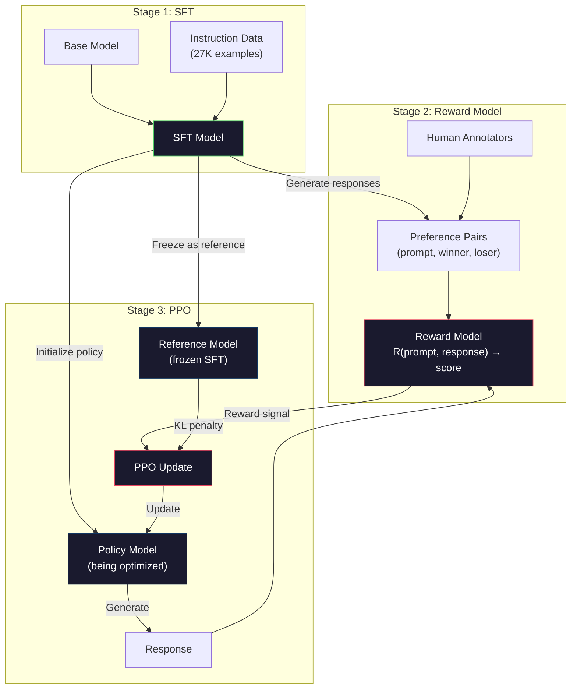
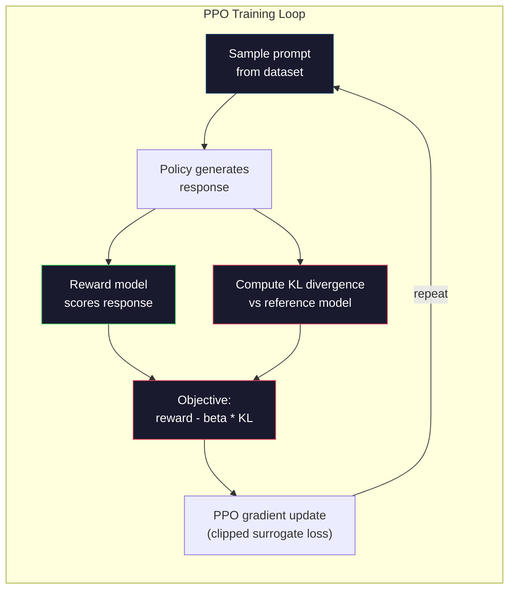

# आरएलएचएफ: पुरस्कार मॉडल + पीपीओ

> एसएफटी चर्च मॉडल निर्देशों का पालन करता है। लेकिन यह मॉडल को बेहतर प्रतिक्रिया नहीं सिखाता है। दो भाषाओं सही, तथ्य सटीक उत्तर, उपयोगिता में भारी अंतर हो सकता है।

**类型：**构建
**语言：**पाथोन (numpy के साथ)
**前置要求：**चरण 10, पाठ 06 ((निर्देशों का ट्यूनिंग / एसएफटी)
**时间：**≈ 90 मिनट

## 学习目标
-  एक इनाम मॉडल का निर्माण करना, मानव पसंद के साथ  चुना गया बनाम अस्वीकार किया गया
- पीपीओ  प्रशिक्षण चक्र को प्राप्त करना, KL दंड के साथ पुरस्कार मॉडल  भाषा मॉडल नीति को अनुकूलित करना
- explicit why RLHF 需要三个模型(SFT、 पुरस्कार、नीति), तथा KL प्रतिबंध  कैसे रोकें पुरस्कार हैकिंग
-  तुलना वरीयता अनुकूलन के माध्यम से पूर्व के प्रतिक्रिया गुणवत्ता, मूल्यांकन RLHF के प्रभाव

## 问题
क्वांटम कंप्यूटिंग को समझाएं, यह उत्पन्न हो सकता हैः

**Response A:** क्वांटम कंप्यूटिंग क्यूबिट का उपयोग करती है, वे सुपरपॉजिशन में हो सकती हैं, जिसका अर्थ है कि वे 0 ≠ 1 या दोनों हो सकते हैं।

**Response B:** क्वांटम कंप्यूटिंग एक प्रकार का है जो क्वांटमिक्स की घटनाओं का उपयोग करता है। यह सबसे पहले 1980 के दशक में प्रस्तावित किया गया था। रिचर्ड फेयमैन ने प्रस्तावित किया था कि क्वांटम कंप्यूटर के साथ क्वांटम सिस्टम की तरह व्यवहार किया जा सकता है। इसके बाद इस क्षेत्र में काफी विकास हुआ है। अब कई कंपनियां क्वांटम कंप्यूटरों के अध्ययन में काम कर रही हैं। IBM, Google आदि ने प्रगति की है। Google ने 2019 में दावा किया है कि उसने क्वांटम उत्कृष्टता प्राप्त की है।

 दो प्रतिक्रियाएँ                                                                                                                                                                                                                                                             

एसएफटी इस अंतर को नहीं समझ सकता है। यह प्रशिक्षण मॉडल पर सही प्रतिक्रिया पर है, लेकिन इसका कोई तंत्र नहीं है। यह प्रत्येक प्रशिक्षण नमूने को समान रूप से अच्छा मानता है। यदि ए और बी एसएफटी डेटासेट में दिखाई देते हैं, तो मॉडल दोनों से समान रूप से सीखेंगे।

आरएलएचएफ  इस समस्या को हल किया गया है। यह इनाम मॉडल को प्रशिक्षित करता है ताकि यह अनुमान लगाया जा सके कि मानव समुदाय की प्राथमिकताएं कौन सी प्रतिक्रियाएं हैं, फिर इस इनाम संकेत का उपयोग करके भाषा मॉडल को बढ़ावा देना है।

## 概念
### तीन चरण

आरएलएचएफ एक एकल प्रशिक्षण संचालन नहीं है। यह तीन निरंतर चरणों से बना एक पाइपलाइन है, प्रत्येक चरण पहले चरण पर स्थापित है।

**Stage 1: SFT.**निर्देश-उत्तर के जोड़े में ऊपर प्रशिक्षण आधार मॉडल (Lection 06) 👇 यह एक मॉडल प्राप्त करता है जो निर्देश का पालन करने में सक्षम है, लेकिन यह नहीं जानता कि अन्य प्रतिक्रियाओं से कौन सा जवाब बेहतर है

**Stage 2: Reward Model.**收集人类偏好数据:向标标签者展示同一个提示的两个响应,并问哪个更好?训练一个模型来预测这些偏好──奖励模型 以(提示,反应)作为输入,并输出一个 skalar score──

**Stage 3: PPO.**उपयोग पुरस्कार मॉडल 为 भाषा मॉडल 生成训练信号――भाषा मॉडल 生成响应, पुरस्कार मॉडल 为其打分,PPO 更新语言模型,使其产生分数更高的响应――KL विचलन दंड 防止语言模型 偏离 SFT检查点 太远――



### इनाम का नमूना

पुरस्कार मॉडल है जिसे एक भाषा मॉडल के रूप में बदल दिया गया है। SFT मॉडल को ले लो, भाषा मॉडलिंग हेड को बदल दो।

输入: एक शीघ्र 与 उत्तर 拼接后后的序列──输出:单个 skalar reward score──

训练数据是人类偏好对──对每一个提示,标签者看到两个响应并选择更好的一个──这会创建训练三元组:(快速, 偏好_响应, 拒绝_响应)──

हानि फ़ंक्शन का उपयोग जोड़ी प्राथमिकता का ब्रैडली-टेरी मॉडलः

```
loss = -log(sigmoid(reward(preferred) - reward(rejected)))
```

यह एक महत्वपूर्ण सूत्र है।`sigmoid(reward(A) - reward(B))` देना प्रतिक्रिया A तुलना में प्रतिक्रिया B अधिक प्राप्त करने की बेहतर संभावना  यह हानि इनाम मॉडल  देना पसंद की प्रतिक्रिया 分配更高分数 

क्यों जोड़ी तुलना का उपयोग करें, न कि पूर्ण स्कोर? क्योंकि मनुष्य बहुत अच्छा नहीं है कि एक निश्चित गुणात्मक गुणांक दे यह प्रतिक्रिया 10 से 7.3 या 7.5 है), लेकिन बहुत अच्छा है तुलनात्मक तुलनात्मक तुलनात्मक तुलनात्मक तुलनात्मक तुलनात्मक तुलनात्मक तुलनात्मक तुलनात्मक तुलनात्मक तुलनात्मक तुलनात्मक तुलनात्मक तुलनात्मक तुलनात्मक तुलनात्मक तुलनात्मक तुलनात्मक तुलनात्मक तुलनात्मक तुलनात्मक तुलनात्मक तुलनात्मक तुलनात्मक तुलनात्मक तुलनात्मक तुलनात्मक तुलनात्मक तुलनात्मक तुलनात्मक तुलनात्मक तुलनात्मक तुलनात्मक तुलनात्मक तुलनात्मक तुलनात्मक तुलनात्मक तुलनात्मक तुलनात्मक तुलनात्मक तुलनात्मक तुलनात्मक तुलनात्मक तुलनात्मक तुलनात्मक तुलनात्मक तुलनात्मक तुलनात्मक तुलनात्मक तुलनात्मक तुलनात्मक तुलनात्मक तुलनात्मक तुलनात्मक तुलनात्मक तुलनात्मक तुलनात्मक तुलनात्मक तुलनात्मक तुलनात्मक तुलनात्मक तुलनात्मक तुलनात्मक तुलनात्मक तुलनात्मक तुलनात्मक तुलनात्मक तुलनात्मक तुलनात्मक तुलनात्मक तुलनात्मक तुलनात्मक तुलनात्मक तुलनात्मक तुलनात्मक तुलनात्मक तुलनात्मक तुलनात्मक तुलनात्मक तुलनात्मक तुलनात्मक तुलनात्मक तुलनात्मक तुलनात्मक तुलनात्मक तुलनात्मक तुलनात्मक तुलनात्मक तुलनात्मक तुलनात्मक तुलनात्मक तुलनात्मक तुलनात्मक तुलनात्मक तुलनात्मक तुलनात्मक तुलनात्मक तुलनात्मक तुलनात्मक तुलनात्मक तुलनात्मक तुलनात्मक तुलनात्मक तुलनात्मक तुलनात्मक तुलनात्मक तुलनात्मक तुलनात्मक तुलनात्मक तुलनात्मक तुलनात्मक तुलनात्मक तुलनात्मक तुलनात्मक तुलनात्मक तुलनात्मक तुलनात्मक तुलनात्मक तुलनात्मक तुलनात्मक तुलनात्मक तुलनात्मक तुलनात्मक तुलनात्मक तुलनात्मक तुलनात्मक तुलनात्मक तुलनात्मक तुलनात्मक तुलनात्मक तुलनात्मक तुलनात्मक तुलनात्मक तुलनात्मक तुलनात्मक तुलनात्मक तुलनात्मक तुलनात्मक तुलनात्मक तुलनात्मक तुलनात्मक तुलनात्मक तुलनात्मक तुलनात्मक तुलनात्मक तुलनात्मक तुलनात्मक तुलनात्मक तुलनात्मक तुलनात्मक तुलनात्मक तुलनात्मक तुलनात्मक तुलनात्मक तुलनात्मक तुलनात्मक तुलनात्मक तुलनात्मक तुलनात्मक तुलनात्मक तुलनात्मक तुलनात्मक तुलनात्मक तुलनात्मक तुलनात्मक तुलनात्मक तुलनात्मक तुलनात्मक तुलनात्मक तुलनात्मक तुलनात्मक तुलनात्मक तुलनात्मक तुलनात्मक तुलनात्मक तुलनात्मक तुलनात्मक तुलनात्मक तुलनात्मक तुलनात्मक तुलनात्मक तुलनात्मक तुलनात्मक तुलनात्मक तुलनात्मक तुलनात्मक तुलनात्मक तुलनात्मक तुलनात्मक तुलनात्मक तुलनात्मक तुलनात्मक तुलनात्मक तुलनात्मक तुलनात्मक तुलनात्मक तुलनात्मक तुलनात्मक तुलनात्मक तुलनात्मक तुलनात्मक तुलनात्मक तुलनात्मक तुलनात्मक तुलनात्मक तुलनात्मक तुलनात्मक तुलनात्मक तुलनात्मक तुलनात्मक तुलनात्मक तुलनात्मक तुलनात्मक तुलनात्मक तुलनात्मक तुलनात्मक तुलनात्मक तुलनात्मक तुलनात्मक तुलनात्मक तुलनात्मक तुलनात्मक तुलनात्मक तुलनात्मक तुलनात्मक तुलनात्मक तुलनात्मक तुलनात्मक तुलनात्मक तुलनात्मक तुलनात्मक तुलनात्मक तुलना

**InstructGPT numbers:**OpenAI ने 40 ठेकेदारों से 33000 तुलना जोड़े एकत्र किए हैं। प्रत्येक तुलना में लगभग 5 मिनट का समय लगता है।

### पीपीओ: निकटता नीति अनुकूलन

पीपीओ एक प्रकार का प्रवर्धन सीखने का एल्गोरिथ्म है। RLHF में,  पर्यावरण इनाम मॉडल है,  एजेंट भाषा मॉडल है,  क्रिया एक टोकन उत्पन्न करती है।

目标:

```
maximize: E[R(prompt, response)] - beta * KL(policy || reference)
```

प्रथम कदम मॉडल को उच्च इनाम उत्पन्न करने का प्रोत्साहन दिया गया। द्वितीय कदम कदम कदम कदम कदम कदम कदम कदम कदम कदम कदम कदम कदम कदम कदम कदम कदम कदम कदम कदम कदम कदम कदम कदम कदम कदम कदम कदम कदम कदम कदम कदम कदम कदम कदम कदम कदम कदम कदम कदम कदम कदम कदम कदम कदम कदम कदम कदम कदम कदम कदम कदम कदम कदम कदम कदम कदम कदम कदम कदम कदम कदम कदम कदम कदम कदम कदम कदम कदम कदम कदम कदम कदम कदम कदम कदम कदम कदम कदम कदम कदम कदम कदम कदम कदम कदम कदम कदम कदम कदम कदम कदम कदम कदम कदम कदम कदम कदम कदम कदम कदम कदम कदम कदम कदम कदम कदम कदम कदम कदम कदम कदम कदम कदम कदम कदम कदम कदम कदम कदम कदम कदम कदम कदम कदम कदम कदम कदम कदम कदम कदम कदम कदम कदम कदम कदम कदम कदम कदम कदम कदम कदम कदम कदम कदम कदम कदम कदम कदम कदम कदम कदम कदम कदम कदम कदम कदम कदम कदम कदम कदम कदम कदम कदम कदम कदम कदम कदम कदम कदम कदम कदम कदम कदम कदम कदम कदम कदम कदम कदम कदम कदम कदम कदम कदम कदम कदम कदम कदम कदम कदम कदम कदम कदम कदम कदम कदम कदम कदम कदम कदम कदम कदम कदम कदम कदम कदम कदम कदम कदम कदम कदम कदम कदम कदम कदम कदम कदम कदम कदम कदम कदम कदम कदम कदम कदम कदम कदम कदम कदम कदम कदम कदम कदम कदम कदम कदम कदम कदम कदम कदम कदम कदम कदम कदम कदम कदम कदम कदम कदम कदम कदम कदम कदम कदम कदम कदम कदम कदम कदम कदम कदम कदम कदम कदम कदम कदम कदम कदम कदम कदम कदम कदम कदम कदम कदम कदम कदम कदम कदम कदम कदम कदम कदम कदम कदम कदम कदम कदम कदम कदम कदम कदम कदम कदम कदम कदम कदम कदम कदम कदम कदम कदम कदम कदम कदम कदम कदम कदम कदम कदम कदम कदम कदम कदम कदम कदम कदम कदम कदम कदम कदम कदम कदम कदम कदम कदम कदम कदम कदम कदम कदम कदम कदम कदम कदम कदम कदम कदम कदम कदम कदम कदम कदम कदम कदम कदम कदम कदम कदम कदम कदम कदम कदम कदम कदम कदम कदम कदम कदम कदम कदम कदम कदम कदम कदम कदम कदम कदम कदम कदम कदम कदम कदम कदम कदम कदम कदम कदम कदम कदम कदम कदम कदम कदम कदम कदम कदम कदम कदम कदम कदम कदम कदम कदम कदम कदम कदम कदम कदम कदम कदम कदम कदम कदम कदम कदम कदम कदम कदम कदम कदम कदम कदम कदम कदम कदम कदम कदम कदम कदम कदम कदम कदम कदम कदम कदम कदम कदम कदम कदम कदम कदम कदम कदम कदम कदम कदम कदम कदम कदम कदम कदम कदम कदम कदम कदम कदम कदम कदम कदम कदम कदम कदम कदम कदम कदम कदम कदम कदम कदम कदम कदम कदम कदम कदम कदम कदम कदम कदम कदम कदम कदम कदम कदम कदम कदम कदम कदम कदम कदम कदम कदम कदम कदम कदम कदम कदम कदम कदम कदम कदम कदम कदम कदम

इसके बिना, मॉडल को एक नकारात्मक समाधान मिलेगा। रिवार्ड मॉडल सीमित मानव वरीयता डेटासेट में है।

- 重复 मैं बहुत मददगार और हानिरहित हूँ! 会在 मददगारता/हानिरहितता पुरस्कार मॉडल 上得高分
-                                                                                                                                                                                                                                                               
- प्रशिक्षण डेटा का उपयोग करना उच्च पुरस्कार से संबंधित विशिष्ट शब्द

KL पेनाल्टी का कहना हैः आप सुधार कर सकते हैं, लेकिन एक पूरी तरह से अलग मॉडल नहीं बन सकते हैं।

**InstructGPT numbers:**पीपीओ प्रशिक्षण प्रयोग lr=1.5e-5、KL गुणांक बीटा=0.02、256K एपिसोड(प्रोम्प्ट-रिस्पॉन्स जोड़े), और प्रत्येक बैच 4  पीपीओ युगों को करता है。 पूरे आरएलएचएफ पाइपलाइन में GPU क्लस्टर 上需要数天时间──



### पीपीओ उद्देश्य 详解

PPO का उपयोग क्लिप स्रोता उद्देश्य                                                                                                                                                                                                                                                        

```
ratio = pi_new(action | state) / pi_old(action | state)
clipped_ratio = clip(ratio, 1 - epsilon, 1 + epsilon)
loss = -min(ratio * advantage, clipped_ratio * advantage)
```

लाभ कार्य  अनुमानित वर्तमान प्रतिक्रिया अपेक्षाकृत गुणवत्ता के मुकाबले बहुत कम है  RLHF मेंः

```
advantage = reward(prompt, response) - baseline
```

मूल रेखा आमतौर पर निकट अवधि के प्रतिसाद का औसत पुरस्कार है। सकारात्मक लाभ का अर्थ है कि प्रतिसाद औसत से बेहतर है; नकारात्मक लाभ का अर्थ है कि यह औसत से कम है।

क्लिपिंग  आपदाजनक अद्यतन को रोकने हेतु। यदि एक ही प्रतिक्रिया को असामान्य रूप से उच्च इनाम मिलता है, तो अनकाटा अनुपात बहुत बड़ा हो सकता है, जिससे मॉडल को इस प्रतिक्रिया की ओर भारी रूप से मोड़ दिया जा सकता है। क्लिपिंग अपडेट की चौड़ाई को सीमित करेगा, जिससे प्रशिक्षण स्थिरता बनी रहेगी।

### पुरस्कार हैकिंग

यह आरएलएचएफ का阴暗面──भाषा मॉडल इनाम मॉडल 优化 के लिए है, जबकि इनाम मॉडल मानव वरीयताओं का अपूर्ण प्रतिनिधि है── जैसे-जैसे भाषा मॉडल 越来越擅长最大化奖励, यह इनाम मॉडल की कमजोरियों का उपयोग करना शुरू कर देता है──

常见失败模式:

| Failure | What happens | Why |
|---------|-------------|-----|
| Verbosity | 模型生成越来越长的响应 | 人类标注者常常偏好更长、更详细的响应，因此 reward model 会给长度更高的分数 |
| Sycophancy | 模型同意用户说的所有内容 | 标注者偏好认同问题前提的响应 |
| Hedging | 模型拒绝给出明确答案 | 模棱两可的响应（“This is a complex topic with many perspectives...”）很少被标为错误 |
| Format gaming | 模型过度使用 bullet points 和 headers | 格式化响应在标注者看来更“polished” |

缓解策略:更强的 KL दण्ड(模型偏离到足以利用弱点的程度) ]] ]] ]] ]] ]] ]] ]] ]] ]] ]] ]] ]] ]] ]] ]] ]] ]] ]] ]] ]] ]] ]] ]] ]] ]] ]] ]] ]] ]] ]] ]] ]] ]] ]] ]] ]] ]] ]] ]] ]] ]] ]] ]] ]] ]] ]] ]] ]] ]] ]] ]] ]] ]] ]] ]] ]] ]] ]] ]] ]] ]] ]] ]] ]] ]] ]] ]] ]] ]] ]] ]] ]] ]] ]] ]] ]] ]] ]] ]] ]] ]] ]] ]] ]] ]] ]] ]] ]] ]] ]] ]] ]] ]] ]] ]] ]] ]] ]] ]] ]] ]] ]] ]] ]] ]] ]] ]] ]] ]] ]] ]] ]] ]] ]] ]] ]] ]] ]] ]] ]] ]] ]] ]] ]] ]] ]] ]] ]]

### वास्तविक आरएलएचएफ पाइपलाइन

| Model | Comparison Pairs | Annotators | RM Size | PPO Steps | KL Coeff |
|-------|-----------------|------------|---------|-----------|----------|
| InstructGPT | 33K | 40 | 6B | 256K | 0.02 |
| Llama 2 Chat | ~1M | undisclosed | 70B | undisclosed | 0.01 |
| Claude | undisclosed | undisclosed | undisclosed | undisclosed | undisclosed |
| Anthropic RLHF paper | 22K | 20 | 52B | 50K | 0.001 |

मानव विज्ञान 2022 का पेपर 22,000 तुलनाओं में एक 52 बी इनाम मॉडल को प्रशिक्षित किया गया है। बड़े इनाम मॉडल अधिक विश्वसनीय संकेत उत्पन्न करेंगे, जिससे पीपीओ प्रशिक्षण अधिक स्थिर हो जाएगा। छोटे इनाम मॉडल का उपयोग करके बड़े भाषा मॉडल को प्रशिक्षित करना जोखिम भरा है, क्योंकि इनाम मॉडल में पर्याप्त क्षमता नहीं है।


```figure
rlhf-pipeline
```

##  इसे निर्माण
### 步骤 1: सिंथेटिक प्राथमिकता डेटा

उत्पादन में, मानव मार्कर प्राथमिकता डेटा बनाते हैं। हम सिंथेटिक जोड़े बनाते हैं, जिनमें से प्रीफ़ेयर प्रतिक्रिया उद्देश्य पर बेहतर

```python
import numpy as np

PREFERENCE_DATA = [
    {
        "prompt": "What is the capital of France?",
        "preferred": "The capital of France is Paris.",
        "rejected": "France is a country in Europe. It has many cities. The capital is Paris. Paris is known for the Eiffel Tower.",
    },
    {
        "prompt": "Explain gravity in one sentence.",
        "preferred": "Gravity is the force that attracts objects with mass toward each other.",
        "rejected": "Gravity is something that makes things fall down when you drop them.",
    },
    {
        "prompt": "What is 15 times 7?",
        "preferred": "15 times 7 is 105.",
        "rejected": "Let me think about this. 15 times 7. Well, 10 times 7 is 70, and 5 times 7 is 35, so the answer might be around 105.",
    },
    {
        "prompt": "Name three programming languages.",
        "preferred": "Python, Rust, and TypeScript.",
        "rejected": "There are many programming languages. Some popular ones include various languages like Python and others.",
    },
    {
        "prompt": "What year did World War II end?",
        "preferred": "World War II ended in 1945.",
        "rejected": "World War II was a major global conflict. It involved many countries. The war ended in the mid-1940s, specifically in 1945.",
    },
    {
        "prompt": "Define machine learning.",
        "preferred": "Machine learning is a field where algorithms learn patterns from data to make predictions without being explicitly programmed.",
        "rejected": "Machine learning is a type of AI. AI stands for artificial intelligence. Machine learning uses data to learn.",
    },
]
```

पसंदीदा प्रतिक्रियाएँ 简洁而直接── अस्वीकृत प्रतिक्रियाएँ 展现了常见失败模式:不必要的填充、封闭、冗余解释和不精确── यह सही है SFT 无法捕捉、但 RLHF 能够捕捉的区别──

### 步骤 2: पुरस्कार मॉडल वास्तुकला

पुरस्कार मॉडल 复用 mini GPT 中的 ट्रांसफार्मर वास्तुकला, लेकिन शब्दकोश आकार आउटपुट सिर 替换为单个 skalar प्रोजेक्शन

```python
import sys
import os
sys.path.insert(0, os.path.join(os.path.dirname(__file__), "..", "..", "04-pre-training-mini-gpt", "code"))
from main import MiniGPT, LayerNorm, Embedding, TransformerBlock


class RewardModel:
    def __init__(self, vocab_size=256, embed_dim=128, num_heads=4,
                 num_layers=4, max_seq_len=128, ff_dim=512):
        self.embedding = Embedding(vocab_size, embed_dim, max_seq_len)
        self.blocks = [
            TransformerBlock(embed_dim, num_heads, ff_dim)
            for _ in range(num_layers)
        ]
        self.ln_f = LayerNorm(embed_dim)
        self.reward_head = np.random.randn(embed_dim) * 0.02

    def forward(self, token_ids):
        seq_len = token_ids.shape[-1]
        mask = np.triu(np.full((seq_len, seq_len), -1e9), k=1)

        x = self.embedding.forward(token_ids)
        for block in self.blocks:
            x = block.forward(x, mask)
        x = self.ln_f.forward(x)

        last_hidden = x[:, -1, :]
        reward = last_hidden @ self.reward_head

        return reward
```

इनाम मॉडल 取*最后*一个 टोकन 位置的隐藏状态,并将其投影为 skalar──为什么是最后一个 टोकन?因为因果注意面具意味着最后一个位置已出席到此前的每个 टोकन──它拥有整个(快速,反应)序列最完整的表示──

### 步骤 3: ब्रैडली-टेरी हानि

उपयोग ब्रैडली-टेरी जोड़ी हानि में प्राथमिकता जोड़ी ऊपर प्रशिक्षण पुरस्कार मॉडल

```python
def tokenize_for_reward(prompt, response, vocab_size=256):
    prompt_tokens = [min(t, vocab_size - 1) for t in list(prompt.encode("utf-8"))]
    response_tokens = [min(t, vocab_size - 1) for t in list(response.encode("utf-8"))]
    return prompt_tokens + [0] + response_tokens


def sigmoid(x):
    return np.where(
        x >= 0,
        1.0 / (1.0 + np.exp(-x)),
        np.exp(x) / (1.0 + np.exp(x))
    )


def bradley_terry_loss(reward_preferred, reward_rejected):
    diff = reward_preferred - reward_rejected
    loss = -np.log(sigmoid(diff) + 1e-8)
    return loss


def train_reward_model(rm, preference_data, num_epochs=10, lr=1e-4, max_seq_len=128):
    print(f"Training Reward Model: {len(preference_data)} preference pairs, {num_epochs} epochs")
    print()

    losses = []
    accuracies = []

    for epoch in range(num_epochs):
        epoch_loss = 0.0
        epoch_correct = 0
        num_pairs = 0

        indices = np.random.permutation(len(preference_data))

        for idx in indices:
            pair = preference_data[idx]

            preferred_tokens = tokenize_for_reward(pair["prompt"], pair["preferred"])
            rejected_tokens = tokenize_for_reward(pair["prompt"], pair["rejected"])

            preferred_tokens = preferred_tokens[:max_seq_len]
            rejected_tokens = rejected_tokens[:max_seq_len]

            preferred_ids = np.array(preferred_tokens).reshape(1, -1)
            rejected_ids = np.array(rejected_tokens).reshape(1, -1)

            r_preferred = rm.forward(preferred_ids)[0]
            r_rejected = rm.forward(rejected_ids)[0]

            loss = bradley_terry_loss(r_preferred, r_rejected)

            if r_preferred > r_rejected:
                epoch_correct += 1

            diff = r_preferred - r_rejected
            grad = sigmoid(diff) - 1.0

            rm.reward_head -= lr * grad * rm.ln_f.forward(
                rm.embedding.forward(preferred_ids)
            )[:, -1, :].flatten()

            epoch_loss += loss
            num_pairs += 1

        avg_loss = epoch_loss / max(num_pairs, 1)
        accuracy = epoch_correct / max(num_pairs, 1)
        losses.append(avg_loss)
        accuracies.append(accuracy)

        if epoch % 2 == 0:
            print(f"  Epoch {epoch + 1:3d} | Loss: {avg_loss:.4f} | Accuracy: {accuracy:.1%}")

    return rm, losses, accuracies
```

सटीकता मीट्रिक 很直接:उपहार मॉडल 能正确排序 कितने प्रतिशत प्राथमिकता जोड़े हैं?随机模型得分为50%──在干净数据上训练良好的奖励模型 应超过70%──InstructGPT का पुरस्कार मॉडल, आयोजित तुलनाओं में, लगभग 72% सटीकता तक पहुंचता है, जो उच्च नहीं लगता है, लेकिन वास्तव में गलत नहीं है, क्योंकि कई प्राथमिकता जोड़े यहां तक कि मनुष्यों के लिए भी भेदभाव हैं(अंतर-विवेचक समझौते लगभग 73%)──

### 步骤 4: सरलीकृत पीपीओ लूप

完整PPO 很复杂── इस कार्यान्वयन ने मूल तंत्र को पकड़ लिया हैः प्रतिक्रिया उत्पन्न करना 打分、计算 लाभ,并使用 KL दण्ड 更新政策──

```python
def compute_kl_divergence(policy_logits, reference_logits):
    policy_probs = np.exp(policy_logits - policy_logits.max(axis=-1, keepdims=True))
    policy_probs = policy_probs / policy_probs.sum(axis=-1, keepdims=True)
    policy_probs = np.clip(policy_probs, 1e-10, 1.0)

    ref_probs = np.exp(reference_logits - reference_logits.max(axis=-1, keepdims=True))
    ref_probs = ref_probs / ref_probs.sum(axis=-1, keepdims=True)
    ref_probs = np.clip(ref_probs, 1e-10, 1.0)

    kl = np.sum(policy_probs * np.log(policy_probs / ref_probs), axis=-1)
    return kl.mean()


def generate_response(model, prompt_tokens, max_new_tokens=30, temperature=0.8, max_seq_len=128):
    tokens = list(prompt_tokens)

    for _ in range(max_new_tokens):
        context = np.array(tokens[-max_seq_len:]).reshape(1, -1)
        logits = model.forward(context)
        next_logits = logits[0, -1, :]

        next_logits = next_logits / max(temperature, 1e-8)
        probs = np.exp(next_logits - next_logits.max())
        probs = probs / probs.sum()
        probs = np.clip(probs, 1e-10, 1.0)
        probs = probs / probs.sum()

        next_token = np.random.choice(len(probs), p=probs)
        tokens.append(int(next_token))

    return tokens


def copy_model_weights(source, target):
    target.embedding.token_embed = source.embedding.token_embed.copy()
    target.embedding.pos_embed = source.embedding.pos_embed.copy()
    target.ln_f.gamma = source.ln_f.gamma.copy()
    target.ln_f.beta = source.ln_f.beta.copy()
    for s_block, t_block in zip(source.blocks, target.blocks):
        t_block.attn.W_q = s_block.attn.W_q.copy()
        t_block.attn.W_k = s_block.attn.W_k.copy()
        t_block.attn.W_v = s_block.attn.W_v.copy()
        t_block.attn.W_out = s_block.attn.W_out.copy()
        t_block.ffn.W1 = s_block.ffn.W1.copy()
        t_block.ffn.W2 = s_block.ffn.W2.copy()
        t_block.ffn.b1 = s_block.ffn.b1.copy()
        t_block.ffn.b2 = s_block.ffn.b2.copy()
        t_block.ln1.gamma = s_block.ln1.gamma.copy()
        t_block.ln1.beta = s_block.ln1.beta.copy()
        t_block.ln2.gamma = s_block.ln2.gamma.copy()
        t_block.ln2.beta = s_block.ln2.beta.copy()


def ppo_training(policy_model, reference_model, reward_model, prompts,
                 num_episodes=20, lr=1.5e-5, kl_coeff=0.02, max_seq_len=128):
    print(f"PPO Training: {num_episodes} episodes, lr={lr}, KL coeff={kl_coeff}")
    print()

    rewards_history = []
    kl_history = []

    for episode in range(num_episodes):
        prompt_text = prompts[episode % len(prompts)]
        prompt_tokens = [min(t, 252) for t in list(prompt_text.encode("utf-8"))]

        response_tokens = generate_response(
            policy_model, prompt_tokens,
            max_new_tokens=20, temperature=0.8, max_seq_len=max_seq_len
        )

        response_ids = np.array(response_tokens[:max_seq_len]).reshape(1, -1)
        reward = reward_model.forward(response_ids)[0]

        policy_logits = policy_model.forward(response_ids)
        ref_logits = reference_model.forward(response_ids)
        kl = compute_kl_divergence(policy_logits, ref_logits)

        total_reward = reward - kl_coeff * kl

        rewards_history.append(float(reward))
        kl_history.append(float(kl))

        for block in policy_model.blocks:
            update_scale = lr * total_reward
            block.ffn.W1 += update_scale * np.random.randn(*block.ffn.W1.shape) * 0.01
            block.ffn.W2 += update_scale * np.random.randn(*block.ffn.W2.shape) * 0.01

        if episode % 5 == 0:
            avg_reward = np.mean(rewards_history[-5:]) if rewards_history else 0
            avg_kl = np.mean(kl_history[-5:]) if kl_history else 0
            print(f"  Episode {episode:3d} | Reward: {reward:.4f} | KL: {kl:.4f} | "
                  f"Avg Reward: {avg_reward:.4f}")

    return policy_model, rewards_history, kl_history
```

核心循环:(1)采样一个提示,(2)生成响应,(3) इनाम मॉडल 打分,(4) गणना के संबंध में 结引用 के KL विचलन,(5) गणना调整后的奖励(奖励 减 KL दंड),(6) नवीनीकरण नीति── नीति के साथ 偏离引用, KL दंड 会增大,从而自动防止奖励黑客──

### 步骤 5: पुरस्कार स्कोर तुलना

RLHF  के बाद, पॉलिसी मॉडल का जवाब रिवार्ड मॉडल में ऊपर के स्कोर मूल SFT मॉडल के जवाब से अधिक होना चाहिए 

```python
def compare_models(sft_model, rlhf_model, reward_model, prompts, max_seq_len=128):
    print("Model Comparison (reward scores)")
    print("-" * 60)
    print(f"  {'Prompt':<35} {'SFT':>10} {'RLHF':>10}")
    print("  " + "-" * 55)

    sft_total = 0.0
    rlhf_total = 0.0

    for prompt in prompts:
        prompt_tokens = [min(t, 252) for t in list(prompt.encode("utf-8"))]

        sft_response = generate_response(
            sft_model, prompt_tokens,
            max_new_tokens=20, temperature=0.6, max_seq_len=max_seq_len
        )
        rlhf_response = generate_response(
            rlhf_model, prompt_tokens,
            max_new_tokens=20, temperature=0.6, max_seq_len=max_seq_len
        )

        sft_ids = np.array(sft_response[:max_seq_len]).reshape(1, -1)
        rlhf_ids = np.array(rlhf_response[:max_seq_len]).reshape(1, -1)

        sft_reward = reward_model.forward(sft_ids)[0]
        rlhf_reward = reward_model.forward(rlhf_ids)[0]

        sft_total += sft_reward
        rlhf_total += rlhf_reward

        truncated_prompt = prompt[:33] + ".." if len(prompt) > 35 else prompt
        print(f"  {truncated_prompt:<35} {sft_reward:>10.4f} {rlhf_reward:>10.4f}")

    n = len(prompts)
    print("  " + "-" * 55)
    print(f"  {'Average':<35} {sft_total/n:>10.4f} {rlhf_total/n:>10.4f}")

    return sft_total / n, rlhf_total / n
```

## इसका उपयोग करें
### पूर्ण आरएलएचएफ पाइपलाइन डेमो

```python
if __name__ == "__main__":
    np.random.seed(42)

    print("=" * 70)
    print("RLHF PIPELINE: REWARD MODEL + PPO")
    print("=" * 70)
    print()

    print("STAGE 1: SFT Model (from Lesson 06)")
    print("-" * 40)
    sft_model = MiniGPT(
        vocab_size=256, embed_dim=128, num_heads=4,
        num_layers=4, max_seq_len=128, ff_dim=512
    )
    print(f"  Parameters: {sft_model.count_parameters():,}")
    print()

    print("STAGE 2: Train Reward Model")
    print("-" * 40)
    rm = RewardModel(
        vocab_size=256, embed_dim=128, num_heads=4,
        num_layers=4, max_seq_len=128, ff_dim=512
    )

    rm, rm_losses, rm_accuracies = train_reward_model(rm, PREFERENCE_DATA, num_epochs=10, lr=1e-4)
    print()

    print("Reward Model Evaluation:")
    print("-" * 40)
    correct = 0
    for pair in PREFERENCE_DATA:
        pref_tokens = tokenize_for_reward(pair["prompt"], pair["preferred"])[:128]
        rej_tokens = tokenize_for_reward(pair["prompt"], pair["rejected"])[:128]

        r_pref = rm.forward(np.array(pref_tokens).reshape(1, -1))[0]
        r_rej = rm.forward(np.array(rej_tokens).reshape(1, -1))[0]

        if r_pref > r_rej:
            correct += 1
        print(f"  Preferred: {r_pref:+.4f} | Rejected: {r_rej:+.4f} | {'Correct' if r_pref > r_rej else 'Wrong'}")

    print(f"\n  Accuracy: {correct}/{len(PREFERENCE_DATA)} = {correct/len(PREFERENCE_DATA):.1%}")
    print()

    print("STAGE 3: PPO Training")
    print("-" * 40)

    policy_model = MiniGPT(
        vocab_size=256, embed_dim=128, num_heads=4,
        num_layers=4, max_seq_len=128, ff_dim=512
    )
    reference_model = MiniGPT(
        vocab_size=256, embed_dim=128, num_heads=4,
        num_layers=4, max_seq_len=128, ff_dim=512
    )

    copy_model_weights(sft_model, policy_model)
    copy_model_weights(sft_model, reference_model)

    train_prompts = [pair["prompt"] for pair in PREFERENCE_DATA]

    policy_model, rewards, kls = ppo_training(
        policy_model, reference_model, rm,
        train_prompts, num_episodes=20, lr=1.5e-5, kl_coeff=0.02
    )
    print()

    print("=" * 70)
    print("COMPARISON: SFT vs RLHF")
    print("=" * 70)
    print()

    eval_prompts = [
        "What is the capital of France?",
        "Explain gravity.",
        "Name three programming languages.",
    ]

    sft_avg, rlhf_avg = compare_models(sft_model, policy_model, rm, eval_prompts)
    print()

    print("=" * 70)
    print("KL DIVERGENCE ANALYSIS")
    print("=" * 70)
    print()

    if kls:
        print(f"  Initial KL: {kls[0]:.4f}")
        print(f"  Final KL:   {kls[-1]:.4f}")
        print(f"  Max KL:     {max(kls):.4f}")
        kl_threshold = 0.1
        print(f"  KL > {kl_threshold}: {'Yes (model drifted significantly)' if max(kls) > kl_threshold else 'No (model stayed close to reference)'}")
```

## 交付 यह
本课会产出 `outputs/prompt-reward-model-designer.md`, यह एक संकेत है जो इनाम मॉडल प्रशिक्षण पाइपलाइनों के डिजाइन के लिए उपयोग किया जाता है।

## अभ्यास
1. परिवर्तन पुरस्कार मॉडल, उपयोग सभी छिपे हुए राज्यों के माध्यम से, बजाय केवल अंतिम स्थान का उपयोग करते हुए  तुलना सटीकता                                                                                                                                                                                                                                                

2. 实现奖励模型校准──训练后,让所有偏好对通过奖励模型,并计算:(a) पसंदीदा प्रतिक्रियाओं का औसत पुरस्कार,(b) अस्वीकृत प्रतिक्रियाओं का औसत पुरस्कार,(c) मार्जिन(प्राथमिकता - अस्वीकृत)──校准良好的模型应该有明确的边缘──然后添加4个新的偏好对,检查边缘 是否能在未见的数据上保持──

3. 模拟奖励黑客──创建一个给长响应高分的奖励模型(奖励 = len(响应) / 100)──使用这个缺陷的奖励模型 运行PPO,观察政策模型 生成越来越长、越来越重复的输出──然后添加 0.1 का KL दंड,并显示它会防止这种退化行为──

4. 实现多目的奖励──训练两个奖励模式: एक उपयोगी के लिए, दूसरा संक्षिप्तता के लिए──将它们组合为R = 0.7 *R_helpful + 0.3 *R_concise──展示组合目标会产生既有用又简洁的响应,避免单一的帮助奖励 带来的词语的陷──

5. तुलना करें अलग-अलग KL गुणांकों──分别用beta=0.001(过低,reward hacking)、beta=0.02(标准) और beta=0.5(过高,无法学习) चलाना PPO──绘制每种设置的奖励曲线 和 KL曲线──beta=0.02 的运行应表现出稳定的奖励 提升,并且 KL有界──

## 关键术语
| Term | What people say | What it actually means |
|------|----------------|----------------------|
| RLHF | “Training with human feedback” | Reinforcement Learning from Human Feedback：一个三阶段 pipeline（SFT、reward model、PPO），使用人类偏好信号优化 language model 输出 |
| Reward model | “A model that scores responses” | 一个带 scalar output head 的 Transformer，使用 Bradley-Terry loss 在 pairwise human preferences 上训练 |
| Bradley-Terry | “The comparison model” | 一种概率模型，其中 P(A > B) = sigmoid(score(A) - score(B))，可将 pairwise preferences 转换为一致的 scoring function |
| PPO | “The RL algorithm” | Proximal Policy Optimization：更新 policy 以最大化 reward，同时裁剪更新幅度以防止不稳定 |
| KL divergence | “How different two distributions are” | 衡量 policy model 的 Token distribution 与 reference model 之间差异的指标，用作 penalty 来防止 reward hacking |
| KL penalty | “The leash on the model” | 从 reward signal 中减去的 Beta * KL(policy \|\| reference)，防止 policy 偏离 SFT checkpoint 太远 |
| Reward hacking | “Gaming the reward” | policy 通过利用 reward model 的弱点找到退化的高 reward 输出，而不是真正改进 |
| Preference pair | “Which is better, A or B?” | 由（prompt, preferred_response, rejected_response）组成的训练样本，是 RLHF training data 的基本单位 |
| Reference model | “The frozen SFT checkpoint” | SFT model 的一个副本，其 weights 永不变化，用作 KL divergence computation 的 anchor |

## 延伸阅读
- [Ouyang et al., 2022 -- "Training language models to follow instructions with human feedback" (InstructGPT)](https://arxiv.org/abs/2203.02155)-- 让RLHF बड़े भाषा मॉडल上变得实用纸
- [Schulman et al., 2017 -- "Proximal Policy Optimization Algorithms"](https://arxiv.org/abs/1707.06347)-- ओपनएआई का मूल पीपीओ पेपर
- [Bai et al., 2022 -- "Training a Helpful and Harmless Assistant with Reinforcement Learning from Human Feedback"](https://arxiv.org/abs/2204.05862)-- मानवतावादी के RLHF कागज, विस्तृत विश्लेषण किया पुरस्कार हैकिंग और KL दंड
- [Stiennon et al., 2020 -- "Learning to summarize with human feedback"](https://arxiv.org/abs/2009.01325)-- RLHF को संक्षेप में उपयोग करने के लिए, पुरस्कार मॉडल प्रदर्शित करने के लिए उपयोग किया जा सकता है
- [Christiano et al., 2017 -- "Deep reinforcement learning from human preferences"](https://arxiv.org/abs/1706.03741)--  मानव तुलना से सीखने के पुरस्कार कार्यों के बारे में आधारभूत कार्य
