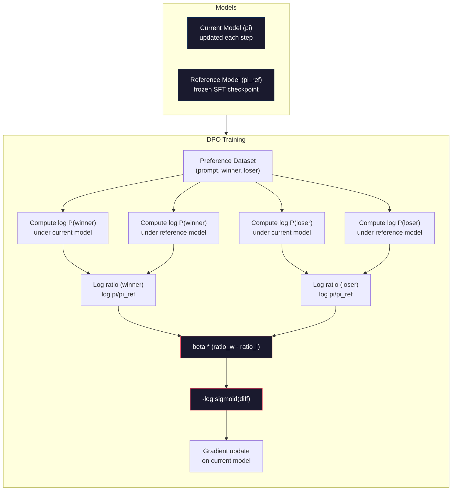

# डीपीओः प्रत्यक्ष प्राथमिकता अनुकूलन

> RLHF के प्रभाव हैं। लेकिन इसके लिए तीन मॉडल को प्रशिक्षित करने की आवश्यकता है।

**Type:** Build
**Languages:** Python (with numpy)
**Prerequisites:** Phase 10, Lesson 07 (RLHF)
**Time:** ~90 分钟

## 学习目标
- DPO प्रशिक्षण को प्राप्त करना, सीधे प्राथमिकता जोड़े पर अप्टिमाइज़ेशन भाषा मॉडल का उपयोग न करें, एकल इनाम मॉडल का उपयोग न करें
- 推导 DPO हानि समारोह,并解释 यह कैसे नीति के लॉग संभावनाओं के माध्यम से 隐式表示奖励模型
- प्रशिक्षण स्थिरता, गणना लागत और आवश्यक मॉडल संख्या के कोण से तुलना करें डीपीओ और आरएलएचएफ
- 调节 बीटा 参数,控制训练后的政策 偏离参考模型的程度

## 问题
आप पाठ 07 में एक आरएलएचएफ पाइपलाइन का निर्माण करते हैं── तीन चरणों── तीन मॉडल── एसएफटी मॉडल、 इनाम मॉडल, तथा पीपीओ  अनुकूलन नीति मॉडल── केवल इनाम मॉडल की आवश्यकता होती है हजारों व्यक्तिगत वर्ग वरीयता जोड़े तथा एक अलग प्रशिक्षण लूप── पीपीओ 仔细调节 KL गुणांक、शिक्षा दर、क्लिप अनुपात तथा युग संख्या──

अभ्यास में, पीपीओ प्रशिक्षण 以不稳定著称──很小的超参数 变化就可能导致训练发散──奖励模型是人类偏好的不完美代理,而政策会找到利用其弱点的方式──KL दण्ड有帮助,但它本身也需要调节:太低会导致奖励黑客,太高则模型几乎不学到东西──

इस प्रकार की जटिलता से पता चलता है कि InstructGPT के प्रकाशन के बाद कई वर्षों में, अधिकांश ओपन सोर्स मॉडल RLHF का उपयोग करना मुश्किल हो गया है।

2023 साल मई, स्टैनफोर्ड के राफेल राफेलोव, आर्किट शर्मा और उनके सहयोगियों ने प्रकाशित किया प्रत्यक्ष वरीयता अनुकूलनः आपकी भाषा मॉडल गुप्त रूप से एक पुरस्कार मॉडल है──核心洞见是:你不需要单独的奖励模型──最优奖励功能 在数学上由语言模型自身的代号 概率决定──你可以完全跳过奖励模型,直接在偏好对上优化语言模型──

डीपीओ ने आरएलएचएफ को एक पर्यवेक्षित सीखने के चरणों में सरल बनाया है। एक मॉडल। एक हानि समारोह। एक प्रशिक्षण लूप। कोई सुदृढीकरण सीखने नहीं है। ज़ेफायर-7बी सबसे पहले बड़े पैमाने पर डीपीओ के मॉडल में से एक है, जो कई बेंचमार्क में ऊपर की तुलना में ऊपर या ऊपर है।

## 概念
### महत्वपूर्ण समझ

RLHF 优化 इस लक्ष्य:

```
maximize: E[R(x, y)] - beta * KL(pi || pi_ref)
```

इनमें R इनाम मॉडल है, pi नीति है, pi_ref संदर्भ मॉडल है, beta KL गुणांक है。

डीपीओ पेपर 证明, इस लक्ष्य के अस्तित्व का खुलासा किया गया है 

```
pi*(y | x) = pi_ref(y | x) * exp(R(x, y) / beta) / Z(x)
```

इनमें से Z ((x) है पुनः एकीकरण सामान्य संख्याएँ

```
R(x, y) = beta * log(pi*(y | x) / pi_ref(y | x)) + beta * log Z(x)
```

यही है सफलता बिंदु। इनाम पूरी तरह से नीति मॉडल की संभावना और संदर्भ मॉडल की संभावना का उपयोग करके व्यक्त करना है। आपको एक अलग इनाम मॉडल को प्रशिक्षित करने की आवश्यकता नहीं है। इनाम  छिपा हुआ  शामिल है 

ब्रैडली-टेरी प्राथमिकता मॉडल में इसे बदलनाः

```
P(y_w > y_l | x) = sigmoid(R(x, y_w) - R(x, y_l))
                  = sigmoid(beta * (log pi(y_w|x)/pi_ref(y_w|x) - log pi(y_l|x)/pi_ref(y_l|x)))
```

Z(x) 项会抵消, चूंकि दो प्रतिक्रियाएं एक ही प्रॉम्प्ट x 为条件―― शेष केवल नीति मॉडल तथा संदर्भ मॉडल में पसंदीदा और अस्वीकृत प्रतिक्रियाओं के ऊपर लॉग-संभाव्यताओं का फ़ंक्शन है――

### डीपीओ का नुकसान

```
L_DPO = -log(sigmoid(beta * (log pi(y_w|x)/pi_ref(y_w|x) - log pi(y_l|x)/pi_ref(y_l|x))))
```

हम हर भाग को तोड़ दियाः

- **y_w**= पसंदीदा (जीत) प्रतिक्रिया
- **y_l**= अस्वीकार किया गया
- **x**= शीघ्र
- **pi**= 当前模型(正在训练)
- **pi_ref**= संदर्भ मॉडल ((结的 SFT चेक पॉइंट)
- **beta**=  नियंत्रण 偏离 参照 डिग्री  तापमान 参数(आमतौर पर 0.1 से 0.5)

比值 `log pi(y|x) / pi_ref(y|x)`यह लॉग-प्रभाव्यता अनुपात है। जब यह अनुपात सही समय के लिए होता है, तो वर्तमान मॉडल प्रतिक्रिया प्रदान करता है और संदर्भ से अधिक संभावना है।

डीपीओ हानि मॉडल को बढ़ावा देगा पसंदीदा प्रतिक्रियाओं के लॉग-संभाव्यता अनुपात में वृद्धि, और अस्वीकृत प्रतिक्रियाओं के लॉग-संभाव्यता अनुपात में कमी करेगा।



### डीपीओ सरल क्यों है

| Aspect | RLHF (PPO) | DPO |
|--------|-----------|-----|
| 需要训练的模型 | 3（SFT + reward + policy） | 1（仅 policy） |
| Training loops | 3（SFT、RM training、PPO） | 2（SFT、DPO） |
| Hyperparameters | lr、KL coeff、clip ratio、RM lr、epochs x3 | lr、beta、epochs |
| Reward model | 必需（单独训练） | 隐式存在于模型概率中 |
| RL algorithm | PPO（复杂、不稳定） | Supervised learning（稳定） |
| GPU memory | PPO 期间内存中有 3-4 个模型 | 2 个模型（current + reference） |
| 训练稳定性 | 对 hyperparameters 敏感 | 稳健，类似 SFT |

डीपीओ प्रशिक्षण समय में स्मृति में दो मॉडल रखने की आवश्यकता हैः वर्तमान मॉडल और संदर्भों का निष्कर्ष। RLHF को तीन या चार की आवश्यकता हैः नीति, संदर्भ, पुरस्कार मॉडल, साथ ही चयन योग्य मूल्य फ़ंक्शन बेसलाइन। 70B मॉडल के लिए, FP16 में प्रत्येक संस्करण में 140GB की आवश्यकता है।

### जब डीपीओ आरएलएचएफ से बेहतर होता है

**小数据集。**5,000-20,000 प्राथमिकता जोड़े के पैमाने पर, डीपीओ आमतौर पर आरएलएचएफ के बीच पुरस्कार मॉडल को पकड़ सकता है या उससे अधिक है।

**计算资源有限。**डीपीओ को केवल पूर्ण आरएलएचएफ की आवश्यकता होती है।

**快速迭代。**想尝试10 अलग-अलग प्राथमिकता डेटासेट,看看哪个能产生最佳模型?DPO 让你能在几小时内完成每次实验──RLHF 则需要为每一个数据集重新训练奖励模型──

### जब आरएलएचएफ डीपीओ से बेहतर होता है

**大规模训练。**जीपीटी-4 या क्लाउड के पैमाने पर, आरएलएचएफ का एकल इनाम मॉडल अधिक विस्तृत प्राथमिकता संकेतों को कैप्चर कर सकता है। इनाम मॉडल एक प्रकार के रूप में सीखना प्राप्त हानि समारोह, जटिल गुणवत्ता मानकों को अनुकूलित कर सकता है।

**复杂 reward signals。**जब  बेहतर涉及多个维度 (उपयोगिता, हानिरहितता, ईमानदारी) में, पुरस्कार मॉडल इस प्रकार के कई उद्देश्यों का वजन सीख सकता है।

**迭代式 alignment。**आरएलएचएफ पाइपलाइनें मौजूदा नीति के साथ नई प्रतिक्रियाएं उत्पन्न कर सकती हैं, मानव मूल्यांकन कर सकती हैं, फिर ऑनलाइन चक्र में पुनः प्रशिक्षण पुरस्कार मॉडल को लागू करती हैं।

### डीपीओ  बाहर: केटीओ, ओआरपीओ, सिम्पो

डीपीओ ने सरलीकृत संरेखण विधि की एक श्रृंखला शुरू की है।

**KTO (Kahneman-Tversky Optimization, 2024)：**आपको डेटा के लिए भी नहीं होना चाहिए। KTO उपयोग未配对反: केवल प्रत्येक उत्तर को  अच्छा या  बुरा के लिए चिह्नित करना चाहिए, और इसे किसी अन्य विकल्प से तुलना करने की आवश्यकता नहीं है। यह डेटा संग्रह को काफी सरल बनाता है। यह चिह्नित करने वाले को दो उत्तर प्रदर्शित करने के लिए नहीं है और यह पूछने के लिए कि कौन सा बेहतर है?, बल्कि एक उत्तर प्रदर्शित करने के लिए है और यह पूछने के लिए कि क्या यह अच्छा है? हानि फ़ंक्शन  ने पूर्वदृश्य सिद्धांत में हानि को लागू किया।

**ORPO (Odds Ratio Preference Optimization, 2024)：**एसएफटी और संरेखण को एक प्रशिक्षण चरण में 合并 करने के लिए ORPO पहले एसएफटी नहीं करता है और फिर डीपीओ करता है, बल्कि एसएफटी हानि को संशोधित करता है, जिससे यह प्राथमिकता संकेत को शामिल करता है🏻 Loss के दो तत्व हैंः प्राथमिकता वाले उत्तरों का उपयोग करने के लिए ️ एक संभावना अनुपात ️ जोड़ने के लिए, प्राथमिकता वाले और अस्वीकृत प्रतिक्रिया ️ संभावना के बीच अंतर को बढ़ाने के लिए️ एक प्रशिक्षण लूप, दो के बजाय️

**SimPO (Simple Preference Optimization, 2024)：**完全消除参考模型──SIMPO 再针对结的参考 计算日志-概率比,而是使用响应的平均日志-概率──按长度归结) 隐式奖励──这省内存──不需要参考模型──并简化训练──长度归结防止模型偏好更短的响应──

| Method | Year | Models in Memory | Needs Pairs? | Needs Reference? | Training Loops |
|--------|------|-----------------|-------------|-----------------|----------------|
| RLHF | 2022 | 3-4 | Yes（用于 RM） | Yes | 3 |
| DPO | 2023 | 2 | Yes | Yes | 2 |
| KTO | 2024 | 2 | No（未配对） | Yes | 2 |
| ORPO | 2024 | 1 | Yes | No | 1 |
| SimPO | 2024 | 1 | Yes | No | 1 |

प्रवृत्ति स्पष्ट हैः प्रत्येक विधि से एक भाग की जटिलता को समाप्त किया गया है। RLHF आवश्यकता इनाम मॉडल 和 PPO DPO द्वितीय को समाप्त किया गया है।

### वास्तविक डीपीओ तैनाती

**Zephyr-7B (HuggingFace, October 2023)：**इस आधार पर, UltraChat में SFT करें, फिर UltraFeedback में DPO करें। MT-Bench में 6.47 स्कोर, उस समय का सबसे ऊंचा 7B मॉडल है।

**Llama 3 (Meta, April 2024)：**आरएलएचएफ के प्रारंभिक चरण में डीपीओ का उपयोग किया गया। इस संयोजन से पता चलता है कि डीपीओ और आरएलएचएफ एक दूसरे के साथ हो सकते हैंः आरएलएचएफ व्यापक संरेखण के लिए उपयोग किया जाता है, डीपीओ उद्देश्यपूर्ण परिष्करण के लिए उपयोग किया जाता है।

**Neural Magic / nm-chat (2024)：**डीपीओ को कई ओपन सोर्स मॉडल में लागू किया जाएगा, और यह केवल एसएफटी बेसलाइन के मुकाबले 5-15% के स्तर में वृद्धि का प्रदर्शन करेगा।


```figure
dpo-loss
```

##  इसे निर्माण
### 步骤 1: प्राथमिकता डेटासेट

RLHF प्रयोग समान प्रारूप:(उत्पादित, पसंद किया, अस्वीकार किया गया) 三元组──DPO 直接消费这些数据,不需要中间的奖励模型──

```python
import numpy as np
import sys
import os
sys.path.insert(0, os.path.join(os.path.dirname(__file__), "..", "..", "04-pre-training-mini-gpt", "code"))
from main import MiniGPT, LayerNorm, Embedding, TransformerBlock

PREFERENCE_DATA = [
    {
        "prompt": "What is the capital of France?",
        "preferred": "The capital of France is Paris.",
        "rejected": "France is a country in Europe. It has many cities. The capital is Paris. Paris is known for the Eiffel Tower.",
    },
    {
        "prompt": "Explain gravity in one sentence.",
        "preferred": "Gravity is the force that attracts objects with mass toward each other.",
        "rejected": "Gravity is something that makes things fall down when you drop them.",
    },
    {
        "prompt": "What is 15 times 7?",
        "preferred": "15 times 7 is 105.",
        "rejected": "Let me think about this. 15 times 7. Well, 10 times 7 is 70, and 5 times 7 is 35, so the answer might be around 105.",
    },
    {
        "prompt": "Name three programming languages.",
        "preferred": "Python, Rust, and TypeScript.",
        "rejected": "There are many programming languages. Some popular ones include various languages like Python and others.",
    },
    {
        "prompt": "What year did World War II end?",
        "preferred": "World War II ended in 1945.",
        "rejected": "World War II was a major global conflict. It involved many countries. The war ended in the mid-1940s, specifically in 1945.",
    },
    {
        "prompt": "Define machine learning.",
        "preferred": "Machine learning is a field where algorithms learn patterns from data to make predictions without being explicitly programmed.",
        "rejected": "Machine learning is a type of AI. AI stands for artificial intelligence. Machine learning uses data to learn.",
    },
]
```

### 步骤 2: अनुक्रम लॉग-संभाव्यता

DPO हानि 需要计算给定提示 时某个响应的总日记概率── इसका अर्थ है कि प्रत्येक प्रतिक्रिया टोकन की लॉग-概率 求和── को पूर्ण में चलाने के लिए  शीघ्र + प्रतिक्रिया) क्रम में होना चाहिए।

```python
def tokenize_sequence(text, vocab_size=256):
    return [min(t, vocab_size - 1) for t in list(text.encode("utf-8"))]


def compute_sequence_log_prob(model, prompt_tokens, response_tokens, max_seq_len=128):
    full_sequence = prompt_tokens + response_tokens
    if len(full_sequence) > max_seq_len:
        full_sequence = full_sequence[:max_seq_len]

    if len(full_sequence) < 2:
        return 0.0

    input_ids = np.array(full_sequence[:-1]).reshape(1, -1)
    target_ids = np.array(full_sequence[1:])

    logits = model.forward(input_ids)
    logits = logits[0]

    max_logits = logits.max(axis=-1, keepdims=True)
    log_probs = logits - max_logits - np.log(
        np.exp(logits - max_logits).sum(axis=-1, keepdims=True)
    )

    prompt_len = len(prompt_tokens)
    response_start = max(0, prompt_len - 1)
    response_end = len(target_ids)

    if response_start >= response_end:
        return 0.0

    response_log_probs = log_probs[response_start:response_end, :]
    response_targets = target_ids[response_start:response_end]

    total_log_prob = 0.0
    for i, target in enumerate(response_targets):
        total_log_prob += response_log_probs[i, target]

    return total_log_prob
```

यह फ़ंक्शन डीपीओ का मूल उपकरण है। प्रत्येक प्राथमिकता जोड़ी के लिए, यह चार बार चलता हैः मॉडल 计算 प्राथमिकता प्रतिक्रिया, मॉडल 计算 अस्वीकृत प्रतिक्रिया, संदर्भ 计算 प्राथमिकता प्रतिक्रिया, संदर्भ 计算 अस्वीकृत प्रतिक्रिया── यानि प्रत्येक प्रशिक्षण उदाहरण 4 बार आगे गुजरता है; इसके विपरीत, आरएलएचएफ 需要生成 + इनाम स्कोरिंग + मूल्य अनुमान + पीपीओ अपडेट──更简单、更快、更稳定──

### 步骤 3: डीपीओ हानि

论文核心用代码表示──一个函数──一个损失──不需要奖励模型──

```python
def sigmoid(x):
    return np.where(
        x >= 0,
        1.0 / (1.0 + np.exp(-x)),
        np.exp(x) / (1.0 + np.exp(x))
    )


def dpo_loss(policy_logprob_preferred, policy_logprob_rejected,
             ref_logprob_preferred, ref_logprob_rejected, beta=0.1):
    preferred_ratio = policy_logprob_preferred - ref_logprob_preferred
    rejected_ratio = policy_logprob_rejected - ref_logprob_rejected

    logit = beta * (preferred_ratio - rejected_ratio)

    loss = -np.log(sigmoid(logit) + 1e-8)

    preferred_reward = beta * preferred_ratio
    rejected_reward = beta * rejected_ratio

    return loss, {
        "preferred_ratio": float(preferred_ratio),
        "rejected_ratio": float(rejected_ratio),
        "logit": float(logit),
        "implicit_preferred_reward": float(preferred_reward),
        "implicit_rejected_reward": float(rejected_reward),
        "reward_margin": float(preferred_reward - rejected_reward),
    }
```

`preferred_ratio`和 `rejected_ratio`                                                                                                                                                                                                                                                              

`implicit_preferred_reward`和 `implicit_rejected_reward` DPO Loss  छिपा हुआ वितरण पुरस्कार आप उन्हें उठाकर यह सत्यापित कर सकते हैं कि प्रशिक्षण प्रभावी हैः पसंदीदा और अस्वीकृत पुरस्कार  के बीच अंतर  प्रशिक्षण प्रक्रिया में बढ़ना चाहिए

### 步骤 4: डीपीओ प्रशिक्षण लूप

एक मानक पर्यवेक्षित प्रशिक्षण लूप― कोई पीपीओ― कोई इनाम मॉडल― केवल आगे के पास तथा ग्रेडिएंट अपडेट―

```python
def copy_model_weights(source, target):
    target.embedding.token_embed = source.embedding.token_embed.copy()
    target.embedding.pos_embed = source.embedding.pos_embed.copy()
    target.ln_f.gamma = source.ln_f.gamma.copy()
    target.ln_f.beta = source.ln_f.beta.copy()
    for s_block, t_block in zip(source.blocks, target.blocks):
        t_block.attn.W_q = s_block.attn.W_q.copy()
        t_block.attn.W_k = s_block.attn.W_k.copy()
        t_block.attn.W_v = s_block.attn.W_v.copy()
        t_block.attn.W_out = s_block.attn.W_out.copy()
        t_block.ffn.W1 = s_block.ffn.W1.copy()
        t_block.ffn.W2 = s_block.ffn.W2.copy()
        t_block.ffn.b1 = s_block.ffn.b1.copy()
        t_block.ffn.b2 = s_block.ffn.b2.copy()
        t_block.ln1.gamma = s_block.ln1.gamma.copy()
        t_block.ln1.beta = s_block.ln1.beta.copy()
        t_block.ln2.gamma = s_block.ln2.gamma.copy()
        t_block.ln2.beta = s_block.ln2.beta.copy()


def dpo_train(policy_model, reference_model, preference_data,
              num_epochs=5, lr=5e-6, beta=0.1, max_seq_len=128):
    print(f"DPO Training: {len(preference_data)} pairs, {num_epochs} epochs, "
          f"lr={lr}, beta={beta}")
    print()

    losses = []
    margins = []

    for epoch in range(num_epochs):
        epoch_loss = 0.0
        epoch_margin = 0.0
        num_examples = 0

        indices = np.random.permutation(len(preference_data))

        for idx in indices:
            pair = preference_data[idx]

            prompt_tokens = tokenize_sequence(pair["prompt"])
            preferred_tokens = tokenize_sequence(pair["preferred"])
            rejected_tokens = tokenize_sequence(pair["rejected"])

            pi_logprob_w = compute_sequence_log_prob(
                policy_model, prompt_tokens, preferred_tokens, max_seq_len
            )
            pi_logprob_l = compute_sequence_log_prob(
                policy_model, prompt_tokens, rejected_tokens, max_seq_len
            )
            ref_logprob_w = compute_sequence_log_prob(
                reference_model, prompt_tokens, preferred_tokens, max_seq_len
            )
            ref_logprob_l = compute_sequence_log_prob(
                reference_model, prompt_tokens, rejected_tokens, max_seq_len
            )

            loss, metrics = dpo_loss(
                pi_logprob_w, pi_logprob_l,
                ref_logprob_w, ref_logprob_l, beta
            )

            update_direction = 1.0 if metrics["logit"] < 0 else -0.1
            for block in policy_model.blocks:
                block.ffn.W1 += lr * update_direction * np.random.randn(*block.ffn.W1.shape) * 0.01
                block.ffn.W2 += lr * update_direction * np.random.randn(*block.ffn.W2.shape) * 0.01

            epoch_loss += loss
            epoch_margin += metrics["reward_margin"]
            num_examples += 1
            losses.append(float(loss))
            margins.append(metrics["reward_margin"])

        avg_loss = epoch_loss / max(num_examples, 1)
        avg_margin = epoch_margin / max(num_examples, 1)

        print(f"  Epoch {epoch + 1}/{num_epochs} | Loss: {avg_loss:.4f} | "
              f"Avg Margin: {avg_margin:.4f}")

    return policy_model, losses, margins
```

RLHF के मुकाबले, यह प्रशिक्षण लूप 简洁得令人耳目一新── प्रत्येक प्राथमिकता जोड़ी के लिए: गणना चार लॉग-संभाव्यताएँ (दो मॉडल, दो प्रतिक्रियाएं), उन्हें डीपीओ हानि, गणना ग्रेडिएंट, अद्यतन नीति── कोई पीढ़ी कदम── कोई इनाम मॉडल निष्कर्ष── कोई लाभ अनुमान── कोई कटिंग──

### 步骤 5: डीपीओ बनाम आरएलएचएफ की तुलना करें

测量隐式奖励率和日志-सम्भावना बदलाव,将DPO与课07中的RLHF मॉडल 进行比较──

```python
def evaluate_preference_accuracy(model, reference_model, preference_data, beta=0.1, max_seq_len=128):
    correct = 0
    total = 0

    for pair in preference_data:
        prompt_tokens = tokenize_sequence(pair["prompt"])
        preferred_tokens = tokenize_sequence(pair["preferred"])
        rejected_tokens = tokenize_sequence(pair["rejected"])

        pi_w = compute_sequence_log_prob(model, prompt_tokens, preferred_tokens, max_seq_len)
        pi_l = compute_sequence_log_prob(model, prompt_tokens, rejected_tokens, max_seq_len)
        ref_w = compute_sequence_log_prob(reference_model, prompt_tokens, preferred_tokens, max_seq_len)
        ref_l = compute_sequence_log_prob(reference_model, prompt_tokens, rejected_tokens, max_seq_len)

        preferred_reward = beta * (pi_w - ref_w)
        rejected_reward = beta * (pi_l - ref_l)

        if preferred_reward > rejected_reward:
            correct += 1
        total += 1

    return correct / max(total, 1)


def analyze_implicit_rewards(model, reference_model, preference_data, beta=0.1, max_seq_len=128):
    print("Implicit Reward Analysis:")
    print("-" * 65)
    print(f"  {'Prompt':<30} {'Pref Reward':>12} {'Rej Reward':>12} {'Margin':>10}")
    print("  " + "-" * 60)

    for pair in preference_data:
        prompt_tokens = tokenize_sequence(pair["prompt"])
        preferred_tokens = tokenize_sequence(pair["preferred"])
        rejected_tokens = tokenize_sequence(pair["rejected"])

        pi_w = compute_sequence_log_prob(model, prompt_tokens, preferred_tokens, max_seq_len)
        pi_l = compute_sequence_log_prob(model, prompt_tokens, rejected_tokens, max_seq_len)
        ref_w = compute_sequence_log_prob(reference_model, prompt_tokens, preferred_tokens, max_seq_len)
        ref_l = compute_sequence_log_prob(reference_model, prompt_tokens, rejected_tokens, max_seq_len)

        pref_reward = beta * (pi_w - ref_w)
        rej_reward = beta * (pi_l - ref_l)
        margin = pref_reward - rej_reward

        truncated = pair["prompt"][:28] + ".." if len(pair["prompt"]) > 30 else pair["prompt"]
        print(f"  {truncated:<30} {pref_reward:>12.4f} {rej_reward:>12.4f} {margin:>10.4f}")

    print()
```

### 步骤 6: बीटा संवेदनशीलता विश्लेषण

बीटा पैरामीटर डीपीओ में RLHF 里 KL गुणांक के पैरामीटर है। यह नियंत्रण मॉडल संदर्भ से विचलित हो सकता है। यह प्रयोग इसका प्रभाव प्रदर्शित करता है।

```python
def beta_sensitivity_analysis(sft_model, preference_data, betas, max_seq_len=128):
    print("Beta Sensitivity Analysis")
    print("-" * 60)
    print(f"  {'Beta':>8} {'Final Loss':>12} {'Final Margin':>14} {'Accuracy':>10}")
    print("  " + "-" * 55)

    results = []

    for beta in betas:
        policy = MiniGPT(
            vocab_size=256, embed_dim=128, num_heads=4,
            num_layers=4, max_seq_len=max_seq_len, ff_dim=512
        )
        reference = MiniGPT(
            vocab_size=256, embed_dim=128, num_heads=4,
            num_layers=4, max_seq_len=max_seq_len, ff_dim=512
        )
        copy_model_weights(sft_model, policy)
        copy_model_weights(sft_model, reference)

        policy, losses, margins_list = dpo_train(
            policy, reference, preference_data,
            num_epochs=3, lr=5e-6, beta=beta, max_seq_len=max_seq_len
        )

        accuracy = evaluate_preference_accuracy(
            policy, reference, preference_data, beta, max_seq_len
        )

        final_loss = losses[-1] if losses else 0
        final_margin = margins_list[-1] if margins_list else 0

        print(f"  {beta:>8.3f} {final_loss:>12.4f} {final_margin:>14.4f} {accuracy:>10.1%}")
        results.append({
            "beta": beta,
            "final_loss": final_loss,
            "final_margin": final_margin,
            "accuracy": accuracy,
        })

        print()

    return results
```

较小的beta(0.01) मॉडल को स्वतंत्र रूप से संदर्भ से अलग करने की अनुमति देता हैः सीखने की गति तेजी से, लेकिन नकारात्मकता का जोखिम है।

## इसका उपयोग करें
### पूर्ण डीपीओ पाइपलाइन डेमो

```python
if __name__ == "__main__":
    np.random.seed(42)

    print("=" * 70)
    print("DPO: DIRECT PREFERENCE OPTIMIZATION")
    print("=" * 70)
    print()

    print("STEP 1: Initialize SFT Model (from Lesson 06)")
    print("-" * 50)
    sft_model = MiniGPT(
        vocab_size=256, embed_dim=128, num_heads=4,
        num_layers=4, max_seq_len=128, ff_dim=512
    )
    print(f"  Parameters: {sft_model.count_parameters():,}")
    print()

    print("STEP 2: DPO Training")
    print("-" * 50)

    policy_model = MiniGPT(
        vocab_size=256, embed_dim=128, num_heads=4,
        num_layers=4, max_seq_len=128, ff_dim=512
    )
    reference_model = MiniGPT(
        vocab_size=256, embed_dim=128, num_heads=4,
        num_layers=4, max_seq_len=128, ff_dim=512
    )
    copy_model_weights(sft_model, policy_model)
    copy_model_weights(sft_model, reference_model)

    policy_model, losses, margins = dpo_train(
        policy_model, reference_model, PREFERENCE_DATA,
        num_epochs=5, lr=5e-6, beta=0.1
    )
    print()

    print("=" * 70)
    print("STEP 3: Evaluate")
    print("=" * 70)
    print()

    pre_accuracy = evaluate_preference_accuracy(
        sft_model, reference_model, PREFERENCE_DATA, beta=0.1
    )
    post_accuracy = evaluate_preference_accuracy(
        policy_model, reference_model, PREFERENCE_DATA, beta=0.1
    )

    print(f"  Preference accuracy (pre-DPO):  {pre_accuracy:.1%}")
    print(f"  Preference accuracy (post-DPO): {post_accuracy:.1%}")
    print()

    analyze_implicit_rewards(policy_model, reference_model, PREFERENCE_DATA, beta=0.1)

    print("=" * 70)
    print("STEP 4: Training Dynamics")
    print("=" * 70)
    print()

    if losses:
        print("  Loss curve:")
        window = max(1, len(losses) // 5)
        for i in range(0, len(losses), window):
            chunk = losses[i:i + window]
            avg = sum(chunk) / len(chunk)
            print(f"    Steps {i:3d}-{i + len(chunk) - 1:3d}: loss = {avg:.4f}")
        print()

    if margins:
        print("  Reward margin curve:")
        window = max(1, len(margins) // 5)
        for i in range(0, len(margins), window):
            chunk = margins[i:i + window]
            avg = sum(chunk) / len(chunk)
            print(f"    Steps {i:3d}-{i + len(chunk) - 1:3d}: margin = {avg:.4f}")
        print()

    print("=" * 70)
    print("STEP 5: Beta Sensitivity")
    print("=" * 70)
    print()

    beta_results = beta_sensitivity_analysis(
        sft_model, PREFERENCE_DATA, betas=[0.01, 0.1, 0.3, 1.0]
    )

    print("=" * 70)
    print("DPO vs RLHF COMPARISON")
    print("=" * 70)
    print()
    print("  DPO advantages:")
    print("    - 1 training loop (vs 3 for RLHF)")
    print("    - 2 models in memory (vs 3-4 for RLHF)")
    print("    - Supervised learning (vs RL, more stable)")
    print("    - No reward model to train or maintain")
    print()
    print("  RLHF advantages:")
    print("    - Separate reward model captures complex preferences")
    print("    - Online learning: generate, rate, retrain")
    print("    - Better for multi-objective alignment")
    print("    - Proven at largest scales (GPT-4, Claude)")
    print()
    print("  Practical guidance:")
    print("    - Start with DPO. It's simpler and often sufficient.")
    print("    - Switch to RLHF if DPO plateaus on your eval metrics.")
    print("    - Many production systems use both: RLHF first, DPO to refine.")
```

## 交付 यह
本课会产出 `outputs/prompt-alignment-method-selector.md`: एक उदाहरण के लिए सही संरेखण 方法 方法 SFT、RLHF、DPO、KTO、ORPO、SimPO) का सुझाव  प्रदान करें  अपने डेटा की उपलब्धता  गणना बजट और संरेखण  लक्ष्य, यह एक विधि और प्रशिक्षण योजना  का सुझाव देगा 

## अभ्यास
1.  KTO (Kahneman-Tversky Optimization)  KTO को डेटा के लिए तैयार करने की आवश्यकता नहीं है, केवल प्रत्येक प्रतिक्रिया को  अच्छे या  बुरे के लिए चिह्नित करने की आवश्यकता है  अच्छे प्रतिक्रिया का नुकसान `-log(sigmoid(beta * log_ratio))`, खराब प्रतिक्रिया का नुकसान है`-log(1 - sigmoid(beta * log_ratio))`,并对坏反应 损失 使用损失厌恶乘数(通常为1.5x) ⋅在同一份数据上训练(分别将优先 当作好、拒绝 当作坏),并与DPO比较精确──

2. 实现 लंबाई-मानकीकृत DPO──नहीं प्रयोग करें मूल लॉग-संभाव्यताएं, बल्कि प्रतिक्रिया टोकन की संख्या को अलग करकेः`normalized_logprob = total_logprob / num_tokens` यह मॉडल की प्राथमिकता से कम प्रतिक्रियाओं को रोक सकता है उनमें अधिक कुल लॉग-प्रोब होते हैं

3. 构建一个ORPO 风格的组合损失──向DPO Loss 中添加首选反应 上的标准下一个代码预测损失:`L = L_sft(preferred) + alpha * L_dpo`◊ प्रयास 0.1、0.5 तथा 1.0 के अल्फा मूल्य ◊ संयुक्त हानि ◊ एक पहले से ही अनुसरण करने योग्य निर्देश ◊ SFT 项 से प्राप्त) और फिर बेहतर प्रतिक्रिया ◊ DPO 项 से प्राप्त) मॉडल का उत्पादन करना चाहिए, ताकि अलग-अलग SFT 阶段 की आवश्यकता को समाप्त किया जा सके ◊

4. ⇒ दोहराव DPO── चलाना DPO 3  युगों, फिर प्रशिक्षण के बाद के मॉडल से नई प्रतिक्रियाएं उत्पन्न करें, उन्हें मूल पसंदीदा प्रतिक्रियाओं के साथ जोड़ें  नए प्राथमिकता जोड़े के लिए, फिर से DPO── चलाना दो-चक्र इस प्रकार की स्व-प्ले प्रक्रम── तुलना 1  र र र द्वितीय  र के बाद की प्राथमिकता सटीकता, देखें युग परिष्करण क्या मददगार है

5. तुलना करें विभिन्न संदर्भ मॉडल के डीपीओ── एसएफटी चेकपॉइंट का उपयोग नहीं करें 作为参考, बल्कि प्रयास करें: (क) आधार मॉडल पूर्व-एसएफटी), (ख) डीपीओ 第 1 个时代的检查点, (ग) नीति मॉडल का घातीय चलती औसत── रिपोर्ट哪个参考 产生最高偏好精度和最稳定的训练曲线──

## 关键术语
| Term | What people say | What it actually means |
|------|----------------|----------------------|
| DPO | “没有 RL 的 RLHF” | Direct Preference Optimization：一种 supervised learning algorithm，直接在 preference pairs 上优化语言模型，绕过 reward model 和 PPO |
| Implicit reward | “reward 在模型里” | reward function 由 policy 与 reference models 之间的 log-probability ratio 决定，不需要单独的 reward model |
| Beta (DPO) | “temperature” | 控制 policy 可以偏离 reference model 的程度：小 beta 允许大偏离，大 beta 让模型保持接近 |
| Log-probability ratio | “模型变化了多少” | log pi(y\|x) - log pi_ref(y\|x)：正值表示当前模型分配的概率高于 reference |
| Reference model | “冻结的 checkpoint” | SFT model 的一个副本，其 weights 永不改变，用作计算概率比的锚点 |
| KTO | “没有成对数据的 DPO” | Kahneman-Tversky Optimization：使用未配对的“good”或“bad”labels，而不是要求 preference pairs |
| ORPO | “一步 alignment” | Odds Ratio Preference Optimization：通过向 SFT Loss 添加 preference term，将 SFT 和 alignment 合并到单个 training loop |
| SimPO | “不需要 reference” | Simple Preference Optimization：通过使用长度归一化的平均 log-probability 作为隐式 reward，消除 reference model |
| Alignment tax | “让模型安全的成本” | 从 base model 到 aligned model 所需的额外计算、数据和复杂性；DPO 显著降低了这一成本 |

## 延伸阅读
- [Rafailov et al., 2023 -- "Direct Preference Optimization: Your Language Model is Secretly a Reward Model"](https://arxiv.org/abs/2305.18290)-- RLHF से सुव्यवस्थित करने के लिए पर्यवेक्षित सीखने के डीपीओ पेपर को संरेखित करना
- [Tunstall et al., 2023 -- "Zephyr: Direct Distillation of LM Alignment"](https://arxiv.org/abs/2310.16944)-- Zephyr-7B, दिखाया UltraFeedback ऊपर डीपीओ में बेंचमार्क ऊपर पीछा RLHF
- [Ethayarajh et al., 2024 -- "KTO: Model Alignment as Prospect Theoretic Optimization"](https://arxiv.org/abs/2402.01306)--  प्राथमिकताओं के प्रति मांग को समाप्त करना
- [Hong et al., 2024 -- "ORPO: Monolithic Preference Optimization without Reference Model"](https://arxiv.org/abs/2403.07691)-- एसएफटी और संरेखण को एक कदम के लिए संरेखित करना
- [Meng et al., 2024 -- "SimPO: Simple Preference Optimization with a Reference-Free Reward"](https://arxiv.org/abs/2405.14734)-- पूर्ण रूप से संदर्भ मॉडल को समाप्त करना
- [Llama 3 Technical Report](https://arxiv.org/abs/2407.21783)-- मेटा 结合 RLHF और DPO के संरेखण पाइपलाइन
