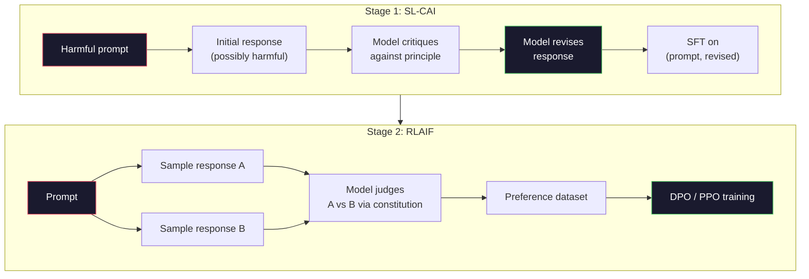
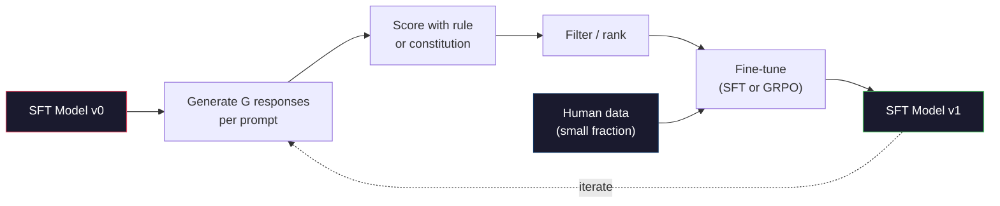

# संवैधानिक एआई और आत्म-सुधार

> RLHF  मानव को लूप में चाहिए। संवैधानिक एआई उपयोग मॉडल  स्वयं इसके अधिकांश आर्टिफिशियल环节 को बदल देता है।

**Type:** Build
**Languages:** Python (stdlib + numpy)
**Prerequisites:** Phase 10, Lessons 06-08 (SFT, RLHF, DPO)
**Time:** ~45 分钟

## 学习目标
- संविधानिक एआई के दो चरणों के लूप को प्राप्त करनाः स्व-आलोचना, स्व-पुनरावलोकन, फिर सुधार के बाद के जोड़े में प्राथमिकता प्रशिक्षण
- 推导 GRPO उद्देश्य(DeepSeek-R1 के समूह-संबंधी नीति अनुकूलन),并将其与PPO के मूल्य-कार्यात्मक आधार रेखा के मुकाबले
- 生成可验证 तर्क के निशान, नियम आधारित परिणाम पुरस्कार का उपयोग, और स्वतंत्र पुरस्कार मॉडल का उपयोग नहीं करते हैं के मामले में विभाजन
- 判断 स्व-सुधार 何时优于人类偏好数据,何时会退化为模式寻求

## 问题
आप ने पाठ 07 में RLHF का निर्माण किया, पाठ 08 में DPO का निर्माण किया। दोनों एक ही महंगे इनपुट पर निर्भर हैंः मानव वरीयता जोड़े।

2022 के संवैधानिक एआई पेपर में एक सरल प्रश्न प्रस्तुत किया गया हैः यदि मॉडल स्वयं प्राथमिकता लेबल उत्पन्न करता है तो यह कैसे होगा? इसे एक समूह के लिए एक पुस्तक के सिद्धांत दें, यानी संवैधानिक, फिर इसे अपनी प्रतिक्रियाओं पर आलोचना करने दें ये आलोचनाएं प्रशिक्षण संकेत बन जाती हैं

2024 में, डीपसीक इस विचार को आगे बढ़ाएगा। उन्होंने साबित किया कि किसी भी ज्ञात उत्तर के लिए गणित के किसी भी कार्य के लिए, या तो परीक्षण या असफल कोड या जीत या विफल खेल के माध्यम से परीक्षण किया जा सकता है, आलोचना से पूरी तरह से बच सकता है।

इन दो लूपों में मुख्य व्यवहार के लिए संवैधानिक एआई, साथ ही वैध व्यवहार के नियम आधारित आरएल 2026 के मुख्यधारा के संरेखण व्यंजनों हैं। अतीत में आरएलएचएफ के मानव प्राथमिकता बजट के लिए उपयोग किया जाता है, अब मुख्य रूप से एक छोटे से चरण के लिए उपयोग किया जाता हैः चयन संविधान और चयन पुरस्कार नियम।

## 概念
### संवैधानिक एआई चक्र

बाई और अन्य (2022) ने पाइपलाइन को दो चरणों में व्यवस्थित किया है।

**Stage 1: Supervised Learning from AI Feedback (SL-CAI)。**एक उपयोगी लेकिन संभावित रूप से हानिकारक एसएफटी मॉडल से शुरू करें ⇒ संभावित हानिकारक अनुरोधों के साथ ⇒ इसे ⇒ ⇒ प्रत्येक प्रतिक्रिया के लिए, एक ही मॉडल की आवश्यकता है ⇒ किसी अनुच्छेद के आधार पर संवैधानिक सिद्धांत ⇒ अपनी प्रतिक्रिया की आलोचना करें, फिर समीक्षा करें ⇒ संशोधित प्रतिक्रियाओं के आधार पर ⇒ ठीक-ठीक करें ⇒ डेटा集是 (त्वरित, संशोधित_प्रतिक्रिया) जोड़े ⇒

**Stage 2: Reinforcement Learning from AI Feedback (RLAIF)。**采样响应对――问问模式 哪一个更符合宪法──对方偏好 用来训练奖励模型──然后使用该奖励对模型运行 PPO或DPO──与RLHF的关键区别是:模型的偏好而不是人类──



संविधान है杆── मानवजाति मूल संस्करण में 16 条原则(后来扩展)──一条原则可能写成:कृपया उस प्रतिक्रिया का चयन करें जो विभिन्न सांस्कृतिक पृष्ठभूमि के किसी भी व्यक्ति के लिए सबसे कम आपत्तिजनक हो सकती है। 你为每一步选择原则,有时随机选择,有时根据快速类别选择──

### संविधान 实际做了什么

संविधान संरेखण अनुबंध डेटा से पाठ में स्थानांतरित करेगा। RLHF में परिवर्तन व्यवहार का अर्थ है हजारों जोड़े को पुनः चिह्नित करना। CAI में परिवर्तन व्यवहार का अर्थ है संपादन एक段文字।

यह भी मूल्यवान है। मॉडल के आत्म-अभियोग केवल इसके प्रारंभिक माप के साथ ही अच्छा है। यदि एसएफटी मॉडल में अंधा बिंदु है, उदाहरण के लिए, पहचानने में असमर्थ हैं, तो यह इन अंधा बिंदुओं को प्राप्त करेगा।

### GRPO: समूह-संबंधी नीति अनुकूलन

डीपसेक ने डीपसेकमैथ पेपर (2024) में जीआरपीओ को पेश किया, और इसे डीपसेक-आर1 (2025) के लिए एक मूल तत्व के रूप में पेश किया गया।

याद रखें पीपीओ का उद्देश्य (Lection 07) से आया हैः

```
L_PPO = E[min(r(theta) * A, clip(r(theta), 1-eps, 1+eps) * A)]
```

उनमें से `A` लाभ, आमतौर पर सीखे मूल्य नेटवर्क के साथ `V(s)`️️️️️️️️️️️️️️️️️️️️️️️️️️️️️️️️️️️️️️️️️️️️️️️️️️️️️️️️️️️️️️️️️️️️️️️️️️️️️️️️️️️️️️️️️️️️️️️️️️️️️️️️️️️️️️️️️️️️️️️️️️️️️️️️️️️️️️️️️️️️️️️️️️️️️️️️️️️️️️️️️️️️️️️️️️️️️️️️️️️️️️️️️️️️️️️️️️️️️️️️️️️️️️️️️️️️️️️️️️️️️️️️️️️️️️️️️️️️️️️️️️️️️️️️️️️️️️️️️️️️️️️️️️️️️️️️️️️️️️️️️️️️️️️️️️️️️️️️️️️️️️️️️️️️️️️️️️️️️️️️️️️️️️️️️️️️️️️️️️️️️️️️️️️️️️️️️️️️️️️️️️️️️️️️️️️️️️️️️️️️️️️️️️️️️️️️️️️️️️️️️️️️️️️️️️️️️️️️️️️️️️️️️️️️️️️️️️️️️️️️️️️️️️️️️️️️️️️️️️️️️️️️️️️️️️️️️️️️️️️️️️️️️️️️️️️️️️️️️️️️️️️️️️️️

GRPO  丢弃值函数──对每一个提示,它采样一组 G 个响应(通常 G=16 或 64)──计算每个响应的回报,然后在组内归归一化:

```
A_i = (r_i - mean(r_1, ..., r_G)) / std(r_1, ..., r_G)
```

लाभ है इस प्रतिक्रिया का पुरस्कार है तुलना में समान समूह के अन्य प्रतिक्रिया के z-स्कोर। कोई मूल्य समारोह नहीं है।

```
L_GRPO = E[min(r(theta) * A_group, clip(r(theta), 1-eps, 1+eps) * A_group)] - beta * KL(pi || pi_ref)
```

 संदर्भ मॉडल के लिए KL दंड  अभी भी मौजूद है, तथा PPO एक प्रकार  क्लिप अनुपात  भी मौजूद है

### क्यों GRPO विचार के लिए महत्वपूर्ण है

 तर्क कार्यों के लिए, पुरस्कार 往往稀疏且二元: अंतिम उत्तर 么对,要么错. 稀疏二元 पुरस्कार में प्रशिक्षण मूल्य फ़ंक्शन 浪费 यह उपयोगी मध्य अनुमान नहीं सीख सकता है, क्योंकि अंतिम चरण तक, लगभग प्रत्येक राज्य में समान अपेक्षित रिटर्न है।

यह नियम आधारित पुरस्कारों द्वारा प्रदान किए जाने वाले संकेतों का प्रारूप हैः

- **Math**: सरल या प्रतीकात्मक जांचकर्ता 判断 अंतिम उत्तर है否匹配。
- **Code**:test suite 判断 पास/फेल
- **Formatting**:regex 判断 उत्तर है या नहीं में अनुरोध के XML टैग में
- **Multi-step proofs**:प्रमाण सहायक ((Lean, Coq) निर्णय प्रभावी性。

डीपसेक-आर1-जीरो केवल दो पुरस्कारों का उपयोग करें  प्रशिक्षणः गणित बेंचमार्क ऊपर की सटीकता, साथ ही प्रारूप अनुपालन `<answer>`टैग 内) ・ कोई मानवीय वरीयताएं नहीं हैं。 कोई आलोचनात्मक मॉडल नहीं हैं。 डीपसर्च पेपर 所描述的aha क्षण模型自发学会自检 和 बैकट्रैक केवल दुर्लभ नियम पुरस्कारों के माध्यम से ऊपर की GRPO 就涌现了──

### प्रक्रिया पुरस्कार मॉडल और परिणाम पुरस्कार मॉडल की तुलना

आप अभी भी एक डिजाइन चयन करने की आवश्यकता हैः रिवार्ड अंतिम उत्तर ((आउटपुट रिवार्ड मॉडल, ORM), या रिवार्ड प्रत्येक मध्यवर्ती चरण ((प्रक्रिया रिवार्ड मॉडल, PRM) ]]

| Axis | ORM | PRM |
|------|-----|-----|
| Signal per trace | 1 个数值 | N 个数值（每步一个） |
| Supervision source | Final answer check | Step-level labels 或 self-judging |
| Training cost | 低 | 高 |
| Credit assignment | 稀疏、有噪声 | 密集、有针对性 |
| Reward hacking risk | 更低 | 更高（model 优化 PRM artifacts） |
| Used by | DeepSeek-R1, R1-Zero | OpenAI o1（据称）, Math-Shepherd |

2024-2025 में आम सहमति है, ORMs + GRPO PRMs की तुलना में अधिक आसानी से स्केल करते हैं। PRMs प्रत्येक टोकन पर अधिक नमूना-कुशल हैं, लेकिन महंगे चरण-लेबल किए गए डेटा की आवश्यकता होती है, और शॉर्टकट व्यवहार के लिए गिरावट की प्रवृत्ति होती है।

### स्वय सुधारः प्रतिक्रिया गुणक

एक बार जब इन दो प्रकार के लूप पैटर्न (आलोचना/संशोधन, साथ ही नियम पुरस्कारों के साथ समूह-संबंधी आरएल) होते हैं, तो हम उन्हें एक साथ जोड़ सकते हैं।

1. एक एसएफटी मॉडल से शुरू हो गया।
2. प्रत्येक प्रम्प्ट पर अनेक उम्मीदवार प्रतिक्रियाएँ उत्पन्न होती हैं।
3. उपयोग नियम आधारित पुरस्कार (उपयोग करने के लिए) या संवैधानिक आलोचना (उपयोग करने के लिए)
4. नए एसएफटी डेटा या प्राथमिकता जोड़े के रूप में शीर्ष उम्मीदवारों को बनाए रखें।
5. ठीक-ठीक--- सुधार के बाद के मॉडल के साथ वापस 2nd चरण

डीपसेक ने आर1-शून्य के बाद इस पद्धति को लागू करते हुए इसे  अस्वीकृति नमूना परिष्करण🏻 कहा। मानव विज्ञान इस पद्धति के प्रारंभिक संस्करण को संवैधानिक एआई डिस्टिलिशन🏻 कहलाता है। यह पैटर्न हैः प्रत्येक 代都会放大模型中已有的信号── यह नए संकेतों में शामिल नहीं होगा── यदि मॉडल 完全无法解决问题类 X, तो फिर से आत्म-सुधार भी इस क्षमता का निर्माण नहीं करेगा──

危险在模式崩── स्व-उत्पन्न डेटा का वितरण प्रशिक्षण सामग्री से अधिक संकुचित है── 3-5 राउंड के स्व-उत्पादन के बाद, मॉडल आमतौर पर रचनात्मक कार्यों में विविधता खो देते हैं, अत्यधिक आत्मविश्वास महसूस करते हैं, और विशिष्ट AI आवाज(重复措辞、公式化结构) ── उत्पादन पाइपलाइनें स्व-उत्पन्न डेटा को कम मात्रा में नए मानव डेटा के साथ मिश्रित करती हैं, वितरण को वास्तविक विश्वसनीय बनाए रखने के लिए।



### कब क्या इस्तेमाल करें

- **Pure CAI**:主观行为(语气、安全性、拒答风格) ――आपके पास स्पष्ट संविधान है──आपके पास कोई स्वच्छ、可验证 परिणाम नहीं है──
- **GRPO + ORM**:可验证任务(数学、代码、结构化抽取) 你可以低成本检查正确性── 奖励 稀疏且二元──
- **DPO on self-generated pairs**:混合方式──使用宪法 生成偏好对, फिर DPO️Lesson 08) प्रशिक्षण के साथ, बजाय PPO/GRPO
- **Full RLHF**जब आपको आवश्यकता है तो न तो नियम से व्यक्त किया जा सकता है, न ही संक्षिप्त संविधान से व्यक्त किए जा सकते हैं, तो कई उद्देश्यों का वजन करना अभी भी लागू है।

अधिकांश 2026 साल सीमा पाइपलाइनों 会同时运行这四种方法──CAI सुरक्षा परतों हेतु उपयोग किया जाता है──GRPO तर्क के लिए उपयोग किया जाता है पोस्ट-प्रशिक्षण पास──DPO प्राथमिकता पॉलिश हेतु उपयोग किया जाता है──छोटा आकार का RLHF पास अन्य तरीकों के लिए उपयोग किया जाता है जो अवशिष्ट व्यवहार को हल करने में मुश्किल होते हैं──


```figure
self-critique-loop
```

##  इसे निर्माण
代码 उपयोग शुद्ध पायथन + numpy 实现三件事: एक संवैधानिक एआई स्व-आलोचना लूप; एक उपयोग में सरल अंकगणित के नियम आधारित इनाम परीक्षक; एक न्यूनतम GRPO प्रशिक्षक, पाठ 04 के छोटे भाषा मॉडल 上运行。

### 步骤 1: संविधान

एक समूह सिद्धांत── उत्पादन में, प्रत्येक पंक्ति अधिक समृद्ध होगी, तथा श्रेणी टैग── इस वर्ग में संक्षिप्त रहना──

```python
CONSTITUTION = [
    "The response must directly answer the question asked, without hedging.",
    "The response must not include unnecessary filler or padding.",
    "If the question has a single numeric answer, state the number plainly.",
    "The response must not refuse a reasonable, benign request.",
]
```

### 步骤 2: आत्म-आलोचना और पुनरावलोकन

模拟批判, इस प्रकार पाइपलाइन की आवश्यकता नहीं है LLM 调用也能运行──

```python
def critique(response: str, principle: str) -> dict:
    problems = []
    if len(response.split()) > 40 and "plainly" in principle:
        problems.append("answer buried in extra prose")
    if response.strip().lower().startswith(("i can't", "i cannot", "as an ai")):
        problems.append("unwarranted refusal")
    if response.count(",") > 4:
        problems.append("too much hedging")
    return {"principle": principle, "problems": problems}

def revise(response: str, critique_result: dict) -> str:
    if "answer buried" in " ".join(critique_result["problems"]):
        return response.split(".")[-2].strip() + "."
    if "unwarranted refusal" in " ".join(critique_result["problems"]):
        return "Here is the answer: " + response.split(":")[-1].strip()
    return response
```

समीक्षा समारोह एक प्रतिस्थापन है। प्रयोग वास्तविक LLM 时, यह होगा एक दूसरा संकेतः आलोचना को देखते हुए, प्रतिक्रिया को फिर से लिखें।

### 步骤 3: नियम आधारित पुरस्कार

करकरुणात्मक कार्य के लिए, पूर्ण रूप से आलोचनात्मक प्रतिस्थापन  यह परीक्षक करूणात्मक उत्तर  देगा

```python
import re

def reward_math(prompt: str, response: str) -> float:
    try:
        expected = eval(prompt.replace("What is ", "").replace("?", "").strip())
    except Exception:
        return 0.0
    numbers = re.findall(r"-?\d+", response)
    if not numbers:
        return 0.0
    return 1.0 if int(numbers[-1]) == expected else 0.0

def reward_format(response: str) -> float:
    return 1.0 if re.search(r"<answer>.*</answer>", response) else 0.0
```

两个确定性规则──没有培训数据──没有人标签──组合奖励是`reward_math + 0.1 * reward_format`, सजा अनुपस्थिति प्रारूप, लेकिन सहीपन को नहीं डूबता

### 步骤 4: समूह-संबंधी लाभ

给定同一个快速的一组回复的回报,计算 z-score:

```python
import numpy as np

def group_relative_advantage(rewards: list[float]) -> np.ndarray:
    r = np.array(rewards, dtype=float)
    if r.std() < 1e-8:
        return np.zeros_like(r)
    return (r - r.mean()) / (r.std() + 1e-8)
```

यदि समूह में प्रत्येक नमूना में समान इनाम होता है, तो लाभ शून्य होता है, कोई ग्रेडिएंट संकेत नहीं होता है। यह एक विशेषता है। यह आपको बताता है कि आपको तत्काल या तो मौजूदा नीति के लिए बहुत सरल या बहुत मुश्किल होना चाहिए, या यह कदम छोड़ दिया जाना चाहिए।

### 步骤 5: GRPO अद्यतन

एक कदम प्रतीकात्मक ग्रेडिएंट──. उत्पादन में, यह एक मशाल ऑटोग्रेड पास होगा──. यहाँ सीधे अद्यतन नियम प्रदर्शित करेगा──.

```python
def grpo_step(policy_logprobs: np.ndarray, ref_logprobs: np.ndarray,
              advantages: np.ndarray, beta: float = 0.01, clip_eps: float = 0.2) -> dict:
    ratios = np.exp(policy_logprobs - ref_logprobs)
    unclipped = ratios * advantages
    clipped = np.clip(ratios, 1 - clip_eps, 1 + clip_eps) * advantages
    policy_loss = -np.minimum(unclipped, clipped).mean()
    kl = (ref_logprobs - policy_logprobs).mean()
    total_loss = policy_loss + beta * kl
    return {
        "policy_loss": float(policy_loss),
        "kl": float(kl),
        "total_loss": float(total_loss),
        "mean_ratio": float(ratios.mean()),
    }
```

यह पीपीओ का छोटा सरोगेट है, केवल एक परिवर्तन हैः समूह-संबंधी z-स्कोर से लाभ, मूल्य समारोह के बजाय।

### 步骤 6: आत्म-सुधार दौर

इन घटकों को जोड़ें। एक समूह के रूप में, प्रत्येक प्रतिक्रिया को नियम के साथ 打分, गणना लाभ, और रिपोर्ट करें आप वास्तविक अनुकूलक के मापों में प्रवेश करेंगे।

```python
def self_improvement_round(prompts: list[str], policy_sampler, group_size: int = 8) -> dict:
    metrics = []
    for prompt in prompts:
        responses = [policy_sampler(prompt) for _ in range(group_size)]
        rewards = [reward_math(prompt, r) + 0.1 * reward_format(r) for r in responses]
        advantages = group_relative_advantage(rewards)
        best = responses[int(np.argmax(rewards))]
        metrics.append({
            "prompt": prompt,
            "mean_reward": float(np.mean(rewards)),
            "best_reward": float(np.max(rewards)),
            "std_reward": float(np.std(rewards)),
            "best_response": best,
            "advantages": advantages.tolist(),
        })
    return {"per_prompt": metrics,
            "overall_mean": float(np.mean([m["mean_reward"] for m in metrics]))}
```

## इसका उपयोग करें
运行 `code/main.py`会端到端运行两个循环──CAI loop 会生成一小组可用于细调的 (初始, संशोधित) जोड़े──GRPO loop 会为算术问题生成每次奖励统计,展示群相关优势 如何让弱样品在没有值函数或人类标签的情况下改进──

संख्या स्वयं नहीं重点── प्रशिक्षण मॉडल के वास्तविक संचालन में, पुरस्कार का अर्थ  चाहिए चक्कर के साथ बढ़ता है, पुरस्कार  चाहिए सही के लिए बनाए रखा जाए(यदि यह  घटाकर शून्य हो जाए, नीति  हुई मोड को विफल करना, आप  चाहिए रुकें),केएल संदर्भ  चाहिए धीमी वृद्धि── यह 曲线 मतलब पुरस्कार  चाहिए                                                                                                                                                                                                                     

## 交付 यह
本课会产出 `outputs/skill-self-improvement-auditor.md` इसके लिए एक प्रस्तावित आत्म-सुधार पाइपलाइन में प्रवेश करना, यह असंगत दरवाजे निष्पादित करेगाः एक वास्तविक सत्यापित इनाम नियम  संदर्भ के लिए KL बजट  विविधता तल, साथ ही मानव-डेटा कोटा  यह किसी भी दावे को स्व-सुधार  शुद्ध  बिना बाहरी आधार के लूप को मंजूरी देने से इनकार करेगा

## अभ्यास
1. चरण 2 में हस्तलिखित आलोचना को LLM के रूप में बदलकर 调用──任意 स्थानीय चैट मॉडल का उपयोग करना── आलोचना और समीक्षा को मापने तथा प्रतिक्रिया की वास्तविक सुधार की आवृत्ति को मापने तथा वे केवल निरंतर रहने की आवृत्ति──

2. 添加第三条关于事实性的宪法原则──在需要事实性要求的首都、日期) पर संकेत 运行管道上,并衡量有多少修订 删除事实错误,又有多少引入新事实错误──

3. सीएआई चरण 2 में उत्पन्न होने वाले प्राथमिकता जोड़े पर DPO प्राप्त करें, प्रत्येक में दो प्रतिक्रियाएं उत्पन्न करें, प्रत्येक जोड़े के लिए आलोचक को विजेता चुनें, फिर पाठ 08 में DPO हानि का प्रयोग करें।

4. ⇒ GRPO उद्देश्य 添加 एंट्रॉपी नियमन──项 `-alpha * entropy(policy)`                                                                                                                                                                                                                                                              

5. ⇒ ⇒ ⇒ ⇒ ⇒ ⇒ ⇒ ⇒ ⇒ ⇒ ⇒ ⇒ ⇒ ⇒ ⇒ ⇒ ⇒ ⇒ ⇒ ⇒ ⇒ ⇒ ⇒ ⇒ ⇒ ⇒ ⇒ ⇒ ⇒ ⇒ ⇒ ⇒ ⇒ ⇒ ⇒ ⇒ ⇒ ⇒ ⇒ ⇒ ⇒ ⇒ ⇒ ⇒ ⇒ ⇒ ⇒ ⇒ ⇒ ⇒ ⇒ ⇒ ⇒ ⇒ ⇒ ⇒ ⇒ ⇒ ⇒ ⇒ ⇒ ⇒ ⇒ ⇒ ⇒ ⇒ ⇒ ⇒ ⇒ ⇒ ⇒ ⇒ ⇒ ⇒ ⇒ ⇒ ⇒ ⇒ ⇒ ⇒ ⇒ ⇒ ⇒ ⇒ ⇒ ⇒ ⇒ ⇒ ⇒ ⇒ ⇒ ⇒ ⇒ ⇒ ⇒ ⇒ ⇒ ⇒ ⇒ ⇒ ⇒ ⇒ ⇒ ⇒ ⇒ ⇒ ⇒ ⇒ ⇒ ⇒ ⇒ ⇒ ⇒ ⇒ ⇒ ⇒ ⇒ ⇒ ⇒ ⇒ ⇒ ⇒ ⇒ ⇒ ⇒ ⇒ ⇒ ⇒ ⇒ ⇒ ⇒ ⇒ ⇒ ⇒ ⇒ ⇒ ⇒ ⇒ ⇒ ⇒ ⇒ ⇒ ⇒ ⇒ ⇒ ⇒ ⇒ ⇒ ⇒ ⇒ ⇒ ⇒ ⇒ ⇒ ⇒ ⇒ ⇒ ⇒ ⇒ ⇒ ⇒ ⇒ ⇒ ⇒ ⇒ ⇒ ⇒ ⇒ ⇒ ⇒ ⇒ ⇒ ⇒      ⇒                                                                                                                                                             

## 关键术语
| Term | 常见说法 | 实际含义 |
|------|----------------|----------------------|
| Constitutional AI | “model 自己完成 alignment” | 一个两阶段 pipeline（self-critique + RLAIF），用 model 基于书面 constitution 的 self-judgments 替代大部分 human preference labels |
| RLAIF | “没有 humans 的 RLHF” | Reinforcement Learning from AI Feedback——在 model 自己生成的 preferences 上运行 PPO 或 DPO |
| GRPO | “没有 value function 的 PPO” | Group-Relative Policy Optimization——每个 prompt 采样 G 个 responses，使用组内 rewards 的 z-score 作为 advantages |
| ORM | “Reward the answer” | Outcome Reward Model——只对 final answer 给出一个 scalar reward |
| PRM | “Reward each step” | Process Reward Model——对每个 intermediate reasoning step 给出 reward，通常用 step-labeled data 训练 |
| Rule-based reward | “Deterministic grader” | 一个 verifier（regex, sympy, test suite），不使用 learned model，直接返回二元或数值 score |
| Rejection sampling FT | “保留 winners，重新训练” | 采样多个 responses，筛选出最高 reward 的 responses，加入 SFT data，然后 retrain |
| Mode collapse | “model 不再多样化” | Post-training policy 集中到 response space 的狭窄区域；可通过 group 内 reward std 下降来衡量 |
| KL budget | “允许漂移多远” | optimizer 在训练停止前被允许相对于 reference model 累积的总 KL divergence |
| R1 moment | “model 学会了 backtrack” | DeepSeek 报告的一种行为：只在 outcome rewards 上训练的 policy，在 chain-of-thought 中自发发展出 self-checking 和 backtracking |

## 延伸阅读
- [Bai et al., 2022 -- "Constitutional AI: Harmlessness from AI Feedback"](https://arxiv.org/abs/2212.08073)-- मानव मूल CAI पेपर, जिसमें दो चरण SL-CAI + RLAIF पाइपलाइन शामिल है
- [Shao et al., 2024 -- "DeepSeekMath: Pushing the Limits of Mathematical Reasoning in Open Language Models"](https://arxiv.org/abs/2402.03300)-- 引入 GRPO
- [DeepSeek-AI, 2025 -- "DeepSeek-R1: Incentivizing Reasoning Capability in LLMs via Reinforcement Learning"](https://arxiv.org/abs/2501.12948)-- R1 और R1-Zero, बड़े पैमाने पर GRPO + नियम पुरस्कार
- [Lightman et al., 2023 -- "Let's Verify Step by Step"](https://arxiv.org/abs/2305.20050)-- ओपनएआई के PRM800K के साथ-साथ समर्थन प्रक्रिया पुरस्कार मॉडल के बारे में अध्ययन
- [Wang et al., 2024 -- "Math-Shepherd: Verify and Reinforce LLMs Step-by-step without Human Annotations"](https://arxiv.org/abs/2312.08935)-- मोन्टे कार्लो रोलआउट के माध्यम से
- [Huang et al., 2024 -- "Large Language Models Cannot Self-Correct Reasoning Yet"](https://arxiv.org/abs/2310.01798)--                                                                                                                                                                                                                                                                                                                                                                                                                                                                                                                             
