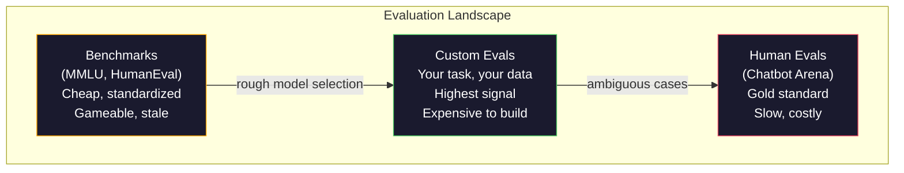
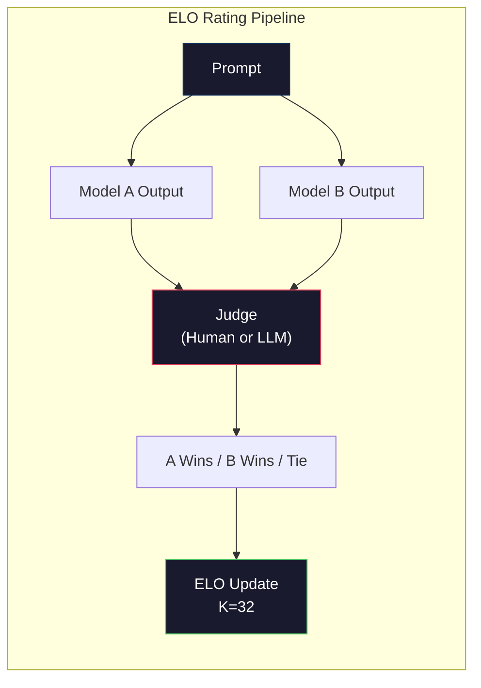

# मूल्यांकनःबेंचमार्क,ईवल,एलएम हर्नस

> गुडहार्ट का नियमः जब एक सूचक लक्ष्य बन जाता है, तो यह एक अच्छा सूचक नहीं होता है। प्रत्येक सीमा प्रयोगशाला बेंचमार्क के लिए काम करती है, अनुकूलन करती है। एमएमएलयू विभाजन संख्या पर है, लेकिन मॉडल अभी भी "स्ट्रॉबेरी" में कुछ R को गिनने में असमर्थ है। एकमात्र महत्वपूर्ण मूल्यांकन आपके मूल्यांकन है, आपके कार्यों के लिए, आपके डेटा का उपयोग करके।

**Type:** Build
**Languages:** Python
**前置要求:**चरण 10,课程 01-05 (LLM स्क्रैच से)
**Time:** ~90 minutes

## 学习目标
- भाषा मॉडल के लिए उपयोग किए जाने वाले एक स्व-परिभाषित मूल्यांकन हर्नर का निर्माण 运行 बहुविकल्पीय तथा खुला-समाप्त बेंचमार्क
- 解释为什么标准基准(MMLU、HumanEval) 会和,并且无法区分边界模型
- प्रयोग合适的指标 实现任务特定评估: सटीक मैच、F1、BLEU 和 LLM-as-judge स्कोरिंग
- 设计面向您特定使用案例的自定义评价套件, न कि केवल सार्वजनिक रैंकिंग बोर्डों पर निर्भर

## 问题
MMLU  ने 2020 में प्रकाशित किया गया, जिसमें 57 个学科 के 15,908 题──三年内, सीमा मॉडल 让它和了──GPT-4 得分 86.4%──Claude 3 Opus 得分 86.8%──Llama 3 405B 得分 88.6%── लीडरबोर्ड को 3 分范围内 तक संकुचित किया गया, जिसमें अंतर केवल सांख्यिकीय शोर है, वास्तविक क्षमता के अंतराल के बजाय──

इस बीच, ये मॉडल 10 साल के बच्चे को पूरा करने के लिए एक कार्य में विफल रहते हैं। क्लाउड 3.5 सोनट ने एमएमएलयू में 88.7% अंक प्राप्त किए, लेकिन शुरुआत में "स्ट्रॉबेरी" में वर्णों की संख्या की गणना नहीं कर सका। इस कार्य को किसी भी विश्व ज्ञान की आवश्यकता नहीं है, तर्क की आवश्यकता नहीं है, केवल चरित्र-स्तर पर पुनरावृत्ति की आवश्यकता है। मानव सामान्य उपयोग 164 प्रश्न परीक्षण कोड पीढ़ी का उपयोग करता है। मॉडल पर 90% से अधिक अंक प्राप्त होते हैं, लेकिन अभी भी सीमाओं की स्थिति पर टूटने वाले कोड उत्पन्न होते हैं, जबकि कोई भी प्राथमिक डेवलपर इन सीमाओं को पा सकता है।

बेंचमार्क प्रदर्शन और वास्तविक दुनिया की विश्वसनीयता के बीच अंतर, LLM मूल्यांकन का मूल मुद्दा है। बेंचमार्क केवल आपको बता सकते हैं कि मॉडल बेंचमार्क पर कैसे प्रदर्शन करता है। वे लगभग आपको यह नहीं बता सकते कि यह मॉडल आपके विशिष्ट कार्यों में कैसे प्रदर्शन करेगा। आपके विशिष्ट डेटा, आपके विशिष्ट विफलता मोड। यदि आप ग्राहक सहायता बॉट का निर्माण कर रहे हैं, तो MMLU पर कोई फर्क नहीं पड़ता।

आपको कस्टम मूल्यांकन की आवश्यकता है। यह इसलिए नहीं है क्योंकि बेंचमार्क उपयोग में नहीं हैं, बल्कि इसलिए है क्योंकि अंतिम मूल्यांकन आपके तैनाती की शर्तों के अनुरूप होना चाहिए।

## 概念
### ईवल परिदृश्य

मूल्यांकन तीन श्रेणियों में विभाजित है, प्रत्येक श्रेणी की लागत और संकेत की गुणवत्ता अलग-अलग हैं।

**Benchmarks**️️️️️️️️️️️️️️️️️️️️️️️️️️️️️️️️️️️️️️️️️️️️️️️️️️️️️️️️️️️️️️️️️️️️️️️️️️️️️️️️️️️️️️️️️️️️️️️️️️️️️️️️️️️️️️️️️️️️️️️️️️️️️️️️️️️️️️️️️️️️️️️️️️️️️️️️️️️️️️️️️️️️️️️️️️️️️️️️️️️️️️️️️️️️️️️️️️️️️️️️️️️️️️️️️️️️️️️️️️️️️️️️️️️️️️️️️️️️️️️️️️️️️️️️️️️️️️️️️️️️️️️️️️️️️️️️️️️️️️️️️️️️️️️️️️️️️️️️️️️️️️️️️️️️️️️️️️️️️️️️️️️️️️️️️️️️️️️️️️️️️️️️️️️️️️️️️️️️️️️️️️️️️️️️️️️️️️️️️️️️️️️️️️️️️️️️️️️️️️️️️️️️️️️️️️️️️️️️️️️️️️️️️️️️️️️️️️️️️️️️️️️️️️️️️️️️️️️️️️️️️️️️️️️️️️️️️️️️️️️️️️️️️️️️️️️️️️️️️️️️️️️️️️️️

**Custom evals**您定义输入、预期输出和得分功能──法律文档总结器 法律文档上进行评估──SQL जनरेटर 您的数据库方案上进行评估──这些评估 创建成本高,但它们是唯一能够预测生产性能的评估──

**Human evals**उपयोग भुगतान नोटर्स, उपयोगिता, सटीकता, तरलता और सुरक्षा के आधार पर अन्य मानक मूल्यांकन मॉडल आउटपुट। स्वचालित स्कोरिंग के लिए अपर्याप्त खुला अंत कार्यों के लिए, यह स्वर्ण मानक है।$0.10-$2.00) और गति ((数小时到数天) 



### बेंचमार्क क्यों टूटते हैं

तीन प्रकार के तंत्र से बेंचमार्क विभाजन वास्तविक क्षमता को प्रतिबिंबित नहीं करता है।

**Data contamination。** प्रशिक्षण भाषा सामग्री इंटरनेट को पकड़ लेगी।  बेंचमार्क  समस्याएं भी इंटरनेट पर हैं।  मॉडल प्रशिक्षण के दौरान उत्तर देखा।  यह पारंपरिक अर्थ में धोखा नहीं है, प्रयोगशालाओं में बेंचमार्क डेटा शामिल नहीं है।  लेकिन वेब-स्केल स्क्रैपिंग से उन्हें बाहर करना लगभग असंभव है।

**Teaching to the test。**प्रयोगशालाएं प्रदर्शन के लिए बेंचमार्क करती हैं  अनुकूलन प्रशिक्षण मिश्रित डेटा। यदि प्रशिक्षण मिश्रित डेटा का 5% MMLU शैली बहुविकल्पीय विकल्प है, तो मॉडल इस प्रकार के प्रारूप और उत्तर वितरण में शामिल है।

**Saturation。**जब प्रत्येक सीमा मॉडल एक बेंचमार्क में 85-90% तक पहुंच सकता है, तो यह बेंचमार्क तब भेदभाव क्षमता को रोक देता है। शेष 10-15% के प्रश्न अस्पष्ट हो सकते हैं, या ठंडे डोमेन ज्ञान की आवश्यकता हो सकती है। एमएमएलयू 87% से बढ़कर 89% हो सकता है, इसका मतलब है कि मॉडल दो ठंडे विषयों को फिर से याद करता है, बजाय स्मार्ट हो जाता है।

### उलझन: 快速健康检查

भ्रम  माप मॉडल एक स्ट्रिंग टोकन के लिए है There are many unexpected. स्वरूप में, यह औसत नकारात्मक लॉग-संभाव्यता का सूचकांक हैः

```
PPL = exp(-1/N * sum(log P(token_i | context)))
```

भ्रम 10 दिखाता है मॉडल औसत अर्थ में, जैसे प्रत्येक टोकन में स्थिति 10 个选项中均选择一样不确定──越低越好──GPT-2 在 WikiText-103 上的困惑 约为 30──GPT-3 约为 20──Llama 3 8B 约为 7──

भ्रम  एक ही परीक्षण सेट में ऊपर तुलना मॉडल के लिए उपयोगी है, लेकिन यह अंधा बिंदु है। मॉडल सामान्य मॉडल की भविष्यवाणी करने में कुशल होकर कम भ्रम प्राप्त कर सकता है, जबकि दुर्लभ लेकिन महत्वपूर्ण मॉडल में बहुत अच्छा नहीं है। यह निर्देशों के बाद तर्क या तथ्यात्मक सटीकता को भी नहीं बता सकता है। इसे मानसिकता जांच के रूप में समझें, न कि अंतिम निष्कर्षों के रूप में।

### न्यायिक पद

प्रयोग强模型来评估 弱模型的输出――想法很简单:让GPT-4o 或Claude Sonnet 根据 1-5 分评价反应的正确性、有用性和安全──使用GPT-4o-mini 时,每次判断的成本约为0.01美元,并且与人类判断的相关性出乎意料地高,大多数任务约80%一致──

स्कोरिंग प्रॉम्प्ट स्वयं मॉडल से अधिक महत्वपूर्ण है। "एसे प्रतिक्रिया की दर") ध्वनि की संख्या उत्पन्न करेगी। "यदि उत्तर तथ्य सही है तो 5%, यदि सही है तो 4%, यदि सही है तो 3"...

विफलता मोडःआध्याय मॉडल करेंगे स्थिति पूर्वाग्रह प्रदर्शित करें (पैरवियर तुलनाओं में) (वर्बोसिटी पूर्वाग्रह) (पैरवियर) (पेरवियर) (पेरवियर) (पेरवियर) (पेरवियर) (पेरवियर) (पेरवियर) (पेरवियर) (पेरवियर) (पेरवियर) (पेरवियर) (पेरवियर) (पेरवियर) (पेरवियर) (पेरवियर) (पेरवियर) (पेरवियर) (पेरवियर) (पेरवियर) (पेरवियर) (पेरवियर) (पेरवियर) (पेरवियर) (पेरवियर) (पेरवियर) (पेरवियर) (पेरवियर) (पेरवियर) (पेरवियर) (पेरवियर) (पेरवियर) (पेरवियर) (पेरवियर) (पेरवियर) (पेरवियर) (पेरवियर) (पेरवियर) (पेरवियर) (पेरवियर) (पेरवियर) (पेरवियर) (पेरवियर) (पेरवियर) (पेरवियर) (पेरवियर) (पेरवियर) (पेरवियर) (वियर) (वियर) (वियर) (वियर) (वियर) (वियर) (वियर) (वियर) (वियर) (वियर) (वियर) (वियर) (वियर) (वियर) (वियर) (वियर) (वियर) (वियर) (वियर) (व) (व) (व) (व) (व) (व) (व)) (व) (व) (व) (व) (व) (व) (व) (व)) (व) (व) (व)) (व) (व) (व) (व) (व) (व)) (व) (व) (व) (व) (व) (व) (व) (व)) (व) (व) (व) (व) (व) (व) (

### आधारित तुलनात्मक ELO रेटिंग

यह चैटबॉट एरेना का तरीका है। एक ही संकेत पर दो प्रतिक्रियाओं को प्रदर्शित करें। विभिन्न मॉडल से। मनुष्य (या एमएलएम) न्यायाधीश) बेहतर एक चुनें। हजारों बार इस तरह की तुलनाओं के माध्यम से, प्रत्येक मॉडल के लिए एएलओ रेटिंग की गणना की जाती है।

ELO के फायदेः रिलेटिव रैंकिंग निरपेक्ष स्कोरिंग से अधिक विश्वसनीय, ऊर्जा के साथ संबंध संभालती है, और प्रत्येक आउटपुट को अलग से अलग करने के लिए अधिक तुलना की आवश्यकता होती है।



### समरूप ढांचे

**lm-evaluation-harness**(EleutherAI): मानक का ओपन-सोर्स मूल्यांकन ढांचा── 200+ बेंचमार्क का समर्थन── एक आदेश के साथ किसी भी प्रकार का Hugging Face 模型 रन MMLU、HellaSwag、ARC इत्यादि──Open LLM Leaderboard इसे प्रयोग करें──

**RAGAS**: विशेष रूप से आरएजी पाइपलाइनों के मूल्यांकन ढांचे के लिए उपयोग किया जाता है――निष्ठा को मापने के लिए

**promptfoo**: शीघ्र इंजीनियरिंग के लिए कॉन्फ़िग-ड्राइव मूल्यांकन, YAML में परिभाषित परीक्षण मामलों, एकाधिक मॉडल संचालन के लिए, पास / विफलता रिपोर्ट प्राप्त करना, प्रम्प्ट्स के प्रतिगमन परीक्षण के लिए उपयुक्त होना, सुनिश्चित करें कि शीघ्र परिवर्तन पहले से मौजूद परीक्षण मामलों को नष्ट नहीं करेगा।

### कस्टम ईवल बनाना

यह उत्पादन के लिए एकमात्र महत्वपूर्ण मूल्यांकन है।

1. **Define the task。**模型到底应该做什么?要精确──"उत्तर प्रश्न" 太模糊──"ग्राहक शिकायत ईमेल को देखते हुए, उत्पाद नाम, समस्या श्रेणी और भावना निकालें" 才是一个可以评估的任务──

2. **Create test cases。**प्रोटोटाइप मूल्यांकन कम से कम 50 个, उत्पादन कम से कम 200 个── प्रत्येक परीक्षण मामले एक है (इनपुट, अपेक्षित_आउटपुट) 对──包含边缘案例:空输入、adversarial inputs、ambiguous inputs、其他语言的 inputs──

3. **Define scoring。**संरचित आउटपुट उपयोग सटीक मैच──文本相似度 उपयोग BLEU/ROUGE── खुला-अंत गुणवत्ता उपयोग LLM-as-judge── निष्कर्षण कार्य उपयोग F1──用权重组合多个度度──

4. **Automate。**प्रत्येक मूल्यांकन एक आदेश के साथ चलाया जा सकता है। कोई हाथ से कदम नहीं है। समय के साथ तुलनात्मक प्रारूप भंडारण परिणामों का समर्थन करने के लिए।

5. **Track over time。**单独一个评分分 没有意义――你需要趋势线――上一次快速变化 后分数是否升升?切换模型后是否回归?把评与提示 一起版本――

| Eval Type | 每次 judgment 成本 | 与人类的一致性 | 最适合 |
|-----------|------------------|----------------------|----------|
| Exact match | ~$0 | 100%（适用时） | Structured output、classification |
| BLEU/ROUGE | ~$0 | ~60% | Translation、summarization |
| LLM-as-judge | ~$0.01 | ~80% | Open-ended generation |
| Human eval | $0.10-$2.00 | N/A（即 ground truth） | Ambiguous、high-stakes tasks |


```figure
perplexity-loss
```

##  इसे निर्माण
### 步骤 1: न्यूनतम Eval 框架

定义核心抽象── एक मूल्यांकन मामला है इनपुट, अपेक्षित आउटपुट 和可选的 मेटाडेटा dict── एक स्कोरर 接收预测 和参考,并返回 0 到 1 之间的分数──

```python
import json
from collections import Counter

class EvalCase:
    def __init__(self, input_text, expected, metadata=None):
        self.input_text = input_text
        self.expected = expected
        self.metadata = metadata or {}

class EvalSuite:
    def __init__(self, name, cases, scorers):
        self.name = name
        self.cases = cases
        self.scorers = scorers

    def run(self, model_fn):
        results = []
        for case in self.cases:
            prediction = model_fn(case.input_text)
            scores = {}
            for scorer_name, scorer_fn in self.scorers.items():
                scores[scorer_name] = scorer_fn(prediction, case.expected)
            results.append({
                "input": case.input_text,
                "expected": case.expected,
                "prediction": prediction,
                "scores": scores,
            })
        return results
```

### 步骤 2: स्कोरिंग फ़ंक्शन

                                                                                                                                                                                                                                                              

```python
def exact_match(prediction, expected):
    return 1.0 if prediction.strip().lower() == expected.strip().lower() else 0.0

def token_f1(prediction, expected):
    pred_tokens = set(prediction.lower().split())
    exp_tokens = set(expected.lower().split())
    if not pred_tokens or not exp_tokens:
        return 0.0
    common = pred_tokens & exp_tokens
    precision = len(common) / len(pred_tokens)
    recall = len(common) / len(exp_tokens)
    if precision + recall == 0:
        return 0.0
    return 2 * (precision * recall) / (precision + recall)

def llm_judge_simulated(prediction, expected):
    pred_words = set(prediction.lower().split())
    exp_words = set(expected.lower().split())
    if not exp_words:
        return 0.0
    overlap = len(pred_words & exp_words) / len(exp_words)
    length_penalty = min(1.0, len(prediction) / max(len(expected), 1))
    return round(overlap * 0.7 + length_penalty * 0.3, 3)
```

### 步骤 3: ELO रेटिंग सिस्टम

ELO अद्यतनों का उपयोग करें जोड़ी-सापेक्ष तुलना को प्राप्त करें।

```python
class ELOTracker:
    def __init__(self, k=32, initial_rating=1500):
        self.ratings = {}
        self.k = k
        self.initial_rating = initial_rating
        self.history = []

    def _ensure_player(self, name):
        if name not in self.ratings:
            self.ratings[name] = self.initial_rating

    def expected_score(self, rating_a, rating_b):
        return 1 / (1 + 10 ** ((rating_b - rating_a) / 400))

    def record_match(self, player_a, player_b, outcome):
        self._ensure_player(player_a)
        self._ensure_player(player_b)

        ea = self.expected_score(self.ratings[player_a], self.ratings[player_b])
        eb = 1 - ea

        if outcome == "a":
            sa, sb = 1.0, 0.0
        elif outcome == "b":
            sa, sb = 0.0, 1.0
        else:
            sa, sb = 0.5, 0.5

        self.ratings[player_a] += self.k * (sa - ea)
        self.ratings[player_b] += self.k * (sb - eb)

        self.history.append({
            "a": player_a, "b": player_b,
            "outcome": outcome,
            "rating_a": round(self.ratings[player_a], 1),
            "rating_b": round(self.ratings[player_b], 1),
        })

    def leaderboard(self):
        return sorted(self.ratings.items(), key=lambda x: -x[1])
```

### 步骤 4: उलझन गणना

प्रयोग टोकन संभावनाएँ  गणना जटिलता── अभ्यास में, आप मॉडल लॉजिट में से इन मानों को प्राप्त करेंगे── यहाँ हम संभावना वितरण模拟── का उपयोग करते हैं।

```python
import numpy as np

def perplexity(log_probs):
    if not log_probs:
        return float("inf")
    avg_neg_log_prob = -np.mean(log_probs)
    return float(np.exp(avg_neg_log_prob))

def token_log_probs_simulated(text, model_quality=0.8):
    np.random.seed(hash(text) % 2**31)
    tokens = text.split()
    log_probs = []
    for i, token in enumerate(tokens):
        base_prob = model_quality
        if len(token) > 8:
            base_prob *= 0.6
        if i == 0:
            base_prob *= 0.7
        prob = np.clip(base_prob + np.random.normal(0, 0.1), 0.01, 0.99)
        log_probs.append(float(np.log(prob)))
    return log_probs
```

### 步骤 5: समग्र परिणाम

计算一次 eval run के संक्षिप्त आंकड़ेः औसत, औसत, सीमा, निम्न पास दर, तथा मीट्रिक के अनुसार टूटना

```python
def summarize_results(results, threshold=0.8):
    all_scores = {}
    for r in results:
        for metric, score in r["scores"].items():
            all_scores.setdefault(metric, []).append(score)

    summary = {}
    for metric, scores in all_scores.items():
        arr = np.array(scores)
        summary[metric] = {
            "mean": round(float(np.mean(arr)), 3),
            "median": round(float(np.median(arr)), 3),
            "std": round(float(np.std(arr)), 3),
            "min": round(float(np.min(arr)), 3),
            "max": round(float(np.max(arr)), 3),
            "pass_rate": round(float(np.mean(arr >= threshold)), 3),
            "n": len(scores),
        }
    return summary

def print_summary(summary, suite_name="Eval"):
    print(f"\n{'=' * 60}")
    print(f"  {suite_name} Summary")
    print(f"{'=' * 60}")
    for metric, stats in summary.items():
        print(f"\n  {metric}:")
        print(f"    Mean:      {stats['mean']:.3f}")
        print(f"    Median:    {stats['median']:.3f}")
        print(f"    Std:       {stats['std']:.3f}")
        print(f"    Range:     [{stats['min']:.3f}, {stats['max']:.3f}]")
        print(f"    Pass rate: {stats['pass_rate']:.1%} (threshold >= 0.8)")
        print(f"    N:         {stats['n']}")
```

### 步骤 6: पूर्ण पाइपलाइन चलाएं

सभी सामग्री को जोड़ें ⋅ एक कार्य को परिभाषित करें, परीक्षण मामले बनाएं, दो मॉडल को अनुकरण करें, मूल्यांकन करें, जोड़ी-जोड़ी तुलना से ⋅ गणना करें, ⋅ रैंक बोर्ड प्रिंट करें

```python
def demo_model_good(prompt):
    responses = {
        "What is the capital of France?": "Paris",
        "What is 2 + 2?": "4",
        "Who wrote Hamlet?": "William Shakespeare",
        "What language is PyTorch written in?": "Python and C++",
        "What is the boiling point of water?": "100 degrees Celsius",
    }
    return responses.get(prompt, "I don't know")

def demo_model_bad(prompt):
    responses = {
        "What is the capital of France?": "Paris is the capital city of France",
        "What is 2 + 2?": "The answer is four",
        "Who wrote Hamlet?": "Shakespeare",
        "What language is PyTorch written in?": "Python",
        "What is the boiling point of water?": "212 Fahrenheit",
    }
    return responses.get(prompt, "Unknown")

cases = [
    EvalCase("What is the capital of France?", "Paris"),
    EvalCase("What is 2 + 2?", "4"),
    EvalCase("Who wrote Hamlet?", "William Shakespeare"),
    EvalCase("What language is PyTorch written in?", "Python and C++"),
    EvalCase("What is the boiling point of water?", "100 degrees Celsius"),
]

suite = EvalSuite(
    name="General Knowledge",
    cases=cases,
    scorers={
        "exact_match": exact_match,
        "token_f1": token_f1,
        "llm_judge": llm_judge_simulated,
    },
)

results_good = suite.run(demo_model_good)
results_bad = suite.run(demo_model_bad)

print_summary(summarize_results(results_good), "Model A (concise)")
print_summary(summarize_results(results_bad), "Model B (verbose)")
```

"अच्छा" मॉडल सटीक उत्तर देता है। "बुरा" मॉडल लापरवाह परिच्छेदन देता है। सटीक मैच गंभीर सजा देगा।

### 步骤 7: ELO टूर्नामेंट

मध्य运行模型 के बीच कई दौर में जोड़ीबद्ध तुलनाएँ

```python
elo = ELOTracker(k=32)

for case in cases:
    pred_a = demo_model_good(case.input_text)
    pred_b = demo_model_bad(case.input_text)

    score_a = token_f1(pred_a, case.expected)
    score_b = token_f1(pred_b, case.expected)

    if score_a > score_b:
        outcome = "a"
    elif score_b > score_a:
        outcome = "b"
    else:
        outcome = "tie"

    elo.record_match("model_a_concise", "model_b_verbose", outcome)

print("\nELO Leaderboard:")
for name, rating in elo.leaderboard():
    print(f"  {name}: {rating:.0f}")
```

### 步骤 8: भ्रम तुलना

विभिन्न गुणवत्ता स्तरों के मॉडल की तुलना में जटिलता

```python
test_text = "The quick brown fox jumps over the lazy dog in the garden"

for quality, label in [(0.9, "Strong model"), (0.7, "Medium model"), (0.4, "Weak model")]:
    log_probs = token_log_probs_simulated(test_text, model_quality=quality)
    ppl = perplexity(log_probs)
    print(f"  {label} (quality={quality}): perplexity = {ppl:.2f}")
```

## इसका उपयोग करें
### i-मूल्यांकन-हार्नेस (EleutherAI)

किसी भी मॉडल पर बेंचमार्क चलाने का मानक उपकरण

```python
# pip install lm-eval
# Command line:
# lm_eval --model hf --model_args pretrained=meta-llama/Llama-3.1-8B --tasks mmlu --batch_size 8

# Python API:
# import lm_eval
# results = lm_eval.simple_evaluate(
#     model="hf",
#     model_args="pretrained=meta-llama/Llama-3.1-8B",
#     tasks=["mmlu", "hellaswag", "arc_easy"],
#     batch_size=8,
# )
# print(results["results"])
```

### शीघ्रfoo

प्रम्प्ट इंजीनियरिंग के कॉन्फ़िग-ड्राइव मूल्यांकन हेतु प्रयोग किया गया है।

```yaml
# promptfoo.yaml
providers:
  - openai:gpt-4o-mini
  - anthropic:claude-3-haiku

prompts:
  - "Answer in one word: {{question}}"

tests:
  - vars:
      question: "What is the capital of France?"
    assert:
      - type: contains
        value: "Paris"
  - vars:
      question: "What is 2 + 2?"
    assert:
      - type: equals
        value: "4"
```

### आरएजी मूल्यांकन के लिए आरएजीएएस

```python
# pip install ragas
# from ragas import evaluate
# from ragas.metrics import faithfulness, answer_relevancy, context_precision
#
# result = evaluate(
#     dataset,
#     metrics=[faithfulness, answer_relevancy, context_precision],
# )
# print(result)
```

RAGAS 衡量通用 evals 会遗漏的内容: मॉडल उत्तर क्या प्राप्त संदर्भ पर आधारित है, न कि केवल अमूर्त अर्थ में 正确──

## 交付 यह
本课会产出 `outputs/prompt-eval-designer.md`, यह एक दोहराया जा सकता है प्रॉम्प्ट, किसी भी कार्य के लिए अनुकूलन मूल्यांकन सूट डिजाइन करने के लिए उपयोग किया जाता है. इसे एक कार्य विवरण दें, यह परीक्षण मामलों उत्पन्न करेगा.

यह फिर से उत्पन्न होगा `outputs/skill-llm-evaluation.md`, यह एक निर्णय ढांचा है, जो आपके कार्य प्रकार के आधार पर उपयोग किया जाता है, बजट और विलंबता आवश्यकताएँ  उपयुक्त मूल्यांकन रणनीति चुनें 

## अभ्यास
1. ⇒ एक "समानता" स्कोरर जोड़ेंः एक ही इनपुट के साथ  मॉडल को 5 बार चलाने दें, और आउटपुट को मापें                                                                                                                                                                                                                                             

2.  विस्तारित ELO ट्रैकर, इसे कई न्यायाधीश कार्यों का समर्थन करने के लिए सक्षम बनाता है (उदाहरण के लिए, सटीक मैच, F1 LLM-as-judge) और उन्हें अधिक अधिकार देता है।

3. एक विशिष्ट कार्य के लिए मूल्यांकन सूट का निर्माण करेंः ईमेल वर्गीकरण को 5 श्रेणियों तक पहुंचाएं। 100 परीक्षण मामले बनाएं, जिसमें कई प्रकार के उदाहरण और किनारे मामले शामिल हैं।

4.  प्रदूषण का पता लगाने का कामः एक प्रशिक्षण पाठ्यक्रम के साथ एक मूल्यांकन प्रश्नों का एक समूह, परीक्षण के लिए मूल्यांकन प्रश्नों का एक अनुपात है (या निकटतम परिच्छेदन) प्रशिक्षण डेटा में दिखाई देते हैं।

5.  एक "मॉडल डिफर" टूल का निर्माण करना दो मॉडल संस्करणों के मूल्यांकन परिणामों को निर्धारित करना, उच्च रोशनी के साथ कौन से विशिष्ट परीक्षण मामले  उन्नत हुए, कौन से वापस आए, कौन से नहीं बदले गए यह मूल्यांकन संस्करण का कोड अंतर है, एक परिवर्तन को समझने के लिए महत्वपूर्ण है कि क्या मददगार है या नुकसानदायक है

## 关键术语
| Term | 人们的说法 | 它实际上的含义 |
|------|----------------|----------------------|
| MMLU | "The benchmark" | Massive Multitask Language Understanding，包含 57 个学科的 15,908 道 multiple choice questions，到 2025 年已在 88% 以上饱和 |
| HumanEval | "Code eval" | OpenAI 的 164 个 Python function-completion problems，只测试 isolated function generation |
| SWE-bench | "Real coding eval" | 来自 12 个 Python repos 的 2,294 个 GitHub issues，衡量包括 test generation 在内的 end-to-end bug fixing |
| Perplexity | "How confused the model is" | exp(-avg(log P(token_i given context)))，越低表示模型给实际 tokens 分配的概率越高 |
| ELO rating | "Chess ranking for models" | 根据 pairwise win/loss records 计算的 relative skill rating，Chatbot Arena 用它对 100+ models 排名 |
| LLM-as-judge | "Using AI to grade AI" | 强模型按照 rubric 评价弱模型 outputs，与人类 judges 约 80% agreement，成本约 $0.01/judgment |
| Data contamination | "The model saw the test" | Training data 包含 benchmark questions，在不提升真实 capability 的情况下抬高分数 |
| Eval suite | "A bunch of tests" | 一个 versioned collection，由 (input, expected_output, scorer) triples 组成，用于衡量特定 capability |
| Pass rate | "What percentage it gets right" | Eval cases 中得分超过阈值的比例，比 mean score 更可操作，因为它衡量 reliability |
| Chatbot Arena | "Model ranking website" | LMSYS 平台，拥有 2M+ human preference votes，并通过 ELO ratings 生成最可信的 LLM leaderboard |

## 延伸阅读
- [Hendrycks et al., 2021 -- "Measuring Massive Multitask Language Understanding"](https://arxiv.org/abs/2009.03300)-- एमएमएलयू पेपर, हालांकि पहले से ही उपलब्ध है, अभी भी सबसे अधिक उल्लिखित एलएलएम बेंचमार्क है
- [Chen et al., 2021 -- "Evaluating Large Language Models Trained on Code"](https://arxiv.org/abs/2107.03374)-- OpenAI का HumanEval पेपर, कोड जनरेशन मूल्यांकन पद्धति स्थापित करता है
- [Zheng et al., 2023 -- "Judging LLM-as-a-Judge"](https://arxiv.org/abs/2306.05685)-- एलएलएम का उपयोग मूल्यांकन एलएलएम का प्रणालीगत विश्लेषण, जिसमें स्थिति पूर्वाग्रह एवं शब्दार्थ पूर्वाग्रह शामिल है
- [LMSYS Chatbot Arena](https://chat.lmsys.org/)-- भीड़-भाड़ वाली मॉडल तुलना मंच, 2M+ वोटों के साथ, है सबसे विश्वसनीय वास्तविक दुनिया LLM रैंकिंग
