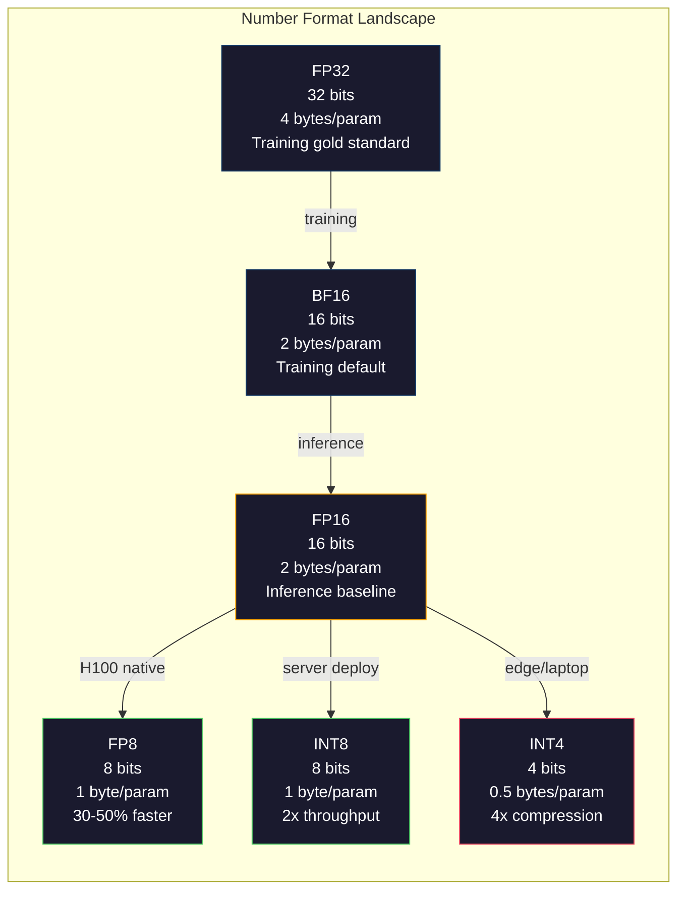
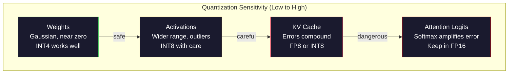
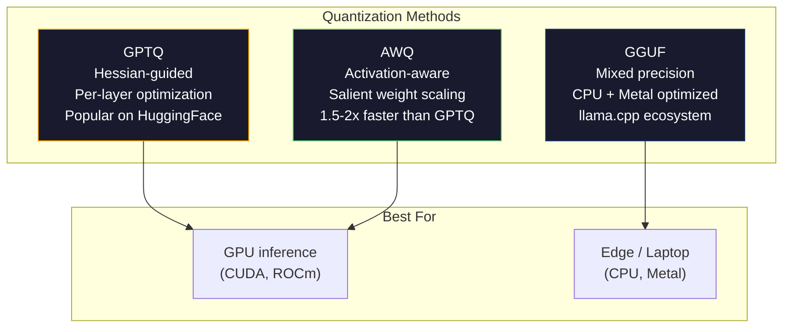

# मात्रा: 让模型装得下

> एक 70B  मॉडल FP16 需要140GB──光是权重就需要两张A100──量化到 FP8:一张80GB GPU──INT4:一台MacBook──

**Type:** Build
**Languages:** Python (with numpy)
**前置要求:**चरण 10,课程 01-10 (LLMs from Scratch)
**Time:** ~120 minutes

## 学习目标
-  FP16 से INT8 और INT4 के सममित और असमित मात्रा को प्राप्त करना, जिसमें प्रति-टेंसर और प्रति-चैनल स्केलिंग शामिल है
- 计算量化 带来的内存节省,并判断哪种精确性 能装进给定的 GPU 的VRAM
- 解释 पोस्ट-ट्रेनिंग क्वांटिज़ेशन (PTQ) और क्वांटिज़ेशन-जागरूक प्रशिक्षण (QAT) के बीच अंतर
- GPTQ या AWQ का उपयोग करें एक वास्तविक मॉडल को मात्राबद्ध करें, और बेंचमार्क करें

## 问题
Llama 3 70B में 700 अरब पैरामीटर हैं। प्रत्येक पैरामीटर एक 16-बिट फ्लोटिंग प्वाइंट नंबर है। यह 1400 अरब बाइट्स है। 140GB। एक A100 में 80GB VRAM है। आप एक ही GPU पर भार भार नहीं उठा सकते हैं।

लेकिन प्रत्येक पैरामीटर का उपयोग 16 बिट्स के साथ किया जाता है  बहुत बर्बाद हो गया है ∙∙ न्यूरल नेटवर्क में भारी बहुमत का वजन शून्य के पास जमा हो जाता है ∙ FP16 की पूरी गतिशील सीमा ∙ ∙ ∙ 0.000000059 से लेकर 65,504 तक लगभग पूरी तरह से उपयोग नहीं की जाती है ∙ यदि आप Llama 3 70B के बीच वजन का वास्तविक वितरण मापते हैं, तो 95% ∙ ∙ 0.1 से + 0.1 ∙ ∙ ∙ ∙ ∙ ∙ ∙ ∙ ∙ ∙ ∙ ∙ ∙ ∙ ∙ ∙ ∙ ∙ ∙ ∙ ∙ ∙ ∙ ∙ ∙ ∙ ∙ ∙ ∙ ∙ ∙ ∙ ∙ ∙ ∙ ∙ ∙ ∙ ∙ ∙ ∙ ∙ ∙ ∙ ∙ ∙ ∙ ∙ ∙ ∙ ∙ ∙ ∙ ∙ ∙ ∙ ∙ ∙ ∙ ∙ ∙ ∙ ∙ ∙ ∙ ∙ ∙ ∙ ∙ ∙ ∙ ∙ ∙ ∙ ∙ ∙ ∙ ∙ ∙ ∙ ∙ ∙ ∙ ∙ ∙ ∙    ∙ ∙                                                                                                                                                                                                                                 

क्वांटिज़ेशन कम परिशुद्धता वाले नंबरों के साथ उच्च परिशुद्धता वाले नंबरों को बदल देता है। FP16 से FP8 तक काटा जाएगा। FP16 से INT4 तक काटा जाएगा। यह 140GB का मॉडल 35GB में बदल जाएगा। यह एकल चार्ज खपत स्तर के GPU में लगाया जा सकता है। आगे बढ़कर 2-बिट क्वांटिज़ेशन तक पहुंच सकता है।

代价是精度──你移除的每一点都会破坏信息──问题是你会损失多少精度,以及损失在哪里──一个量化得到好的INT4模型,在大多数基准上能保留原始模型的质量95-99%.一次天真的量化到INT4可能会彻底毁掉模型──差异在技术中──

社区对Llama 3做INT4 GPTQ क्वांटिज़ेशन के परिणाम बताते हैं, विकिटेक्स पर लगभग 1-2  गजबता बिंदुओं का नुकसान हुआ है।

## 概念
### संख्या प्रारूप: प्रत्येक बिट क्या करना

प्रत्येक फ्लोटिंग-पॉइंट संख्या में तीन भाग होते हैंः संकेत, exponent, 和 mantissa (अर्थ भी कहा जाता है) ।

```
FP32:  [1 sign] [8 exponent] [23 mantissa]  = 32 bits
FP16:  [1 sign] [5 exponent] [10 mantissa]  = 16 bits
BF16:  [1 sign] [8 exponent] [7  mantissa]  = 16 bits
FP8:   [1 sign] [4 exponent] [3  mantissa]  = 8  bits (E4M3)
FP8:   [1 sign] [5 exponent] [2  mantissa]  = 8  bits (E5M2)
INT8:  [1 sign] [7 value]                   = 8  bits (uniform steps)
INT4:  [1 sign] [3 value]                   = 4  bits (16 levels total)
```

**FP32**                                                                                                                                                                                                                                                              

**FP16**बिट्स को आधा करके रखना ∼10 个 mantissa बिट्स ∼3.3 位进制精度提供──exponent 缩小到5 bits,范围大幅缩小(最大值约65,504) ∼ यह भारहीनता के लिए एक समस्या है 权重聚集在零附近), लेकिन प्रशिक्षण के दौरान  अचानक बढ़ते सक्रियण और उतार-चढ़ाव 非常危险──FP16 प्रशिक्षण  नुकसान के पैमाने को रोकने के लिए 

**BF16**(Brain Float 16) FP32 का 8-बिट एक्सपोनेंट बनाए रखें, लेकिन इसे 7 बिट तक छोटा करें। FP16 से अधिक सटीकता FP16 से कम है। Google ने इसे डीप लर्निंग के लिए डिज़ाइन किया है।

**FP8**E4M3 (E4M3 (E4M3) 3 मानस) का उपयोग अनुमान लगाने के लिए किया जाता है  दौरान वजन और सक्रियणों  E5M2 (E5M2) 5 मानस,2 मानस) का उपयोग प्रशिक्षण के दौरान ग्रेडिएंट्स, इस समय सटीकता से अधिक महत्वपूर्ण है  H100 GPUs पर, FP8 अनुमान FP16 की तुलना में 30-50% तेजी प्राप्त कर सकता है, और गुणवत्ता हानि अनदेखी की जा सकती है 

**INT8**                                                                                                                                                                                                                                                              

**INT4**इसके अलावा, केवल 16 संभावित मूल्य हैं। पैमाने का कारक बहुत काम किया है। गुणवत्ता पूरी तरह से इस बात पर निर्भर करती है कि आप पैमाने का चयन कैसे करते हैं, साथ ही साथ क्वांटिज़ करें कि कौन से वजन हैं।



### क्वांटिज़ेशन 如何工作

核心操作很简单── एक तन्सर ले लो, एक पैमाने कारक खोजें, गुणा करके, सबसे निकटतम पूर्णांक तक घुमाएं, फिर पूर्णांक को स्केल कारक से जोड़कर संग्रहीत करें──

**Quantize:**
```
scale = max(abs(tensor)) / max_int_value
quantized = round(tensor / scale)
```

**Dequantize:**
```
reconstructed = quantized * scale
```

 सममित सीमा के लिए ((-127 से 127) के INT8:
```
scale = max(abs(tensor)) / 127
quantized = clamp(round(tensor / scale), -128, 127)
```

误差就是圆形错误── प्रत्येक मूल्य के अधिकतम偏离 `scale / 2`एक परत के कुल त्रुटि आपके वजन पर निर्भर करती है, साथ ही इन भारों के प्रति मॉडल की संवेदनशीलता पर भी निर्भर करती है

**Per-tensor vs per-channel quantization。**प्रति-टेंसर पूरे वजन मैट्रिक्स के लिए एक पैमाने कारक का उपयोग करें। सरल लेकिन नुकसानः यदि एक पंक्ति में एक बड़ा मूल्य है, तो दूसरी पंक्ति में एक छोटा मूल्य है, तो एक छोटा मूल्य अधिकांश सटीकता खो देगा। प्रत्येक आउटपुट चैनल के लिए प्रत्येक चैनल (एक पैमाने कारक का उपयोग करें) ।

**Asymmetric quantization**添加一个零点抵消:`quantized = round(tensor / scale) + zero_point` यह शून्य-केंद्रित वितरण को संभाल सकता है जैसे कि RLU सक्रियण 永远非负的 सममित मात्रा में आधा पूर्णांक रेंज 浪费在永远不会出现的负值上 असमित मात्रा में वास्तविक रेंज [min, max] 映射到完整整整数范围

### संवेदनशीलता पदानुक्रम

模型 के विभिन्न भागों में क्वांटिज़ेशन की सहिष्णुता समान नहीं है  एक स्पष्ट स्तर है 

**Weights（最稳健）。**模型权重在训练期间变化缓慢,并遵循大致以零为中心的高斯分布──它们非常适合量化──带每道尺度的INT8 वजन 几乎无损──INT4 需要更复杂的方法,但也可行──

**Activations（中等敏感）。**सक्रियण का अनुमान है 期间流经网络的中间值──它们的动态范围比权重更宽,并且包含外观──单个注意头可能产生比平均值大100倍的激活值──这些外观对模型质量很关键──无数量化会破坏信息解决──方案:把外观频道保持在更高精度 (LLM.int8()),使用每代币或每频道激活规模──

**KV cache（高敏感）。**कुंजी-मूल्य कैश  भंडारण सभी पिछले टोकन के ध्यान राज्यों ∙ लंबे संदर्भ लंबाई 下,KV कैश 会主导内存。 32K संदर्भ के लिए 70B 模型, केवल KV कैश FP16 下就是 40GB。 इसे KV कैश मात्रा FP8 या INT8 能节省大量内存, लेकिन किसी भी त्रुटि सभी बाद में ध्यान गणना में होगा 累积── गुणवत्ता प्रभाव क्रम लंबाई के साथ 放大──

**Attention logits（最敏感）。**ध्यान के मध्य में सॉफ्टमैक्स इनपुट के छोटे परिवर्तनों के प्रति उच्च संवेदनशीलता है। पूर्व-सॉफ्टमैक्स लॉजिट के मध्य 0.01 की मात्रा में त्रुटि भी ध्यान वितरण में महत्वपूर्ण परिवर्तन कर सकती है। अधिकांश मात्रा में योजनाएं, यहां तक कि अन्य भागों में भी मात्रा में हैं, ध्यान गणना को अधिक सटीकता में बनाए रखेंगे।



### पीटीक्यू बनाम क्यूएटी

**Post-Training Quantization (PTQ)**एक अच्छी तरह से प्रशिक्षित मॉडल को मात्राबद्ध करें── पुनः प्रशिक्षण न करें── आप FP16 वजन, गणना पैमाने के कारकों, गोल, फिर तैनात करें── यह बहुत जल्दी है(कुछ मिनट से कुछ घंटे) और सस्ता है── INT8 और FP8 पर प्रभाव बहुत अच्छा है── INT4, नाईव PTQ पर 往往失败 बहुत गंभीर है, क्योंकि गोल त्रुटि 会积累── उन्नत PTQ विधियाँ(GPTQ、AWQ) का उपयोग करने के लिए मापने के डेटा का उपयोग करें ताकि मात्रा त्रुटि को कम से कम किया जा सके──

**Quantization-Aware Training (QAT)**प्रशिक्षण के आगे पास में गलत क्वांटिज़ेशन ऑपरेशनों में सम्मिलित हों。模型会学会重重放在圆形错误 较小的位置。 ग्रेडियंट्स 通过直径估计器 (STE) 穿过假定量化:假设圆形操作的 ग्रेडियंट是1。QAT 产生的 INT4 和 INT2 模型比PTQ更好,但需要完整的训练运行──Google का उपयोग QAT 支 Gemini की高效服务──Meta कुछ लामा तैनाती लक्ष्य के लिए QAT ️ का उपयोग किया गया

| Aspect | PTQ | QAT |
|--------|-----|-----|
| Cost | 几分钟到几小时 | 完整 training run |
| Quality at INT8 | 极佳（< 0.1% 损失） | 极佳 |
| Quality at INT4 | 使用 GPTQ/AWQ 时良好（1-3% 损失） | 更好（< 1% 损失） |
| Quality at INT2 | 较差 | 对某些任务可用 |
| Calibration data | 128-1024 个 examples | 完整 training dataset |
| When to use | 部署、迭代 | 低 bit-width 下的最高质量 |

### GPTQ, AWQ, GGUF

**GPTQ (GPT Quantization)**यह एक बार एक स्तर का क्वांटिज़ेशन करता है, छोटे माप डेटासेट का उपयोग करके (आमतौर पर 128 उदाहरण) हेसियन (Hessian) के लिए (Hessian) (Hessian) (Hessian) (Hessian) (Hessian) (Hessian) (Hessian) (Hessian) (Hessian) (Hessian) (Hessian) (Hessian) (Hessian) (Hessian) (Hessian) (Hessian) (Hessian) (Hessian) (Hessian) (Hessian) (Hessian) (Hessian) (Hessian) (Hessian) (Hessian) (Hessian) (Hessian) (Hessian) (Hessian) (Hessian) (Hessian) (Hessian) (Hessian) (Hessian) (Hessian) (Hessian) (Hessian) (Hessian) (Hessian) (Hessian) (Hessian) (Hessian) (Hessian) (Hessian) (Hessian) (Hessian) (Hessian) (Hessian) (Hessian) (Hessian) (Hessian) (Hessian) (Hessian) (Hessian) (Hessian) (Hessian) (Hessian) (Hessian) (Hessian) (Hessian) (Hessian) (Hessian) (Hessian) (Hessian) (Hessian) (Hessian) (Hessian) (Hessian) (Hessian) (Hessian) (Hessian) (Hessian) (Hessian) (Hessian) (Hessian) (Hessian) (Hessian) (Hessian) (Hessian) (Hessian (Hessian) (Hessian) (Hessian) (Hessian) (Hessian (Hessian) (Hessian) (Hessian) (Hessian) (Hessian) (Hessian (Hessian) (Hessian) (Hessian) (H

**AWQ (Activation-Aware Weight Quantization)**观察到少量权重 (~1%) 极其重要, चूंकि वे बड़े सक्रियण मानों के साथ होते हैं 相乘──AWQ का उपयोग करें कालीब्रेशन डेटा 找到这些突出重量, और उन्हें मात्रात्मककरण में वृद्धि करने के लिए 然后把应应对活性化 缩小) .

**GGUF (GPT-Generated Unified Format)**यह एक फ़ाइल प्रारूप है जिसमें llama.cpp  और उसके पारिस्थितिक उपयोग शामिल हैं। यह मिश्रित मात्रा का समर्थन करता हैः विभिन्न परतों का उपयोग विभिन्न बिट चौड़ाईएँ करते हैं। पहला स्तर और अंतिम स्तर। एम्बेडिंग और आउटपुट हेड) आमतौर पर अधिक सटीकता रखता है। मध्य परतों का उपयोग INT4 या INT3 करते हैं। GGUF फ़ाइलें एक फ़ाइल में हैं। वजन, टोकनराइज़र, मेटाडेटा एक ही फ़ाइल में हैं। इस प्रारूप में CPU inference और Apple सिलिकॉन डिजाइन की ओर मुड़कर, इन वातावरणों में, पूरे मॉडल को अंदर लोड करें और CPU धातु GPU पर चल रहे वेरिएंट या मैट्रिक्स गुणन को मानक मार्गों में से एक बनाएं। Q4_K_M सबसे प्रचलित GGUF मात्रा में संतुलन प्राप्त करने के लिए, गुणवत्ता और आकार के बीच है।



### गुणवत्ता माप

आप कैसे जानते हैं कि क्वांटिज़्ड मॉडल पर्याप्त है या नहीं?

**Perplexity。**सबसे आम तौर पर देखने वाले मापों में, <0.5 极佳,0.5-1.0 良好,1.0-2.0 अधिकांश कार्यों के लिए स्वीकार्य है,> 2.0 कुछ गलतियों का प्रदर्शन करता है।

**Task-specific benchmarks。**MMLU、HumanEval、GSM8K या आपका स्व-परिभाषा मूल्यांकन सूट ऊपर चलाने क्वांटिज़्ड मॉडल── मूल मॉडल तुलना में── क्वांटिज़ेशन पर विभिन्न क्षमताओं पर प्रभाव समान नहीं है── गणित और कोड कार्य सामान्य ज्ञान की तुलना में अधिक आसानी से सटीकता हानि से प्रभावित होते हैं ٬ प्रभावित करते हैं──

**Output comparison。**️️️️️️️️️️️️️️️️️️️️️️️️️️️️️️️️️️️️️️️️️️️️️️️️️️️️️️️️️️️️️️️️️️️️️️️️️️️️️️️️️️️️️️️️️️️️️️️️️️️️️️️️️️️️️️️️️️️️️️️️️️️️️️️️️️️️️️️️️️️️️️️️️️️️️️️️️️️️️️️️️️️️️️️️️️️️️️️️️️️️️️️️️️️️

**Latency and throughput。**क्वांटिज़ेशन का अस्तित्व मॉडल को अधिक तेज़ बनाने के लिए है, अधिक सस्ता है। प्रति सेकंड टोकन का माप करने के लिए, समय से पहले टोकन और स्मृति उपयोग के लिए।

| Model | Format | Size | Perplexity (WikiText-2) | MMLU | Tokens/sec (A100) |
|-------|--------|------|------------------------|------|-------------------|
| Llama 3 70B | FP16 | 140GB | 3.12 | 79.5% | 38 |
| Llama 3 70B | FP8 | 70GB | 3.14 | 79.3% | 55 |
| Llama 3 70B | GPTQ INT4 | 35GB | 4.32 | 77.8% | 72 |
| Llama 3 70B | AWQ INT4 | 35GB | 4.18 | 78.1% | 75 |
| Llama 3 70B | GGUF Q4_K_M | 40GB | 4.25 | 77.9% | 28 (CPU) |

规则是:FP8 几乎没有价格──INT4 损失1-2 MMLU अंक,但吞吐翻倍、内存降至四分之一──几乎所有部署的来说, यह समझौता मूल्यवान है──

### वास्तविक संख्याएँ

H100 ऊपर FP16 से FP8: इन्फेरेंस 30-50% गति, गुणवत्ता हानि <0.1%── यह स्पष्ट रूप से क्वांटिज़ेशन है── प्रत्येक H100 部署都 इसका उपयोग करना चाहिए──

FP16 तक INT8 (LLM.int8()):内存 2x कम,质量损失 < 0.5%── मिश्रित-सटीक 方法把异常特征 保持在FP16,同时把其他所有内容量化到INT8──

FP16 तक INT4 (GPTQ/AWQ):内存 घट 4x, गुणवत्ता हानि 1-3%, विशिष्ट मॉडल और विधि पर निर्भर करते हैं।

FP16 तक INT4 (GGUF Q4_K_M):内存 घटाना 3.5x, गुणवत्ता हानि 1-2%── CPU अनुमान 优化──Q4_K_M 下的 70B 模型约40GB,在配备64GB के M3 Max 上以 10-15 टोकन/秒 运行──

FP16 तक INT2:内存 घटकर 8 गुना, गुणवत्ता हानि 5-15%── केवल विशिष्ट संकीर्ण कार्य के लिए उपयुक्त है जो विघटन को सहन कर सकते हैं──研究前沿, सामान्य उत्पादन के लिए उपयुक्त नहीं──


```figure
quantization
```

##  इसे निर्माण
### 步骤 1: 数字格式表示

构建每种格式的位级表示,准确观察符号、 exponent 和 mantissa 的作用──

```python
import numpy as np


def float_to_fp32_bits(value):
    bits = np.float32(value).view(np.uint32)
    sign = (bits >> 31) & 1
    exponent = (bits >> 23) & 0xFF
    mantissa = bits & 0x7FFFFF
    return {"sign": int(sign), "exponent": int(exponent), "mantissa": int(mantissa),
            "exponent_bits": format(int(exponent), '08b'),
            "mantissa_bits": format(int(mantissa), '023b'),
            "value": float(value),
            "actual_exponent": int(exponent) - 127}


def float_to_fp16_bits(value):
    fp16 = np.float16(value)
    bits = fp16.view(np.uint16)
    sign = (bits >> 15) & 1
    exponent = (bits >> 10) & 0x1F
    mantissa = bits & 0x3FF
    return {"sign": int(sign), "exponent": int(exponent), "mantissa": int(mantissa),
            "exponent_bits": format(int(exponent), '05b'),
            "mantissa_bits": format(int(mantissa), '010b'),
            "value": float(fp16),
            "actual_exponent": int(exponent) - 15}


def float_to_bf16_bits(value):
    fp32_bits = np.float32(value).view(np.uint32)
    bf16_bits = (fp32_bits >> 16).astype(np.uint16)
    sign = (bf16_bits >> 15) & 1
    exponent = (bf16_bits >> 7) & 0xFF
    mantissa = bf16_bits & 0x7F
    reconstructed = np.uint32(bf16_bits.astype(np.uint32) << 16).view(np.float32)
    return {"sign": int(sign), "exponent": int(exponent), "mantissa": int(mantissa),
            "exponent_bits": format(int(exponent), '08b'),
            "mantissa_bits": format(int(mantissa), '07b'),
            "value": float(reconstructed),
            "actual_exponent": int(exponent) - 127}


def simulate_fp8_e4m3(value):
    sign = 1 if value < 0 else 0
    abs_val = abs(value)
    max_val = 448.0
    abs_val = min(abs_val, max_val)
    if abs_val == 0:
        return {"sign": sign, "exponent": 0, "mantissa": 0, "value": 0.0,
                "exponent_bits": "0000", "mantissa_bits": "000"}
    exp = int(np.floor(np.log2(abs_val)))
    exp = max(-6, min(8, exp))
    mantissa_val = abs_val / (2.0 ** exp) - 1.0
    mantissa_quant = round(mantissa_val * 8) / 8
    mantissa_quant = max(0, min(0.875, mantissa_quant))
    reconstructed = (1.0 + mantissa_quant) * (2.0 ** exp)
    if sign:
        reconstructed = -reconstructed
    mantissa_int = int(round(mantissa_quant * 8))
    return {"sign": sign, "exponent": exp + 7, "mantissa": mantissa_int,
            "exponent_bits": format(exp + 7, '04b'),
            "mantissa_bits": format(mantissa_int, '03b'),
            "value": float(reconstructed),
            "actual_exponent": exp}


def display_format_comparison(value):
    fp32 = float_to_fp32_bits(value)
    fp16 = float_to_fp16_bits(value)
    bf16 = float_to_bf16_bits(value)
    fp8 = simulate_fp8_e4m3(value)

    print(f"\n  Value: {value}")
    print(f"  {'Format':<8} {'Stored Value':>14} {'Error':>12} {'Sign':>5} {'Exp Bits':>10} {'Man Bits':>25}")
    print(f"  {'-'*76}")
    print(f"  {'FP32':<8} {fp32['value']:>14.6f} {abs(fp32['value'] - value):>12.8f} {fp32['sign']:>5} {fp32['exponent_bits']:>10} {fp32['mantissa_bits']:>25}")
    print(f"  {'FP16':<8} {fp16['value']:>14.6f} {abs(fp16['value'] - value):>12.8f} {fp16['sign']:>5} {fp16['exponent_bits']:>10} {fp16['mantissa_bits']:>25}")
    print(f"  {'BF16':<8} {bf16['value']:>14.6f} {abs(bf16['value'] - value):>12.8f} {bf16['sign']:>5} {bf16['exponent_bits']:>10} {bf16['mantissa_bits']:>25}")
    print(f"  {'FP8e4m3':<8} {fp8['value']:>14.6f} {abs(fp8['value'] - value):>12.8f} {fp8['sign']:>5} {fp8['exponent_bits']:>10} {fp8['mantissa_bits']:>25}")
```

### 步骤 2: सममित मात्रा (प्रति-टेन्सर और प्रति-चैनल)

基础量子化操作── प्रति टेंसर पूरे मैट्रिक्स के लिए एक पैमाने का उपयोग करें── प्रति चैनल प्रत्येक पंक्ति या प्रत्येक पंक्ति के लिए एक पैमाने का उपयोग करें──

```python
def quantize_symmetric(tensor, num_bits=8):
    qmin = -(2 ** (num_bits - 1))
    qmax = 2 ** (num_bits - 1) - 1
    abs_max = np.max(np.abs(tensor))
    if abs_max == 0:
        return np.zeros_like(tensor, dtype=np.int32), 1.0
    scale = abs_max / qmax
    quantized = np.clip(np.round(tensor / scale), qmin, qmax).astype(np.int32)
    return quantized, float(scale)


def dequantize_symmetric(quantized, scale):
    return quantized.astype(np.float64) * scale


def quantize_per_channel(tensor, num_bits=8, axis=0):
    qmin = -(2 ** (num_bits - 1))
    qmax = 2 ** (num_bits - 1) - 1

    if axis == 0:
        abs_max = np.max(np.abs(tensor), axis=1, keepdims=True)
    else:
        abs_max = np.max(np.abs(tensor), axis=0, keepdims=True)

    abs_max = np.where(abs_max == 0, 1.0, abs_max)
    scales = abs_max / qmax
    quantized = np.clip(np.round(tensor / scales), qmin, qmax).astype(np.int32)
    return quantized, scales.squeeze()


def dequantize_per_channel(quantized, scales, axis=0):
    if axis == 0:
        return quantized.astype(np.float64) * scales.reshape(-1, 1)
    else:
        return quantized.astype(np.float64) * scales.reshape(1, -1)


def quantize_asymmetric(tensor, num_bits=8):
    qmin = 0
    qmax = 2 ** num_bits - 1
    t_min = np.min(tensor)
    t_max = np.max(tensor)
    if t_max == t_min:
        return np.zeros_like(tensor, dtype=np.int32), 1.0, 0
    scale = (t_max - t_min) / (qmax - qmin)
    zero_point = int(np.round(qmin - t_min / scale))
    zero_point = max(qmin, min(qmax, zero_point))
    quantized = np.clip(np.round(tensor / scale + zero_point), qmin, qmax).astype(np.int32)
    return quantized, float(scale), int(zero_point)


def dequantize_asymmetric(quantized, scale, zero_point):
    return (quantized.astype(np.float64) - zero_point) * scale
```

### 步骤 3:质量测量

衡量量量化 破坏了多少信息── औसत वर्ग त्रुटि、सिग्नल-टू-शोर अनुपात, तथा मूल तन्सर और重构 तन्सर  के बीच कॉसिन समानता──

```python
def quantization_error(original, reconstructed):
    diff = original - reconstructed
    mse = float(np.mean(diff ** 2))
    rmse = float(np.sqrt(mse))
    max_error = float(np.max(np.abs(diff)))
    signal_power = float(np.mean(original ** 2))
    snr_db = 10 * np.log10(signal_power / max(mse, 1e-20))

    orig_flat = original.flatten()
    recon_flat = reconstructed.flatten()
    norm_orig = np.linalg.norm(orig_flat)
    norm_recon = np.linalg.norm(recon_flat)
    if norm_orig == 0 or norm_recon == 0:
        cosine_sim = 0.0
    else:
        cosine_sim = float(np.dot(orig_flat, recon_flat) / (norm_orig * norm_recon))

    return {"mse": mse, "rmse": rmse, "max_error": max_error,
            "snr_db": float(snr_db), "cosine_similarity": cosine_sim}


def compare_quantization_methods(tensor, num_bits=8):
    q_pt, s_pt = quantize_symmetric(tensor, num_bits)
    recon_pt = dequantize_symmetric(q_pt, s_pt)
    err_pt = quantization_error(tensor, recon_pt)

    q_pc, s_pc = quantize_per_channel(tensor, num_bits, axis=0)
    recon_pc = dequantize_per_channel(q_pc, s_pc, axis=0)
    err_pc = quantization_error(tensor, recon_pc)

    q_asym, s_asym, zp = quantize_asymmetric(tensor, num_bits)
    recon_asym = dequantize_asymmetric(q_asym, s_asym, zp)
    err_asym = quantization_error(tensor, recon_asym)

    print(f"\n  Quantization Comparison ({num_bits}-bit, tensor shape {tensor.shape}):")
    print(f"  {'Method':<20} {'MSE':>12} {'SNR (dB)':>10} {'Cosine Sim':>12} {'Max Error':>12}")
    print(f"  {'-'*68}")
    print(f"  {'Per-tensor sym':<20} {err_pt['mse']:>12.8f} {err_pt['snr_db']:>10.2f} {err_pt['cosine_similarity']:>12.8f} {err_pt['max_error']:>12.8f}")
    print(f"  {'Per-channel sym':<20} {err_pc['mse']:>12.8f} {err_pc['snr_db']:>10.2f} {err_pc['cosine_similarity']:>12.8f} {err_pc['max_error']:>12.8f}")
    print(f"  {'Asymmetric':<20} {err_asym['mse']:>12.8f} {err_asym['snr_db']:>10.2f} {err_asym['cosine_similarity']:>12.8f} {err_asym['max_error']:>12.8f}")

    return {"per_tensor": err_pt, "per_channel": err_pc, "asymmetric": err_asym}
```

### 步骤 4: बिट-विस्तार स्वीप

विभिन्न बिट्स चौड़ाई के साथ एक ही Tensor को क्वांटिज करें और प्रत्येक स्तर पर गुणवत्ता का माप करें।

```python
def bit_width_sweep(tensor):
    print(f"\n  Bit-Width Sweep (tensor shape {tensor.shape}):")
    print(f"  {'Bits':>6} {'Levels':>8} {'MSE':>14} {'SNR (dB)':>10} {'Cosine Sim':>12} {'Compression':>12}")
    print(f"  {'-'*64}")

    results = []
    for bits in [2, 3, 4, 8, 16]:
        q, s = quantize_per_channel(tensor, bits, axis=0)
        recon = dequantize_per_channel(q, s, axis=0)
        err = quantization_error(tensor, recon)
        levels = 2 ** bits
        compression = 32.0 / bits

        print(f"  {bits:>6} {levels:>8} {err['mse']:>14.8f} {err['snr_db']:>10.2f} {err['cosine_similarity']:>12.8f} {compression:>11.1f}x")
        results.append({"bits": bits, "levels": levels, "error": err, "compression": compression})

    return results
```

### 步骤 5: संवेदनशीलता प्रयोग

模拟量化变压器的不同部分,并衡量哪些组件最敏感── यह संवेदनशीलता पदानुक्रम प्रदर्शित करता हैः वजन < सक्रियण < KV कैश < ध्यान──

```python
def simulate_transformer_layer(input_data, weights, kv_scale=1.0):
    hidden = input_data @ weights["qkv"]
    seq_len = hidden.shape[1]
    d_model = weights["qkv"].shape[1] // 3
    q, k, v = hidden[:, :, :d_model], hidden[:, :, d_model:2*d_model], hidden[:, :, 2*d_model:]

    attn_scores = (q @ k.transpose(0, 2, 1)) / np.sqrt(d_model) * kv_scale
    attn_max = np.max(attn_scores, axis=-1, keepdims=True)
    attn_exp = np.exp(attn_scores - attn_max)
    attn_weights = attn_exp / np.sum(attn_exp, axis=-1, keepdims=True)

    attn_output = attn_weights @ v
    output = attn_output @ weights["out"]
    return output, {"q": q, "k": k, "v": v, "attn_scores": attn_scores,
                    "attn_weights": attn_weights, "attn_output": attn_output}


def sensitivity_experiment(batch_size=2, seq_len=16, d_model=64, num_bits=8):
    np.random.seed(42)
    input_data = np.random.randn(batch_size, seq_len, d_model) * 0.1

    weights = {
        "qkv": np.random.randn(d_model, 3 * d_model) * (2.0 / d_model) ** 0.5,
        "out": np.random.randn(d_model, d_model) * (2.0 / d_model) ** 0.5,
    }

    baseline_output, baseline_internals = simulate_transformer_layer(input_data, weights)

    experiments = {}

    q_qkv, s_qkv = quantize_per_channel(weights["qkv"], num_bits, axis=0)
    q_out, s_out = quantize_per_channel(weights["out"], num_bits, axis=0)
    quantized_weights = {
        "qkv": dequantize_per_channel(q_qkv, s_qkv, axis=0),
        "out": dequantize_per_channel(q_out, s_out, axis=0),
    }
    weight_quant_output, _ = simulate_transformer_layer(input_data, quantized_weights)
    experiments["Weights only"] = quantization_error(baseline_output, weight_quant_output)

    _, fresh_internals = simulate_transformer_layer(input_data, weights)
    q_act, s_act = quantize_per_channel(
        fresh_internals["attn_output"].reshape(-1, d_model), num_bits, axis=0
    )
    quant_attn_out = dequantize_per_channel(q_act, s_act, axis=0).reshape(batch_size, seq_len, d_model)
    act_quant_output = quant_attn_out @ weights["out"]
    experiments["Activations only"] = quantization_error(baseline_output, act_quant_output)

    q_k, s_k = quantize_per_channel(fresh_internals["k"].reshape(-1, d_model), num_bits, axis=0)
    q_v, s_v = quantize_per_channel(fresh_internals["v"].reshape(-1, d_model), num_bits, axis=0)
    quant_k = dequantize_per_channel(q_k, s_k, axis=0).reshape(batch_size, seq_len, d_model)
    quant_v = dequantize_per_channel(q_v, s_v, axis=0).reshape(batch_size, seq_len, d_model)
    attn_scores_kv = (fresh_internals["q"] @ quant_k.transpose(0, 2, 1)) / np.sqrt(d_model)
    attn_max_kv = np.max(attn_scores_kv, axis=-1, keepdims=True)
    attn_exp_kv = np.exp(attn_scores_kv - attn_max_kv)
    attn_weights_kv = attn_exp_kv / np.sum(attn_exp_kv, axis=-1, keepdims=True)
    kv_quant_output = (attn_weights_kv @ quant_v) @ weights["out"]
    experiments["KV cache only"] = quantization_error(baseline_output, kv_quant_output)

    noise_scale = np.std(fresh_internals["attn_scores"]) * 0.05
    noisy_scores = fresh_internals["attn_scores"] + np.random.randn(*fresh_internals["attn_scores"].shape) * noise_scale
    noisy_max = np.max(noisy_scores, axis=-1, keepdims=True)
    noisy_exp = np.exp(noisy_scores - noisy_max)
    noisy_weights = noisy_exp / np.sum(noisy_exp, axis=-1, keepdims=True)
    attn_quant_output = (noisy_weights @ fresh_internals["v"]) @ weights["out"]
    experiments["Attention logits (5% noise)"] = quantization_error(baseline_output, attn_quant_output)

    print(f"\n  Sensitivity Experiment ({num_bits}-bit quantization):")
    print(f"  {'Component':<30} {'MSE':>14} {'SNR (dB)':>10} {'Cosine Sim':>12}")
    print(f"  {'-'*68}")
    for name, err in sorted(experiments.items(), key=lambda x: x[1]["mse"]):
        print(f"  {name:<30} {err['mse']:>14.8f} {err['snr_db']:>10.2f} {err['cosine_similarity']:>12.8f}")

    return experiments
```

### 步骤 6: सिमुलेटेड GPTQ

GPTQ एक बार क्वांटिज़ करें एक पंक्ति, हेसियन का उपयोग करके निर्णय लें कि गोल त्रुटि कैसे वितरित की जाए।

```python
def simulated_gptq(weight_matrix, calibration_inputs, num_bits=4):
    n_in, n_out = weight_matrix.shape
    qmin = -(2 ** (num_bits - 1))
    qmax = 2 ** (num_bits - 1) - 1

    H = np.zeros((n_in, n_in))
    for x in calibration_inputs:
        x = x.reshape(-1, 1) if x.ndim == 1 else x
        for row in range(x.shape[0]):
            xi = x[row].reshape(-1, 1)
            H += xi @ xi.T
    H /= len(calibration_inputs)
    H += np.eye(n_in) * 1e-4

    weight_importance = np.diag(H)

    quantized = np.zeros_like(weight_matrix, dtype=np.int32)
    scales = np.zeros(n_out)
    errors = np.zeros(n_out)

    W = weight_matrix.copy()

    for col in range(n_out):
        w_col = W[:, col]
        abs_max = np.max(np.abs(w_col))
        if abs_max == 0:
            scales[col] = 1.0
            continue
        scale = abs_max / qmax
        scales[col] = scale

        q_col = np.clip(np.round(w_col / scale), qmin, qmax).astype(np.int32)
        quantized[:, col] = q_col

        quant_error = w_col - q_col * scale
        errors[col] = np.sqrt(np.mean(quant_error ** 2))

        if col < n_out - 1:
            importance_weights = weight_importance / (np.max(weight_importance) + 1e-10)
            for next_col in range(col + 1, min(col + 4, n_out)):
                compensation = quant_error * importance_weights * 0.1
                W[:, next_col] += compensation

    return quantized, scales, {"column_errors": errors,
                               "mean_error": float(np.mean(errors)),
                               "max_error": float(np.max(errors))}


def dequantize_gptq(quantized, scales):
    result = np.zeros_like(quantized, dtype=np.float64)
    for col in range(quantized.shape[1]):
        result[:, col] = quantized[:, col] * scales[col]
    return result
```

### 步骤 7: AWQ सिमुलेशन

AWQ  पहचान प्रमुख भारों (~ जो बड़े सक्रियणों के साथ हैं) के साथ गुणा भार), और उन्हें संरक्षित करने के लिए क्वांटिज़ेशन पूर्व स्केलिंग के माध्यम से

```python
def simulated_awq(weight_matrix, calibration_inputs, num_bits=4, salient_fraction=0.01):
    n_in, n_out = weight_matrix.shape
    qmin = -(2 ** (num_bits - 1))
    qmax = 2 ** (num_bits - 1) - 1

    activation_magnitudes = np.zeros(n_in)
    for x in calibration_inputs:
        if x.ndim == 1:
            activation_magnitudes += np.abs(x)
        else:
            activation_magnitudes += np.mean(np.abs(x), axis=0)
    activation_magnitudes /= len(calibration_inputs)

    n_salient = max(1, int(n_in * salient_fraction))
    salient_indices = np.argsort(activation_magnitudes)[-n_salient:]

    scale_factors = np.ones(n_in)
    for idx in salient_indices:
        col_max = np.max(np.abs(weight_matrix[idx, :]))
        if col_max > 0:
            scale_factors[idx] = min(4.0, 1.0 / (col_max + 1e-8) * np.mean(np.abs(weight_matrix)))

    scaled_weights = weight_matrix * scale_factors.reshape(-1, 1)

    quantized, scales = quantize_per_channel(scaled_weights, num_bits, axis=0)
    dequantized = dequantize_per_channel(quantized, scales, axis=0)

    result = dequantized / scale_factors.reshape(-1, 1)

    err = quantization_error(weight_matrix, result)

    return result, {"salient_indices": salient_indices,
                    "scale_factors": scale_factors[salient_indices],
                    "error": err,
                    "n_salient": n_salient}
```

### 步骤 8: पूर्ण पाइपलाइन

सभी सामग्री को जोड़ें। एक ही वजन मैट्रिक्स में ऊपर की तुलना में साफ़ मात्रा  प्रति चैनल  GPTQ और AWQ

```python
def full_quantization_comparison(d_in=256, d_out=512, num_bits=4, n_calibration=32):
    np.random.seed(42)

    weight = np.random.randn(d_in, d_out) * 0.02
    outlier_rows = np.random.choice(d_in, size=5, replace=False)
    weight[outlier_rows] *= 10

    calibration = [np.random.randn(8, d_in) * 0.1 for _ in range(n_calibration)]

    q_naive, s_naive = quantize_symmetric(weight, num_bits)
    recon_naive = dequantize_symmetric(q_naive, s_naive)
    err_naive = quantization_error(weight, recon_naive)

    q_pc, s_pc = quantize_per_channel(weight, num_bits, axis=0)
    recon_pc = dequantize_per_channel(q_pc, s_pc, axis=0)
    err_pc = quantization_error(weight, recon_pc)

    q_gptq, s_gptq, gptq_info = simulated_gptq(weight, calibration, num_bits)
    recon_gptq = dequantize_gptq(q_gptq, s_gptq)
    err_gptq = quantization_error(weight, recon_gptq)

    recon_awq, awq_info = simulated_awq(weight, calibration, num_bits)
    err_awq = awq_info["error"]

    print(f"\n  Full Quantization Comparison ({num_bits}-bit, {d_in}x{d_out} matrix)")
    print(f"  Matrix has {len(outlier_rows)} outlier rows (10x scale)")
    print()
    print(f"  {'Method':<20} {'MSE':>14} {'SNR (dB)':>10} {'Cosine Sim':>12}")
    print(f"  {'-'*58}")
    print(f"  {'Naive per-tensor':<20} {err_naive['mse']:>14.8f} {err_naive['snr_db']:>10.2f} {err_naive['cosine_similarity']:>12.8f}")
    print(f"  {'Per-channel':<20} {err_pc['mse']:>14.8f} {err_pc['snr_db']:>10.2f} {err_pc['cosine_similarity']:>12.8f}")
    print(f"  {'Simulated GPTQ':<20} {err_gptq['mse']:>14.8f} {err_gptq['snr_db']:>10.2f} {err_gptq['cosine_similarity']:>12.8f}")
    print(f"  {'Simulated AWQ':<20} {err_awq['mse']:>14.8f} {err_awq['snr_db']:>10.2f} {err_awq['cosine_similarity']:>12.8f}")

    test_input = np.random.randn(4, d_in) * 0.1
    baseline = test_input @ weight
    output_naive = test_input @ recon_naive
    output_pc = test_input @ recon_pc
    output_gptq = test_input @ recon_gptq
    output_awq = test_input @ recon_awq

    print(f"\n  End-to-End Output Error (matmul with test input):")
    print(f"  {'Method':<20} {'Output MSE':>14} {'Output Cosine':>14}")
    print(f"  {'-'*50}")
    for name, output in [("Naive", output_naive), ("Per-channel", output_pc),
                          ("GPTQ", output_gptq), ("AWQ", output_awq)]:
        out_err = quantization_error(baseline, output)
        print(f"  {name:<20} {out_err['mse']:>14.8f} {out_err['cosine_similarity']:>14.8f}")

    return {"naive": err_naive, "per_channel": err_pc, "gptq": err_gptq, "awq": err_awq}


def memory_calculator(num_params_billions, bits_per_param):
    bytes_per_param = bits_per_param / 8
    total_bytes = num_params_billions * 1e9 * bytes_per_param
    total_gb = total_bytes / (1024 ** 3)
    return total_gb


def print_memory_table():
    print("\n  Memory Requirements by Model and Precision:")
    print(f"  {'Model':<15} {'FP32':>8} {'FP16':>8} {'FP8':>8} {'INT8':>8} {'INT4':>8} {'INT2':>8}")
    print(f"  {'-'*64}")
    for name, params in [("7B", 7), ("13B", 13), ("34B", 34), ("70B", 70), ("405B", 405)]:
        fp32 = memory_calculator(params, 32)
        fp16 = memory_calculator(params, 16)
        fp8 = memory_calculator(params, 8)
        int8 = memory_calculator(params, 8)
        int4 = memory_calculator(params, 4)
        int2 = memory_calculator(params, 2)
        print(f"  {name:<15} {fp32:>7.1f}G {fp16:>7.1f}G {fp8:>7.1f}G {int8:>7.1f}G {int4:>7.1f}G {int2:>7.1f}G")


if __name__ == "__main__":
    np.random.seed(42)

    print("=" * 70)
    print("QUANTIZATION: MAKING MODELS FIT")
    print("=" * 70)

    print("\nSTEP 1: Number Format Comparison")
    print("-" * 50)
    for val in [0.1, 3.14159, -0.00073, 42.5, 0.0000012]:
        display_format_comparison(val)

    print("\n\nSTEP 2: Memory Requirements")
    print("-" * 50)
    print_memory_table()

    print("\n\nSTEP 3: Quantization Methods Comparison")
    print("-" * 50)
    weight_matrix = np.random.randn(128, 256) * 0.02
    weight_matrix[0] *= 15
    weight_matrix[42] *= 8
    compare_quantization_methods(weight_matrix, num_bits=8)
    compare_quantization_methods(weight_matrix, num_bits=4)

    print("\n\nSTEP 4: Bit-Width Sweep")
    print("-" * 50)
    sweep_tensor = np.random.randn(64, 128) * 0.05
    bit_width_sweep(sweep_tensor)

    print("\n\nSTEP 5: Sensitivity Experiment")
    print("-" * 50)
    print("\n  INT8:")
    sensitivity_experiment(num_bits=8)
    print("\n  INT4:")
    sensitivity_experiment(num_bits=4)

    print("\n\nSTEP 6: GPTQ vs AWQ vs Naive (INT4)")
    print("-" * 50)
    full_quantization_comparison(d_in=256, d_out=512, num_bits=4)

    print("\n\nSTEP 7: Distribution Analysis")
    print("-" * 50)
    np.random.seed(0)
    simulated_weights = np.random.randn(1000) * 0.02
    abs_vals = np.abs(simulated_weights)
    pct_in_range = np.mean(abs_vals < 0.1) * 100
    print(f"\n  Simulated weight distribution (1000 params, std=0.02):")
    print(f"  Weights in [-0.1, 0.1]: {pct_in_range:.1f}%")
    print(f"  Weights in [-0.05, 0.05]: {np.mean(abs_vals < 0.05) * 100:.1f}%")
    print(f"  Weights in [-0.01, 0.01]: {np.mean(abs_vals < 0.01) * 100:.1f}%")
    print(f"  Max absolute value: {np.max(abs_vals):.6f}")
    print(f"  Mean absolute value: {np.mean(abs_vals):.6f}")

    histogram = np.histogram(simulated_weights, bins=20)
    print(f"\n  Weight histogram:")
    max_count = max(histogram[0])
    for i in range(len(histogram[0])):
        bar_len = int(histogram[0][i] / max_count * 40)
        lo = histogram[1][i]
        hi = histogram[1][i + 1]
        print(f"  [{lo:>7.4f}, {hi:>7.4f}] {'#' * bar_len} ({histogram[0][i]})")

    print("\n\n" + "=" * 70)
    print("DONE")
    print("=" * 70)
```

## इसका उपयोग करें
### ऑटोजीपीटीक्यू के साथ क्वांटिज़िंग

```python
# pip install auto-gptq transformers
# from auto_gptq import AutoGPTQForCausalLM, BaseQuantizeConfig
# from transformers import AutoTokenizer
#
# model_id = "meta-llama/Llama-3.1-8B"
# quantize_config = BaseQuantizeConfig(
#     bits=4,
#     group_size=128,
#     desc_act=False,
# )
#
# tokenizer = AutoTokenizer.from_pretrained(model_id)
# model = AutoGPTQForCausalLM.from_pretrained(model_id, quantize_config)
#
# calibration = [tokenizer(t, return_tensors="pt") for t in calibration_texts[:128]]
# model.quantize(calibration)
# model.save_quantized("llama-8b-gptq-int4")
```

### ऑटोएडब्ल्यूक्यू के साथ क्वांटिज़िंग

```python
# pip install autoawq
# from awq import AutoAWQForCausalLM
# from transformers import AutoTokenizer
#
# model_id = "meta-llama/Llama-3.1-8B"
# model = AutoAWQForCausalLM.from_pretrained(model_id)
# tokenizer = AutoTokenizer.from_pretrained(model_id)
#
# model.quantize(tokenizer, quant_config={"zero_point": True, "q_group_size": 128, "w_bit": 4})
# model.save_quantized("llama-8b-awq-int4")
```

### GGUF में परिवर्तित करना

```bash
# pip install llama-cpp-python
# python convert_hf_to_gguf.py meta-llama/Llama-3.1-8B --outtype q4_k_m --outfile llama-8b-q4km.gguf
# llama-server -m llama-8b-q4km.gguf -c 4096 -ngl 99
```

### vLLM के साथ सेवा

```python
# pip install vllm
# vllm serve model-awq --quantization awq --dtype half --max-model-len 8192
```

vLLM 原生支持 AWQ 和 GPTQ मॉडल── यह मैट्रिक्स गुणा के दौरान डीक्वैंटाइजेशन को संसाधित करता है,并对 KV कैश उपयोग पृष्ठ ध्यान──对 H100 上的 FP8,添加 `--dtype float8_e4m3fn`

## 交付 यह
本课会产出 `outputs/skill-quantization.md`, यह एक सही मात्राबद्ध रणनीति चुनने के लिए एक निर्णय फ्रेमवर्क है। यह आपको बताएगा कि आपको किस प्रकार के प्रारूप, विधि और सत्यापन चरणों का उपयोग करना चाहिए। इसमें मेमोरी बजट गणनाएँ, प्रति घटक सटीकता सिफारिशें, साथ ही vLLM, llama.cpp और TensorRT-LLM के उपयोग के नुस्खे शामिल हैं।

## अभ्यास
1.  समूह मात्राकरण को प्राप्त करें── प्रत्येक चैनल को एक पैमाने पर नहीं, बल्कि एक चैनल में  प्रत्येक 128  भार का उपयोग एक पैमाने पर करें── यह वास्तव में GPTQ और AWQ का उपयोग करने का तरीका है── एक ही वजन मैट्रिक्स में 32、64、128 और 256 के समूह आकारों के साथ तुलना करें── छोटे समूहों की गुणवत्ता बेहतर है, लेकिन पैमाने कारक का भंडारण लागत अधिक है──

2.  मिश्रित परिशुद्धता क्वांटायर का निर्माण करना बहु-परत नेटवर्क के प्रथम और अंतिम स्तर को INT8 के रूप में क्वांटिज़ करना, जबकि मध्य स्तर को INT4 के रूप में क्वांटिज़ करना, अंत से अंत आउटपुट गुणवत्ता को समान INT4 और समान INT8 के रूप में तुलना करना, सभी-INT8 के लिए内存 बचत को मापना

3. क्वांटिज़ेशन-जागरूक प्रशिक्षण  प्रत्यक्ष-थ्रू अनुमानक (STE)  प्राप्त करना  एक वापसी कार्य के लिए एक सरल दो-परत नेटवर्क के आगे के पास में नकली क्वांटिज़ेशन/डेक्वांटाइज ऑपरेशन  डालें  सामान्य प्रशिक्षण की तुलना करें  फिर PTQ से INT4 के मॉडल के बीच अंतिम हानि 

4. 构建一个受 LLM.int8() 启发的异异常意识量化剂──检测激活大小超过平均值 6x的频道──把这些频道 保持在FP16,并把其他所有内容量化到INT8──使用不同异常门──3x、6x、10x),在步骤 5的变压器层上衡量端到端质量──

5. 实现量化质量仪表板──给定一个权重矩阵,计算并显示:权重分布 histogram、量化错误分布、每频道尺度因子、量化得差最差的频道(最高重建错误),以及100 个随机输入 上原始输出和量化输出 之间的宇宙相似性──识别哪些频道 应该保持更高精度──

## 关键术语
| Term | What people say | What it actually means |
|------|----------------|----------------------|
| FP16 | “Half precision” | 16-bit float，包含 5 个 exponent bits 和 10 个 mantissa bits，最大值 65,504，标准 inference format |
| BF16 | “Brain float” | 16-bit float，包含 8 个 exponent bits（范围与 FP32 相同）和 7 个 mantissa bits，由 Google 为 training 设计 |
| FP8 | “Eight-bit float” | 两种 variants：E4M3（inference，更高 precision）和 E5M2（training，更大范围），H100 原生支持 |
| INT8 | “Eight-bit integer” | 从 -128 到 127 的 256 个均匀间隔值，需要 scale factor 从 floats 映射过来 |
| INT4 | “Four-bit integer” | 总共 16 个 levels，需要复杂方法（GPTQ、AWQ）来维持质量 |
| Per-channel quantization | “One scale per row” | 为每个 output channel 使用单独的 scale factor，而不是整个 tensor 共用一个，大幅降低误差 |
| GPTQ | “The Hessian method” | 使用二阶信息最小化 output error 的 post-training quantization，一次处理一个 layer |
| AWQ | “Activation-aware” | 在 quantization 前 scaling salient weights（那些与大 activations 相乘的权重）以保护它们 |
| GGUF | “The llama.cpp format” | 包含 mixed-precision layers 的自包含模型文件，针对 CPU 和 Apple Silicon inference 优化 |
| PTQ | “Quantize after training” | 不重新训练，将已训练模型的权重转换为更低 precision；速度快，但在极限压缩下受限 |
| QAT | “Quantize during training” | 在 forward pass 中插入 fake quantization，让模型学会容忍 rounding；在 INT4/INT2 下更好 |
| Calibration data | “The 128 examples” | 通过模型运行的小型 dataset，用于计算 activation statistics 以设置 scale factors |
| Scale factor | “The multiplier” | 在 floating-point range 和 integer range 之间转换：`float_val = int_val * scale` |
| Perplexity delta | “How much worse” | 原始模型与 quantized model 之间的 perplexity 差值，< 0.5 极佳，> 2.0 表示有问题 |

## 延伸阅读
- [Frantar et al., 2022 -- "GPTQ: Accurate Post-Training Quantization for Generative Pre-trained Transformers"](https://arxiv.org/abs/2210.17323)-- इस लेख में हेसन-निर्देशित वजन गोल करने के माध्यम से, LLM के लिए INT4 क्वांटिज़ेशन को व्यावहारिक बनाया जाए
- [Lin et al., 2023 -- "AWQ: Activation-aware Weight Quantization for LLM Compression and Acceleration"](https://arxiv.org/abs/2306.00978)-- क्वांटिज़ेशन के माध्यम से पूर्व स्केलिंग से महत्वपूर्ण वजन, गुणवत्ता के अनुरूप या GPTQ से अधिक की रक्षा करने के लिए
- [Dettmers et al., 2022 -- "LLM.int8(): 8-bit Matrix Multiplication for Transformers at Scale"](https://arxiv.org/abs/2208.07339)-- मिश्रित परिशुद्धता INT8, अनौपचारिक विशेषताएं  FP16 में बनाए रखने, गुणवत्ता में हानि नहीं होने की स्थिति में INT8 का समर्थन
- [Xiao et al., 2023 -- "SmoothQuant: Accurate and Efficient Post-Training Quantization for Large Language Models"](https://arxiv.org/abs/2211.10438)-- W8A8 तैनाती को प्राप्त करने के लिए सक्रियण से वजन में स्थानांतरण करने में क्वांटिज़ेशन कठिनाई को बढ़ाएँ
- [Micikevicius et al., 2022 -- "FP8 Formats for Deep Learning"](https://arxiv.org/abs/2209.05433)-- NVIDIA/ARM/Intel 论文, परिभाषित किया आज H100 में ऊपर मूल जीवन समर्थित E4M3 और E5M2 प्रारूपों
