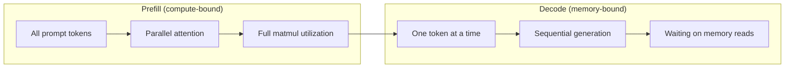
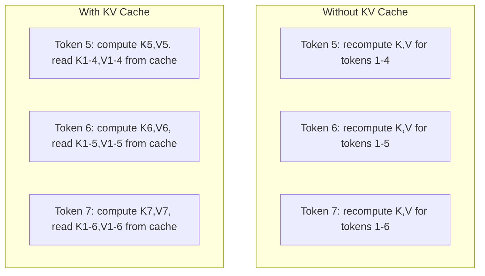
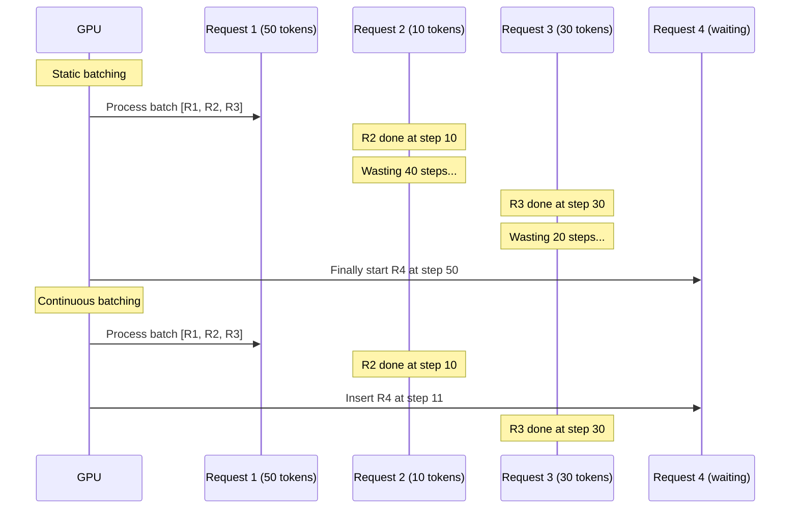
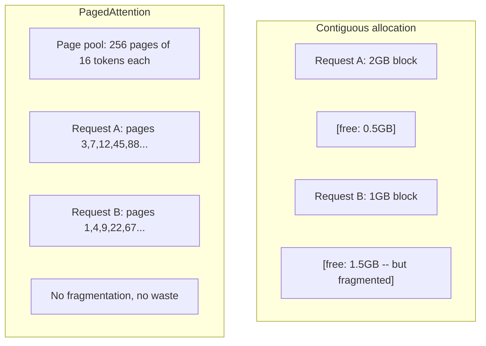
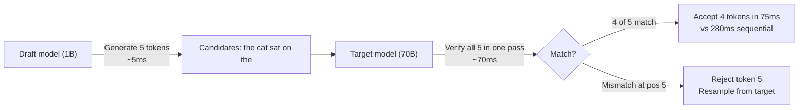

# इन्फरेंस 优化

> दो चरणों में LLM के निष्कर्ष को परिभाषित किया गया है।

**Type:** Build
**Languages:** Python
**Prerequisites:** Phase 10, Lessons 01-08 (Transformer architecture, attention)
**Time:** ~120 分钟

## 学习目标

-  KV-कैश को प्राप्त करना, ऑटोरेग्रेसिव टोकन के उत्पादन के दौरान अधिशेष गणना को समाप्त करने के लिए
-  व्याख्या LLM inference के prefill और decode 阶段, तथा क्यों दोनों में अलग-अलग बोतल हैं(कंप्यूटर-बाउंड बनाम मेमोरी-बाउंड)
- 实现 निरंतर बैचिंग 和 PagedAttention 概念, ताकि अनुरोध पर并发 GPU उपयोग दर को अधिकतम किया जा सके
- तुलना करें निष्कर्ष 优化技术(KV-कैश  अनुमानात्मक डिकोडिंग  फ्लैश ध्यान) और इसके माध्यम/लैटेंसी 取舍

## 问题

आप 4xA100 GPUs पर तैनात Llama 3 70B── एकल उपयोगकर्ता प्रति सेकंड लगभग 50 टोकन प्राप्त कर सकता है── एहसास बहुत जल्दी── फिर 100 उपयोगकर्ता एक ही समय में एंडपॉइंट का दौरा करते हैं── थ्रूपपुट 3 टोकन/सेकंड/उपयोगकर्ता──आप प्रति माह 25,000 डॉलर के GPU  खातों, प्रतिक्रिया की गति प्रदान करते हैं लेकिन किसी व्यक्ति के साथ लिखने में भी धीमा──

模型 स्वयं 1 个用户和 100 个用户之间没有变化── समान वजन、 समान वास्तुकला、 समान गणित── परिवर्तन यह है कि आप कैसे调度工作── सरल निष्कर्ष会浪费90%以上可用GPU गणना── एक प्रतीक्षा टोकन 47 के उपयोगकर्ता पूरे बैच स्लॉट को कब्जा करेंगे, जबकि GPU मेमोरी बस                                                                                                                                                                                                                          

यह स्केलिंग नहीं है  समस्या है  समस्या है                                                                                                                                                                                                                                                                                                                                                                                                                                                                                                                  

vLLM में 4xA100-80GB ऊपर सेवा Llama 3 70B 时,在低并发下 तक पहुँचने के लिए लगभग 50 टोकन/सेकंड/उपयोगकर्ता,并通过持续批发和 PagedAttention 在 100 个并发请求下维持 15-25 TPS/उपयोगकर्ता──没有这些优化,同样硬件在该并发下只能提供 5 TPS/उपयोगकर्ता──同样的GPUs、同样的模型,通过put 提升 4 倍──

## 概念

### प्रीफिल बनाम डिकोड

प्रत्येक LLM निष्कर्ष अनुरोध के दो अलग-अलग चरण होते हैं।

**Prefill**处理整个输入提示──所有代币都已知,因此注意可以在完整序列上并行计算──这是一个大型矩阵乘法--GPU核心会保持忙碌──瓶是计算:你的硬件每秒能提供多少FLOPS──A100可达到312 TFLOPS (BF16)──在单张A100 上,70B 模型对 4,096-代币提示做做预填 约需要400ms──

**Decode**एक बार एक आउटपुट टोकन उत्पन्न करें। प्रत्येक नए टोकन सभी पिछले टोकन का पालन करता है, लेकिन प्रत्येक बार आगे बढ़कर केवल एक टोकन उत्पन्न होता है। वजन मैट्रिक्स का आकार और प्रीफिल के दौरान समान होता है, लेकिन आप एक ही वेक्टर का उपयोग करते हैं, मैट्रिक्स के बजाय, उन्हें ले जाने के लिए। जीपीयू कोर माइक्रोसेकेण्ड स्तर पर पूरा होते हैं, फिर मेमोरी से लेकर मेमोरी तक वजन का इंतजार करते हैं। बोतल मेमोरी बैंडविड्थ हैः आप HBM से कम्प्यूटिंग इकाइयों तक मॉडल वजन को तेजी से गति से संकलित कर सकते हैं। A100 स्ट्रीम में 2TB/s बैंडविड्थ है। 70B मॉडल FP16 140GB है। पूर्ण पढ़ने के लिए एक बार मॉडल को 70ms की आवश्यकता होती है। यह चरण है।



**ops:byte ratio**(अर्थमैटिक तीव्रता भी कहा जाता है) इस प्रकार का चित्रण किया गया है। यह स्मृति से प्रत्येक का माप करता है।

```
ops:byte ratio = FLOPs per token / bytes read from memory
```

4.096 टोकन के बैच पर प्रीफिल करते समय, प्रति लोड एक भार, आप लगभग 4,096 बार गुणा-सकलित संचालन करेंगे। यह अनुपात 很高--你是计算-bound── बैच आकार 为 1 के डिकोड में, प्रति लोड एक भार केवल लगभग 1 बार संचालन करते हैं── यह अनुपात 很低--你是记忆-bound──

核心洞察:*डेकोड मेमोरी-बाउंड है, क्योंकि आप पढ़ते हैं पूरा मॉडल केवल एक टोकन उत्पन्न करने के लिए है*。 नीचे प्रत्येक अनुकूलन, या तो पढ़ने की सामग्री को कम करना, या प्रत्येक बार पढ़ने के लिए संसाधित टोकन बैच को बढ़ाना, या पूरी तरह से पढ़ने से बचना──

### KV कैश

ध्यान में, प्रत्येक टोकन के क्वेरी प्रत्येक पिछले टोकन के कुंजी और मूल्य वेक्टरों पर ध्यान देगा। कोई कैशिंग नहीं है, टोकन उत्पन्न करने के लिए N 需要重新计算前面 N-1 个 टोकन के कुंजी और मूल्य अनुमानों को ध्यान में रखना है। टोकन 1 को टोकन 2 में उत्पन्न करने के लिए प्रोजेक्ट किया गया है, फिर टोकन 3 में उत्पन्न किया गया है, टोकन 4 में उत्पन्न किया गया है।

KV कैश  भंडारण सभी पिछले टोकन की कुंजी और मूल्य अनुमानों── उत्पन्न टोकन N 时, आप केवल N टोकन की कुंजी और मूल्य की गणना, और फिर उन्हें 1 से N-1 के टोकन के साथ कैश K / V 拼拼音起来──



**KV cache 的 memory 公式：**

```
KV cache size = 2 * num_layers * num_kv_heads * head_dim * seq_len * bytes_per_param
```

 Llama 3 70B(80 परतों、8 KV सिरों के लिए GQA、head_dim=128、BF16):

```
per token: 2 * 80 * 8 * 128 * 2 bytes = 327,680 bytes = 320 KB
at 4,096 tokens: 320 KB * 4,096 = 1.28 GB
at 128K tokens: 320 KB * 131,072 = 40 GB
```

एक Llama 3 70B के 128K-संदर्भ वार्तालाप 会耗耗 40 GB KV कैश -- 半张 A100 की स्मृति──100 个并发用户、每人4K टोकन 时, केवल KV कैश की आवश्यकता होती है 128 GB──这就是为什么KV कैश प्रबंधन是推断 优化的核心挑战──

### निरंतर बैचिंग

स्थैतिक बैचिंग एक बैच N 个 अनुरोध के आने का इंतजार करेगी, उन्हें एक साथ संसाधित करेगी,并等到*全部* पूरा होने के बाद ही नया अनुरोध स्वीकार करेगी―― यदि एक अनुरोध को 500 टोकन की आवश्यकता है, तो दूसरे को 10 की आवश्यकता है,短请求 पूरा होने के बाद भी 490 个解码步骤应置──

निरंतर बैचिंग (अर्थात् पुनरावृत्ति स्तर बैचिंग) किसी भी अनुरोध के पूरा होने के बाद तुरंत नए अनुरोध को बैच में सम्मिलित करेगा। प्रत्येक डिकोड चरण में, शहर बैच का पुनः मूल्यांकन करेगा।



आउटपुट लंबाई में परिवर्तन की डिग्री से 提升 提升取决于输出长度的变化程度──长度一致时,持续批发与静态批发 相当──长度可变时,常见情况), निरंतर批发 2-5 गुना अधिक उत्पादन प्रदान कर सकता है, क्योंकि GPU स्लॉट 永远不会空置──

### पृष्ठ ध्यान

प्रत्येक अनुरोध का KV कैश एक आसन्न स्मृति का एक ब्लॉक है। अनुरोध के साथ-साथ स्मृति का टुकड़ाकरण होता है - जैसे ऑपरेटिंग सिस्टम में रैम का टुकड़ाकरण होता है। एक 4K-टोकन अनुरोध 1.28 GB आसन्न की आवश्यकता होती है।

PagedAttention(vLLM से) ओएस-शैली की वर्चुअल मेमोरी को KV कैश में उपयोग किया जाएगा── यह प्रत्येक अनुरोध के लिए एक आसन्न ब्लॉक का वितरण नहीं है, बल्कि एक निश्चित आकार के "पृष्ठों" को वितरित करना है।



PagedAttention और साझा उपसर्ग का समर्थन **copy-on-write** यदि 50  अनुरोध साझा एक ही सिस्टम प्रॉम्प्ट के साथ, इस सिस्टम प्रॉम्प्ट के KV कैश पृष्ठ केवल एक बार संग्रहीत होते हैं, और 50  अनुरोध साझा किए जाते हैं केवल जब किसी अनुरोध को अलग-अलग उपयोगकर्ता संदेशों में विभाजित किया जाता है) तो यह केवल अपने पृष्ठों को प्राप्त करता है यह साझा प्रणाली प्रॉम्प्ट के साथ अनुप्रयोगों की मेमोरी उपयोग को काफी कम कर देगा

vLLM  रिपोर्ट में कहा गया है कि पेजडएटेंशन के जरिए लगभग शून्य स्मृति व्यर्थियों को प्राप्त किया जा सकता है।

### अनुमानित डिकोडिंग

डिकोड धीमी है क्योंकि यह अनुक्रमिक है - आप एक टोकन उत्पन्न, इसे वापस वापस डाल, अगले में पुनः उत्पन्न किया गया है. लेकिन अगर आप सस्ते में अगले 5 टोकन का अनुमान लगा सकते हैं, तो फिर एक बार उन्हें सत्यापित?

अनुमानित डिकोडिंग एक छोटा और त्वरित उपयोग **draft model**生成 K 个 उम्मीदवार टोकन── बड़े **target model**️️️️️️️️️️️️️️️️️️️️️️️️️️️️️️️️️️️️️️️️️️️️️️️️️️️️️️️️️️️️️️️️️️️️️️️️️️️️️️️️️️️️️️️️️️️️️️️️️️️️️️️️️️️️️️️️️️️️️️️️️️️️️️️️️️️️️️️️️️️️️️️️️️️️️️️️️️️️️️️️️️️️️️️️️️️️️️️️️️️️️️️️️️️️️️️️️️️️️️️️️️️️️️️️️️️️️️️️️️️️️️️️️️️️️️️️️️️️️️️️️️️️️️️️️️️️️️️️️️️️️️️️️️️️️️️️️️️️️️️️️️️️️️️️️️️️️️️️️️️️️️️️️️️️️️️️️️️️️️️️️️️️️️️️️️️️️️️️️️️️️️️️️️️️️️️️️️️️️️️️️️️️️️️️️️️️️️️️️️️️️️️️️️️️️️️️️️️️️️️️️️️️️️️️️️️️️️️️️️️️️️️️️️️️️️️️️️️️️️️️️️️️️️️️️️️️️️️️️️️️️️️️️️️️️️️️️️️️️️️️️️️️️️️️️️️️️️️️️️️️️️️️️️️️



गति 取决于 **acceptance rate**-- ड्राफ्ट मॉडल का पूर्वानुमान लक्ष्य 匹配的频率── Llama 3 8B के साथ Llama 3 70B के साथ ड्राफ्टिंग करते समय, प्राकृतिक भाषा में सामान्य स्वीकृति दरें 70-85% हैं── यह 2-3 गुना डिकोडिंग गति में बदल जाती है──

अनुमानित डिकोडिंग के तीन तरीकेः

| Method | Draft source | Acceptance rate | Overhead |
|--------|-------------|-----------------|----------|
| Draft-target (Leviathan et al.) | 独立小模型 | 70-85% | Draft model memory |
| EAGLE (Li et al.) | Target 上的轻量 head | 75-90% | ~1% extra parameters |
| N-gram lookup | Token n-gram table | 40-60% | 可忽略 |

**EAGLE**️️️️️️️️️️️️️️️️️️️️️️️️️️️️️️️️️️️️️️️️️️️️️️️️️️️️️️️️️️️️️️️️️️️️️️️️️️️️️️️️️️️️️️️️️️️️️️️️️️️️️️️️️️️️️️️️️️️️️️️️️️️️️️️️️️️️️️️️️️️️️️️️️️️️️️️️️️️️️️️️️️️️️️️️️️️️️️️️️️️️️️️️️️️️️️️️️️️️️️️️️️️️️️️️️️️️️️️️️️️️️️️️️️️️️️️️️️️️️️️️️️️️️️️️️️️️️️️️️️️️️️️️️️️️️️️️️️️️️️️️️️️️️️️️️️️️️️️️️️️️️️️️️️️️️️️️️️️️️️️️️️️️️️️️️️️️️️️️️️️️️️️️️️️️️️️️️️️️️️️️️️️️️️️️️️️️️️️️️️️️️️️️️️️️️️️️️️️️️️️️️️️️️️️️️️️️️️️️️️️️️️️️️️️️️️️️️️️️️️️️️️️️️️️️️️️️️️️️️️️️️️️️️️️️️️️️️️️️️️️️️️️️️️️️️️️️️️️️️️️️️️️️️️️️

**N-gram speculative decoding**维护来自当前文本或预构建 corpus के n-gram निरंतरता तालिका── यदि मसौदा 匹配同样的对话中此前出现的内容(重复模式、代码、结构化输出), तो यह शून्य से न्यूरल नेटवर्क ओवरहेड 触发── औसत स्वीकृति दर और भी कम होगी, लेकिन प्रति अनुमान लागत मूलतः शून्य है──

अनुमानात्मक डिकोडिंग गणित से सटीक है---- आउटपुट वितरण लक्ष्य मॉडल के वितरण के साथ पूरी तरह से समान है── यह निकटता नहीं है── सत्यापन चरण  सुनिश्चित करें कि प्रत्येक स्वीकृत टोकन के पास लक्ष्य मॉडल है।

### पूर्वसर्ग कैशिंग

许多请求共享相同的前──Chatbot system prompt──RAG context block──Few-shot example set──没有前缓存 时,每个请求都会从头重新计算这些共享代币的KV缓存──

पूर्वनिर्धारित कैशिंग  संग्रह सामान्य पूर्वनिर्धारित केवी कैश, और अनुरोध के बीच पुनः उपयोग。 जब नया अनुरोध ज्ञात पूर्वनिर्धारित के साथ आता है, सिस्टम होगा कॉपी करना या उद्धरण) कैश KV प्रविष्टियों,并只计算 अद्वितीय प्रत्यय केवी

 सभी अनुरोधों को साझा करने के लिए 2,000-टोकन सिस्टम प्रॉम्प्ट, पूर्वनिर्धारित कैशिंग प्रत्येक अनुरोध को लगभग 400ms के पूर्वनिर्धारित को समाप्त करेगा  100 अनुरोधों / सेकंड में, यह प्रति सेकंड बचत करता है 40 सेकंड GPU गणना -  एक GPU के काम के आकार से अधिक 

SGLang का RadixAttention प्रयोग करें radix tree(trie) पूर्वावलोकन कैशिंग को लागू करें, टोकन सामग्री के अनुसार 索引 पूर्वावलोकन。 किसी भी मैच संग्रहीत पूर्वावलोकन का अनुरोध都会免费获得其KV कैश。 इस पेड़ 支持部分 पूर्वावलोकन मैचें--- यदि आप किसी भी कैश किए गए प्रविष्टि के साथ 共享 2,000 个 पूर्वावलोकन टोकन में से 1,500 个,就复用这1,500 个,只重新计算 500 个──

### इन्फेरेंस इंजन

तीन इंजन 主导 उत्पादन LLM सेवाः

| Engine | Key innovation | Best for |
|--------|---------------|----------|
| vLLM | PagedAttention、continuous batching | 通用 serving、最高兼容性 |
| SGLang | RadixAttention（prefix caching）、structured generation | Multi-turn chatbots、constrained decoding |
| TensorRT-LLM | NVIDIA kernel fusion、FP8 quantization | NVIDIA hardware 上的最大 single-GPU throughput |

**vLLM**यह किसी भी GPU विक्रेता पर चल सकता है, और PagedAttention + निरंतर बैचिंग के माध्यम से इसे किसी भी OpenAI API कॉल के विकल्प के रूप में सीधे कनेक्ट कर सकता है।

**SGLang**建立在与vLLM相似的基础之上, लेकिन बढ़ गया है पूर्वावलोकन कैशिंग के लिए उपयोग किया जाने वाला RadixAttention, साथ ही संरचित LLM कार्यक्रमों के डोमेन-विशिष्ट भाषा के लिए भी। यदि आपका कार्यभार 包含 बहु-टर्न वार्तालाप, उपकरण उपयोग या प्रतिबंधित डिकोडिंग, JSON आउटपुट, रीजेक्स-निर्देशित पीढ़ी), SGLang 往往能通过 पूर्वावलोकन पुनः उपयोग 比 vLLM 快 2-5 倍──

**TensorRT-LLM**将模型编译成优化NVIDIA GPU kernels──它融合操作(注意+线性+激活在一个内核中), H100 GPUs 上使用FP8,并与NVIDIA Triton Inference Server 集成进行生产部署──它实现最高单GPU吞吐量在NVIDIA硬件上,但设置更多,并且只适用于NVIDIA GPUs──

Llama 3 70B 的真实世界数字(4xA100-80GB,BF16):

| Metric | vLLM | SGLang | TensorRT-LLM |
|--------|------|--------|---------------|
| Throughput（1 user） | ~50 TPS | ~55 TPS | ~65 TPS |
| Throughput（100 users） | ~2,500 total TPS | ~3,200 total TPS | ~3,000 total TPS |
| Time to first token | ~400ms | ~300ms（prefix hit） | ~350ms |
| Max context | 128K | 128K | 128K |

### Ops:Byte 框架

आप अपने आप को मापने के लिए कुछ भी नहीं है के लिए अनुकूलित करने में असमर्थ हैं. ओप्सःबाइट अनुपात आपको बताता है कि काम का बोझ है कि कंप्यूटर-बाउंड या स्मृति-बाउंड, और यह तय करता है कि क्या अनुकूलन वास्तव में महत्वपूर्ण है.

```
Compute roof: peak FLOPS of the GPU
Memory roof:  peak bandwidth * ops:byte ratio
```

जब आपःबाइट 较低时(डेकोड、小批),你会触及内存带宽 छत──增加更多计算(更高钟、更多核心) कोई मदद नहीं──你需要减少内存读数(量子化、KV缓存压缩),或增加批量,将读分分到更多有用工作上──

जब आप ऑपरेशन करते हैं तो आपको कंप्यूटर की छत को छूना होगा।

| Scenario | ops:byte | Bound | Optimize with |
|----------|----------|-------|---------------|
| Prefill, batch=1 | ~4,096 | Compute | Kernel fusion, FP8 |
| Decode, batch=1 | ~1 | Memory | Quantization, KV compression |
| Decode, batch=32 | ~32 | Memory | Larger batch, continuous batching |
| Decode, batch=256 | ~256 | Transitioning | 两者都重要 |
| Decode, batch=1024 | ~1,024 | Compute | Kernel fusion, tensor parallelism |

A100 का ऊपर क्रॉसओवर बिंदु 大约是 ops:byte = 156(312 TFLOPS / 2 TB/s) ⋅低于 156 时,你是内存 बाध्य──高于 156 时,你是计算 बाध्य──持续批发 通过每次回复 打包更多代币,将解码 推向这个跨越──


```figure
context-window-slide
```

##  इसे निर्माण

### 步骤 1: KV कैश को शून्य से प्राप्त करना

हमने एक मल्टी-हेड केवी कैश बनाया, यह परत के अनुसार, हेड स्टोरेज कुंजी और मूल्य अनुमानों को प्रदर्शित करता है, और स्मृति को प्रदर्शित करता है।

```python
import numpy as np

class KVCache:
    def __init__(self, num_layers, num_heads, head_dim, max_seq_len, dtype=np.float16):
        self.num_layers = num_layers
        self.num_heads = num_heads
        self.head_dim = head_dim
        self.max_seq_len = max_seq_len
        self.dtype = dtype

        self.k_cache = np.zeros(
            (num_layers, num_heads, max_seq_len, head_dim), dtype=dtype
        )
        self.v_cache = np.zeros(
            (num_layers, num_heads, max_seq_len, head_dim), dtype=dtype
        )
        self.seq_len = 0

    def update(self, layer_idx, new_keys, new_values):
        num_new = new_keys.shape[1]
        end = self.seq_len + num_new
        self.k_cache[layer_idx, :, self.seq_len:end, :] = new_keys
        self.v_cache[layer_idx, :, self.seq_len:end, :] = new_values
        return (
            self.k_cache[layer_idx, :, :end, :],
            self.v_cache[layer_idx, :, :end, :]
        )

    def advance(self, num_tokens):
        self.seq_len += num_tokens

    def memory_bytes(self):
        return self.k_cache.nbytes + self.v_cache.nbytes

    def used_bytes(self):
        per_token = 2 * self.num_layers * self.num_heads * self.head_dim * np.dtype(self.dtype).itemsize
        return per_token * self.seq_len
```

### 步骤 2: KV कैश का उपयोग ध्यान

एक सरल बहु-हेड ध्यान, decode चरणों में KV कैश का उपयोग करते हैं

```python
def scaled_dot_product_attention(query, keys, values):
    head_dim = query.shape[-1]
    scores = np.matmul(query, keys.transpose(0, 1, 3, 2)) / np.sqrt(head_dim)
    seq_len_q = scores.shape[-2]
    seq_len_k = scores.shape[-1]
    if seq_len_q > 1:
        mask = np.triu(np.ones((seq_len_q, seq_len_k), dtype=np.float32), k=seq_len_k - seq_len_q + 1)
        scores = scores + mask * (-1e9)
    max_scores = np.max(scores, axis=-1, keepdims=True)
    exp_scores = np.exp(scores - max_scores)
    attn_weights = exp_scores / np.sum(exp_scores, axis=-1, keepdims=True)
    return np.matmul(attn_weights, values)


class MultiHeadAttention:
    def __init__(self, d_model, num_heads):
        self.num_heads = num_heads
        self.head_dim = d_model // num_heads
        scale = np.sqrt(2.0 / d_model)
        self.W_q = np.random.randn(d_model, d_model).astype(np.float32) * scale
        self.W_k = np.random.randn(d_model, d_model).astype(np.float32) * scale
        self.W_v = np.random.randn(d_model, d_model).astype(np.float32) * scale
        self.W_o = np.random.randn(d_model, d_model).astype(np.float32) * scale

    def forward(self, x, kv_cache=None, layer_idx=0):
        batch, seq_len, d_model = x.shape
        Q = np.matmul(x, self.W_q).reshape(batch, seq_len, self.num_heads, self.head_dim).transpose(0, 2, 1, 3)
        K = np.matmul(x, self.W_k).reshape(batch, seq_len, self.num_heads, self.head_dim).transpose(0, 2, 1, 3)
        V = np.matmul(x, self.W_v).reshape(batch, seq_len, self.num_heads, self.head_dim).transpose(0, 2, 1, 3)

        if kv_cache is not None:
            K_full, V_full = kv_cache.update(layer_idx, K[0], V[0])
            K = K_full[np.newaxis, :, :, :]
            V = V_full[np.newaxis, :, :, :]
            if seq_len == 1:
                kv_cache.advance(1)

        attn_out = scaled_dot_product_attention(Q, K, V)
        attn_out = attn_out.transpose(0, 2, 1, 3).reshape(batch, -1, d_model)
        return np.matmul(attn_out, self.W_o)
```

### 步骤 3: निरंतर बैचिंग 模拟器

यह स्थिर बैचिंग और निरंतर बैचिंग के बीच के调度差异 की तरह है।

```python
import heapq

class Request:
    def __init__(self, request_id, prompt_tokens, output_tokens, arrival_step):
        self.request_id = request_id
        self.prompt_tokens = prompt_tokens
        self.output_tokens = output_tokens
        self.arrival_step = arrival_step
        self.tokens_generated = 0
        self.start_step = None
        self.end_step = None

    def is_done(self):
        return self.tokens_generated >= self.output_tokens


def simulate_static_batching(requests, batch_size):
    step = 0
    completed = []
    queue = list(requests)
    queue.sort(key=lambda r: r.arrival_step)

    while queue:
        batch = []
        while queue and len(batch) < batch_size:
            r = queue.pop(0)
            r.start_step = max(step, r.arrival_step)
            batch.append(r)

        if batch:
            step = max(step, max(r.start_step for r in batch))
            max_output = max(r.output_tokens for r in batch)
            for r in batch:
                r.tokens_generated = r.output_tokens
                r.end_step = step + max_output
            step += max_output
            completed.extend(batch)

    return completed


def simulate_continuous_batching(requests, batch_size):
    step = 0
    completed = []
    queue = sorted(requests, key=lambda r: r.arrival_step)
    queue_idx = 0
    active = []
    waiting = []

    while queue_idx < len(queue) or active or waiting:
        while queue_idx < len(queue) and queue[queue_idx].arrival_step <= step:
            waiting.append(queue[queue_idx])
            queue_idx += 1

        while waiting and len(active) < batch_size:
            r = waiting.pop(0)
            r.start_step = step
            active.append(r)

        if not active:
            if waiting:
                step += 1
                continue
            elif queue_idx < len(queue):
                step = queue[queue_idx].arrival_step
                continue
            else:
                break

        for r in active:
            r.tokens_generated += 1

        done = [r for r in active if r.is_done()]
        for r in done:
            r.end_step = step + 1
            completed.append(r)
        active = [r for r in active if not r.is_done()]

        step += 1

    return completed


def batching_stats(completed):
    latencies = [r.end_step - r.arrival_step for r in completed]
    total_time = max(r.end_step for r in completed) - min(r.arrival_step for r in completed)
    total_tokens = sum(r.output_tokens for r in completed)
    return {
        "avg_latency": np.mean(latencies),
        "p50_latency": np.median(latencies),
        "p99_latency": np.percentile(latencies, 99),
        "total_time": total_time,
        "throughput": total_tokens / total_time if total_time > 0 else 0,
    }
```

### 步骤 4: पूर्वावलोकन कैश

एक tri आधारित पूर्वावलोकन कैश, साझा पूर्वावलोकन के KV प्रविष्टियों को संग्रहीत करने के लिए उपयोग किया जाता है。

```python
class TrieNode:
    def __init__(self):
        self.children = {}
        self.kv_data = None
        self.hit_count = 0


class PrefixCache:
    def __init__(self, max_entries=1000):
        self.root = TrieNode()
        self.max_entries = max_entries
        self.total_entries = 0
        self.hits = 0
        self.misses = 0

    def _walk(self, token_ids):
        node = self.root
        depth = 0
        for tid in token_ids:
            if tid not in node.children:
                break
            node = node.children[tid]
            depth += 1
        return node, depth

    def lookup(self, token_ids):
        node, depth = self._walk(token_ids)
        if depth > 0:
            self.hits += 1
            current = self.root
            for tid in token_ids[:depth]:
                current = current.children[tid]
                current.hit_count += 1
            kv_entries = []
            current = self.root
            for tid in token_ids[:depth]:
                current = current.children[tid]
                if current.kv_data is not None:
                    kv_entries.append(current.kv_data)
            return depth, kv_entries
        self.misses += 1
        return 0, []

    def insert(self, token_ids, kv_per_token):
        node = self.root
        for i, tid in enumerate(token_ids):
            if tid not in node.children:
                if self.total_entries >= self.max_entries:
                    return i
                node.children[tid] = TrieNode()
                self.total_entries += 1
            node = node.children[tid]
            if i < len(kv_per_token):
                node.kv_data = kv_per_token[i]
        return len(token_ids)

    def hit_rate(self):
        total = self.hits + self.misses
        return self.hits / total if total > 0 else 0.0
```

### 步骤 5: अनुमानात्मक डिकोडिंग 模拟器

हम विन्यस्त करने योग्य स्वीकृति दरों का उपयोग करते हैं 模拟草案-लक्ष्य अनुमानात्मक डिकोडिंग

```python
class DraftModel:
    def __init__(self, vocab_size, acceptance_rate=0.8):
        self.vocab_size = vocab_size
        self.acceptance_rate = acceptance_rate

    def generate(self, context, num_tokens):
        tokens = np.random.randint(0, self.vocab_size, size=num_tokens)
        return tokens

    def get_probs(self, context, token):
        probs = np.random.dirichlet(np.ones(self.vocab_size))
        return probs


class TargetModel:
    def __init__(self, vocab_size):
        self.vocab_size = vocab_size

    def get_probs(self, context, tokens=None):
        if tokens is not None:
            return [np.random.dirichlet(np.ones(self.vocab_size)) for _ in tokens]
        return np.random.dirichlet(np.ones(self.vocab_size))


def speculative_decode(draft_model, target_model, context, num_speculative=5,
                       draft_cost=1.0, target_cost=10.0, verify_cost=12.0):
    total_tokens = 0
    total_cost = 0.0
    accepted_counts = []
    context = list(context)

    max_tokens = 100

    while total_tokens < max_tokens:
        draft_tokens = draft_model.generate(context, num_speculative)
        total_cost += draft_cost * num_speculative

        target_probs = target_model.get_probs(context, draft_tokens)
        total_cost += verify_cost

        accepted = 0
        for i, token in enumerate(draft_tokens):
            draft_p = draft_model.get_probs(context + list(draft_tokens[:i]), token)
            target_p = target_probs[i]

            r = np.random.random()
            acceptance_prob = min(1.0, target_p[token] / (draft_p[token] + 1e-10))

            if r < draft_model.acceptance_rate:
                accepted += 1
                context.append(token)
                total_tokens += 1
            else:
                new_token = np.random.choice(draft_model.vocab_size, p=target_p)
                context.append(new_token)
                total_tokens += 1
                break

        accepted_counts.append(accepted)

        if accepted == num_speculative:
            bonus_probs = target_model.get_probs(context)
            bonus_token = np.random.choice(draft_model.vocab_size, p=bonus_probs)
            context.append(bonus_token)
            total_tokens += 1

    sequential_cost = total_tokens * target_cost
    return {
        "total_tokens": total_tokens,
        "speculative_cost": total_cost,
        "sequential_cost": sequential_cost,
        "speedup": sequential_cost / total_cost if total_cost > 0 else 1.0,
        "avg_accepted": np.mean(accepted_counts),
        "acceptance_rate": np.mean(accepted_counts) / num_speculative,
    }


def compare_speculation_strategies(vocab_size=1000, num_trials=20):
    results = {}

    for name, acceptance_rate, spec_tokens in [
        ("Draft-target (8B->70B)", 0.78, 5),
        ("EAGLE", 0.85, 6),
        ("N-gram", 0.50, 4),
        ("No speculation", 0.0, 0),
    ]:
        if spec_tokens == 0:
            results[name] = {
                "speedup": 1.0,
                "acceptance_rate": 0.0,
                "avg_accepted": 0.0,
            }
            continue

        trial_results = []
        for _ in range(num_trials):
            draft = DraftModel(vocab_size, acceptance_rate=acceptance_rate)
            target = TargetModel(vocab_size)
            context = list(np.random.randint(0, vocab_size, size=10))
            result = speculative_decode(draft, target, context, num_speculative=spec_tokens)
            trial_results.append(result)

        results[name] = {
            "speedup": np.mean([r["speedup"] for r in trial_results]),
            "acceptance_rate": np.mean([r["acceptance_rate"] for r in trial_results]),
            "avg_accepted": np.mean([r["avg_accepted"] for r in trial_results]),
        }

    return results
```

### 步骤 6: KV कैश मेमोरी प्रोफाइलर

计算真实模型配置的 KV कैश मेमोरी आवश्यकताएँ。

```python
MODEL_CONFIGS = {
    "Llama-3-8B": {
        "num_layers": 32, "num_kv_heads": 8, "head_dim": 128,
        "model_params_b": 8, "gqa": True,
    },
    "Llama-3-70B": {
        "num_layers": 80, "num_kv_heads": 8, "head_dim": 128,
        "model_params_b": 70, "gqa": True,
    },
    "Llama-3-405B": {
        "num_layers": 126, "num_kv_heads": 8, "head_dim": 128,
        "model_params_b": 405, "gqa": True,
    },
    "Mistral-7B": {
        "num_layers": 32, "num_kv_heads": 8, "head_dim": 128,
        "model_params_b": 7, "gqa": True,
    },
    "GPT-4-est": {
        "num_layers": 120, "num_kv_heads": 96, "head_dim": 128,
        "model_params_b": 1800, "gqa": False,
    },
}


def kv_cache_memory(config, seq_len, dtype_bytes=2):
    per_token = 2 * config["num_layers"] * config["num_kv_heads"] * config["head_dim"] * dtype_bytes
    total = per_token * seq_len
    return {
        "per_token_bytes": per_token,
        "per_token_kb": per_token / 1024,
        "total_bytes": total,
        "total_mb": total / (1024 ** 2),
        "total_gb": total / (1024 ** 3),
    }


def memory_budget(config, gpu_memory_gb, model_dtype_bytes=2, kv_dtype_bytes=2):
    model_memory_gb = config["model_params_b"] * 1e9 * model_dtype_bytes / (1024 ** 3)
    overhead_gb = gpu_memory_gb * 0.1
    available_for_kv = gpu_memory_gb - model_memory_gb - overhead_gb

    if available_for_kv <= 0:
        return {"error": "Model does not fit in GPU memory", "model_memory_gb": model_memory_gb}

    per_token = 2 * config["num_layers"] * config["num_kv_heads"] * config["head_dim"] * kv_dtype_bytes
    max_tokens = int(available_for_kv * (1024 ** 3) / per_token)

    return {
        "gpu_memory_gb": gpu_memory_gb,
        "model_memory_gb": round(model_memory_gb, 1),
        "overhead_gb": round(overhead_gb, 1),
        "available_for_kv_gb": round(available_for_kv, 1),
        "max_total_tokens": max_tokens,
        "max_users_at_2k": max_tokens // 2048,
        "max_users_at_4k": max_tokens // 4096,
        "max_users_at_32k": max_tokens // 32768,
    }
```

## इसका उपयोग करें

प्रयोग vLLM:

```python
from vllm import LLM, SamplingParams

llm = LLM(
    model="meta-llama/Llama-3-70B-Instruct",
    tensor_parallel_size=4,
    enable_prefix_caching=True,
    max_model_len=8192,
    gpu_memory_utilization=0.9,
)

params = SamplingParams(temperature=0.7, max_tokens=256)
outputs = llm.generate(["Explain inference optimization in one paragraph."], params)
```

SGLang का प्रयोग करें prefix caching + structured output:

```python
import sglang as sgl

@sgl.function
def classify(s, text):
    s += sgl.system("You are a classifier. Output JSON only.")
    s += sgl.user(f"Classify this text: {text}")
    s += sgl.assistant(sgl.gen("result", regex=r'\{"label": "(positive|negative|neutral)"\}'))

runtime = sgl.Runtime(model_path="meta-llama/Llama-3-70B-Instruct", tp_size=4)
sgl.set_default_backend(runtime)

results = classify.run_batch([
    {"text": "This product is amazing!"},
    {"text": "Terrible experience."},
    {"text": "It was okay I guess."},
])
```

प्रयोग TensorRT-LLM:

```python
import tensorrt_llm
from tensorrt_llm.runtime import ModelRunner

runner = ModelRunner.from_dir("./llama-70b-trt-engine/", rank=0)

outputs = runner.generate(
    batch_input_ids=[tokenizer.encode("Explain KV caching.")],
    max_new_tokens=256,
    temperature=0.7,
)
```

## 交付 यह

本课产出:
- `outputs/skill-inference-optimization.md`-- एक निदान और अनुकूलन LLM inference सेवा करने के लिए कौशल

## अभ्यास

1. 修改KV कैश प्रोफाइलर, तुलना FP16 बनाम FP8 बनाम INT4KV कैश क्वांटिज़ेशन。 4K संदर्भ के लिए नीचे के Llama 3 70B, गणना प्रत्येक सेटअप में 4xA100-80GB ऊपर के अधिकतम并发 उपयोगकर्ता संख्या。KV क्वांटिज़ेशन INT4  लगभग उपयोगकर्ता क्षमता में वृद्धि 4 गुना करना चाहिए。

2. 模拟器, 模拟器, 模拟器, 模拟器, 模拟器, 模拟器, 模拟器, 模拟器, 模拟器, 模拟器, 模拟器, 模拟器, 模拟器, 模拟器, 模拟器, 模拟器, 模拟器, 模拟器, 模拟器, 模拟器, 模拟器, 模拟器, 模拟器, 模拟器, 模拟器, 模拟器, 模拟器, 模拟器, 模拟器, 模拟器, 模拟器, 模拟器, 模拟器, 模拟器, 模拟器, 模拟器, 模拟器, 模拟器, 模拟器, 模拟器, 模拟器, 模拟器, 模拟器, 模拟器, 模拟器, 模拟器, 模拟器, 模拟器, 模拟器, 模拟器, 模拟器, 模拟器, 模拟器, 模拟器, 模拟器, 模拟器, 模拟器, 模拟器, 模拟器, 模拟器, 模拟器, 模拟器, 模拟器, 模拟器, 模拟器, 模拟器, 模拟器, 模拟器, 模拟器, 模拟器, 模拟器, 模拟器, 模拟器, 模拟器, 模拟器, 模拟器, 模拟器, 模拟器, 模拟器, 模拟器, 模拟器, 模拟器, 模拟器, 模拟器, 模拟器, 模拟器, 模拟器, 模拟器, 模拟器, 模拟器, 模拟器, 模拟器, 模拟器, 模拟器, 模拟器, 模拟器, 模拟器, 模拟器, 模拟器, 模拟, 模拟, 模拟器, 模

3. 实现 एक समूह-सवाल ध्यान(GQA) संस्करण के KV कैश, में से `num_kv_heads < num_query_heads`◊Llama 3 70B उपयोग 64  क्वेरी हेड, लेकिन केवल 8  KV हेड── गणना के मुकाबले पूर्ण बहु-हेड ध्यान की स्मृति बचत(KV कैश आकार  8 गुना कम)

4.  एक निर्माण LRU निष्कासन के पूर्वसर्ग कैश का उपयोग करते हुए                                                                                                                                                                                                                                                     

5. 扩展投机解码 模拟器,实现树基投机(EAGLE-2 风格) ――不是单条 K 个草案代币的链,而是生成候选人树(例如每3层各 2个分支=8个叶子候选人) ――比较每一个验证轮 接受的全部代币与线性投机的差异──

## 关键术语

| Term | 人们怎么说 | 它实际意味着什么 |
|------|----------------|----------------------|
| Prefill | "Processing the prompt" | 在所有输入 tokens 上并行计算 attention -- compute-bound，因为完整 matrix multiplication 会让 GPU cores 保持忙碌 |
| Decode | "Generating tokens" | 每次 forward pass 产生一个 token，每次都读取完整 model weights -- memory-bound，因为 compute 会在下一批 weights 到达前完成 |
| KV cache | "Caching attention states" | 存储所有 previous tokens 的 key 和 value projections，使它们不会在每个 decode step 被重新计算 -- 用 memory 换 compute |
| Continuous batching | "Dynamic batching" | 在任何请求完成后立即将新请求插入 running batch，每个 decode iteration 都进行评估，而不是等待整个 batch |
| PagedAttention | "Virtual memory for KV cache" | 用固定大小 pages 而不是 contiguous blocks 分配 KV cache，消除 memory fragmentation，并为 shared prefixes 启用 copy-on-write |
| Speculative decoding | "Draft and verify" | 使用快速 draft model 提出多个 tokens，然后在一次 target model forward pass 中全部验证 -- 数学上精确，2-3 倍 speedup |
| EAGLE | "Self-speculative decoding" | 一种 speculative decoding 变体，在 target model 自身的 hidden states 上训练 lightweight head，相比独立 draft model 获得更高 acceptance rates |
| Prefix caching | "Reusing system prompt KV" | 为 common prefixes（system prompts、few-shot examples）存储已计算的 KV cache entries，并跨请求复用它们以跳过冗余 prefill |
| Ops:byte ratio | "Arithmetic intensity" | Compute operations 与读取的 memory bytes 之比 -- 决定 workload 是 compute-bound（高 ratio）还是 memory-bound（低 ratio） |
| Time to first token | "TTFT" | 从接收请求到产生第一个输出 token 的延迟 -- 对于长 prompts，主要由 prefill time 主导 |

## 延伸阅读

- Kwon et al., "पेज्ड ध्यान के साथ सेवा करने वाले बड़े भाषा मॉडल के लिए कुशल मेमोरी प्रबंधन" (2023) -- 介绍 पेजड केवी कैश प्रबंधन का vLLM 论文,如今它已成为推理服务的行业标准
- लेवीयथन और अन्य, "स्पेक्टेटिव डिकोडिंग के माध्यम से ट्रांसफार्मर से फास्ट इन्फेरेंस" (2023) - आधारभूत पेपर, सबूत ड्राफ्ट-सत्यापित अटकलें 2-3 गुना तेजी लाने के साथ ही, सटीक लक्ष्य मॉडल वितरण उत्पन्न होगा
- ली और अन्य, "एजीएलः अनुमानात्मक नमूनाकरण में फीचर अनिश्चितता की आवश्यकता होती है" (2024) -- 通过在目标模型 自身 विशेषताएं 上训练头, बजाय स्वतंत्र ड्राफ्ट मॉडल का उपयोग, प्राप्त अधिक उच्च स्वीकृति दर
- झेंग एट अल., "एसजीएलएंगः स्ट्रक्चरल लैंग्वेज मॉडल प्रोग्राम का कुशल निष्पादन" (2024) -- 介绍 उपयोग में लाया गया प्रीफिक्स कैशिंग का रेडिक्स ध्यान, साथ ही साथ बहु-कॉल एलएलएम कार्यक्रमों के लिए उपयोग में लाया गया प्रोग्रामिंग मॉडल
- विलियम्स एट अल., "रोफलाइनः मल्टीकोर आर्किटेक्चर के लिए एक अंतर्दृष्टि विज़ुअल परफॉर्मेंस मॉडल" (2009) -- मूल छतलाइन पेपर, फॉर्मूलाकृत किया गया है गणना बनाम मेमोरी बोतल गला के लिए उपयोग किया जाता है
