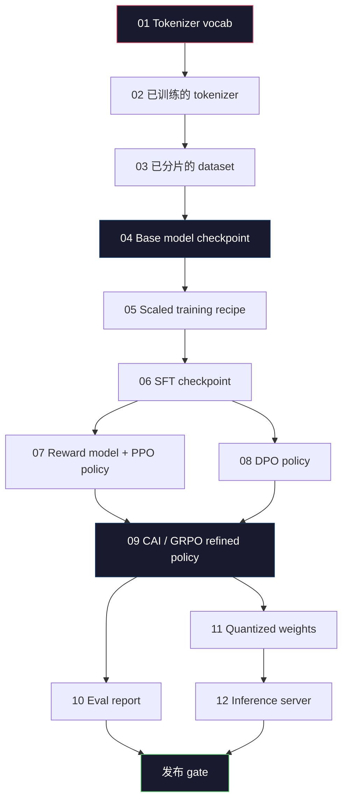
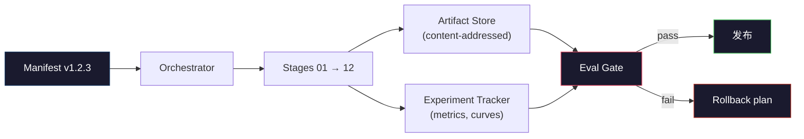

# पूर्ण LLM पाइपलाइन का निर्माण

> पाठ 01 से 12 तक की सभी सामग्री, एक ही पाइपलाइन के एक चरण में है। यह एक ही चरण में एक ही चरण में एक ही चरण में एक ही चरण में एक ही चरण में एक ही चरण में एक ही चरण में एक ही चरण में एक ही चरण में एक ही चरण में एक ही चरण में एक ही चरण में एक ही चरण में एक ही चरण में एक ही चरण में एक ही चरण में एक ही चरण में एक ही चरण में एक ही चरण में एक ही चरण में एक ही चरण में एक ही चरण में एक ही चरण में एक ही चरण में एक ही चरण में एक ही चरण में एक ही चरण में एक ही चरण में एक ही चरण में एक ही चरण में एक ही चरण में एक ही चरण में एक ही चरण में एक ही चरण में एक ही चरण में एक ही चरण में एक ही चरण में एक ही चरण में एक ही चरण में एक ही चरण में एक ही चरण में एक ही चरण में एक ही चरण में एक ही चरण में एक ही चरण में एक ही चरण में एक ही चरण में एक ही चरण में एक ही चरण में एक ही चरण में एक ही चरण में एक ही चरण में एक ही चरण में एक ही चरण में एक ही चरण में एक ही चरण में एक ही चरण में एक ही चरण में एक ही चरण में एक ही चरण में एक ही चरण में एक ही चरण में एक ही चरण में एक ही चरण में एक चरण में एक ही चरण में एक चरण में एक ही चरण में एक चरण में एक ही चरण में एक चरण में एक चरण में एक ही चरण में एक चरण में एक चरण में एक चरण में एक चरण में एक चरण में एक चरण में एक चरण में एक चरण में एक चरण में एक चरण में एक चरण में एक चरण में एक चरण में एक चरण में एक चरण में एक चरण में एक चरण में एक चरण में एक चरण में एक चरण में एक चरण में एक चरण में एक को एक चरण में एक चरण में एक चरण में एक चरण में एक चरण में एक चरण में एक को एक चरण में एक चरण में एक चरण में एक चरण में एक को एक चरण में एक चरण में एक चरण में एक चरण में एक चरण में एक को एक चरण में एक चरण में एक चरण में एक को एक चरण में एक चरण में एक चरण में एक चरण में एक चरण में एक को एक को चरण में एक चरण में एक चरण में एक को एक चरण में एक चरण में एक को एक चरण में एक चरण में एक चरण में एक को चरण में एक चरण में एक को एक चरण में एक चरण में एक को चरण में एक चरण में एक को चरण में

**Type:** Build
**Languages:** Python (stdlib)
**Prerequisites:** All Phase 10 lessons 01-12
**Time:** ~120 minutes

## 学习目标
- 将前十一课(टोकनाइज़र, डेटा, प्री-ट्रेनिंग, स्केलिंग, एसएफटी, आरएलएचएफ, डीपीओ, सीएआई, ईवल, क्वांटिज़ेशन, इन्फेरेंस)
-  परिभाषित करें प्रत्येक चरण के बीच कलाकृतियों का अनुबंधः प्रत्येक चरण में खपत क्या है, उत्पादन क्या है, और अगले चरण में कैसे आयात का सत्यापन किया जाए
-                                                                                                                                                                                                                                                                                                                                                                                                                                                                                                                              
- डिजाइन रोलबैक प्लानः कौन से कलाकृतियां कम लागत से चल रही हैं, कौन सी लागत अधिक है, और एक क्षतिग्रस्त चेकपोइंट क्या मूल्य लाएगा

## 问题
पिछला लेखप्रति वर्ग सभी स्वतंत्र कार्य कर सकते हैं। टोकनराइज़र  प्रशिक्षित पूर्ण हो चुका है। लघु जीपीटी  पूर्व-शिक्षण पूरा हो चुका है। एसएफटी डेटासेट  संकलित हो चुका है। रिवार्ड मॉडल  प्रशिक्षित हो चुका है। डीपीओ  चालू हो चुका है। समकक्ष  माप चुका है। मात्राबद्ध वजन  निर्यात किया गया है। इन्फरेन्स सर्वर  चालू हो चुका है। प्रत्येक तत्व एक नोटबुक है। प्रत्येक तत्व का अपना अपना नियोजन है, अपना अपना आउटपुट पथ है।

सीमा प्रशिक्षण रन नॉन-नोटबुक है। लामा 3 405B लगभग 30 मिलियन एच100 घंटे का उपयोग करता है, लगभग 54 天── डीपसेक-वी3 लगभग 2.8 मिलियन एच800 घंटे का उपयोग करता है। इस अवधि में, एक खराब चेकपॉइंट, एक बार डेटा प्रदूषण, एक बार मूल्यांकन प्रतिगमन, सभी टीम को एक सप्ताह की दीवार घड़ी और एक महीने के जीपीयू बजट में नुकसान पहुंचा सकता है।

यह है कील पत्थर। आप लैपटॉप कंप्यूटर पर एक अंत से दूसरे अंत तक पूरे पाइपलाइन को नहीं चलाएंगे। आप प्रत्येक चरण के समन्वयक को लिखेंगे। आप इस चरण के संचालन के मैनिफेस्ट का वर्णन करेंगे।

यह मॉडल 100M से 1T पैरामीटर तक नहीं बदलता है। एक ही चार घटक - manifest, ऑर्केस्ट्रेटर, ईवल गेट, आर्टिफैक्ट स्टोर - Llama 3 को भी चलाने में सक्षम हैं।

## 概念
### बारह चरण

प्रत्येक भाग चरण 10  पाठ्यक्रम एक चरण है  नीचे पूर्ण निर्भरता ग्राफ है 



阶段 07 和 08 को चलाने और चलाने की अनुमति है। अन्य सभी चरणों में कठोर निर्भरता है। 阶段 02 (tokenizer) के परिवर्तन से सभी नीचे आने वाले आर्कटैक्ट 失效। 阶段 10 (eval) के परिवर्तन से केवल निर्णय निष्पादन विफल हो जाएगा।

### प्रकट

manifest एक एकल फ़ाइल है, यह एक बार चलाने के लिए विवरण को पुनः खेलने के लिए पर्याप्त रूप से पूरा करना चाहिए।

```
pipeline_version: 1.2.3
seed: 42
git_commit: a1b2c3d4
stages:
  01_tokenizer:
    recipe: bpe_32k
    input_hash: sha256:...
    output_hash: sha256:...
    wall_clock_sec: 3600
    cost_usd: 12
```

阶段 N का आउटपुट हैश यही है 阶段 N+1 का इनपुट हैश। यदि कोई विकृति हो तो पाइपलाइन रुक जाएगी। यह वह तरीका है जिसे आप डेटा भ्रष्टाचार को जल्द से जल्द पहचानते हैं। यह अलग-अलग महाद्वीपों पर टीम के दोस्तों द्वारा यह सत्यापित करने का तरीका है कि क्या उनका रिप्ले आपके साथ एक ही आर्टिफैक्ट उत्पन्न हुआ है।

實踐中, टीम एक छोटी YAML योजना का उपयोग करेगी, इसके अतिरिक्त एक मैनिफेस्ट चेकर, जो पिछले बार सफल संचालन के लिए उपयोग किया जाता है।

### कलाकृतियों का टाइपिंग

प्रत्येक चरण के आउटपुट में टाइप किए गए कलाकृतियाँ हैं। यह एक कैटलॉग ब्लाब नहीं है, बल्कि एक ज्ञात योजना के साथ नामकरण प्रकार है।

| Stage | Artifact Type | Key Fields |
|-------|--------------|-----------|
| 01-02 | Tokenizer | vocab.json, merges.txt, config.json, hash |
| 03 | Dataset | shards[], row count, token count, dedup stats |
| 04-05 | Checkpoint | weights.safetensors, config.json, optimizer state, step count |
| 06 | SFT Model | checkpoint + SFT recipe + data mix |
| 07 | Reward Model | RM checkpoint + preference data hash |
| 08-09 | Policy | checkpoint + reference hash + beta + KL budget consumed |
| 10 | Eval Report | benchmark scores + regression diffs + eval data hash |
| 11 | Quantized Model | quantized weights + calibration data + accuracy delta vs FP16 |
| 12 | Server Spec | endpoint + model hash + config + observability hooks |

टाइपिंग 能防止 सबसे आम विफलता मोडः把阶段 08 के आउटपुट को यथाक्रम चरण 06 के इनपुट के रूप में, SFT 路径 के माध्यम से एक डीपीओ 训练过的模型发布―― टाइप किए गए कलाकृतियों तथा टाइप किए गए चरण हस्ताक्षरों से ये त्रुटियां संकलन समय की विफलताओं में बदल जाएंगी, न कि प्रथम श्रेणी में पाया जाने वाले विफलताओं में――

### ईवल गेट

发布不是培训完成──发布是培训完成和评价门通过──门 在运行开始前就定义好──

```
gates:
  mmlu:      >= baseline + 0.5   # 无 regression
  humaneval: >= baseline + 1.0
  truthfulqa: >= baseline         # 无下降
  safety_refusal_rate: <= 0.05
  kl_from_reference: <= 25.0
  cost_total_usd: <= 50000
```

प्रत्येक द्वार  संख्यात्मक सीमा है कोई  अच्छा लग रहा है गेट कोई विषयगत हस्ताक्षर नहीं कोई भी प्रवेश द्वार नहीं कोई भी प्रवेश द्वार नहीं कोई भी प्रवेश द्वार  सफल नहीं होता है कोई भी प्रवेश द्वार  विफल नहीं होता है, यह काम रुक जाता है, प्रतीक्षा करता है कि समीक्षक का स्पष्ट रूप से ओवरराइड हो, और ओवरराइड स्वयं भी दर्ज होगा प्रकट होने तक।

两个门 能抓住大多数灾难──*退缩*门(新模型在核心基准上必须至少和以前一样好) 能抓住培训 bugs──*KL बजट* गेट(अनुरूप नीति 偏离参考程度不能超过X) 能抓住对齐 过度加工──每一个生产管道都同时拥有这两者──

### संगीतकार

यह एक छोटा कोड है, मैनिफ़ेस्ट पढ़ लेना, डिस्पैच स्टेज, कलाकृतियों का पालन करना, और किसी भी अनुबंध उल्लंघन को रोकना। यह एयरफ्लो नहीं है। यह क्यूबफ्लो नहीं है। पाइपलाइन स्वच्छता के लिए, आपको केवल खुद को लिखने की आवश्यकता है।

संगीतकार का कार्य बहुत संकीर्ण हैः

1. 解析 DAG──
2. प्रत्येक चरण के लिए, जांच पूर्वानुमान आउटपुट क्या यह सही हैश हैश हैश हैश हैश हैश हैश हैश हैश हैश हैश हैश हैश हैश हैश हैश हैश हैश हैश हैश हैश हैश हैश हैश हैश हैश हैश हैश हैश हैश हैश हैश हैश हैश हैश हैश हैश हैश हैश हैश हैश हैश हैश हैश हैश हैश हैश हैश हैश हैश हैश हैश हैश हैश हैश हैश हैश हैश हैश हैश हैश हैश हैश हैश हैश हैश हैश हैश हैश हैश हैश हैश हैश हैश हैश हैश हैश हैश हैश हैश हैश हैश हैश हैश हैश हैश हैश हैश हैश हैश हैश हैश हैश हैश हैश हैश हैश हैश हैश हैश हैश हैश हैश हैश हैश हैश हैश हैश हैश हैश हैश हैश हैश हैश हैश हैश हैश हैश हैश हैश हैश हैश हैश हैश हैश हैश हैश हैश हैश हैश हैश हैश हैश हैश हैश हैश हैश हैश हैश हैश हैश हैश हैश हैश हैश हैश हैश हैश हैश हैश हैश हैश हैश हैश हैश हैश हैश हैश हैश हैश हैश हैश हैश हैश हैश हैश हैश हैश हैश हैश हैश हैश हैश हैश हैश हैश हैश हैश हैश हैश हैश हैश हैश हैश हैश हैश हैश हैश हैश हैश हैश हैश हैश हैश हैश हैश हैश हैश हैश हैश हैश हैश हैश हैश हैश हैश हैश हैश हैश हैश हैश हैश हैश हैश हैश हैश हैश हैश हैश हैश हैश हैश हैश हैश हैश हैश हैश हैश हैश हैश हैश हैश हैश हैश हैश हैश हैश हैश हैश हैश हैश हैश हैश हैश हैश हैश हैश हैश
3. 运行该阶段,捕获 stdout/stderr,测量墙钟和成本──
4. 根据下游阶段预期的输入哈希 验证输出哈希──
5. 失败时,写入包含精确失败阶段的部分表,并以非零状态退出──

यह लगभग 200 पायथन है. यह इस वर्ग में की तरह दिखता है.`code/main.py`文件──底层真实管道 会使用 `torchrun`या `ray`समूहों में प्रत्येक चरण को निष्पादित करने के लिए, लेकिन संगीतकार स्वयं एकल मशीनों पर चल रहा है।

### प्रयोगों का पता लगाना और कलाकृतियों का भंडारण

 दो बाहरी प्रणालीएं हैं।

**Experiment tracker (wandb, neptune, mlflow).**按阶段记录损失曲线、eval metrics、system telemetry──当你三周后需要比较运行A和运行B 时,tracker就是你查看的地方──团队几乎总是使用主机追踪器──自写会浪费本应用于训练时间──

**Artifact store (S3, R2, GCS).**चेकपॉइंट्स, डाटासेट, टोकनराइज़र, ईवल रिपोर्ट्स के अस्थिर वस्तु भंडारण में उपयोग किया जाता है।`latest.pt`इस तरह के फ़ाइल नाम है पैर बंदूक;`ckpt-7b-step-20000-sha256:abc123.safetensors`才是合同.

आर्केस्ट्रेटर 会同时写入二者──Tracker 面向看图片 的人──शिल्प भंडार 面向需要查找输入的下一个阶段──

### लागत

सीमा पार पर एक डॉलर की संख्या पर बंधा हुआ है।

**Pre-run estimate.**प्रात्यक्षिक  गणना अपेक्षित FLOPs ((प्रारंभिक प्रशिक्षण:6 x पैरामीटर x टोकन) ✓ अपेक्षित GPU घंटे (FLOPs / पीक आउटपुट / उपयोगिता) ✓ तथा वर्तमान किराये की दर 计算的 डॉलर लागत── यदि अनुमान ✓ बजट गेट से अधिक है, तो पाइपलाइन 会拒绝启动──

**In-run tracking.**阶段的壁钟和成本会记录到表―― प्रत्येक चरण के बाद,都会检查剩余预算―― यदि किसी एक चरण में अतिरिक्त धनराशि है, तो अगले चरण के गेट का उपयोग करेगा नए शेष बजट 进行评估――你不会等到VC 打电话时才发现资金已经用完了――

Llama 3  रिपोर्ट की लागत $61M。DeepSeek-V3 报告 main pre-training run 为 $5.6M  यह अनुपात मुख्य रूप से हार्डवेयर दक्षता और विशेषज्ञों के मिश्रण से आता है  लेकिन विशिष्ट लागत  इसलिए दिखाई देती है, क्योंकि दो टीमें केवल पूरे चरण के बाद नहीं बल्कि चरणों के बाद होती हैं 

### पुनरुत्पादनशीलता बनाम निर्धारिता

दूसरा भिन्न है।*Reproducible* का अर्थ है समान manifest, समान code, समान infrastructure, एक ही downstream metrics में ऊपर की कीमत का एक चेकपॉइंट उत्पन्न होगा।

आधुनिक एलएलएम प्रशिक्षण पुनरुत्पादित हो सकता है, लेकिन निर्णायक नहीं है। वितरित प्रशिक्षण का कम-क्रम, GPU कर्नेल गैर-निर्णायकता ((cuBLAS、flash-attn) और मिश्रित परिशुद्धता गोल करना 1e-5 量级 के विभिन्न फ्लोट्स के बीच एक साथ काम करता है। अंतिम मापों के लिए यह कोई समस्या नहीं है, क्योंकि वे नहीं चलेगी। लेकिन यदि आप बिट-स्तरीय अंतर का उपयोग करने का प्रयास करते हैं, तो यह घातक है। समाधान प्रत्येक चरण के इनपुट हैश, आउटपुट हैश और शीर्षक मापों को रिकॉर्ड करने का तरीका है। यदि ये मेल खाते हैं, भले ही वजन बिट-समान नहीं हैं, तो यह भी पुनः उत्पन्न होगा।



### रोलबैक योजना

प्रचालन शुरू होने से पहले, प्रत्येक चरण में असफलता के समय क्या होता है लिखें।

- **重新运行成本低**(घंटे): टोकनराइज़र、ईवल、क्वांटिज़ेशन、इन्फरेन्स सर्वर── सीधे पुनः运行──
- **中等成本**(दिन):SFT、DPO、CAI── आधार मॉडल को बनाए रखें; केवल पुनः परिचालन संरेखण चरणों──
- **成本高**(हफ़्ते व लाखो डॉलर): पूर्व-प्रशिक्षण  में रोलबैक योजना न न न न नरनरनरनररररररररररररररररररररररररररररररररररररररररररररररररररररररररररररररररररररररररररररररररररररररररररररररररररररररररररररररररररररररररररररररररररररररररररररररररररररररररररररररररररररररररररररररररररररररररररररररररररररररररररररररररररररररररररररररररररररर

चूंकि चरण निर्भरताएँ टाइप और हैश की गई हैं, इसलिए ऑर्केस्ट्रेटर स्वचालित रूप से रोलबैक सेट की गणना कर सकता हैः使失败阶段及其所有后代 失效.阶段 06(SFT)失败会使 06、07、08、09、10、11、12 失效.阶段 11(quantization) failure will only make 11 和 12 失效.

### 2026 साल का उत्पादन व्यंजन

अधिकांश सीमा टीमों को एक ही कंकाल मिला है।

- टोकनराइज़र:128k BPE बाइट फालबैक के साथ।
- प्री-ट्रेनिंग:10-20T टोकन, मुख्यतः वेब 加 कोड 加 सिंथेटिक 组成──Muon अथवा AdamW ऑप्टिमाइज़र──FSDP2 अथवा DeepSpeed ZeRO-3── ग्रेडिएंट चेकपोइंटिंग──BF16 वजन,FP32 मास्टर──
- SFT:500k-2M निर्देश जोड़े, मिश्रित मानव और सिंथेटिक,并严格对 eval सेट做 dedup──
- संरेखणः डीपीओ या सीएआई + जीआरपीओ। केवल डीपीओ के लिए वरीयता संकेत में ही RLHF का उपयोग किया जाता है।
- Eval:MMLU-Pro、MATH、HumanEval+、GPQA、SWE-Bench Verified、LiveBench,加上一个公共 永远看不到的私人举办套装──
- क्वांटिज़ेशनःसेवा करना प्रयोग 4-बिट GPTQ या AWQ;सटीकता डेल्टा महत्वपूर्ण सुरक्षा मूल्यांकन प्रयोग 8-बिट。
- सेवाःvLLM、TensorRT-LLM अथवा इन-हाउस── निरंतर बैचिंग──अवधारणात्मक डिकोडिंग──केवी कैश निष्कासन──

हर छह महीने में हर एक शब्द बदलता है।


```figure
beam-search
```

##  इसे निर्माण
इस वर्ग के कोड में 12 प्रशिक्षण स्क्रिप्टों के बजाय ऑर्केस्ट्रेटर और मैनिफ्रेट चेकर शामिल हैं। प्रत्येक चरण में प्लेसहोल्डर का उपयोग किया जाता है।

完整实现见 `code/main.py`关键部分:

- `Manifest`डेटाक्लास:पाइपलाइन संस्करण、बीज、गित commit、चरण、गेट्स。
- `Stage`डेटाक्लास:नाम、प्रकार、इनपुट(हश)、आउटपुट(हश)、वॉल घड़ी、कस्ट。
- `Orchestrator.run()`:解析 DAG、डिस्पैच स्टेज、验证 हैश、更新 manifest──
- `EvalGate.check()`:读取门与最新评估报告比较、回归通过/失败──
- `ArtifactStore`(मेमोरी में स्टड): हैश डाल/प्राप्त,模拟 S3。
- `CostTracker`: चरण-दर-चरण एवं संचयी लागत, सीमा से अधिक 时停止──

`main.py`मध्य पाइपलाइन 12 प्लेसहोल्डर चरणों को चलाएगा, एक मैनिफेस्ट उत्पन्न करेगा, और एक असफल मूल्यांकन गेट का प्रदर्शन करेगा, ताकि आयोजित रन के रूप को प्रदर्शित किया जा सके।

## इसका उपयोग करें
कैनोनिक कार्यप्रवाह तीन आदेशों है

```
python code/main.py plan    # 验证 manifest，计算 cost estimate，打印 DAG
python code/main.py run     # 执行 stages，写入 manifest.out.yaml
python code/main.py gate    # 读取 manifest.out.yaml，应用 eval gates，ship-or-hold
```

हर बार सब से पहले काम करते हैं`plan`◊ अधिकांश पाइपलाइन बग 会在计划时间 出现 -- 缺失门门、固态哈希斯、预算过剩──运行 `plan`️️️️️️️️️️️️️️️️️️️️️️️️️️️️️️️️️`run` बहुत महंगी                                                                                                                                                                                                                                                            

`gate` के आउटपुट करना या `SHIP`, या तो `HOLD: <reason>`❖ आयोजित रन नहीं है विफलता; यह एक निर्णय बिंदु है ❖ नाम समीक्षक ❖ ओवरराइड करना ❖ और ओवरराइड करना ❖ रिक्स्ड होना ❖ रिक्स्ड होना ❖ रिक्स्ड होना ❖ रिक्स्ड होना ❖ रिक्स्ड होना ❖

## 交付 यह
本课会产出 `outputs/skill-llm-pipeline-reviewer.md` एक प्रस्तावित पाइपलाइन घोषणापत्र  उसे दे, यह सभी अनुबंधों की जांच करेगा: चरण टाइपिंग, हैश चेन, गेट, रोलबैक योजना, लागत अनुमान।

## अभ्यास
1. 扩展乐团主管,让它支持阶段 07 和 08 的并行执行──使用 stdlib `concurrent.futures`मॉड्यूल  अंतिम प्रकट  दो चरणों के आउटपुट को रिकॉर्ड करता है, और चरण 09 का इनपुट हैश दोनों का निर्धारात्मक संयोजन है

2. 添加一个污染检查门──给定 eval数据集 hash 和训练数据集 碎片,计算重叠(精确字符串匹配或13g匹配)── यदि重叠 超过0.1%,gate 失败──进入一个被污染的训练集,并确认门将保持这个次运行──

3. पहले सिद्धांतों से                                                                                                                                                                                                                                                                                                                                                                                                                                                                                                                          

4. 构建部分滚倒――模拟阶段 09(CAI) असफल, फिर 01-08 को कैश किए गए रखरखाव के मामले में पुनः कार्यान्वित करें चरण 09 से 12──ऑर्केस्ट्रेटर 应该通过哈希检查 检查缓存文物并跳过它们──测量与完整重新运行相比省的墙-钟──

5. 添加可观测性──为每阶段发发发 OpenTelemetry अवधि, विशेषताएं, जिसमें पैरामीटर, टोकन देखे गए、 हानि और लागत──将跨度 管道传到本地 कलेक्टर──重点不是仪表板;重点是每个阶段的健康 都能通过单个痕迹ID 追踪──

## 关键术语
| Term | What people say | What it actually means |
|------|----------------|----------------------|
| Manifest | “recipe file” | 描述 pipeline version、seed、per-stage config 和 gate thresholds 的 YAML 或 JSON，足以 replay 一次 run |
| Content-addressed | “按 hash 而不是 name” | Artifacts 按其内容的 SHA-256 存储，因此你永远不会把 version A 和 version B 混淆 |
| Eval gate | “发布标准” | Benchmark metrics 和 safety scores 上的 numeric thresholds，必须通过后 artifact 才会被标记为 shippable |
| KL budget | “alignment drifted 有多远” | 对 alignment stages 上累计 KL(policy || reference) 的 cap，并作为 gate 强制执行 |
| MFU | “你用了多少 GPU” | Model FLOPs Utilization，即 achieved FLOPs 除以 theoretical peak。70B scale 典型值为 40%，7B 为 55% |
| Rollback plan | “出问题时我们做什么” | 每个阶段失败时预先写好的 actions：re-run、fall back、使用修订后的 inputs retrain |
| Orchestrator | “conductor” | 读取 manifest、dispatch stages、验证 hashes，并在任何 contract violation 时停止的 process |
| Artifact store | “用于 weights 的 versioned S3” | Immutable content-addressed object store，是 checkpoints、datasets、eval reports 的 single source of truth |
| Reproducible | “Replay 时 metrics 相同” | Bit-level weights 不同但 downstream metrics 等价，这是 distributed LLM training 的现实目标 |
| Cost gate | “不能超过 X” | Pre-run cost estimate 加 in-run tracker；如果 estimate 超过 budget，pipeline 会拒绝启动 |

## 延伸阅读
- [Dubey et al., 2024 -- "The Llama 3 Herd of Models"](https://arxiv.org/abs/2407.21783)-- सीमा पाइपलाइन के बारे में विस्तृत सार्वजनिक विवरण, जिसमें डेटा, प्रशिक्षण, संरेखण, और
- [DeepSeek-AI, 2024 -- "DeepSeek-V3 Technical Report"](https://arxiv.org/abs/2412.19437)---- दक्षता प्राथमिकता पाइपलाइन, लागत लगभग Llama 3 वर्ग प्रशिक्षण का 1/10
- [Kaplan et al., 2020 -- "Scaling Laws for Neural Language Models"](https://arxiv.org/abs/2001.08361)-- मूल कम्प्यूटिंग-डेटा-पेरम्स स्केलिंग संबंध
- [Hoffmann et al., 2022 -- "Training Compute-Optimal Large Language Models (Chinchilla)"](https://arxiv.org/abs/2203.15556)-- केप्लान के संशोधन के लिए, आधुनिक डेटा बजट को पुनः तैयार किया गया
- [PyTorch FSDP2 documentation](https://pytorch.org/docs/stable/fsdp.html)-- PyTorch 2.4+ 中替代 FSDP1 का वितरित प्रशिक्षण आदिम
- [Weights & Biases LLM Reports](https://wandb.ai/site/llms)-- ओपन सोर्स LLM चलाता है के वास्तविकता प्रकट और प्रयोग ट्रैकर उत्पादन, के रूप में इस्तेमाल किया जा सकता उधार लेने के टेम्पलेट्स
