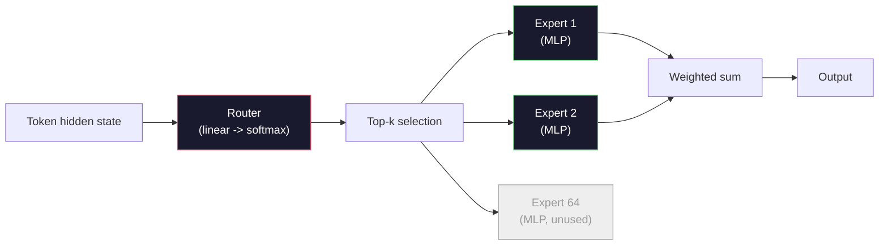

# खुले मॉडल: 架构讲解

> आप में भाग 04 课从零构建一个GPT-2 Small──2026 वर्ष के अग्रणी खुले मॉडल 属于同一家族,只是有五六项具体变化──使用RMSNorm 取代LayerNorm──使用SwiGLU 取代GELU──使用RoPE 取代学习的位置──使用GQA或MLA 取代完整MHA──使用大规模混合专家──你已经掌握了数学的覆盖95%──本会并排阅读Llama 3、DeepSeek-V3、Mixtral、Qwen 和 Gemma,并指出每个架构发生分歧的确切位置──

**Type:** Learn
**Languages:** Python (stdlib)
**Prerequisites:** Phase 10, Lessons 04, 05, 12 (Pre-training, Scaling, Inference)
**Time:** ~45 minutes

## 学习目标
- 阅读 Llama 3、Mistral、Mixtral、Gemma 2、Qwen 2.5 和 DeepSeek-V3 का कॉन्फ़िग.json,并解释每一个字段
- प्रत्येक मॉडल के संबंध में जीपीटी-2 छोटे किए गए विशिष्ट संरचनात्मक परिवर्तन, और प्रथम प्रकृति के सिद्धांत के कारण
- केवल विन्यास के आधार पर  गणना किसी भी खुले मॉडल के मानकों के संख्या、केवी कैश
-                                                                                                                                                                                                                                                               

## 问题
चौथे  कक्षा में, आपने 350 पंक्तियों के numpy को लिखा, एक GPT-2  आकार का मॉडल प्राप्त किया। लामा 3 405B में 200 पृष्ठों की तकनीकी रिपोर्ट है। आपका अंतर्ज्ञान शायद उन्हें अलग-अलग प्रजातियों के रूप में मानता है। वास्तव में यह नहीं है। यह 200 पृष्ठ एक ही वस्तु का वर्णन करते हैं, बस पांच से छह स्पष्ट संशोधन हैं, स्केलिंग के बारे में विस्तारित कार्यान्वयन विवरणों को जोड़ते हुए।

इस वर्ग में एक अंतर है। प्रत्येक प्रमुख खुले मॉडल के लिए परिवार, हम इसे GPT-2 के प्रति सटीक रूप से सूचीबद्ध करेंगे 改了什么、为什么改了、代价是什么── समाप्त होने के बाद, आप एक नया मॉडल कार्ड पढ़ सकते हैं, और इसे दिमाग में अनुवादित कर सकते हैं GPT-2 मूल लाइन में──

实际收益是: Meta 发布 Llama 5, या DeepSeek 发布 V4 时,你不需要新的心智模型──你会查看配置,看到哪些众所周知的旋被调动,然后知道下游影响是什么──2026 वर्ष का संरचना एक सीमित उपकरण盒──每一个新模型只是选择了不同的子集──

## 概念
### अपरिवर्तनीय मूल

सभी ऑटोरेग्रेसिव ओपन मॉडल साझा किए जाते हैंः

- टोकन एम्बेडिंग मैट्रिक्स ((वोकैब_साइज x छिपा_दिम)
- N 个 डिकोडर ब्लॉकों के संचयःनियमित,स्व-ध्यान,बाकी,नियमित,एमएलपी,बाकी
- अंतिम मानदंड 和投影到 vocab_size के रैखिक सिर (आमतौर पर एम्बेडमेंट्स के साथ वजन-बंद)
- कारण मुखौटा, अगले टोकन क्रॉस-एंट्रोपी हानि

यही रूप है। बाकी सब घूर्णन है।

### असली काम करने के लिए छह बटन

सभी 2024-2026 के अग्रिम खुले मॉडल में, इसी तरह छह डिजाइन विकल्प दोहराए दिखाई देते हैंः

1. **Normalization.**LayerNorm -> RMSNorm。
2. **Positional encoding.**पूर्ण -> RoPE(加上变体:YaRN、NTK)
3. **Activation.**GELU -> SwiGLU(या GeGLU)
4. **Attention head sharing.**एमएचए -> जीक्यूए -> एमक्यूए -> एमएलए。
5. **Dense vs sparse MLP.**घने -> विशेषज्ञों का मिश्रण──
6. **Pre-norm placement.**保持 पूर्व-नियमित──पोस्ट-नियमित 已消失──

其他一切(शिक्षा दर कार्यक्रम, डेटा मिश्रण, बैच आकार, संदर्भ लंबाई) सभी प्रशिक्षण कॉन्फ़िगरेशन के अंतर्गत आते हैं, और संरचना नहीं।

### बटन 1: RMSNorm

LayerNorm 会减减平均值、除以 std、缩放并平移──RMSNorm केवल संकुचन को बरकरार रखता हैः

```
RMSNorm(x) = x / sqrt(mean(x^2) + eps) * gamma
```

没有均值消除──没有偏见──每个代币少一次 matmul── Zhang and Sennrich (2019) 认为它在机器翻译上可以匹配LayerNorm,同时快 10%──所有现代开放模型都使用它──

代价:没有──收益:小幅吞吐量 提升,代码更简单──

### नट 2: रोपी

सीखे गए पदों के एम्बेडिंग में GPT-2 में एक 1024 槽位的搜找表── संदर्भ 1025 就超出表的末端──模型不能外推到训练长度之外──

रोटरी पोजीशन एम्बेडिंग (RoPE, Su et al. 2021) द्वारा ध्यान बिंदु उत्पाद  से पहले, प्रत्येक Q और K वेक्टर आकार के आयाम पर घूमने के लिए स्थिति में प्रवेश करेगा।

```
q_rotated = rotate(q, angle(pos))
k_rotated = rotate(k, angle(pos))
score = q_rotated . k_rotated
```

प्रत्येक Llama、Mistral、Qwen、DeepSeek 和 Gemma 都使用 RoPE──Gemma 2 使用混合方式(बहुत से परतें RoPE, अन्य परतें स्थानीय स्लाइडिंग-विंडो ध्यान का उपयोग करें)。

### घुड़सवार 3: SwiGLU

जीपीटी-2 का एमएलपी`x -> gelu(xW1 + b1) -> (...)W2 + b2`✿SwiGLU(Shazeer 2020) के साथ बंद उत्पाद 替换 सक्रियण:

```
SwiGLU(x) = (xW1) * sigmoid(xW1) * xV
```

两个并行投影,而不是一个, स्विश सक्रियण द्वारा 进行门――实证上, यह प्रत्येक参数 गुंतागुंती上更强――Llama 2 采用它, उसके बाद सभी ने अनुसरण किया――MLP के छिपे आकार को आमतौर पर सेट किया जाता है ताकि कुल参数 संख्या मूल घने MLP से मेल खाएः यदि GPT-2 उपयोग `ff_dim = 4 * hidden`,SwiGLU प्रयोग `ff_dim = (2/3) * 4 * hidden = 8/3 * hidden`

### चौथा बटनः ध्यान देने योग्य सिर साझा करना

GPT-2 使用 **Multi-Head Attention (MHA)**: प्रत्येक सिर का अपना Q  K  V प्रक्षेपण है

**Multi-Query Attention (MQA, Shazeer 2019)**सभी सिरों के बीच एक K और एक V को साझा करना  KV कैश  संख्या_सिरों के अनुसार  संकुचित करना, एक विशिष्ट मॉडल पर 12x से 32x तक की गिरावट है सटीकता में कठिनाई बेंचमार्क 

**Grouped-Query Attention (GQA, Ainslie et al. 2023)**यह मध्यक्रम है:G 组 Q heads 共享一个K 和一个V──Llama 3 8B GQA का प्रयोग करें, जिसमें 32 个Q heads 和 8 个KV heads(G=8), इसलिए相相比较完整MHA,KV cache 缩小4x──

**Multi-Head Latent Attention (MLA, DeepSeek 2024)**K और V को कम रैंक वाले साझा लटेंट में संकुचित करना, फिर से सिर पर दबाकर 投影回去── यह KV कैश को और कम करता है, जबकि प्रत्येक सिर की अभिव्यक्ति क्षमता को बरकरार रखता है──DeepSeek-V2 और V3 यह दीर्घ संदर्भ प्रदर्शन को प्राप्त करने पर निर्भर करता है──

| Scheme | KV Heads | KV Cache | Accuracy |
|--------|----------|----------|----------|
| MHA    | num_heads | full | 最好 |
| GQA    | num_groups (G < num_heads) | num_heads / G 缩减 | 接近 MHA |
| MQA    | 1 | num_heads 缩减 | 小幅损失 |
| MLA    | latent, per-head decompression | 小于 MQA | 接近 MHA |

 13B 参数 से अधिक के किसी भी मॉडल के लिए, GQA या MLA 实际上 सभी आवश्यक हैं बड़े पैमाने पर पूर्ण MHA KV कैश 灾难 का कारण बनेंगे

### नट 5: विशेषज्ञों का मिश्रण

घने MLP प्रत्येक टोकन के लिए  सक्रिय सभी तत्वों。 MoE MLP प्रत्येक ब्लॉक में K 个 विशेषज्ञ हैं, साथ ही एक राउटर, यह प्रत्येक टोकन के लिए  शीर्ष-k विशेषज्ञों का चयन करता है

```
router_logits = xW_r
indices, weights = top_k(router_logits, k=2)
output = sum_i weights[i] * expert[indices[i]](x)
```

吸引力在于: आप 64 个各自7B大小的专家可以有所以总参数巨大),但每个代币只运行其中2个所以每代币计算匹配密集 7B模型)  मिश्रित 8x7B 总参数为47B,但每个代币只激活13B──DeepSeek-V3 总参数为671B,但每个代币只激活37B──



优点: समान गणना 更多参数 更多强容量 缺点:विशेषज्ञ स्मृति 仍然必须放在某处所以服务 需要比密集等价模型更多的VRAM) 路由器的负载平衡 很难,而且在调整期间调整路由器 本身就是一个研究领域

### बटन 6: पूर्व-मानक रहता है

मूल ट्रांसफार्मर प्रत्येक उपपरत में  के बाद लागू परत मानदंडों  से GPT-2 से, प्रत्येक खुले मॉडल ने इसे प्रत्येक उपपरत में रखा है * पहले* 😇 पूर्व-मानदंडों  में गहराई प्रशिक्षण में कठोर और आसान 😇 कोई विवाद नहीं 😇

### मॉडल-दर-मॉडल अंतर

नीचे दी गई तालिका में सभी सामग्री को विशेष रूप से प्रस्तुत किया गया है।

| Model | Year | Total Params | Active Params | Norm | Activation | Position | Attention | MoE | Context |
|-------|------|-------------|---------------|------|-----------|----------|-----------|-----|---------|
| GPT-2 Small | 2019 | 124M | 124M | LayerNorm | GELU | Learned | MHA (12 heads) | no | 1k |
| Llama 3 8B | 2024 | 8B | 8B | RMSNorm | SwiGLU | RoPE | GQA (32/8) | no | 128k |
| Llama 3 70B | 2024 | 70B | 70B | RMSNorm | SwiGLU | RoPE | GQA (64/8) | no | 128k |
| Llama 3 405B | 2024 | 405B | 405B | RMSNorm | SwiGLU | RoPE | GQA (128/16) | no | 128k |
| Mistral 7B | 2023 | 7.2B | 7.2B | RMSNorm | SwiGLU | RoPE | GQA | no | 32k |
| Mixtral 8x7B | 2023 | 47B | 13B | RMSNorm | SwiGLU | RoPE | GQA | yes (8 experts, top-2) | 32k |
| Gemma 2 9B | 2024 | 9B | 9B | RMSNorm (pre+post) | GeGLU | RoPE + sliding | GQA | no | 8k |
| Qwen 2.5 72B | 2024 | 72B | 72B | RMSNorm | SwiGLU | RoPE (YaRN) | GQA (64/8) | no | 128k |
| DeepSeek V2 236B | 2024 | 236B | 21B | RMSNorm | SwiGLU | RoPE | MLA | yes (160 experts, top-6) | 128k |
| DeepSeek V3 | 2024 | 671B | 37B | RMSNorm | SwiGLU | RoPE | MLA | yes (256 experts, top-8) | 128k |

扫描这些列──RMSNorm 是通用──SwiGLU 或其GEGLU 近亲是通用──RoPE 是通用──7B 以上 GQA 是通用,除非被MLA 替代──MoE 是最高端模型的差异点──

### एक config.json पढ़ना

Llama 3 8B कॉन्फ़िगरेशनः

```
{
  "hidden_size": 4096,
  "intermediate_size": 14336,
  "num_hidden_layers": 32,
  "num_attention_heads": 32,
  "num_key_value_heads": 8,
  "max_position_embeddings": 131072,
  "rope_theta": 500000.0,
  "rms_norm_eps": 1e-5,
  "vocab_size": 128256
}
```

हर एक खंड आपके द्वारा प्राप्त किए गए कार्यों के लिए है।

- `hidden_size`: सम्मिलित आयाम
- `intermediate_size`: एमएलपी छिपा आकार(3.5x छिपा -- SwiGLU 数学) 』
- `num_hidden_layers`: स्टैक गहराई
- `num_attention_heads`: Q सिरों
- `num_key_value_heads`: KV हेड ((GQA)。
- `max_position_embeddings`: प्रशिक्षण संदर्भ लंबाई
- `rope_theta`: RoPE आधार आवृत्ति──मेटा इसे 10k पैमाने से 500k तक डिफ़ॉल्ट रूप से बढ़ाएगा, लंबी-संदर्भ निष्कर्षण हेतु──
- `rms_norm_eps`: संख्यात्मक स्थिरता。
- `vocab_size`: टोकन

 केवल इन के साथ, आप कुल तत्व संख्या, केवी कैश और शिखर मूल्य सक्रियण स्मृति की गणना कर सकते हैं`code/main.py`

### सक्रियण स्मृति बजट

कुछ अरब से अधिक तत्वों के बाद, सक्रियण प्रशिक्षण स्मृति को निर्देशित करेगा।

```
activation_mem ~ batch_size * seq_len * hidden_size * num_layers * bytes_per_element
```

对于Llama 3 8B,在批量1、seq 8192、BF16、32层、隐藏 4096 时:仅激活就约需要8GB(使用检查点),不使用则约40GB──这就是闪光注意和环环注意 重要原因:它们重写注意计算,让激活能够放下──

### KV कैश बजट

对于最大背景下下的推理:

```
kv_cache = 2 * num_layers * num_kv_heads * head_dim * max_seq_len * bytes_per_element
```

Llama 3 8B में 128k संदर्भ BF16 head_dim = छिपा / num_heads = 128 时:
`2 * 32 * 8 * 128 * 131072 * 2 = 17.2 GB`प्रत्येक अनुक्रम

8B वजन BF16 में 16 GB है। 128k अनुक्रम के एकल KV कैश वजन से भी बड़ा है। यह GQA, MLA और KV कैश क्वांटिज़ेशन के अध्ययन के मेमोरी दबाव को बढ़ावा देता है।

### जब प्रत्येक मॉडल जीतता है

- **单张 80GB GPU，无 MoE**                                                                                                                                                                                                                                                              
- **单节点（8x80GB），大 capacity**:Llama 3 70B、Qwen 2.5 72B── उच्चतम घने खुला क्षमता──
- **最大的 open capability，可接受 MoE 复杂度**:DeepSeek V3、मिश्रित 8x22B── प्रत्येक सक्रिय FLOP की क्षमता 最佳──
- **Long-context 需求**:Llama 3 ((ROPE स्केलिंग के माध्यम से  128k तक पहुंचें) DeepSeek ((MLA 优势) 👇
- **Low-latency serving**:Gemma 2 9B(स्लाइडिंग विंडो 降低 दीर्घ संदर्भ गणना)


```figure
rmsnorm-vs-layernorm
```

##  इसे निर्माण
इस वर्ग का कोड एक कैलकुलेटर है। किसी भी config.json को दिए गए, यह घटक विभाजन के अनुसार घटक के लिए प्रिंट करेगा।

```python
config = {
    "hidden_size": 4096, "intermediate_size": 14336,
    "num_hidden_layers": 32, "num_attention_heads": 32,
    "num_key_value_heads": 8, "vocab_size": 128256,
    "max_position_embeddings": 131072,
}
```

脚本会逐字段遍历架构,计算嵌入、注意(带 GQA कमी)、MLP(带 SwiGLU विस्तार)、层规范和头的参数──然后它会根据给定背景长度计算 KV缓存,并打印总结──

实现见 `code/main.py`

## इसका उपयोग करें
运行计算器,脚本中捆绑的Llama 3 8B、Mistral 7B、Mixtral 8x7B 和 DeepSeek V3 कॉन्फिग्स──比较参数分解──注意 MoE मॉडल के कुल参数远超密集型,但活参数数数往往更小──注意 DeepSeek V3 के KV कैश 虽然总参数更多,但却小于Llama 3 405B के KV कैश--这是 MLA का प्रभाव──

फिर अपने स्थानीय मॉडल के कॉन्फ़िग में डाल, सारांश पढ़ें, और यह तय करें कि यह आपके GPU के लिए उपयुक्त है या नहीं।

## 交付 यह
本课会生成 `outputs/skill-open-model-picker.md` एक तैनाती लक्ष्य निर्धारित करना (GPU प्रकार,VRAM, संदर्भ लंबाई, देरी बजट) और एक कार्य छवि (चैट, कोड, तर्क, दीर्घ-संदर्भ), यह एक खुले मॉडल, कक्षा 11 में क्वांटिज़ेशन योजना, साथ ही कक्षा 12 में निष्कर्ष स्टैक का सुझाव देगा, और स्पष्ट रूप से छह संरचनाओं के बारे में सुझाव देगा।

## अभ्यास
1.                                                                                                                                                                                                                                                               

2. डीप सर्च वी3 256 विशेषज्ञों का उपयोग करता है, शीर्ष 8 रूटिंग का उपयोग करता है, सक्रिय विशेषज्ञों का गणना करता है, कुल विशेषज्ञों के अनुपात के साथ, मिश्रित 8x7B के 8 में से शीर्ष 2 के साथ तुलना करता है, दुर्लभ से 25% तक, घनत्व से अधिक दुर्लभ तक, 3% तक, प्रति FLOP क्षमता का क्या मतलब है?

3. 计算 Llama 3 405B 128k संदर्भ में 下使用 FP8 和 BF16 时的 KV缓存──FP8 BF16 数值 का एक आधा है──在单个8xH100 节点上(每张 80GB = 总计 640GB,减重内存),你能服务多少的平行序列?

4. Gemma 2 交替使用全注意 和滑走窗-注意层──当一半层使用4096-टोकन滑走窗而不是全文文 context 时,写出KV缓存的数学公式──在8k कुल संदर्भ में 下能节省多少内存?

5.  एक हालिया अग्रिम खुला मॉडल ढूंढें जो इस कक्षा के लेखन के बाद प्रकाशित हुआ हो।  पहचानें कि उसने छह चक्रों में से कौन से चुने हैं, और क्या उसने सातवें चक्र को पेश किया है।  पाठ्यक्रम नए ढांचे में प्रकाशित होने के तुरंत बाद दिखाई दिया है -  लक्ष्य यह है कि न पुनर्निर्माण मानसिक मॉडल की शर्त पर अपना रूप अपडेट करें

## 关键术语
| Term | What people say | What it actually means |
|------|----------------|----------------------|
| RMSNorm | “没有均值的 LayerNorm” | 只按 root mean square 进行 normalize，并使用 learned scale -- 更便宜且可与 LayerNorm 相比 |
| RoPE | “Rotary positions” | 将每个 Q 和 K Vector 按 2D pairs 旋转，角度取决于 position -- 结合 scaling 技巧可外推到训练长度之外 |
| SwiGLU | “新的 MLP activation” | 带 Swish 的 gated linear unit：`(xW1) * sigmoid(xW1) * xV` -- 是每个 2024+ open model 的标准配置 |
| GQA | “中间路线 attention” | Grouped-Query Attention：G 组 Q heads 共享一个 K 和一个 V head -- 在避免 MQA accuracy 损失的同时缩小 KV cache |
| MLA | “DeepSeek 的 attention” | Multi-Head Latent Attention：将 K/V 压缩到共享 low-rank latent，再按 head 解压 -- 大模型中最小的 KV cache |
| MoE | “Sparse experts” | Mixture of Experts：每个 block 有 N 个 MLPs，router 为每个 Token 选择 top-k -- 巨大的 total params，较小的 active params |
| Top-k routing | “每个 Token 选择 k 个 experts” | Router 为每个 expert 计算分数，并激活最高的 k 个 -- 典型 k 从 2（Mixtral）到 8（DeepSeek） |
| YaRN | “拉伸 RoPE” | Yet another RoPE extension -- 通过插值 rotary angles，在 inference 时将 context 从 8k 扩展到 128k+ |
| Sliding-window attention | “不要 attend to everything” | 每个 Token 只 attend 到最近 W 个 Tokens -- 将 attention cost 限制为每 Token O(W)，用于 Gemma 2 和早期 Mistral |
| Active params | “每个 Token 实际运行的部分” | 对于 MoE models，指每个 Token 会经历 forward pass 的参数量（远小于 total params）-- 决定 per-token FLOPs |

## 延伸阅读
- [Dubey et al., 2024 -- "The Llama 3 Herd of Models"](https://arxiv.org/abs/2407.21783)-- घने लामा 3 परिवार के ढांचे और प्रशिक्षण संदर्भ
- [DeepSeek-AI, 2024 -- "DeepSeek-V3 Technical Report"](https://arxiv.org/abs/2412.19437)-- MLA加 सहायक-हानि-मुक्त भार संतुलन 加 671B MoE
- [Jiang et al., 2024 -- "Mixtral of Experts"](https://arxiv.org/abs/2401.04088)-- 经典 मोई ओपन मॉडल 论文
- [Su et al., 2021 -- "RoFormer: Enhanced Transformer with Rotary Position Embedding"](https://arxiv.org/abs/2104.09864)-- RoPE 论文
- [Shazeer, 2020 -- "GLU Variants Improve Transformer"](https://arxiv.org/abs/2002.05202)-- SwiGLU、GeGLU 及相关方法
- [Ainslie et al., 2023 -- "GQA: Training Generalized Multi-Query Transformer Models"](https://arxiv.org/abs/2305.13245)-- GQA 论文
- [Gemma 2 Team, 2024 -- "Gemma 2: Improving Open Language Models at a Practical Size"](https://arxiv.org/abs/2408.00118)-- हाइब्रिड पूर्ण+स्लाइडिंग ध्यान
- [Qwen Team, 2024 -- "Qwen 2.5 Technical Report"](https://arxiv.org/abs/2412.15115)-- YaRN संदर्भ विस्तार तथा दीर्घ संदर्भ प्रशिक्षण व्यंजन
