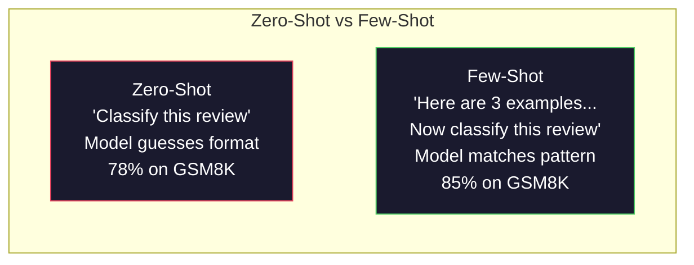
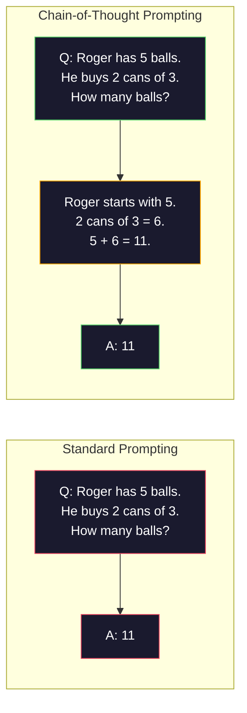
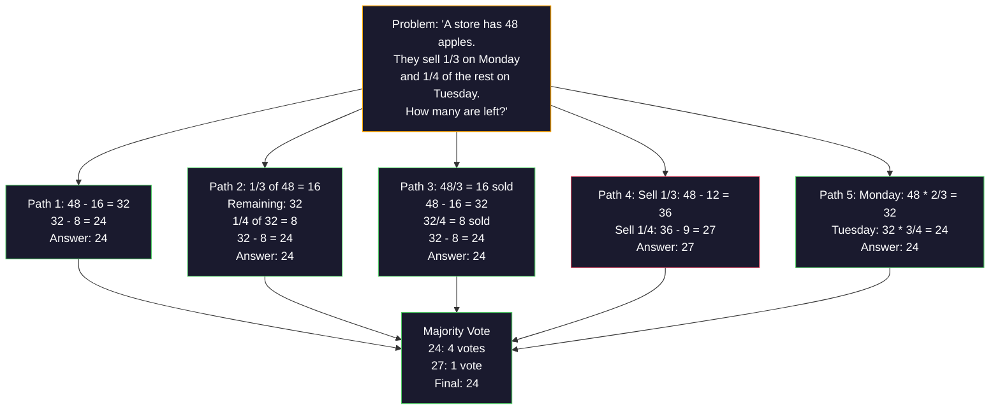
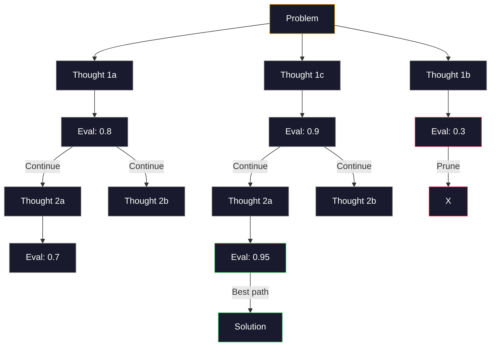

# कुछ शॉट-चैन-ऑफ-थिंग-ट्री-ऑफ-थिंग

>  बताओ मॉडल को क्या करना है  बताओ उसे कैसे सोचने के लिए इंजीनियरिंग है  एक ही मॉडल  एक ही कार्य  एक ही डेटा, 78% से 91%  सटीकता दर अंतर, बेहतर मॉडल नहीं है, बल्कि बेहतर तर्क रणनीति 

**类型：**构建
**语言：**पायथन
**先修要求：**पाठ 11.01 (प्रोम्प्ट इंजीनियरिंग)
**时间：** 45 मिनट

## 学习目标

- विकल्प और प्रारूपण उदाहरण प्रदर्शन के माध्यम से कुछ-शॉट प्रलोभन को प्राप्त करने के लिए, ताकि अधिकतम कार्य सटीकता दर
- अनुप्रयोग सोच श्रृंखला (सीओटी) 推理, सुधारित गणित अनुप्रयोग विषय आदि कई चरणों के प्रश्नों की सटीकता दर
- 构建树思路,探索多条推理路径并选择最佳路径
- मानक बेंचमार्क में शून्य-शॉट, कुछ-शॉट और सीओटी के साथ आने वाली सटीकता दर में वृद्धि

## 问题

आप एक गणित सलाहकार ऐप बना रहे हैं। आपका प्रॉम्प्ट लिखता हैः  इस शब्द समस्या को हल करें।  GSM8K में इस मानक लघु गणित बेंचमार्क पर, GPT-5 में 94% समय है।

加上五个词 चलो सोचें कदम से कदम सटीकता दर बढ़कर 91% तक हो जाए कुछ और उदाहरणों के साथ पूर्ण समाधान, हम 95% तक पहुंच सकते हैं

यह हैक नहीं है। यह हैक का काम करने का तरीका। मनुष्य एक बार में कई चरणों की समस्या को हल करने के लिए एक बार में नहीं कूदता है। ट्रांसफार्मर भी नहीं होगा। जब आप मॉडल को मध्य टोकन उत्पन्न करने के लिए मजबूर करते हैं, तो ये टोकन अगले टोकन के ऊपर नीचे होंगे। प्रत्येक चरण में विचार करने के लिए अगले चरण में होगा। मॉडल वास्तव में उत्तर का गणना करने के लिए एक कदम से अधिक है।

लेकिन चारने के लिए कदम  सिर्फ शुरुआत है, न कि अंत  यदि आप चार सुझाव पथ का प्रयोग करते हैं, तो बहुमत का मतदान कैसे होगा? यदि आप एक संभावना के पेड़ का पता लगाने के लिए एक मॉडल बनाते हैं, तो मूल्यांकन और शाखाओं का निर्धारण कैसे होगा? यदि आप तर्क और उपकरणों का उपयोग करते हैं तो क्या होगा? ये सभी परिकल्पना नहीं हैं। वे पहले से ही प्रकाशित हैं 

## 核心概念

### शून्य शॉट बनाम कुछ शॉटः उदाहरण何时胜过指令

शून्य-शॉट प्रलोभन केवल मॉडल को एक कार्य देता है, इसके अलावा कुछ भी नहीं देता है।

Wei et al. (2022) ने 8 बेंचमार्क में इस बिंदु का माप किया है। सरल कार्यों जैसे कि भावनात्मक वर्ग, शून्य-शॉट और कुछ-शॉट के प्रदर्शन में अंतर 2% के भीतर है।

直觉是: उदाहरण संपीड़न के बाद का निर्देश है। इसका वर्णन आउटपुट प्रारूप से नहीं होता, प्रत्यक्ष प्रदर्शन से नहीं होता। इसका व्याख्या तर्क प्रक्रिया से होता है, प्रत्यक्ष प्रदर्शन से नहीं होता।



**few-shot 适合的场景：**ढाँचा संवेदनशील कार्यों, वर्गीकरण, संरचनात्मक निकासी, क्षेत्र विशेष शब्द, तथा किसी भी मॉडल के लिए आवश्यक है जो विशिष्ट मोड के अनुरूप है।

**zero-shot 适合的场景：**简单事实问题, 举例会限制创造力创意任务,以及找到好例比写好指令更难的任务――

### उदाहरण चुनें: समान रूप से जीतने के लिए

सभी उदाहरण समान नहीं हैं। चयन और लक्ष्य प्रविष्टि के समान उदाहरण, क्रमबद्ध कार्य पर 5-15% से अधिक का चयन करते हैं।

1. **语义相似性**:选择 एम्बेडिंग 空间中最接近输入 का उदाहरण
2. **标签多样性**: सभी आउटपुट वर्गों को कवर करने के लिए उदाहरण
3. **难度匹配**: लक्ष्य के अनुरूप समस्या की जटिलता स्तर

अधिकांश कार्यों के लिए, सर्वोत्तम उदाहरणों की संख्या 3-5 ⋅ से कम है, मॉडल में पर्याप्त संकेत निकास मॉडल नहीं है, 5 ⋅ से अधिक समय, लाभ घटता है, और संदर्भ विंडो टोकन बर्बाद नहीं होता है।

### विचार श्रृंखलाः मॉडल草稿纸 को दे

विचार श्रृंखला (CoT) द्वारा Google Brain के Wei et al. द्वारा प्रस्तावित विचार बहुत सरल हैः केवल मॉडल को उत्तर देने की आवश्यकता नहीं है, बल्कि पहले इसे सुझावात्मक चरणों को प्रदर्शित करने की आवश्यकता है।



तंत्र से देखिये, यह क्यों प्रभावी है? ट्रांसफार्मर उत्पन्न होने वाले प्रत्येक टोकन को अगले टोकन के ऊपर नीचे बनाया जाएगा। बिना CoT  के, मॉडल को सभी तर्क को एक बार आगे के पास की छिपी हुई स्थिति में संपीड़ित करना होगा। CoT के साथ, मॉडल को मध्य गणना को टोकन में बाहर करना होगा। प्रत्येक तर्क टोकन को प्रभावी गणना गहराई में विस्तारित करना होगा।

**GSM8K benchmark（小学数学，8.5K 道题）：**

| Model | Zero-Shot | Zero-Shot CoT | Few-Shot CoT |
|-------|-----------|---------------|--------------|
| GPT-4o | 78% | 91% | 95% |
| GPT-5 | 94% | 97% | 98% |
| o4-mini (reasoning) | 97% | — | — |
| Claude Opus 4.7 | 93% | 97% | 98% |
| Gemini 3 Pro | 92% | 96% | 98% |
| Llama 4 70B | 80% | 89% | 94% |
| DeepSeek-V3.1 | 89% | 94% | 96% |

**关于 reasoning models 的说明。**OpenAI की O-सीरीज ((o3、o4-mini) और DeepSeek-R1 等 मॉडल in输出答案前在内部运行链-of-thought── प्रति तर्क मॉडल 添加 Let's think step by step is repeated, sometimes even adapt to its counterवे पहले ही कर चुके हैं──

सीओटी के दो प्रकार हैंः

**Zero-shot CoT**                                                                                                                                                                                                                                                              

**Few-shot CoT**: सुझावात्मक चरणों के उदाहरण प्रदान करना। यह शून्य-शॉट सीओटी से अधिक प्रभावी है, क्योंकि मॉडल आपके अपेक्षित सटीक सुझावात्मक प्रारूप को देख सकता है।

**CoT 会伤害表现的场景**:简单事实回忆(फ्रांस की राजधानी क्या है?) 、单步分类、速度比准确率更重要任务──CoT प्रत्येक पूछताछ में 50-200 推理 टोकन के खुलने का विस्तार होगा──高吞吐、低复杂性任务 के लिए, यह एक अपशिष्ट लागत──

### स्व-समन्वितः कई बार, एक बार मतदान

वांग और अन्य (2023) ने आत्म-समर्पण प्रस्तावित किया। केंद्रीय धारणा यह है कि एक एकल कोट पथ में गलतियों का अनुमान लगाया जा सकता है।



मूल PaLM 540B प्रयोग में, आत्म-समर्पण GSM8K 准确率 को 56.5% से बढ़ाकर N=40 के 74.4% तक बढ़ाएगा। GPT-5 में ऊपर बहुत छोटा  97% से 98% तक बढ़ गया है, क्योंकि आधारभूत सटीकता दर 和  के करीब है। इस तकनीक के सबसे उपयुक्त आधारभूत CoT 准确率 60-85% के मॉडल में है। यह एकल पथ त्रुटि अक्सर होती है लेकिन गैर-व्यवस्थितिक त्रुटि के लिए एक मिठाई क्षेत्र है। तर्क के लिए ओ-सीरीज़  R1), आत्म-समर्पण  अंतर्निहित आंतरिक अनुकूलन शामिल है।

权衡是:N 个样本意味着N 倍 API 成本和延迟―― व्यवहार में,N=5 能获得大部分收益――N=3是有意义的投票的最低值――大多数任务来说,N >10 收益递减――

### विचार का वृक्ष:分支式探索

याओ और अन्य (2023) ने विचार के पेड़ (ToT) को प्रस्तावित किया। CoT एक लाइनर विचार पथ के साथ आगे बढ़ेगा, जबकि ToT कई शाखाओं का पता लगाएगा और आगे बढ़कर मूल्यांकन करेगा कि कौन सी शाखाएं सबसे अधिक संभावनाएं हैं।



इसमें तीन घटक हैंः

1. **Thought generation**: उत्पन्न多个候选人 अगला कदम
2. **State evaluation**: लिए प्रत्येक उम्मीदवार打分(आप LLM 自身 को मूल्यांकन यंत्र के रूप में उपयोग कर सकते हैं)
3. **Search algorithm**बीएफएस या डीएफएस के माध्यम से वृक्षों में से एक से एक के माध्यम से

24 任务中 ({{lang-en:GPT-4}}) का प्रयोग करने के लिए, मानक उत्तेजना के GPT-4 हल करने की दर 7.3% है।

 बहुत महंगी  पेड़ के प्रत्येक खंड को एक बार LLM का उपयोग करने की आवश्यकता होती है  3 के लिए  3 के लिए  3 के लिए  3 के लिए  3 के लिए  3 के लिए  3 के लिए  3 के लिए  3 के लिए  3 के लिए  3 के लिए  3 के लिए  3 के लिए  3 के लिए  3 के लिए  3 के लिए  3 के लिए  3 के लिए  3 बार  3 के लिए  3 के लिए  3 के लिए  3 के लिए  3 के लिए   3 के लिए                                                                                                                                                                                     

### प्रतिक्रियाःविचार + कार्य

याओ और अन्य (2022) अनुमानित रस्ते और क्रियाओं को जोड़ेंगे।

```mermaid
graph LR
    Q["Question:\nWhat is the\npopulation of the\ncountry where\nthe Eiffel Tower\nis located?"]
    T1["Thought: I need to\nfind which country\nhas the Eiffel Tower"]
    A1["Action: search\n'Eiffel Tower location'"]
    O1["Observation:\nParis, France"]
    T2["Thought: Now I need\nFrance's population"]
    A2["Action: search\n'France population 2024'"]
    O2["Observation:\n68.4 million"]
    T3["Thought: I have\nthe answer"]
    F["Answer:\n68.4 million"]

    Q --> T1 --> A1 --> O1 --> T2 --> A2 --> O2 --> T3 --> F

    style Q fill:#1a1a2e,stroke:#ffa500,color:#fff
    style T1 fill:#1a1a2e,stroke:#51cf66,color:#fff
    style A1 fill:#1a1a2e,stroke:#e94560,color:#fff
    style O1 fill:#1a1a2e,stroke:#808080,color:#fff
    style T2 fill:#1a1a2e,stroke:#51cf66,color:#fff
    style A2 fill:#1a1a2e,stroke:#e94560,color:#fff
    style O2 fill:#1a1a2e,stroke:#808080,color:#fff
    style T3 fill:#1a1a2e,stroke:#51cf66,color:#fff
    style F fill:#1a1a2e,stroke:#51cf66,color:#fff
```



ReAct ज्ञान घनी प्रकार के कार्यों में शुद्ध CoT से बेहतर है, क्योंकि यह वास्तविक डेटा में निर्धारित तर्क को समायोजित कर सकता है। HotpotQA में, GPT-4 के ReAct का उपयोग 35.1% सटीक मैच तक पहुंचता है, जबकि एकल CoT 29.4% है। वास्तविक शक्ति में, तर्क त्रुटि अवलोकन द्वारा बनाई गई है।

ReAct आधुनिक AI एजेंटों का आधार है। प्रत्येक एजेंट फ्रेमवर्क (LangChain, CrewAI, AutoGen) किसी न किसी प्रकार के विचार-क्रिया-निरीक्षण चक्र परिवर्तनों को पूरा करेगा।

### संरचित प्रमोटिंग:एक्सएमएल टैग,सीमांकन, हेडर

संरचना 变复杂, संरचना能防止模型混不同部分──三种方法:

**XML tags**(सबसे उपयुक्त क्लाउड, सभी जगह में स्थिर):
```
<context>
You are reviewing a pull request.
The codebase uses TypeScript and React.
</context>

<task>
Review the following diff for bugs, security issues, and style violations.
</task>

<diff>
{diff_content}
</diff>

<output_format>
List each issue with: file, line, severity (critical/warning/info), description.
</output_format>
```

**Markdown headers**(通用):
```
## Role
Senior security engineer at a fintech company.

## Task
Analyze this API endpoint for vulnerabilities.

## Input
{api_code}

## Rules
- Focus on OWASP Top 10
- Rate each finding: critical, high, medium, low
- Include remediation steps
```

**Delimiters**(极简但有效):
```
---INPUT---
{user_text}
---END INPUT---

---INSTRUCTIONS---
Summarize the above in 3 bullet points.
---END INSTRUCTIONS---
```

### शीघ्र श्रृंखलाः顺序分解

कुछ कार्य एक ही संकेत पर बहुत जटिल हैं। शीघ्र श्रृंखला उन्हें कई चरणों में तोड़ देगी, जिनमें से एक शीघ्र के प्रवेश का अगला शीघ्र के प्रवेश बन जाएगा।


चेनिंग 优于单速 有三个原因:

1. **每一步更简单**मॉडल एक फोकस कार्य को संभालता है, एक ही समय में सभी चीजों को ध्यान में रखते हुए नहीं
2. **中间输出可检查**आप चरणों के बीच सत्यापन और सुधार कर सकते हैंः
3. **不同步骤可以使用不同模型**सस्ते मॉडल से निकालना, महंगे मॉडल से परामर्श करना

### प्रदर्शन के प्रति

| Technique | Best For | GSM8K Accuracy (GPT-5) | API Calls | Token Overhead | Complexity |
|-----------|----------|------------------------|-----------|----------------|------------|
| Zero-Shot | 简单任务 | 94% | 1 | 无 | 极低 |
| Few-Shot | 格式匹配 | 96% | 1 | 200-500 tokens | 低 |
| Zero-Shot CoT | 快速推理提升 | 97% | 1 | 50-200 tokens | 极低 |
| Few-Shot CoT | 最高单次调用准确率 | 98% | 1 | 300-600 tokens | 低 |
| Self-Consistency (N=5) | 高风险推理 | 98.5% | 5 | 5x token cost | 中 |
| Reasoning model (o4-mini) | CoT 的直接替代 | 97% | 1 | hidden (2-10x internal) | 极低 |
| Tree-of-Thought | 搜索/规划问题 | N/A (74% on Game of 24) | 10-40+ | 10-40x token cost | 高 |
| ReAct | 基于知识的推理 | N/A (35.1% on HotpotQA) | 3-10+ | 可变 | 高 |
| Prompt Chaining | 复杂多步骤任务 | 96% (pipeline) | 2-5 | 2-5x token cost | 中 |

सही तकनीक तीन कारकों पर निर्भर करती हैः सटीकता दर आवश्यकताएँ, देरी बजट और लागत सहिष्णुता। अधिकांश उत्पादन प्रणालियों के लिए, कुछ शॉट सीओटी और 3 नमूने आत्म-समरूपता गिरावट 90% उपयोग के मामलों को कवर कर सकती है।


```figure
few-shot-curve
```

##  इसे निर्माण

हम एक गणितीय प्रश्न खोजकर्ता का निर्माण करेंगे, कुछ शॉट के लिए विचार के लिए प्रेरित करेंगे, विचार के श्रृंखला को बनाएंगे, और स्वयं-समरूपता के लिए मतदान करेंगे, एक पाइपलाइन को बनाएंगे।

 पूर्णता में `code/advanced_prompting.py`मध्य ः नीचे है ।

### 步骤 1: कुछ शॉट उदाहरण स्टोर

प्रथम घटक प्रबंधन कुछ शॉट उदाहरण,并为给定问题选择最相关的示例──

```python
GSM8K_EXAMPLES = [
    {
        "question": "Janet's ducks lay 16 eggs per day. She eats three for breakfast every morning and bakes muffins for her friends every day with four. She sells every egg at the farmers' market for $2. How much does she make every day at the farmers' market?",
        "reasoning": "Janet's ducks lay 16 eggs per day. She eats 3 and bakes 4, using 3 + 4 = 7 eggs. So she has 16 - 7 = 9 eggs left. She sells each for $2, so she makes 9 * 2 = $18 per day.",
        "answer": "18"
    },
    ...
]
```

प्रत्येक उदाहरण में तीन भाग होते हैंः प्रश्न, सुझाव और अंतिम उत्तर।

### 步骤 2: सोच के श्रृंखला प्रोंप्ट बिल्डर

शीघ्र बिल्डर सिस्टम संदेशों को प्रस्तुत करेगा, साथ ही कुछ उदाहरणों को प्रस्तुत करेगा, साथ ही लक्ष्य प्रश्नों को एक शीघ्र में संरेखित करेगा।

```python
def build_cot_prompt(question, examples, num_examples=3):
    system = (
        "You are a math problem solver. "
        "For each problem, show your step-by-step reasoning, "
        "then give the final numerical answer on the last line "
        "in the format: 'The answer is [number]'."
    )

    example_text = ""
    for ex in examples[:num_examples]:
        example_text += f"Q: {ex['question']}\n"
        example_text += f"A: {ex['reasoning']} The answer is {ex['answer']}.\n\n"

    user = f"{example_text}Q: {question}\nA:"
    return system, user
```

格式约束(  उत्तर [संख्या])至关重要──没有它,自连性就无法跨样本抽取并比较答案──

### 步骤 3:स्वतः संगतता मतदान

采样 N 条推理路径,并取多数答案──

```python
def self_consistency_solve(question, examples, client, model, n_samples=5):
    system, user = build_cot_prompt(question, examples)

    answers = []
    reasonings = []
    for _ in range(n_samples):
        response = client.chat.completions.create(
            model=model,
            messages=[
                {"role": "system", "content": system},
                {"role": "user", "content": user}
            ],
            temperature=0.7
        )
        text = response.choices[0].message.content
        reasonings.append(text)
        answer = extract_answer(text)
        if answer is not None:
            answers.append(answer)

    vote_counts = Counter(answers)
    best_answer = vote_counts.most_common(1)[0][0] if vote_counts else None
    confidence = vote_counts[best_answer] / len(answers) if best_answer else 0

    return best_answer, confidence, reasonings, vote_counts
```

तापमान 0.7  बहुत महत्वपूर्ण है  तापमान 0.0  में, सभी N  नमूने एक ही होंगे, इस प्रकार अर्थ खो देंगे  आपको विभिन्न विचार पथ उत्पन्न करने के लिए पर्याप्त अयोग्यता की आवश्यकता होगी, लेकिन फिर से अयोग्यता नहीं हो सकती है ताकि मॉडल आउटपुट हो।

### 步骤 4: विचार के पेड़ के समाधान

                                                                                                                                                                                                                                                              

```python
def tree_of_thought_solve(question, client, model, breadth=3, depth=3):
    thoughts = generate_initial_thoughts(question, client, model, breadth)
    scored = [(t, evaluate_thought(t, question, client, model)) for t in thoughts]
    scored.sort(key=lambda x: x[1], reverse=True)

    for current_depth in range(1, depth):
        next_thoughts = []
        for thought, score in scored[:2]:
            extensions = extend_thought(thought, question, client, model, breadth)
            for ext in extensions:
                ext_score = evaluate_thought(ext, question, client, model)
                next_thoughts.append((ext, ext_score))
        scored = sorted(next_thoughts, key=lambda x: x[1], reverse=True)

    best_thought = scored[0][0] if scored else ""
    return extract_answer(best_thought), best_thought
```

评估器本身也是一次LLM 调用──你问模型:0.0 से 1.0 के पैमाने पर, समस्या को हल करने के लिए यह तर्क पथ कितना आशाजनक है?

### 步骤 5: पूर्ण पाइपलाइन

पाइपलाइन 通过升级策略组合所有技术――

```python
def solve_with_escalation(question, examples, client, model):
    system, user = build_cot_prompt(question, examples)
    single_response = call_llm(client, model, system, user, temperature=0.0)
    single_answer = extract_answer(single_response)

    sc_answer, confidence, _, _ = self_consistency_solve(
        question, examples, client, model, n_samples=5
    )

    if confidence >= 0.8:
        return sc_answer, "self_consistency", confidence

    tot_answer, _ = tree_of_thought_solve(question, client, model)
    return tot_answer, "tree_of_thought", None
```

升级逻辑:先尝试便宜方案(单次 CoT)  यदि आत्म-समर्पण आत्मविश्वास 低于0.8(5 个样本中低于4 个一致), तो ToT  तक升级── इस प्रकार लागत और सटीकता दर  अधिकांश समस्याएं便宜地 हल होंगी, समस्याएं अधिक गणना प्राप्त होंगी──

## इसका उपयोग करें

### लैंगचेन के साथ

LangChain के लिए त्वरित टेम्पलेट्स और आउटपुट पार्सिंग  प्रदान इनपुट समर्थन,能简化 कुछ शॉट और CoT पैटर्नः

```python
from langchain_core.prompts import FewShotPromptTemplate, PromptTemplate
from langchain_openai import ChatOpenAI

example_prompt = PromptTemplate(
    input_variables=["question", "reasoning", "answer"],
    template="Q: {question}\nA: {reasoning} The answer is {answer}."
)

few_shot_prompt = FewShotPromptTemplate(
    examples=examples,
    example_prompt=example_prompt,
    suffix="Q: {input}\nA: Let's think step by step.",
    input_variables=["input"]
)

llm = ChatOpenAI(model="gpt-4o", temperature=0.7)
chain = few_shot_prompt | llm
result = chain.invoke({"input": "If a train travels 120 km in 2 hours..."})
```

लैंगचेन का उपयोग भाषा के समानार्थी चयन के लिए भी किया जाता है।`ExampleSelector`वर्गः

```python
from langchain_core.example_selectors import SemanticSimilarityExampleSelector
from langchain_openai import OpenAIEmbeddings

selector = SemanticSimilarityExampleSelector.from_examples(
    examples,
    OpenAIEmbeddings(),
    k=3
)
```

### डीएसपीपी के साथ

DSPy रणनीति 视为可优化模块──你无需手写CoT प्रम्प्ट्स,而是定义一个签名,然后让 DSPy 优化提示:

```python
import dspy

dspy.configure(lm=dspy.LM("openai/gpt-4o", temperature=0.7))

class MathSolver(dspy.Module):
    def __init__(self):
        self.solve = dspy.ChainOfThought("question -> answer")

    def forward(self, question):
        return self.solve(question=question)

solver = MathSolver()
result = solver(question="Janet's ducks lay 16 eggs per day...")
```

डीएसपीई `ChainOfThought`मैं अपने आप को एक मार्ग जोड़ना होगा`dspy.majority`स्व-समन्वितता प्राप्त करनाः

```python
result = dspy.majority(
    [solver(question=q) for _ in range(5)],
    field="answer"
)
```

### तुलनाः स्क्रैच बनाम फ्रेमवर्क

| Feature | From-Scratch (this lesson) | LangChain | DSPy |
|---------|--------------------------|-----------|------|
| 对 prompt format 的控制 | 完全控制 | 基于 template | 自动 |
| Self-consistency | 手动投票 | 手动 | 内置（`dspy.majority`） |
| Example selection | 自定义逻辑 | `ExampleSelector` | `dspy.BootstrapFewShot` |
| Tree-of-Thought | 自定义 tree search | Community chains | 未内置 |
| Prompt optimization | 手动迭代 | 手动 | 自动编译 |
| 最适合 | 学习、自定义 pipelines | 标准 workflows | 研究、优化 |

## 交付 यह

इस वर्ग में दो कलाकृतियां उत्पन्न हुई हैं।

**1. Reasoning Chain Prompt**(`outputs/prompt-reasoning-chain.md`): एक उत्पादन के लिए तैयार शीघ्र टेम्पलेट, आत्म-समर्पण के साथ उपयोग के लिए कुछ शॉट CoT── अपने उदाहरण और समस्या क्षेत्र में संलग्न है।

**2. CoT Pattern Selection Skill**(`outputs/skill-cot-patterns.md`): एक निर्णय ढांचा, जो कार्य प्रकारों, सटीकता दर आवश्यकताओं और लागत के लिए उपयुक्त सुझाव तकनीक का चयन करने के लिए उपयोग किया जाता है।

## अभ्यास

1. **衡量差距**: 10 मार्गों से GSM8K 题──分别用零射,少射,零射 CoT 和少射 CoT 解每一题──记录每种方法的准确率──哪种技术在你的模型上带来最大提升?

2. **示例选择实验**उदाहरणों की तुलना में उदाहरणों की संख्या से उदाहरण की गुणवत्ता अधिक महत्वपूर्ण है।

3. **Self-consistency 成本曲线**: 20 मार्गों पर GSM8K 题 पर N=1、3、5、7、10 运行自一致性──绘制准确率 vs 成本(总 टोकन)── आपके मॉडल के लिए, वक्र के वक्र बिंदु कहाँ हैं?

4. **构建 ReAct loop**: कैलकुलेटर उपकरण के साथ  विस्तार पाइपलाइन── जब मॉडल उत्पन्न गणितीय अभिव्यक्ति, के साथ पायथन `eval()`(सैंडबॉक्स में) इसे निष्पादित करें, परिणामों को उलट-पुलट करें।

5. **ToT 用于创意任务**:将 Tree-of-Thought solver 改造用于创意写作任务:एक 6 शब्द की कहानी लिखें जो मजाकिया और दुखद दोनों हो। LLM का उपयोग 作为评估器──分支式探索是否比单 shot पीढ़ी 产生更好的创意输出?

## 关键术语

| Term | 人们通常说 | 实际含义 |
|------|----------------|----------------------|
| Few-shot prompting | “给它一些示例” | 在 prompt 中包含 input-output demonstrations，用于锚定模型的输出格式和行为 |
| Chain-of-Thought | “让它一步步思考” | 引出中间推理 Token，在生成最终答案前延长模型的有效计算 |
| Self-Consistency | “多运行几次” | 在 temperature > 0 下采样 N 条多样推理路径，并通过多数投票选择最常见的最终答案 |
| Tree-of-Thought | “让它探索选项” | 对推理分支进行结构化搜索，每个部分解法都会被评估，只有有前景的路径会被扩展 |
| ReAct | “思考 + 工具使用” | 在 Thought-Action-Observation loop 中交织推理轨迹与外部动作（搜索、计算、API calls） |
| Prompt chaining | “拆成步骤” | 将复杂任务分解为顺序 prompts，每一步输出都会馈入下一步输入 |
| Zero-shot CoT | “只加上 ‘think step by step’” | 不提供任何示例，只在 prompt 后追加推理触发短语，依赖模型的潜在推理能力 |

## 延伸阅读

- [Chain-of-Thought Prompting Elicits Reasoning in Large Language Models](https://arxiv.org/abs/2201.11903)-- Wei et al. 2022──Google Brain का मूल CoT论文──阅读第 2-3节了解核心结果──
- [Self-Consistency Improves Chain of Thought Reasoning in Language Models](https://arxiv.org/abs/2203.11171)-- वांग और सहयोगियों 2023── स्व-समरूपता 论文──表 1
- [Tree of Thoughts: Deliberate Problem Solving with Large Language Models](https://arxiv.org/abs/2305.10601)-- Yao et al. 2023──ToT 论文──第 4 节的24 का खेल 结果是亮点──
- [ReAct: Synergizing Reasoning and Acting in Language Models](https://arxiv.org/abs/2210.03629)-- Yao et al. 2022── आधुनिक AI एजेंटों का आधार──第 3 节 समझाया विचार-क्रिया-निरीक्षण लूप──
- [Large Language Models are Zero-Shot Reasoners](https://arxiv.org/abs/2205.11916)-- कोजीमा et al. 2022── आइए इस पर विचार करें  论文── इस तरह के सरल तरीके से अपेक्षित परिणाम प्राप्त किये गये हैं──
- [DSPy: Compiling Declarative Language Model Calls into Self-Improving Pipelines](https://arxiv.org/abs/2310.03714)-- Khattab et al. 2023──will prompting 视为编译问题──यदि आप सोच रहे हैं कि आप ज्यादा से ज्यादा हाथ से प्रम्प्ट इंजीनियरिंग कर रहे हैं, तो इसे पढ़ना चाहिए──
- [OpenAI — Reasoning models guide](https://platform.openai.com/docs/guides/reasoning)-- 关于何时链-of-thought会从快速-level trick 变成内部 根据 टोकन 计价 理性 模式的供应商指导
- [Lightman et al., "Let's Verify Step by Step" (2023)](https://arxiv.org/abs/2305.20050)-- प्रक्रिया पुरस्कार मॉडल (पीआरएम), जो कि श्रृंखला में प्रत्येक चरण में उपयोग किया जाता है; यह केवल परिणाम पुरस्कारों की तुलना में अधिक सफल है।
- [Snell et al., "Scaling LLM Test-Time Compute Optimally" (2024)](https://arxiv.org/abs/2408.03314)-- कोट 长度、自相一致ता नमूनाकरण तथा MCTS के प्रणालीगत अध्ययन के लिए, जब सटीकता दर से देरी अधिक महत्वपूर्ण है, तो कदम से कदम                                                                                                                                                                                                                                             
