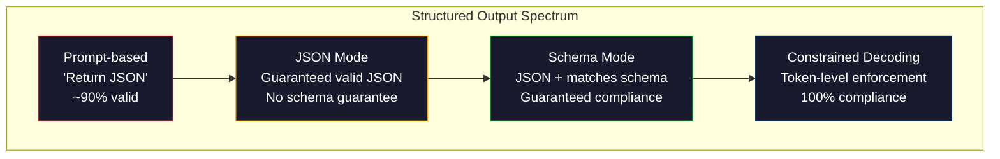
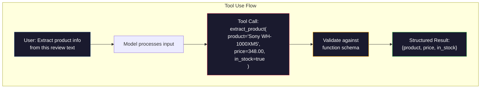

# 结构化输出:JSON、Schema Validation、Constrained Decoding

> आपका LLM  वापसी है字符串──आपके आवेदन की आवश्यकता है JSON── यह गिरावट से उत्पादन प्रणाली के पतन का कारण बनती है, किसी भी मॉडल से अधिक है कल्पना करना── संरचनात्मक आउटपुट प्राकृतिक भाषा और वर्गीकरण डेटा के बीच का पुल है── कर कर, आपका LLM एक विश्वसनीय एपीआई बन जाएगा── कर गलती, आप सुबह 3 बजे फिर से उपयोग कर रहे हैं रेजेक्स 解析自由文本──

**类型：**निर्माण
**语言：**पायथन
**先修要求：**चरण 10, पाठ 01-05 (शून्य शिक्षा से शुरू)
**时间：**≈ 90 मिनट
**相关内容：**चरण 5 · 20 (संरचित आउटपुट और प्रतिबंधित डिकोडिंग) 涵盖 dekoder 层面的理论(FSM/CFG लॉजिट प्रोसेसर、Outlines、XGrammar)`response_format`、 मानव संसाधन उपयोग 、 प्रशिक्षक)  यदि आप समझना चाहते हैं कि एपीआई के तहत क्या हुआ है, तो कृपया पहले चरण 5 · 20 को पढ़ें

## 学习目标

- उपयोग OpenAI और मानव एपीआई 参数 JSON मोड और योजना-प्रतिबंधित आउटपुट को लागू करने के लिए
-  एक पायदानटिक सत्यापन परत का निर्माण, ताकि गलत LLM आउटपुटों को अस्वीकार किया जा सके, और फिर से परीक्षण किया जा सके
-  समझाएँ प्रतिबंधित डिकोडिंग  कैसे टोकन स्तर पर प्रभावी JSON उत्पन्न करने के लिए मजबूर, और बाद में प्रसंस्करण की आवश्यकता नहीं है
- डिजाइन स्थिर निकासी संकेत, गैर-संरचित पाठ को विश्वसनीय रूप से वर्गीकृत डेटा संरचना में परिवर्तित किया जाएगा

## 问题

आप LLM से पूछेंः इस आलेख में से उत्पाद का नाम, मूल्य और भंडारण स्थिति को निकालें यह उत्तर देता हैः

```
The product is the Sony WH-1000XM5 headphones, which cost $348.00 and are currently in stock.
```

यह एक पूरी तरह से सही जवाब है. आपके अनुप्रयोग के लिए, यह भी पूरी तरह से उपयोग नहीं किया गया है.`{"product": "Sony WH-1000XM5", "price": 348.00, "in_stock": true}` आप एक विशिष्ट कुंजी के साथ एक विशिष्ट प्रकार और विशिष्ट मूल्य निर्धारण के साथ एक JSON वस्तु की आवश्यकता है आप एक वाक्य की आवश्यकता नहीं है

朴素解法:在快速里加上JSON中回答── यह 90% के मामले में वैध है──另外 10% के मामले में, मॉडल JSON 包在标记码围中放入,或者加上类似

यह प्रॉम्प्ट इंजीनियरिंग  समस्या नहीं है  समस्या है  समस्या है  मॉडल बाएं से दाएं तक टोकन उत्पन्न करता है  प्रत्येक स्थान पर, यह 100,000 से अधिक विकल्पों के शब्दावली में से सबसे संभावित अगले टोकन का चयन करेगा `{"price":`, अगला एक टोकन 必须是数字、引号( स्ट्रिंग के लिए) 、`null``true``false`या नकारात्मक संख्या। अन्य सभी सामग्री निष्क्रिय JSON उत्पन्न करेगी। बिना किसी सीमा के, मॉडल एक ऐसा अंग्रेजी शब्द चुन सकता है जो पूरी तरह से उचित लगता है, लेकिन भाषा में आपदाजनक त्रुटि है।

## 概念

###  संरचनात्मक आउटपुट रेंज

 संरचनात्मक आउटपुट नियंत्रण में चार स्तर हैं, प्रत्येक स्तर पहले से अधिक विश्वसनीय है।



**基于 Prompt**(JSON में मान्य उत्तर): कोई बाध्यता नहीं है। मॉडल आमतौर पर पालन किया जाता है, लेकिन कभी कभी नहीं किया जाता है।

**JSON mode**:API सुरक्षा आउटपुट प्रभावी है JSON。OpenAI के `response_format: { type: "json_object" }`इस मोड को सक्षम करेगा। आउटपुट त्रुटि रहित हल किया जा सकता है। लेकिन यह आपके अपेक्षित योजना से मेल नहीं खाता है। अतिरिक्त कुंजी, त्रुटि प्रकार, अनुपलब्धता खंड हो सकता है।

**Schema mode**एपीआई  JSON Schema को प्राप्त करता है, और यह सुनिश्चित करता है कि इसके साथ आउटपुट और मेल मिलाप हो जाए। 2026 तक, सभी प्रमुख प्रदाता इस बिंदु का समर्थन करेंगे।`response_format: { type: "json_schema", json_schema: {...} }`(यहां भी हो सकता है`tool_choice="required"`)、Anthropic के उपकरण का उपयोग 配合 `input_schema`, और जुड़वां के साथ `response_schema`+ `response_mime_type: "application/json"`输遇包含你指定的精确钥匙,类型和约束,

**Constrained decoding**: उत्पन्न प्रक्रिया में प्रत्येक टोकन की स्थिति में, डेकोडर सभी को अक्षम आउटपुट टोकन का कारण बनता है। यदि स्कीम एक संख्या की आवश्यकता होती है, और मॉडल एक अक्षर का उत्पादन करने वाला है, तो उस टोकन की संभावना शून्य पर सेट की जाएगी। मॉडल केवल प्रभावी आउटपुट टोकन की ओर उत्पन्न हो सकता है।

### JSON Schema:契约语言

JSON Schema is the method by which you use to tell the model (या validation layer) आउटपुट को किस आकार का होना चाहिए। सभी प्रमुख संरचनात्मक आउटपुट सिस्टम इसका उपयोग करते हैं।

```json
{
  "type": "object",
  "properties": {
    "product": { "type": "string" },
    "price": { "type": "number", "minimum": 0 },
    "in_stock": { "type": "boolean" },
    "categories": {
      "type": "array",
      "items": { "type": "string" }
    }
  },
  "required": ["product", "price", "in_stock"]
}
```

इस योजना का वर्णनः आउटपुट एक वस्तु होना चाहिए, जिसमें स्ट्रिंग  प्रकार `product`、अनिषात्मक संख्या  प्रकार `price`、बुलियन 类型 `in_stock`, और एक चयनित स्ट्रिंग संख्या `categories`️ किसी भी असंगत आउटपुट को अस्वीकार कर दिया जाएगा

Schemas can handle difficult situation:嵌套 objects、包含类型化 items के सरणी、enums(将 string 约束到特定取值) √ पैटर्न मिलान(对 strings 使用 regex),以及 संयोजक(用于多态输出oneOf、anyOf、allOf) 

### पदान्तिक 模式

पायथन में, आप JSON योजना को हाथ से लिखने नहीं होगा. आप एक पायदानटिक मॉडल को परिभाषित करेंगे, यह आपके लिए योजना उत्पन्न करेगा.

```python
from pydantic import BaseModel

class Product(BaseModel):
    product: str
    price: float
    in_stock: bool
    categories: list[str] = []
```

यह उपरोक्त के समान JSON Schema को उत्पन्न करेगा। इंस्ट्रक्टर लाइब्रेरी और OpenAI के SDK) सीधे Pydantic मॉडल को स्वीकार कर सकते हैंः मॉडल वर्ग में प्रवेश करें, एक अनुभव परीक्षण के उदाहरण को वापस करें।

### फ़ंक्शन कॉल / टूल का उपयोग

यह एक ही प्रश्न का एक और प्रकार है। आप मॉडल को सीधे JSON उत्पन्न करने नहीं देते हैं, बल्कि इसे परिभाषित करते हैं।



जब मॉडल को चुनना होगा कि कौन सा फ़ंक्शन उपयोग करना है, न कि केवल तत्व भरना, उपकरण का उपयोग करना अधिक उपयुक्त है। यदि आपके पास 10 अलग-अलग ड्रॉइंग स्कीम हैं, तो मॉडल को सही प्रकार के इनपुट के आधार पर चुनना होगा, उपकरण का उपयोग एक साथ आपको स्कीम चयन और संरचित आउटपुट देगा।

### 常见失败模式

यहां तक कि योजना लागू होने पर भी संरचनात्मक आउटपुट सूक्ष्म तरीके से विफल हो सकता है।

**幻觉值**: आउटपुट मैच स्कीम, लेकिन में शामिल है तैयार किए गए डेटा.`{"price": 299.99}` योजना सत्यापन 捕捉不到这一点类型正确,但值错误──

**Enum 混淆**: 您把字段约束为 `["in_stock", "out_of_stock", "preorder"]`模型输出 `"available"`语义正确, लेकिन अनुमति नहीं है संग्रह में.

**嵌套 object 深度**: गहरे स्तर की嵌套 योजनाएं (४ स्तर से ऊपर) अधिक त्रुटियां उत्पन्न होती हैं। प्रत्येक स्तर की嵌套 संरचना के स्थान को भूलने के लिए मॉडल है।

**Array 长度**मॉडल: एरे में बहुत अधिक या बहुत कम आइटम उत्पन्न हो सकते हैं।`minItems`和 `maxItems`लेकिन सभी प्रदाता उन्हें डिकोडिंग स्तर पर लागू नहीं करेंगे।

**可选字段省略**उदाहरण: मॉडल उन तकनीकों को याद रखेगा जो कि विकल्प पर हैं, लेकिन आपके उपयोग के उदाहरण के लिए अर्थशास्त्र में महत्वपूर्ण खंड हैं। यहां तक कि डेटा में समय की कमी होने पर भी, उन्हें योजना में आवश्यक रूप से सेट करना आवश्यक है।`null`


```figure
mx-schema-funnel
```

##  इसे निर्माण

### 步骤 1:JSON योजना सत्यापितकर्ता

एक सत्यापक का निर्माण करने से, पायथन ऑब्जेक्ट की जांच करने के लिए उपयोग किया जाता है कि क्या यह JSON स्कीमा से मेल खाता है।

```python
import json

def validate_schema(data, schema):
    errors = []
    _validate(data, schema, "", errors)
    return errors

def _validate(data, schema, path, errors):
    schema_type = schema.get("type")

    if schema_type == "object":
        if not isinstance(data, dict):
            errors.append(f"{path}: expected object, got {type(data).__name__}")
            return
        for key in schema.get("required", []):
            if key not in data:
                errors.append(f"{path}.{key}: required field missing")
        properties = schema.get("properties", {})
        for key, value in data.items():
            if key in properties:
                _validate(value, properties[key], f"{path}.{key}", errors)

    elif schema_type == "array":
        if not isinstance(data, list):
            errors.append(f"{path}: expected array, got {type(data).__name__}")
            return
        min_items = schema.get("minItems", 0)
        max_items = schema.get("maxItems", float("inf"))
        if len(data) < min_items:
            errors.append(f"{path}: array has {len(data)} items, minimum is {min_items}")
        if len(data) > max_items:
            errors.append(f"{path}: array has {len(data)} items, maximum is {max_items}")
        items_schema = schema.get("items", {})
        for i, item in enumerate(data):
            _validate(item, items_schema, f"{path}[{i}]", errors)

    elif schema_type == "string":
        if not isinstance(data, str):
            errors.append(f"{path}: expected string, got {type(data).__name__}")
            return
        enum_values = schema.get("enum")
        if enum_values and data not in enum_values:
            errors.append(f"{path}: '{data}' not in allowed values {enum_values}")

    elif schema_type == "number":
        if not isinstance(data, (int, float)):
            errors.append(f"{path}: expected number, got {type(data).__name__}")
            return
        minimum = schema.get("minimum")
        maximum = schema.get("maximum")
        if minimum is not None and data < minimum:
            errors.append(f"{path}: {data} is less than minimum {minimum}")
        if maximum is not None and data > maximum:
            errors.append(f"{path}: {data} is greater than maximum {maximum}")

    elif schema_type == "boolean":
        if not isinstance(data, bool):
            errors.append(f"{path}: expected boolean, got {type(data).__name__}")

    elif schema_type == "integer":
        if not isinstance(data, int) or isinstance(data, bool):
            errors.append(f"{path}: expected integer, got {type(data).__name__}")
```

### 步骤 2:पायदानिक 风格 मॉडल तक योजना

构建一个最小的类到方案转换器──定义一个Python类,并自动生成它的JSON Schema──

```python
class SchemaField:
    def __init__(self, field_type, required=True, default=None, enum=None, minimum=None, maximum=None):
        self.field_type = field_type
        self.required = required
        self.default = default
        self.enum = enum
        self.minimum = minimum
        self.maximum = maximum

def python_type_to_schema(field):
    type_map = {
        str: "string",
        int: "integer",
        float: "number",
        bool: "boolean",
    }

    schema = {}

    if field.field_type in type_map:
        schema["type"] = type_map[field.field_type]
    elif field.field_type == list:
        schema["type"] = "array"
        schema["items"] = {"type": "string"}
    elif isinstance(field.field_type, dict):
        schema = field.field_type

    if field.enum:
        schema["enum"] = field.enum
    if field.minimum is not None:
        schema["minimum"] = field.minimum
    if field.maximum is not None:
        schema["maximum"] = field.maximum

    return schema

def model_to_schema(name, fields):
    properties = {}
    required = []

    for field_name, field in fields.items():
        properties[field_name] = python_type_to_schema(field)
        if field.required:
            required.append(field_name)

    return {
        "type": "object",
        "properties": properties,
        "required": required,
    }
```

### 步骤 3: प्रतिबंधित टोकन फ़िल्टर

模拟 प्रतिबंधित डिकोडिंग──给定一个部分 JSON स्ट्रिंग 和一个方案,判断当前位点哪些 टोकन 类别是有效的──

```python
def next_valid_tokens(partial_json, schema):
    stripped = partial_json.strip()

    if not stripped:
        return ["{"]

    try:
        json.loads(stripped)
        return ["<EOS>"]
    except json.JSONDecodeError:
        pass

    last_char = stripped[-1] if stripped else ""

    if last_char == "{":
        return ['"', "}"]
    elif last_char == '"':
        if stripped.endswith('":'):
            return ['"', "0-9", "true", "false", "null", "[", "{"]
        return ["a-z", '"']
    elif last_char == ":":
        return [" ", '"', "0-9", "true", "false", "null", "[", "{"]
    elif last_char == ",":
        return [" ", '"', "{", "["]
    elif last_char in "0123456789":
        return ["0-9", ".", ",", "}", "]"]
    elif last_char == "}":
        return [",", "}", "]", "<EOS>"]
    elif last_char == "]":
        return [",", "}", "<EOS>"]
    elif last_char == "[":
        return ['"', "0-9", "true", "false", "null", "{", "[", "]"]
    else:
        return ["any"]

def demonstrate_constrained_decoding():
    partial_states = [
        '',
        '{',
        '{"product"',
        '{"product":',
        '{"product": "Sony"',
        '{"product": "Sony",',
        '{"product": "Sony", "price":',
        '{"product": "Sony", "price": 348',
        '{"product": "Sony", "price": 348}',
    ]

    print(f"{'Partial JSON':<45} {'Valid Next Tokens'}")
    print("-" * 80)
    for state in partial_states:
        valid = next_valid_tokens(state, {})
        display = state if state else "(empty)"
        print(f"{display:<45} {valid}")
```

### 步骤 4:抽取 पाइपलाइन

सभी सामग्री को एक निकासी पाइपलाइन में जोड़ेंः परिभाषित योजना, एमएलएम का अनुकरण करें, संरचित आउटपुट का निर्माण करें, सत्यापित आउटपुट का परीक्षण करें,并处理重试――

```python
def simulate_llm_extraction(text, schema, attempt=0):
    if "headphones" in text.lower() or "sony" in text.lower():
        if attempt == 0:
            return '{"product": "Sony WH-1000XM5", "price": 348.00, "in_stock": true, "categories": ["audio", "headphones"]}'
        return '{"product": "Sony WH-1000XM5", "price": 348.00, "in_stock": true}'

    if "laptop" in text.lower():
        return '{"product": "MacBook Pro 16", "price": 2499.00, "in_stock": false, "categories": ["computers"]}'

    return '{"product": "Unknown", "price": 0, "in_stock": false}'

def extract_with_retry(text, schema, max_retries=3):
    for attempt in range(max_retries):
        raw = simulate_llm_extraction(text, schema, attempt)

        try:
            data = json.loads(raw)
        except json.JSONDecodeError as e:
            print(f"  Attempt {attempt + 1}: JSON parse error -- {e}")
            continue

        errors = validate_schema(data, schema)
        if not errors:
            return data

        print(f"  Attempt {attempt + 1}: Schema validation errors -- {errors}")

    return None

product_schema = {
    "type": "object",
    "properties": {
        "product": {"type": "string"},
        "price": {"type": "number", "minimum": 0},
        "in_stock": {"type": "boolean"},
        "categories": {"type": "array", "items": {"type": "string"}},
    },
    "required": ["product", "price", "in_stock"],
}
```

### 步骤 5:运行完整管道

```python
def run_demo():
    print("=" * 60)
    print("  Structured Output Pipeline Demo")
    print("=" * 60)

    print("\n--- Schema Definition ---")
    product_fields = {
        "product": SchemaField(str),
        "price": SchemaField(float, minimum=0),
        "in_stock": SchemaField(bool),
        "categories": SchemaField(list, required=False),
    }
    generated_schema = model_to_schema("Product", product_fields)
    print(json.dumps(generated_schema, indent=2))

    print("\n--- Schema Validation ---")
    test_cases = [
        ({"product": "Test", "price": 10.0, "in_stock": True}, "Valid object"),
        ({"product": "Test", "price": -5.0, "in_stock": True}, "Negative price"),
        ({"product": "Test", "in_stock": True}, "Missing price"),
        ({"product": "Test", "price": "ten", "in_stock": True}, "String as price"),
        ("not an object", "String instead of object"),
    ]

    for data, label in test_cases:
        errors = validate_schema(data, product_schema)
        status = "PASS" if not errors else f"FAIL: {errors}"
        print(f"  {label}: {status}")

    print("\n--- Constrained Decoding Simulation ---")
    demonstrate_constrained_decoding()

    print("\n--- Extraction Pipeline ---")
    texts = [
        "The Sony WH-1000XM5 headphones are priced at $348 and currently available.",
        "The new MacBook Pro 16-inch laptop costs $2499 but is sold out.",
        "This is a random sentence with no product info.",
    ]

    for text in texts:
        print(f"\n  Input: {text[:60]}...")
        result = extract_with_retry(text, product_schema)
        if result:
            print(f"  Output: {json.dumps(result)}")
        else:
            print(f"  Output: FAILED after retries")
```

## इसका उपयोग करें

### OpenAI संरचित आउटपुट

```python
# from openai import OpenAI
# from pydantic import BaseModel
#
# client = OpenAI()
#
# class Product(BaseModel):
#     product: str
#     price: float
#     in_stock: bool
#
# response = client.beta.chat.completions.parse(
#     model="gpt-5-mini",
#     messages=[
#         {"role": "system", "content": "Extract product information."},
#         {"role": "user", "content": "Sony WH-1000XM5, $348, in stock"},
#     ],
#     response_format=Product,
# )
#
# product = response.choices[0].message.parsed
# print(product.product, product.price, product.in_stock)
```

OpenAI का संरचित आउटपुट मोड आंतरिक उपयोग में प्रतिबंधित डिकोडिंग में शामिल है। मॉडल उत्पन्न किए गए प्रत्येक टोकन के अनुरूप होने की गारंटी है।

### मानव संसाधन उपकरण का उपयोग

```python
# import anthropic
#
# client = anthropic.Anthropic()
#
# response = client.messages.create(
#     model="claude-opus-4-7",
#     max_tokens=1024,
#     tools=[{
#         "name": "extract_product",
#         "description": "Extract product information from text",
#         "input_schema": {
#             "type": "object",
#             "properties": {
#                 "product": {"type": "string"},
#                 "price": {"type": "number"},
#                 "in_stock": {"type": "boolean"},
#             },
#             "required": ["product", "price", "in_stock"],
#         },
#     }],
#     messages=[{"role": "user", "content": "Extract: Sony WH-1000XM5, $348, in stock"}],
# )
```

मानव  माध्यम से उपकरण उपयोग                                                                                                                                                                                                                                                                                                                                                                                                                                                                                                                        

### प्रशिक्षक पुस्तकालय

```python
# pip install instructor
# import instructor
# from openai import OpenAI
# from pydantic import BaseModel
#
# client = instructor.from_openai(OpenAI())
#
# class Product(BaseModel):
#     product: str
#     price: float
#     in_stock: bool
#
# product = client.chat.completions.create(
#     model="gpt-5-mini",
#     response_model=Product,
#     messages=[{"role": "user", "content": "Sony WH-1000XM5, $348, in stock"}],
# )
```

प्रशिक्षक  पैकेज किसी भी LLM क्लाइंट,并加入带验证的自动复试―― यदि पहली बार प्रयास 验证 失败, यह त्रुटि को संदर्भ के रूप में 发送给模型,并要求模型修复输出―― यह किसी भी प्रदाता के लिए लागू होता है, न केवल OpenAI तक सीमित है।

## 交付 यह

本课会产出 `outputs/prompt-structured-extractor.md` एक दोहराया जा सकता है शीघ्र टेम्पलेट, जो स्कीम परिभाषा के अनुसार किसी भी पाठ से संरचनात्मक डेटा निकालने के लिए उपयोग किया जाता है।

यह फिर से उत्पन्न होगा `outputs/skill-structured-outputs.md` एक निर्णय ढांचा, आपके प्रदाता के आधार पर उपयोग किया जाता है  विश्वसनीयता आवश्यकताओं और योजना  जटिलता सही संरचनात्मक आउटपुट रणनीति चुनना

## अभ्यास

1. 扩展 योजना सत्यापनकर्ता,使其支持 `oneOf`(डेटा को कई योजनाओं में से एक के साथ मेल खाना चाहिए)  यह कई प्रकार के आउटपुट को संभाल सकता है।`Product`वस्तु, भी हो सकता है अलग आकार है `Service`वस्तु

2. एक schema diff उपकरण बनाएं, जिसे दो योजनाओं की तुलना करने के लिए उपयोग किया जाता है,并识别 ब्रेक परिवर्तन (आवश्यक फ़ील्ड हटाएँ, प्रकारों को बदलें) और गैर-ब्रेकिंग परिवर्तन (नया वैकल्पिक फ़ील्ड बढ़ाएँ, प्रतिबंधों का विस्तार करें)  यह उत्पादन वातावरण में खींचने वाली योजनाओं के लिए 版本管理至关重要──

3. 实现一个更真实的限制式解码模拟器──给定一个 JSON Schema 和一个包含100 个 टोकन的词汇――字母,数字,点击,关键字),逐步走过代,在每个位置屏蔽不有效 टोकन──衡量每一步词汇中有效 टोकन的比例──

4.  एक निकासी मूल्यांकन सूट बनाएं── 50 条 उत्पाद विवरण,并手工标注 JSON आउटपुट──在全部 50 条上运行您的提取管道,并衡量精确匹配、现场级精确性和类型合规──找出哪些字段最难正确抽取──

5. अपने निष्कर्षण पाइपलाइन के लिए  आत्मविश्वास स्कोर── प्रत्येक निष्कर्षण खंड पर विश्वास, अनुमान मॉडल की विश्वास्यता── टोकन संभावनाओं पर आधारित, या 3 बार निष्कर्षण और माप की एकजुटता के माध्यम से संचालित करना────

## 关键术语

| Term | 人们通常怎么说 | 它实际意味着什么 |
|------|----------------|----------------------|
| JSON mode | “返回 JSON” | 一个 API flag，保证输出在语法上是有效 JSON，但不强制任何特定 schema |
| Structured output | “类型化 JSON” | 匹配特定 JSON Schema 的输出，具有正确的 key、type 和 constraint |
| Constrained decoding | “引导式生成” | 在每个 Token 位置屏蔽会产生无效输出的 Tokens——保证 100% schema compliance |
| JSON Schema | “一个 JSON template” | 用于描述 JSON 数据结构、type 和 constraint 的声明式语言（被 OpenAPI、JSON Forms 等使用） |
| Pydantic | “Python dataclasses+” | Python library，用于定义带有 type validation 的 data models，FastAPI 和 Instructor 使用它生成 JSON Schemas |
| Function calling | “Tool use” | LLM 输出结构化 function invocation（name + typed arguments），而不是 free text——OpenAI 和 Anthropic 都支持 |
| Instructor | “面向 LLMs 的 Pydantic” | Python library，用于包装 LLM clients 以返回经过验证的 Pydantic instances，并在 validation failure 时自动 retry |
| Token masking | “过滤 vocabulary” | 在 generation 期间将特定 Token probabilities 设为零，使模型无法生成它们 |
| Schema compliance | “匹配形状” | 输出包含每个 required field、正确 types、约束范围内的 values，并且没有额外的不允许字段 |
| Retry loop | “不断重试直到成功” | 将 validation errors 发回给模型，并要求它修复输出——Instructor 会自动执行这一点，最多重试到可配置上限 |

## 延伸阅读

- [OpenAI Structured Outputs Guide](https://platform.openai.com/docs/guides/structured-outputs)OpenAI API 中 JSON योजना के आधार पर प्रतिबंधित डिकोडिंग 官方文档
- [Willard & Louf, 2023——“Efficient Guided Generation for Large Language Models”](https://arxiv.org/abs/2307.09702)आवरण 论文, वर्णन कैसे JSON योजनाओं को 编译为有限状态机实现 टोकन 级约束
- [Instructor documentation](https://python.useinstructor.com/) उपयोग Pydantic सत्यापन और retries से किसी भी LLM  प्राप्त संरचनात्मक आउटपुट मानक
- [Anthropic Tool Use Guide](https://docs.anthropic.com/en/docs/tool-use)Claude  कैसे उपकरण उपयोग के माध्यम से 和 JSON Schema input_schema  संरचित आउटपुट को प्राप्त करने के लिए
- [JSON Schema specification](https://json-schema.org/) सभी मुख्य संरचनात्मक आउटपुट 系统使用的方案语言 完整规范
- [Outlines library](https://github.com/outlines-dev/outlines) उपयोग regex 和编译为有限状态机的JSON Schema 开源有限生成
- [Dong et al., “XGrammar: Flexible and Efficient Structured Generation Engine for Large Language Models” (MLSys 2025)](https://arxiv.org/abs/2411.15100) वर्तमान में सबसे उन्नत व्याकरण इंजन; पुशडाउन-ऑटोमन संकलन, लगभग 100 ns / टोकन की गति से टोकन को छिपाने में सक्षम है।
- [Beurer-Kellner et al., “Prompting Is Programming: A Query Language for Large Language Models” (LMQL)](https://arxiv.org/abs/2212.06094)LMQL 论文,将限制式解码表述为带有类型和值限制的查询语言──
- [Microsoft Guidance (framework docs)](https://github.com/guidance-ai/guidance)टेम्पलेट-चालित सीमित पीढ़ी;आवरणों 和 XGrammar के प्रदाता-अज्ञानी 补充──
