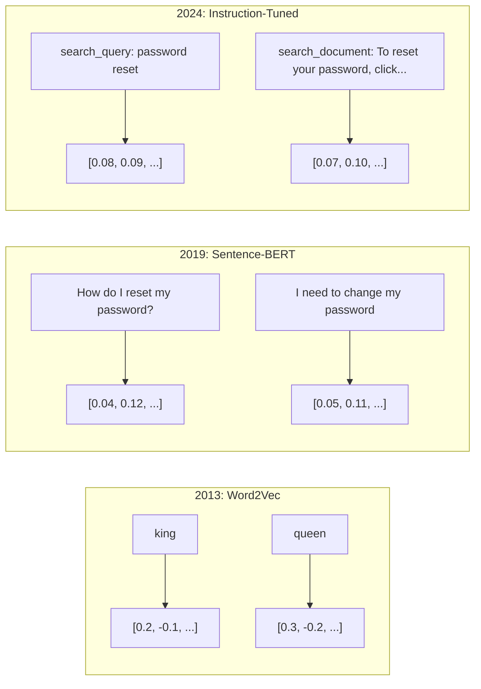
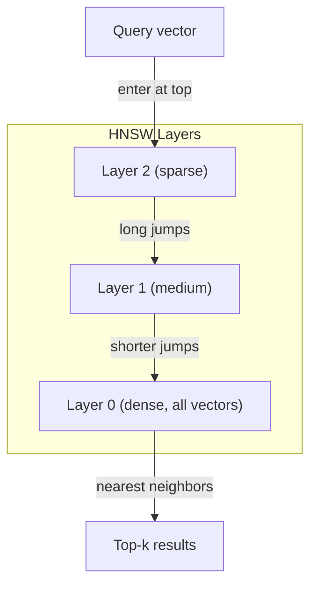

# सम्मिलित करें

> 文本是离散的──数学是连续的──每当你要求LLM 查找相似文档、比较含义,或超越关键词进行搜索时,你都依赖于连接这两个世界的一个桥──这座桥就是嵌入── यदि आप嵌入不懂, तो आप就不懂现代AI──你只是会使用它──

**Type:** Build
**Languages:** Python
**Prerequisites:** Phase 11, Lesson 01 (Prompt Engineering)
**Time:** ~75 minutes
**Related:**चरण 5 · 22 (एम्बेडिंग मॉडल गहरी गोता) 涵盖 घने बनाम दुर्लभ बनाम बहु-वेक्टर、मैत्रियोश्का 截断,以及按轴选择模型──本课聚焦生产管eline(वेक्टर डीबी、HNSW、相似度数学)──在选择模型之前,请先阅读Phase 5 · 22──

## 学习目标
- उपयोग एपीआई प्रदाताओं और ओपन सोर्स मॉडल
-  व्याख्या क्यों एम्बेडिंग 能解决 कीवर्ड खोज 无法处理的词汇不匹配问题
- निर्माण एक अर्थपूर्ण खोज सूचकांक, अर्थ के आधार पर नहीं बल्कि सटीक keyword match to search document
- उपयोग पुनर्प्राप्ति बेंचमार्क(precision@k、recall) आकलन एम्बेडिंग 质量,并为您的任务选择合适的 एम्बेडिंग मॉडल

## 问题
                                                                                                                                                                                                                                                              

यही शब्दावली असंगति की समस्या है। मानव भाषा में एक ही बात व्यक्त करने के कई तरीके हैं।

आपको एक विधि की आवश्यकता है, मेरे भुगतान को नहीं किया गया था और लेनदेन को अस्वीकार कर दिया गया था                                                                                                                                                                                                                                                   

यह एक इम्बेडिंग है।

## 概念
### एक इम्प्लोडिंग क्या है?

सम्मिलन एक घने वेक्टर है जिसमें अवयव बिंदुओं की संख्या होती है, जिसका उपयोग पाठ के अर्थों को दर्शाने के लिए किया जाता है।

 बिल्ली गद्दे पर बैठ गई  会变成类似 `[0.023, -0.041, 0.087, ..., 0.012]` मॉडल के अनुसार, एक सूची में 768 से 3072 ं अंकों की सूची है  ये संख्याएँ अर्थ को कोडित करती हैं  आप उन्हें सीधे नहीं देखेंगे  आप उनकी तुलना करेंगे 

### Word2Vec का सफलता

2013 में, Google के टॉमस मिकोलोव और उनके सहयोगियों ने वर्ड 2Vec को प्रकाशित किया।

著名结果:

```
king - man + woman = queen
```

शब्द सम्मिलित करने के लिए वेक्टर अंकगणित को संक्षेप में समझा जा सकता है। पुरुष से स्त्री तक के दिशाओं में,  राजा से रानी तक के दिशाओं के समान है।

Word2Vec में 300 维 वेक्टरों का उत्पादन होता है। प्रत्येक शब्द चाहे ऊपर नीचे लिखा हुआ हो, वहाँ केवल एक वेक्टर होता है। Bank में River bank और Bank account में एक ही सम्मिलन होता है। इस प्रतिबंध ने बाद के दशक के शोध को बढ़ावा दिया।

### शब्दों से वाक्य तक

वर्ड एम्बेडिंग का अर्थ है एकल टोकन। उत्पादन प्रणाली को पूरे वाक्य, खंड या दस्तावेज़ के लिए एम्बेडिंग करने की आवश्यकता होती है।

**Averaging**:取句中所有的词向量的平均值──成本低、有损,但对短文文出奇地还不错──它完全失去了词序序狗咬人和狗咬人会得到相同的嵌入式──

**CLS token**:transformer models(BERT, 2018)输出一个特殊的 [CLS] टोकन एम्बेडिंग,表示整个输入──比平均更好,但[CLS] टोकन是为下句预测 训练的,不是为相似度训练的──

**Contrastive learning**: स्पष्ट प्रशिक्षण मॉडल,把相似配对拉近,把不相似配对推远――Sentence-BERT(Reimers & Gurevych, 2019) ने इस पद्धति का उपयोग किया, और आधुनिक एम्बेडिंग मॉडल का आधार बन गया।

**Instruction-tuned embeddings**: नवीनतम विधि──E5 和 GTE 等模型接受任务前(search_query:、 search_document:), बताएं मॉडल को किस प्रकार का एम्बेडिंग उत्पन्न करना है── यह एक मॉडल को कई कार्यों की सेवा करने में सक्षम बनाता है──



### आधुनिक एम्बेडिंग मॉडल

बाजार में उत्पादन-ग्रेड के कुछ विकल्पों को प्राप्त किया गया है।

| Model | Provider | Dimensions | MTEB | Context | Cost / 1M tokens |
|-------|----------|-----------|------|---------|------------------|
| Gemini Embedding 2 | Google | 3072 (Matryoshka) | 67.7 (retrieval) | 8192 | $0.15 |
| embed-v4 | Cohere | 1024 (Matryoshka) | 65.2 | 128K | $0.12 |
| voyage-4 | Voyage AI | 1024/2048 (Matryoshka) | 66.8 | 32K | $0.12 |
| text-embedding-3-large | OpenAI | 3072 (Matryoshka) | 64.6 | 8192 | $0.13 |
| text-embedding-3-small | OpenAI | 1536 (Matryoshka) | 62.3 | 8192 | $0.02 |
| BGE-M3 | BAAI | 1024 (dense+sparse+ColBERT) | 63.0 multilingual | 8192 | Open-weight |
| Qwen3-Embedding | Alibaba | 4096 (Matryoshka) | 66.9 | 32K | Open-weight |
| Nomic-embed-v2 | Nomic | 768 (Matryoshka) | 63.1 | 8192 | Open-weight |

MTEB(मॉसिव टेक्स्ट एम्बेडिंग बेंचमार्क) v2 覆盖 100+ 个任务, जिसमें रिट्रीवल, वर्गीकरण, क्लस्टरिंग, पुनः रैंकिंग और सारांशकरण शामिल हैं──分数越高越好──到2026年, ओपन-वेट मॉडल(Qwen3-Embedding、BGE-M3) 大多数维度上已经追平或超过闭源托管模型──Gemini Embedding 2 领先纯回收;旅行/Cohere在特定领域(金融、法律、代码)领先投入使用前,始终要在您的查询上做出基准──

### समानता मेट्रिक्स

 दो एम्बेडिंग वेक्टरों को दिए जाने पर, इनका माप करने के तीन तरीके हैं।

**Cosine similarity**: दो वेक्टर 之间角 के अतिरिक्त弦值── सीमा -1 से 1 तक 相反 तक 方向 समान)                                                                                                                                                                                                                                                 

```
cosine_sim(a, b) = dot(a, b) / (||a|| * ||b||)
```

**Dot product**: दो वेक्टरों का मूल इनपुट। जब वेक्टरों को एकीकरण किया गया है, तो यह कॉसिन की समानता के साथ होता है।

```
dot(a, b) = sum(a_i * b_i)
```

**Euclidean (L2) distance**: वेक्टर  अंतरिक्ष में सीधी रेखा दूरी 越小 = 越相似 ⋅ बड़े अंतर के प्रति संवेदनशील ⋅ अंतरिक्ष में पूर्ण स्थान महत्वपूर्ण है, न कि केवल दिशा महत्वपूर्ण है ⋅ उपयोग करते समय

```
L2(a, b) = sqrt(sum((a_i - b_i)^2))
```

何時使用哪一种:

| Metric | Use when | Avoid when |
|--------|----------|------------|
| Cosine similarity | 比较长度不同的文本；大多数 retrieval 任务 | 大小携带信息 |
| Dot product | Embeddings 已经归一化；需要最高速度 | Vectors 大小不同 |
| Euclidean distance | Clustering；空间 nearest-neighbor 问题 | 比较长度差异巨大的文档 |

### वेक्टर डेटाबेस और HNSW

暴力 समानता खोज प्रत्येक संग्रहीत वेक्टर के साथ एक-एक तुलना करेगी 🏻 जब एक लाख 1536 维 वेक्टर होते हैं, तो प्रत्येक खोज को 15 बिलियन बार गुणा-जोड़ा जाता है 🏻 बहुत धीमा हो गया है🏻

वेक्टर डेटाबेस उपयोग करीबी निकटतम पड़ोसी (ANN) एल्गोरिथ्म इस समस्या को हल करने के लिए

1. 构建一个多层向量图
2.  शीर्ष परतें दुर्लभ  दूर दूरी के समूहों के बीच लंबी दूरी की कड़ी स्थापित करें
3.                                                                                                                                                                                                                                                               
4.  खोज शीर्ष से शुरू, लालच नीचे और धीरे धीरे विस्तृत
5. 以 O(log n) समय वापस निकटतम शीर्ष-के परिणाम, बजाय O(n)

एचएनएसडब्ल्यू के साथ बहुत कम सटीकता दर का नुकसान (आमतौर पर 95-99% याद) के बदले में बड़ी गति बढ़ जाती है।



生产选项:

| Database | Type | Best for | Max scale |
|----------|------|----------|-----------|
| Pinecone | Managed SaaS | 零运维生产环境 | Billions |
| Weaviate | Open source | 自托管、hybrid search | 100M+ |
| Qdrant | Open source | 高性能、过滤 | 100M+ |
| ChromaDB | Embedded | 原型开发、本地开发 | 1M |
| pgvector | Postgres extension | 已经使用 Postgres | 10M |
| FAISS | Library | 进程内、研究 | 1B+ |

### टुकड़े टुकड़े करने की रणनीति

文档太长,不能作为单个矢量 进行嵌入──一个50页的 PDF 覆盖几十个主题它的嵌入会变成所有内容的平均值,结果不像任何具体内容──你要把文档切成块,并对每块做嵌入──

**Fixed-size chunking**: प्रत्येक N 个 टोकन 切分一次,并带 M-token ओवरलैप──简单且可预测──当文档没有清晰结构时效果很好──一个512- टोकन टुकड़ा 带50-token ओवरलैप: टुकड़ा 1是 टोकन 0-511, टुकड़ा 2是 टोकन 462-973──

**Sentence-based chunking**: वाक्यों की सीमा में काटने में, वाक्यों को तब तक विभाजित करना जब तक टोकन सीमा न हो जाए। प्रत्येक टुकड़ा कम से कम एक पूर्ण वाक्य है। निश्चित आकार की तुलना में बेहतर है, क्योंकि आप एक विचार को दो भागों में नहीं काटेंगे।

**Recursive chunking**: पहले प्रयास करें सबसे बड़ी सीमा में विभाजन में भाग लेने के लिए (भाग के शीर्षकों)  यदि अभी भी बहुत बड़ा है, फिर प्रयास करें पैराग्राफ सीमाएँ फिर वाक्य सीमाएँ अंत में वर्ण सीमाएँ यह लैंगचेन का `RecursiveCharacterTextSplitter`, मिश्रित प्रारूप के शरीर के लिए बहुत अच्छा प्रभाव है

**Semantic chunking**: प्रत्येक वाक्य के लिए एम्बेडिंग करें, फिर एम्बेडिंग करें, जैसे कि एक वाक्य के लिए एक समान समांतर वाक्य के लिए एक समूह है।

| Strategy | Complexity | Quality | Best for |
|----------|-----------|---------|----------|
| Fixed-size | Low | Decent | 非结构化文本、logs |
| Sentence-based | Low | Good | 文章、emails |
| Recursive | Medium | Good | Markdown、HTML、mixed docs |
| Semantic | High | Best | 对 retrieval 质量要求关键的场景 |

大多数系统的甜点区间:256-512 टोकन टुकड़े, 50 टोकन ओवरलैप के साथ

### द्वि-संकेतक और क्रॉस-संकेतक के मुकाबले

द्वि-संकेतक 会独立对查询 和文档做嵌入,然后比较向量──速度快你只需要对查询做一次嵌入,然后与预先计算好的文档嵌入比较──这是检索使用方式──

क्रॉस-एन्कोडर एक दस्तावेज के साथ एक क्वेरी को एक एकल इनपुट के रूप में ले जाएगा, और प्रासंगिकता स्कोर को आउटपुट करेगा।

生产模式是: द्वि-संकेतक 检查前-100 उम्मीदवार, क्रॉस-संकेतक इसे शीर्ष-10 तक रैंक करेगा।


रेटिंग मॉडल:Cohere Rerank 3.5( प्रति 1000 बार पूछताछ $2) ✓ BGE-renanker-v2(免费, ओपन सोर्स) ✓ Jina Reranker v2(免费, ओपन सोर्स) ✓

### मैट्रियोशका एम्बेड

传统嵌入式是全有或全无──一个1536 维矢量 使用1536 浮动──你不能在不重训的情况下截断到256 维──

मैट्रियोस्का प्रतिनिधित्व सीखने ((Kusupati et al., 2022) ने इस समस्या को ठीक किया है। मॉडल को सबसे महत्वपूर्ण जानकारी को पकड़ने के लिए प्रशिक्षित किया गया है, जैसे रूस के एक सेट।

OpenAI का पाठ-एम्बेडिंग-3-छोटा 和 पाठ-एम्बेडिंग-3-बड़ा 通过`dimensions`参数支持Matryoshka 截断── अनुरोध 256 维 बजाय 1536 维, भंडारण 6 गुना कम, MTEB बेंचमार्क पर सटीकता दर लगभग 3-5% हानि

### द्विआधारी मात्रा

एक 1536 维 एम्बेडिंग 以 float32  भंडारण की आवश्यकता है 6,144 字节── गुणा करके 1000 मिलियन

द्विआधारी मात्रात्मककरण प्रत्येक फ्लोट को 转成单个位:正值变成1,负值变成0―― भंडारण 6,144 字节降至192 字节减少32 倍――相似度使用 Hamming distance(统计不同位数)计算,CPU एक条命令完成──

पुनर्प्राप्तिकरण को याद करने की सटीकता दर लगभग 5-10% प्रभावित होती है। सामान्य मॉडल यह हैः पहले लाखों वेक्टरों में द्विआधारी मात्रा में खोज करें, फिर शीर्ष-1000 के लिए पूर्ण-सटीक वेक्टरों का उपयोग करें।


```figure
cosine-similarity
```

##  इसे निर्माण
हम शून्य से एक अर्थपूर्ण खोज इंजन का निर्माण शुरू करते हैं―― वेक्टर डेटाबेस का उपयोग नहीं करते―― बाहरी एम्बेडिंग एपीआई का उपयोग नहीं करते―― केवल पायथन और नम्पी का उपयोग करते हुए गणित गणना करते हैं――

### 步骤 1: पाठ Chunking

```python
def chunk_text(text, chunk_size=200, overlap=50):
    words = text.split()
    chunks = []
    start = 0
    while start < len(words):
        end = start + chunk_size
        chunk = " ".join(words[start:end])
        chunks.append(chunk)
        start += chunk_size - overlap
    return chunks


def chunk_by_sentences(text, max_chunk_tokens=200):
    sentences = text.replace("\n", " ").split(".")
    sentences = [s.strip() + "." for s in sentences if s.strip()]
    chunks = []
    current_chunk = []
    current_length = 0
    for sentence in sentences:
        sentence_length = len(sentence.split())
        if current_length + sentence_length > max_chunk_tokens and current_chunk:
            chunks.append(" ".join(current_chunk))
            current_chunk = []
            current_length = 0
        current_chunk.append(sentence)
        current_length += sentence_length
    if current_chunk:
        chunks.append(" ".join(current_chunk))
    return chunks
```

### 步骤 2: खरोंच से एम्बेडमेंट्स का निर्माण

हम TF-IDF और L2 सामान्यीकरण का उपयोग करते हैं                                                                                                                                                                                                                                                                                                                                                                                                                                                                                                                

```python
import math
import numpy as np
from collections import Counter

class SimpleEmbedder:
    def __init__(self):
        self.vocab = []
        self.idf = []
        self.word_to_idx = {}

    def fit(self, documents):
        vocab_set = set()
        for doc in documents:
            vocab_set.update(doc.lower().split())
        self.vocab = sorted(vocab_set)
        self.word_to_idx = {w: i for i, w in enumerate(self.vocab)}
        n = len(documents)
        self.idf = np.zeros(len(self.vocab))
        for i, word in enumerate(self.vocab):
            doc_count = sum(1 for doc in documents if word in doc.lower().split())
            self.idf[i] = math.log((n + 1) / (doc_count + 1)) + 1

    def embed(self, text):
        words = text.lower().split()
        count = Counter(words)
        total = len(words) if words else 1
        vec = np.zeros(len(self.vocab))
        for word, freq in count.items():
            if word in self.word_to_idx:
                tf = freq / total
                vec[self.word_to_idx[word]] = tf * self.idf[self.word_to_idx[word]]
        norm = np.linalg.norm(vec)
        if norm > 0:
            vec = vec / norm
        return vec
```

### 步骤 3: समानता कार्य

```python
def cosine_similarity(a, b):
    dot = np.dot(a, b)
    norm_a = np.linalg.norm(a)
    norm_b = np.linalg.norm(b)
    if norm_a == 0 or norm_b == 0:
        return 0.0
    return float(dot / (norm_a * norm_b))


def dot_product(a, b):
    return float(np.dot(a, b))


def euclidean_distance(a, b):
    return float(np.linalg.norm(a - b))
```

### 步骤 4: ब्रूट-फोर्स खोज के साथ वेक्टर सूचकांक

```python
class VectorIndex:
    def __init__(self):
        self.vectors = []
        self.texts = []
        self.metadata = []

    def add(self, vector, text, meta=None):
        self.vectors.append(vector)
        self.texts.append(text)
        self.metadata.append(meta or {})

    def search(self, query_vector, top_k=5, metric="cosine"):
        scores = []
        for i, vec in enumerate(self.vectors):
            if metric == "cosine":
                score = cosine_similarity(query_vector, vec)
            elif metric == "dot":
                score = dot_product(query_vector, vec)
            elif metric == "euclidean":
                score = -euclidean_distance(query_vector, vec)
            else:
                raise ValueError(f"Unknown metric: {metric}")
            scores.append((i, score))
        scores.sort(key=lambda x: x[1], reverse=True)
        results = []
        for idx, score in scores[:top_k]:
            results.append({
                "text": self.texts[idx],
                "score": score,
                "metadata": self.metadata[idx],
                "index": idx
            })
        return results

    def size(self):
        return len(self.vectors)
```

### 步骤 5: अर्थपूर्ण खोज इंजन

```python
class SemanticSearchEngine:
    def __init__(self, chunk_size=200, overlap=50):
        self.embedder = SimpleEmbedder()
        self.index = VectorIndex()
        self.chunk_size = chunk_size
        self.overlap = overlap

    def index_documents(self, documents, source_names=None):
        all_chunks = []
        all_sources = []
        for i, doc in enumerate(documents):
            chunks = chunk_text(doc, self.chunk_size, self.overlap)
            all_chunks.extend(chunks)
            name = source_names[i] if source_names else f"doc_{i}"
            all_sources.extend([name] * len(chunks))
        self.embedder.fit(all_chunks)
        for chunk, source in zip(all_chunks, all_sources):
            vec = self.embedder.embed(chunk)
            self.index.add(vec, chunk, {"source": source})
        return len(all_chunks)

    def search(self, query, top_k=5, metric="cosine"):
        query_vec = self.embedder.embed(query)
        return self.index.search(query_vec, top_k, metric)

    def search_with_scores(self, query, top_k=5):
        results = self.search(query, top_k)
        return [
            {
                "text": r["text"][:200],
                "source": r["metadata"].get("source", "unknown"),
                "score": round(r["score"], 4)
            }
            for r in results
        ]
```

### 步骤 6: समानता मेट्रिक्स की तुलना

```python
def compare_metrics(engine, query, top_k=3):
    results = {}
    for metric in ["cosine", "dot", "euclidean"]:
        hits = engine.search(query, top_k=top_k, metric=metric)
        results[metric] = [
            {"score": round(h["score"], 4), "preview": h["text"][:80]}
            for h in hits
        ]
    return results
```

## इसका उपयोग करें
उपयोग उत्पादन एम्बेडिंग एपीआई 时,架构保持一致──只有 एम्बेडर 会变:

```python
from openai import OpenAI

client = OpenAI()

def openai_embed(texts, model="text-embedding-3-small", dimensions=None):
    kwargs = {"model": model, "input": texts}
    if dimensions:
        kwargs["dimensions"] = dimensions
    response = client.embeddings.create(**kwargs)
    return [item.embedding for item in response.data]
```

उपयोग OpenAI के मैट्रियोस्का 截断 एक ही मॉडल, कम आयाम, कम भंडारणः

```python
full = openai_embed(["semantic search query"], dimensions=1536)
compact = openai_embed(["semantic search query"], dimensions=256)
```

256-डी वेक्टर उपयोग भंडारण 6 गुना कम हो गया है। 1000 मिलियन दस्तावेज़ों के लिए, यह 10 GB बनाम 61 GB है।

प्रयोग Cohere  पुनर्गठन करें

```python
import cohere

co = cohere.ClientV2()

results = co.rerank(
    model="rerank-v3.5",
    query="What is the refund policy?",
    documents=["Full refund within 30 days...", "No refunds after 90 days..."],
    top_n=3
)
```

उपयोग本地 एम्बेडिंग, नहीं निर्भर एपीआईः

```python
from sentence_transformers import SentenceTransformer

model = SentenceTransformer("BAAI/bge-small-en-v1.5")
embeddings = model.encode(["semantic search query", "another document"])
```

हम निर्माण के वेक्टर इंडेक्स वर्ग इन किसी भी योजना का उपयोग कर सकते हैं, एम्बेडिंग फ़ंक्शन को बदलते हुए, खोज तर्क को बनाए रखते हुए।

## 交付 यह
本课产出:
- `outputs/prompt-embedding-advisor.md` एक विशिष्ट उपयोग के लिए उपयोग किया जाता है उदाहरण चयन एम्बेडिंग मॉडल और रणनीति के लिए संकेत
- `outputs/skill-embedding-patterns.md`एक प्रोफेसर एजेंट  कैसे उत्पादन में प्रभावी ढंग से एम्बेडिंग का उपयोग करने के लिए कौशल

## अभ्यास
1. **Metric comparison**: कॉसिन समानता, डॉट उत्पाद और यूक्लिडियन दूरी का उपयोग करके, नमूना दस्तावेजों पर 5 प्रश्नों का संचालन करें।

2. **Chunk size experiment**: 50、100、200、500 शब्दों के टुकड़े आकारों का उपयोग करके 索引 नमूना दस्तावेज。 प्रत्येक सेटअप पर 5 प्रश्नों का संचालन करें,并记录 top-1 समानता स्कोर── टुकड़े के आकार और पुनर्प्राप्ति की गुणवत्ता के बीच संबंध  ढूंढें ढ़ेर बड़े टुकड़े  नकारात्मक प्रभाव उत्पन्न करना शुरू करें बिंदु──

3. **Matryoshka simulation**: 500 डी वेक्टरों का सरल एम्बेडर बनाना। 50、100、200 和 500 维度 तक काटेगा। प्रत्येक काटेगा के तहत रिकवरी को कैसे कम किया जा सकता है इसका माप करना।

4. **Binary quantization**: प्राप्त खोज इंजन के बीच एम्बेडमेंट, उन्हें द्विआधारी में परिवर्तित करेगा(正数为1,负数为0),并实现 हैमिंग दूरी खोज──将前十结果与完全精度的共数相似性比较──衡量重叠百分比比──

5. **Sentence-based chunking**:用 `chunk_by_sentences`⇒ फिक्स्ड साइज चंकिंग को बदलकर ⇒ समान क्वेरी का संचालन करें तथा पुनः प्राप्ति स्कोर की तुलना करें ⇒ अनुच्छेद सीमा क्या परिणाम में सुधार हुआ है?

## 关键术语
| Term | What people say | What it actually means |
|------|----------------|----------------------|
| Embedding | “文本到数字” | 一种 dense Vector，其中几何接近性编码语义相似性 |
| Word2Vec | “最早的经典 Embedding” | 2013 年通过预测上下文词学习 word vectors 的模型；证明 Vector arithmetic 可以编码含义 |
| Cosine similarity | “两个 Vectors 有多相似” | Vectors 夹角的余弦值；1 = 方向相同，0 = 正交，-1 = 相反 |
| HNSW | “快速 Vector search” | Hierarchical Navigable Small World graph——一种多层结构，可实现 O(log n) 的 approximate nearest neighbor search |
| Bi-encoder | “分开 Embedding，快速比较” | 将 query 和 document 独立编码为 Vectors；支持预计算和快速 retrieval |
| Cross-encoder | “慢但准确的 reranker” | 让 query-document pair 联合通过完整模型处理；准确率更高，但无法预计算 |
| Matryoshka embeddings | “可截断的 Vectors” | 经过训练的 Embeddings，使前 N 个维度捕捉最重要的信息，从而支持可变大小存储 |
| Binary quantization | “1-bit embeddings” | 将 float vectors 转换为 binary（仅保留 sign bit），通过 Hamming distance search 实现 32 倍存储减少 |
| Chunking | “为 Embedding 拆分文档” | 将文档拆成 256-512 token 片段，使每个片段都可以独立 Embedding 和检索 |
| Vector database | “Embeddings 的搜索引擎” | 为存储 Vectors 并在规模化场景下执行 approximate nearest neighbor search 而优化的数据存储 |
| Contrastive learning | “通过比较训练” | 一种训练方法，把相似配对的 Embeddings 拉近，把不相似配对的 Embeddings 推远 |
| MTEB | “Embedding benchmark” | Massive Text Embedding Benchmark——覆盖 8 类任务的 56 个数据集；用于比较 Embedding models 的标准 |

## 延伸阅读
- Mikolov et al., "वेक्टर स्पेस में वर्ड प्रतिनिधित्व का कुशल अनुमान" (2013) Word2Vec 论文,通过 राजा-रानी 类比开启了嵌入 革命
- रीमर और गुरेविच, "सेंटेन्स-BERT: सिएमिस BERT-नेटवर्क का उपयोग करके वाक्य एम्बेडिंग" (2019)
- कुसुपति और अन्य, "मैत्रियोष्का प्रतिनिधित्व सीखने" (2022) 可变度 एम्बेडिंग 背后的技术,OpenAI ने इसे पाठ-एम्बेडिंग-3 में अपनाया है
- मालकोव और यशूनिन, "एफ़ेक्टिव और मजबूत हाइरार्जिकल नेविगेबल स्मॉल वर्ल्ड ग्राफ्स का उपयोग करके निकटतम पड़ोसी" (2018) HNSW 论文,多数生产 वेक्टर खोज 背后的算法
- OpenAI एम्बेडिंग गाइड (platform.openai.com/docs/guides/embeddings) text-embedding-3 मॉडल का प्रयोग करने का संदर्भ, जिसमें Matryoshka 维度缩减 शामिल है
- MTEB Leaderboard (huggingface.co/spaces/mteb/leaderboard)  वास्तविक समय बेंचमार्क, सभी एम्बेडिंग मॉडल की तुलना करने के लिए उपयोग किया जाता है विभिन्न कार्यों और भाषाओं पर प्रदर्शन
- [Muennighoff et al., "MTEB: Massive Text Embedding Benchmark" (EACL 2023)](https://arxiv.org/abs/2210.07316) परिभाषित 8 类任务(श्रेणीकरण, समूहबद्धता, जोड़ी वर्गीकरण, पुनः क्रमबद्धता, पुनर्प्राप्ती, एसटीएस, सारांशकरण, बिटक्स्ट माइनिंग) के बेंचमार्क, लीडरबोर्ड इन श्रेणियों की रिपोर्ट करेगा;
- [Sentence Transformers documentation](https://www.sbert.net/)बी-एन्कोडर बनाम क्रॉस-एन्कोडर पूलिंग रणनीतियों, तथा इस कोर्स को प्राप्त करने के लिए इनजेस्ट-स्प्लिट-एम्बेड-स्टोर आरएजी पाइपलाइन का अधिकार
