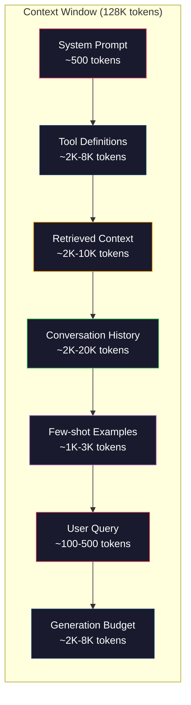
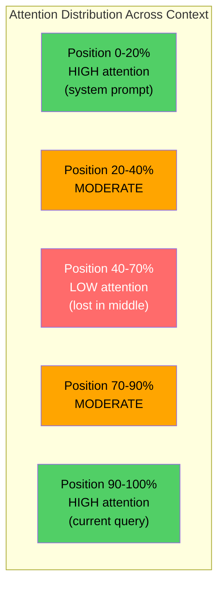
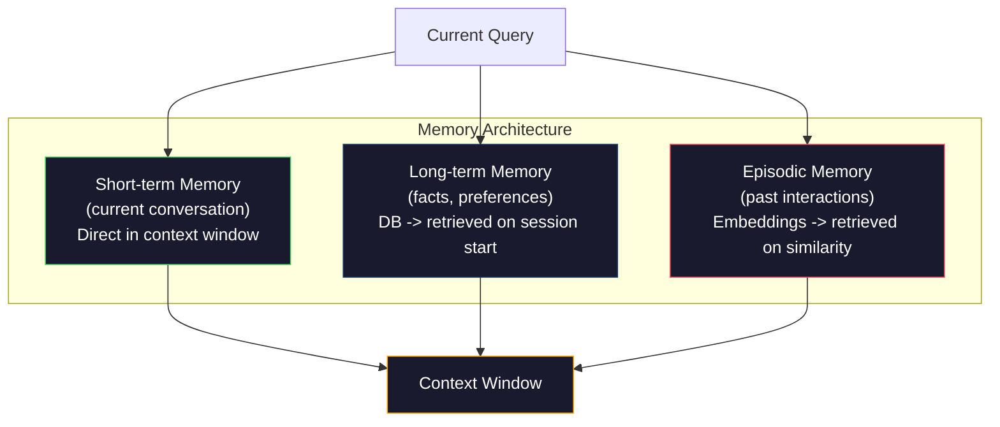

# संदर्भ इंजीनियरिंग: विंडो, बजट, मेमोरी और रिकवरी

> त्वरित इंजीनियरिंग एक घटक है। संदर्भा इंजीनियरिंग 才是全局── त्वरित यह है कि आप एक स्ट्रिंग का एक अंश प्रविष्ट करें। संदर्भा मॉडल विंडो में प्रवेश करता हैः सिस्टम निर्देश, पुनर्प्राप्त दस्तावेज़, उपकरण परिभाषाएँ, वार्तालाप इतिहास, कुछ शॉट्स उदाहरण, तथा त्वरित स्वयं।

**类型：**निर्माण
**语言：**पायथन
**前置要求：**चरण 10 (LLMs from Scratch) ∙ चरण 11 पाठ 01-02
**时间：**≈ 90 मिनट
**相关：**चरण 11 · 15(प्रोम्प्ट कैशिंग)  कैश-अनुकूल लेआउट है संदर्भ इंजीनियरिंग का विस्तार──चरण 5 · 28(लंबी-संदर्भ मूल्यांकन)

## 学习目标

- 计算所有 संदर्भ विंडो 组件的 टोकन 预算(सिस्टम प्रॉम्प्ट、उपकरण、इतिहास、प्राप्त डॉक्स、जनरेशन हेडरूम)
- 实现 संदर्भ विंडो 管理策略:截断、摘要, तथा वार्तालाप इतिहास के लिए स्लाइडिंग विंडो
- संदर्भ घटक पर प्राथमिकताबद्ध क्रमबद्धता और संरेखण, मॉडल का ध्यान अधिकतम रूप से सबसे प्रासंगिक जानकारी पर केंद्रित होने दें
- context assembler का निर्माण, क्वेरी के अनुसार  प्रकार और उपलब्ध विंडो अंतरिक्ष गतिशील वितरण टोकन

## 问题

क्लाउड ओपस 4.7 में 200K टोकन हैं  विंडोज(बेटा में 1M के लिए है) ・GPT-5 में 400K हैं ・जेमिनी 3 प्रो में 2M है ・लामा 4  दावा करते हैं कि 10M है ・ ये संख्याएं बहुत बड़ी लगती हैं, जब तक आप वास्तव में उन्हें भरते हैं

नीचे एक कोडिंग सहायक है का वास्तविक विभाजन── सिस्टम प्रॉम्प्ट:500 टोकन──50 个 个工具 工具 परिभाषाएँ:8,000 टोकन── प्राप्त दस्तावेज:4,000 टोकन── वार्तालाप इतिहास(10 轮):6,000 टोकन──当前 उपयोगकर्ता क्वेरी:200 टोकन── जनरेशन बजट(मैकस आउटपुट):4,000 टोकन──总计:22,700 टोकन── यह केवल 128K 窗口 का 18% है──

लेकिन ध्यान संदर्भ लंबाई के साथ नहीं होता 线性 विस्तार. . . . . . . . . . . . . . . . . . . . . . . . . . . . . . . . . . . . . . . . . . . . . . . . . . . . . . . . . . . . . . . . . . . . . . . . . . . . . . . . . . . . . . . . . . . . . . . . . . . . . . . . . . . . . . . . . . . . . . . . . . . . . . . . . . . . . . . . . . . . . . . . . . . . . . . . . . . . . . . . . . . . . . . . . . . . . . . . . . . . . . . . . . . . . . . . . . . . . . . . . . . . . . . . . . . . . . . . . . . . . . . . . . . . . . . . . . . . . . . . . . . . . . . . . . . . . . . . . . . . . . . . . . . . . . . . . . . . . . . . . . . . . . . . . . . . . . . . . . . . . . . . . . . . . . . . . . . . . . . . . . . . . . . . . . . . . . . . . . . . . . . . . . . . . . . . . . . . . . . . . . . . . . . . . . . . . . . . . . . . . . . . . . . . . . . . . . . . . . . . . . . . . . . . . . . . . . . . . . . . . . . . . . . . . . . . . . . . . . . . . . . . . . . . . . . . . . . . . . . . . . . . . . . . . . . . . . . . . . . . . . . . . . . . . . . . . . . . . .

實踐上的教學是:可用200K Token并非意味着使用200K Token 就有效──精心选的10K Token context 往往胜过直接倾倒的100K Token context──文本工程是在文本窗口内最大化信号-噪音比的学科──

आप खिड़की में प्रत्येक टोकन डालते हैं, तो आप एक और टोकन निकालते हैं जो अधिक प्रासंगिक जानकारी ले सकता है। प्रत्येक अनावश्यक उपकरण परिभाषा, प्रत्येक कालान्तर वार्तालाप, प्रत्येक खंड उत्तर नहीं दे सकता है, प्रश्न का पुनः प्राप्त पाठ, तो मॉडल को कार्य पर थोड़ा अलग प्रदर्शन करने देता है।

## 概念

### संदर्भ विंडो है दुर्लभ संसाधन

संदर्भ विंडो को डिस्क के बजाय रैम में रखें। यह बहुत जल्दी है, सीधे पहुंच योग्य है, लेकिन क्षमता सीमित है।



प्रत्येक घटक में प्रतिस्पर्धा होती है। इसमें अधिक उपकरण परिभाषाएँ शामिल की जाती हैं। इसका अर्थ है वार्तालाप इतिहास की जगह बदलती है। इसमें अधिक पुनर्प्राप्त संदर्भ शामिल किया जाता है। इसका अर्थ है कुछ शॉट उदाहरणों की जगह बदलती है।

### बीच में खोया

यह संदर्भ इंजीनियरिंग में सबसे महत्वपूर्ण अनुभव है। मॉडल संदर्भ पर बेहतर ध्यान देगा।

Liu et al. ((2023) ने इसके लिए सिस्टम परीक्षण किया। उन्होंने एक संबंधित दस्तावेज़ को 20 असंगत दस्तावेजों के बीच अलग-अलग स्थानों पर रखा, और उत्तर सटीकता दर को मापा।

यह सीधे तौर पर इंजीनियरिंग डिजाइन को प्रभावित करेगाः

- सबसे महत्वपूर्ण जानकारी को सबसे पहले रखें
-                                                                                                                                                                                                                                                               
- संदर्भ को निम्नतम प्राथमिकता वाले क्षेत्र के रूप में देखना
- यदि आपको सूचना को बीच में रखना है, तो हम अंत में हैं



### संदर्भ 组件

**System prompt**: सेट करें व्यक्ति, बंधन और व्यवहार नियम। इसे सबसे आगे रखा गया है, और कई दौर में बरकरार रखा गया है। क्लाउड कोड का सिस्टम प्रॉम्प्ट जिसमें उपकरण परिभाषाएं और व्यवहार निर्देश शामिल हैं, लगभग 6,000 टोकन का उपयोग किया गया है।

**Tool definitions**: प्रत्येक उपकरण 50-200 टोकन बढ़ाएगा (नाम, विवरण, पैरामीटर योजना) ⋅50 ⋅ उपकरण ⋅ प्रत्येक 150 टोकन, किसी भी बातचीत से पहले 7500 टोकन ⋅ गतिशील उपकरण चयन, यानी केवल वर्तमान क्वेरी से संबंधित उपकरण शामिल है, 60-80% कम कर सकते हैं ⋅

**Retrieved context**: वेक्टर डेटाबेस से प्राप्त दस्तावेज़, खोज परिणाम, फ़ाइल सामग्री, पुनः प्राप्ति गुणवत्ता सीधे प्रतिक्रिया की गुणवत्ता का निर्धारण करती है, खराब पुनः प्राप्ति बिना पुनः प्राप्ति से कम है, क्योंकि यह खिड़की से भरा हुआ शोर के साथ होता है, और मुख्य रूप से गलत मार्गदर्शन मॉडल है।

**Conversation history**: प्रत्येक पहले के उपयोगकर्ता संदेश 和 सहायक प्रतिक्रिया── यह बातचीत की लंबाई के साथ होता है 线性增长──50 राउंड बातचीत、 प्रति राउंड 200 टोकन,就是 10,000 टोकन इतिहास── उनमें से अधिकांश वर्तमान क्वेरी के साथ 无关──

**Few-shot examples**: प्रदर्शन अपेक्षित व्यवहार के इनपुट/आउटपुट के लिए दो से तीन ध्यान से चयनित उदाहरण, आमतौर पर हजारों टोकन के निर्देशों से अधिक अधिक उत्पादन गुणवत्ता को बढ़ा सकते हैं।

**Generation budget**: 预留的代币―― यदि आप खिड़की भरते हैं, तो मॉडल में कोई स्थान नहीं है ⇒ कम से कम पीढ़ी के लिए 预留 2,000-4,000 टोकन──

### संदर्भ संपीड़न 策略

**History summarization**:不再逐字保留所有前轮对话,而是定期总结对话──100 टोकन से अभिव्यक्तिहमने X पर चर्चा की, Y पर निर्णय लिया, और उपयोगकर्ता Z चाहता है, तो 2,000 टोकन के 10 轮对话──当历史 超过值(例如 5,000 टोकन) 时运行总结──

**Relevance filtering**: वर्तमान क्वेरी के अनुसार  प्रत्येक प्राप्त दस्तावेज़ 打分,并丢弃低于值的文档── यदि आपने  10 टुकड़े प्राप्त किए हैं, लेकिन केवल 3 संबंधित हैं, तो  丢弃另一个7 个──3 高度相关的 टुकड़े 胜过 10 个平的 टुकड़े──

**Tool pruning**:分类用户的查询意图, केवल इस意图与相关的工具包含──代码问题不需要日历工具──排期问题不需要文件系统工具── यह उपकरण परिभाषाओं को 8,000 टोकन से घटाकर 1,000 तक कर सकता है──

**Recursive summarization**: For a long document,分阶段摘要──先摘要 प्रत्येक खंड,再摘要这些摘要── एक 50 पन्नों का दस्तावेज 500 टोकन के पाचन में बदल जाएगा, साथ ही महत्वपूर्ण बिंदुओं को भी पकड़ लेगा──

### स्मृति प्रणाली

संदर्भ इंजीनियरिंग 跨越三时间尺度──

**Short-term memory**:当前对话──直接存储在文本窗口中──随着每轮对话增长──通过总结和缩写 管理──

**Long-term memory**:跨 वार्तालाप 持久存在的事实和偏好──प्रयोगकर्ता टाइपस्क्रिप्ट को प्राथमिकता देता है। प्रोजेक्ट PostgreSQL. 存储在数据库中, और सत्र प्रारंभ करते समय  प्राप्त किया गया──Claude Code इसे CLAUDE.md 文件中に置く──ChatGPT इसे मेमोरी फ़ंक्शन में रखा गया──

**Episodic memory**:可能相关的特定过去交互── पिछले मंगलवार, हमने लेखक मॉड्यूल में एक समान समस्या डिबग की। 作为嵌入式存储,并当前对话匹配某个过去节 时回收──



### गतिशील संदर्भ विधानसभा

关键洞察: अलग-अलग क्वेरी 需要不同背景──静态 प्रणाली प्रॉम्प्ट + 静态 उपकरण + 静态 इतिहास 很浪费──最好的系统会为每个查询 动态组装背景──

1. 分类 क्वेरी इरादा
2. 选择相关工具( सभी उपकरण नहीं)
3. प्राप्त  संबंधित दस्तावेज(न फिक्स्ड संग्रह)
4. 包含相关历史转(不是全部历史)
5. 添加与任务类型 匹配的少数射击例
6. 按重要性排序所有内容:关键的放最前,重要的放最后,可选的放中

यह एक ही है। यह एक ही है। यह एक ही है।


```figure
lost-in-the-middle
```

##  इसे निर्माण

### 步骤 1: टोकन काउंटर

आप अतुलनीय मात्रा के लिए बजट नहीं बना सकते हैं। एक सरल टोकन काउंटर का निर्माण करें।

```python
import json
import numpy as np
from collections import OrderedDict

def count_tokens(text):
    if not text:
        return 0
    return int(len(text.split()) * 1.3)

def count_tokens_json(obj):
    return count_tokens(json.dumps(obj))
```

### 步骤 2: संदर्भ बजट प्रबंधक

核心抽象──बजट प्रबंधक 会跟踪每组件使用多少代币,并强制执行限制──

```python
class ContextBudget:
    def __init__(self, max_tokens=128000, generation_reserve=4000):
        self.max_tokens = max_tokens
        self.generation_reserve = generation_reserve
        self.available = max_tokens - generation_reserve
        self.allocations = OrderedDict()

    def allocate(self, component, content, max_tokens=None):
        tokens = count_tokens(content)
        if max_tokens and tokens > max_tokens:
            words = content.split()
            target_words = int(max_tokens / 1.3)
            content = " ".join(words[:target_words])
            tokens = count_tokens(content)

        used = sum(self.allocations.values())
        if used + tokens > self.available:
            allowed = self.available - used
            if allowed <= 0:
                return None, 0
            words = content.split()
            target_words = int(allowed / 1.3)
            content = " ".join(words[:target_words])
            tokens = count_tokens(content)

        self.allocations[component] = tokens
        return content, tokens

    def remaining(self):
        used = sum(self.allocations.values())
        return self.available - used

    def utilization(self):
        used = sum(self.allocations.values())
        return used / self.max_tokens

    def report(self):
        total_used = sum(self.allocations.values())
        lines = []
        lines.append(f"Context Budget Report ({self.max_tokens:,} token window)")
        lines.append("-" * 50)
        for component, tokens in self.allocations.items():
            pct = tokens / self.max_tokens * 100
            bar = "#" * int(pct / 2)
            lines.append(f"  {component:<25} {tokens:>6} tokens ({pct:>5.1f}%) {bar}")
        lines.append("-" * 50)
        lines.append(f"  {'Used':<25} {total_used:>6} tokens ({total_used/self.max_tokens*100:.1f}%)")
        lines.append(f"  {'Generation reserve':<25} {self.generation_reserve:>6} tokens")
        lines.append(f"  {'Remaining':<25} {self.remaining():>6} tokens")
        return "\n".join(lines)
```

### 步骤 3: मिडिल में खोया पुनर्गठन

实现重排策略: सबसे महत्वपूर्ण वस्तुओं को सबसे पहले और अंतिम में रखा जाए, सबसे महत्वपूर्ण वस्तुओं को मध्य में रखा जाए।

```python
def reorder_lost_in_middle(items, scores):
    paired = sorted(zip(scores, items), reverse=True)
    sorted_items = [item for _, item in paired]

    if len(sorted_items) <= 2:
        return sorted_items

    first_half = sorted_items[::2]
    second_half = sorted_items[1::2]
    second_half.reverse()

    return first_half + second_half

def score_relevance(query, documents):
    query_words = set(query.lower().split())
    scores = []
    for doc in documents:
        doc_words = set(doc.lower().split())
        if not query_words:
            scores.append(0.0)
            continue
        overlap = len(query_words & doc_words) / len(query_words)
        scores.append(round(overlap, 3))
    return scores
```

### 步骤 4: वार्तालाप इतिहास कंप्रेसर

总结旧的对话转转,以回收 टोकन 预算──

```python
class ConversationManager:
    def __init__(self, max_history_tokens=5000):
        self.turns = []
        self.summaries = []
        self.max_history_tokens = max_history_tokens

    def add_turn(self, role, content):
        self.turns.append({"role": role, "content": content})
        self._compress_if_needed()

    def _compress_if_needed(self):
        total = sum(count_tokens(t["content"]) for t in self.turns)
        if total <= self.max_history_tokens:
            return

        while total > self.max_history_tokens and len(self.turns) > 4:
            old_turns = self.turns[:2]
            summary = self._summarize_turns(old_turns)
            self.summaries.append(summary)
            self.turns = self.turns[2:]
            total = sum(count_tokens(t["content"]) for t in self.turns)

    def _summarize_turns(self, turns):
        parts = []
        for t in turns:
            content = t["content"]
            if len(content) > 100:
                content = content[:100] + "..."
            parts.append(f"{t['role']}: {content}")
        return "Previous: " + " | ".join(parts)

    def get_context(self):
        parts = []
        if self.summaries:
            parts.append("[Conversation Summary]")
            for s in self.summaries:
                parts.append(s)
        parts.append("[Recent Conversation]")
        for t in self.turns:
            parts.append(f"{t['role']}: {t['content']}")
        return "\n".join(parts)

    def token_count(self):
        return count_tokens(self.get_context())
```

### 步骤 5: गतिशील उपकरण चयनकर्ता

केवल मौजूदा प्रश्न से संबंधित उपकरण शामिल हैं।

```python
TOOL_REGISTRY = {
    "read_file": {
        "description": "Read contents of a file",
        "tokens": 120,
        "categories": ["code", "files"],
    },
    "write_file": {
        "description": "Write content to a file",
        "tokens": 150,
        "categories": ["code", "files"],
    },
    "search_code": {
        "description": "Search for patterns in codebase",
        "tokens": 130,
        "categories": ["code"],
    },
    "run_command": {
        "description": "Execute a shell command",
        "tokens": 140,
        "categories": ["code", "system"],
    },
    "create_calendar_event": {
        "description": "Create a new calendar event",
        "tokens": 180,
        "categories": ["calendar"],
    },
    "list_emails": {
        "description": "List recent emails",
        "tokens": 160,
        "categories": ["email"],
    },
    "send_email": {
        "description": "Send an email message",
        "tokens": 200,
        "categories": ["email"],
    },
    "web_search": {
        "description": "Search the web for information",
        "tokens": 140,
        "categories": ["research"],
    },
    "query_database": {
        "description": "Run a SQL query on the database",
        "tokens": 170,
        "categories": ["code", "data"],
    },
    "generate_chart": {
        "description": "Generate a chart from data",
        "tokens": 190,
        "categories": ["data", "visualization"],
    },
}

def classify_intent(query):
    query_lower = query.lower()

    intent_keywords = {
        "code": ["code", "function", "bug", "error", "file", "implement", "refactor", "debug", "test"],
        "calendar": ["meeting", "schedule", "calendar", "appointment", "event"],
        "email": ["email", "mail", "send", "inbox", "message"],
        "research": ["search", "find", "what is", "how does", "explain", "look up"],
        "data": ["data", "query", "database", "chart", "graph", "analytics", "sql"],
    }

    scores = {}
    for intent, keywords in intent_keywords.items():
        score = sum(1 for kw in keywords if kw in query_lower)
        if score > 0:
            scores[intent] = score

    if not scores:
        return ["code"]

    max_score = max(scores.values())
    return [intent for intent, score in scores.items() if score >= max_score * 0.5]

def select_tools(query, token_budget=2000):
    intents = classify_intent(query)
    relevant = {}
    total_tokens = 0

    for name, tool in TOOL_REGISTRY.items():
        if any(cat in intents for cat in tool["categories"]):
            if total_tokens + tool["tokens"] <= token_budget:
                relevant[name] = tool
                total_tokens += tool["tokens"]

    return relevant, total_tokens
```

### 步骤 6: पूर्ण संदर्भ विधानसभा पाइपलाइन

सभी भागों को जोड़ें।

```python
class ContextEngine:
    def __init__(self, max_tokens=128000, generation_reserve=4000):
        self.budget = ContextBudget(max_tokens, generation_reserve)
        self.conversation = ConversationManager(max_history_tokens=5000)
        self.system_prompt = (
            "You are a helpful AI assistant. You have access to tools for "
            "code editing, file management, web search, and data analysis. "
            "Use the appropriate tools for each task. Be concise and accurate."
        )
        self.knowledge_base = [
            "Python 3.12 introduced type parameter syntax for generic classes using bracket notation.",
            "The project uses PostgreSQL 16 with pgvector for embedding storage.",
            "Authentication is handled by Supabase Auth with JWT tokens.",
            "The frontend is built with Next.js 15 using the App Router.",
            "API rate limits are set to 100 requests per minute per user.",
            "The deployment pipeline uses GitHub Actions with Docker multi-stage builds.",
            "Test coverage must be above 80% for all new modules.",
            "The codebase follows the repository pattern for data access.",
        ]

    def assemble(self, query):
        self.budget = ContextBudget(self.budget.max_tokens, self.budget.generation_reserve)

        system_content, _ = self.budget.allocate("system_prompt", self.system_prompt, max_tokens=1000)

        tools, tool_tokens = select_tools(query, token_budget=2000)
        tool_text = json.dumps(list(tools.keys()))
        tool_content, _ = self.budget.allocate("tools", tool_text, max_tokens=2000)

        relevance = score_relevance(query, self.knowledge_base)
        threshold = 0.1
        relevant_docs = [
            doc for doc, score in zip(self.knowledge_base, relevance)
            if score >= threshold
        ]

        if relevant_docs:
            doc_scores = [s for s in relevance if s >= threshold]
            reordered = reorder_lost_in_middle(relevant_docs, doc_scores)
            doc_text = "\n".join(reordered)
            doc_content, _ = self.budget.allocate("retrieved_context", doc_text, max_tokens=3000)

        history_text = self.conversation.get_context()
        if history_text.strip():
            history_content, _ = self.budget.allocate("conversation_history", history_text, max_tokens=5000)

        query_content, _ = self.budget.allocate("user_query", query, max_tokens=500)

        return self.budget

    def chat(self, query):
        self.conversation.add_turn("user", query)
        budget = self.assemble(query)
        response = f"[Response to: {query[:50]}...]"
        self.conversation.add_turn("assistant", response)
        return budget


def run_demo():
    print("=" * 60)
    print("  Context Engineering Pipeline Demo")
    print("=" * 60)

    engine = ContextEngine(max_tokens=128000, generation_reserve=4000)

    print("\n--- Query 1: Code task ---")
    budget = engine.chat("Fix the bug in the authentication module where JWT tokens expire too early")
    print(budget.report())

    print("\n--- Query 2: Research task ---")
    budget = engine.chat("What is the best approach for implementing vector search in PostgreSQL?")
    print(budget.report())

    print("\n--- Query 3: After conversation history builds up ---")
    for i in range(8):
        engine.conversation.add_turn("user", f"Follow-up question number {i+1} about the implementation details of the system")
        engine.conversation.add_turn("assistant", f"Here is the response to follow-up {i+1} with technical details about the architecture")

    budget = engine.chat("Now implement the changes we discussed")
    print(budget.report())

    print("\n--- Tool Selection Examples ---")
    test_queries = [
        "Fix the bug in auth.py",
        "Schedule a meeting with the team for Tuesday",
        "Show me the database query performance stats",
        "Search for best practices on error handling",
    ]

    for q in test_queries:
        tools, tokens = select_tools(q)
        intents = classify_intent(q)
        print(f"\n  Query: {q}")
        print(f"  Intents: {intents}")
        print(f"  Tools: {list(tools.keys())} ({tokens} tokens)")

    print("\n--- Lost-in-the-Middle Reordering ---")
    docs = ["Doc A (most relevant)", "Doc B (somewhat relevant)", "Doc C (least relevant)",
            "Doc D (relevant)", "Doc E (moderately relevant)"]
    scores = [0.95, 0.60, 0.20, 0.80, 0.50]
    reordered = reorder_lost_in_middle(docs, scores)
    print(f"  Original order: {docs}")
    print(f"  Scores:         {scores}")
    print(f"  Reordered:      {reordered}")
    print(f"  (Most relevant at start and end, least relevant in middle)")
```

## इसका उपयोग करें

### क्लाउड कोड का संदर्भ 策略

क्लाउड कोड उपयोग करें विभाजन स्तर विधि प्रबंधन संदर्भ。सिस्टम प्रॉम्प्ट 包含行为规则和工具定义(约6K Token)。 जब आप फ़ाइल खोलते हैं, फ़ाइल सामग्री संदर्भ में प्रवेश करती है。 जब आप खोज करते हैं, तो परिणाम शामिल हो जाते हैं。 पुरानी बातचीत बदल जाती है 会被总结。 क्लाउड.एमडी  प्रदान करता है 跨 सत्र 持久存在的长期记忆──

关键工程决策是:क्लाउड कोड आपके पूरे कोडबेस को संदर्भ में नहीं डालता है 倾倒进文脈――它会按需恢复 相关文件――这是实践中的文脈工程――

### Cursor का गतिशील संदर्भ लोड

cursor आपके पूरे कोडबेस को एम्बेड करने के लिए सूचकांक देगा। जब आप क्वेरी दर्ज करते हैं, तो यह वेक्टर समानता पुनर्प्राप्त करने का उपयोग करेगा। सबसे संबंधित फ़ाइलें और कोड ब्लॉक। केवल ये टुकड़े संदर्भ विंडो में प्रवेश करते हैं। 500K 行 का कोडबेस 5-10 सबसे संबंधित कोड ब्लॉक में संपीड़ित किया जाएगा।

模式就是这样: सब कुछ शामिल,按需检索, केवल महत्वपूर्ण सामग्री शामिल है

### चैटजीपीटी मेमोरी

ChatGPT उपयोगकर्ता की वरीयताओं और तथ्यों को दीर्घकालिक स्मृति के लिए संग्रहीत करेगा। प्रत्येक वार्तालाप के प्रारंभ में, संबंधित यादें पुनर्प्राप्त की जाएंगी और सिस्टम प्रॉम्प्ट में शामिल होंगी। उपयोगकर्ता को Python केवल 5 टोकन खर्च करना पसंद है, लेकिन कई बार बातचीत में यह संभव है।

### RAG 作为 संदर्भ इंजीनियरिंग

RAG एक औपचारिक संदर्भ इंजीनियरिंग है। यह ज्ञान को मॉडल में सम्मिलित करने के लिए नहीं है। यह एक प्रश्न के समय में है।

## 交付 यह

本课会产出 `outputs/prompt-context-optimizer.md`, यह एक दोहराया जा सकता है शीघ्र, संदर्भ विधानसभा ऑडिट के लिए उपयोग किया जाता है 策略并推优化── अपने सिस्टम शीघ्र, उपकरण गणना, औसत इतिहास लंबाई, और पुनर्प्राप्ति रणनीति 输入, यह पहचान जाएगा टोकन 浪费并提出改进建议──

यह फिर से उत्पन्न होगा `outputs/skill-context-engineering.md`, यह एक निर्णय ढांचा है, जो कार्य प्रकार, संदर्भ विंडो आकार और विलंबता बजट के आधार पर उपयोग किया जाता है  संदर्भ विधानसभा पाइपलाइन डिजाइन करना

## अभ्यास

1. 给 ContextBudget class 添加一个标识式废物检测器──它应标记使用超过30% 预算组件,并针对每个组件类型建议具体压缩策略(概括历史、剪辑工具、重新排名文件)

2. लिए प्राप्त संदर्भ 实现语义衍归―― यदि दो प्राप्त दस्तावेजों की समानता 80% से अधिक है (शब्दों के ओवरलैप या इसके एम्बेडिंग के सहानुभूति के अनुसार), केवल प्रतिशत संख्या अधिक उच्च रखने के लिए।

3. 构建一个语境重播工具──给定对话转录,通过 ContextEngine 重放,并可视化预算配置 如何逐轮变化──绘制每个组件随时间变化的 टोकन उपयोग──识别语境 开始被压缩的那一轮──

4. 实现 एक प्राथमिकता आधारित उपकरण चयनकर्ता── मत दोहरे शामिल/अवरोध का उपयोग करें, बल्कि प्रत्येक उपकरण के लिए अपनी प्रासंगिकता के लिए वितरण करें वर्तमान क्वेरी के लिए प्रासंगिकता स्कोर── प्रासंगिकता के अनुसार 降序包含工具,直到工具预算 耗尽──比较包含 5、10、20 和 50 个工具 时的任务表现──

5.  एक बहु-रणनीति संदर्भ कंप्रेसर का निर्माण करें── तीन प्रकार की संपीड़न रणनीतियों का कार्यान्वयन करें️ट्रंक्शन, सारांशकरण, कुंजी वाक्य निष्कर्षण), और 20 个文档集合上基准化 करें️ संपीड़न अनुपात और सूचना भंडारण के बीच का वजन मापें️ संपीड़न संस्करण क्या अभी भी क्वेरी का उत्तर शामिल है?

## 关键术语

| Term | 人们通常怎么说 | 它实际意味着什么 |
|------|----------------|----------------------|
| Context window | “模型能读多少内容” | 模型在单次 forward pass 中处理的最大 Token 数（input + output）——GPT-5 为 400K，Claude Opus 4.7 为 200K（1M beta），Gemini 3 Pro 为 2M |
| Context engineering | “高级 prompt engineering” | 决定什么进入 context window、按什么顺序、以什么优先级进入的学科——涵盖 Retrieval、compression、tool selection 和 memory management |
| Lost-in-the-middle | “模型会忘记中间的东西” | 经验发现：LLMs 更关注 context 的开头和结尾，放在中间的信息会出现 10-20% 的准确率下降 |
| Token budget | “你还剩多少 Token” | 对 context window 容量在各组件之间的显式分配（system prompt、tools、history、retrieval、generation），并带有按组件设置的限制 |
| Dynamic context | “临时加载东西” | 根据 intent classification、relevant tool selection 和 retrieval results，为每个 query 以不同方式组装 context window |
| History summarization | “压缩对话” | 用简洁摘要替换逐字记录的旧 conversation turns，在保留关键信息的同时降低 Token 成本 |
| Tool pruning | “只包含相关 tools” | 分类 query intent，并只包含匹配的 tool definitions，将 tool Token 成本降低 60-80% |
| Long-term memory | “跨 sessions 记住内容” | 存储在数据库中并在 session start 时 retrieved 的事实和偏好——CLAUDE.md、ChatGPT Memory 及类似系统 |
| Episodic memory | “记住特定过去事件” | 作为 Embeddings 存储的过去交互，并在当前 query 与过去 conversation 相似时 retrieved |
| Generation budget | “给答案留空间” | 为模型输出预留的 Token——如果 context 完全填满窗口，模型就没有空间响应 |

## 延伸阅读

- [Liu et al., 2023 -- "Lost in the Middle: How Language Models Use Long Contexts"](https://arxiv.org/abs/2307.03172)                                                                                                                                                                                                                                                              
- [Anthropic's Contextual Retrieval blog post](https://www.anthropic.com/news/contextual-retrieval) मानव  कैसे संदर्भ के बारे में जागरूक टुकड़ा निकालने को संभालने के लिए, पुनर्प्राप्ति विफलता  49% कम
- [Simon Willison's "Context Engineering"](https://simonwillison.net/2025/Jun/27/context-engineering/)                                                                                                                                                                                                                                                              
- [LangChain documentation on RAG](https://python.langchain.com/docs/tutorials/rag/) संदर्भ इंजीनियरिंग पैटर्न के रूप में RAG को लागू करने की प्रथा को लागू करना
- [Greg Kamradt's Needle in a Haystack test](https://github.com/gkamradt/LLMTest_NeedleInAHaystack) खुलाएं सभी मुख्य मॉडल में स्थिति-निर्भर निकासी विफलताओं का बेंचमार्क
- [Pope et al., "Efficiently Scaling Transformer Inference" (2022)](https://arxiv.org/abs/2211.05102) संदर्भ लंबाई 会驱动内存和延迟, तथा केवी कैश、MQA、GQA 如何改变预算计算──
- [Agrawal et al., "SARATHI: Efficient LLM Inference by Piggybacking Decodes with Chunked Prefills" (2023)](https://arxiv.org/abs/2308.16369) निष्कर्ष के दो चरण, make长 prompts 在 TTFT 上昂贵、 在 TPOT 上便宜; यह संदर्भ-पैकिंग ट्रेडऑफ 背后的事实依据──
- [Ainslie et al., "GQA: Training Generalized Multi-Query Transformer Models from Multi-Head Checkpoints" (EMNLP 2023)](https://arxiv.org/abs/2305.13245) समूह-सवाल ध्यान 论文, में में नहीं हानि गुणवत्ता के मामले में, उत्पादन डिकोडर के बीच केवी स्मृति  घटा 8×。
