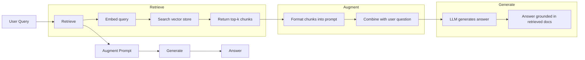
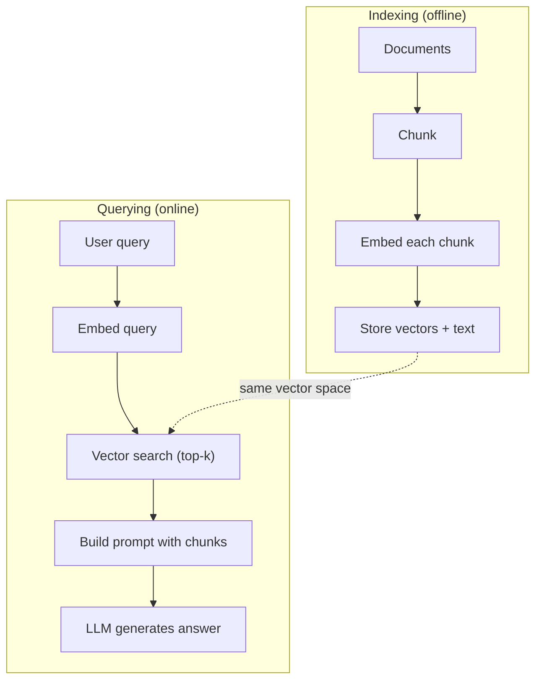

# आरएजी (पुनर्प्राप्त-वृद्धि पीढ़ी)

> आपका LLM अपनी प्रशिक्षण की समाप्ति से पहले सब कुछ जानता है। यह आपकी कंपनी के दस्तावेज, आपके कोडबेस को नहीं जानता है, न ही पिछले सप्ताह की बैठक रिकॉर्ड को जानता है।

**Type:** Build
**Languages:** Python
**Prerequisites:** Phase 10 (LLMs from Scratch), Phase 11 Lessons 01-05
**Time:** ~90 minutes
**Related:**चरण 5 · 23 (RAG के लिए Chunking Strategies) 讲解六种 chunking 算法以及各自适用场景──चरण 5 · 22 (Embedding Models Deep Dive) 讲解如何选择嵌入者──चरण 11 · 07 (Advanced RAG) 讲解混合搜索、重新排名和查询转换──

## 学习目标
- 构建完整的RAG管道:document loading,chunking,embedding,vector storage,retrieval और generation
- उपयोग वेक्टर डेटाबेस (ChromaDB、FAISS या Pinecone)并配合适的索引, अर्थपूर्ण खोज को प्राप्त करें
- explicit why in knowledge-based  अनुप्रयोग में RAG  बेहतर है-अच्छी तरह से समायोजित करना  लागत  नवीनता  गुणनशीलता)
- उपयोग पुनर्प्राप्ति माप (उपयोग सटीकता, याद) और पीढ़ी माप (उपयोगिता, प्रासंगिकता) RAG 质量 मूल्यांकन

## 问题
आप कंपनी के लिए एक चैटबॉट बनाया है। ग्राहक प्रश्नः  उद्यम कार्यक्रम की वापसी नीति क्या है? LLM ने एक विशिष्ट सास  वापसी नीति के बारे में एक सामान्य उत्तर दिया है। जबकि वास्तविक नीति एक 200 पृष्ठ की आंतरिक विकी में दफन की गई है, जिसमें कहा गया है कि उद्यम ग्राहक के पास 60 खिड़कियां हैं, और अनुपात में वापसी की जा सकती है।

फाइन ट्यूनिंग एक समाधान है। इसे अपने आंतरिक दस्तावेज़ के साथ प्रशिक्षित करें, फिर इसे अपडेट किए गए मॉडल को तैनात करें। यह संभव है, लेकिन गंभीर समस्याएं हैं। फाइन ट्यूनिंग की गणना लागत हजारों डॉलर तक हो सकती है।

RAG एक और समाधान है। मॉडल को अपरिवर्तित रखें। जब समस्या आती है, तो अपने दस्तावेज़ स्टोर में संबंधित अंश खोजें, उन्हें प्रश्न के सामने के प्रॉम्प्ट में चिपकाएं, मॉडल को इन अंशों के आधार पर संदर्भ के रूप में जवाब दें। दस्तावेज़ स्टोर कुछ ही मिनटों में अपडेट किया जा सकता है। आप स्पष्ट रूप से देख सकते हैं कि किस दस्तावेज़ पर विशिष्ट खोज की गई है। मॉडल स्वयं हमेशा अपरिवर्तित है। यही कारण है कि RAG मुख्यतः उत्पादन पर्यावरण के लिए एक आदर्श मॉडल बन गया हैः यह अधिक सुविधाजनक है, अद्यतन, और किसी भी LLM के लिए उपयुक्त है।

## 概念
### आरएजी पैटर्न

 संपूर्ण मोड को चार चरणों में संक्षेप में कहा जा सकता हैः



क्वेरी -> रिट्रीव -> बढ़ोतरी प्रॉम्प्ट -> जनरेट करें। प्रत्येक आरएजी सिस्टम इस मॉडल का पालन करते हैं। उत्पादन स्तर के आरएजी सिस्टम के बीच अंतर अब प्रत्येक चरण के विवरण में हैः कैसे टुकड़ा करना है, कैसे एम्बेड करना है, कैसे खोजना है, और कैसे प्रॉम्प्ट बनाना है।

### क्यों RAG ठीक-ठाक से बेहतर है

| Concern | Fine-tuning | RAG |
|---------|------------|-----|
| 成本 | 每次 training run 需要 $1,000-$100,000+ | 每次 query 约 $0.01-$0.10（embedding + LLM） |
| 新鲜度 | 重新训练前一直过时 | 通过重新 indexing docs，可在几分钟内更新 |
| 可审计性 | 无法追踪 answer 到 source | 可以展示准确检索到的 passages |
| Hallucination | 仍然会自由 hallucinate | 基于检索到的 documents |
| 数据隐私 | training data 被烘焙进 weights | documents 留在你的 vector store 中 |

फाइन-ट्यूनिंग  स्थाई परिवर्तन मॉडल के वजन  RAC  अस्थायी परिवर्तन मॉडल के संदर्भ  अधिकांश अनुप्रयोगों के लिए, अस्थायी संदर्भ                                                                                                                                                                                                                                           

️️️️️️️️️️️️️️️️️️️️️️️️️️️️️️️️️️️️️️️️️️️️️️️️️️️️️️️️️️️️️️️️️️️️️️️️️️️️️️️️️️️️️️️️️️️️️️️️️️️️️️️️️️️️️️️️️️️️️️️️️️️️️️️️️️️️️️️️️️️️️️️️️️️️️️️️️️️️️️️️️️️️️️️️️️️️️️️️️️️️️️️️️️️️️️️️️️️️️️️️️️️️️️️️️️️️️️️️️️️️️️️️️️️️️️️️️️️️️️️️️️️️️️️️️️️️️️️️️️️️️️️️️️️️️️️️️️️️️️️️️️️️️️️️️️️️️️️️️️️️️️️️️️️️️️️️️️️️️️️️️️️️️️️️️️️️️️️️️️️️️️️️️️️️️️️️️️️️️️️️️️️️️️️️️️️️️️️️️️️️️️️️️️️️️️️️️️️️️️️️️️️️️️️️️️️️️️️️️️️️️️️️️️️️️️️️️️️️️️️️️️️️️️️️️️️️️️️️️️️️️️️️️️️️️️️️️️️️️️️️️️️️️️️️️️️️️️️️️️️️️️️️️️️️

### मॉडल को सम्मिलित करना

सम्मिलित मॉडल 会把文本转换成密集向量──相似文本会在这个高维空间中产生彼此接近的向量── मैं अपना पासवर्ड कैसे रीसेट करूं? 和  मुझे अपना पासवर्ड बदलने की आवश्यकता है 尽管共享的词很少,但却会产生几乎相同的向量── बिल्ली जो गद्दे पर बैठी थी 则会产生非常不同的向量──

常见嵌入型号(2026 阵容  完整分析见 चरण 5 · 22):

| Model | Dimensions | Provider | Notes |
|-------|-----------|----------|-------|
| text-embedding-3-small | 1536 (Matryoshka) | OpenAI | 适合大多数用例的最佳性价比 |
| text-embedding-3-large | 3072 (Matryoshka) | OpenAI | 更高准确率，可截断到 256/512/1024 |
| Gemini Embedding 2 | 3072 (Matryoshka) | Google | 顶级 MTEB retrieval；8K context |
| voyage-4 | 1024/2048 (Matryoshka) | Voyage AI | 领域变体（code、finance、law） |
| Cohere embed-v4 | 1024 (Matryoshka) | Cohere | 强 multilingual，128K context |
| BGE-M3 | 1024 (dense + sparse + ColBERT) | BAAI (open-weight) | 一个模型提供三种视图 |
| Qwen3-Embedding | 4096 (Matryoshka) | Alibaba (open-weight) | 顶级 open-weight retrieval score |
| all-MiniLM-L6-v2 | 384 | Open-weight (Sentence Transformers) | prototyping baseline |

इस कक्षा में, हम TF-IDF का उपयोग अपने स्वयं के सरल एम्बेडिंग के निर्माण के लिए करेंगे। यह इसलिए नहीं है क्योंकि TF-IDF उत्पादन प्रणाली द्वारा उपयोग किए जाने वाले कार्यक्रम है, बल्कि इसलिए है क्योंकि यह अवधारणा को विशिष्ट बनाता हैः पाठ इनपुट, वेक्टर आउटपुट, समान पाठ उत्पन्न समान वेक्टर।

### वेक्टर समानता

 दो वेक्टरों को दिए जाने पर, समानता का माप कैसे किया जाए?

**Cosine similarity**: दो वेक्टर 之间角 के余弦值── सीमा से -1(相反) तक 1( बिल्कुल समान)── भूलना आयाम, केवल दिशा पर ध्यान देना── यह RAG का默认选择──

```
cosine_sim(a, b) = dot(a, b) / (||a|| * ||b||)
```

**Dot product**: मूल आंतरिक उत्पाद── बड़े वेक्टर अधिक उच्च अंक प्राप्त करेंगे── जब परिमाण  जानकारी के साथ उपयोगी होगा

```
dot(a, b) = sum(a_i * b_i)
```

**L2 (Euclidean) distance**:वेक्टर स्थान मध्य के सीधी दूरी── दूरी越小 = 越相似── परिमाण 差异敏感──

```
L2(a, b) = sqrt(sum((a_i - b_i)^2))
```

कॉसाइन समानता मानक चयन है। यह परिमाण के माध्यम से 归一化,能优雅处理不同长度的文件── जब कोई कहता है वेक्टर खोज 时, लगभग हमेशा कॉसाइन समानता को संदर्भित करता है।

### टुकड़े टुकड़े करने की रणनीति

दस्तावेज़ 太长,不能作为单个向量来嵌入──一个50页的 PDF可能会产生非常糟糕的嵌入,因为它包含几十个主题──相反,你应该把文件 拆分成块,并分别嵌入每块──

**Fixed-size chunking**: प्रत्येक N 个 टोकन 拆分一次──简单且可预测── एक 512 टोकन टुकड़ा 配合50 टोकन ओवरलैप, इसका मतलब है कि टुकड़ा 1 टोकन 0-511, टुकड़ा 2 टोकन 462-973, इस प्रकार का सुझाव── ओवरलैप  सुनिश्चित करें कि आप अनचाहे के सीमा में नहीं होंगे काटने के लिए वाक्य──

**Semantic chunking**: in nature border处拆分──段落、章节或 मार्कडाउन हेडर── प्रत्येक टुकड़ा 都 एक语义连贯的单元──实现更复杂, लेकिन पुनः प्राप्ति 效果更好──

**Recursive chunking**:先尝试在最大边界处拆分 (最大边界处拆分) ️ अनुभाग के शीर्षकों) ️ यदि कोई अनुभाग 仍然太大,就按段落界限 拆分️ यदि कोई अनुच्छेद 仍然太大,就按句界限 拆分️ यह लैंगचेन पुनरावर्ती चरित्र पाठ विभाजन का तरीका है, अभ्यास में अच्छा प्रभाव ️

लोगों की कल्पना से टुकड़े का आकार अधिक महत्वपूर्ण हैः

- 太小(64-128 टोकन): प्रत्येक टुकड़ा 缺乏背景──यह पिछले तिमाही में 15% बढ़ गया यदि आप नहीं जानते it指什么,就没有意义──
- 太大(2048+ टोकन): प्रत्येक टुकड़ा 多个主题,稀释相关性覆盖──当你搜索收入数据时,你得到一个10% 关于收入的,90% 关于人数的部分──
- 理想范围(256-512 टोकन):context 足够自包含,同时足够聚焦以保持相关性──

अधिकांश उत्पादन श्रेणी RAG 系统 256-512 टोकन टुकड़े का उपयोग करते हैं,并配50 टोकन ओवरलैप──Anthropic का RAG 指南推这个范围──

### वेक्टर डेटाबेस

एक बार जब आप एम्बेड कर लेते हैं, तो आपको उन्हें स्टोर करने और खोजने के लिए जगह की आवश्यकता होती है। विकल्पों में शामिल हैंः

| Database | Type | Best for |
|----------|------|----------|
| FAISS | Library (in-process) | Prototyping，中小型 datasets |
| Chroma | Lightweight DB | 本地开发，小型部署 |
| Pinecone | Managed service | 无需运维负担的生产环境 |
| Weaviate | Open source DB | 自托管生产环境 |
| pgvector | Postgres extension | 已经在使用 Postgres |
| Qdrant | Open source DB | 高性能自托管 |

इस कक्षा में, हम एक सरल इन-मेमोरी वेक्टर स्टोर का निर्माण करेंगे। यह वेक्टरों को मौजूद सूची में डालता है, और क्रूर-फोर्स कॉसिन समानता खोज करता है। यह फ्लैट इंडेक्स के FAISS का उपयोग करने के बराबर है। यह धीरे-धीरे बदल जाने से पहले लगभग 100,000 वेक्टरों तक विस्तार कर सकता है। उत्पादन प्रणाली HNSW का उपयोग करती है।

### पूरी पाइपलाइन



अनुक्रमणिका चरण प्रत्येक दस्तावेज़ पर एक बार चलती है या दस्तावेज़ों में अपडेट समय चलती है।

### वास्तविक संख्याएँ

अधिकांश उत्पादन स्तर RAG  प्रणाली इन तत्वों का उपयोग करती हैः

- **k = 5 to 10**: प्रति प्रश्न 检索 के टुकड़े संख्या
- **Chunk size = 256 to 512 tokens**,并配 50 टोकन ओवरलैप
- **Context budget**: प्रति बार क्वेरी उपयोग 2,500-5,000 टोकन की प्राप्त सामग्री
- **Total prompt**: लगभग 8,000-16,000 टोकन(सिस्टम प्रॉम्प्ट + निकाले टुकड़े + बातचीत इतिहास + उपयोगकर्ता क्वेरी)
- **Embedding dimension**:384-3072, मॉडल पर निर्भर करता है
- **Indexing throughput**: उपयोग एपीआई एम्बेडिंग 时每秒 100-1,000 दस्तावेज
- **Query latency**: 50-200ms, पीढ़ी 500-3000ms


```figure
rag-chunking
```

##  इसे निर्माण
### 步骤 1: दस्तावेज़ Chunking

```python
def chunk_text(text, chunk_size=200, overlap=50):
    words = text.split()
    chunks = []
    start = 0
    while start < len(words):
        end = start + chunk_size
        chunk = " ".join(words[start:end])
        chunks.append(chunk)
        start += chunk_size - overlap
    return chunks
```

### 步骤 2: TF-IDF एम्बेड

हम एक सरल एम्बेडिंग फ़ंक्शन का निर्माण करते हैं। TF-IDF (Term Frequency-Inverse Document Frequency) न्यूरल एम्बेडिंग नहीं है, लेकिन यह शब्दों की महत्व को कैप्चर करने के तरीके से पाठ को वेक्टरों में परिवर्तित करने में सक्षम होगा। किसी दस्तावेज़ में अक्सर आने वाले शब्दों को अधिक उच्च TF प्राप्त होगा। पूरे शरीर में दुर्लभ शब्दों को अधिक उच्च IDF प्राप्त होगा।

```python
import math
from collections import Counter

def build_vocabulary(documents):
    vocab = set()
    for doc in documents:
        vocab.update(doc.lower().split())
    return sorted(vocab)

def compute_tf(text, vocab):
    words = text.lower().split()
    count = Counter(words)
    total = len(words)
    return [count.get(word, 0) / total for word in vocab]

def compute_idf(documents, vocab):
    n = len(documents)
    idf = []
    for word in vocab:
        doc_count = sum(1 for doc in documents if word in doc.lower().split())
        idf.append(math.log((n + 1) / (doc_count + 1)) + 1)
    return idf

def tfidf_embed(text, vocab, idf):
    tf = compute_tf(text, vocab)
    return [t * i for t, i in zip(tf, idf)]
```

### 步骤 3: कॉसिन समानता खोज

```python
def cosine_similarity(a, b):
    dot = sum(x * y for x, y in zip(a, b))
    norm_a = math.sqrt(sum(x * x for x in a))
    norm_b = math.sqrt(sum(x * x for x in b))
    if norm_a == 0 or norm_b == 0:
        return 0.0
    return dot / (norm_a * norm_b)

def search(query_embedding, stored_embeddings, top_k=5):
    scores = []
    for i, emb in enumerate(stored_embeddings):
        sim = cosine_similarity(query_embedding, emb)
        scores.append((i, sim))
    scores.sort(key=lambda x: x[1], reverse=True)
    return scores[:top_k]
```

### 步骤 4: त्वरित निर्माण

यही वह जगह है जहां RAG में augmented होता है ️️️️️️️️️️️️️️️️️️️️️️️️️️️️️️️️️️️️️️️️️️️️️️️️️️️️️️️️️️️️️️️️️️️️️️️️️️️️️️️️️️️️️️️️️️️️️️️️️️️️️️️️️️️️️️️️️️️️️️️️️️️️️️️️️️️️️️️️️️️️️️️️️️️️️️️️️️️️️️️️️️️️️️️️️️️️️️️️️️️️️️️️️️️️️️️️️️️️️️️️️️️️️️️️️️️️️️️️️️️️️️️️️️️️️️️️️️️️️️️️️️️️️️️️️️️️️️️️️️️️️️️️️️️️️️️️️️️️️️️️️️️️️️️️️️️️️️️️️️️️️️️️️️️️️️️️️️️️️️️️️️️️️️️️️️️️️️️️️️️️️️️️️️️️️️️️️️️️️️️️️️️️️️️️️️️️️️️️️️️️️️️️️️️️️️️️️️️️️️️️️️️️️️️️️️️️️️️️️️️️️️️️️️️️️️️️️️️️️️️️️️️️️️️️️️️️️️️️️️️️️️️️️️️️️️️️️️️️️️️️️️️️️️️️️️️️️

```python
def build_rag_prompt(query, retrieved_chunks):
    context = "\n\n---\n\n".join(
        f"[Source {i+1}]\n{chunk}"
        for i, chunk in enumerate(retrieved_chunks)
    )
    return f"""Answer the question based ONLY on the following context.
If the context doesn't contain enough information, say "I don't have enough information to answer that."

Context:
{context}

Question: {query}

Answer:"""
```

### 步骤 5: पूर्ण आरएजी पाइपलाइन

```python
class RAGPipeline:
    def __init__(self):
        self.chunks = []
        self.embeddings = []
        self.vocab = []
        self.idf = []

    def index(self, documents):
        all_chunks = []
        for doc in documents:
            all_chunks.extend(chunk_text(doc))
        self.chunks = all_chunks
        self.vocab = build_vocabulary(all_chunks)
        self.idf = compute_idf(all_chunks, self.vocab)
        self.embeddings = [
            tfidf_embed(chunk, self.vocab, self.idf)
            for chunk in all_chunks
        ]

    def query(self, question, top_k=5):
        query_emb = tfidf_embed(question, self.vocab, self.idf)
        results = search(query_emb, self.embeddings, top_k)
        retrieved = [(self.chunks[i], score) for i, score in results]
        prompt = build_rag_prompt(
            question, [chunk for chunk, _ in retrieved]
        )
        return prompt, retrieved
```

### 步骤 6: पीढ़ी (अनुकरण)

उत्पादन वातावरण में, LLM API का प्रयोग यहाँ किया जाता है। इस कक्षा में, हम जांच से संबंधित वाक्यों को संदर्भ में उठाकर अनुकरण पीढ़ी में पेश करते हैं।

```python
def simple_generate(prompt, retrieved_chunks):
    query_words = set(prompt.lower().split("question:")[-1].split())
    best_sentence = ""
    best_score = 0
    for chunk in retrieved_chunks:
        for sentence in chunk.split("."):
            sentence = sentence.strip()
            if not sentence:
                continue
            words = set(sentence.lower().split())
            overlap = len(query_words & words)
            if overlap > best_score:
                best_score = overlap
                best_sentence = sentence
    return best_sentence if best_sentence else "I don't have enough information."
```

## इसका उपयोग करें
उपयोग वास्तविक एम्बेडिंग मॉडल 和 LLM 时,代码 लगभग不变:

```python
from openai import OpenAI

client = OpenAI()

def embed(text):
    response = client.embeddings.create(
        model="text-embedding-3-small",
        input=text
    )
    return response.data[0].embedding

def generate(prompt):
    response = client.chat.completions.create(
        model="gpt-4o-mini",
        messages=[{"role": "user", "content": prompt}],
        temperature=0
    )
    return response.choices[0].message.content
```

या Anthropic का उपयोग करेंः

```python
import anthropic

client = anthropic.Anthropic()

def generate(prompt):
    response = client.messages.create(
        model="claude-sonnet-4-20250514",
        max_tokens=1024,
        messages=[{"role": "user", "content": prompt}]
    )
    return response.content[0].text
```

पाइपलाइन है एक ही की। प्रतिस्थापन एम्बेडिंग फ़ंक्शन है। प्रतिस्थापन पीढ़ी फ़ंक्शन है। पुनर्प्राप्ति तर्क है।

 बड़े पैमाने पर वेक्टर भंडारण के लिए, उपयुक्त वेक्टर डेटाबेस का उपयोग करें  क्रूर बल खोज के बजायः

```python
import chromadb

client = chromadb.Client()
collection = client.create_collection("my_docs")

collection.add(
    documents=chunks,
    ids=[f"chunk_{i}" for i in range(len(chunks))]
)

results = collection.query(
    query_texts=["What is the refund policy?"],
    n_results=5
)
```

Chroma 会在内部处理嵌入式 (默认使用全-MiniLM-L6-v2),并把向量 存储在本地数据库中──同样模式,不同的管道实现──

## 交付 यह
本课会产出:
- `outputs/prompt-rag-architect.md` एक विशिष्ट उपयोग के लिए इस्तेमाल किया उदाहरण डिजाइन RAG 系统 के लिए संकेत
- `outputs/skill-rag-pipeline.md` एक प्रशिक्षक एजेंट  कैसे निर्माण और RAG पाइपलाइनों को ठीक करने के लिए कौशल

## अभ्यास
1. प्रयोग सरल के शब्द-बैक-ऑफ-शब्द  विधि बदलना TF-IDF एम्बेडिंग्स(二值:词存在则为1,不存在则为0) ⋅ नमूना दस्तावेजों में 上比较检索质量――TF-IDF 应该表现更好,因为它会给罕见词更高权重――

2. 试验不同分量: एक ही दस्तावेज़ सेट में 上尝试 50、100、200 和 500 शब्द── प्रत्येक आकार के लिए, 5 个相同的查询运行,并统计有多少能在前3 में संबंधित टुकड़ा लौटाएँ──找到检索质量 达到峰值的甜点──

3. प्रत्येक टुकड़े के लिए मेटाडेटा जोड़ें (स्रोत दस्तावेज़ नाम, टुकड़ा स्थिति)

4. 实现 एक सरल मूल्यांकनः 10 प्रश्न-उत्तर जोड़े निर्धारित करें, प्रत्येक प्रश्न को RAG पाइपलाइन के माध्यम से, और जांच के लिए टुकड़ों के बीच कितना अनुपात शामिल है मापें।

5. 构建对话意识的RAG管道:维护最近的3轮交易所的历史,并将其与检索的块 一起包含在快速中──使用后续问题 测试,例如在询价 后再问 企业怎么样?──

## 关键术语
| Term | What people say | What it actually means |
|------|----------------|----------------------|
| RAG | “能阅读你文档的 AI” | 检索相关 documents，把它们粘贴到 prompt 中，并生成一个基于这些 documents 的 answer |
| Embedding | “把文本转换成数字” | 文本的 dense vector representation，其中相似含义会产生相似 vectors |
| Vector database | “面向 AI 的搜索引擎” | 为存储 vectors 并按 similarity 找到 nearest neighbors 而优化的数据存储 |
| Chunking | “把 docs 拆成片段” | 将 documents 拆成更小的 segments（通常 256-512 tokens），以便每个 segment 可以独立 embed 和 retrieve |
| Cosine similarity | “两个 vectors 有多相似” | 两个 vectors 之间夹角的余弦值；1 = 方向相同，0 = 正交，-1 = 相反 |
| Top-k retrieval | “取 k 个最佳匹配” | 从 vector store 中返回与 query 最相似的 k 个 chunks |
| Context window | “LLM 能看到多少文本” | LLM 在单次请求中可以处理的最大 tokens 数；retrieved chunks 必须放入这个范围内 |
| Augmented generation | “使用给定 context 回答” | 使用检索到的 documents 作为 context 来生成响应，而不是仅依赖训练得到的知识 |
| TF-IDF | “词语重要性评分” | Term Frequency 乘以 Inverse Document Frequency；根据词语在 corpus 中的区分度为其加权 |
| Indexing | “为搜索准备 docs” | 离线执行 chunking、embedding 和 storing documents 的过程，使它们能在 query time 被搜索 |

## 延伸阅读
- लुईस और अन्य, ज्ञान-गहन एनएलपी कार्यों के लिए पुनर्प्राप्ति-उन्नत पीढ़ी (2020)  फेसबुक एआई अनुसंधान 提出的原始 RAG 论文,形式化了 पुनर्प्राप्ति-फिर-उत्पादन 模式
- मानविकी के आरएजी दस्तावेज (docs.anthropic.com)                                                                                                                                                                                                                                                      
- पाइनकोन लर्निंग सेंटर, RAG क्या है?   स्पष्ट दृश्यता के साथ RAG पाइपलाइन की व्याख्या करें,并包含生产环境考量
- वाक्य-BERT: Reimers & Gurevych (2019)  सभी-MiniLM एम्बेडिंग मॉडल 背后的论文,展示如何为语义相似性 训练双编码器
- [Karpukhin et al., “Dense Passage Retrieval for Open-Domain Question Answering” (EMNLP 2020)](https://arxiv.org/abs/2004.04906) डीपीआर 论文, सबूत घने द्वि-संकेतक पुनर्प्राप्ती में ओपन-डोमेन QA 上优于 BM25,并建立了现代RAG रिट्रीवरों का模式──
- [LlamaIndex High-Level Concepts](https://docs.llamaindex.ai/en/stable/getting_started/concepts.html) RAG पाइपलाइनों का निर्माण 时需要了解的主要概念: डेटा लोडर, नोड पार्सर, इंडेक्स, रिट्रीवर, रिस्पॉन्स सिंथेसाइज़र
- [LangChain RAG tutorial](https://python.langchain.com/docs/tutorials/rag/)  另一种风格的管弦乐器;以链运行物 视角理解同一个回收-然后生成模式──
