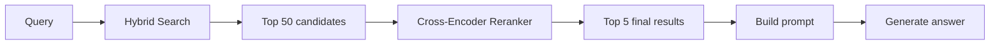
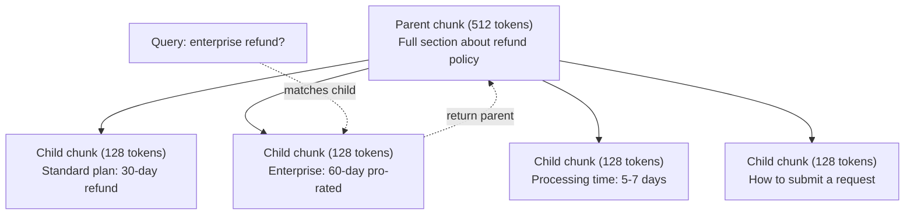
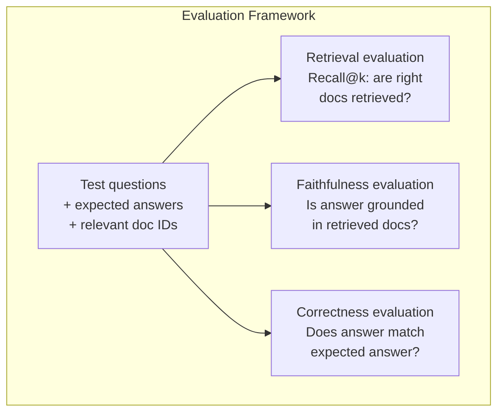

# उन्नत RAG(चक्रिंग、 रैंकिंग、 हाइब्रिड खोज)

> मूल RAG परीक्षा सबसे समान शीर्ष-के टुकड़ा है। यह सरल प्रश्न पर प्रभावी है। लेकिन मल्टी-हॉप तर्क के सामना में, अस्पष्ट प्रश्न और बड़े पैमाने पर कॉर्पस में विफल रहता है। उन्नत RAG 10 दस्तावेजों पर चलने वाले डेमो और 1000 मिलियन दस्तावेजों पर चलने वाले सिस्टम के बीच अंतर है।

**类型：**构建
**语言：**पायथन
**前置要求：**चरण 11, पाठ 06 (RAG)
**时间：**~ 90 मिनट
**相关：**चरण 5 · 23 (RAG के लिए Chunking Strategies) ⇒ सभी छह प्रकार के चंकिंग एल्गोरिदम को कवर करता हैः पुनरावर्ती, अर्थपूर्ण, वाक्य, अभिभावक-दस्तावेज, देर से चंकिंग, संदर्भिक पुनर्प्राप्ति,并包含 वेक्टरा/एंट्रोपिक बेंचमार्क──本课在此基础继续:混合搜索、重新排名、查询转化──

## 学习目标

- 实现能够保留文档结构和上下文的先进分断策略 
-  एक हाइब्रिड खोज पाइपलाइन का निर्माण, BM25 कीवर्ड सेमीटिक वेक्टर खोज और क्रॉस-एन्कोडर पुनः रैंकर के साथ मेल खाने वाला 结合起来
- 应用 query transformation 技术 HyDE、multi-query、step-back), सुधार模糊 या जटिल समस्याओं का पता लगाने के प्रभाव
- 诊断并修复常见 RAG 失败:检索到错误块、答案不在背景中、多跳推理 崩

## 问题

आप पाठ 06 में एक बुनियादी आरएजी पाइपलाइन का निर्माण करते हैं। यह एक छोटे से कॉर्पस में सीधे प्रश्न का उत्तर देता है।

**模糊 query**:"पिछले तिमाही में राजस्व क्या था? " अर्थिक खोज  वापसी राजस्व रणनीति  राजस्व अनुमानों, तथा सीएफओ  राजस्व वृद्धि के बारे में ️ का हिस्सा ️ हैं ️ हैं ️ हैं ️ हैं ️ हैं ️ हैं ️ हैं ️ हैं ️ ️ हैं ️ ️ हैं ️ हैं ️ हैं ️ हैं ️ हैं ️ हैं ️ हैं ️ हैं ️ हैं ️ हैं ️ हैं ️ हैं ️ हैं ️ हैं ️ हैं ️ हैं ️ हैं ️ हैं ️ हैं ️ हैं ️ हैं                                                                                                                                                                        $47.2M in Q3 2025"，但使用的是 "earnings" 而不是 "revenue"。Embedding model 认为 "revenue strategy" 比 "Q3 earnings were $47.2M" अधिक निकट प्रश्न

**Multi-hop question**:"कौन सी टीम में ग्राहक संतुष्टि स्कोर में सबसे अधिक सुधार हुआ? " यह प्रत्येक टीम के संतुष्टि स्कोर को खोजने, तुलना करने, और अधिकतम मूल्य को पहचानने की आवश्यकता है।

**大规模 corpus 问题**:आपके पास 200 मिलियन टुकड़े हैं। सही उत्तर #1,847,293 में है। आपका शीर्ष 5 रिकवरी #14、#89,201、#1,200,000、#44 और #901,333 में है। वे एम्बेडिंग स्पेस में करीब आते हैं, लेकिन कोई उत्तर नहीं है। इस आकार में, निकटतम पड़ोसी खोज में पर्याप्त त्रुटियां होती हैं, जिससे संबंधित परिणाम शीर्ष-क बाहर निकल जाते हैं।

मूल RAG  असफल होने का कारण वेक्टर समानता नहीं है संबंधितता से ⋅ एक टुकड़ा है जो कि भाषा के अर्थ में क्वेरी से समान है, लेकिन उत्तर देने में कोई मदद नहीं है ⋅ उन्नत RAG चार प्रकार की तकनीक का उपयोग करके इस समस्या को हल करता हैः हाइब्रिड खोज ⋅ जोड़ें कीवर्ड मिलान) ⋅ पुनः रैंकिंग ⋅ अधिक विस्तार से उम्मीदवार 打分 ⋅ क्वेरी परिवर्तन ⋅ खोज में पहले संशोधन क्वेरी), तथा बेहतर क्वेरी ⋅ अनुकूलित ग्रेड की जांच ⋅

## 核心概念

### हाइब्रिड खोजःसैमानिक + कीवर्ड

अर्थपूर्ण खोज(वेक्टर समानता)擅长理解含义──"मैं अपनी सदस्यता कैसे रद्द करूं? " 即使与"आपकी योजना को समाप्त करने के लिए कदम " 没有共享单词,也能匹配──但它会漏掉精确匹配──"错误代码 E-4021"可能不能匹配包含"E-4021" का टुकड़ा, क्योंकि एम्बेडिंग मॉडल इसे आवाज के रूप में कर सकता है──

Keyword search(BM25) ठीक है विपरीत। यह अच्छा है सटीक匹配──"E-4021" 能完美匹配── लेकिन यदि दस्तावेज़ लिखता है "अपनी योजना समाप्त करें"," मेरी सदस्यता रद्द करें"

हाइब्रिड खोज एक ही समय में दोनों को चलाने के बाद परिणाम मिलेंगे।

**BM25**(बेस्ट मिलान 25) मानक खोजशब्द खोज एल्गोरिथ्म है। 1990 के दशक के बाद से, यह खोज इंजन का मूल है।

```
BM25(q, d) = sum over terms t in q:
    IDF(t) * (tf(t,d) * (k1 + 1)) / (tf(t,d) + k1 * (1 - b + b * |d| / avgdl))
```

इनमें tf(t,d) है शब्द t 在文档 d 中的术语频率,IDF(t) है उल्टा दस्तावेज़ आवृत्ति,

通俗地说: जब दस्तावेज में क्वेरी शब्द होते हैं (विशेष रूप से दुर्लभ शब्द) तो बीएम25 दस्तावेज को अधिक से अधिक हिस्सा देता है, लेकिन दोहराव अवधि के लिए प्राप्ति में कमी आती है।

### पारस्परिक रैंक फ्यूजन (RRF)

आप दो रैंक सूची हैः एक वेक्टर खोज से, एक BM25 से है.

```
RRF_score(d) = sum over rankings R:
    1 / (k + rank_R(d))
```

इनमें से k एक सामान्य संख्या है, आमतौर पर 60), जो कि शीर्ष स्थान पर होने वाले परिणामों को अधिक लाभ लेने से रोकने के लिए है।

एक में वेक्टर खोज 中排名 #1 ∙ BM25 中排名 #5 的文档得分为:1/(60+1) + 1/(60+5) = 0.0164 + 0.0154 = 0.0318

एक में वेक्टर खोज 中排名 #3 ✓ BM25 中排名 #2 的文档得分为:1/(60+3) + 1/(60+2) = 0.0159 + 0.0161 = 0.0320

आरआरएफ इन दो प्रकार के संकेतों को संतुलित करता है। दो सूचियों में से एक में उच्चतम रैंकिंग वाले दस्तावेजों को सर्वश्रेष्ठ स्कोर मिलता है। एक में एक सूची में #1 रैंकिंग मिलती है, लेकिन दूसरी सूची में अनुपस्थित दस्तावेजों को मध्यम स्कोर मिलता है। यह बहुत स्थिर है, क्योंकि यह रैंकिंग का उपयोग करता है, न कि मूल स्कोर, इसलिए दो प्रणालियों के बीच स्कोर वितरण अंतर का कोई प्रभाव नहीं पड़ता है।

### रैंक बदलना

रिट्रीवल (जो भी वेक्टर है, कुंजीशब्द या हाइब्रिड) तेजी से, लेकिन पर्याप्त सटीक नहीं है। यह द्वि-एन्कोडर का उपयोग करता हैः क्वेरी और प्रत्येक दस्तावेज़ को स्वतंत्र रूप से एम्बेड करने के लिए, फिर तुलना करें।

रैंकिंग क्रॉस-एन्कोडर का उपयोग करेंः क्वेरी 和 उम्मीदवार दस्तावेज़ 会一起输入模型,模型输出相关性分数――模型能同时看到两段文本,因此可以捕捉到它们之间的细粒度交互―― क्रॉस-एन्कोडर 能理解"Q3 में कमाई क्या थी?"

权衡是:क्रॉस-एन्कोडर द्वि-एन्कोडर से 100-1000 गुना धीमा है, क्योंकि इसे क्वेरी-डॉक्यूमेंट जोड़ी को संयुक्त रूप से संसाधित करने की आवश्यकता है।



常见 पुनर्गठन मॉडल(2026 阵容):
- Cohere Rerank 3.5: प्रबंधित एपीआई,多语言,在混合 corpus 上 रिकॉल लाभ
- यात्रा पुनः रैंक-2.5:प्रबंधित एपीआई,托管选项中延迟 最低
- Jina-Reranker-v2 बहुभाषीःखुला वजन, समर्थन 100+ 语言
- bge-renanker-v2-m3: खुली-वजन, मजबूत आधार रेखा
- क्रॉस-एन्कोडर/ms-marco-MiniLM-L-6-v2: ओपन-वेट,可在CPU上运行,适合原型
- ColBERTv2 / Jina-ColBERT-v2: देर से बातचीत बहु-वेक्टर रेनकर, में评分时时是 O(टोकन) नहीं O(डॉक्स)

### क्वेरी परिवर्तन

कुछ समय में समस्याएं नहीं हैं, बल्कि प्रश्न में हैं। "नई नीति परिवर्तन के बारे में यह क्या था? " एक बहुत ही खराब खोज प्रश्न है। इसमें कोई विशिष्ट शब्द नहीं है।

**Query rewriting**:把用户查询 改写成更好的搜索查询――LLM यह कर सकते हैंः

```
User: "What was that thing about the new policy change?"
Rewritten: "Recent policy changes and updates"
```

**HyDE（Hypothetical Document Embeddings）**: नहीं प्रश्न के साथ खोज, बल्कि एक परिकल्पनात्मक उत्तर में, इसके लिए करना एम्बेडिंग, फिर खोज समान वास्तविक दस्तावेज

```
Query: "What is the refund policy for enterprise?"
Hypothetical answer: "Enterprise customers are eligible for a full refund
within 60 days of purchase. Refunds are pro-rated based on the remaining
subscription period and processed within 5-7 business days."
```

प्रश्न और उत्तर की अलग भाषाई संरचना है। प्रश्न और उत्तर का निर्माण करके आप प्रश्न स्थान और उत्तर स्थान के बीच एक पुल बना लेते हैं।

HyDE 会在检索前增加一次LLM调调―― यह 500-2000ms विलंबता को बढ़ाएगा―― जब कच्चे क्वेरी की पुनः प्राप्ति गुणवत्ता खराब होती है, तो यह मूल्यवान है――

### माता-पिता-बच्चा के बीच घनघोरता

标准 chunking 迫使你做取舍: छोटा टुकड़ा सटीक निकासी के लिए, बड़ा टुकड़ा पर्याप्त संदर्भ प्रदान करने के लिए उपयोग किया जाता है।

索引小块(128 टोकन) पुनः प्राप्ति के लिए उपयोग किया जाता है。当检索到小块 时,把它的母块(512 टोकन) शीघ्र लौटें。小块 能精确匹配查询──母块 为 LLM 生成好答案提供足够的背景──



प्रश्न "उद्यम रिफंड?" 会精确匹配儿童部分 C2――但提示 收到的是完整的父母部分 P, जिसमें प्रसंस्करण समय और提交流程 के आसपास के संदर्भ शामिल हैं──

### मेटाडेटा फ़िल्टरिंग

之前, 过 corpus:date、source、category、author、language── यह खोज अंतरिक्ष को छोटा करेगा और इससे कोई परिणाम नहीं होगा──

"पिछले महीने सुरक्षा नीति में क्या बदलाव हुआ है? "                                                                                                                                                                                                                                                                                                                                                                                                                                                                                                                

उत्पादन RAG 系统会将元数据与每块一起存储: स्रोत दस्तावेज़、创建日期、类别、作者、版本──वेक्टर डेटाबेस 支持在相似性搜索前按元数据 进行预过, यह बड़े पैमाने पर प्रदर्शन के लिए महत्वपूर्ण है──

### मूल्यांकन

आपने एक RAG सिस्टम बनाया है। यह कैसे पता चलेगा कि यह प्रभावी है?

**Retrieval relevance（Recall@k）**प्रश्नः एक समूह के लिए ज्ञात संबंधित दस्तावेजों के साथ परीक्षण प्रश्न, संबंधित दस्तावेजों के शीर्ष-के परिणामों में अनुपात क्या है? यदि किसी प्रश्न का उत्तर भाग #47, भाग #47 में है, तो क्या शीर्ष-5 में दिखाई दिया?

**Faithfulness**यदि जांच खंड "60 दिन की वापसी खिड़की" लिखा है, जबकि मॉडल जवाब "90 दिन की वापसी खिड़की", यह है वफादारी 失败── मॉडल सही संदर्भ में अभी भी भ्रम में है।

**Answer correctness**: उत्पन्न उत्तर क्या अपेक्षित उत्तर  से मेल खाता है? यह अंत से अंत तक का संकेत है यह पुनः प्राप्ति की गुणवत्ता और उत्पादन की गुणवत्ता को जोड़ता है

एक सरल वफादारी  जाँचः प्राप्त उत्तर में प्रत्येक दावा,并验证 यह है कि क्या यह वस्तुतः प्राप्त टुकड़े में दिखाई देता है।




```figure
agentic-rag-loop
```

## 构建

### 步骤 1:BM25 实现

```python
import math
from collections import Counter

class BM25:
    def __init__(self, k1=1.2, b=0.75):
        self.k1 = k1
        self.b = b
        self.docs = []
        self.doc_lengths = []
        self.avg_dl = 0
        self.doc_freqs = {}
        self.n_docs = 0

    def index(self, documents):
        self.docs = documents
        self.n_docs = len(documents)
        self.doc_lengths = []
        self.doc_freqs = {}

        for doc in documents:
            words = doc.lower().split()
            self.doc_lengths.append(len(words))
            unique_words = set(words)
            for word in unique_words:
                self.doc_freqs[word] = self.doc_freqs.get(word, 0) + 1

        self.avg_dl = sum(self.doc_lengths) / self.n_docs if self.n_docs else 1

    def score(self, query, doc_idx):
        query_words = query.lower().split()
        doc_words = self.docs[doc_idx].lower().split()
        doc_len = self.doc_lengths[doc_idx]
        word_counts = Counter(doc_words)
        score = 0.0

        for term in query_words:
            if term not in word_counts:
                continue
            tf = word_counts[term]
            df = self.doc_freqs.get(term, 0)
            idf = math.log((self.n_docs - df + 0.5) / (df + 0.5) + 1)
            numerator = tf * (self.k1 + 1)
            denominator = tf + self.k1 * (1 - self.b + self.b * doc_len / self.avg_dl)
            score += idf * numerator / denominator

        return score

    def search(self, query, top_k=10):
        scores = [(i, self.score(query, i)) for i in range(self.n_docs)]
        scores.sort(key=lambda x: x[1], reverse=True)
        return scores[:top_k]
```

### 步骤 2: पारस्परिक रैंक फ्यूजन

```python
def reciprocal_rank_fusion(ranked_lists, k=60):
    scores = {}
    for ranked_list in ranked_lists:
        for rank, (doc_id, _) in enumerate(ranked_list):
            if doc_id not in scores:
                scores[doc_id] = 0.0
            scores[doc_id] += 1.0 / (k + rank + 1)
    fused = sorted(scores.items(), key=lambda x: x[1], reverse=True)
    return fused
```

### 步骤 3: हाइब्रिड खोज पाइपलाइन

```python
def hybrid_search(query, chunks, vector_embeddings, vocab, idf, bm25_index, top_k=5, fusion_k=60):
    query_emb = tfidf_embed(query, vocab, idf)
    vector_results = search(query_emb, vector_embeddings, top_k=top_k * 3)
    bm25_results = bm25_index.search(query, top_k=top_k * 3)
    fused = reciprocal_rank_fusion([vector_results, bm25_results], k=fusion_k)
    return fused[:top_k]
```

### 步骤 4: सरल रेंकर

उत्पादन में, आप क्रॉस-एन्कोडर मॉडल का उपयोग करेंगे। यहाँ हम एक रेंकर का निर्माण करते हैं, शब्द ओवरलैप का उपयोग करते हैं।

```python
def rerank(query, candidates, chunks):
    query_words = set(query.lower().split())
    stop_words = {"the", "a", "an", "is", "are", "was", "were", "what", "how",
                  "why", "when", "where", "do", "does", "for", "of", "in", "to",
                  "and", "or", "on", "at", "by", "it", "its", "this", "that",
                  "with", "from", "be", "has", "have", "had", "not", "but"}
    query_terms = query_words - stop_words

    scored = []
    for doc_id, initial_score in candidates:
        chunk = chunks[doc_id].lower()
        chunk_words = set(chunk.split())

        term_overlap = len(query_terms & chunk_words)

        query_bigrams = set()
        q_list = [w for w in query.lower().split() if w not in stop_words]
        for i in range(len(q_list) - 1):
            query_bigrams.add(q_list[i] + " " + q_list[i + 1])
        bigram_matches = sum(1 for bg in query_bigrams if bg in chunk)

        position_boost = 0
        for term in query_terms:
            pos = chunk.find(term)
            if pos != -1 and pos < len(chunk) // 3:
                position_boost += 0.5

        rerank_score = (
            term_overlap * 1.0
            + bigram_matches * 2.0
            + position_boost
            + initial_score * 5.0
        )
        scored.append((doc_id, rerank_score))

    scored.sort(key=lambda x: x[1], reverse=True)
    return scored
```

### 步骤 5:HyDE(अनुमानित दस्तावेज़ एम्बेड)

```python
def hyde_generate_hypothesis(query):
    templates = {
        "what": "The answer to '{query}' is as follows: Based on our documentation, {topic} involves specific policies and procedures that define how the process works.",
        "how": "To address '{query}': The process involves several steps. First, you need to initiate the request. Then, the system processes it according to the defined rules.",
        "default": "Regarding '{query}': Our records indicate specific details and policies related to this topic that provide a comprehensive answer."
    }
    query_lower = query.lower()
    if query_lower.startswith("what"):
        template = templates["what"]
    elif query_lower.startswith("how"):
        template = templates["how"]
    else:
        template = templates["default"]

    topic_words = [w for w in query.lower().split()
                   if w not in {"what", "is", "the", "how", "do", "does", "a", "an",
                                "for", "of", "to", "in", "on", "at", "by", "and", "or"}]
    topic = " ".join(topic_words) if topic_words else "this topic"

    return template.format(query=query, topic=topic)


def hyde_search(query, chunks, vector_embeddings, vocab, idf, top_k=5):
    hypothesis = hyde_generate_hypothesis(query)
    hypothesis_emb = tfidf_embed(hypothesis, vocab, idf)
    results = search(hypothesis_emb, vector_embeddings, top_k)
    return results, hypothesis
```

### 步骤 6: माता-पिता-बच्चा चकनाचूर

```python
def create_parent_child_chunks(text, parent_size=200, child_size=50):
    words = text.split()
    parents = []
    children = []
    child_to_parent = {}

    parent_idx = 0
    start = 0
    while start < len(words):
        parent_end = min(start + parent_size, len(words))
        parent_text = " ".join(words[start:parent_end])
        parents.append(parent_text)

        child_start = start
        while child_start < parent_end:
            child_end = min(child_start + child_size, parent_end)
            child_text = " ".join(words[child_start:child_end])
            child_idx = len(children)
            children.append(child_text)
            child_to_parent[child_idx] = parent_idx
            child_start += child_size

        parent_idx += 1
        start += parent_size

    return parents, children, child_to_parent
```

### 步骤 7: वफादारी मूल्यांकन

```python
def evaluate_faithfulness(answer, retrieved_chunks):
    answer_sentences = [s.strip() for s in answer.split(".") if len(s.strip()) > 10]
    if not answer_sentences:
        return 1.0, []

    grounded = 0
    ungrounded = []
    context = " ".join(retrieved_chunks).lower()

    for sentence in answer_sentences:
        words = set(sentence.lower().split())
        stop_words = {"the", "a", "an", "is", "are", "was", "were", "and", "or",
                      "to", "of", "in", "for", "on", "at", "by", "it", "this", "that"}
        content_words = words - stop_words
        if not content_words:
            grounded += 1
            continue

        matched = sum(1 for w in content_words if w in context)
        ratio = matched / len(content_words) if content_words else 0

        if ratio >= 0.5:
            grounded += 1
        else:
            ungrounded.append(sentence)

    score = grounded / len(answer_sentences) if answer_sentences else 1.0
    return score, ungrounded


def evaluate_retrieval_recall(queries_with_relevant, retrieval_fn, k=5):
    total_recall = 0.0
    results = []

    for query, relevant_indices in queries_with_relevant:
        retrieved = retrieval_fn(query, k)
        retrieved_indices = set(idx for idx, _ in retrieved)
        relevant_set = set(relevant_indices)
        hits = len(retrieved_indices & relevant_set)
        recall = hits / len(relevant_set) if relevant_set else 1.0
        total_recall += recall
        results.append({
            "query": query,
            "recall": recall,
            "hits": hits,
            "total_relevant": len(relevant_set)
        })

    avg_recall = total_recall / len(queries_with_relevant) if queries_with_relevant else 0
    return avg_recall, results
```

## उपयोग

प्रयोग वास्तविक क्रॉस-कोडर  पुनः रैंकिंग करें:

```python
from sentence_transformers import CrossEncoder

reranker = CrossEncoder("cross-encoder/ms-marco-MiniLM-L-6-v2")

def rerank_with_cross_encoder(query, candidates, chunks, top_k=5):
    pairs = [(query, chunks[doc_id]) for doc_id, _ in candidates]
    scores = reranker.predict(pairs)
    scored = list(zip([doc_id for doc_id, _ in candidates], scores))
    scored.sort(key=lambda x: x[1], reverse=True)
    return scored[:top_k]
```

Cohere का प्रबंधित रेंकर का उपयोग करेंः

```python
import cohere

co = cohere.Client()

def rerank_with_cohere(query, candidates, chunks, top_k=5):
    docs = [chunks[doc_id] for doc_id, _ in candidates]
    response = co.rerank(
        model="rerank-english-v3.0",
        query=query,
        documents=docs,
        top_n=top_k
    )
    return [(candidates[r.index][0], r.relevance_score) for r in response.results]
```

प्रयोग真实 LLM 实现 HyDE:

```python
import anthropic

client = anthropic.Anthropic()

def hyde_with_llm(query):
    response = client.messages.create(
        model="claude-sonnet-4-20250514",
        max_tokens=256,
        messages=[{
            "role": "user",
            "content": f"Write a short paragraph that would be a good answer to this question. Do not say you don't know. Just write what the answer would look like.\n\nQuestion: {query}"
        }]
    )
    return response.content[0].text
```

प्रयोग Weaviate  उत्पादन हाइब्रिड खोज करने के लिएः

```python
import weaviate

client = weaviate.connect_to_local()

collection = client.collections.get("Documents")
response = collection.query.hybrid(
    query="enterprise refund policy",
    alpha=0.5,
    limit=10
)
```

अल्फा 参数控制平衡:0.0 = 纯关键词(BM25),1.0 = 纯 वेक्टर,0.5 = 等权重── अधिकांश उत्पादन 系统使用0.3 से 0.7 之间 अल्फा──

## 交付

本课会产出:
- `outputs/prompt-advanced-rag-debugger.md`-- निदान और मरम्मत के लिए RAG गुणवत्ता के मुद्दों के लिए शीघ्र
- `outputs/skill-advanced-rag.md`-- उत्पादन-ग्रेड RAG की क्षमता के निर्माण के लिए हाइब्रिड खोज और पुनः रैंकिंग के साथ

## अभ्यास

1. उदाहरण दस्तावेज़ में ऊपर तुलना BM25、वेक्टर खोज तथा हाइब्रिड खोज── प्रत्येक 5 परीक्षण क्वेरी में, रिकॉर्ड किस प्रकार का तरीका है जो #1 स्थिति में है  सबसे संबंधित टुकड़ा को लौटाए― हाइब्रिड खोज  कम से कम 5 में से 3  को जीतना चाहिए।

2. 实现 मेटाडेटा फ़िल्टर──为每文档 添加一个"类别"字段(सुरक्षा、 बिलिंग、api、产品)──在运行 भेक्टर खोज 前,只过出相关类别的部分──用"क्या एन्क्रिप्शन का उपयोग किया जाता है? 测试,并验证它只搜索安全类别的部分──

3. उपयोग पाठ 06 में सरल उत्पन्न फ़ंक्शन 构建完整HyDE पाइपलाइन──在全部 5 测试查询上比较直接查询搜索与HyDE搜索的检索质量(前三相关性)──HyDE 应能改善模糊查询的结果──

4. ⇒ नमूना दस्तावेज़ में 上实现 माता-पिता-बच्चे के टुकड़े करने की रणनीति── उपयोग child_size=30 和 parent_size=100── बच्चे के टुकड़े के साथ 搜索, लेकिन शीघ्र में वापस माता-पिता के टुकड़े── उत्पन्न होगा जवाब ⇒ मानक टुकड़े के साथ ⇒ तुलना करें ⇒

5. 创建评估数据集:10 个问题,带已知答案分别测量 (a) 仅矢量搜索,(b) 仅 BM25,(c) हाइब्रिड搜索,(d) हाइब्रिड + पुनः रैंकिंग 的 Recall@3、Recall@5 和 Recall@10──绘制结果,并识别重排 最有帮助的位置──

## 关键术语

| Term | 人们通常怎么说 | 实际含义 |
|------|----------------|----------------------|
| BM25 | "Keyword search" | 一种概率排序算法，根据 term frequency、inverse document frequency 和 document length normalization 给文档打分 |
| Hybrid search | "Best of both worlds" | 并行运行 semantic（Vector）search 和 keyword（BM25）search，然后用 rank fusion 合并结果 |
| Reciprocal Rank Fusion | "Merge ranked lists" | 对每个文档在所有列表中的 1/(k + rank) 求和，从而组合多个 ranked list |
| Reranking | "Second pass scoring" | 使用成本更高的 cross-encoder model，对 initial retrieval 得到的 candidate set 重新打分 |
| Cross-encoder | "Joint query-document model" | 将 query 和 document 作为单个输入并生成相关性分数的模型；比 bi-encoder 更准确，但对 full corpus search 来说太慢 |
| Bi-encoder | "Independent embedding model" | 独立对 query 和 document 做 Embedding 的模型；由于 Embedding 可预计算，因此速度快，但不如 cross-encoder 准确 |
| HyDE | "Search with a fake answer" | 为 query 生成 hypothetical answer，对其做 Embedding，并搜索与它相似的真实文档 |
| Parent-child chunking | "Small search, big context" | 为精确 retrieval 索引小 chunk，但返回更大的 parent chunk 以提供足够 context |
| Metadata filtering | "Narrow before searching" | 在运行 Vector search 前，根据属性（date、source、category）过滤文档以缩小搜索空间 |
| Faithfulness | "Did it stay grounded" | 生成答案是否由 retrieved document 支持，而不是来自模型训练数据的 hallucination |

## 延伸阅读

- रॉबर्टसन और सारगोसा, "द प्रोबाइलिस्टिक रिलेवेंस फ्रेमवर्कः BM25 एंड बियॉन्ड" (2009) -- BM25 का अधिकारिक संदर्भ, व्याख्या公式背后的概率基础
- Cormack et al., "रिस्पोकल रैंक फ्यूजन कॉन्डोर्सेट और व्यक्तिगत रैंक सीखने के तरीकों से बेहतर प्रदर्शन करता है" (2009) -- RRF 原始论文,展示它优于更复杂的融合方法
- Gao et al., "Precise Zero-Shot Dense Retrieval without Relevance Labels" (2022) -- HyDE 论文, साबित करना परिकल्पनात्मक दस्तावेज़ एम्बेडमेंट्स बिना किसी प्रशिक्षण डेटा के पुनर्प्राप्ति में सुधार कर सकते हैं
- Nogueira & Cho, "BERT के साथ पासज री-रैंकिंग" (2019) -- 展示在 BM25 之上 क्रॉस-एन्कोडर री-रैंकिंग करने से पुनर्प्राप्त करने की गुणवत्ता में काफी सुधार होगा
- [Khattab et al., "DSPy: Compiling Declarative Language Model Calls into Self-Improving Pipelines" (2023)](https://arxiv.org/abs/2310.03714)-- शीघ्र निर्माण और वजन चयन 视为检索管道 上的优化问题; इस लेख को पढ़ें "प्रोग्राम LLM", बजाय "प्रोम्प्ट LLM" को समझने के लिए।
- [Edge et al., "From Local to Global: A Graph RAG Approach to Query-Focused Summarization" (Microsoft Research 2024)](https://arxiv.org/abs/2404.16130)-- GraphRAG 论文: इकाई-संबंध निष्कर्षण + लीडेन समुदाय का पता लगाना, क्वेरी-केंद्रित सारांश के लिए उपयोग किया जाता है; तथा वैश्विक बनाम स्थानीय पुनर्प्राप्ति का区别──
- [Asai et al., "Self-RAG: Learning to Retrieve, Generate, and Critique through Self-Reflection" (ICLR 2024)](https://arxiv.org/abs/2310.11511)-- 带反射 टोकन 的自评估 RAG;静态 पुनः प्राप्ति-फिर-उत्पन्न 后后的代理前沿──
- [LangChain Query Construction blog](https://blog.langchain.dev/query-construction/)-- 如何将自然语言查询 转换为结构化数据库查询(Text-to-SQL、Cypher), पूर्व-प्राप्ती चरण के रूप में。
