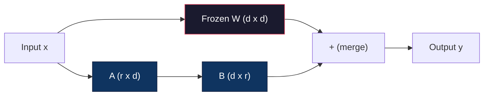
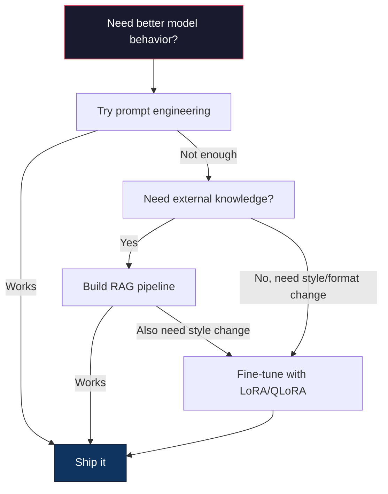

# प्रयोग LoRA & QLoRA  फाइन ट्यूनिंग करें

> एक 7 बी मॉडल के लिए पूर्ण ठीक-ठाक करना  56 जीबी वीआरएएम की आवश्यकता है। आप इतने अधिक नहीं हैं। अधिकांश कंपनियों में भी नहीं है। लोरा के माध्यम से प्रशिक्षण 1% के पैरामीटर से कम है, जिससे आप 6 जीबी में ठीक-ठाक एक ही मॉडल के साथ कर सकते हैं। यह समझौता नहीं है - यह अधिकांश कार्यों पर पूर्ण ठीक-ठाक गुणवत्ता प्राप्त कर सकता है।

**Type:** Build
**Languages:** Python
**Prerequisites:** Phase 10, Lesson 06 (Instruction Tuning / SFT)
**Time:** ~75 minutes
**Related:**चरण 10 से शून्य व्याख्या SFT/DPO लूप──本课会把这些连入2026 PEFT 工具链(PEFT, TRL, Unsloth, Axolotl, LLaMA-Factory)

## 学习目标
-                                                                                                                                                                                                                                                               
- 計算 LoRA 相比 पूर्ण-अच्छी तरह से समायोजित करने के लिए 参数节省:rank r、d_model 维度时, प्रशिक्षण 2*r*d 个参数 है, बजाय d^2
- QLoRA प्रयोग ((4-बिट क्वांटिज़्ड बेस + LoRA एडाप्टर) फाइन-ट्यून एक मॉडल, make its适配消费级 GPU मेमोरी
- उपयोग करने के लिए तैनाती, और तुलना करने के लिए लोरा वजन 合并回 आधार मॉडल                                                                                                                                                                                                                                                    

## 问题
आप एक मूल मॉडल है――Llama 3 8B――आप इसे अपनी कंपनी की भाषा का उपयोग करना चाहते हैं।

पूर्ण ठीक-ठाक 会更新模型 中的每一个参数──Llama 3 8B 有 80亿个参数──在fp16中, प्रत्येक参数占有2字节──仅载重量 就需要16GB──训练期间,你还需要梯度(16GB)、亚当的优化状态(momentum +variance 需要32GB) 以及激活──总计:单个8B模型 大约需要56GBVRAM──

A100 80GB 勉强能装下──两张 A100 在云提供商上每小时花费 $3-4。用 50,000 个样本训练 3 个 epochs 需要 6-10 小时。每次实验就是 $30-40:- हाइपरपरमैटर्स को ठीक करने के लिए 10 बार प्रयोग करें, कुछ भी तैनात करने से पहले आप $400 खर्च कर चुके हैं

इसे लामा 3 70B तक विस्तारित करें, संख्यात्मक रूप से खराब हो जाएगा। केवल वजन 140GB की आवश्यकता होगी। आपको एक क्लस्टर की आवश्यकता होगी। प्रत्येक प्रयोग के लिए $ 100+।

एक और गहरी समस्या है। पूर्ण ठीक-ठाक मॉडल में प्रत्येक वजन को बदल देगा। यदि आप ग्राहक सहायता डेटा पर ठीक-ठाक करते हैं, तो मॉडल की सामान्य क्षमता को नुकसान पहुंचा सकता है। इसे आपदाजनक भूलना कहा जाता है।

आपको एक विधि की आवश्यकता हैः प्रशिक्षण कम तत्वों, कम स्मृति का उपयोग, और मॉडल को नष्ट नहीं करेगा 已知──

## 概念
### लोरा: निम्न श्रेणी के अनुकूलन

एडवर्ड हू और माइक्रोसॉफ्ट के सहयोगियों ने जून 2021 में LoRA को प्रकाशित किया। उनके शोध में जानकारी यह हैः फाइन-ट्यूनिंग के दौरान वजन अपडेट  निम्न आंतरिक रैंक 👇 आपको 4096x4096 वजन मैट्रिक्स में से सभी 1670 मिलियन तत्वों को अपडेट करने की आवश्यकता नहीं है।

数学如下── एक मानक रैखिक परत 计算:

```
y = Wx
```

इनमें से W एक d_out x d_in मैट्रिक्स है। 4096x4096 ध्यान प्रक्षेपण के लिए, यह 16,777,216 个参数 है।

लोरा 结 W,并添加一个低排分解:

```
y = Wx + BAx
```

इनमें से बी है (d_out x r), ए है (r x d_in) ・ रैंक r 远小于 d - आमतौर पर 8、16 या 32。

 4096x4096 परत के लिए ऊपर का r=16:
- मूल तत्व:4096 x 4096 = 16,777,216
- LoRA 参数:(4096 x 16) + (16 x 4096) = 65,536 + 65,536 = 131,072
-                                                                                                                                                                                                                                                                                                                                                                                                                                                                                                                              

आप प्रशिक्षण 0.78% के लिए गुण प्राप्त करते हैं, 95-100% की गुणवत्ता प्राप्त करते हैं।



उपयोग随机 गौशियन 初始化──B 初始化为零── इसका अर्थ है लोरा योगदान 从零开始 -- मॉडल 从原始行为开始训练,然后逐步学习适应──

### स्केलिंग फैक्टरः अल्फा

लोरा  आउटपुट के प्रभाव की डिग्री पर निम्न स्तर के अपडेट को नियंत्रित करने के लिए एक स्केलिंग कारक अल्फा को पेश करता हैः

```
y = Wx + (alpha / r) * BAx
```

जब अल्फा = r 时, स्केलिंग 1x है──当 अल्फा = 2r(常见默认值)

实践建议:
- alpha = 2 * rank is常见社区约定(原始论文在多数实验中使用alpha = rank)
- अल्फा = रैंक  प्रदान 1x स्केलिंग, संरक्षित लेकिन स्थिर
- अधिक उच्च अल्फा का अर्थ है हर कदम से अधिक अद्यतन, हो सकता है तेजी से प्राप्त, भी हो सकता है कारण अस्थिरता

### लोरा को कहाँ लागू किया जाए

एक ट्रांसफार्मर में कई रैखिक परतें हैं। आपको सभी परतों को जोड़ने की आवश्यकता नहीं है।

| Target Layers | Trainable Params (7B) | Quality |
|--------------|----------------------|---------|
| q_proj only | 4.7M | 好 |
| q_proj + v_proj | 9.4M | 更好 |
| q_proj + k_proj + v_proj + o_proj | 18.9M | 对 attention 最好 |
| All linear (attention + MLP) | 37.7M | 边际收益，参数量 2x |

अधिकांश कार्य के लिए एक मिठाई बिंदुःq_proj + v_proj── यह प्रश्न और मूल्य अनुमानों के बीच आत्म-विचार के लिए तैयार है, वे मॉडल को नियंत्रित करते हैं 关注什么以及提取什么信息── एमएलपी परतों को जोड़ना कोड निर्माण जैसे जटिल कार्यों के लिए मददगार है, लेकिन संख्या को दोगुना करने में मदद करेगा, सरल कार्यों के लिए लाभ में कमी आएगी──

### रैंक चयन

रैंक r  नियंत्रण अनुकूलन की प्रदर्शन क्षमताः

| Rank | Trainable Params (per layer) | Best For |
|------|---------------------------|----------|
| 4 | 32,768 | 简单 classification、sentiment |
| 8 | 65,536 | 单领域 Q&A、summarization |
| 16 | 131,072 | 多领域任务、instruction following |
| 32 | 262,144 | 复杂 reasoning、代码生成 |
| 64 | 524,288 | 大多数任务收益递减 |
| 128 | 1,048,576 | 很少值得使用 |

Hu et al. ⇒ दिखाया, सरल कार्य के लिए, r=4 已经能够捕获大部分适应──r=8 和 r=16 实践中最常见的选择──r=64 很少改善质量,并开始失去洛拉的记忆优势──

### QLoRA: 4-बिट क्वांटिज़ेशन + लोरा

टीम डेटमर और वाशिंगटन विश्वविद्यालय के सहयोगियों ने 2023 के मई में QLoRA प्रकाशित किया।

यह ध्यान देने योग्य स्मृति को बदल देगाः

| Method | Weight Memory (7B) | Training Memory (7B) | GPU Required |
|--------|-------------------|---------------------|-------------|
| Full fine-tune (fp16) | 14GB | ~56GB | 1x A100 80GB |
| LoRA (fp16 base) | 14GB | ~18GB | 1x A100 40GB |
| QLoRA (4-bit base) | 3.5GB | ~6GB | 1x RTX 3090 24GB |

QLoRA के पास तीन तकनीकी योगदान हैंः

**NF4 (Normal Float 4-bit)**: एक विशेष रूप से न्यूरल नेटवर्क के वजन के लिए डिज़ाइन किया गया नया डेटा प्रकार। न्यूरल नेटवर्क के वजन सामान्य वितरण के अनुरूप हैं। एनएफ 4 ने अपने 16 मात्रा स्तरों को मानक सामान्य वितरण के मात्राओं पर रखा है। सामान्य रूप से वितरित डेटा के लिए, यह सूचनात्मक अर्थों में सबसे अच्छा है।

**Double quantization**: क्वांटिज़ेशन स्थिरांक 本身也占存量──每 64 个重量的块 需要一个fp32 पैमाने कारक(4 बाइट्स)── 7B मॉडल के लिए, यह अतिरिक्त 0.4GB होगा──双量子化将这些常数量化到fp8,把上空费率降至0.1GB──虽然小但会积累──

**Paged optimizers**प्रशिक्षण के दौरान, लंबे क्रम पर अनुकूलक राज्यों(आदम की गति और भिन्नता) GPU स्मृति से अधिक हो सकता है;;पेज अनुकूलक उपयोग NVIDIA एकीकृत स्मृति, GPU स्मृति में 耗尽 समय स्वचालित रूप से अनुकूलक राज्यों पृष्ठ को CPU रैम करने के लिए, और जरूरत है जब पृष्ठ वापस आओ।

### गुणवत्ता का प्रश्न

減参数或量化基会损害质量吗?多篇论文的结果:

| Method | MMLU (5-shot) | MT-Bench | HumanEval |
|--------|--------------|----------|-----------|
| Full fine-tune (Llama 2 7B) | 48.3 | 6.72 | 14.6 |
| LoRA r=16 | 47.9 | 6.68 | 14.0 |
| QLoRA r=16 (NF4) | 47.5 | 6.61 | 13.4 |
| QLoRA r=64 (NF4) | 48.1 | 6.70 | 14.2 |

लोरा में r=16 , मेज़ॉरिटी बेंचमार्क ऊपर पूर्ण ठीक-ट्यूनिंग से तुलना में 1% तक भिन्न नहीं है।

### वास्तविक दुनिया की लागत

में 50,000 个样本上 बारीक-ट्यून लामा 3 8B(3 युग):

| Method | GPU | Time | Cost |
|--------|-----|------|------|
| Full fine-tune | 2x A100 80GB | 8 hours | ~$32 |
| LoRA r=16 | 1x A100 40GB | 4 hours | ~$8 |
| QLoRA r=16 | 1x RTX 4090 24GB | 6 hours | ~$5 |
| QLoRA r=16 (Unsloth) | 1x RTX 4090 24GB | 2.5 hours | ~$2 |
| QLoRA r=16 | 1x T4 16GB | 12 hours | ~$4 |

QLoRA की लागत एक भोजन तक नहीं है। यही कारण है कि 2023 में खुले वजन के ठीक-ठाक समुदाय में विस्फोट हुआ है, यही कारण है कि 2026 में प्रत्येक प्रशिक्षण ढांचे में QLoRA प्रदान करने की सहमति है।

### 2026 पीईएफटी स्टैक

| Framework | What it is | Pick when |
|-----------|-----------|-----------|
| **Hugging Face PEFT** | 规范的 LoRA/QLoRA/DoRA/IA3 library | 你想要原始控制权，并且 training loop 已经基于 `transformers.Trainer` |
| **TRL** | HF 的 reinforcement-from-feedback trainers（SFT, DPO, GRPO, PPO, ORPO） | 你在 SFT 后需要 DPO/GRPO；构建在 PEFT 之上 |
| **Unsloth** | forward/backward pass 的 Triton-kernel 重写 | 你想要 2-5x 加速 + 一半 VRAM 且无 accuracy loss；Llama/Mistral/Qwen 系列 |
| **Axolotl** | PEFT + TRL + DeepSpeed + Unsloth 之上的 YAML-config wrapper | 你想要可复现、版本控制的 training runs |
| **LLaMA-Factory** | PEFT + TRL 之上的 GUI/CLI/API | 你想要 zero-code fine-tuning；支持 100+ model families |
| **torchtune** | Native PyTorch recipes，无 `transformers` 依赖 | 你想要最少依赖，且组织已经标准化使用 PyTorch |

经验法则:研究用途或一次性实验 → PEFT──可重复的生产管 line── 启用 Unsloth kernels的 Axolotl──一次性原型── LLaMA-Factory──

### एडाप्टर को मिलाएं

प्रशिक्षण के बाद, आपके पास दो चीजें हैंः एक मूल मॉडल और एक छोटा लोरा एडाप्टर (आमतौर पर 10-100MB)

1. **保持分离**: लोड बेस मॉडल, उस पर लोड एडाप्टर──为不同任务切换适配器──这就是用一个基础模型 服务多个细调变的方式──

2. **永久合并**: गणना W' = W + (alpha/r) * BA,并把结果保存为一个新的全模型──原始模型与原始模型相合模型 大小相同──没有推断过费──没有适配器 需要管理──

यदि सेवा एकाधिक कार्य करते हैं, तो एक विशेष मॉडल तैनात करना, तो एक साथ।

कई एडाप्टरों के संयोजन के लिए उपयोग की जाने वाली उच्च विलय तकनीकः

- **TIES-Merging**(Yadav et al. 2023): कट कट 参数, साइन संघर्षों को हल करें, फिर合并──减少适配器 之间的干扰──
- **DARE**(यू और अन्य 2023): विलय में पूर्व随机丢弃适配参数,并重新缩放剩余部分──组合能力时出人意料地有效──
- **Task arithmetic**: सीधे जोड़ें और एडाप्टर वजन को कम करें। एक "कोड" एडाप्टर और एक "गणित" एडाप्टर को जोड़ें। इसके अतिरिक्त, आमतौर पर एक मॉडल मिलता है जो दोनों में अच्छा है।

### जब ठीक-ठाक नहीं करना चाहिए

ठीक-ठीक करना तीसरा विकल्प है, पहला नहीं।

**第一：prompt engineering。**写一个更好的系统提示──加入一些拍摄的例子──使用链条思想──这没有成本,只需几分钟──如果提示已经能达到80%,你可能不需要细节调──

**第二：RAG。**यदि मॉडल को आपके विशिष्ट डेटा को समझने की आवश्यकता है, दस्तावेज, ज्ञान आधार, उत्पाद कैटलॉग), पुनः प्राप्ति इसे वजन में लाने से अधिक सस्ता, या अधिक आसान है।

**第三：fine-tuning。**जब आपको मॉडल की आवश्यकता होती है  विशिष्ट शैली, प्रारूप या तर्क पैटर्न को अपनाने, जबकि प्रलोभन  नहीं हो सकता है  उपयोग करते समय इसका उपयोग करें  जब आपको एक संगत संरचित आउटपुट  जब आपको एक बड़ा मॉडल को छोटे मॉडल तक डिस्टिल करने की आवश्यकता होती है  जब लटेंसी  महत्वपूर्ण है, और आप कुछ शॉट प्रलोभन  के साथ अतिरिक्त टोकन  जब 




```figure
lora-params
```

##  इसे निर्माण
हम शुद्ध PyTorch से शून्य से LoRA को पूरा करने के लिए उपयोग करते हैं। कोई पुस्तकालयों नहीं है। कोई जादू नहीं है। आप एक LoRA परत का निर्माण करेंगे, इसे मॉडल में डाल देंगे, इसे प्रशिक्षित करेंगे, और वजन को वापस ले जाएंगे।

### 步骤 1: लोरा परत

```python
import torch
import torch.nn as nn
import math

class LoRALayer(nn.Module):
    def __init__(self, in_features, out_features, rank=8, alpha=16):
        super().__init__()
        self.rank = rank
        self.alpha = alpha
        self.scaling = alpha / rank

        self.A = nn.Parameter(torch.randn(in_features, rank) * (1 / math.sqrt(rank)))
        self.B = nn.Parameter(torch.zeros(rank, out_features))

    def forward(self, x):
        return (x @ self.A @ self.B) * self.scaling
```

उपयोग संकुचित के बाद का随机值初始化──B初始化为零──乘积 BA从零开始,所以模型以原始行为开始──

### 步骤 2: लोरा-वॉल्ड रैखिक परत

```python
class LinearWithLoRA(nn.Module):
    def __init__(self, linear, rank=8, alpha=16):
        super().__init__()
        self.linear = linear
        self.lora = LoRALayer(
            linear.in_features, linear.out_features, rank, alpha
        )

        for param in self.linear.parameters():
            param.requires_grad = False

    def forward(self, x):
        return self.linear(x) + self.lora(x)
```

मूल रैखिक परत 被结──只有 LoRA 参数(A 和 B) 是可训练的──

### 步骤 3: एक मॉडल में LoRA इंजेक्ट करें

```python
def inject_lora(model, target_modules, rank=8, alpha=16):
    for param in model.parameters():
        param.requires_grad = False

    lora_layers = {}
    for name, module in model.named_modules():
        if isinstance(module, nn.Linear):
            if any(t in name for t in target_modules):
                parent_name = ".".join(name.split(".")[:-1])
                child_name = name.split(".")[-1]
                parent = dict(model.named_modules())[parent_name]
                lora_linear = LinearWithLoRA(module, rank, alpha)
                setattr(parent, child_name, lora_linear)
                lora_layers[name] = lora_linear
    return lora_layers
```

结模型中的每个参数──然后穿越模型树,找到与你的目标名匹配的线性层,并使用LoRA-wrapped 版本替换它们──LoRA A和B矩阵是整个模型中唯一可训练的参数──

### 步骤 4: गणना पैरामीटर

```python
def count_parameters(model):
    total = sum(p.numel() for p in model.parameters())
    trainable = sum(p.numel() for p in model.parameters() if p.requires_grad)
    frozen = total - trainable
    return {
        "total": total,
        "trainable": trainable,
        "frozen": frozen,
        "trainable_pct": 100 * trainable / total if total > 0 else 0
    }
```

### 步骤 5: मर्ज वजन वापस

```python
def merge_lora_weights(model):
    for name, module in model.named_modules():
        if isinstance(module, LinearWithLoRA):
            with torch.no_grad():
                merged = (
                    module.lora.A @ module.lora.B
                ) * module.lora.scaling
                module.linear.weight.data += merged.T
            parent_name = ".".join(name.split(".")[:-1])
            child_name = name.split(".")[-1]
            if parent_name:
                parent = dict(model.named_modules())[parent_name]
            else:
                parent = model
            setattr(parent, child_name, module.linear)
```

合并后,LoRA परतें 消失──model 与原始模型大小相同, अनुकूलन 被进重量──没有推断过费──

### 步骤 6: सिम्युलेटेड QLoRA मात्रा

```python
def quantize_to_nf4(tensor, block_size=64):
    blocks = tensor.reshape(-1, block_size)
    scales = blocks.abs().max(dim=1, keepdim=True).values / 7.0
    scales = torch.clamp(scales, min=1e-8)
    quantized = torch.round(blocks / scales).clamp(-8, 7).to(torch.int8)
    return quantized, scales

def dequantize_from_nf4(quantized, scales, original_shape):
    dequantized = quantized.float() * scales
    return dequantized.reshape(original_shape)
```

इस के माध्यम से वजन चित्रण प्रत्येक 64  तत्व ब्लॉक  के भीतर 16                                                                                                                                                                                                                                                                                                                                                                                                                                                                                                             

### 步骤 7: प्रशिक्षण लूप

```python
def train_lora(model, data, epochs=5, lr=1e-3, batch_size=4):
    optimizer = torch.optim.AdamW(
        [p for p in model.parameters() if p.requires_grad], lr=lr
    )
    criterion = nn.MSELoss()

    losses = []
    for epoch in range(epochs):
        epoch_loss = 0.0
        n_batches = 0
        indices = torch.randperm(len(data["inputs"]))

        for i in range(0, len(indices), batch_size):
            batch_idx = indices[i:i + batch_size]
            x = data["inputs"][batch_idx]
            y = data["targets"][batch_idx]

            output = model(x)
            loss = criterion(output, y)

            optimizer.zero_grad()
            loss.backward()
            optimizer.step()

            epoch_loss += loss.item()
            n_batches += 1

        avg_loss = epoch_loss / n_batches
        losses.append(avg_loss)

    return losses
```

### 步骤 8: पूर्ण डेमो

```python
def demo():
    torch.manual_seed(42)
    d_model = 256
    n_classes = 10

    model = nn.Sequential(
        nn.Linear(d_model, 512),
        nn.ReLU(),
        nn.Linear(512, 512),
        nn.ReLU(),
        nn.Linear(512, n_classes),
    )

    n_samples = 500
    x = torch.randn(n_samples, d_model)
    y = torch.randint(0, n_classes, (n_samples,))
    y_onehot = torch.zeros(n_samples, n_classes).scatter_(1, y.unsqueeze(1), 1.0)

    data = {"inputs": x, "targets": y_onehot}

    params_before = count_parameters(model)

    lora_layers = inject_lora(
        model, target_modules=["0", "2"], rank=8, alpha=16
    )

    params_after = count_parameters(model)

    losses = train_lora(model, data, epochs=20, lr=1e-3)

    merge_lora_weights(model)
    params_merged = count_parameters(model)

    return {
        "params_before": params_before,
        "params_after": params_after,
        "params_merged": params_merged,
        "losses": losses,
    }
```

इस डेमो  एक छोटा मॉडल बनाएं, लोरा को दो परतों में डाल दें, इसे प्रशिक्षित करें, इसे वजन 合并回去 करें, 参数 गणना पूर्ण प्रशिक्षित से 降低到LoRA प्रशिक्षण 期间约1% प्रशिक्षित, फिर 合并后回到原始架构──

## इसका उपयोग करें
                                                                                                                                                                                                                                                              

```python
from transformers import AutoModelForCausalLM, AutoTokenizer
from peft import LoraConfig, get_peft_model, TaskType

model = AutoModelForCausalLM.from_pretrained("meta-llama/Llama-3.1-8B")
tokenizer = AutoTokenizer.from_pretrained("meta-llama/Llama-3.1-8B")

lora_config = LoraConfig(
    task_type=TaskType.CAUSAL_LM,
    r=16,
    lora_alpha=32,
    lora_dropout=0.05,
    target_modules=["q_proj", "v_proj"],
)

model = get_peft_model(model, lora_config)
model.print_trainable_parameters()
```

QLoRA के लिए, बिट्स और बाइट्स क्वांटिज़ेशन जोड़ेंः

```python
from transformers import BitsAndBytesConfig

bnb_config = BitsAndBytesConfig(
    load_in_4bit=True,
    bnb_4bit_quant_type="nf4",
    bnb_4bit_compute_dtype=torch.bfloat16,
    bnb_4bit_use_double_quant=True,
)

model = AutoModelForCausalLM.from_pretrained(
    "meta-llama/Llama-3.1-8B",
    quantization_config=bnb_config,
    device_map="auto",
)

model = get_peft_model(model, lora_config)
```

इसी तरह से एक ही प्रशिक्षण लूप, एक ही डेटा पाइपलाइन, एक ही आधार मॉडल, अब 4 बिट के साथ, लोरा एडाप्टर, और fp16 प्रशिक्षण, पूरी प्रक्रिया 6GB में स्थापित हो सकती है।

उपयोग गले लगाने चेहरे प्रशिक्षक 训练:

```python
from transformers import TrainingArguments, Trainer
from datasets import load_dataset

dataset = load_dataset("tatsu-lab/alpaca", split="train[:5000]")

training_args = TrainingArguments(
    output_dir="./lora-llama",
    num_train_epochs=3,
    per_device_train_batch_size=4,
    gradient_accumulation_steps=4,
    learning_rate=2e-4,
    fp16=True,
    logging_steps=10,
    save_strategy="epoch",
    optim="paged_adamw_8bit",
)

trainer = Trainer(
    model=model,
    args=training_args,
    train_dataset=dataset,
)

trainer.train()

model.save_pretrained("./lora-adapter")
```

保存的适配器是10-100MB──बेस मॉडल 保持不变──आपको Hugging Face Hub में एडाप्टर शेयर करने की आवश्यकता नहीं है, फिर से पूरा मॉडल वितरित करें──

## 交付 यह
本课产出:
- `outputs/prompt-lora-advisor.md`-- एक संकेत, आप विशिष्ट मिशन के लिए मदद करने के लिए निर्णय लोरा रैंक, लक्ष्य मॉड्यूल और हाइपरपरपैरामीटर
- `outputs/skill-fine-tuning-guide.md`-- एक कौशल, एजेंटों को सिखाएँ  निर्णय कब और कैसे ठीक से ट्यून निर्णय पेड़

## अभ्यास
1. **Rank ablation study。**प्रयोग रैंक 2、4、8、16、32 和 64 运行 डेमो── अंतिम हानि बनाम रैंक को चित्रित करें── प्राप्ति में वृद्धि बिंदु, यानी रैंक 翻倍不再让损失 减半的位置── 256-आयामी सुविधाओं के लिए 任务, यह r=8-16 附近 में होना चाहिए──

2. **Target module comparison。** सुधार इंजेक्ट_लोरा, इसे केवल लक्ष्य परत "0"、 केवल लक्ष्य परत "2"、 केवल लक्ष्य परत "4" तथा सभी तीन परतों में बदलना  प्रत्येक संस्करण  प्रशिक्षण 20 युगों── तुलना अभिसरण गति तथा अंतिम हानि── यह वास्तविक परिदृश्य में लक्ष्य q_proj、v_proj या सभी रैखिक परतों का चयन करना 

3. **Quantization error analysis。**获取训练模型 在 quantize_to_nf4 / dequantize_from_nf4 前后的权重矩阵――计算中方误、最大绝对误,以及原始与重复的权重之间的相关性──尝试 block_size 取值 32、64、128 和 256──

4. **Multi-adapter serving。**इनपुट के लिए अलग-अलग आउटपुट उत्पन्न करते हैं। यह एक ही आधार के साथ उत्पादन प्रणाली का उपयोग करने का तरीका है। कई ठीक-ठीक मॉडल की सेवा करते हैं।

5. **Merge vs. unmerged inference。**तुलना करें 100 个输入 上 LoRA मॉडल 在 merge_lora_weights 前后的输出――验证输出 相同(在 1e-5 के फ्लोटिंग-पॉइंट सहिष्णुता内) 然后基准 两者的推断速度--合并 应该稍快,因为它是单次矩阵乘法,而不是两次──

## 关键术语
| Term | What people say | What it actually means |
|------|----------------|----------------------|
| LoRA | "Efficient fine-tuning" | Low-Rank Adaptation：冻结 base weights，训练两个小 matrices A 和 B，其乘积近似完整 weight update |
| QLoRA | "Fine-tune on a laptop" | Quantized LoRA：以 4-bit NF4 加载 base model，在其上用 fp16 训练 LoRA adapters，从而让 7B fine-tuning 能在 6GB VRAM 中完成 |
| Rank (r) | "How much the model can learn" | A 和 B matrices 的内部维度；控制表达能力与参数量之间的权衡 |
| Alpha | "LoRA learning rate" | 应用于 LoRA output 的 scaling factor；alpha/r 会缩放 adaptation 对 final output 的贡献 |
| NF4 | "4-bit quantization" | Normal Float 4：一种 4-bit data type，其 quantization levels 位于 normal distribution quantiles 上，对 Neural Network weights 最优 |
| Adapter | "The small trained part" | 作为单独文件保存的 LoRA A 和 B matrices（10-100MB），可以加载到 base model 的任意副本之上 |
| Target modules | "Which layers to LoRA" | 注入 LoRA adapters 的特定 linear layers（q_proj、v_proj 等） |
| Merging | "Bake it in" | 计算 W + (alpha/r) * BA 并替换原始 weight，从而消除 inference 时的 adapter overhead |
| Paged optimizers | "Don't OOM during training" | 当 GPU memory 耗尽时，将 optimizer states（Adam momentum、variance）offload 到 CPU |
| Catastrophic forgetting | "Fine-tuning broke everything else" | 更新所有 weights 导致 model 丢失先前学到的能力 |

## 延伸阅读
- Hu et al., "LoRA: Low-Rank Adaptation of Large Language Models" (2021) -- 介绍低秩分解方法的原始论文,在 GPT-3 175B 上测试,rank 低至 4
- Dettmers et al., "QLoRA: कुशल परिष्करण क्वांटिज़्ड भाषा मॉडल" (2023) --  NF4 、 डबल क्वांटिज़ेशन और पेजड ऑप्टिमाइज़र का परिचय, बनाने单张 48GB GPU 上 बारीक-ट्यूनिंग 65B 成为可能
- पीईएफटी पुस्तकालय प्रलेखन (हगिंगफेस.कॉ/डॉक्स/पेफ्ट) -- Hugging Face 生态中 LoRA、QLoRA 及其他 पैरामीटर-कुशल 方法的标准图书馆
- यादव एट एल्स, "टीआईईएस-फ्यूजिंगः फ्यूजिंग मॉडल्स में हस्तक्षेप को हल करना" (2023) -- 在不降低质量情况下组合多个LoRA एडाप्टर的技术
- [Rafailov et al., "Direct Preference Optimization: Your Language Model is Secretly a Reward Model" (NeurIPS 2023)](https://arxiv.org/abs/2305.18290)-- DPO 推导;SFT 之后的偏好调整阶段,无需奖励模式──
- [TRL documentation](https://huggingface.co/docs/trl/)-`SFTTrainer``DPOTrainer``KTOTrainer`तथा PEFT/bitsandbytes/Unsloth 集成面的官方参考──
- [Unsloth documentation](https://docs.unsloth.ai/)-- विलय कर्नेल,可让细调吞吐量 翻倍并将内存 减半;TRL 下方的性能层──
- [Axolotl documentation](https://axolotl-ai-cloud.github.io/axolotl/)-- YAML-कॉन्फिगर बहु-GPU SFT/DPO/QLoRA ट्रेनर;相对于手写脚本的配置-as-code 替代方案──
