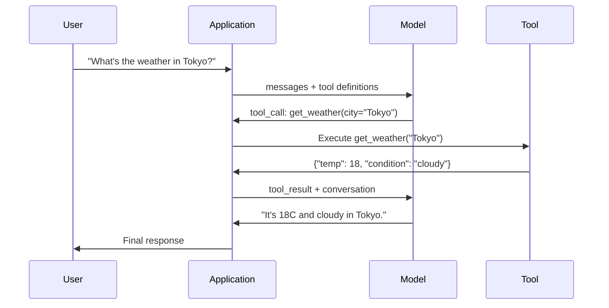

# फ़ंक्शन कॉलिंग और टूल उपयोग

> LLM स्वयं कुछ भी नहीं कर सकते हैं। वे पाठ उत्पन्न करते हैं। यह है उनकी पूरी क्षमता। वे मौसम को नहीं देख सकते हैं। वे डेटाबेस का पता लगाते हैं। वे ईमेल भेजते हैं। वे कोड का संचालन नहीं करते हैं।

**Type:** Build
**Languages:** Python
**Prerequisites:** Phase 11 Lesson 03 (Structured Outputs)
**Time:** ~75 minutes
**Related:**चरण 11 · 14 (मॉडल कॉन्टेक्स्ट प्रोटोकॉल)  जब एक उपकरण 需要跨主共享时,应从在线函数调用 升级为MCP服务器──本课覆盖在线场景;MCP 覆盖协议 场景──

## 学习目标
- 实现 एक फ़ंक्शन कॉल लूप: परिभाषित उपकरण योजनाएँ、解析模型的 उपकरण-कॉल JSON、 निष्पादन फ़ंक्शन,并返回结果
- डिजाइन के साथ स्पष्ट विवरण तथा टाइप किए गए पैरामीटर के उपकरण योजनाएं, ताकि मॉडल को विश्वसनीय रूप से समायोजित किया जा सके
- एक बहु-टर्न एजेंट लूप का निर्माण, जटिल पूछताछ का जवाब देने के लिए कई बार समारोह कॉल के माध्यम से संबद्ध
- 处理 function calling 边界 परिस्थिति:समान उपकरण कॉल ]] त्रुटि प्रसार, तथा असीमित उपकरण लूप को रोकने

## 问题
आप एक चैटबॉट का निर्माण करते हैं। उपयोगकर्ता प्रश्नः टोक्यो में वर्तमान समय में मौसम कैसा है?

模型回答:मेरे पास वास्तविक समय मौसम डेटा तक पहुंच नहीं है, लेकिन मौसम के आधार पर, टोक्यो लगभग 15 डिग्री सेल्सियस है...

यह एक स्पष्ट रूप से स्पष्ट रूप से स्पष्ट है। मॉडल मौसम को नहीं जानता। यह कभी नहीं जानता। मौसम हर घंटे बदलता है।

सही जवाब OpenWeatherMap API को अनुकूलित करने की आवश्यकता है, वर्तमान तापमान प्राप्त करें, और वास्तविक संख्यात्मक मानों को वापस करें। मॉडल एपीआई को अनुकूलित नहीं कर सकता है। आपका कोड हो सकता है।

यह है फ़ंक्शन कॉलिंग──模型输出结构化 JSON, वर्णन करना चाहिए किस तर्क का उपयोग करें 调用哪个函数──आपका अनुप्रयोग 执行函数── परिणाम वापस बातचीत 中──模型使用结果生成最终答案──

 बिना फ़ंक्शन कॉलिंग, LLMs 百科全书── इसके साथ, वे एजेंट बन जाते हैं──

## 概念
### लूप कॉल करने वाला कार्य

प्रत्येक बार उपकरण-उपयोग 交互都 अनुसरण एक ही 5 चरण चक्र 



चरण 1: उपयोगकर्ता संदेश भेजता है। चरण 2: मॉडल संदेश प्राप्त करता है और उपकरण परिभाषाएँ प्रदान करता है। चरण 3: मॉडल सीधे पाठ पर वापस नहीं आता है, बल्कि एक उपकरण कॉल का उत्पादन करता है, यानी फ़ंक्शन नाम और तर्क के संरचनात्मक JSON ऑब्जेक्ट शामिल है। चरण 4: आपका कोड निष्पादित फ़ंक्शन और परिणाम प्राप्त करता है। चरण 5: परिणाम मॉडल पर वापस आता है, मॉडल अब वास्तविक डेटा है, अंतिम उत्तर उत्पन्न कर सकता है।

模型从不执行任何东西――它只决定什么调用,以及什么论据调用――你的代码才是执行者――

### उपकरण परिभाषाःJSON योजना अनुबंध

प्रत्येक उपकरण एक JSON योजना द्वारा परिभाषित है, यह मॉडल को बताता है कि यह फ़ंक्शन क्या करता है, क्या तर्क प्राप्त करता है, और इन तर्कों को किस प्रकार का होना चाहिए।

```json
{
  "type": "function",
  "function": {
    "name": "get_weather",
    "description": "Get current weather for a city. Returns temperature in Celsius and conditions.",
    "parameters": {
      "type": "object",
      "properties": {
        "city": {
          "type": "string",
          "description": "City name, e.g. 'Tokyo' or 'San Francisco'"
        },
        "units": {
          "type": "string",
          "enum": ["celsius", "fahrenheit"],
          "description": "Temperature units"
        }
      },
      "required": ["city"]
    }
  }
}
```

`description`मॉडल इनका उपयोग कैसे करें, यह निर्धारित करने के लिए पढ़ेंगे। यह एक शहर के लिए वर्तमान मौसम की तुलना में स्पष्ट है। तापमान को सेल्सियस और परिस्थितियों में लौटाता है।

### प्रदाता तुलना

प्रत्येक मुख्य प्रदाता फ़ंक्शन कॉल का समर्थन करता है, लेकिन एपीआई सतह में कुछ अंतर हैं।

| Provider | API Parameter | Tool Call Format | Parallel Calls | Forced Calling |
|----------|--------------|-----------------|---------------|----------------|
| OpenAI (GPT-5, o4) | `tools` | `tool_calls[].function` | Yes (multiple per turn) | `tool_choice="required"` |
| Anthropic (Claude 4.6/4.7) | `tools` | `content[].type="tool_use"` | Yes (multiple blocks) | `tool_choice={"type":"any"}` |
| Google (Gemini 3) | `function_declarations` | `functionCall` | Yes | `function_calling_config` |
| Open-weight (Llama 4, Qwen3, DeepSeek-V3) | Native `tools` on Llama 4; Hermes or ChatML on others | Mixed | Model-dependent | Prompt-based or `tool_choice` if supported |

2026 तक, तीन बंद प्रदाताओं  ने लगभग एक ही                                                                                                                                                                                                                                                                                                                                                                                                                                                                                                                `tools`क्षेत्र, आकार और OpenAI 匹配── ओपन-वेट फाइन-ट्यून्स 仍然各不相同, जिनमें से Hermes प्रारूप(NousResearch) है तीसरे पक्ष के फाइन-ट्यून्स में सबसे आम प्रारूप──跨 होस्ट के लिए साझाकरण के उपकरण, प्राथमिकता MCP का उपयोग करना (Phase 11 · 14)), बजाय इनलाइन फ़ंक्शन-कॉलिंग, क्योंकि सर्वर सभी होस्ट के लिए समान हैं──

### उपकरण विकल्पः ऑटो, आवश्यक, विशिष्ट

आप मॉडेल को नियंत्रित कर सकते हैं कि उपकरण का उपयोग कब करें।

**Auto**(默认): मॉडल स्वयम् निर्णय है调用工具 还是直接回答── 2+2 क्या है?                                                                                                                                                                                                                                                   

**Required**मॉडल को कम से कम एक उपकरण का उपयोग करना चाहिए। जब आप जानते हैं कि उपयोगकर्ता को उपकरण की आवश्यकता है, तो इसका उपयोग करें। यह मॉडल को वास्तविक डेटा की जांच करने से रोक सकता है और सीधे अनुमान लगा सकता है।

**Specific function**: एक विशिष्ट कार्य को नियोजित करने के लिए एक बाध्यकारी मॉडल`tool_choice={"type":"function", "function": {"name": "get_weather"}}`यह जानकारी किसी भी प्रकार की है, चाहे वह क्या हो, इसे रूटिंग के लिए उपयोग किया जाएगा, अर्थात् अपस्ट्रीम लॉजिक  ने निर्णय लिया है कि किस उपकरण की आवश्यकता है 

### समानांतर कार्य कॉल

GPT-4o 和 क्लाउड एक ही बारी में कई फ़ंक्शन का इस्तेमाल कर सकते हैं।

```json
[
  {"name": "get_weather", "arguments": {"city": "Tokyo"}},
  {"name": "get_weather", "arguments": {"city": "New York"}}
]
```

आप के कोड को दो में से निष्पादित करना (आदर्श स्थिति में इसे निष्पादित करना) दो परिणामों को वापस करना, फिर मॉडल एक एकीकृत उत्तर का निर्माण करना। यह 2 बार से 1 बार तक यात्राओं को कम कर देगा। प्रत्येक क्वेरी के लिए 5-10 बार उपकरण कॉल करने के लिए एजेंटों की आवश्यकता होती है। समानांतर कॉल करने के लिए, विलंबता 60 से 80% तक कम हो जाएगी।

### संरचनात्मक आउटपुट और फ़ंक्शन कॉलिंग के मुकाबले

पाठ 03  संरचनात्मक आउटपुटों को कवर किया गया है―― फ़ंक्शन कॉलिंग 

**Structured outputs**उदाहरण: लेख से उत्पाद जानकारी प्राप्त करें`{name, price, in_stock}`

**Function calling**: मॉडल घोषणा किसी क्रिया का निष्पादन करने का इरादा--- आउटपुट मध्य चरण है--- उदाहरण:`get_weather(city="Tokyo")`, मॉडल एक क्रिया का अनुरोध करता है, न कि अंतिम उत्तर का उत्पादन करता है।

जब आपको डेटा निष्कर्षण की आवश्यकता होती है, तो संरचित आउटपुट का उपयोग करें।

### सुरक्षा: असंगत नियम

फ़ंक्शन कॉल है आप सक्षम प्रदान करने के लिए LLM की सबसे खतरनाक क्षमता है। मॉडल चयन करने के लिए क्या करना है। यदि आपके टूल सेट में डेटाबेस क्वेरी शामिल हैं, तो मॉडल क्वेरी का निर्माण करेगा।

**Rule 1: Never pass model-generated SQL directly to a database.**模型可能且确实会生成 DROP TABLE、UNION इंजेक्शन, या प्रति पंक्ति क्वेरीओं को लौटाना──始终参数化──始终验证──始终使用操作 अनुमति सूची──

**Rule 2: Allowlist functions.**模型 केवल आपके स्पष्ट रूप से परिभाषित कार्यों को调用 कर सकता है। 模型 केवल आपके द्वारा परिभाषित कार्यों को调用 कर सकता है। 模型 केवल आपके द्वारा परिभाषित कार्यों को调用 कर सकता है। 模型 केवल आपके द्वारा परिभाषित कार्यों को परिभाषित करने के लिए एक सामान्य उपयोग के लिए  नाम पर                                                                                                                                                                                                                               

**Rule 3: Validate arguments.**模型可能传入一个城市的名字:`"; DROP TABLE users; --"`                                                                                                                                                                                                                                                              

**Rule 4: Sanitize tool results.**यदि उपकरण  संवेदनशील डेटा API कुंजी PII  आंतरिक त्रुटियों  वापसी) , में将其发回模型之前先过──模型将工具的结果原样包含在其反应中──

**Rule 5: Rate limit tool calls.**处于循环中的模型可能调调用工具 数百次──设置一个最大值每次对话 10-20次电话是合理的)──打断无限循环──

### त्रुटि संभाल

उपकरण 会失败──API 会超时── डाटाबेस 会机── फाइलें मौजूद नहीं── मॉडल को पता होना चाहिए उपकरण何时失败以及为何失败──

त्रुटियों को structurization tool के परिणाम  return के रूप में, अपवादों को फेंकने के बजाय वापस लाएंः

```json
{
  "error": true,
  "message": "City 'Toky' not found. Did you mean 'Tokyo'?",
  "code": "CITY_NOT_FOUND"
}
```

模型读取这个结果,调整论点,并重试――模型 很擅长从结构化错误信息中自我纠正──它们不擅长从空响应或泛泛的कुछ गलत हो गया错误中恢复──

### एमसीपीः मॉडल संदर्भ प्रोटोकॉल

MCP एक मानव संसाधन उपकरण सहकार्यिता का खुला मानक है। यह प्रत्येक अनुप्रयोग को अपने स्वयं के उपकरण परिभाषित करने की अनुमति नहीं देता है, बल्कि एक सार्वभौमिक प्रोटोकॉल प्रदान करता हैः उपकरण MCP सर्वर द्वारा प्रदान किए जाते हैं, और MCP क्लाइंट द्वारा प्रदान किए जाते हैं जैसे कि क्लाउड कोड, पाठ्यक्रम या आपका अनुप्रयोग) ।

एक MCP सर्वर किसी भी兼容 क्लाइंट को उजागर कर सकता है उपकरण। पोस्टग्रेस MCP सर्वर  किसी भी MCP संगत एजेंट को डेटाबेस एक्सेस करने की अनुमति देता है। GitHub MCP सर्वर  किसी भी एजेंट को रिपॉजिटरी एक्सेस करने की अनुमति देता है।

MCP 之于 फ़ंक्शन कॉलिंग,就像 HTTP 之于网络化── यह परिवहन परत को मानक बनाता है, जिससे उपकरण 变得便携性──


```figure
mx-tool-call-loop
```

##  इसे निर्माण
### 步骤 1: उपकरण रजिस्ट्री को परिभाषित करें

                                                                                                                                                                                                                                                                                                                                                                                                                                                                                                                             

```python
import json
import math
import time
import hashlib


TOOL_REGISTRY = {}


def register_tool(name, description, parameters, function):
    TOOL_REGISTRY[name] = {
        "definition": {
            "type": "function",
            "function": {
                "name": name,
                "description": description,
                "parameters": parameters,
            },
        },
        "function": function,
    }
```

### 步骤 2: 5 उपकरण लागू करें

निर्माण एक कैलकुलेटर, मौसम खोज, वेब खोज सिम्युलेटर, फ़ाइल रीडर और कोड रनर

```python
def calculator(expression, precision=2):
    allowed = set("0123456789+-*/.() ")
    if not all(c in allowed for c in expression):
        return {"error": True, "message": f"Invalid characters in expression: {expression}"}
    try:
        result = eval(expression, {"__builtins__": {}}, {"math": math})
        return {"result": round(float(result), precision), "expression": expression}
    except Exception as e:
        return {"error": True, "message": str(e)}


WEATHER_DB = {
    "tokyo": {"temp_c": 18, "condition": "cloudy", "humidity": 72, "wind_kph": 14},
    "new york": {"temp_c": 22, "condition": "sunny", "humidity": 45, "wind_kph": 8},
    "london": {"temp_c": 12, "condition": "rainy", "humidity": 88, "wind_kph": 22},
    "san francisco": {"temp_c": 16, "condition": "foggy", "humidity": 80, "wind_kph": 18},
    "sydney": {"temp_c": 25, "condition": "sunny", "humidity": 55, "wind_kph": 10},
}


def get_weather(city, units="celsius"):
    key = city.lower().strip()
    if key not in WEATHER_DB:
        suggestions = [c for c in WEATHER_DB if c.startswith(key[:3])]
        return {
            "error": True,
            "message": f"City '{city}' not found.",
            "suggestions": suggestions,
            "code": "CITY_NOT_FOUND",
        }
    data = WEATHER_DB[key].copy()
    if units == "fahrenheit":
        data["temp_f"] = round(data["temp_c"] * 9 / 5 + 32, 1)
        del data["temp_c"]
    data["city"] = city
    return data


SEARCH_DB = {
    "python function calling": [
        {"title": "OpenAI Function Calling Guide", "url": "https://platform.openai.com/docs/guides/function-calling", "snippet": "Learn how to connect LLMs to external tools."},
        {"title": "Anthropic Tool Use", "url": "https://docs.anthropic.com/en/docs/tool-use", "snippet": "Claude can interact with external tools and APIs."},
    ],
    "MCP protocol": [
        {"title": "Model Context Protocol", "url": "https://modelcontextprotocol.io", "snippet": "An open standard for connecting AI models to data sources."},
    ],
    "weather API": [
        {"title": "OpenWeatherMap API", "url": "https://openweathermap.org/api", "snippet": "Free weather API with current, forecast, and historical data."},
    ],
}


def web_search(query, max_results=3):
    key = query.lower().strip()
    for db_key, results in SEARCH_DB.items():
        if db_key in key or key in db_key:
            return {"query": query, "results": results[:max_results], "total": len(results)}
    return {"query": query, "results": [], "total": 0}


FILE_SYSTEM = {
    "data/config.json": '{"model": "gpt-4o", "temperature": 0.7, "max_tokens": 4096}',
    "data/users.csv": "name,email,role\nAlice,alice@example.com,admin\nBob,bob@example.com,user",
    "README.md": "# My Project\nA tool-use agent built from scratch.",
}


def read_file(path):
    if ".." in path or path.startswith("/"):
        return {"error": True, "message": "Path traversal not allowed.", "code": "FORBIDDEN"}
    if path not in FILE_SYSTEM:
        available = list(FILE_SYSTEM.keys())
        return {"error": True, "message": f"File '{path}' not found.", "available_files": available, "code": "NOT_FOUND"}
    content = FILE_SYSTEM[path]
    return {"path": path, "content": content, "size_bytes": len(content), "lines": content.count("\n") + 1}


def run_code(code, language="python"):
    if language != "python":
        return {"error": True, "message": f"Language '{language}' not supported. Only 'python' is available."}
    forbidden = ["import os", "import sys", "import subprocess", "exec(", "eval(", "__import__", "open("]
    for pattern in forbidden:
        if pattern in code:
            return {"error": True, "message": f"Forbidden operation: {pattern}", "code": "SECURITY_VIOLATION"}
    try:
        local_vars = {}
        exec(code, {"__builtins__": {"print": print, "range": range, "len": len, "str": str, "int": int, "float": float, "list": list, "dict": dict, "sum": sum, "min": min, "max": max, "abs": abs, "round": round, "sorted": sorted, "enumerate": enumerate, "zip": zip, "map": map, "filter": filter, "math": math}}, local_vars)
        result = local_vars.get("result", None)
        return {"success": True, "result": result, "variables": {k: str(v) for k, v in local_vars.items() if not k.startswith("_")}}
    except Exception as e:
        return {"error": True, "message": f"{type(e).__name__}: {e}"}
```

### 步骤 3: सभी उपकरण पंजीकृत करें

```python
def register_all_tools():
    register_tool(
        "calculator", "Evaluate a mathematical expression. Supports +, -, *, /, parentheses, and decimals. Returns the numeric result.",
        {"type": "object", "properties": {"expression": {"type": "string", "description": "Math expression, e.g. '(10 + 5) * 3'"}, "precision": {"type": "integer", "description": "Decimal places in result", "default": 2}}, "required": ["expression"]},
        calculator,
    )
    register_tool(
        "get_weather", "Get current weather for a city. Returns temperature, condition, humidity, and wind speed.",
        {"type": "object", "properties": {"city": {"type": "string", "description": "City name, e.g. 'Tokyo' or 'San Francisco'"}, "units": {"type": "string", "enum": ["celsius", "fahrenheit"], "description": "Temperature units, defaults to celsius"}}, "required": ["city"]},
        get_weather,
    )
    register_tool(
        "web_search", "Search the web for information. Returns a list of results with title, URL, and snippet.",
        {"type": "object", "properties": {"query": {"type": "string", "description": "Search query"}, "max_results": {"type": "integer", "description": "Maximum results to return", "default": 3}}, "required": ["query"]},
        web_search,
    )
    register_tool(
        "read_file", "Read the contents of a file. Returns the file content, size, and line count.",
        {"type": "object", "properties": {"path": {"type": "string", "description": "Relative file path, e.g. 'data/config.json'"}}, "required": ["path"]},
        read_file,
    )
    register_tool(
        "run_code", "Execute Python code in a sandboxed environment. Set a 'result' variable to return output.",
        {"type": "object", "properties": {"code": {"type": "string", "description": "Python code to execute"}, "language": {"type": "string", "enum": ["python"], "description": "Programming language"}}, "required": ["code"]},
        run_code,
    )
```

### 步骤 4: कॉलिंग लूप फ़ंक्शन का निर्माण करें

यह मूल इंजन है। यह मॉडल का निर्णय लेता है कि किस उपकरण का उपयोग किया जाए, इस उपकरण को निष्पादित किया जाए, और परिणाम वापस आ जाएगा।

```python
def simulate_model_decision(user_message, tools, conversation_history):
    msg = user_message.lower()

    if any(word in msg for word in ["weather", "temperature", "forecast"]):
        cities = []
        for city in WEATHER_DB:
            if city in msg:
                cities.append(city)
        if not cities:
            for word in msg.split():
                if word.capitalize() in [c.title() for c in WEATHER_DB]:
                    cities.append(word)
        if not cities:
            cities = ["tokyo"]
        calls = []
        for city in cities:
            calls.append({"name": "get_weather", "arguments": {"city": city.title()}})
        return calls

    if any(word in msg for word in ["calculate", "compute", "math", "what is", "how much"]):
        for token in msg.split():
            if any(c in token for c in "+-*/"):
                return [{"name": "calculator", "arguments": {"expression": token}}]
        if "+" in msg or "-" in msg or "*" in msg or "/" in msg:
            expr = "".join(c for c in msg if c in "0123456789+-*/.() ")
            if expr.strip():
                return [{"name": "calculator", "arguments": {"expression": expr.strip()}}]
        return [{"name": "calculator", "arguments": {"expression": "0"}}]

    if any(word in msg for word in ["search", "find", "look up", "google"]):
        query = msg.replace("search for", "").replace("look up", "").replace("find", "").strip()
        return [{"name": "web_search", "arguments": {"query": query}}]

    if any(word in msg for word in ["read", "file", "open", "cat", "show"]):
        for path in FILE_SYSTEM:
            if path.split("/")[-1].split(".")[0] in msg:
                return [{"name": "read_file", "arguments": {"path": path}}]
        return [{"name": "read_file", "arguments": {"path": "README.md"}}]

    if any(word in msg for word in ["run", "execute", "code", "python"]):
        return [{"name": "run_code", "arguments": {"code": "result = 'Hello from the sandbox!'", "language": "python"}}]

    return []


def execute_tool_call(tool_call):
    name = tool_call["name"]
    args = tool_call["arguments"]

    if name not in TOOL_REGISTRY:
        return {"error": True, "message": f"Unknown tool: {name}", "code": "UNKNOWN_TOOL"}

    tool = TOOL_REGISTRY[name]
    func = tool["function"]
    start = time.time()

    try:
        result = func(**args)
    except TypeError as e:
        result = {"error": True, "message": f"Invalid arguments: {e}"}

    elapsed_ms = round((time.time() - start) * 1000, 2)
    return {"tool": name, "result": result, "execution_time_ms": elapsed_ms}


def run_function_calling_loop(user_message, max_iterations=5):
    conversation = [{"role": "user", "content": user_message}]
    tool_definitions = [t["definition"] for t in TOOL_REGISTRY.values()]
    all_tool_results = []

    for iteration in range(max_iterations):
        tool_calls = simulate_model_decision(user_message, tool_definitions, conversation)

        if not tool_calls:
            break

        results = []
        for call in tool_calls:
            result = execute_tool_call(call)
            results.append(result)

        conversation.append({"role": "assistant", "content": None, "tool_calls": tool_calls})

        for result in results:
            conversation.append({"role": "tool", "content": json.dumps(result["result"]), "tool_name": result["tool"]})

        all_tool_results.extend(results)
        break

    return {"conversation": conversation, "tool_results": all_tool_results, "iterations": iteration + 1 if tool_calls else 0}
```

### 步骤 5: तर्क सत्यापन

Construct a validator,在执行前根据 JSON Schema 检查工具 कॉल तर्कों──

```python
def validate_tool_arguments(tool_name, arguments):
    if tool_name not in TOOL_REGISTRY:
        return [f"Unknown tool: {tool_name}"]

    schema = TOOL_REGISTRY[tool_name]["definition"]["function"]["parameters"]
    errors = []

    if not isinstance(arguments, dict):
        return [f"Arguments must be an object, got {type(arguments).__name__}"]

    for required_field in schema.get("required", []):
        if required_field not in arguments:
            errors.append(f"Missing required argument: {required_field}")

    properties = schema.get("properties", {})
    for arg_name, arg_value in arguments.items():
        if arg_name not in properties:
            errors.append(f"Unknown argument: {arg_name}")
            continue

        prop_schema = properties[arg_name]
        expected_type = prop_schema.get("type")

        type_checks = {"string": str, "integer": int, "number": (int, float), "boolean": bool, "array": list, "object": dict}
        if expected_type in type_checks:
            if not isinstance(arg_value, type_checks[expected_type]):
                errors.append(f"Argument '{arg_name}': expected {expected_type}, got {type(arg_value).__name__}")

        if "enum" in prop_schema and arg_value not in prop_schema["enum"]:
            errors.append(f"Argument '{arg_name}': '{arg_value}' not in {prop_schema['enum']}")

    return errors
```

### 步骤 6: डेमो चलाएं

```python
def run_demo():
    register_all_tools()

    print("=" * 60)
    print("  Function Calling & Tool Use Demo")
    print("=" * 60)

    print("\n--- Registered Tools ---")
    for name, tool in TOOL_REGISTRY.items():
        desc = tool["definition"]["function"]["description"][:60]
        params = list(tool["definition"]["function"]["parameters"].get("properties", {}).keys())
        print(f"  {name}: {desc}...")
        print(f"    params: {params}")

    print(f"\n--- Argument Validation ---")
    validation_tests = [
        ("get_weather", {"city": "Tokyo"}, "Valid call"),
        ("get_weather", {}, "Missing required arg"),
        ("get_weather", {"city": "Tokyo", "units": "kelvin"}, "Invalid enum value"),
        ("calculator", {"expression": 123}, "Wrong type (int for string)"),
        ("unknown_tool", {"x": 1}, "Unknown tool"),
    ]
    for tool_name, args, label in validation_tests:
        errors = validate_tool_arguments(tool_name, args)
        status = "VALID" if not errors else f"ERRORS: {errors}"
        print(f"  {label}: {status}")

    print(f"\n--- Tool Execution ---")
    direct_tests = [
        {"name": "calculator", "arguments": {"expression": "(10 + 5) * 3 / 2"}},
        {"name": "get_weather", "arguments": {"city": "Tokyo"}},
        {"name": "get_weather", "arguments": {"city": "Mars"}},
        {"name": "web_search", "arguments": {"query": "python function calling"}},
        {"name": "read_file", "arguments": {"path": "data/config.json"}},
        {"name": "read_file", "arguments": {"path": "../etc/passwd"}},
        {"name": "run_code", "arguments": {"code": "result = sum(range(1, 101))"}},
        {"name": "run_code", "arguments": {"code": "import os; os.system('rm -rf /')"}},
    ]
    for call in direct_tests:
        result = execute_tool_call(call)
        print(f"\n  {call['name']}({json.dumps(call['arguments'])})")
        print(f"    -> {json.dumps(result['result'], indent=None)[:100]}")
        print(f"    time: {result['execution_time_ms']}ms")

    print(f"\n--- Full Function Calling Loop ---")
    test_queries = [
        "What's the weather in Tokyo?",
        "Calculate (100 + 250) * 0.15",
        "Search for MCP protocol",
        "Read the config file",
        "Run some Python code",
        "Tell me a joke",
    ]
    for query in test_queries:
        print(f"\n  User: {query}")
        result = run_function_calling_loop(query)
        if result["tool_results"]:
            for tr in result["tool_results"]:
                print(f"    Tool: {tr['tool']} ({tr['execution_time_ms']}ms)")
                print(f"    Result: {json.dumps(tr['result'], indent=None)[:90]}")
        else:
            print(f"    [No tool called -- direct response]")
        print(f"    Iterations: {result['iterations']}")

    print(f"\n--- Parallel Tool Calls ---")
    multi_city_query = "What's the weather in tokyo and london?"
    print(f"  User: {multi_city_query}")
    result = run_function_calling_loop(multi_city_query)
    print(f"  Tool calls made: {len(result['tool_results'])}")
    for tr in result["tool_results"]:
        city = tr["result"].get("city", "unknown")
        temp = tr["result"].get("temp_c", "N/A")
        print(f"    {city}: {temp}C, {tr['result'].get('condition', 'N/A')}")

    print(f"\n--- Security Checks ---")
    security_tests = [
        ("read_file", {"path": "../../etc/passwd"}),
        ("run_code", {"code": "import subprocess; subprocess.run(['ls'])"}),
        ("calculator", {"expression": "__import__('os').system('ls')"}),
    ]
    for tool_name, args in security_tests:
        result = execute_tool_call({"name": tool_name, "arguments": args})
        blocked = result["result"].get("error", False)
        print(f"  {tool_name}({list(args.values())[0][:40]}): {'BLOCKED' if blocked else 'ALLOWED'}")
```

## इसका उपयोग करें
### OpenAI फ़ंक्शन कॉल

```python
# from openai import OpenAI
#
# client = OpenAI()
#
# tools = [{
#     "type": "function",
#     "function": {
#         "name": "get_weather",
#         "description": "Get current weather for a city",
#         "parameters": {
#             "type": "object",
#             "properties": {
#                 "city": {"type": "string"},
#                 "units": {"type": "string", "enum": ["celsius", "fahrenheit"]}
#             },
#             "required": ["city"]
#         }
#     }
# }]
#
# response = client.chat.completions.create(
#     model="gpt-4o",
#     messages=[{"role": "user", "content": "Weather in Tokyo?"}],
#     tools=tools,
#     tool_choice="auto",
# )
#
# tool_call = response.choices[0].message.tool_calls[0]
# args = json.loads(tool_call.function.arguments)
# result = get_weather(**args)
#
# final = client.chat.completions.create(
#     model="gpt-4o",
#     messages=[
#         {"role": "user", "content": "Weather in Tokyo?"},
#         response.choices[0].message,
#         {"role": "tool", "tool_call_id": tool_call.id, "content": json.dumps(result)},
#     ],
# )
# print(final.choices[0].message.content)
```

OpenAI उपकरण कॉल  वापसी `response.choices[0].message.tool_calls` हर कॉल में एक है `id`,आप एक प्रतिक्रिया में कई उपकरण कॉल वापस कर सकते हैं, एक ही प्रतिक्रिया में कई कॉल, सभी कॉल भरने और निष्पादित करने की आवश्यकता है।

### मानव संसाधन उपकरण का उपयोग

```python
# import anthropic
#
# client = anthropic.Anthropic()
#
# response = client.messages.create(
#     model="claude-sonnet-4-20250514",
#     max_tokens=1024,
#     tools=[{
#         "name": "get_weather",
#         "description": "Get current weather for a city",
#         "input_schema": {
#             "type": "object",
#             "properties": {
#                 "city": {"type": "string"},
#                 "units": {"type": "string", "enum": ["celsius", "fahrenheit"]}
#             },
#             "required": ["city"]
#         }
#     }],
#     messages=[{"role": "user", "content": "Weather in Tokyo?"}],
# )
#
# tool_block = next(b for b in response.content if b.type == "tool_use")
# result = get_weather(**tool_block.input)
#
# final = client.messages.create(
#     model="claude-sonnet-4-20250514",
#     max_tokens=1024,
#     tools=[...],
#     messages=[
#         {"role": "user", "content": "Weather in Tokyo?"},
#         {"role": "assistant", "content": response.content},
#         {"role": "user", "content": [{"type": "tool_result", "tool_use_id": tool_block.id, "content": json.dumps(result)}]},
#     ],
# )
```

मानव संसाधन उपकरण कॉल  वापसी के लिए `type: "tool_use"`                                                                                                                                                                                                                                                                                                                                                                                                                                                                                                                             `type: "tool_result"`                                                                                                                                                                                                                                                              `input_schema` define उपकरण पैरामीटर, जबकि OpenAI उपयोग `parameters`

### एमसीपी एकीकरण

```python
# MCP servers expose tools over a standardized protocol.
# Any MCP-compatible client can discover and call these tools.
#
# Example: connecting to a Postgres MCP server
#
# from mcp import ClientSession, StdioServerParameters
# from mcp.client.stdio import stdio_client
#
# server_params = StdioServerParameters(
#     command="npx",
#     args=["-y", "@modelcontextprotocol/server-postgres", "postgresql://localhost/mydb"],
# )
#
# async with stdio_client(server_params) as (read, write):
#     async with ClientSession(read, write) as session:
#         await session.initialize()
#         tools = await session.list_tools()
#         result = await session.call_tool("query", {"sql": "SELECT count(*) FROM users"})
```

MCP उपकरण कार्यान्वयन और उपकरण खपत 解── पोस्टग्रेस सर्वर 了解 SQL── GitHub सर्वर 了解 API── आपका एजेंट 只是 खोज और उपकरण को अनुकूलित करने की आवश्यकता नहीं है, यह प्रत्येक एकीकरण के लिए 编写供应商-विशिष्ट कोड──

## 交付 यह
本课会产出 `outputs/prompt-tool-designer.md`, यह एक डिज़ाइन टूल परिभाषाओं के लिए एक दोहराया जा सकता है शीघ्र टेम्पलेट है. इसे एक के बारे में बताएं कि आप क्या करना चाहते हैं, यह विवरण सहित पूर्ण JSON योजना परिभाषा उत्पन्न करेगा।

यह फिर से उत्पन्न होगा `outputs/skill-function-calling-patterns.md`, यह एक निर्णय ढांचा है जो उत्पादन में कार्य कॉल को प्राप्त करने के लिए उपयोग किया जाता है, उपकरण डिजाइन, त्रुटि प्रबंधन, सुरक्षा और प्रदाता-विशिष्ट पैटर्न को कवर करता है।

## अभ्यास
1. **Add a 6th tool: database query.**实现一个模拟SQL工具,使用内存表――该工具 接收表名 和过条件(不是原始SQL)――验证表名 位于允许列中,并且过操作员 仅限于 `=``>``<``>=``<=`将匹配行 作为 JSON 返回──

2. **Implement retry with error feedback.**जब उपकरण कॉल 失败时(उदाहरण के लिए शहर नहीं मिला), त्रुटि संदेश 回 मॉडल निर्णय फ़ंक्शन,并让它修正参数──记录每次电话 需要多少次重复尝试──为每次工具电话 设置最多3次重复尝试──

3. **Build a multi-step agent.**某些 queries 需要串联工具 कॉल: कॉन्फिग फ़ाइल पढ़ें और मुझे बताएं कि किस मॉडल को कॉन्फ़िगर किया गया है, फिर उस मॉडल की कीमतों के लिए वेब पर खोजें। 实现一个循环,持续运行直到模型决定不再需要工具,并把累积结果传进每个决策步,限制为10次回复,以防止无限循环──

4. **Measure tool selection accuracy.**创建30 带有预期工具名称的测试查询──在全部30 查询上运行你的决策功能,并衡量它选择正确工具的比例──识别哪些查询最容易导致工具之间的混──

5. **Implement tool call caching.**यदि एक ही उपकरण 60 सेकंड के भीतर एक ही तर्क के साथ बुलाया जाता है, तो पुनः निष्पादित करने के बजाय कैश किए गए परिणाम को लौटा देता है।`(tool_name, frozenset(args.items()))`为关键的字典──衡量包含20 个查询的对话 中的缓存击率──

## 关键术语
| Term | What people say | What it actually means |
|------|----------------|----------------------|
| Function calling | “Tool use” | 模型输出结构化 JSON，描述要用特定 arguments 调用的 function，由你的代码执行，而不是模型执行 |
| Tool definition | “Function schema” | 一个 JSON Schema object，描述 tool 的 name、purpose、parameters 和 types，模型读取它来决定何时以及如何使用该 tool |
| Tool choice | “Calling mode” | 控制模型必须调用 tool（required）、可以调用 tool（auto），还是必须调用特定 tool（named） |
| Parallel calling | “Multi-tool” | 模型在单个 turn 中输出多个 tool calls，从而减少 round trips，GPT-4o 和 Claude 都支持这一点 |
| Tool result | “Function output” | 执行 tool 后得到的 return value，作为 message 发回模型，使它能在 response 中使用真实数据 |
| Argument validation | “Input checking” | 在执行 tool 前，验证模型生成的 arguments 是否匹配预期 types、ranges 和 constraints |
| MCP | “Tool protocol” | Model Context Protocol，即 Anthropic 的 open standard，用于通过 servers 暴露 tools，让任何兼容 client 都能发现并调用 |
| Agent loop | “ReAct loop” | model-decides-tool、code-executes-tool、result-feeds-back 的迭代循环，直到模型拥有足够信息作出回答 |
| Tool poisoning | “Prompt injection via tools” | 一种攻击，其中 tool results 包含会操纵模型行为的 instructions，因此要 sanitize 所有 tool outputs |
| Rate limiting | “Call budget” | 设置每个 conversation 中 tool calls 的最大数量，以防止 infinite loops 和失控的 API costs |

## 延伸阅读
- [OpenAI Function Calling Guide](https://platform.openai.com/docs/guides/function-calling) GPT-4o का प्रयोग  उपकरण उपयोग करने का अधिकार संदर्भ, जिसमें समानांतर कॉल, जबरन कॉल और संरचित तर्क शामिल हैं
- [Anthropic Tool Use Guide](https://docs.anthropic.com/en/docs/tool-use) क्लाउड का उपकरण उपयोग 实现, जिसमें इनपुट_स्केमा、मल्टि-टूल प्रतिक्रियाएँ तथा टूल_चॉइस कॉन्फ़िगरेशन शामिल हैं
- [Model Context Protocol Specification](https://modelcontextprotocol.io) 跨 AI अनुप्रयोगों के उपकरण सहकार्यता ओपन स्टैंडर्ड, सर्वर/क्लाइंट आर्किटेक्चर शामिल
- [Schick et al., 2023 — “Toolformer: Language Models Can Teach Themselves to Use Tools”](https://arxiv.org/abs/2302.04761)  प्रशिक्षण के बारे में LLM निर्णय कब और कैसे बाहरी उपकरणों को तैनात करने के आधारभूत शोध
- [Patil et al., 2023 — “Gorilla: Large Language Model Connected with Massive APIs”](https://arxiv.org/abs/2305.15334)  1,645 एपीआई के लिए सटीक एपीआई कॉल LLM के लिए ठीक-ठीक करने, और भ्रम को कम करने के लिए
- [Berkeley Function Calling Leaderboard](https://gorilla.cs.berkeley.edu/leaderboard.html) 实时基准, GPT-4o、Claude、Gemini 和 ओपन मॉडल के फ़ंक्शन कॉल सटीकता के मुकाबले
- [Yao et al., “ReAct: Synergizing Reasoning and Acting in Language Models” (ICLR 2023)](https://arxiv.org/abs/2210.03629) विचार-क्रिया-निरीक्षण लूप, यह प्रत्येक उपकरण कॉल के बाहर स्तरीय एजेंट लूप है; इस वर्ग के अंत में, यह चरण 14 接续之处 है।
- [Anthropic — Building effective agents (Dec 2024)](https://www.anthropic.com/research/building-effective-agents) एक उपकरण-उपयोग आदिम से  निर्माण किए गए पांच प्रकार के संयोजन पैटर्न  शीघ्र संरेखण  मार्गनिर्देशन  समानांतर  ऑर्केस्ट्रेटर-कर्मचारी  मूल्यांकनकर्ता-अनुकूलन) 
