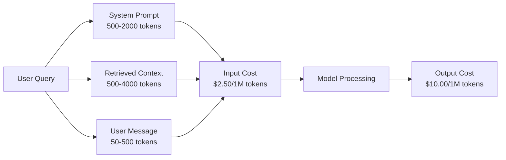
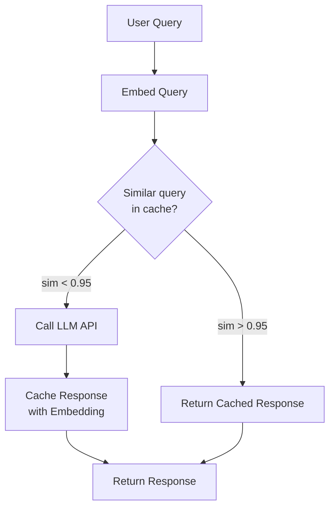
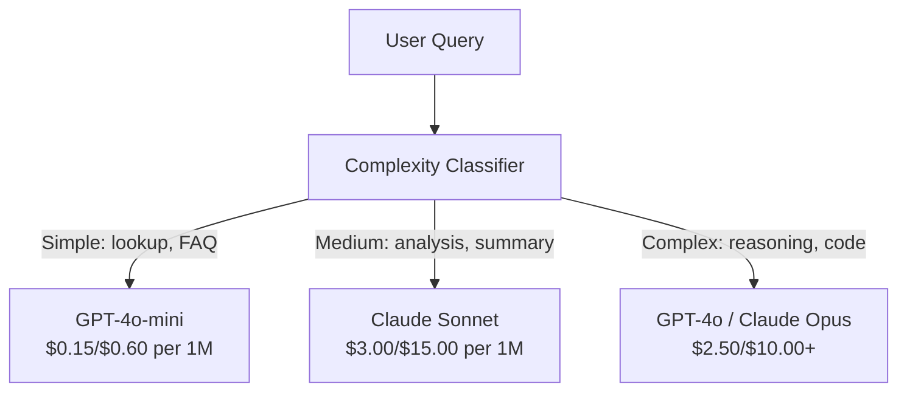

# 缓存、सीमित प्रवाह तथा लागत अनुकूलन

> अधिकांश एआई स्टार्टअप कंपनियां खराब मॉडल से नहीं, बल्कि खराब इकाई आर्थिक मॉडल से मरती हैं। एक बार जीपीटी-4ओ 调用 केवल कुछ ही प्रतिशत से एक प्रतिशत से अधिक खर्च होता है। 10,000 उपयोगकर्ता प्रति दिन 10 बार प्रत्येक कॉल करते हैं, केवल इनपुट टोकन $250 खर्च करने के लिए होते हैं। यह अभी भी उपयोगकर्ताओं को एक डॉलर प्राप्त करने की शुरुआत नहीं कर रहा है।

**类型：**构建
**语言：**पायथन
**前置要求：**चरण 11 पाठ 09 (कार्य कॉल)
**时间：**~ 45 मिनट
**相关：**चरण 11 · 15 (प्रॉम्प्ट कैशिंग)  本课涵盖应用层缓存(सैमंतिक कैश、 सटीक हैश कैश、 मॉडल रूटिंग) ――课 15 涵盖 प्रदाता层 快速 कैशिंग(Anthropic cache_control、OpenAI स्वचालित、Gemini CachedContent)──两者结合可降低50-95% 成本。

## 学习目标

- शब्दात्मक कैशिंग को प्राप्त करना, कैशिंग के साथ प्रतिक्रिया दोहराएं या समान प्रश्न पूछें, बजाय नए एपीआई का उपयोग करें 调用
- 计算不同供应商的单请求成本,并实现 टोकन 感知流限与预算告警
- 构建成本优化层, जिसमें शीघ्र संपीड़न, मॉडल रूटिंग, महंगा मॉडल बनाम सस्ता मॉडल) और प्रतिक्रिया कैशिंग शामिल हैं
- 设计分层缓存策略, विभिन्न प्रकार के प्रश्नों के लिए सटीक मेल मिलाप, सेमेटिक समानता तथा पूर्वावलोकन कैशिंग का उपयोग करें

## 问题

आपने एक RAG चैटबॉट बनाया है। यह बहुत अच्छा काम करता है।

फिर खाता आया।

GPT-5 प्रति मिलियन इनपुट टोकन $5，每百万 output $15―Claude Opus 4.7 इनपुट $15 / output $75―Gemini 3 Pro इनपुट $1.25 / output $5―GPT-5-mini $0.25/$2── नीचे की कीमतें केवल उदाहरण के रूप में;始终检查提供商 当前的价格页面──

निम्नलिखित है कि मार डालेंगे स्टार्टअप्स के गणितः

- 10,000 दिन उपयोग
- प्रति उपयोगकर्ता प्रति दिन 10 बार पूछताछ
- प्रत्येक बार पूछ 1,000 इनपुट टोकन ((सिस्टम शीघ्र + संदर्भ + उपयोगकर्ता संदेश)
- प्रति प्रतिक्रिया 500 आउटपुट टोकन

**每日 input 成本：**10,000 x 10 x 1,000 / 1,000,000 x $2.50 = **$250/दिन**
**每日 output 成本：**10,000 x 10 x 500 / 1,000,000 x $10.00 = **$500/दिन**
**每月总计：** **$22,500/month**

यह सिर्फ LLM है। इसके अलावा एम्बेडिंग्स, वेक्टर डेटाबेस, ट्रीटमेंट, इन्फ्रास्ट्रक्चर। एक चैटबॉट प्रति माह 30,000 डॉलर तक पहुंच सकता है।

बुराई की बात यह है कि इनमें से 40-60% प्रश्न लगभग दोहराए जाते हैं। उपयोगकर्ता एक ही प्रश्न पूछने के लिए थोड़ा अलग-अलग शब्दावली का उपयोग करते हैं। आपका सिस्टम प्रॉम्प्ट - प्रत्येक अनुरोध पूरी तरह से एक ही है - हर बार सब पर गणना की जाती है।

तुम अतिरिक्त गणना के लिए पूरी कीमत का भुगतान कर रहे हैं.

## 核心概念

### एक LLM 调用成本 संरचना

प्रत्येक एपीआई के लिए 5 लागत घटक हैं।



सिस्टम प्रॉम्प्ट्स एक चुप लागत हत्यारा है एक 1,500-टोकन प्रणाली प्रॉम्प्ट प्रत्येक अनुरोध भेजने के साथ, केवल इस पूर्वावलोकन में प्रति मिलियन अनुरोध में खर्च करना होगा$3.75。每天 100K 请求时，这就是 $375 दिन -- $11,250/महीना -- और ये लेख कभी नहीं बदलते हैं

### प्रदाता कैशिंग:内置折扣

2026 तक, तीन प्रमुख प्रदाता प्रदाता-पक्ष शीघ्र कैशिंग प्रदान करेंगे, लेकिन तंत्र अलग-अलग होगा।

| Provider | 机制 | 折扣 | 最小值 | Cache Duration |
|----------|-----------|----------|---------|----------------|
| Anthropic | 显式 cache_control 标记 | cache hit 享 90% 折扣（写入多付 25%） | 1,024 tokens（Sonnet/Opus），2,048（Haiku） | 默认 5 分钟；扩展 1 小时（2x 写入溢价） |
| OpenAI | 自动 prefix matching | cache hit 享 50% 折扣 | 1,024 tokens | 尽力最多 1 小时 |
| Google Gemini | 显式 CachedContent API | ~75% 降幅（另加存储） | 4,096（Flash）/ 32,768（Pro） | 用户可配置 TTL |

**Anthropic 的方式**यह स्पष्ट है.`cache_control: {"type": "ephemeral"}`标记提示 中的部分──第一次请求支付25% 写入溢价──后续使用相同的前的请求获得90%折扣──一个2000-Token的系统提示,正常成本 $0.005，cache hit 时成本 $0.000625──100K अनुरोध可节省 $437.50/दिन──

**OpenAI 的方式**️️️️️️️️️️️️️️️️️️️️️️️️️️️️️️️️️️️️️️️️️️️️️️️️️️️️️️️️️️️️️️️️️️️️️️️️️️️️️️️️️️️️️️️️️️️️️️️️️️️️️️️️️️️️️️️️️️️️️️️️️️️️️️️️️️️️️️️️️️️️️️️️️️️️️️️️️️️️️️️️️️️️️️️️️️️️️️️️️️️️️️️️️️️️️️️️️️️️️️️️️️️️️️️️️️️️️️️️️️️️️️️️️️️️️️️️️️️️️️️️️️️️️️️️️️️️️️️️️️️️️️️️️️️️️️️️️️️️️️️️️️️️️️️️️️️️️️️️️️️️️️️️️️️️️️️️️️️️️️️️️️️️️️️️️️️️️️️️️️️️️️️️️️️️️️️️️️️️️️️️️️️️️️️️️️️️️️️️️️️️️️️️️️️️️️️️️️️️️️️️️️️️️️️️️️️️️️️️️️️️️️️️️️️️️️️️️️️️️️️️️️️️️️️️️️️️️️️️️️️️️️️️️️️️️️️️️️️️️️️️️️️️️️️️️️️️️️️️️️️️️️️️️️️️

### अर्थिक कैशिंग:आपकी स्व परिभाषा स्तर

प्रदाता कैशिंग केवल एक ही उपसर्ग के लिए उपयुक्त है।

" रिटर्न पॉलिसी क्या है? " 和 "मैं किसी आइटम को कैसे रिटर्न करता हूँ? " 是不同字符串, लेकिन इरादा 相同── सेमेटिक कैश 会对两个查询做 एम्बेडिंग, गणना कॉसिन समानता; यदि समानता 值 से अधिक है(आमतौर पर 0.92-0.95),就返回缓存响应──



सम्मिलित 成本可以忽略不计──OpenAI का पाठ सम्मिलित-3-छोटे प्रति मिलियन टोकन $0.02── पूर्ण LLM के साथ तुलना में, चेक缓存 लगभग नहीं खर्च होता──

### सटीक कैशिंगः हैश के साथ मेल

对于确定性调用(温度=0、相同模型、相同提示), सटीक कैशिंग 更简单也更快──对完整提示做 Hash,检查缓存,命中就返回──

यह बहुत उपयुक्त हैः
- सिस्टम प्रॉम्प्ट + 固定 context + 相同用户查询
- उपयोग समान उपकरण परिभाषाएँ का फ़ंक्शन कॉल
- एक साथ कई बार प्रसंस्करण किया गया है

### दर सीमा: अपने बजट को संरक्षित करें

限流不只是为了公平―― यह अस्तित्व पर निर्भर करता है――

**Token bucket algorithm：**प्रत्येक उपयोगकर्ता को एक बाल्टी प्राप्त होता है जिसमें N 个 टोकन होते हैं, और प्रति सेकंड R की दर से पूरक होता है। एक बार अनुरोध बाल्टी से अंदर टोकन का उपभोग करेगा। यदि बाल्टी रिक्त है, तो अनुरोध अस्वीकार कर दिया जाएगा।

**Per-user quotas：**पर उपयोगकर्ता स्तर सेट प्रति दिन/ प्रति माह टोकन सीमा

| Tier | Daily Token Limit | Max Requests/min | Model Access |
|------|------------------|------------------|-------------|
| Free | 50,000 | 10 | 仅 GPT-4o-mini |
| Pro | 500,000 | 60 | GPT-4o、Claude Sonnet |
| Enterprise | 5,000,000 | 300 | 所有模型 |

### मॉडल रूटिंगः उपयुक्त कार्य के लिए उपयुक्त मॉडल को उपयोग करें

नहीं हर पूछताछ के लिए GPT-4o की जरूरत है

"बिक्री किस समय बंद होती है? "$10/M-output 的模型。GPT-4o-mini 以 $0.60/एम आउटपुट को अच्छी तरह से संसाधित किया जा सकता है। क्लाउड हैकू ने 1.25 डॉलर/एम आउटपुट को भी संसाधित किया जा सकता है। एक सरल वर्गीकरणकर्ता सस्ते प्रश्नों को सस्ते प्रश्नों से सस्ते प्रश्नों को सस्ते प्रश्नों को सस्ते प्रश्नों से जटिल प्रश्नों को महंगे प्रश्नों को सस्ते प्रश्नों से सस्ते प्रश्नों को सस्ते प्रश्नों को सस्ते प्रश्नों से सस्ते प्रश्नों को सस्ते प्रश्नों को सस्ते प्रश्नों से सस्ते प्रश्नों को सस्ते प्रश्नों से सस्ते प्रश्नों को सस्ते प्रश्नों को सस्ते प्रश्नों से सस्ते प्रश्नों को सस्ते प्रश्नों से सस्ते प्रश्नों को सस्ते प्रश्नों को सस्ते प्रश्नों से सस्ते प्रश्नों को सस्ते प्रश्नों से सस्ते प्रश्नों से सस्ते प्रश्नों से सस्ते प्रश्नों से सस्ते प्रश्नों से सस्ते प्रश्नों से सस्ते प्रश्नों से सस्ते प्रश्नों से सस्ते प्रश्नों से सस्ते प्रश्नों से सस्ते प्रश्नों से सस्ते प्रश्नों से सस्ते प्रश्नों से सस्ते प्रश्नों से सस्ते प्रश्नों से सस्ते प्रश्नों से सस्ते प्रश्नों से सों से सस्ते प्रश्नों से सों से सों तक



अच्छी राउटर  केवल मॉडल लागत पर 40-70% की बचत कर सकती है

### लागत ट्रैकिंग: जानिए पैसा कहाँ खर्च होता है

无法衡量,就无法优化――记录每次API调用:

- समय टिकट
- मॉडल नाम
- इनपुट टोकन
- आउटपुट टोकन
- विलंबता (ms)
- गणना लागत ($)
- उपयोगकर्ता आईडी
- कैश हिट/मिस
- अनुरोध श्रेणी

इन आंकड़ों से पता चलता है कि कौन सी सुविधाएँ सबसे महंगी हैं, कौन से उपयोगकर्ता सबसे अधिक खपत करते हैं, और कौन से स्थानों पर सबसे अधिक प्रभाव पड़ता है।

### बैचिंगः थोक छूट

OpenAI के बैच एपीआई के साथ 50% छूट पर अनुरोधों को संसाधित करें।

बैचिंग 适用于:
- रात्र间文档处理
- खंड वर्गीकरण
- मूल्यांकन रन
- डेटा वृद्धि प्रवाहित जल लाइन

️️️️️️️️️️️️️️️️️️️️️️️️️️️️️️️️️️️️️️️️️️️️️️️️️️️️️️️️️️️️️️️️️️️️️️️️️️️️️️️️️️️️️️️️️️️️️️️️️️️️️️️️️️️️️️️️️️️️️️️️️️️️️️️️️️️️️️️️️️️️️️️️️️️️️️️️️️️️️️️️️️️️️️️️️️️️️️️️️️️️️️️️️️️️️️️️️️️️️️️️️️️️️️️️️️️️️️️️️️️️️️️️️️️️️️️️️️️️️️️️️️️️️️️️️️️️️️️️️️️️️️️️️️️️️️️️️️️️️️️️️️️️️️️️️️️️️️️️️️️️️️️️️️️️️️️️️️️️️️️️️️️️️️️️️️️️️️️️️️️️️️️️️️️️️️️️️️️️️️️️️️️️️️️️️️️️️️️️️️️️️️️️️️️️️️️️️️️️️️️️️️️️️️️️️️️️️️️️️️️️️️️️️️️️️️️️️️️️️️️️️️️️️️️️️️️️️️️️️️️️️️️️️️️️️️️️️️️️️️️️️️️️️️️️️️️️️️️️️️️️️️️️️️️️

### बजट अलर्ट और सर्किट ब्रेकर

सर्किट ब्रेकर सीमित समय पर खर्च करना बंद कर देगा।

设置三个值:
1. **Warning**(预算 70%):发送告警
2. **Throttle**(वित्त का 85%): केवल अधिक सस्ते मॉडल में बदला
3. **Stop**(वित्त बजट 95%): नए अनुरोध को अस्वीकार करना, केवल वापस करना

### 优化

順序應用這些技術── प्रत्येक स्तर पहले के स्तर के साथ मिलकर बढ़ेगा──

| Layer | Technique | Typical Savings | Implementation Effort |
|-------|-----------|----------------|----------------------|
| 1 | Provider prompt caching | 30-50% | 低（添加 cache markers） |
| 2 | Exact caching | 10-20% | 低（hash + dict） |
| 3 | Semantic caching | 15-30% | 中（embeddings + similarity） |
| 4 | Model routing | 40-70% | 中（classifier） |
| 5 | Rate limiting | 预算保护 | 低（token bucket） |
| 6 | Prompt compression | 10-30% | 中（重写 prompts） |
| 7 | Batching | 符合条件时 50% | 低（batch API） |

एक अनुप्रयोग 1-5 स्तरों RAG अनुप्रयोग, आमतौर पर लागत से कर सकते हैं$22,500/month 降到 $4,000-6,000/महीना। यही है जलते हुए रिंगटोन और बिल्डिंग बिजनेस के बीच का अंतर।

### 真实节省: 优化前后

नीचे एक सेवा 10,000 DAU के RAG चैटबॉट का वास्तविक विघटन है।

| Metric | Before Optimization | After Optimization | Savings |
|--------|--------------------|--------------------|---------|
| Monthly LLM cost | $22,500 | $5,200 | 77% |
| Avg cost per query | $0.0075 | $0.0017 | 77% |
| Cache hit rate | 0% | 52% | -- |
| Queries routed to mini | 0% | 65% | -- |
| P95 latency | 2,800ms | 900ms（cache hits: 50ms） | 68% |
| Monthly embedding cost | $0 | $180 | （新增成本） |
| Total monthly cost | $22,500 | $5,380 | 76% |

अर्थिक कैशिंग के एम्बेडिंग 成本($180/महीने) में कैश हिट के पहले घंटे में就能收回──


```figure
semantic-cache
```

##  इसे निर्माण

### 步骤 1:कस्ट कैलकुलेटर

构建一个了解主流模型当前定价的代币 成本计算器──

```python
import hashlib
import time
import json
import math
from dataclasses import dataclass, field


MODEL_PRICING = {
    "gpt-4o": {"input": 2.50, "output": 10.00, "cached_input": 1.25},
    "gpt-4o-mini": {"input": 0.15, "output": 0.60, "cached_input": 0.075},
    "gpt-4.1": {"input": 2.00, "output": 8.00, "cached_input": 0.50},
    "gpt-4.1-mini": {"input": 0.40, "output": 1.60, "cached_input": 0.10},
    "gpt-4.1-nano": {"input": 0.10, "output": 0.40, "cached_input": 0.025},
    "o3": {"input": 2.00, "output": 8.00, "cached_input": 0.50},
    "o3-mini": {"input": 1.10, "output": 4.40, "cached_input": 0.55},
    "o4-mini": {"input": 1.10, "output": 4.40, "cached_input": 0.275},
    "claude-opus-4": {"input": 15.00, "output": 75.00, "cached_input": 1.50},
    "claude-sonnet-4": {"input": 3.00, "output": 15.00, "cached_input": 0.30},
    "claude-haiku-3.5": {"input": 0.80, "output": 4.00, "cached_input": 0.08},
    "gemini-2.5-pro": {"input": 1.25, "output": 10.00, "cached_input": 0.3125},
    "gemini-2.5-flash": {"input": 0.15, "output": 0.60, "cached_input": 0.0375},
}


def calculate_cost(model, input_tokens, output_tokens, cached_input_tokens=0):
    if model not in MODEL_PRICING:
        return {"error": f"Unknown model: {model}"}
    pricing = MODEL_PRICING[model]
    non_cached = input_tokens - cached_input_tokens
    input_cost = (non_cached / 1_000_000) * pricing["input"]
    cached_cost = (cached_input_tokens / 1_000_000) * pricing["cached_input"]
    output_cost = (output_tokens / 1_000_000) * pricing["output"]
    total = input_cost + cached_cost + output_cost
    return {
        "model": model,
        "input_tokens": input_tokens,
        "output_tokens": output_tokens,
        "cached_input_tokens": cached_input_tokens,
        "input_cost": round(input_cost, 6),
        "cached_input_cost": round(cached_cost, 6),
        "output_cost": round(output_cost, 6),
        "total_cost": round(total, 6),
    }
```

### 步骤 2:सटीक कैश

पूर्ण शीघ्र के लिए Hash,并 के लिए एक ही अनुरोध वापस कैश रिएक्शन

```python
class ExactCache:
    def __init__(self, max_size=1000, ttl_seconds=3600):
        self.cache = {}
        self.max_size = max_size
        self.ttl = ttl_seconds
        self.hits = 0
        self.misses = 0

    def _hash(self, model, messages, temperature):
        key_data = json.dumps({"model": model, "messages": messages, "temperature": temperature}, sort_keys=True)
        return hashlib.sha256(key_data.encode()).hexdigest()

    def get(self, model, messages, temperature=0.0):
        if temperature > 0:
            self.misses += 1
            return None
        key = self._hash(model, messages, temperature)
        if key in self.cache:
            entry = self.cache[key]
            if time.time() - entry["timestamp"] < self.ttl:
                self.hits += 1
                entry["access_count"] += 1
                return entry["response"]
            del self.cache[key]
        self.misses += 1
        return None

    def put(self, model, messages, temperature, response):
        if temperature > 0:
            return
        if len(self.cache) >= self.max_size:
            oldest_key = min(self.cache, key=lambda k: self.cache[k]["timestamp"])
            del self.cache[oldest_key]
        key = self._hash(model, messages, temperature)
        self.cache[key] = {
            "response": response,
            "timestamp": time.time(),
            "access_count": 1,
        }

    def stats(self):
        total = self.hits + self.misses
        return {
            "hits": self.hits,
            "misses": self.misses,
            "hit_rate": round(self.hits / total, 4) if total > 0 else 0,
            "cache_size": len(self.cache),
        }
```

### 步骤 3: सेमेटिक कैश

प्रश्नों के लिए एम्बेडिंग, और समानता                                                                                                                                                                                                                                                          

```python
def simple_embed(text):
    words = text.lower().split()
    vocab = {}
    for w in words:
        vocab[w] = vocab.get(w, 0) + 1
    norm = math.sqrt(sum(v * v for v in vocab.values()))
    if norm == 0:
        return {}
    return {k: v / norm for k, v in vocab.items()}


def cosine_similarity(a, b):
    if not a or not b:
        return 0.0
    all_keys = set(a) | set(b)
    dot = sum(a.get(k, 0) * b.get(k, 0) for k in all_keys)
    return dot


class SemanticCache:
    def __init__(self, similarity_threshold=0.85, max_size=500, ttl_seconds=3600):
        self.entries = []
        self.threshold = similarity_threshold
        self.max_size = max_size
        self.ttl = ttl_seconds
        self.hits = 0
        self.misses = 0

    def get(self, query):
        query_embedding = simple_embed(query)
        now = time.time()
        best_match = None
        best_sim = 0.0
        for entry in self.entries:
            if now - entry["timestamp"] > self.ttl:
                continue
            sim = cosine_similarity(query_embedding, entry["embedding"])
            if sim > best_sim:
                best_sim = sim
                best_match = entry
        if best_match and best_sim >= self.threshold:
            self.hits += 1
            best_match["access_count"] += 1
            return {"response": best_match["response"], "similarity": round(best_sim, 4), "original_query": best_match["query"]}
        self.misses += 1
        return None

    def put(self, query, response):
        if len(self.entries) >= self.max_size:
            self.entries.sort(key=lambda e: e["timestamp"])
            self.entries.pop(0)
        self.entries.append({
            "query": query,
            "embedding": simple_embed(query),
            "response": response,
            "timestamp": time.time(),
            "access_count": 1,
        })

    def stats(self):
        total = self.hits + self.misses
        return {
            "hits": self.hits,
            "misses": self.misses,
            "hit_rate": round(self.hits / total, 4) if total > 0 else 0,
            "cache_size": len(self.entries),
        }
```

### 步骤 4:दर सीमा

带 प्रति उपयोगकर्ता कोटाओं का टोकन बाल्ट दर सीमाकरण

```python
class TokenBucketRateLimiter:
    def __init__(self):
        self.buckets = {}
        self.tiers = {
            "free": {"capacity": 50_000, "refill_rate": 500, "max_requests_per_min": 10},
            "pro": {"capacity": 500_000, "refill_rate": 5_000, "max_requests_per_min": 60},
            "enterprise": {"capacity": 5_000_000, "refill_rate": 50_000, "max_requests_per_min": 300},
        }

    def _get_bucket(self, user_id, tier="free"):
        if user_id not in self.buckets:
            tier_config = self.tiers.get(tier, self.tiers["free"])
            self.buckets[user_id] = {
                "tokens": tier_config["capacity"],
                "capacity": tier_config["capacity"],
                "refill_rate": tier_config["refill_rate"],
                "last_refill": time.time(),
                "request_timestamps": [],
                "max_rpm": tier_config["max_requests_per_min"],
                "tier": tier,
                "total_tokens_used": 0,
            }
        return self.buckets[user_id]

    def _refill(self, bucket):
        now = time.time()
        elapsed = now - bucket["last_refill"]
        refill = int(elapsed * bucket["refill_rate"])
        if refill > 0:
            bucket["tokens"] = min(bucket["capacity"], bucket["tokens"] + refill)
            bucket["last_refill"] = now

    def check(self, user_id, tokens_needed, tier="free"):
        bucket = self._get_bucket(user_id, tier)
        self._refill(bucket)
        now = time.time()
        bucket["request_timestamps"] = [t for t in bucket["request_timestamps"] if now - t < 60]
        if len(bucket["request_timestamps"]) >= bucket["max_rpm"]:
            return {"allowed": False, "reason": "rate_limit", "retry_after_seconds": 60 - (now - bucket["request_timestamps"][0])}
        if bucket["tokens"] < tokens_needed:
            deficit = tokens_needed - bucket["tokens"]
            wait = deficit / bucket["refill_rate"]
            return {"allowed": False, "reason": "token_limit", "tokens_available": bucket["tokens"], "retry_after_seconds": round(wait, 1)}
        return {"allowed": True, "tokens_available": bucket["tokens"]}

    def consume(self, user_id, tokens_used, tier="free"):
        bucket = self._get_bucket(user_id, tier)
        bucket["tokens"] -= tokens_used
        bucket["request_timestamps"].append(time.time())
        bucket["total_tokens_used"] += tokens_used

    def get_usage(self, user_id):
        if user_id not in self.buckets:
            return {"error": "User not found"}
        b = self.buckets[user_id]
        return {
            "user_id": user_id,
            "tier": b["tier"],
            "tokens_remaining": b["tokens"],
            "capacity": b["capacity"],
            "total_tokens_used": b["total_tokens_used"],
            "utilization": round(b["total_tokens_used"] / b["capacity"], 4) if b["capacity"] else 0,
        }
```

### 步骤 5:कस्ट ट्रैकर

记录每次调用并计算运行中的总计――

```python
class CostTracker:
    def __init__(self, monthly_budget=1000.0):
        self.logs = []
        self.monthly_budget = monthly_budget
        self.alerts = []

    def log_call(self, model, input_tokens, output_tokens, cached_input_tokens=0, latency_ms=0, user_id="anonymous", cache_status="miss"):
        cost = calculate_cost(model, input_tokens, output_tokens, cached_input_tokens)
        entry = {
            "timestamp": time.time(),
            "model": model,
            "input_tokens": input_tokens,
            "output_tokens": output_tokens,
            "cached_input_tokens": cached_input_tokens,
            "latency_ms": latency_ms,
            "cost": cost["total_cost"],
            "user_id": user_id,
            "cache_status": cache_status,
        }
        self.logs.append(entry)
        self._check_budget()
        return entry

    def _check_budget(self):
        total = self.total_cost()
        pct = total / self.monthly_budget if self.monthly_budget > 0 else 0
        if pct >= 0.95 and not any(a["level"] == "stop" for a in self.alerts):
            self.alerts.append({"level": "stop", "message": f"Budget 95% consumed: ${total:.2f}/${self.monthly_budget:.2f}", "timestamp": time.time()})
        elif pct >= 0.85 and not any(a["level"] == "throttle" for a in self.alerts):
            self.alerts.append({"level": "throttle", "message": f"Budget 85% consumed: ${total:.2f}/${self.monthly_budget:.2f}", "timestamp": time.time()})
        elif pct >= 0.70 and not any(a["level"] == "warning" for a in self.alerts):
            self.alerts.append({"level": "warning", "message": f"Budget 70% consumed: ${total:.2f}/${self.monthly_budget:.2f}", "timestamp": time.time()})

    def total_cost(self):
        return round(sum(e["cost"] for e in self.logs), 6)

    def cost_by_model(self):
        by_model = {}
        for e in self.logs:
            m = e["model"]
            if m not in by_model:
                by_model[m] = {"calls": 0, "cost": 0, "input_tokens": 0, "output_tokens": 0}
            by_model[m]["calls"] += 1
            by_model[m]["cost"] = round(by_model[m]["cost"] + e["cost"], 6)
            by_model[m]["input_tokens"] += e["input_tokens"]
            by_model[m]["output_tokens"] += e["output_tokens"]
        return by_model

    def cache_savings(self):
        cache_hits = [e for e in self.logs if e["cache_status"] == "hit"]
        if not cache_hits:
            return {"saved": 0, "cache_hits": 0}
        saved = 0
        for e in cache_hits:
            full_cost = calculate_cost(e["model"], e["input_tokens"], e["output_tokens"])
            saved += full_cost["total_cost"]
        return {"saved": round(saved, 4), "cache_hits": len(cache_hits)}

    def summary(self):
        if not self.logs:
            return {"total_calls": 0, "total_cost": 0}
        total_latency = sum(e["latency_ms"] for e in self.logs)
        cache_hits = sum(1 for e in self.logs if e["cache_status"] == "hit")
        return {
            "total_calls": len(self.logs),
            "total_cost": self.total_cost(),
            "avg_cost_per_call": round(self.total_cost() / len(self.logs), 6),
            "avg_latency_ms": round(total_latency / len(self.logs), 1),
            "cache_hit_rate": round(cache_hits / len(self.logs), 4),
            "cost_by_model": self.cost_by_model(),
            "cache_savings": self.cache_savings(),
            "budget_remaining": round(self.monthly_budget - self.total_cost(), 2),
            "budget_utilization": round(self.total_cost() / self.monthly_budget, 4) if self.monthly_budget > 0 else 0,
            "alerts": self.alerts,
        }
```

### 步骤 6: मॉडल राउटर

इस प्रकार, यह सबसे सस्ता मॉडल है।

```python
SIMPLE_KEYWORDS = ["what time", "hours", "address", "phone", "price", "return policy", "hello", "hi", "thanks", "yes", "no"]
COMPLEX_KEYWORDS = ["analyze", "compare", "explain why", "write code", "debug", "architect", "design", "trade-off", "evaluate"]


def classify_complexity(query):
    q = query.lower()
    if len(q.split()) <= 5 or any(kw in q for kw in SIMPLE_KEYWORDS):
        return "simple"
    if any(kw in q for kw in COMPLEX_KEYWORDS):
        return "complex"
    return "medium"


def route_model(query, tier="pro"):
    complexity = classify_complexity(query)
    routing_table = {
        "simple": {"free": "gpt-4.1-nano", "pro": "gpt-4o-mini", "enterprise": "gpt-4o-mini"},
        "medium": {"free": "gpt-4o-mini", "pro": "claude-sonnet-4", "enterprise": "claude-sonnet-4"},
        "complex": {"free": "gpt-4o-mini", "pro": "gpt-4o", "enterprise": "claude-opus-4"},
    }
    model = routing_table[complexity].get(tier, "gpt-4o-mini")
    return {"query": query, "complexity": complexity, "model": model, "tier": tier}
```

### 步骤 7:运行 डेमो

```python
def simulate_llm_call(model, query):
    input_tokens = len(query.split()) * 4 + 500
    output_tokens = 150 + (len(query.split()) * 2)
    latency = 200 + (output_tokens * 2)
    return {
        "model": model,
        "response": f"[Simulated {model} response to: {query[:50]}...]",
        "input_tokens": input_tokens,
        "output_tokens": output_tokens,
        "latency_ms": latency,
    }


def run_demo():
    print("=" * 60)
    print("  Caching, Rate Limiting & Cost Optimization Demo")
    print("=" * 60)

    print("\n--- Model Pricing ---")
    for model, pricing in list(MODEL_PRICING.items())[:6]:
        cost_1k = calculate_cost(model, 1000, 500)
        print(f"  {model}: ${cost_1k['total_cost']:.6f} per 1K in + 500 out")

    print("\n--- Cost Comparison: 100K Requests ---")
    for model in ["gpt-4o", "gpt-4o-mini", "claude-sonnet-4", "claude-haiku-3.5"]:
        cost = calculate_cost(model, 1000 * 100_000, 500 * 100_000)
        print(f"  {model}: ${cost['total_cost']:.2f}")

    print("\n--- Anthropic Cache Savings ---")
    no_cache = calculate_cost("claude-sonnet-4", 2000, 500, 0)
    with_cache = calculate_cost("claude-sonnet-4", 2000, 500, 1500)
    saving = no_cache["total_cost"] - with_cache["total_cost"]
    print(f"  Without cache: ${no_cache['total_cost']:.6f}")
    print(f"  With 1500 cached tokens: ${with_cache['total_cost']:.6f}")
    print(f"  Savings per call: ${saving:.6f} ({saving/no_cache['total_cost']*100:.1f}%)")

    exact_cache = ExactCache(max_size=100, ttl_seconds=300)
    semantic_cache = SemanticCache(similarity_threshold=0.75, max_size=100)
    rate_limiter = TokenBucketRateLimiter()
    tracker = CostTracker(monthly_budget=100.0)

    print("\n--- Exact Cache ---")
    messages_1 = [{"role": "user", "content": "What is the return policy?"}]
    result = exact_cache.get("gpt-4o-mini", messages_1, 0.0)
    print(f"  First lookup: {'HIT' if result else 'MISS'}")
    exact_cache.put("gpt-4o-mini", messages_1, 0.0, "You can return items within 30 days.")
    result = exact_cache.get("gpt-4o-mini", messages_1, 0.0)
    print(f"  Second lookup: {'HIT' if result else 'MISS'} -> {result}")
    result = exact_cache.get("gpt-4o-mini", messages_1, 0.7)
    print(f"  With temp=0.7: {'HIT' if result else 'MISS (non-deterministic, skip cache)'}")
    print(f"  Stats: {exact_cache.stats()}")

    print("\n--- Semantic Cache ---")
    test_queries = [
        ("What is the return policy?", "Items can be returned within 30 days with receipt."),
        ("How do I return an item?", None),
        ("What are your store hours?", "We are open 9am-9pm Monday through Saturday."),
        ("When does the store open?", None),
        ("Tell me about quantum computing", "Quantum computers use qubits..."),
        ("Explain quantum mechanics", None),
    ]
    for query, response in test_queries:
        cached = semantic_cache.get(query)
        if cached:
            print(f"  '{query[:40]}' -> CACHE HIT (sim={cached['similarity']}, original='{cached['original_query'][:40]}')")
        elif response:
            semantic_cache.put(query, response)
            print(f"  '{query[:40]}' -> MISS (stored)")
        else:
            print(f"  '{query[:40]}' -> MISS (no match)")
    print(f"  Stats: {semantic_cache.stats()}")

    print("\n--- Rate Limiting ---")
    for i in range(12):
        check = rate_limiter.check("user_1", 1000, "free")
        if check["allowed"]:
            rate_limiter.consume("user_1", 1000, "free")
        status = "OK" if check["allowed"] else f"BLOCKED ({check['reason']})"
        if i < 5 or not check["allowed"]:
            print(f"  Request {i+1}: {status}")
    print(f"  Usage: {rate_limiter.get_usage('user_1')}")

    print("\n--- Model Routing ---")
    routing_queries = [
        "What time do you close?",
        "Summarize this quarterly earnings report",
        "Analyze the trade-offs between microservices and monoliths",
        "Hello",
        "Write code for a binary search tree with deletion",
    ]
    for q in routing_queries:
        route = route_model(q, "pro")
        print(f"  '{q[:50]}' -> {route['model']} ({route['complexity']})")

    print("\n--- Full Pipeline: Before vs After Optimization ---")
    queries = [
        "What is the return policy?",
        "How do I return something?",
        "What are your hours?",
        "When do you open?",
        "Explain the difference between TCP and UDP",
        "Compare TCP vs UDP protocols",
        "Hello",
        "What is your phone number?",
        "Write a Python function to sort a list",
        "Analyze the pros and cons of serverless architecture",
    ]

    print("\n  [Before: no caching, single model (gpt-4o)]")
    tracker_before = CostTracker(monthly_budget=1000.0)
    for q in queries:
        result = simulate_llm_call("gpt-4o", q)
        tracker_before.log_call("gpt-4o", result["input_tokens"], result["output_tokens"], latency_ms=result["latency_ms"], cache_status="miss")
    before = tracker_before.summary()
    print(f"  Total cost: ${before['total_cost']:.6f}")
    print(f"  Avg cost/call: ${before['avg_cost_per_call']:.6f}")
    print(f"  Avg latency: {before['avg_latency_ms']}ms")

    print("\n  [After: caching + routing + rate limiting]")
    exact_c = ExactCache()
    semantic_c = SemanticCache(similarity_threshold=0.75)
    tracker_after = CostTracker(monthly_budget=1000.0)

    for q in queries:
        messages = [{"role": "user", "content": q}]
        cached = exact_c.get("gpt-4o", messages, 0.0)
        if cached:
            tracker_after.log_call("gpt-4o-mini", 0, 0, latency_ms=5, cache_status="hit")
            continue
        sem_cached = semantic_c.get(q)
        if sem_cached:
            tracker_after.log_call("gpt-4o-mini", 0, 0, latency_ms=15, cache_status="hit")
            continue
        route = route_model(q)
        result = simulate_llm_call(route["model"], q)
        tracker_after.log_call(route["model"], result["input_tokens"], result["output_tokens"], latency_ms=result["latency_ms"], cache_status="miss")
        exact_c.put(route["model"], messages, 0.0, result["response"])
        semantic_c.put(q, result["response"])

    after = tracker_after.summary()
    print(f"  Total cost: ${after['total_cost']:.6f}")
    print(f"  Avg cost/call: ${after['avg_cost_per_call']:.6f}")
    print(f"  Avg latency: {after['avg_latency_ms']}ms")
    print(f"  Cache hit rate: {after['cache_hit_rate']:.0%}")

    if before["total_cost"] > 0:
        savings_pct = (1 - after["total_cost"] / before["total_cost"]) * 100
        print(f"\n  SAVINGS: {savings_pct:.1f}% cost reduction")
        print(f"  Latency improvement: {(1 - after['avg_latency_ms'] / before['avg_latency_ms']) * 100:.1f}% faster")

    print("\n--- Budget Alerts Demo ---")
    alert_tracker = CostTracker(monthly_budget=0.01)
    for i in range(5):
        alert_tracker.log_call("gpt-4o", 5000, 2000, latency_ms=500)
    print(f"  Total spent: ${alert_tracker.total_cost():.6f} / ${alert_tracker.monthly_budget}")
    for alert in alert_tracker.alerts:
        print(f"  ALERT [{alert['level'].upper()}]: {alert['message']}")

    print("\n--- Cost Breakdown by Model ---")
    multi_tracker = CostTracker(monthly_budget=500.0)
    for _ in range(50):
        multi_tracker.log_call("gpt-4o-mini", 800, 200, latency_ms=150)
    for _ in range(30):
        multi_tracker.log_call("claude-sonnet-4", 1500, 500, latency_ms=400)
    for _ in range(10):
        multi_tracker.log_call("gpt-4o", 2000, 800, latency_ms=600)
    for _ in range(10):
        multi_tracker.log_call("claude-opus-4", 3000, 1000, latency_ms=1200)
    breakdown = multi_tracker.cost_by_model()
    for model, data in sorted(breakdown.items(), key=lambda x: x[1]["cost"], reverse=True):
        print(f"  {model}: {data['calls']} calls, ${data['cost']:.6f}, {data['input_tokens']:,} in / {data['output_tokens']:,} out")
    print(f"  Total: ${multi_tracker.total_cost():.6f}")

    print("\n" + "=" * 60)
    print("  Demo complete.")
    print("=" * 60)


if __name__ == "__main__":
    run_demo()
```

## इसका उपयोग करें

### मानव जाति के लिए तत्काल कैशिंग

```python
# import anthropic
#
# client = anthropic.Anthropic()
#
# response = client.messages.create(
#     model="claude-sonnet-4-20250514",
#     max_tokens=1024,
#     system=[
#         {
#             "type": "text",
#             "text": "You are a helpful customer support agent for Acme Corp...",
#             "cache_control": {"type": "ephemeral"},
#         }
#     ],
#     messages=[{"role": "user", "content": "What is the return policy?"}],
# )
#
# print(f"Input tokens: {response.usage.input_tokens}")
# print(f"Cache creation tokens: {response.usage.cache_creation_input_tokens}")
# print(f"Cache read tokens: {response.usage.cache_read_input_tokens}")
```

पहली बार प्रयुक्तालय में लिखना काशी में लिखना होगा ((25% 溢价)  उसके बाद प्रत्येक के साथ एक ही प्रणाली शीघ्र उपसर्ग का प्रयुक्तालय में प्रयुक्तालय में प्रयुक्तालय से प्रयुक्तालय में काशी में पढ़ना होगा 90% 折扣)  प्रयुक्तालय में 5 मिनट का समय लगता है और प्रत्येक प्रयुक्तालय में पुनः रखरखाव समय यंत्र

### ओपनएआई स्वचालित कैशिंग

```python
# from openai import OpenAI
#
# client = OpenAI()
#
# response = client.chat.completions.create(
#     model="gpt-4o",
#     messages=[
#         {"role": "system", "content": "You are a helpful customer support agent..."},
#         {"role": "user", "content": "What is the return policy?"},
#     ],
# )
#
# print(f"Prompt tokens: {response.usage.prompt_tokens}")
# print(f"Cached tokens: {response.usage.prompt_tokens_details.cached_tokens}")
# print(f"Completion tokens: {response.usage.completion_tokens}")
```

OpenAI स्वचालित रूप से कैश करेगा। किसी भी 1,024+ टोकन के लिए शीघ्र पूर्वनिर्धारित, यदि हालिया अनुरोध के साथ मेल खाता है, तो आपको 50% छूट मिलेगी। कोड बदलने की आवश्यकता नहीं है।`prompt_tokens_details.cached_tokens`यह सत्यापित करने के लिए कि क्या यह प्रभावी है।

### OpenAI बैच एपीआई

```python
# import json
# from openai import OpenAI
#
# client = OpenAI()
#
# requests = []
# for i, query in enumerate(queries):
#     requests.append({
#         "custom_id": f"request-{i}",
#         "method": "POST",
#         "url": "/v1/chat/completions",
#         "body": {
#             "model": "gpt-4o-mini",
#             "messages": [{"role": "user", "content": query}],
#         },
#     })
#
# with open("batch_input.jsonl", "w") as f:
#     for r in requests:
#         f.write(json.dumps(r) + "\n")
#
# batch_file = client.files.create(file=open("batch_input.jsonl", "rb"), purpose="batch")
# batch = client.batches.create(input_file_id=batch_file.id, endpoint="/v1/chat/completions", completion_window="24h")
# print(f"Batch ID: {batch.id}, Status: {batch.status}")
```

सभी टोकन के लिए बैच एपीआई  निर्धारित 50% छूट प्रदान करते हैं ∙ परिणाम 24 घंटे के भीतर वापस आ जाएगा ∙ बहुत उपयुक्त गैर-वास्तविक समय कार्यभार:मूल्यांकन ∙ डेटा लेबलिंग ∙ बल्क सारांश ∙

### Redis का उपयोग उत्पादन स्तर सेमेटिक कैश

```python
# import redis
# import numpy as np
# from openai import OpenAI
#
# r = redis.Redis()
# client = OpenAI()
#
# def get_embedding(text):
#     response = client.embeddings.create(model="text-embedding-3-small", input=text)
#     return response.data[0].embedding
#
# def semantic_cache_lookup(query, threshold=0.95):
#     query_emb = np.array(get_embedding(query))
#     keys = r.keys("cache:emb:*")
#     best_sim, best_key = 0, None
#     for key in keys:
#         stored_emb = np.frombuffer(r.get(key), dtype=np.float32)
#         sim = np.dot(query_emb, stored_emb) / (np.linalg.norm(query_emb) * np.linalg.norm(stored_emb))
#         if sim > best_sim:
#             best_sim, best_key = sim, key
#     if best_sim >= threshold and best_key:
#         response_key = best_key.decode().replace("cache:emb:", "cache:resp:")
#         return r.get(response_key).decode()
#     return None
```

उत्पादन वातावरण में, वेक्टर सूचकांक का उपयोग करके (Redis Vector Search、Pinecone या pgvector) प्रतिस्थापन लाइनर साफ़ाई── लाइनर साफ़ाई <1,000 条 प्रविष्टियों के लिए उपयुक्त है।

## 交付 यह

本课会产出 `outputs/prompt-cost-optimizer.md`-- एक दोहराया जा सकता है शीघ्र, अपने LLM आवेदन का विश्लेषण करने के लिए, और प्रदान करने के लिए अनुमानित बचत राशि की विशिष्ट लागत अनुकूलन सुझावों के साथ।

यह फिर से उत्पन्न होगा `outputs/skill-cost-patterns.md`-- एक निर्णय ढांचा, आपके लिए उपयोग के लिए उपयुक्त कैशिंग रणनीति का चयन करने के लिए उपयोग किया जाता है, रैंट सीमित विन्यास और मॉडल रूटिंग नियम

## अभ्यास

1. **为 semantic cache 实现 LRU eviction。**सबसे पुराना-पहला निकासी  प्रतिस्थापित करना सबसे कम हाल ही में इस्तेमाल किया गया  प्रत्येक प्रविष्टि के लिए, अंतिम पहुँच समय का पालन करें, और काश में रखकर अंतिम प्रवेश समय का चयन करें  100  सवालों के जवाब में तुलना करें दो प्रकार की रणनीतियों के हिट दरों

2. **构建成本预测工具。**给定一份API 调用日志(CostTracker logs), पिछले 7 दिनों के औसत मूल्य पूर्वानुमान मासिक लागत――考虑工作日/周末模式―― यदि अनुमानित मासिक लागत 预算 से अधिक 20% है, तो触发告警――

3. **实现分层 semantic caching。**उपयोग दो समानता की सीमाओं:0.98 उपयोग उच्च आत्मविश्वास हिट के लिए ((立即返回),0.90 उपयोग मध्यम आत्मविश्वास हिट के लिए ((带免责声明返回:"类似的前提问...")──跟踪每次击 来自哪个层次,并衡量用户满意度差异──

4. **构建 model routing classifier。**उपयोग एम्बेडिंग आधारित वर्गीकरण  प्रतिस्थापन कीवर्ड आधारित वर्गीकरण  पर 50 条 पहले से चिह्नित क्वेरीज  सरल/मध्यम/कम्प्लेक्स) करने एम्बेडिंग, फिर खोज के माध्यम से नवीनतम पहले से चिह्नित उदाहरण  के लिए नए क्वेरीज  के लिए 20 条 क्वेरीज के परीक्षण सेट ️ मापने वर्गीकरण सटीकता 

5. **实现带降级等级的 circuit breaker。**预算 70% 时记录警告──85% 时自动将所有路由 转换到最便宜模型(gpt-4o-mini)──95% 时只提供缓存响应并拒绝新查询──通过针对1.00$ 预算模拟 1,000 个请求进行测试,并验证每个值都能正确触发──

## 关键术语

| Term | 人们常说 | 它实际含义 |
|------|----------------|----------------------|
| Prompt caching | "Cache the system prompt" | Provider-level caching，重复 prompt prefixes 会获得折扣（Anthropic 90%，OpenAI 50%）-- OpenAI 不需要改代码，Anthropic 需要显式 markers |
| Semantic caching | "Smart caching" | 对 query 做 Embedding，计算与过去 queries 的 similarity，如果 similarity 超过阈值就返回缓存响应 -- 能捕捉 exact matching 漏掉的改写表达 |
| Exact caching | "Hash caching" | 对完整 prompt（model + messages + temperature）做 Hash，并对相同输入返回缓存响应 -- 只适用于 temperature=0 的确定性调用 |
| Token bucket | "Rate limiter" | 一种算法：每个用户有一个包含 N 个 tokens 的 bucket，并以每秒 R 的速率补充 -- 允许最多 N 的突发，同时强制平均速率为 R |
| Model routing | "Cheapskate routing" | 使用 classifier 将简单 queries 发送到便宜模型（GPT-4o-mini、Haiku），将复杂 queries 发送到昂贵模型（GPT-4o、Opus）-- 可节省 40-70% 模型成本 |
| Cost tracking | "Metering" | 记录每次 API 调用的 model、tokens、latency、cost 和 user ID，让你精确知道钱花在哪里、哪些功能最贵 |
| Circuit breaker | "Kill switch" | 当支出接近预算限制时，自动降级服务（更便宜模型、仅缓存）或完全停止请求 |
| Batch API | "Bulk discount" | OpenAI 的异步处理，享 50% 折扣 -- 最多提交 50,000 个请求，24 小时内获得结果 |
| Prompt compression | "Token diet" | 重写 system prompts 和 context，在保留含义的同时使用更少 tokens -- 更短的 prompts 成本更低，而且通常表现更好 |
| Cache hit rate | "Cache efficiency" | 从缓存服务而不是调用 LLM 的请求百分比 -- 生产 chatbot 中 40-60% 很常见，成本按比例节省 |

## 延伸阅读

- [Anthropic Prompt Caching Guide](https://docs.anthropic.com/en/docs/build-with-claude/prompt-caching)-- मानवतावादी 显式 cache_control markers、 मूल्य निर्धारण 和 कैश जीवनकाल व्यवहार का आधिकारिक文档
- [OpenAI Prompt Caching](https://platform.openai.com/docs/guides/prompt-caching)-- OpenAI का स्वचालित कैशबॉग、 उपयोग फ़ील्ड के माध्यम से कैसे 验证 कैश हिट, तथा न्यूनतम पूर्वावलोकन लंबाई
- [OpenAI Batch API](https://platform.openai.com/docs/guides/batch)-- 异步处理 50% 折扣、JSONL प्रारूप、24 घंटे की समाप्ति विंडो तथा 50K अनुरोध सीमाएँ
- [GPTCache](https://github.com/zilliztech/GPTCache)-- 开源语义缓存库,支持多种嵌入后台、矢量商店和驱逐政策
- [Martian Model Router](https://docs.withmartian.com)-- 生产级模型路由,可自动选择能处理每一个查询的最便宜模型
- [Not Diamond](https://www.notdiamond.ai)-- ML आधारित मॉडल राउटर, अपने यातायात पैटर्न से सीखेंगे 中学习, एक प्रदाता के पार  अनुकूलन लागत / गुणवत्ता समझौता
- [Helicone](https://www.helicone.ai)-- LLM अवलोकन क्षमता मंच, प्रॉक्सी लेयर के रूप में लागत ट्रैकिंग, कैशिंग, दरों की सीमा और बजट अलर्ट प्रदान करना
- [Dean & Barroso, "The Tail at Scale" (CACM 2013)](https://research.google/pubs/the-tail-at-scale/)-- लटेंसी, थ्रूपुट, टीटीएफटी/टीपीओटी प्रतिशत और हेज किए गए अनुरोध; "सबसे सस्ता मॉडल चुनें जो अभी भी पी 95" के पीछे लागत मॉडल को पूरा करता है
- [Kwon et al., "Efficient Memory Management for Large Language Model Serving with PagedAttention" (SOSP 2023)](https://arxiv.org/abs/2309.06180)-- vLLM 论文; व्याख्या क्यों पेजड KV-कैश + निरंतर बैचिंग में आउटपुट ऊपर naive सर्वर 快 24×, यानी "कैशिंग और लागत" 之 नीचे अंडर लेयर
- [Dao et al., "FlashAttention-2: Faster Attention with Better Parallelism and Work Partitioning" (ICLR 2024)](https://arxiv.org/abs/2307.08691)-- शीघ्र कैशिंग के साथ सही संबंध के कर्नल स्तर में लागत में कमी;
