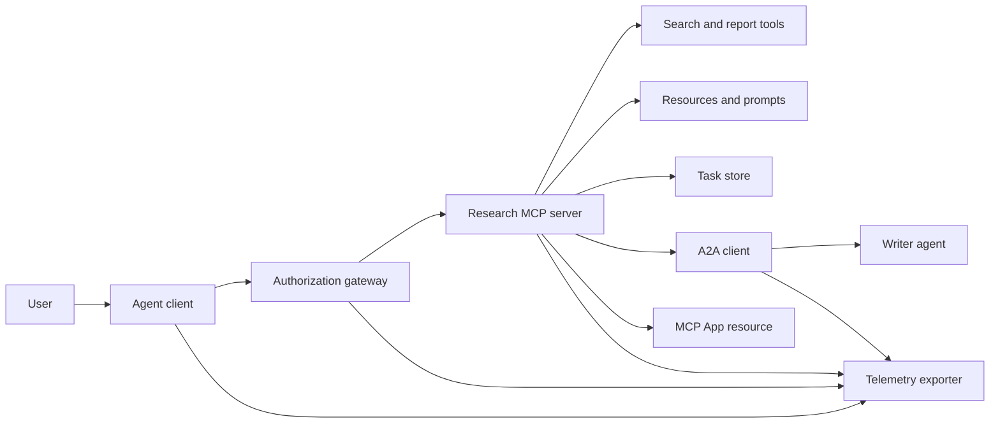
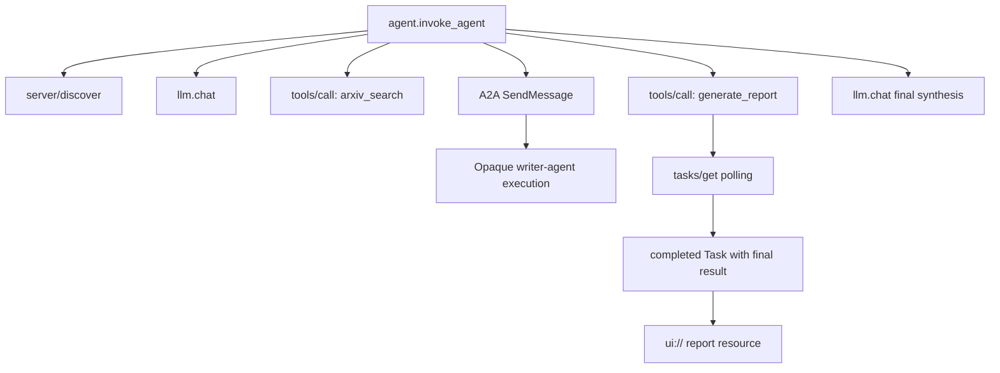
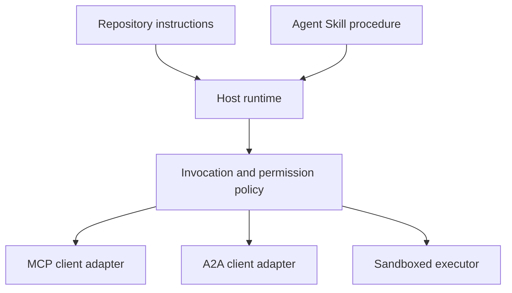

# 综合实战项目:无状态工具生态系统

> उत्पादन स्तर एजेंट  प्रणाली स्पष्ट सीमाओं का एक समूह है, लेकिन गैर-विशेष सरल ढेरों। इस वास्तविक युद्ध परियोजना को स्पष्ट रूप से पठनीय प्रक्रियाओं में अनुकरण किया जाएगा, वास्तविक तैनाती में आवश्यक प्रोटोकॉल ग्राहक, प्राधिकरण सर्वर, निष्पादन बॉक्स और दूरस्थ निर्देशांक के साथ कठोरता से समझाया जाएगा।

**Type:** Build
**Languages:** Python (stdlib, in-process simulation)
**Prerequisites:** Phase 13 · 01 through 22, using MCP revision `2026-07-28`
**Time:** ~120 minutes

## 学习目标

- उपकरण को नियोजित करना 任务级 परिणाम 跨代理 委托、UI 资源、授权策略及分布式追踪记录有机融合成单一流水线──
- प्रत्येक एमसीपी अनुरोध में कड़ाई से समझौता संस्करण, ग्राहक पहचान और क्षमताओं को लेकर अनुरोध, पूरी तरह से प्रसारण स्तर की बैठक पर निर्भरता से विमुख हो गया।
- 调用前主动执行服务发现,并通过官方任务 扩展稳健驱动长耗时工作──
- 清晰区分符合协议形态的本地模拟 (प्रोटोकॉल के आकार की सिमुलेशन) वास्तविक MCP、A2A、OAuth 及 OpenTelemetry के साथ
- प्रतिरूपक में प्रत्येक अमूर्त सीमा को सटीक रूप से मैप किया जाना चाहिए ताकि उत्पादन में इसके प्रतिस्थापित होने वाले भौतिक घटक को पूरा किया जा सके।
-  सुनिश्चित करें `AGENTS.md`、एजेंट कौशल、运行时适配器、工具 及安全策略 प्रत्येक सही संरचनात्मक दायित्वों का पालन करे
- स्पष्ट रूप से बताएं कि कौन से तकनीकी निष्कर्ष सीधे स्थानीय रूप से आउटपुट किए जा सकते हैं, जो वास्तविक अंत-अन्त तक एकीकृत परीक्षण पर निर्भर होना चाहिए।

## 问题

 डिजाइन एक शैक्षणिक अनुसंधान और रिपोर्ट उत्पन्न प्रणालीः उपयोगकर्ता अनुरोध जांच एजेंट के बारे में 通信 समझौते के लेखों。 सिस्टम जांच दस्तावेजों का कैडस्ट्रो、 असाइन करने के लिए लेखन संक्षेप、 उत्पादन विश्लेषण रिपोर्ट、 UI पर लौटें 交互资源, और पूरा रिकॉर्ड सिस्टम निष्पादन के लिंक ट्रैकों。

यह वाक्य सरल प्रतीत होता है, वास्तव में कई अलग-अलग संधि छिपाई हुई हैः

- 面向模型的工具方案 声明;
- 无状态请求信封与服务发现契约;
- मुख्य अभिनेता (अभिनेता) 、क्षेत्र तथा उपकरण के लिए 
- 长周期任务操作契约;
- 跨 एजेंट 委托协作协议(A2A);
- 宿主与前端应用 (MCP App) के बीच संचार पुल;
- 链路追踪 के उपर्युक्त संचरण एवं प्रसार;
- 可复用标准化操作规程 (कौशल)

`code/main.py`शुद्ध पायथन फ़ंक्शन और लिफ़्फ़ेक्स का उपयोग करने से उपरोक्त सीमा स्पष्ट रूप से दिखाई देती है। यह नेटवर्क निगरानी नहीं खोलता है, वास्तविक अनुरोध नहीं करता है।

## 概念

### 目标架构



यह संरचना सार्वजनिक मानक प्रोटोकॉल मॉडल के लिए एक अवधारणात्मक संरचना है, जो किसी भी एकल विशेष उत्पाद के निजी आंतरिक कार्यान्वयन नहीं है।

### 目标 वितरित ट्रैकिंग लिंक



वास्तविक उत्पादन में, प्रत्येक नेटवर्क कूद कदम(hop) सभी को सही ढंग से प्रसारित करना चाहिए ट्रैकिंग पर नीचे के वाक्य।

### 当前协议交互表面

प्रयोग वर्तमान नवीनतम नियमन परिभाषित विधि नाम, निश्चित रूप से पुराने मसौदे में स्मृति के साथ नहीं किया जा सकताः

| 边界 | 当前标准交互表面 | 本实战项目的本地模拟实现 |
|---|---|---|
| MCP 服务发现 | 强制性的 `server/discover` | 返回版本、capabilities 和服务器身份的直接函数 |
| MCP 请求上下文 | 每个 `params._meta` 均携带版本、capabilities 及客户端信息 | 传递给每次模拟调用的全新请求元数据 |
| MCP 工具调用 | `tools/call` | Python 本地函数直接分发 |
| MCP 任务轮询 | `io.modelcontextprotocol/tasks` 扩展与 `tasks/get` | 先返回处理中的任务句柄，后返回内联最终结果的完成任务 |
| A2A 跨代理委托 | gRPC 和 JSON-RPC 中为 `SendMessage`；HTTP+JSON 中为 `POST /message:send` | 无远程调用与人为延迟的单层嵌套 Span |
| MCP App 调用宿主工具 | `app.callServerTool({ name, arguments })` | 无实时通信桥梁的纯 HTML 字符串 |
| OAuth 鉴权 | 授权服务器、受保护资源元数据、Audience 与 Scope 校验 | 静态 Token 字典查找与 Scope 集合判断 |
| OpenTelemetry | SDK、传播器（Propagator）、导出器（Exporter）及收集器（Collector） | 纯内存 Span 字典数组 |

协议名称 केवल सबसे बाहरी रूप से प्रदर्शित है। उत्पादन परीक्षण वास्तविक नेटवर्क केबल पर क्रमबद्धता, क्रमबद्धता, विफलता, विफलता, अंतराल, समय पर पुनः परीक्षण और कई संस्करणों के साथ-साथ प्रोटोकॉल को कवर करना चाहिए।

### 无状态 MCP 重构集成边界

`2026-07-28`修订版本 समझौते सत्र को पूरी तरह से हटा दिया गया तथा `initialize`/`notifications/initialized`握手阶段──同时废除 `Mcp-Session-Id` हर अनुरोध में `params._meta`中携带如下命名空间字段:

```json
{
  "io.modelcontextprotocol/protocolVersion": "2026-07-28",
  "io.modelcontextprotocol/clientCapabilities": {
    "extensions": {
      "io.modelcontextprotocol/tasks": {}
    }
  },
  "io.modelcontextprotocol/clientInfo": {
    "name": "capstone-client",
    "version": "1.0.0"
  }
}
```

 सेवा端 अवश्य पूरा करना `server/discover`常规结果使用 `resultType: "complete"`; वापसी任务句柄时使用 `resultType: "task"` प्रत्येक परिणाम  होना चाहिए `_meta.io.modelcontextprotocol/serverInfo`中表明服务器自身身份──

कार्य  विस्तार समाहित `tasks/get``tasks/update`और `tasks/cancel` उपकरण 首次调用可以回归 `resultType: "task"`; और बाद में पूछताछ की`tasks/get`                                                                                                                                                                                                                                                                                                                                                                                                                                                                                                                             `resultType: "complete"`, और पूर्ण रूप से `Task`                                                                                                                                                                                                                                                              `tasks/result``tasks/list`已完全移除──客户端必须在可能收到任务句柄的同一个请求中声明支持 `io.modelcontextprotocol/tasks`扩展; यदि नहीं घोषित, सेवा端将返回 `-32021`错误, और `requiredCapabilities`中明指出缺失的扩展项──

### सुरक्षा स्थिति (सुरक्षा स्थिति)

预期的生产部署环境必须采用全深防御:

-  संरक्षण की आवश्यकता वाले ग्राहक प्रकार के लिए PKCE के साथ OAuth  प्राधिकरण को अनिवार्य रूप से अपनाना;
- 签发的访问 टोकन 强制实施资源 (资源) 受众 (audience) 绑定;
- 网关 भूमिका आधारित कठोर परीक्षण एवं नियोजित उपकरण तथा दायरा  अधिकार;
- 访问上游API के प्रमुख क्रेडेंशियल्स को मॉडल के दृश्यमान उपरोक्त अवतरण में सख्ती से निषिद्ध रखा गया है;
- 严格锁定并审查 उपकरण 描述元数据清单(मनिफस्ट);
-  अविश्वसनीय प्रविष्टि, संवेदनशील डेटा तथा महत्वपूर्ण बाहरी प्रभावों के विरुद्ध दो लोगों के नियम(दुनिया के नियम
- अलग किए गए निष्पादन बक्से में फाइल सिस्टम, प्रक्रिया, नेटवर्क, प्रमाणपत्र और संसाधन खपत को सीमित करना, कौशल के बाहरी विभाग द्वारा अनिवार्य रूप से लागू किया जाना चाहिए।

इस वर्ग में उदाहरण कोड केवल स्थिर टोकन ∞ स्कोप ∞ परीक्षण और वर्णन को लागू करता है, जो रणनीति प्रवृत्ति को स्पष्ट करने के लिए है, उत्पादन सुरक्षा परीक्षण का विकल्प नहीं है।

### कौशल संचालन का नियम है, न कि नेटवर्क संचरण

एजेंट कौशल का उपयोग संचालन के दौरान अनुसंधान कार्यप्रवाह को आगे बढ़ाने के तरीके को बताने के लिए किया जाता है 契约, कौन से उपकरण अनुकूलित होने की उम्मीद करें 契约, कौन से प्रक्रिया ऑडिट प्रमाण पत्र और कब समाप्ति का कार्य करें  लेकिन यह खाली स्थान पर MCP सर्वर बनाने में असमर्थ है  स्थापित करें A2A 协议连通, जारी करें प्राधिकरण दायरा, या कोड बॉक्स का निर्माण करें



जब संचालन नियमावली में संकुल संसाधन दस्तावेजों का संदर्भ देने की आवश्यकता होती है, तो पूर्ण कौशल कैटेगरी के रूप में वितरण करना अनिवार्य है। इस पाठ्यक्रम के प्रारंभिक वितरण के लिए एकल फ़ाइल घटक पाठ्यक्रम प्रस्तुति ब्लूआउट में शामिल हैं, जो सामान्य कार्यक्रम पैकेज के प्रमाण के रूप में होस्ट का समर्थन नहीं कर सकते हैं।

### 课程产物元数据是本地适配器

इस पाठ्यक्रम के निर्देशिका सूचकांक और स्थापना यंत्र पहचान योग्य नाम`skill-*.md`平单文件, लेकिन यह इस भंडारण के विशिष्ट परियोजना नियमन में आता है, न कि सामान्य उपयोग एजेंट कौशल 跨平台标准规范── पाठ्यक्रम की अत्यंत सरल अग्रिम सामग्री 解析器 केवल शीर्ष स्तरीय प्रथम श्रेणी कीवर्ड पढ़ सकता है।

```yaml
---
name: ecosystem-blueprint
description: Produce a full Phase 13 ecosystem architecture for a product need.
version: "1.0.0"
phase: "13"
lesson: "23"
tags: [mcp, capstone, ecosystem, architecture, a2a, otel]
---
```

`name``description`                                                                                                                                                                                                                                                              `version``phase``lesson`和 `tags`️️️️️️️️️️️️️️️️️️️️️️️️️️️️️️️️️️️️️️️️️️️️️️️️️️️️️️️️️️️️️️️️️️️️️️️️️️️️️️️️️️️️️️️️️️️️️️️️️️️️️️️️️️️️️️️️️️️️️️️️️️️️️️️️️️️️️️️️️️️️️️️️️️️️️️️️️️️️️️️️️️️️️️️️️️️️️️️️️️️️️️️️️️️️️️️️️️️️️️️️️️️️️️️️️️️️️️️️️️️️️️️️️️️️️️️️️️️️️️️️️️️️️️️️️️️️️️️️️️️️️️️️️️️️️️️️️️️️️️️️️️️️️️️️️️️️️️️️️️️️️️️️️️️️️️️️️️️️️️️️️️️️️️️️️️️️️️️️️️️️️️️️️️️️️️️️️️️️️️️️️️️️️️️️️️️️️️️️️️️️️️️️️️️️️️️️️️️️️️️️️️️️️️️️️️️️️️️️️️️️️️️️️️️️️️️️️️️️️️️️️️️️️️️️️️️️️️️️️️️️️️️️️️️️️️️️️️️️️️️️️️️️️️️️️️️️️️️️️️️️️️️️️️️️`tags` लिखने के लिए एक एकल लाइन में जुड़े संख्या, ताकि `--tag capstone`准确匹配──

标准的可移植目录  `metadata`字典存放自定义扩展数据── लेकिन इस भंडार के एकल फ़ाइलों में, यदि `version`या `tags`嵌套缩进写入 `metadata`内部,极简解析器会直接忽略,导致无法提提取版本号和标签过失效―― उत्पादन मेजबान को YAML 解析器 का उपयोग करना चाहिए 

### वास्तविक उत्पादन वातावरण के साथ स्थानीय प्रतिरूप

| 架构分层 | `code/main.py` 实现 | 生产落地替换方案 | 必须出示的验收证据 |
|---|---|---|---|
| 服务发现 | `server_discover()` 加静态 `TOOLS` | `server/discover` 配合带缓存的 `tools/list` | 报文轨迹、确定性排序与 Schema 校验 |
| 身份认证 | 基于 Token 的内存字典 | 独立的 OAuth 授权服务器与资源服务器验证 | 签发者、受众、Scope、过期与故障降级测试 |
| 授权鉴权 | Scope 集合成员判定 | 绑定主体、tool、目标和租户的网关策略 | 允许与拒绝分支的完整审计日志用例 |
| 论文检索 | 静态论文测试夹具（Fixtures） | 真实检索 API 或专门的 MCP Server | 数据溯源、排序打分与网络异常测试 |
| 异步任务 | 本地句柄加立即 `tasks/get` | 持久化 `io.modelcontextprotocol/tasks` 存储，实现 get/update/cancel 与 TTL | 状态迁移、用户输入、取消及宕机恢复测试 |
| 跨 Agent 委托 | 本地 Sleep 加嵌套 Span | 真实的 A2A 客户端与远程 Agent Card | 契约校验、超时重试与不透明执行测试 |
| 前端交互 App | HTML 字符串与 URI 协议头 | MCP Apps 资源与官方 `App` 通信桥梁 | CSP 安全策略、权限受控、tool 调用与浏览器渲染测试 |
| 链路遥测 | 内存 Python 字典列表 | 完整的 OTel SDK 与远程导出器（Exporter） | 收集端接收凭证与父子 Span 关联断言 |
| 执行沙箱 | 无 | 宿主强制隔离的安全沙箱执行器 | 沙箱逃逸、出站网络、敏感凭证与资源上限测试 |

यह तुलनात्मकता परियोजना के संपर्क की स्पष्ट सीमाओं का निर्माण करती है।

### चरण 13 全景知识图谱

| 课次区间 | 核心贡献与架构职责 |
|---|---|
| 01-05 | Tool 接口标准、模型调用、Schema 设计、结构化输出及确定性校验 |
| 06-14 | 无状态 MCP 请求信封、服务发现、底层传输、资源、Prompt、扩展及 Apps |
| 15-18 | 防投毒安全防线、OAuth 鉴权、网关路由、Registry 准入及生产部署落地 |
| 19 | A2A 协议：跨代理的消息传递与异步任务协作 |
| 20 | 基于 OpenTelemetry 的 GenAI 分布式链路追踪设计 |
| 21 | 面向大模型供应商的智能路由与降级分流层 |
| 22 | 可移植 Agent Skill 契约规范与运行时安全边界 |

```figure
t3-capstone-chain
```

## 动手构建

运行进程内综合实战模拟脚本:

```bash
cd phases/13-tools-and-protocols/23-capstone-tool-ecosystem
python3 code/main.py
```

重点审查 निम्नलिखित छह प्रमुख विशेषताएं:

1. `server/discover`सही कहा गया है`2026-07-28`协议 संस्करण तथा कार्य  विस्तार क्षमता 
2. एलिस ने सफलतापूर्वक शोध पत्र और रिपोर्ट का निर्माण किया, जबकि बॉब ने केवल दायरे में लिखने के अनुरोध को दृढ़ता से अस्वीकार कर दिया।
3. एक साथ संयोजन निष्पादन चरण के तहत सभी स्थानीय स्पैन 均共享唯一 ट्रैक आईडी,并准确记录父级 स्पैन आईडी──
4.                                                                                                                                                                                                                                                                                                                                                                                                                                                                                                                              `tasks/get`                                                                                                                                                                                                                                                              `ui://` संसाधन संवर्धन
5.                                                                                                                                                                                                                                                               
6. 控制台输出没有冒充发生了真实网络请求、OAuth 换标、遥测收集器网络导出、浏览器染或沙箱隔离──

脚本会连续执行两次,分别生成两条独立的根追踪链路──审计日志完全保存在本地内存中,进程退出即重置──

## इसका उपयोग करें

按部就班将模拟层替换为生产级真实组件:

1. `server_discover()`和静态 उपकरण 列表替换为标准的 `server/discover``tools/list`网络请求── प्रत्येक अनुरोध में पूर्ण携带协议版本、客户端身份与能力──
2. 将静态 टोकन 字典 को आरएफसी 标准 के अनुसार आजाद अधिकृत सर्वर एवं संरक्षित संसाधन सत्यापन मध्यवर्तन में बदल दिया जाए।
3. 完整接入 `io.modelcontextprotocol/tasks`扩展,测试 `tasks/get``tasks/update``tasks/cancel`、超时时间、TTL 清理及进程重启恢复── दृढ़ता से अपशिष्ट नहीं बढ़ाएं `tasks/result`या `tasks/list`
4. एजेन्ट कार्ड को सक्रिय रूप से हल करने में सक्षम होने के लिए कोड को बदलने के लिए लिखने और संदेश भेजने के लिए वास्तविक ए 2 ए 客户端 को नियुक्त करेगा
5. उपयोग आधिकारिक एसडीके 开发前端交互 App, के माध्यम से `app.callServerTool`规范发起反向工具调用──
6.                                                                                                                                                                                                                                                               
7. सभी उपकरण, प्रसंस्करण और स्क्रिप्ट निष्पादन को धारा 26 के नियम में सम्मिलित किया जाएगा।
8. कार्यविधि को मानक सूची स्तर के लिए तैयार करना कौशल संकुल, और 27वीं कक्षा के प्रकाशन को पारित करना

प्रत्येक प्रतिस्थापन स्तर पर, सभी को वास्तविक भौतिक सीमाओं के पार एकीकरण परीक्षण लिखने की आवश्यकता होती है।

## 交付 यह

本课交付 `outputs/skill-ecosystem-blueprint.md` यह एक एकल फ़ाइल संरचना ब्लूटूथ है, जिसमें एक पृष्ठ की लंबाई में बुनियादी घटक चयन प्रकार, सुरक्षा स्थिति, क्रॉस-एजेंट वसीयत, दृश्यता, दूरी, पैकेज संरचना की व्यवस्था और सबसे कठोर परिचालन के लिए एक पूर्ण विवरण की आवश्यकता है।

क्योंकि यह एक एकल दस्तावेज ब्लूटूथ है, इसलिए संदर्भ, स्क्रिप्ट, संपत्ति या मूल्यांकन परीक्षण उपयोग के उदाहरणों को ले जाने में असमर्थ है। पाठ्यक्रम के बाहर पुनरावर्ती उत्पादन स्तर कौशल के निर्माण के लिए, यह आवश्यक है कि कक्षा 22 और 24 से 27 तक के प्रोफेसरों के मानक सूची कार्यक्रम के प्रारूप को अपनाया जाए।

## 课后深练

1. 运行 `code/main.py`◊ विवरण ️️️️️️️️️️️️️️️️️️️️️️️️️️️️️️️️️️️️️️️️️️️️️️️️️️️️️️️️️️️️️️️️️️️️️️️️️️️️️️️️️️️️️️️️️️️️️️️️️️️️️️️️️️️️️️️️️️️️️️️️️️️️️️️️️️️️️️️️️️️️️️️️️️️️️️️️️️️️️️️️️️️️️️️️️️️️️️️️️️️️️️️️️️️️️️️️️️️️️️️️️️️️️️️️️️️️️️️️️️️️️️️️️️️️️️️️️️️️️️️️️️️️️️️️️️️️️️️️️️️️️️️️️️️️️️️️️️️️️️️️️️️️️️️️️️️️️️️️️️️️️️️️️️️️️️️️️️️️️️️️️️️️️️️️️️️️️️️️️️️️️️️️️️️️️️️️️️️️️️️️️️️️️️️️️️️️️️️️️️️️️️️️️️️️️️️️️️️️️️️️️️️️️️️️️️️️️️️️️️️️️️️️️️️️️️️️️️️️️️️️️️️️️️️️️️️️️️️️️️️️️️️️️️️️️️️️️️️️️️️️️️️️️️️️️️️️️️️️️️️️️️️️️
2. 2. अनुकरणकर्ता में दूसरी स्थिरांक जोड़ें, दो समान नाम के उपकरण को परिभाषित करें 发生命名冲突时的解决规则── इसके बाद दो हार्ड कोड सूची वास्तविक के लिए बदल दी जाएगी `tools/list`调用──
3. एजेन्ट कार्ड की रिकॉर्डिंग एवं समीक्षा करना, सूचना अनुरोध रिपोर्टिंग, अल्ट्रा टाइम असामान्य शाखाएं तथा लौटे हुए परिणामों का विश्लेषण करना
4. उपयोगी प्रक्रियाओं को पुनः आरंभ करने के लिए एक स्थायी भंडारण परत का विकास करना।`tasks/get`恢复执行、遵守 `pollIntervalMs`轮询间隔, और अवलंबून नहीं `tasks/result`के पूर्वानुमान के तहत सीधे पढ取完成任务 के अंतिम उत्पाद
5.                                                                                                                                                                                                                                                                                                                                                                                                                                                                                                                              `app.callServerTool`की कनेक्टिविटी
6.                                                                                                                                                                                                                                                               
7. एक विशिष्ट रूप से नियमन के लिए एक लेख लिखें।`AGENTS.md`, तथा एक स्वतंत्र कौशल कार्यक्रम जो मार्गदर्शन के लिए प्रयोग किया जाता है। यह विस्तार से समझाया गया है कि इन दोनों सूचनात्मक दस्तावेजों में प्रत्यक्ष रूप से उपयोग करने के लिए औजारों का अधिकृत अधिकार क्यों नहीं है।

## 关键术语

| 术语 | 通俗说法 | 精确工程含义 |
|---|---|---|
| 实战项目（Capstone） | "把所有东西串起来" | 分阶段构建的集成系统，其本地模拟与真实线上边界保持绝对清晰 |
| 协议形态模拟（Protocol-shaped simulation） | "差不多就是个 MCP" | 在本地构建的与协议数据结构高度相似的代码，但未实现底层的网络传输契约 |
| Tasks 扩展 | "长耗时 tool 调用" | 可选的 `io.modelcontextprotocol/tasks` 扩展规范，定义了持久化标识、轮询、客户端补全、最终结果与取消机制 |
| 不透明边界（Opacity boundary） | "丢给另一个 agent 处理" | 调用方仅能看到公开声明的接口与交付成果，无法窥探其内部思维链与私有状态 |
| 运行时适配器（Runtime adapter） | "接入 Skill 的胶水代码" | 宿主层负责将通用可移植的操作规程映射到服务发现、交互调用、工具权限、安全策略及上下文管理的代码 |
| 集成证据（Integration evidence） | "测试跑通了" | 完整的报文日志、交付产物或接收端实测数据，确凿证明系统跨越了真实的物理边界 |

## 延伸阅读

- [MCP 2026-07-28 核心规范](https://modelcontextprotocol.io/specification/2026-07-28)- गहन ज्ञान प्राप्त करना बिना राज्य के अनुरोध, सेवा खोज, उपकरण प्रयोग, पहचान अधिकार तथा निम्न स्तरीय संचरण विनियमों में
- [MCP 2026-07-28 关键变更日志](https://modelcontextprotocol.io/specification/2026-07-28/changelog)- 了解会话移除、逐请求元数据、MRTR、官方扩展及废弃特征的发展细节──
- [MCP Tasks 扩展规范草案](https://tasks.extensions.modelcontextprotocol.io/specification/draft/tasks)- 学习 `tasks/get``tasks/update``tasks/cancel`及任务终态结果的完整流转机――
- [MCP Apps 官方 SDK](https://github.com/modelcontextprotocol/ext-apps/blob/main/docs/overview.md)- 掌握 `App`类及 `app.callServerTool`                                                                                                                                                                                                                                                              
- [A2A 跨代理协议最新规范](https://a2a-protocol.org/latest/)- एजेंट कार्ड, संदेश संचरण, कार्य सहयोग, कार्य वितरण तथा नेटवर्क संचरण के लिए अधिकार मानक को जानें।
- [OpenTelemetry GenAI 语义约定](https://opentelemetry.io/docs/specs/semconv/gen-ai/)- उद्योग के एकीकृत एआई 链路 ट्रैकिंग एवं विशेषता नामकरण मानदंडों का पालन करना
- [Agent Skills 规范官方文档](https://agentskills.io/specification)- इस वास्तविक युद्ध परियोजना के नियमन में अवलंबित संरचनात्मक अनुबंधों के अवधारण स्तर का प्रबन्ध करना।
