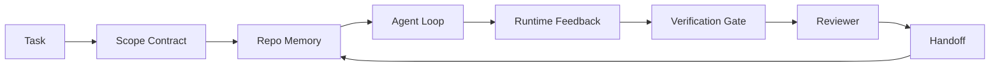

# एजेंट वर्कबेंच इंजीनियरिंगः क्यों क्षमता मजबूत मॉडल अभी भी विफल रहेगा

>  केवल सक्षम मजबूत मॉडल पर्याप्त नहीं हैं  विश्वसनीय एजेंट  एक कार्यक्षेत्र की आवश्यकता हैः निर्देश, स्थिति, दायरा, प्रतिक्रिया, सत्यापन, समीक्षा और वितरण  इन सभी को हटा दें, यहां तक कि सीमा मॉडल भी जारी करने के लिए अपर्याप्त काम उत्पन्न होगा

**Type:** Learn + Build
**Languages:** Python (stdlib)
**Prerequisites:** Phase 14 · 01 (Agent Loop), Phase 14 · 26 (Failure Modes)
**Time:** ~45 minutes

## 学习目标
- 区分模型能力与执行可靠性
- 能否交付的七个工作台表面的决定代理 能否交付的七个工作台表面的决定代理
- एक छोटे से रेपो 任务 पर तुलना करें केवल शीघ्र 运行 और कार्यक्षेत्र-निर्देशित 运行。
- एक विफलता मोड रिपोर्ट उत्पन्न करें, प्रत्येक अनुपस्थिति की सतह को इसके कारण होने वाले लक्षणों पर चित्रित करें

## 问题
आप एक सीमा मॉडल  वास्तविक रेपो में डालते हैं, इसे इनपुट सत्यापन जोड़ते हैं  यह चार फाइलें खोलता है, प्रतीत होने वाले उचित कोड लिखता है, सफलता की घोषणा करता है, फिर रुकता है  आप परीक्षण चलाना बंद करते हैं  दो असफल होते हैं  तीसरा संशोधित फ़ाइल सत्यापन से पूरी तरह से असंबंधित है  कोई रिकॉर्डिंग एजेंट  कुछ भी नहीं करता है  पहले क्या प्रयास किया है, या क्या करना बाकी है 

模型不是不懂Python──它是不懂这个工作──它不知道什么才算完成──它不懂哪里可以写入──哪些测试有权威性,也不知道下一次会话 应该如何接手──

यह मॉडल बग नहीं है। यह वर्कबेंच बग है। एजेंट के आसपास की सतह में आवश्यक भाग की कमी है, एक बार का उत्पादन विश्वसनीय, पुनः प्राप्ति योग्य इंजीनियरिंग कार्य में परिवर्तित नहीं किया जा सकता है।

## 概念
कार्यक्षेत्र में कार्यक्षेत्र में कार्यक्षेत्र में कार्यक्षेत्र में कार्यक्षेत्र में कार्यक्षेत्र में कार्यक्षेत्र में कार्यक्षेत्र में कार्यक्षेत्र में कार्यक्षेत्र में कार्यक्षेत्र में कार्यक्षेत्र में कार्यक्षेत्र में कार्यक्षेत्र में कार्यक्षेत्र में कार्यक्षेत्र में कार्यक्षेत्र में कार्यक्षेत्र में कार्यक्षेत्र में कार्यक्षेत्र में कार्यक्षेत्र में कार्यक्षेत्र में कार्यक्षेत्र में कार्यक्षेत्र में कार्यक्षेत्र में कार्यक्षेत्र में कार्यक्षेत्र में कार्यक्षेत्र में कार्यक्षेत्र में कार्यक्षेत्र में कार्यक्षेत्र में कार्यक्षेत्र में कार्यक्षेत्र में कार्यक्षेत्र में कार्यक्षेत्र में कार्यक्षेत्र में कार्यक्षेत्र में कार्यक्षेत्र में कार्यक्षेत्र में कार्यक्षेत्र में कार्यक्षेत्र में कार्यक्षेत्र में कार्यक्षेत्र में कार्यक्षेत्र में कार्यक्षेत्र में कार्यक्षेत्र में कार्यक्षेत्र में कार्यक्षेत्र में कार्यक्षेत्र में कार्यक्षेत्र में कार्यक्षेत्र में कार्यक्षेत्र में कार्यक्षेत्र में कार्यक्षेत्र में कार्यक्षेत्र में कार्यक्षेत्र में कार्यक्षेत्र में कार्यक्षेत्र में कार्यक्षेत्र में कार्यक्षेत्र में कार्यक्षेत्र में कार्यक्षेत्र में कार्यक्षेत्र में कार्यक्षेत्र में कार्यक्षेत्र में कार्यक्षेत्र में कार्यक्षेत्र में कार्यक्षेत्र में कार्यक्षेत्र में कार्यक्षेत्र में कार्यक्षेत्र में कार्यक्षेत्र में कार्यक्षेत्र में कार्यक्षेत्र में कार्यक्षेत्र में कार्यक्षेत्र में कार्यक्षेत्र में कार्यक्षेत्र में कार्यक्षेत्र में कार्यक्षेत्र में कार्यक्षेत्र में कार्यक्षेत्र में कार्यक्षेत्र में कार्यक्षेत्र में कार्यक्षेत्र में कार्यक्षेत्र में कार्यक्षेत्र में कार्यक्षेत्र में कार्यक्षेत्र में कार्यक्षेत्र में कार्यरत है।

| Surface | 它承载什么 | 缺失时的失败 |
|---------|------------|--------------|
| Instructions | 启动规则、禁止动作、完成定义 | Agent 猜测交付意味着什么 |
| State | 当前任务、已触碰文件、blockers、下一步动作 | 每个 session 都从零开始 |
| Scope | 允许文件、禁止文件、验收标准 | 修改泄漏到无关代码 |
| Feedback | 捕获进 loop 的真实命令输出 | Agent 在 400 上宣布成功 |
| Verification | Tests、lint、smoke run、scope check | “看起来不错”进入 main |
| Review | 由不同角色执行的第二遍检查 | Builder 批改自己的作业 |
| Handoff | 改了什么、为什么改、还剩什么 | 下一个 session 重新发现一切 |

कार्यक्षेत्र 独立于模型──你可以替换模型并保留这些表面──你不能替换表面 还保持可靠性──



यह लूप  स्टेट फ़ाइल पर बंद है, चैट इतिहास पर नहीं  चैट  है आसान  रेपो  है रिकॉर्डिंग सिस्टम 

### कार्यक्षेत्र और शीघ्र इंजीनियरिंग

शीघ्रता  बताएं मॉडल इस दौर में आप क्या चाहते हैं  वर्कबेंच  बताएं मॉडल कैसे跨轮次、跨 सत्र 地完成工作── अधिकांश एजेंट 失败故事,其实是披着 शीघ्रता-इंजीनियरिंग 外衣的工作台 失败──

### कार्यक्षेत्र और ढांचे के मुकाबले

ढांचा  रनटाइम प्रदान करना  लांगग्राफ、 ऑटोजेन、 एजेंट्स एसडीके) ∙ वर्कबेंच  एजेंट को उस रनटाइम में एक वर्कशीट प्रदान करना ∙ दोनों की जरूरत है ∙ यह मिनी-ट्रैक ∙ दूसरा है ∙

### आदिम से उत्पन्न अनुमान, न कि विक्रेता टैक्सोनोमी से उत्पन्न

harness engineering के बारे में बहुत सारे लेख हैं। एडडी ओस्मानी、OpenAI、Anthropic、LangChain、 मार्टिन फोलर、मोंगोडीबी、HumanLayer、Augment Code、Thoughtworks、walkinglabs भयानक सूची, साथ ही साथ मध्यम 和 हैकर न्यूज़ पर लगातार लेख सभी चर्चा में हैं।

एक बार एजेंट चलाएं समय के पार, प्रक्रियाओं और मशीनों के गणना है, इसे विश्वसनीय बनाने के लिए, आपको किसी भी उत्पादन प्रणाली की आवश्यकता है।

| Primitive | 它是什么 | 它为 agent 承载什么 |
|-----------|----------|---------------------|
| Function | 类型化 handler。尽可能保持纯。拥有自己的 inputs 和 outputs。 | 一次 tool call、一次 rule check、一个 verification step、一次模型调用 |
| Worker | 拥有一个或多个 functions 和 lifecycle 的长生命周期进程 | builder、reviewer、verifier、一个 MCP server |
| Trigger | 调用 function 的事件源 | Agent loop tick、HTTP request、queue message、cron、file change、hook |
| Runtime | 决定什么在哪里运行、使用什么 timeouts 和 resources 的边界 | Claude Code 的 process、LangGraph 的 runtime、一个 worker container |
| HTTP / RPC | caller 与 worker 之间的网络线缆 | Tool-call protocol、MCP request、model API |
| Queue | trigger 与 worker 之间的持久 buffer；back-pressure、retry、idempotency | task board、feedback log、review inbox |
| Session persistence | 在 crashes、restarts、model swaps 后仍保留的 state | `agent_state.json`、checkpoints、KV stores、repo 本身 |
| Authorization policy | 谁能以什么 scope 调用什么 function | allowed/forbidden files、approval boundaries、MCP capability lists |

अब इन आदिमों के ऊपर सात कार्य डेस्क सतहों को चित्रित करें।

- **Instructions** नीति + फ़ंक्शन मेटाडेटा──नियमों की जाँच करना फ़ंक्शन)──राउटर`AGENTS.md`) रनटाइम स्टार्टअप पर नीति से जुड़ी है।
- **State** सत्र की निरंतरता──रनटाइम प्रत्येक चरण都会读取的关键存储──फाइल、KV या DB;प्रतिष्ठा सेमेटिक 重要, भंडारण बैकेंड 不重要──
- **Scope** प्रत्येक मिशन की प्राधिकरण नीति  अनुमति/प्रतिबन्धित गोलियां ACL हैं  अनुमोदन की आवश्यकता है  अनुमति जाल 
- **Feedback** 写入队列的调用日志──每次 shell call 都是一个记录,持久、可重放──
- **Verification** एक फ़ंक्शन── इनपुट पर 确定性──由任务 close 触发──失败时关闭──
- **Review** एक स्वतंत्र कार्यकर्ता, निर्माण कलाकृतियों के लिए केवल पढ़ने के लिए अधिकार, समीक्षा रिपोर्टों के लिए केवल लिखने के लिए अधिकार
- **Handoff** सत्र के अंत में ट्रिगर द्वारा जारी किया गया 持久记录── अगला सत्र के स्टार्टअप ट्रिगर 会读取它──

एजेंट लूप 本身就是一个工人,它消费事件(user message、tool result、timer tick),调用函数(先是模型,然后是模型选择的工具),写记录(state、feedback),并发发发发触发器(verify、review、handoff)。没有神秘之处;形状与工作处理器相同──

### 流行模式,转换为 आदिम

प्रत्येक प्रकार के प्रचलित हर्न पैटर्न को आठ आदिमों में वर्गीकृत किया जा सकता है।

| Vendor or community pattern | 它实际是什么 |
|------------------------------|--------------|
| Ralph Loop（Claude Code、Codex、agentic_harness book）— 当 agent 试图过早停止时，把原始意图重新注入一个新的 context window | 一个将 task 以干净 context 重新入队的 trigger；session persistence 负责把目标向前传递 |
| Plan / Execute / Verify (PEV) | 三个 workers，每个角色一个，通过 state 和 phases 之间的 queue 通信 |
| Harness-compute separation（OpenAI Agents SDK，April 2026）— 将 control plane 与 execution plane 分开 | 对 control-plane / data-plane 的重新表述。比 agent 标签早几十年就存在 |
| Open Agent Passport（OAP，March 2026）— 在执行前根据声明式 policy 签名并审计每次 tool call | 由 pre-action worker 强制执行的 authorization policy，并带有 signed audit queue |
| Guides and Sensors（Birgitta Böckeler / Thoughtworks）— feedforward rules + feedback observability | Authorization policy + verification functions + observability traces |
| Progressive compaction, 5-stage（Claude Code reverse engineering，April 2026） | 一个 state-management worker，像 cron 一样在 session persistence 上运行，使其保持在 budget 内 |
| Hooks / middleware（LangChain、Claude Code）— 拦截 model 和 tool calls | 包裹 runtime invocation path 的 triggers + functions |
| Skills as Markdown with progressive disclosure（Anthropic、Flue） | 一个 function registry，其中 function metadata 会 just-in-time 加载到 context 中 |
| Sandbox agents（Codex、Sandcastle、Vercel Sandbox） | compute plane：具备隔离 filesystem、network 和 lifecycle 的 runtime |
| MCP servers | 通过稳定 RPC 暴露 functions 的 workers，capability lists 作为 authorization |

इस तालिका में प्रत्येक वस्तु, एजेंट 社区 तक पहुँचती है एक पहले से ही वितरित प्रणालियों में नामित अक्षरों की आदिम, फिर इसे नया नाम दिया जाता है।

### रसीद  वास्तव में क्या समझाया

हर्न-ओवर-मोडल का तर्क अब डेटा से जुड़ा है। यह जानना उचित है, क्योंकि यह भी एक तर्क है कि बेहतर मॉडल के लिए एकमात्र ईमानदार तर्क है।

- टर्मिनल बेंच 2.0  एक मॉडल के साथ, केवल एक कोडिंग एजेंट को शीर्ष 30 से ऊपर से उन्नत करने के लिए अनुमति दें 
- Vercel   हटा दिया अपने एजेंट 80% के उपकरण; सफलता दर 80%  से 100% 
- हार्वे  कानूनी एजेंट  केवल लाभ अनुकूलन के माध्यम से 就让精度 翻倍以上(MongoDB) 
- 88% उद्यम एआई एजेंट परियोजनाएं उत्पादन में प्रवेश नहीं कर पा रही हैं── असफलता रनिंगटाइम पर केंद्रित है, तर्क के बजायpreprints.org,*Harness Engineering for Language Agents*, मार्च 2026)──
- एक 2025 बेंचमार्क अध्ययन में तीन प्रचलित ओपन-सोर्स फ्रेमवर्क में ऊपर लगभग 50% कार्य पूरा होने की रिपोर्ट; लंबी-संदर्भ वेबएजेंट लंबी-संदर्भ स्थितियों में नीचे 40-50% से गिरकर 10% नीचे, मुख्य रूप से अनंत लूप और लक्ष्य हानि के कारण ((2026 वर्ष की शुरुआत में लेखनों में व्यापक रूप से चर्चा की जाती है)

हर समय हर समय हर समय हर समय हर समय हर समय हर समय हर समय हर समय हर समय हर समय हर समय हर समय हर समय हर समय हर समय हर समय हर समय हर समय हर समय हर समय हर समय हर समय हर समय हर समय हर समय हर समय हर समय हर समय हर समय हर समय हर समय हर समय हर समय हर समय हर समय हर समय हर समय हर समय हर समय हर समय हर समय हर समय हर समय हर समय हर समय हर समय हर समय हर समय हर समय हर समय हर समय हर समय हर समय हर समय हर समय हर समय हर समय हर समय हर समय हर समय हर समय हर समय हर समय हर समय हर समय हर समय हर समय हर समय हर समय हर समय हर समय हर समय हर समय हर समय हर समय हर समय हर समय हर समय हर समय हर समय हर समय हर समय हर समय हर समय हर समय हर समय हर समय हर समय हर समय हर समय हर समय हर समय हर समय हर समय हर समय हर समय हर समय हर समय हर समय हर समय हर समय हर समय हर समय हर समय हर समय हर समय हर समय हर समय हर समय हर समय हर समय हर समय हर समय हर समय हर समय हर समय हर समय हर समय हर समय हर समय 

### विक्रेता लेखन 止步的地方

यह हिस्सा तुम ग्राहक की जरूरत नहीं है।

- LangChain के *एजेंट हार्नेस का शरीरविज्ञान* में 10 घटक शामिल हैं  प्रम्प्ट्स, टूल, हुक, सैंडबॉक्स, ऑर्केस्ट्रेशन, मेमोरी, कौशल, उप-सॉबजेन्ट, साथ ही एक रनटाइम मूर्ख लूप── यह कोई नामित कतार नहीं रखता है ‒ जैसे कि तैनाती इकाई के श्रमिक ‒ ट्रिगर सेमेटिक ‒ स्वतंत्र ध्यान बिंदु सत्र की निरंतरता, या प्राधिकरण नीति के रूप में ‒ यह हार्नेस को एक आप तैनात किए गए ऑब्जेक्ट के रूप में रखता है, न कि एक आप तैनात किए गए सिस्टम के रूप में ‒
- एडडी ओस्मानी का * एजेंट हर्नस इंजीनियरिंग *  प्रस्तावित `Agent = Model + Harness`फ्रेमवर्क और रशश्ट पैटर्न, लेकिन आगे कोई विवरण नहीं है कि हर्नस किससे बना है। यह एक स्टैंड की तरह लगता है, न कि एक स्पेक्ट्रम।
- मानव विज्ञान और ओपनएआई के लिए सतहों पर चर्चा हुई है, लेकिन अभी भी अपने-अपने रनटाइम में रुके हुए हैं। अप्रैल 2026 एजेंट एसडीके में हार्नेस-कंप्यूटर अलगाव घोषणा पहली स्पष्ट रूप से पुष्टि करने योग्य नियंत्रण-योजना / डेटा-योजना विभाजित विक्रेता टुकड़ा है।
- एजेंटिक_हार्नेस पुस्तक ️Harness 视为 config ऑब्जेक्ट(जेमिन वेस्ट की *एजेंटिक इंजीनियरिंग*, अध्याय 6), जिसमें से सबसे शक्तिशाली एक वाक्य हैहरनेस एजेंटिक सिस्टम में प्राथमिक सुरक्षा सीमा है── यह सिर्फ प्राधिकरण नीति का पुनः वर्णन है──
- हैकर न्यूज थ्रेड्स 一直抵达同一个地方── अप्रैल 2026 थ्रेड *एजेंट हर्नस सैंडबॉक्स के बाहर का है* 认为 हर्नस 应该位于更像是一个处在一切之外的、并基于背景 和用户 授权访问的超级浏览器──这是再次作为独立平面的授权政策──

आप इन लेखों में से किसी एक के खिलाफ नहीं हैं, आप भी त्रुटियों को देख सकते हैं। वे एक मौजूदा प्रणाली के UX का वर्णन लिखते हैं। हम सिस्टम लिखना चाहते हैं।`AGENTS.md`色也修不好缺失的队列──

इसलिए, जब आप अन्य जगहों पर harness engineering 时 सुनते हैं, तो इसे आदिमों में अनुवाद करें──प्रॉम्प्ट्स और नियम नीति और कार्य हैं──स्केफॉल्डिंग रनटाइम है──गार्ड्रेल प्राधिकरण + सत्यापन हैं──हुक्स ट्रिगर हैं──मेमोरी सत्र की निरंतरता है──रल्फ लूप रिक्वेस्ट है──सैंडबॉक्स कम्प्यूटिंग प्लेन हैं──शब्द汇会变;工程不会──कार्यक्षेत्र एजेंट-मुखी UX है; और सक्षम होना अगली बार विक्रेता रिफ्रेम के हर्न से ऊपर उठना, मूल रूप से कार्य हैं、कर्मियों、 ट्रिगरों、 रनटाइम、 कतारें、परसिस्ट और नीतिएँ सही ढंग से जुड़े हुए हैं──


```figure
wb-seven-surfaces
```

##  इसे निर्माण
`code/main.py`एक ही मॉडल, एक ही कार्य, एक ही कार्य, एक ही पृष्ठ, एक ही पृष्ठ, एक ही पृष्ठ, एक ही पृष्ठ, एक ही पृष्ठ, एक ही पृष्ठ, एक ही पृष्ठ, एक ही पृष्ठ, एक ही पृष्ठ, एक ही पृष्ठ, एक ही पृष्ठ, एक ही पृष्ठ, एक ही पृष्ठ, एक ही पृष्ठ, एक ही पृष्ठ, एक ही पृष्ठ, एक ही पृष्ठ, एक ही पृष्ठ, एक ही पृष्ठ, एक ही पृष्ठ, एक ही पृष्ठ, एक ही पृष्ठ, एक ही पृष्ठ, एक ही पृष्ठ, एक ही पृष्ठ, एक ही पृष्ठ, एक ही पृष्ठ, एक ही पृष्ठ, एक ही पृष्ठ, एक ही पृष्ठ, एक ही पृष्ठ, एक ही पृष्ठ, एक ही पृष्ठ, एक ही पृष्ठ, एक ही पृष्ठ, एक ही पृष्ठ, एक ही पृष्ठ, एक ही पृष्ठ, एक ही पृष्ठ, एक ही पृष्ठ, एक ही पृष्ठ, एक ही पृष्ठ, एक ही पृष्ठ, एक ही पृष्ठ, एक ही पृष्ठ, एक ही पृष्ठ, एक ही पृष्ठ, एक ही पृष्ठ, एक ही पृष्ठ, एक ही पृष्ठ, एक ही पृष्ठ, एक ही पृष्ठ, एक ही पृष्ठ, एक ही पृष्ठ, एक ही पृष्ठ, एक ही पृष्ठ, एक ही पृष्ठ, एक ही पृष्ठ, एक ही पृष्ठ, एक ही, एक ही पृष्ठ, एक ही, एक ही, एक ही पृष्ठ, एक ही, एक ही, एक ही, एक ही, एक ही, एक ही, एक ही, एक ही, एक ही, एक ही, एक ही, एक ही, एक ही, एक ही, एक ही, एक ही, एक और एक और एक और एक और एक और एक और एक और एक और एक और एक और एक और एक और एक और एक और एक और एक, एक और, एक और एक और एक और, एक और एक और एक और एक और एक और, एक और एक और, एक और एक और एक और एक और, एक और, एक और एक और एक और, एक और, एक और, एक और एक और, एक और एक और, एक और एक और एक और, एक और एक और एक और, एक और एक और, एक और, एक और एक और एक और, एक और एक और, एक और एक और, एक और, एक और एक और, एक और, एक और, एक और, एक और, एक और, एक और, एक और, एक और, एक और, एक और, एक और, एक और, एक और, एक और, एक और, एक और, एक और, एक और, एक और,

रेपो कार्य 刻意设计得很小: एक एकल फ़ाइल को फास्टएपीआई-शैली के हैंडलर को दें 添加输入验证,并写一个通过测试――

运行它:

```
python3 code/main.py
```

输出:两次运行的 साइड-बाय-साइड लॉग,一个总结 शीघ्र-केवल रन 的 `failure_modes.json`, और कार्यक्षेत्र के दौरे का एक पंक्ति फैसला

एजेंट एक बहुत ही छोटा नियम आधारित स्टब है; फोकस सतहों पर है, मॉडल पर नहीं। इस मिनी-ट्रैक के शेष भाग में, आप प्रत्येक सतह को वास्तविक, दोहराया जा सकता कलाकृतियों के लिए पुनर्निर्माण करेंगे।

## इसका उपयोग करें
तीन जगहों पर पहले से ही काम की मेज की सतहें मौजूद हैं, यहां तक कि कोई भी उन्हें इस तरह नहीं कहता हैः

- **Claude Code, Codex, Cursor.** `AGENTS.md`和 `CLAUDE.md`है निर्देश सतह。Slash कमांड है दायरा。Hooks है सत्यापन。
- **LangGraph, OpenAI Agents SDK.**चेकपॉइंट व सत्र स्टोर राज्य की सतह हैं।
- **真实 repo 上的 CI。**परीक्षण、लिंट 和 प्रकार-चेक सत्यापन है──PR टेम्पलेट है हैंडऑफ──CODEOWNERS है समीक्षा──

कार्यक्षेत्र इंजीनियरिंग एक विधि हैः इन सतहों को पुनः प्रयोग करने के बजाय, उन्हें पुनः खोजें।

## 交付 यह
`outputs/skill-workbench-audit.md`यह एक ट्रांसपोर्टेबल कौशल है, जो मौजूदा रेपो के सात वर्कबेंच सतहों का ऑडिट करने के लिए उपयोग किया जाता है, और रिपोर्ट करता है कि क्या कमी है, क्या भाग है, क्या स्वास्थ्य है। इसे किसी भी एजेंट सेटअप के पास रखें; यह आपको बताएगा कि पहले क्या सुधार करें।

## अभ्यास
1. 选择一个你已经运行代理的 repo――把七个表面从0(缺失) 到2(健康)打分――你最弱的表面是什么?
2. 扩展 `main.py`, केवल शीघ्र-चलन भी उत्पन्न एक झूठी सफलता  घोषणा  सत्यापन सत्यापन गेट  पकड़ लेंगे 
3. अपने उत्पाद के लिए आठवीं सतह जोड़ें। समझाएं कि यह सातों में से एक में क्यों नहीं समाहित हो सकता है।
4. एक और के साथ प्यास लगाना होगा अतिरिक्त फ़ाइलों के लेखन के स्टब एजेंट फिर से चलाने के लिए स्क्रिप्ट.
5. चरण 14 · 26 में से पांच उद्योगों में बार-बार होने वाले विफलता मोड को सात सतहों पर चित्रित किया जाएगा। प्रत्येक सतह को किस प्रकार का मोड अवशोषित करने के लिए डिज़ाइन किया गया है?

## 关键术语
| Term | What people say | What it actually means |
|------|----------------|------------------------|
| Workbench | “那套 setup” | 围绕模型设计的 engineered surfaces，使工作可靠 |
| Surface | “一个 doc” 或 “一个 script” | agent 每一轮读取或写入的命名、machine-readable input |
| System of record | “那些 notes” | chat history 消失后 agent 视为 truth 的文件 |
| Definition of done | “Acceptance” | 一个客观、file-backed 的 checklist，agent 无法伪造 |
| Workbench audit | “Repo readiness check” | 在工作开始前遍历七个 surfaces，标记缺失部分 |

## 延伸阅读
इनको डेटा बिंदु के रूप में रखना, अधिकार के बजाय। प्रत्येक लेख एक अंश वर्गीकरण है। किसी अवधारणा को अपनाने या नहीं, पहले इसे मूल रूप से अनुवादित करना।

विक्रेता के फ्रेम:

- [Addy Osmani, Agent Harness Engineering](https://addyosmani.com/blog/agent-harness-engineering/) `Agent = Model + Harness`और रशशशट पैटर्न; बुनियादी ढांचा भाग कम
- [LangChain, The Anatomy of an Agent Harness](https://blog.langchain.com/the-anatomy-of-an-agent-harness/) 十一个组件:प्रॉम्प्ट्स, औजार, हुक, ऑर्केस्ट्रेशन, सैंडबॉक्स, मेमोरी, कौशल, उप-सॉबजेन्ट, रनटाइम;省略 कतारें, तैनाती, लेखक
- [OpenAI, Harness engineering: leveraging Codex in an agent-first world](https://openai.com/index/harness-engineering/) कोडेक्स 团队 के अपने रनटाइम  आसपास की सतहों के बारे में विचार
- [OpenAI, Unrolling the Codex agent loop](https://openai.com/index/unrolling-the-codex-agent-loop/) एजेंट लूप 归约为 फ़ंक्शन कॉल ऊपर एक `while`
- [Anthropic, Effective harnesses for long-running agents](https://www.anthropic.com/engineering/effective-harnesses-for-long-running-agents)  特定 runtime 內 लंबी क्षितिज सतहें
- [Anthropic, Harness design for long-running application development](https://www.anthropic.com/engineering/harness-design-long-running-apps) 应用型设计笔记
- [LangChain Deep Agents harness capabilities](https://docs.langchain.com/oss/python/deepagents/harness) रनटाइम कॉन्फ़िग सतह

文章:

- [Martin Fowler / Birgitta Böckeler, Harness engineering for coding agent users](https://martinfowler.com/articles/harness-engineering.html) गाइड्स(फायड फॉरवर्ड) + सेंसर(फायडबैक);最清晰的控制理论框架
- [HumanLayer, Skill Issue: Harness Engineering for Coding Agents](https://www.humanlayer.dev/blog/skill-issue-harness-engineering-for-coding-agents)  यह मॉडल का मुद्दा नहीं है, बल्कि कॉन्फ़िगरेशन का मुद्दा है 
- [MongoDB, The Agent Harness: Why the LLM Is the Smallest Part of Your Agent System](https://www.mongodb.com/company/blog/technical/agent-harness-why-llm-is-smallest-part-of-your-agent-system) 证据: 80% से 100% तक वर्सेल, हार्वे 2x सटीकता, टर्मिनल बेंच शीर्ष 30 से शीर्ष 5 तक
- [Augment Code, Harness Engineering for AI Coding Agents](https://www.augmentcode.com/guides/harness-engineering-ai-coding-agents) बाध्यता-पहली पैदल यात्रा
- [Sequoia podcast, Harrison Chase on Context Engineering Long-Horizon Agents](https://sequoiacap.com/podcast/context-engineering-our-way-to-long-horizon-agents-langchains-harrison-chase/) रनटाइम चिंताएँ 高于 मॉडल चिंताएँ

书籍、论文 तथा संदर्भ कार्यान्वयन:

- [Jaymin West, Agentic Engineering — Chapter 6: Harnesses](https://www.jayminwest.com/agentic-engineering-book/6-harnesses) पुस्तक लंबाई उपचार,将 हर्न 视为 प्राथमिक सुरक्षा सीमा
- [preprints.org, Harness Engineering for Language Agents (March 2026)](https://www.preprints.org/manuscript/202603.1756) इसे नियंत्रण / एजेंसी / रनटाइम के रूप में परिभाषित करना
- [walkinglabs/awesome-harness-engineering](https://github.com/walkinglabs/awesome-harness-engineering)  संदर्भ के पार  मूल्यांकन  अवलोकन  ऑर्केस्ट्रेशन की क्युरेटरी रीडिंग लिस्ट
- [ai-boost/awesome-harness-engineering](https://github.com/ai-boost/awesome-harness-engineering)  अन्य क्युरेट सूची(उपकरण,evals,memory,MCP,permissions)
- [andrewgarst/agentic_harness](https://github.com/andrewgarst/agentic_harness) उत्पादन के लिए तैयार संदर्भ कार्यान्वयन, साथ Redis समर्थित स्मृति और मूल्यांकन सूट
- [HKUDS/OpenHarness](https://github.com/HKUDS/OpenHarness) आंतरिक व्यक्तिगत एजेंट का खुला एजेंट हर्न

 वाच वाच वाच त्याच्या分歧而非共识चे हॅकर न्यूज  चर्चा:

- [HN: Effective harnesses for long-running agents](https://news.ycombinator.com/item?id=46081704)
- [HN: Improving 15 LLMs at Coding in One Afternoon. Only the Harness Changed](https://news.ycombinator.com/item?id=46988596)
- [HN: The agent harness belongs outside the sandbox](https://news.ycombinator.com/item?id=47990675) 主张将 प्राधिकरण 作为独立平面

इस पाठ्यक्रम के भीतर क्रॉस-रिफरेंसः

- चरण 14 · 23  ओपनटेलीमेट्री GenAI सम्मेलनःसेंसर साहित्य
- चरण 14 · 26  七个表面 设计来吸收的故障模式目录
- चरण 14 · 27  位于 प्राधिकरण-नीति आदिम 上的 शीघ्र इंजेक्शन रक्षा
- चरण 14 · 29  उत्पादन रनटाइम(कीव、इवेंट、क्रॉन): 本课中的原始在部署中位置
