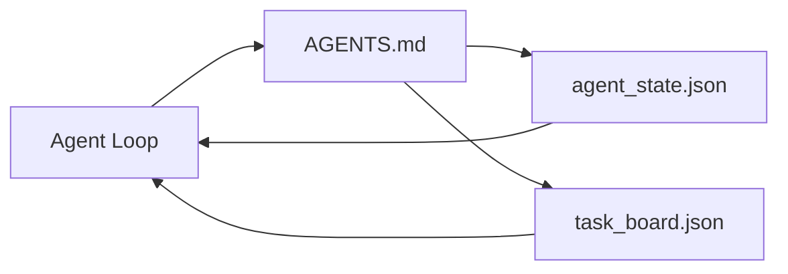

# सबसे छोटा एजेंट कार्यक्षेत्र

> सबसे छोटी उपलब्ध कार्यक्षेत्र  केवल तीन फाइलें हैंः एक रूट निर्देश  एक स्टेट फ़ाइल, तथा एक टास्क बोर्ड  अन्य सभी चीजें उन पर रखी जाती हैं यदि एक रेपो  इन तीनों को नहीं ले सकता है, तो कोई मॉडल नहीं है जो इसे बचा सकता है

**Type:** Build
**Languages:** Python (stdlib)
**Prerequisites:** Phase 14 · 31（为什么强大的模型仍然失败）
**Time:** ~45 分钟

## 学习目标
- 定义构构成 न्यूनतम व्यवहार्य कार्यक्षेत्र के तीन दस्तावेज──
-  समझाएँ क्यों एक छोटा रूट राउटर एक लंबा एकल से अधिक है `AGENTS.md`
- एक एजेंट का निर्माण प्रत्येक दौर में पढ़ सकते हैं और समाप्त होने पर राज्य फ़ाइल में लिख सकते हैं
- 建立一个不依赖聊天历史、也能支多会话 工作的任务板──

## 问题
अधिकांश टीमों एक 3000 लाइन के माध्यम से लिखने के लिए पारित होगा `AGENTS.md`कामकाजी डेस्क बनाने के लिए, फिर इसे पूरा करने के लिए लगता है। मॉडल इसे लोड करेगा, उन अमूर्त भागों को अनदेखा करेगा, फिर उसी सतह पर रहेगा जो लगातार विफल रहा है।

आपको विपरीत की जरूरत है। एक बहुत ही छोटा जड़ फ़ाइल, केवल संबंधित समय एजेंट को 路由到更深层次文件 में रखो। स्थायी स्थिति, एजेंट को कार्रवाई से पहले पढ़ने, कार्रवाई के बाद लिखने की अनुमति दें। एक कार्य बोर्ड, जो बताता है कि वर्तमान में क्या कर रहा है, क्या अवरुद्ध है, अगला कदम क्या है।

तीन दस्तावेज। प्रत्येक दस्तावेज में एक कर्तव्य है। प्रत्येक दस्तावेज पर्याप्त रूप से मशीन-पठनीय है, जिसके बाद यह वास्तविक प्रणाली में विकसित हो सकता है।

## 概念


### एजेंट.एमडी है राउटर, नहीं मैनुअल

अच्छा है`AGENTS.md`很短──它把代理指向:

- राज्य फ़ाइल (((你在哪里)
- कार्य बोर्ड (अभी कुछ बाकी है)
- 更深层的规则(在 `docs/agent-rules.md`नीचे)
- सत्यापन कमांड (How do you know it can work)

अधिकतर सामग्री को अधिक गहरे स्तर के डॉक्स में रखा जाए, केवल जब आवश्यकता हो लोड करे।

### agent_state.json रेकॉर्ड प्रणाली है

राज्य 携带:active task id、被触及的文件、已做出的假设、ब्लॉकर्स,以及下一步行动── एजेंट प्रत्येक轮都会读取它── अगला सत्र 读取它,而不是重放聊天──

राज्य 存在文件里,因为聊天历史不可靠. सत्र会结束. वार्तालाप会被剪裁.

### task_board.json है कतार

कार्य बोर्ड                                                                                                                                                                                                                                                                                                                                                                                                                                                                                                                            `todo | in_progress | done | blocked` जब आप एजेंट को सही रास्ते पर ले जाते हैं, तो यह आपके लिए भी एक बड़ी लाइन है

बोर्ड ऊपर का कार्य है आईडी, लक्ष्य, मालिक`builder``reviewer`या `human`) तथा स्वीकृति मानदंडों― बोर्ड में कोई समस्या नहीं है।

### तीन फाइलें नीचे की रेखा हैं, ऊपर की सीमा नहीं

后续课程将添加范围合同,反运行者,验证门, समीक्षक चेकलिस्ट和交付包―― इनमें से तीन दस्तावेज हैं, जिनकी आधारभूत धारणा है――


```figure
wb-three-files
```

##  इसे निर्माण
`code/main.py`会把最小工作台 写入一个空置,并演示单轮代理转,它会:

1. 读取 `agent_state.json`
2. यदि स्थिति के लिए रिक्त है, तो से `task_board.json`拉取下一个任务.
3. एक ही फ़ाइलों को स्पर्श करने के दायरे में।
4. 写回更新后的状态──

运行它:

```
python3 code/main.py
```

脚本会在自身旁边创建 `workdir/`, इन तीनों फाइलों को रखकर एक दौर चलाएँ, फिर एक बार फिर प्रिंट करें, फिर इसे फिर से चलाएँ, देखें कि दूसरा दौर पहले दौर से कैसे रुकता है।

## इसका उपयोग करें
उत्पादन श्रेणी के एजेंट उत्पादों में, समान तीन दस्तावेज अलग-अलग नामों से दिखाई देंगेः

- **Claude Code:**उपयोग `AGENTS.md`या `CLAUDE.md`作为路由器,用 `.claude/state.json`风格的店 作为州,用子 作为板──
- **Codex / Cursor:**कार्यक्षेत्र नियम 作为路由器, सत्र स्मृति 作为状态,聊天侧边框 中的排队任务 作为板──
- **Custom Python agent:**यही तुम बस लिख रहे हैं इन दस्तावेजों.

名称会变──形状不会──

## वास्तविक परिदृश्य में उत्पादन मोड

जब तीन प्रकार के पैटर्न पर पर पर पर पर पर पर पर पर पर पर पर पर पर पर पर पर पर पर पर पर पर पर पर पर पर पर पर पर पर पर पर पर पर पर पर पर पर पर पर पर पर पर पर पर पर पर पर पर पर पर पर पर पर पर पर पर पर पर पर पर पर पर पर पर पर पर पर पर पर पर पर पर पर पर पर पर पर पर पर पर पर पर पर पर पर पर पर पर पर पर पर पर पर पर पर पर पर पर पर पर पर पर पर पर पर पर पर पर पर पर पर पर पर पर पर पर पर पर पर पर पर पर पर पर पर पर पर पर पर पर पर पर पर पर पर पर पर पर पर परपरपरपरपरपरपरपरपरपरपरपरपरपरपरपरपरपरपरपरपरपरपरपरपरपरपरपरपरपरपरपरपर

**带 nearest-wins precedence 的嵌套 `AGENTS.md`。**ओपनएआई ने अपने मुख्य रेपो में 88 प्रकाशित किए हैं।`AGENTS.md`文件, प्रत्येक उपखंड एक एक एक ∙ कोड, पाठ्यक्रम, क्लाउड कोड और कॉपिलॉट ∙ सभी वर्तमान कार्य फ़ाइलों से एक मार्ग से रेपो रूट 遍历 तक जाते हैं, और प्रत्येक मार्ग से जुड़े होते हैं `AGENTS.md`◊ उप निर्देशिका 文件扩展 रूट फ़ाइल──कोडेक्स 添加了 `AGENTS.override.md`, को बदलने के लिए नहीं विस्तार के लिए; ओवरराइड तंत्र कोडेक्स-विशिष्ट है, क्रॉस-टूल बनाने 工作时应避免使用──Augment Code के माप परिणाम ही महत्वपूर्ण हैंः सर्वोत्तम `AGENTS.md`文件带来的质量提升, हैकू से 升级到Opus के बराबर; सबसे खराब फ़ाइलें पूर्ण रूप से बिना फ़ाइल से अधिक खराब आउटपुट देती हैं।

**即使看起来像 coverage，也要拒绝的 anti-patterns。**相互冲突的指示 会把代理从互动模式 降至贪模式(ICLR 2026 AMBIG-SWE:48.8% → 28% संकल्प दर);应给优先事项 编号,而不是把它们平铺堆叠──不可验证的风格规则(遵循Google Python Style Guide) यदि कोई प्रवर्तन आदेश नहीं है, तो就会让代理自行想象遵守; प्रत्येक条风格规则都应配上精确的 lint命令──以风格开头而不是以命令开头,会埋没验证路径;命令在前风格,在后风格在后――以人类而不是代理写内容浪费背景预算;简洁会是一种特性──

**Cross-tool symlinks。**एक एकल रूट फ़ाइल  संयोजन symlinks(`ln -s AGENTS.md CLAUDE.md``ln -s AGENTS.md .github/copilot-instructions.md``ln -s AGENTS.md .cursorrules`), प्रत्येक कोडिंग एजेंट को सत्य के एक ही स्रोत का उपयोग करने दे सकता है।`nx ai-setup`एक एकल कॉन्फ़िग के आधार पर, क्लाउड कोड, पाठ्यक्रम, सहपालक, मिथुन, कोड और ओपनकोड के बीच स्वचालित रूप से इस काम को पूरा करेगा।

## 交付 यह
`outputs/skill-minimal-workbench.md`किसी भी नए रेपो के लिए एक परियोजना के अनुसार एक कार्यशाला`AGENTS.md`राउटर ∙ एक सही कुंजी शामिल `agent_state.json`, और एक के साथ-साथ एक के साथ वर्तमान बैकलॉग प्रारंभिककरण`task_board.json`

## अभ्यास
1.  दे `agent_state.json`添加一个 `last_run`समयशीर्षक── यदि फाइल 24 घंटे से पहले हो, तो अपर्रेटर द्वारा पुष्टि किए जाने के पश्चात्, अन्यथा, उसे संचालित करने से इनकार कर दिया जाए──
2. 给任务板 添加一个 `priority`क्षेत्र,并修改拉拉,使其总是选择优先级最高的`todo`
3. `task_board.json`迁移到JSON Lines,让每个任务占一行,并让变异在版本控制中保持清晰──
4. 编写一个 `lint_workbench.py`, जब `AGENTS.md`80 से अधिक पंक्तियाँ, या अनुपस्थित दस्तावेजों का हवाला देते हुए विफल हो गये।
5.  इन तीनों में से कौन सा सबसे बड़ा नुकसान हुआ है                                                                                                                                                                                                                                                        

## 关键术语
| Term | What people say | What it actually means |
|------|----------------|------------------------|
| Router | `AGENTS.md` | 指向更深层 docs 和 files 的简短 root file |
| State file | "The notes" | 记录 agent 所在位置的 machine-readable 记录，每一轮都会写入 |
| Task board | "The backlog" | 带有 status、owner、acceptance 的工作 JSON queue |
| System of record | "Source of truth" | 当 chat 消失时，workbench 视为权威的文件 |

## 延伸阅读
- [agents.md — the open spec](https://agents.md/) 被 cursor、Codex、Claude Code、Copilot、Gemini、OpenCode  अपनाना
- [Augment Code, A good AGENTS.md is a model upgrade. A bad one is worse than no docs at all](https://www.augmentcode.com/blog/how-to-write-good-agents-dot-md-files) 测得的质量提升
- [Blake Crosley, AGENTS.md Patterns: What Actually Changes Agent Behavior](https://blakecrosley.com/blog/agents-md-patterns)                                                                                                                                                                                                                                                              
- [Datadog Frontend, Steering AI Agents in Monorepos with AGENTS.md](https://dev.to/datadog-frontend-dev/steering-ai-agents-in-monorepos-with-agentsmd-13g0) घोंसले हुई प्राथमिकता का अभ्यास
- [Nx Blog, Teach Your AI Agent How to Work in a Monorepo](https://nx.dev/blog/nx-ai-agent-skills) 跨六种工具的单源生成
- [The Prompt Shelf, AGENTS.md Best Practices: Structure, Scope, and Real Examples](https://thepromptshelf.dev/blog/agents-md-best-practices/) 能经受审 के अनुभाग आदेश
- [Anthropic, Claude Code subagents and session store](https://docs.anthropic.com/en/docs/agents-and-tools/claude-code/sub-agents)
- चरण 14 · 31  न्यूनतम अवशोषण विफलता मोड
- चरण 14 · 34  本课预览 के स्थायी राज्य योजना
