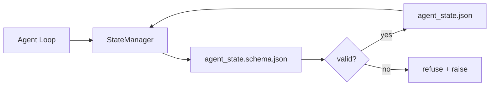

# रिपो मेमोरी व टिकाऊ स्थिति

> चैट इतिहास है आसान है। रिपो है स्थायी है। कार्यक्षेत्र एजेंट को एक साथ संस्करण फ़ाइल में संग्रहीत करेगा। इस तरह अगला सत्र, अगला एजेंट, अगला समीक्षक सभी एक ही स्रोत से सत्य प्राप्त कर सकते हैं।

**Type:** Build
**Languages:** Python (stdlib + `jsonschema` optional)
**Prerequisites:** Phase 14 · 32 (Minimal Workbench)
**Time:** ~60 minutes

## 学习目标
- 定义什么属于 repo memory,什么属于聊天历史──
- `agent_state.json`和 `task_board.json`编写 JSON Schemas──
- परमाणुकरण के लिए एक राज्य प्रबंधक का निर्माण करना, लोड, सत्यापन, परिवर्तन और स्थायीकरण राज्य के लिए उपयोग किया जाता है।
- उपयोग योजनाओं में खराब लेखन में तोड़ कार्यक्षेत्र  पहले उन्हें अस्वीकार करना

## 问题
एजेंट  एक सत्र पूरा किया  चैट 关闭了── अगला सत्र 打开并询问从哪里开始──模型说让我检查文件,读取过时的笔记,然后重复已经完成的工作──更糟糕的是, यह एक पूर्ण फ़ाइल को फिर से लिख देगा, क्योंकि कोई भी इसे नहीं बताता कि यह फ़ाइल समाप्त हो चुकी है──

कार्यक्षेत्र का सुधार विधिः रिपो मेमोरीःstate 存在 repo 中的 JSON 文件里, अनुसार योजना 写入,以原子方式持久化,并且在代码审查中对差友好──Chat 是临时;repo 是记录系统──

## 概念


### 什么属于 repo मेमोरी

| 属于 | 不属于 |
|---------|-----------------|
| Active task id | 原始 chat transcripts |
| 本 session 触碰过的文件 | Token-level reasoning traces |
| agent 做出的假设 | "The user seemed frustrated" |
| 未解决的 blockers | Sampled completions |
| 下一步 action | Vendor-specific model ids |

判断标准是持久性: तीन महीने बाद CI में पुनः运行, यह भी उपयोगी है? यदि है, तो इसे रिपो में डाल दें।

### योजना-पहली स्थिति

JSON Schema is a covenant. इसके बिना, प्रत्येक एजेंट नए खण्ड विकसित करेगा, प्रत्येक समीक्षक को एक नया रूप सीखना होगा, प्रत्येक सीआई स्क्रिप्ट को पिछले संस्करण के लिए एक विशेष मामला बनाना होगा। इसके बाद, खराब लेखन को अस्वीकार कर दिया जाएगा।

योजना 覆盖:

- ज़रूरी कुंजी
- अनुमति`status`मूल्यों
- 禁止的值(उदाहरण के लिए सरणी के `null`)。
- पैटर्न प्रतिबंधों(कार्य आईडी 匹配 `T-\d{3,}`)。
- प्रवासन के संस्करण फ़ील्ड में उपयोग किया गया है

### परमाणु लिखता है

राज्य 写入需要能承受部分失败:写入tempfile,fsync, फिर नाम बदलें 覆盖 लक्ष्य──राज्य फ़ाइल सत्य का स्रोत है; लिखने के लिए आधा राज्य फ़ाइल 比没有文件更糟──

### प्रवास

जब योजना  परिवर्तन  में, में योजना bump 旁边交付一个迁移脚本──状态文件 带有 `schema_version`फ़ील्ड;प्रबंधक इसे स्थानांतरित करने में असमर्थ संस्करण फ़ाइलों को लोड करने से इनकार करेगा।


```figure
wb-state-persist
```

##  इसे निर्माण
`code/main.py`实现:

- `agent_state.schema.json`和 `task_board.schema.json`
- एक केवल प्रयोग stdlib के सत्यापनकर्ता(JSON Schema 子集:required、type、enum、pattern、items)
- 带有原子-temp-and-rename 写入的 `StateManager.load``StateManager.update``StateManager.commit`
- एक डेमो:变更状态、持久化、重新加载,并证明回路――

运行它:

```
python3 code/main.py
```

लिपि 会写入 `workdir/agent_state.json`和 `workdir/task_board.json`, दो मोड़ों के पार 变更它们, और प्रत्येक चरण में मुद्रित किया गया है सत्यापन की स्थिति

## वास्तविक परिदृश्य में उत्पादन मोड

चार प्रकार के मॉडल इस कक्षा के न्यूनतम को बहु-एजेंट मोनोरेपो में बदल सकते हैं।

**Atomic temp-and-rename 不是可选项。**2026 के मार्च में एक Hive परियोजना बग रिपोर्ट स्पष्ट रूप से इस विफलता मोड को रिकॉर्ड कियाः`state.json`   के माध्यम से `write_text()`写入,并且例外被捕后静默忽略──部分写入让会议在没有信号的情况下基于损坏状态恢复──修复永远是:在与目标相似的目录中使用`tempfile.mkstemp`, लिखना,`fsync`,`os.replace`(पॉसिक्स और विंडोज ऊपर सभी परमाणु नामकरण)`atomic_write`बस यही किया गया है.

**每个非幂等 tool call 都要有 idempotency keys。**यदि एजेंट 调用工具 之后、检查点 结果 之前崩,恢复过程会重试该工具调用――对读安全;对电子邮件、DB插件、文件上传 危险――模式是:在执行前将每个工具调用 ID 记录到`pending_calls.jsonl`◊重试时检查该 ID; यदि मौजूद हो, तो कूद over调用并使用缓存结果──Anthropic 和 LangChain ने 2026 के दिशानिर्देशों में इस बिंदु पर ध्यान दिया है; LangGraph का चेक पॉइंटर इसी कारण से लंबित लेखनों को स्थायी रूप से जारी रखता है──

**将大型 artifacts 与 state 分离。**CSVs, लंबे प्रतिलेखन या उत्पन्न फ़ाइलों को न रखें  भंडारण `agent_state.json`◊将文物 保存为单独文件(或上传到物体存储),state 中只保留路径──检查点 保持小而快;文物 独立增长──

**Event sourcing 用于 audit，snapshots 用于 resume。**प्रत्येक उत्परिवर्तन घटना लॉग में जोड़ा गया है`state.events.jsonl`); नियमित रूप से स्नैपशॉट तक `state.json`✿ रिज्यूम 读取 स्नैपशॉट, फिर रिप्ले स्नैपशॉट समय टिकट ✿ सभी घटनाओं के बाद ✿ यह अधिक डिस्क खपत करेगा, लेकिन आपको एक-एक शब्द में रिप्ले एजेंट निर्णय लेने की अनुमति देता है, यह लंबे समय तक चलने वाले रन को调试 करने के लिए है 至关重要── पोस्टग्रेस 内部 में उपयोग किया जाता है WAL के भी एक ही आकार में है。

**Schema migrations，否则拒绝加载。** `schema_version`integer is契约──जब प्रबंधक अनजान संस्करण फ़ाइलों को लोड करता है, तो यह पढ़ना अस्वीकार कर देता है──`tools/migrate_state.py`                                                                                                                                                                                                                                                              

## इसका उपयोग करें
उत्पादन में:

- **LangGraph checkpointers。**एक ही विचार, अलग भंडारण। चेकपॉइंटर ग्राफ स्टेट को SQLite में स्थायित्वित करेगा। पोस्टग्रेस या कस्टम बैकेंड में।
- **Letta memory blocks。**带结构化方案的持续块――14 चरण  08) 
- **OpenAI Agents SDK session store。**प्लग करने योग्य बैकेंड, योजना-जाहिर──本课中的状态文件就是本课中的状态文件──

## 交付 यह
`outputs/skill-state-schema.md`会生成一对项目特定 JSON Schema(state + board) 、一个连接到原子写的Python `StateManager`, और एक प्रवास मंच, सुनिश्चित करें कि अगली बार योजना bump काम के बेंच को नुकसान नहीं होगा.

## अभ्यास
1. 添加一个 `last_human_touch`समय मुहर── मानव संपादन अस्वीकार 后五秒内任何代理写──
2. 扩展 सत्यापितकर्ता 以支持 `oneOf`, इस प्रकार का कार्य निर्माण कार्य हो सकता है, या समीक्षा कार्य हो सकता है, और दोनों में अलग-अलग आवश्यक क्षेत्र हैं।
3. 添加 `schema_version`क्षेत्र,并编写 v1 से v2 के प्रवासन`blockers`重命名为 `risks`)。
4. स्थानीय फ़ाइल से SQLite में स्थानांतरित करेगा बैकेंड`StateManager`एपीआई 
5.  दो एजेंटों को 50 एमएस में एक ही राज्य फ़ाइल में लिखने के लिए एक ही समय में दौड़ें 

## 关键术语
| Term | What people say | What it actually means |
|------|----------------|------------------------|
| Repo memory | "Notes file" | 按 schema 存储在 repo 的 tracked files 中的 state |
| Schema-first | "Validate inputs" | 先定义契约再写 writer，拒绝漂移 |
| Atomic write | "Just rename" | 写入 temp，fsync，rename，因此 partial failures 无法破坏 |
| Migration | "Schema bump" | 将 vN state 转换为 v(N+1) state 的 script |
| System of record | "Source of truth" | workbench 视为权威的 artifact |

## 延伸阅读
- [JSON Schema specification](https://json-schema.org/specification.html)
- [LangGraph checkpointers](https://langchain-ai.github.io/langgraph/concepts/persistence/)
- [Letta memory blocks](https://docs.letta.com/concepts/memory)
- [Fast.io, AI Agent State Checkpointing: A Practical Guide](https://fast.io/resources/ai-agent-state-checkpointing/) योजना-पहली जांच बिंदु
- [Fast.io, AI Agent Workflow State Persistence: Best Practices 2026](https://fast.io/resources/ai-agent-workflow-state-persistence/) समवर्ती नियंत्रण TTL घटना स्रोतः
- [Hive Issue #6263 — non-atomic state.json writes silently ignored](https://github.com/aden-hive/hive/issues/6263) वास्तविक परियोजना मध्य का विफलता मोड
- [eunomia, Checkpoint/Restore Systems: Evolution, Techniques, Applications](https://eunomia.dev/blog/2025/05/11/checkpointrestore-systems-evolution-techniques-and-applications-in-ai-agents/) ओएस 史、 अभ्यावेदन एजेंटों के सीआर आदिम
- [Indium, 7 State Persistence Strategies for Long-Running AI Agents in 2026](https://www.indium.tech/blog/7-state-persistence-strategies-ai-agents-2026/)
- [Microsoft Agent Framework, Compaction](https://learn.microsoft.com/en-us/agent-framework/agents/conversations/compaction) विक्रेता चेकपोस्ट प्रबंधक
- चरण 14 · 08  मेमोरी ब्लॉक और नींद समय की गणना
- चरण 14 · 32  本课为其方案化三档最低
- चरण 14 · 40  से एक ही योजना 读取的 हस्तान्तरण पैकेट
