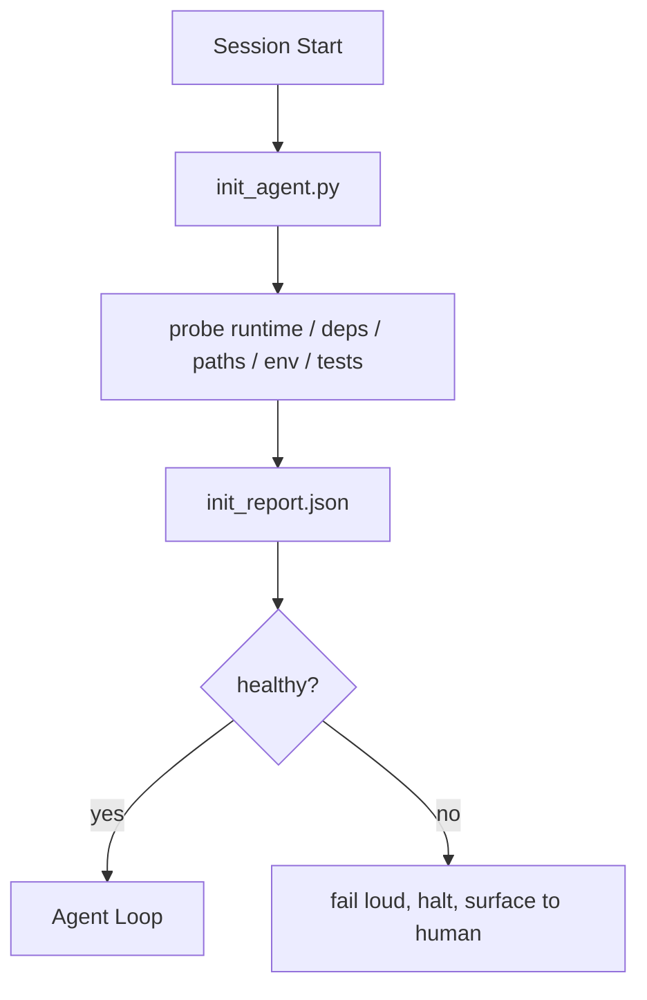

# एजेंट की प्रारंभिक स्क्रिप्ट

> हर शीत प्रारंभ सत्र के लिए एक कीमत चुकानी होगी। एजेंट एक ही फाइल पढ़ता है, एक ही खोज का पुनः प्रयास करता है, और एक ही मार्ग को फिर से खोजता है।

**Type:** Build
**Languages:** Python (stdlib)
**先修要求：**चरण 14 · 32 (न्यूनतम कार्यक्षेत्र), चरण 14 · 34 (रिपो मेमोरी)
**Time:** ~45 分钟

## 学习目标
-  पहचान एजेंट को प्रत्येक सत्र में काम दोहराकर पूरा नहीं करना चाहिए।
- निर्माण एक निश्चित init स्क्रिप्ट, रनटाइम, निर्भरता और रेपो स्वास्थ्य को खोजने के लिए उपयोग किया जाता है
- 持久化查查结果, एजेंट 读取它, बजाय पुनः运行检查
- जब प्रारंभिक विफलता होती है, तो यह एक ही स्थान प्रदान करता है।

## 问题
打开一个会议──Agent 猜测 Python version──猜测 test command──为了找到入口点,列出 repo root 五次──尝试进口一个未安装的包──询问用户配置文件 在哪里──等到它真正开始编辑时,已经有十万代币花在本本应由一个脚本完成的设置工作 上──

修复方式是使用一个初始化脚本: यह एजेंट कुछ भी करने से पहले चलती है,并写入一个供代理 启动时读取的`init_report.json`

## 概念


### init स्क्रिप्ट 探查什么

| Probe | 为什么重要 |
|-------|------------|
| Runtime versions | 错误的 Python 或 Node version 意味着悄无声息的错误版本 bug |
| Dependency availability | 缺失的 package 如果到后面才发现，成本会是现在捕获它的十倍 |
| Test command | Agent 必须知道如何 verify；如果 command 缺失，workbench 就坏了 |
| Repo paths | Hard-coded paths 会漂移；一次性解析并固定下来 |
| Environment variables | 缺失 `OPENAI_API_KEY` 是一个 failure surface，而不是 runtime mystery |
| State + board freshness | 崩溃 session 留下的陈旧 state 是一个 footgun |
| Last-known-good commit | 作为 session 结束时 handoff diff 的锚点 |

### 快速显然失败,并集中在一个失败

जांच  असफलता का अर्थ है मनुष्य को प्रस्तुत करना बंद करना  मत कहो  एजेंट खुद को स्पष्ट करना                                                                                                                                                                                                                                                   

### अशक्त

连续运行两次──第二次除了刷新时间之外应该是没有开放――自由权 让你可以把脚本连接到CI、hooks或预任务剪切命令──

### आरंभिक बनाम स्टार्टअप नियम

नियम (चरण 14 · 33)  described行动前必须满足什么――Init is to establish these rules ⇒ जांच योग्य स्क्रिप्ट―― बिना नियम के 要小心── बिना नियम के ⇒ ⇒ ⇒ ⇒ ⇒ ⇒ ⇒ ⇒ ⇒ ⇒ ⇒ ⇒ ⇒ ⇒ ⇒ ⇒ ⇒ ⇒ ⇒ ⇒ ⇒ ⇒ ⇒ ⇒ ⇒ ⇒ ⇒ ⇒ ⇒ ⇒ ⇒ ⇒ ⇒ ⇒ ⇒ ⇒ ⇒ ⇒ ⇒ ⇒ ⇒ ⇒ ⇒ ⇒ ⇒ ⇒ ⇒ ⇒ ⇒ ⇒ ⇒ ⇒ ⇒ ⇒ ⇒ ⇒ ⇒ ⇒ ⇒ ⇒ ⇒ ⇒ ⇒ ⇒ ⇒ ⇒ ⇒ ⇒ ⇒ ⇒ ⇒ ⇒ ⇒ ⇒ ⇒ ⇒ ⇒ ⇒ ⇒ ⇒ ⇒ ⇒ ⇒ ⇒ ⇒ ⇒ ⇒ ⇒ ⇒ ⇒ ⇒ ⇒ ⇒ ⇒ ⇒ ⇒ ⇒ ⇒ ⇒ ⇒ ⇒ ⇒ ⇒ ⇒ ⇒ ⇒ ⇒ ⇒ ⇒ ⇒ ⇒ ⇒ ⇒ ⇒ ⇒ ⇒ ⇒ ⇒ ⇒ ⇒ ⇒ ⇒ ⇒ ⇒ ⇒ ⇒ ⇒ ⇒ ⇒ ⇒ ⇒ ⇒ ⇒ ⇒ ⇒ ⇒ ⇒ ⇒ ⇒ ⇒ ⇒ ⇒ ⇒ ⇒ ⇒ ⇒ ⇒ ⇒ ⇒ ⇒ ⇒ ⇒ ⇒ ⇒ ⇒ ⇒ ⇒ ⇒ ⇒ ⇒ ⇒ ⇒ ⇒ ⇒ ⇒ ⇒ ⇒ ⇒ ⇒ ⇒ ⇒ ⇒ ⇒ ⇒ ⇒ ⇒ ⇒ ⇒ ⇒ ⇒ ⇒  ⇒                                                                                                       


```figure
wb-init-probes
```

##  इसे निर्माण
`code/main.py`                                                                                                                                                                                                                                                                                                                                                                                                                                                                                                                             `init_agent.py`:

- 五个探测器:पायथन संस्करण 通过`importlib.util.find_spec`列出的 निर्भरताएँ, परीक्षण कमांड resolvability, आवश्यक वातावरण, राज्य फ़ाइल ताज़ापन
- प्रत्येक जांच वापस आ जाएगी`(name, status, detail)`
- 脚本写入包含完整探测组 的 `init_report.json`, और किसी भी ब्लॉक-कठोरता जांच में विफलता के समय अपूर्ण स्थिति में वापस आ गया।

运行它:

```
python3 code/main.py
```

脚本会打印探测表,写入 `init_report.json`, भाग्यशाली पथ पर ऊपर शून्य स्थिति में वापस, या असफलता पर शून्य स्थिति में वापस और विफल जांचों की सूची में शामिल किया गया है।

## वास्तविक परिदृश्य में उत्पादन मोड

तीन प्रकार के प्रारूप उपयोगी इनिट स्क्रिप्ट और अनुष्ठान से भिन्न कर सकते हैं।

**Last-known-good commit anchoring.** वर्तमान प्रतिबद्धता  पिछले सफल विलय `LKG`फ़ाइल  जांच करें। यदि अंतर  बजट से अधिक है, तो प्रारंभ करने से इनकार करें, और नए आधार रेखा की पुष्टि करने के लिए मानव को आवश्यक करें। यह क्लाउडफ्लेयर की एआई कोड समीक्षा है।

**Lock files with TTL.**पहली बार सफल जांच पास के बाद लिखा गया`prereqs.lock`◊后续运行会在 N 小时内信任该锁(默认 24h),并跳过昂贵的探测. init script 会先读取锁; यदि यह ताजा है, और निर्भरता प्रकट हैश 匹配,就短路.

**No network, no LLM, no surprises in the hot path.**इनिट जांचें निश्चितता की पाइपलाइन हैं। LLM का उपयोग विफलता को वर्गीकृत करने, या बाहरी सेवा का दौरा करने के लिए करें। जांच लाइसेंस का जांच नॉन-सॉन्ड है; यह वर्कफ़्लो है। यदि कोई जांच ड्राई रन में तीन सेकंड से अधिक समय तक होती है, तो इसे वर्कबेंच की गंध के रूप में माना जाता है, और इसे init से बाहर ले जाया जाता है या इसके परिणामों को कैश करता है।

## इसका उपयोग करें
उत्पादन में:

- **Claude Code hooks.** `pre-task`हुक 调用 init स्क्रिप्ट, और असफल होने पर इनकार करने के लिए प्रारंभ एजेंट
- **GitHub Actions.** `setup-agent`काम 运行 init स्क्रिप्ट; एजेंट काम इस पर निर्भर करता है
- **Docker entrypoint.**एजेंट कंटेनर में exec एजेंट रनटाइम 之前运行 init स्क्रिप्ट;失败时呈现日志──

init script is portable, क्योंकि यह किसी विशेष framework को नहीं जोड़ता है।

## 交付 यह
`outputs/skill-init-script.md`बैठक साक्षात्कार परियोजना, इसकी स्थापना कार्य, जांच के लिए वर्गीकृत,并产出项目特定 `init_agent.py`, और किसी भी एजेंट कदम  से पहले इसके आईसी कार्यप्रवाह को चलाने के लिए.

## अभ्यास
1. 添加一个探测器,用于不同当前提交和最后知名好的提交; यदि变更超过50文件,就拒绝启动──
2. एक स्क्रिप्ट संलग्न, इसे लिखने के लिए `prereqs.lock`फ़ाइल, और लॉक 超七天时拒绝启动──
3. 添加一个 `--fix`ध्वज, स्वचालित रूप से स्थापित, लेकिन अप्रत्याशित रूप से रनटाइम निर्भरता में संशोधन नहीं किया गया है।
4. इस व्यापार-बदला के लिए हार्ड-कोड फ़ंक्शन से जांच को यैमल रजिस्ट्री में स्थानांतरित करेगा
5. प्रत्येक जांच के लिए समयबद्ध बजट जोड़ें।

## 关键术语
| Term | 人们会怎么说 | 它实际意味着什么 |
|------|--------------|------------------|
| Probe | “一个 check” | 返回 `(name, status, detail)` 的确定性函数 |
| Init report | “Setup output” | 与 state 放在一起、写有 probe results 的 JSON |
| Idempotent | “可以安全重新运行” | 连续两次运行会生成除 timestamp 外完全相同的 reports |
| Fail loud | “不要吞掉” | 停止并呈现给 human；没有 silent fallback |
| Setup tax | “Bootstrap cost” | Agent 每个 session 为重新发现显而易见信息所花费的 Token |

## 延伸阅读
- [Anthropic, Effective harnesses for long-running agents](https://www.anthropic.com/engineering/effective-harnesses-for-long-running-agents)
- [GitHub Actions, composite actions for setup](https://docs.github.com/en/actions/sharing-automations/creating-actions/creating-a-composite-action)
- [microservices.io, GenAI 开发平台：guardrails](https://microservices.io/post/architecture/2026/03/09/genai-development-platform-part-1-development-guardrails.html) पूर्व-प्रतिबंध + आईसी 检查作为 init
- [Augment Code, How to Build Your AGENTS.md (2026)](https://www.augmentcode.com/guides/how-to-build-agents-md) प्रारंभिक अपेक्षाएं
- [Codex Blog, Codex CLI Context Compaction](https://codex.danielvaughan.com/2026/03/31/codex-cli-context-compaction-architecture/) सत्र संपीड़न-जागरूक init के रूप में शुरू
- चरण 14 · 33  इस स्क्रिप्ट के प्रक्षेपण के नियम सेट
- चरण 14 · 34  इस लेख का राज्य फ़ाइल
- चरण 14 · 38  init स्क्रिप्ट  आपूर्ति के सत्यापन गेट
- चरण 14 · 40  消费 init रिपोर्ट के अंतिम ज्ञात-अच्छे के हस्तांतरण
