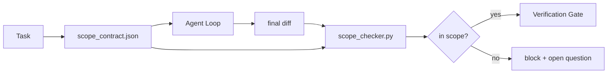

# कार्यक्षेत्र अनुबंध और कार्य सीमा

> मॉडल 不知道工作在哪里结束──范围合同 एक प्रति कार्य फ़ाइल है, जो काम को किस स्थान से शुरू करने से, किस स्थान से समाप्त होने से, और एक बार फिर से कैसे रोल-बैक करने के लिए उपयोग की जाती है।

**类型:**निर्माण
**语言:**पायथन (stdlib)
**先修:**चरण 14 · 32 (न्यूनतम कार्यक्षेत्र), चरण 14 · 33 (नियमों के रूप में प्रतिबंध)
**时间:**~ 50 मिनट

## 学习目标

-  एक दायरा अनुबंध लिखें, एजेंट को कार्य शुरू होने पर पढ़ने दें, और सत्यापित करने वाले को कार्य समाप्त होने पर पढ़ने दें
- मिटाने योग्य फ़ाइलों, प्रतिबंधित फ़ाइलों, स्वीकृति मानदंडों, रोलबैक योजना और अनुमोदन सीमाओं को निर्दिष्ट करें
-  एक दायरा जांच करने के लिए, अनुबंध के मुकाबले भिन्न होगा और उल्लंघन को चिह्नित करेगा
- 让范围爬可见、自动化且可审查──

## 问题

एजेंट 会 creep──任务是修复登录错误──diff 触碰了登录路线、电子邮件助手、数据库驱动程序、README 和发布脚本──每次触碰时都有一个看似合理的理由──一起,它们已经变成了与原始评论内容不同的变化──

स्कोप क्रैप एजेंट 工作 में सबसे कम निगरानी वाला विफलता मोड है, क्योंकि एजेंट 会真诚地叙述 प्रत्येक कदम── सुधार विधि अधिक कठोर त्वरित नहीं है── सुधार विधि एक डिस्क पर एक अनुबंध डालती है, बताती है कि वादा क्या किया गया है, और एक चेक के साथ परिणामों को प्रतिबद्धता के मुकाबले करेगा──

## 概念



### अनुबंध के दायरे में क्या शामिल है

| Field | Purpose |
|-------|---------|
| `task_id` | 链接到 board 上的 task |
| `goal` | reviewer 可以验证的一句话 |
| `allowed_files` | agent 可以写入的 globs |
| `forbidden_files` | agent 即使意外也不得触碰的 globs |
| `acceptance_criteria` | 证明完成的 test commands 或 assertion lines |
| `rollback_plan` | 如果需要 halt，operator 可以执行的一段说明 |
| `approvals_required` | scope 外需要明确 human sign-off 的 actions |

 नहीं `forbidden_files`अनुबंध का आधा हिस्सा अपूर्ण है।

### कच्चे पथों के बजाय ग्लोब का उपयोग करें

▽ ▽ ▽ ▽ ▽ ▽ ▽ ▽ ▽ ▽ ▽ ▽ ▽ ▽ ▽ ▽ ▽ ▽ ▽ ▽ ▽ ▽ ▽ ▽ ▽ ▽ ▽ ▽ ▽ ▽ ▽ ▽ ▽ ▽ ▽ ▽ ▽ ▽ ▽ ▽ ▽ ▽ ▽ ▽ ▽ ▽ ▽ ▽ ▽ ▽ ▽ ▽ ▽ ▽ ▽ ▽ ▽ ▽ ▽ ▽ ▽ ▽ ▽ ▽ ▽ ▽ ▽ ▽ ▽ ▽ ▽ ▽ ▽ ▽ ▽ ▽ ▽ ▽ ▽ ▽ ▽ ▽ ▽ ▽ ▽ ▽ ▽ ▽ ▽ ▽ ▽ ▽ ▽ ▽ ▽ ▽ ▽ ▽ ▽ ▽ ▽ ▽ ▽ ▽ ▽ ▽ ▽ ▽ ▽ ▽ ▽ ▽ ▽ ▽ ▽ ▽ ▽ ▽ ▽ ▽ ▽ ▽ ▽ ▽ ▽ ▽ `app/**/*.py`,`tests/test_signup*.py`), इस तरह से सत्र 之间发生 रिफैक्टर 时不会让合同 失效──

### रोलबैक क्षेत्र का हिस्सा है

列出如何推翻会迫使合同作者 思考可能出什么问题──不能推翻的合同是不应批准的合同──

### दायरा जांच है अंतर जांच

एजेंट 写出 diff――checker 读取 diff、 अनुमति दी गई गोलियां、 मनाई गई गोलियां, साथ ही किसी भी पहले से ही चल रही स्वीकृति आदेशों की सूची  प्रत्येक उल्लंघन  एक बटैग का पता लगाने, सत्यापन गेट इसे अस्वीकार कर सकते हैं

### दायरा के दो प्रकार की ऊंचाईः विशेषता सूची तथा कार्य अनुबंध

scope contract बंधित है एक कार्य  यह पूरे प्रोजेक्ट  को नहीं  यह एजेंट को रिपोट लॉगिन के मुद्दे पर पूर्ण रूप से करार में रह सकता है  लेकिन अगले दौर में फिर से निर्णय लेने के लिए प्रोजेक्ट को सेटिंग्स पेज  डार्क मोड स्विच करने की आवश्यकता है  साथ ही राउटर पुनः लिखने  अनुबंध  इस प्रोजेक्ट की सीमा क्या है  यह केवल इस कार्य के दायरे में कौन से फाइलों का जवाब  देता है 

दूसरा स्तर अपने स्वयं के आदिम की आवश्यकता हैः एक सत्र  प्रारंभ करते समय पढ़ने के `feature_list.json`यह परियोजना के बैकलॉग का यंत्र पठनीय 有序文件──agent 精确选择一个 `status``todo`की विशेषता, इसे ले लो `id` write into active scope contract,并被禁止在同一会话中启动第二个功能──一次只做一个功能 不再是提示里代理可以绕过一句话,而一个写在磁盘上的值,也是门可以执行的检查──

```json
{
  "project": "knowledge-base",
  "active": "import-pdf",
  "features": [
    { "id": "import-pdf", "status": "in_progress", "goal": "import a PDF into the library", "done_when": "pytest tests/test_import.py && a sample PDF appears in the library view" },
    { "id": "full-text-search", "status": "todo", "goal": "search document text and rank hits", "done_when": "query returns ranked results with snippets" },
    { "id": "cite-answers", "status": "todo", "goal": "answers carry source citations", "done_when": "every answer renders at least one clickable citation" }
  ]
}
```

| Field | Purpose |
|-------|---------|
| `active` | 当前 session 唯一允许触及的 feature；为空时表示选择一个并设置它 |
| `features[].id` | scope contract 的 `task_id` 指向的稳定 slug |
| `features[].status` | `todo`、`in_progress`、`done`、`blocked`；同一时间最多一个 `in_progress` |
| `features[].goal` | reviewer 能验证的一句话 |
| `features[].done_when` | 将 `in_progress` 翻转为 `done` 的 acceptance line |

两条规则让这个列表成为承重结构,而不是装饰――第一,`at most one in_progress`यह अपरिवर्तित 本身就是 स्टार्टअप चेक(चरण 14 · 33): यदि सूची 里 में दो दिखाई देते हैं, सत्र 里 में शुरू होने से इनकार करेगा, जब तक मानव 解决── दूसरा, सुविधा सूची फाइल है, चैट संदेश नहीं है, क्योंकि चैट 会滚出文脈,而文件会跨 सत्र、跨代理 持久存在──handoff(चरण 14 · 40) सुविधा की स्थिति 写回将完成`done`, तो अगले सत्र में, यह स्पष्ट रूप से बोर्ड है, और न कि फिर से क्या है।

अनुबंध और सूची  न्यूनतम विशेषाधिकार 组合,方式与下文描述的融合 相同:कार्य अनुबंध के `allowed_files`️️️️️️️️️️️️️️️️️️️️️️️️️️️️️️️️️️️️️️️️️️️️️️️️️️️️️️️️️️️️️️️️️️️️️️️️️️️️️️️️️️️️️️️️️️️️️️️️️️️️️️️️️️️️️️️️️️️️️️️️️️️️️️️️️️️️️️️️️️️️️️️️️️️️️️️️️️️️️️️️️️️️️️️️️️️️️️️️️️️️️️️️️️️️️️️️️️️️️️️️️️️️️️️️️️️️️️️️️️️️️️️️️️️️️️️️️️️️️️️️️️️️️️️️️️️️️️️️️️️️️️️️️️️️️️️️️️️️️️️️️️️️️️️️️️️️️️️️️️️️️️️️️️️️️️️️️️️️️️️️️️️️️️️️️️️️️️️️️️️️️️️️️️️️️️️️️️️️️️️️️️️️️️️️️️️️️️️️️️️️️️️️️️️️️️️️️️️️️️️️️️️️️️️️️️️️️️️️️️️️️️️️️️️️️️️️️️️️️️️️️️️️️️️️️️️️️️️️️️️️️️️️️️️️️️️️️️️️️️️️️️️️️️️️️️️️️️️️️️️️️️️️️️️️


```figure
wb-scope-bounce
```

##  इसे निर्माण

`code/main.py`实现:

- `scope_contract.json`schema(JSON Schema के子集, ग्लोब सरणी)。
- एक अंतर पार्सर, 列表和运行命令 列表转换为 列表转换为 列表转换为 列表转换为 列表转换为 列表转换为 列表转换为 列表转换为 列表转换为 列表转换为 列表转换为 列表转换为 列表转换为 列表转换为 列表转换为 列表转换为 列表转换为`RunSummary`
- एक `scope_check`, अनुबंध के अनुसार  वापसी `(violations, in_scope, off_scope)`
- 两个演示运行: एक स्कोप में रखें, दूसरा क्रॉप हो जाए, चेकर 会用精确文件和原因标记 क्रॉप

运行:

```
python3 code/main.py
```

输出: ठेका 两次 两次 两次 两次 两次 两次 两次 两次 两次 两次 两次 两次 两次 两次 两次 两次 两次 两次 两次 两次 两次 两次 两次 两次 两次 两次 两次 两次 两次 两次 两次 两次 两次 两次 两次 两次 两次 两次 两次 两次 两次 两次 两次 两次 两次 两次 两次 两次 两次 两次 两次 两次 两次 两次 两次 两次 两次 两次 两次 两次 两次 两次 两次 两次 两次 两次 两次 两次 两次 两次 两次`scope_report.json`

## वास्तविक उत्पादन में पैटर्न

एक अभ्यास specsmaxxing(在调用代理前使用YAML scope contracts) के चिकित्सक 报告说, 换代理的情况下, 

**Violation budgets，而不是 binary failures。** `agent-guardrails`(क्लाउड कोड, पाठ्यक्रम, विंडसर्फ, कोड के माध्यम से MCP उपयोग के ओएसएस विलय गेट) प्रत्येक कार्य के लिए  प्रदान `violationBudget`बजट में हल्के स्लैप चेतावनी के रूप में प्रकट होंगे; केवल बजट से अधिक होने पर, विलय गेट 才会拒绝──搭配`violationSeverity: "error" | "warning"`उपयोगः बजट यह तय करता है कि गेट को अपनाया जाएगा या उसके टीम द्वारा प्रतिबंधित किया जाएगा।

**按 path family 做 severity asymmetry。**`docs/**`के बाहर दायरे लिखता है आमतौर पर है `warn`;对 `scripts/**``migrations/**``config/prod/**`总是 `block` इस तरह की असममितता  अनुबंध के बीच में होनी चाहिए, न कि रनटाइम के बीच, क्योंकि यह परियोजना-विशिष्ट है, और प्रत्येक कार्य में परिवर्तन होगा

**Time 和 network budgets 与 file budgets 并列。** `time_budget_minutes`क्षेत्र 约束 दीवार घड़ी; रनटाइम में बिना फिर से अनुमोदन के मामले में इसे आगे बढ़ाने से इनकार किया गया`network_egress`अनुमति देने वाले  रोकथाम एजेंट 访问不属于任务的外部API──这些也是范围 维度; फ़ाइल ग्लोब आवश्यक हैं, लेकिन अपर्याप्त──

**Multi-contract merge semantics（least privilege）。**जब दो दायरा अनुबंधों के साथ-साथ लागू होते हैं, जैसे परियोजना-व्यापी अनुबंध और कार्य-विशिष्ट अनुबंध), विलय नियम हैंः**intersect** `allowed_files`(दो अनुबंधों को इस मार्ग की अनुमति देनी होगी),**union** `forbidden_files`(किसी भी एक को मना कर सकता है),`time_budget_minutes`取最严格值(मिनेट),`approvals_required`累积――`network_egress`मध्य,`None`प्रदर्शन नहीं करना,`[]`सभी का खंडन करना,`[...]`प्रदर्शित अनुमति; विलय 时,`None`让位于另一侧,两个列表取交集,拒绝-all 保持否认-all──把这一点写入合同方案,这样合并就是机械且可审查的──

## इसका उपयोग करें

उत्पादन के पैटर्नः

- **Claude Code slash commands.** `/scope`आदेश 写入合同,并将其固定为会议背景──
- **GitHub PRs.**                                                                                                                                                                                                                                                              
- **LangGraph interrupts.**दायरा उल्लंघन 触发 interrupt;handler 询问人 是需要扩大合同,还是代理 需要后退──

अनुबंध 随任务 流转──当任务 关闭时, अनुबंध 会归档到 `outputs/scope/closed/`

## 交付 यह

`outputs/skill-scope-contract.md`एक कार्य विवरण उत्पन्न करना, एक दायरा अनुबंध, तथा एक क्षमता महसूस करने वाला ग्लोब और प्रत्येक एजेंट के लिए आईसी में अंतर के संचालन की जांच करना।

## अभ्यास

1. 添加一个 `network_egress`क्षेत्र,列出允许的外部主机──拒绝触碰其他主机的运行──
2.  विस्तार जांच, इसे करने के लिए `docs/**`软失败 对`scripts/**`硬失败――说明这种 असममित का कारण――
3. प्रयोग स्थैतिक नियम सेट करना`goal`क्षेत्र 推导 `allowed_files` पहला किनारा मामला 会出什么问题?
4. 添加 `time_budget_minutes`, और दीवार घड़ी 超过 यह के बाद इनकार जारी रखना
5. एक ही अंतर के लिए दो अनुबंधों को संचालित करना. जब दोनों लागू होते हैं, तो सही विलय अर्थशास्त्र क्या है?

## 关键术语

| Term | What people say | What it actually means |
|------|----------------|------------------------|
| Scope contract | “任务 brief” | per-task JSON，列出 allowed/forbidden files、acceptance、rollback |
| Scope creep | “它还 touched 了...” | 同一 task 中发生了 contract 外的文件变更 |
| Rollback plan | “我们可以 revert” | 用于 halt 的一段 operator runbook |
| Approval boundary | “需要 sign-off” | contract 中列出的、需要明确 human approval 的 action |
| Diff check | “Path audit” | 将 touched files 与 contract globs 比较 |

## 延伸阅读

- [LangGraph human-in-the-loop 中断](https://langchain-ai.github.io/langgraph/concepts/human_in_the_loop/)
- [OpenAI Agents SDK tool approval policies](https://platform.openai.com/docs/guides/agents-sdk)
- [logi-cmd/agent-guardrails — merge gates 与 scope validation](https://github.com/logi-cmd/agent-guardrails) उल्लंघन के बजट  गंभीरता स्तर
- [Dev|Journal, Preventing AI Agent Configuration Drift with Agent Contract Testing](https://earezki.com/ai-news/2026-05-05-i-built-a-tiny-ci-tool-to-keep-ai-agent-configs-from-drifting-in-my-repo/) 无 बाहरी डिप ् ् ् ् ् ् ् ् ् ् ् ् ् ् ् ् ् ् ् ् ् ् ् ् ् ् ् ् ् ् ् ् ् ् ् ् ् ् ् ् ् ् ् ् ् ् ् ् ् ् ् ् ् ् ् ् ् ् ् ् ् ् ् ् ् ् ् ् ् ् ् ् ् ् ् ् ् ् ् ् ् ् ् ् ् ् ् ् ् ् ् ् ् ् ् ् ् ् ् ् ् ् ् ् ् ् ् ् ् ् ् ् ् ् ् ् ् ् ् ् ् ् ् ् ् ् ् ् ् ् ् ् ् ् ् ् ् ् ् ् ् ् ् ् ् ् ् ् ् ् ् ् ् ् ् ् ् ् ् ् ् ् ् ् ् ् ् ् ् ् ् ् ् ् ् ् ् ् ् ् ् ् ् ् ् ् ् ् ् ् ् ् ् ् ् ् ् ् ् ् ् ् ् ् ् ् ् ् ् ् ् ् ् ् ् ् ् ् ् ् ् ् ् ् ् ् ् ् ् ् ् ् ् ् ् ् ् ् ् ् ् ् ् ् ् ् ् ् ् ् ् `--strict`मोड
- [Agentic Coding Is Not a Trap (production logs)](https://dev.to/jtorchia/agentic-coding-is-not-a-trap-i-answered-the-viral-hn-post-with-my-own-production-logs-33d9) स्पेक्समैक्सिंग रसीदें:52% → 21%
- [OpenCode permission globs](https://opencode.ai/docs/agents/) 细粒度 प्रति अनुमति दायरा
- [Knostic, AI Coding Agent Security: Threat Models and Protection Strategies](https://www.knostic.ai/blog/ai-coding-agent-security)  作为最小特权 一部分的范围
- [Augment Code, AI Spec Template](https://www.augmentcode.com/guides/ai-spec-template) त्रिस्तरीय सीमा प्रणाली(जरूरी/पूछना/कभी नहीं)
- चरण 14 · 27  配套 के साथ दायरा लॉक 配套 के शीघ्र इंजेक्शन रक्षा
- चरण 14 · 33  यह अनुबंध  प्रत्येक कार्य के लिए  विशेष नियम सेट
- चरण 14 · 38  चेकर 汇报 प्रवेश के सत्यापन गेट
