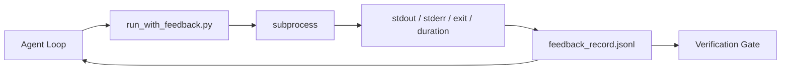

# रनटाइम फीडबैक लूप्स

> देखने के लिए वास्तविक कमांड आउटपुट का एजेंट केवल अनुमान लगा सकता है। फीडबैक रनर                                                                                                                                                                                                                                                    

**Type:** Build
**Languages:** Python (stdlib)
**先修要求：**चरण 14 · 32 (न्यूनतम कार्यक्षेत्र), चरण 14 · 35 (प्रारंभिक स्क्रिप्ट)
**Time:** ~50 minutes

## 学习目标
- 区分 रनटाइम रिफ्लेक्स और अवलोकनशीलता टेलीमेट्री
- एक प्रतिक्रिया रनर का निर्माण करें, इसके साथ पैक करें शेल कमांड और बनाए रखें संरचनात्मक रिकॉर्ड
- बड़े आउटपुट को निश्चित रूप से काटने के लिए, चक्र को टोकन बजट में बनाए रखें।
- जब प्रतिक्रिया 缺失时, चक्र में आगे बढ़ने से इनकार करना

## 问题
एजेंट कहते हैं कि सभी परीक्षण हुए हैं। वास्तविकता यह है कि कोई भी परीक्षण नहीं किया गया है। एजेंट ने कल्पना की कि यह आउटपुट है, या यह कमांड चलाता है, लेकिन कभी परिणाम नहीं पढ़ता है, या यह परिणाम पढ़ता है लेकिन विफलता रेखा को काट देता है।

प्रतिक्रिया धावक इस कमी को दूर करेगा। प्रत्येक कमांड में रनर के माध्यम से कार्यवाही होगी। प्रत्येक रिकॉर्ड में कमांड शामिल है।

## 概念


### प्रतिक्रिया रिकॉर्ड में क्या शामिल है

| Field | 为什么重要 |
|-------|----------------|
| `command` | 精确 argv，避免 shell expansion 意外 |
| `stdout_tail` | 最后 N 行，确定性截断 |
| `stderr_tail` | 最后 N 行，与 stdout 分开 |
| `exit_code` | 明确无歧义的成功信号 |
| `duration_ms` | 暴露缓慢探测和失控进程 |
| `started_at` | 用于 replay 的 timestamp |
| `agent_note` | Agent 写下的一行预期说明 |

### ट्रंकण निश्चित है

50 MB का लॉग                                                                                                                                                                                                                                                             `...truncated N lines...`मार्कर; यह निश्चितता है, इसलिए समान आउटपुट总会产生相同记录──不做样本;Agent 需要看到的部分(最终错误、最终总结) स्थित है पूंछ──

### टेलीमेट्री के मुकाबले प्रतिक्रिया

टेलीमेट्री (Phase 14 · 23,OTel GenAI conventions) मानव ऑपरेटरों के लिए उपयोग किया जाता है 跨时间审查 runs。Feedback इस बार चलाने के अगले दौर में उपयोग किया जाता है。 वे कुछ फ़ील्ड साझा करते हैं, लेकिन विभिन्न फ़ाइलों में स्थित हैं, प्रतिधारण भी अलग है。

###  कोई प्रतिक्रिया नहीं                                                                                                                                                                                                                                                             

यदि धावक पकड़े जाने से पहले बाहर निकल जाता है, रिकॉर्ड में शामिल होगा`exit_code: null`和 `error: <reason>`◊एजेंट लूप  must refuse in `null`上 exit声称成功──没有出口,就没有进步──


```figure
wb-feedback-loop
```

##  इसे निर्माण
`code/main.py`实现:

- `run_with_feedback(command, agent_note)`包装 `subprocess.run`, पकड़ने स्टडऑट/स्टडऑट/गति/अवधि, निश्चितता का अंत,并追加到 `feedback_record.jsonl`
- एक छोटे लोडर, जेएसओएनएल स्ट्रीम करने के लिए पायथन सूची में होगा
- एक डेमो, तीन कमांड का संचालन, सफलता, विफलता, धीमा, प्रत्येक कमांड का अंतिम रिकॉर्ड प्रिंट करें।

运行:

```
python3 code/main.py
```

输出:三条 अभिप्राय रिकॉर्ड 会追加到 `feedback_record.jsonl`,并 इनलाइन 印印每条的最后一条──跨多次重运尾这个文件, आप देख सकते हैं कि चक्र कैसे जमा हो गया──

## वास्तविक उत्पादन में उत्पादन पैटर्न

तीन प्रकार के पैटर्न हैं जो धावक को मजबूत करने में सक्षम हैं।

**写入时 redaction，而不是读取时 redaction。**任何接触 stdout या stderr के रिकॉर्ड 都可能泄露秘密──runner 在 JSONL परिशिष्ट 前提供编辑通行:剥离匹配`^Bearer ``password=``api[_-]?key=``AKIA[0-9A-Z]{16}`(AWS)`xox[baprs]-`(Slack) के पंक्ति── पढ़取时编辑是脚步枪;磁盘上的文件才是攻击者能获取的东西── प्रत्येक季度, उत्पादन रनटाइम के आधार पर, मध्य अवलोकन किए गए गुप्त प्रारूपों में 审核编辑模式──

**Rotation policy，而不是单个文件。**`feedback_record.jsonl` प्रति फ़ाइल 1 MB के लिए सीमा; ओवरआउट समय पर घूमने के लिए `.1``.2`, छोड़ दिया`.5`✿ एजेंट का लूप ✿ पढ़取当前文件, इसलिए रनटाइम लागत 有界──CI आर्टिफैक्ट स्टोरेज ✿ प्राप्त करने के लिए पूर्ण घूर्णन सेट── बिना घूर्णन ✿, प्रत्येक लोडर कॉल ✿ ✿ ✿ ✿ ✿

**用于 retry chains 的 parent-command id。**हर रिकॉर्ड में है`command_id`; रिट्री 携带 `parent_command_id`, एक बार प्रयास करते हुए, समीक्षाकार के असफल प्रयासों की सूची (Phase 14 · 40) और सत्यापन गेट के लेखा परीक्षा इस श्रृंखला के साथ होती है, कोई लिंक नहीं है, रिट्रीट एक दूसरे की सफलताओं की तरह दिखते हैं, लेखा परीक्षा विफलता इतिहास को छिपा देती है।

## इसका उपयोग करें
उत्पादन के पैटर्नः

- **Claude Code Bash tool。**यह उपकरण 已捕获 stdout、stderr、exit 和 अवधि──本课中的 धावक है किसी भी एजेंट उत्पाद  都能使用的框架-agnostic等价物──
- **LangGraph nodes。** किसी भी शेल नोड 包装进运行, 让记录 持久化在图形状态 之外
- **CI logs。**अपने सीआई कलाकृतियों स्टोर पर JSONL पाइप डालें; समीक्षाएँ किसी भी आदेश को फिर से चला सकते हैं, सत्र को फिर से चलाने की आवश्यकता नहीं है।

धावक एक पतला पैकेज है; यह प्रत्येक फ्रेमवर्क माइग्रेशन से गुजर सकता है, क्योंकि यह रिकॉर्ड के आकार को पकड़ता है।

## 交付 यह
`outputs/skill-feedback-runner.md`परियोजना विशिष्ट उत्पन्न होगा `run_with_feedback.py`, सही ट्रंक बजट शामिल  कार्य डेस्क के JSONL लेखक से कनेक्ट, साथ ही एजेंट प्रत्येक दौर पढ़ने के लोडर 

## अभ्यास
1. 添加 `cwd`फ़ील्ड, इस प्रकार विभिन्न कैटेगरी में चलाने वाले एक ही कमांड को अलग किया जा सकता है।
2. 添加一个 `redaction`कदम, अलग करने के लिए`^Bearer `या `password=`                                                                                                                                                                                                                                                              
3. 通过旋转到 `.1``.2`文件,将 `feedback_record.jsonl`总大小限制为 1 MB──为轮换政策 辩护──
4. 添加 `parent_command_id`, चलो श्रृंखला पुनः प्रयास करें 可见: कौन सा आदेश  उत्पन्न किया गया अगला आदेश 消费的输入──
5. इस टीयूआई को आठ प्रमुख विशेषताओं को सूचीबद्ध करें जो समीक्षा में उपयोगी होने चाहिए।

## 关键术语
| Term | 人们常说 | 实际含义 |
|------|----------------|------------------------|
| Feedback record | “Run log” | 包含 command、output、exit、duration 的结构化 JSONL entry |
| Tail truncation | “Trim the log” | 确定性 head+tail 捕获，让 records 适配 token budget |
| Refuse-on-null | “Block on missing data” | 当 `exit_code` 为 null 时，loop 不得推进 |
| Agent note | “Expectation tag” | Agent 在读取结果前写下的一行预测 |
| Telemetry split | “Two log files” | Feedback 用于下一轮，telemetry 用于 operator |

## 延伸阅读
- [OpenTelemetry GenAI semantic conventions](https://opentelemetry.io/docs/specs/semconv/gen-ai/)
- [Anthropic, Effective harnesses for long-running agents](https://www.anthropic.com/engineering/effective-harnesses-for-long-running-agents)
- [Guardrails AI x MLflow — deterministic safety, PII, quality validators](https://guardrailsai.com/blog/guardrails-mlflow) रिग्रेशन टेस्ट के रूप में संपादित पैटर्न
- [Aport.io, Best AI Agent Guardrails 2026: Pre-Action Authorization Compared](https://aport.io/blog/best-ai-agent-guardrails-2026-pre-action-authorization-compared/) उपकरण 前/后捕获
- [Andrii Furmanets, 2026 年的 AI Agents：面向 Tools、Memory、Evals、Guardrails 的实用架构](https://andriifurmanets.com/blogs/ai-agents-2026-practical-architecture-tools-memory-evals-guardrails) 可观测性界面
- चरण 14 · 23  दूरसंचार  के ओटीएल जनरल एआई सम्मेलन
- चरण 14 · 24  एजेंट अवलोकन प्लेटफार्मों ((लांगफ्यूज, फीनिक्स, ओपिक)
- चरण 14 · 33                                                                                                                                                                                                                                                             
- चरण 14 · 38  读取 JSONL का सत्यापन गेट
