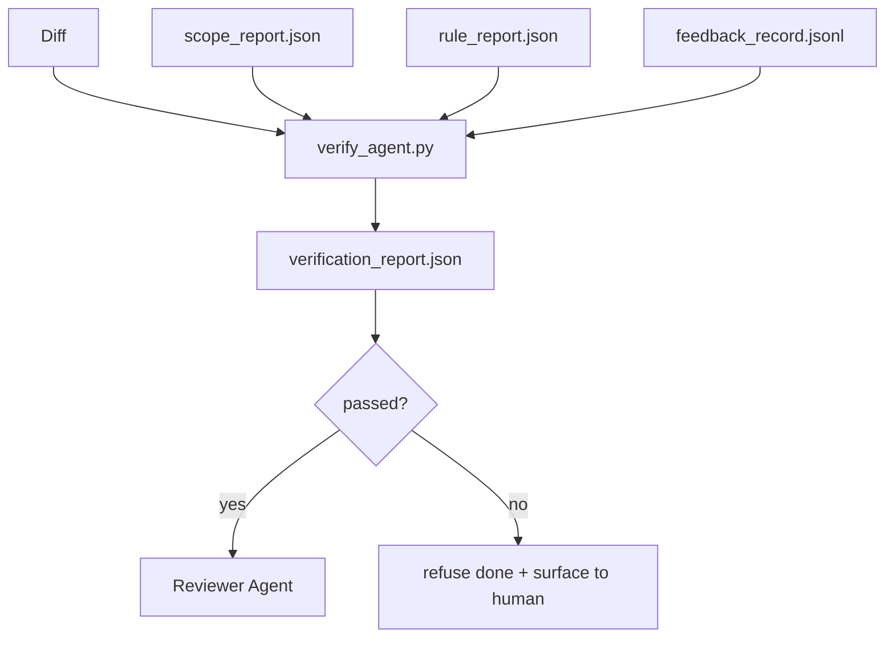

# सत्यापन द्वार

> एजेंट अपने काम को पूरा करने के लिए चिह्नित नहीं कर सकता है। सत्यापन गेट 会读取 scope contract、feedback log、rule report 和 diff,并回答一个问题: क्या यह काम वास्तव में पूरा हुआ है?

**Type:** Build
**Languages:** Python (stdlib)
**Prerequisites:** Phase 14 · 33 (Rules), Phase 14 · 36 (Scope), Phase 14 · 37 (Feedback)
**Time:** ~55 分钟

## 学习目标
-  सत्यापन गेट 定义为作用对工作台文物的确定性函数──
- एक निर्णय में एक नियम रिपोर्ट, दायरा रिपोर्ट, प्रतिक्रिया रिकॉर्ड और अंतर को शामिल किया जाएगा।
- 输出 समीक्षक एजेंट तथा CI 都市能读取的`verification_report.json`
- जब तक कोई ब्लॉक-सख्तता विफलता होती है, तब तक कोई अपवाद नहीं है कि कोई भी कार्य जारी रखा जाए।

## 问题
एजेंट 太容易宣称成功──三种失败形态最常见:

-  दिखने में गलत है मॉडल  अपना अंतर पढ़ लेता है, फिर यह पहचान लेता है कि यह सही है 
- 测试通过了──说得很自信──但没有测试实际运行的记录──
-                                                                                                                                                                                                                                                               

कार्यक्षेत्र का संशोधन विधि एक सत्यापन गेट है, यह पढ़ लेता है एजेंट 已生成的文物并作出判断── गेट है निश्चितता── गेट है संस्करण नियंत्रण 管理── गेट 接入 CI──agent 无法它──

## 概念


### गेट 检查什么

| Check | Source artifact | Severity |
|-------|-----------------|----------|
| 所有 acceptance commands 都已运行 | `feedback_record.jsonl` | block |
| 所有 acceptance commands 都以零退出码结束 | `feedback_record.jsonl` | block |
| Scope check 没有 forbidden writes | `scope_report.json` | block |
| Scope check 没有 off-scope writes | `scope_report.json` | block or warn |
| 所有 block-severity rules 都通过 | `rule_report.json` | block |
| feedback 中没有 `null` exit codes | `feedback_record.jsonl` | block |
| Touched files 匹配 `scope.allowed_files` | both | warn |

`warn`निर्णय का पता लगाना 添注释;`block`                                                                                                                                                                                                                                                                                                                                                                                                                                                                                                                             `passed: true`

### 确定性, न कि संभावना性

एक ही कलाकृतियों के सेट के लिए, प्रत्येक बार एक ही निर्णय लेना चाहिए―नहीं LLM न्यायाधीशों―LLM न्यायाधीशों परीक्षक पक्ष ️ चरण 14 · 39), जहां लक्ष्य निश्चितता मूल्यांकन है, न कि राज्य निर्णय

### एक रिपोर्ट, एक पथ

प्रत्येक कार्य बंद, गेट शहर एक आउटपुट होगा`verification_report.json`, लिखना`outputs/verification/<task_id>.json`✿CI 消费同一个路──使用不同路的多个门 会分叉真理源──

###  अपवाद नहीं अस्वीकार

ब्लॉक-कठिनता निष्कर्षों को एजेंट द्वारा ओवरराइड नहीं किया जा सकता है। वे केवल मानव द्वारा ओवरराइड किए जा सकते हैं, और रिकॉर्ड किया जाना चाहिए।`override_reason`和 `overridden_by`उपयोगकर्ता आईडी── ओवरराइड  एक बार साइन名变更, नहीं एजेंट 决策──


```figure
wb-gate-sequence
```

##  इसे निर्माण
`code/main.py`实现:

- प्रत्येक आयात कलाकृतियों के लोडर, सभी स्थानीय स्टब में, इस वर्ग को स्वयं शामिल करते हैं
- एक `verify(task_id, artifacts) -> VerdictReport`शुद्ध कार्य。
- एक प्रिंटर, प्रत्येक जांच के परिणाम और अंतिम पास/फेल को प्रदर्शित करता है
- तीन कार्य परिदृश्यों का डेमोः स्वच्छ पास, दायरा क्रिक, अनुपलब्ध स्वीकृति

运行它:

```
python3 code/main.py
```

输出: तीन फैसले की रिपोर्ट, प्रत्येक को स्क्रिप्ट के बगल में सहेजा गया

## वास्तविक परिदृश्य में उत्पादन मोड

चार प्रकार के पैटर्न एक दूसरे के लिए गेट ले जाएगा

**Defense-in-depth，而不是 single gate。**प्री-कमिट हुक → आईसी स्टेटस चेक → प्री-टूल ऑथ्ज़ हुक → प्री-मेर्ज गेट。 प्रत्येक स्तर निर्धारण योग्य है, इसलिए एक स्तर में विफलता 会被下一层捕获──microservices.io का 2026 साल 3 月 प्लेबुक 明确指出: प्री-कमिट हुक अपरिहार्य है, क्योंकि मॉडल-साइड कौशल के साथ अलग है, यह एजेंट पर निर्भर नहीं करता है  अनुसरण निर्देश── सत्यापन गेट 位于 CI / प्री-मेर्ज 层。

**通过确定性 check 做 defense，model-judge 只处理细微差别。**मानव विज्ञान के 2026 हाइब्रिड मानक जोड़ेः可验证 पुरस्कार(इकाई परीक्षण, योजना जांच, निकास कोड) उत्तरकोड है या नहीं समस्या हल हुई है?LLM rubrics 回答कोड है या नहीं पढ़ सकते हैं, सुरक्षा, अनुरूप风格?gate 运行第一类;reviewer(Phase 14 · 39)运行第二类──混用它们会让信号塌──

**签名 override log，而不是 Slack threads。**हर बार ओवरराइड शहर में होगा`outputs/verification/overrides.jsonl`中输出一行,包含:टाइमस्टैम्प, कोड ढूंढना, कारण, हस्ताक्षर उपयोगकर्ता, वर्तमान HEAD समिति, रनटाइम 会拒绝任何缺少签名的过渡;ऑडिट ट्रेल 由 git 跟踪, यह ओवरराइड नीति है, और ओवरराइड थिएटर के बीच界线──

**将 coverage floor 作为一等 check。** `coverage_report.json`एक में प्रवेश करेगा`coverage_floor`(默认 80%) चेक── यदि परीक्षण की कवरेज तल से कम है, या पिछले बार के विलय की तल से कम है 1 प्रतिशत से अधिक, गेट विफल हो जाएगा।

**`--strict` mode 会将 warns 提升为 blocks。** रिहाई शाखाओं शिप-ब्लॉकिंग पीआर या घटना के बाद का triage के लिए,`--strict`हर चेतावनी को एक कठिन विफलता में बदल देगा। यह ध्वज शाखा के अनुसार ऑप्ट-इन नहीं है।

## इसका उपयोग करें
उत्पादन के पैटर्नः

- **CI step。** `verify_agent`कार्य सभा एजेंट के लिए अंतिम कलाकृतियों 运行门──没有 `passed: true`, विलय संरक्षण होगा अस्वीकार किया
- **Pre-handoff hook。**एजेंट रनटाइम में उत्पन्न हैंडऑफ डॉक 前调用门──没有绿色判决,就没有交付──
- **Manual triage。**जब एजेंट  सफल  मानव  संदेह  करते हैं, ऑपरेटर  रिपोर्ट पढ़ेंगे

गेट कार्यक्षेत्र प्रवाह के मध्य का निर्णायक किनारा है। अन्य सभी सतहें इसके ऊपर स्थित हैं।

## 交付 यह
`outputs/skill-verification-gate.md`将 gate 接入一个具体项目: कौन से स्वीकृति आदेश 会输入它, कौन से नियम ब्लॉक-कठोरता हैं, कौन से आउट-स्कोप लिखते हैं 被容忍, ओवरराइड ऑडिट लॉग 如何存储──

## अभ्यास
1. 添加一个 `coverage_floor`जांचःपरीक्षण आदेश नीचे से 80% तक पहुंचकर कवरेज रिपोर्ट उत्पन्न करना होगा।
2. 支持 `--strict`मोड, प्रत्येक `warn`提升为 `block` रिकॉर्ड कड़ा मोड 适合作为默认值 के परिदृश्य
3. 让 gate JSON 之外还生成Markdown सारांश──论证 论证 论文 论文 论文 论文 论文 论文 论文 论文 论文 论文 论文 论文 论文 论文 论文 论文 论文 论文 论文 论文 论文 论文 论文 论文 论文 论文 论文 论文 论文 论文 论文 论文 论文 论文 论文 论文 论文 论文 论文 论文 论文 论文 论文 论文 论文 论文 论文 论文 论文 论文 论文 论文 论文 论文 论文 论文 论文 论文 论文 论文 论文 论文 论文 论文 论文 论文 论文 论文 论文 论文 论文 论文 论文 论文 论文 论文 论文 论文 论文 论文 论文 论文 论文 论文 论文 论文 论文 论文 论文 论文 论文 论文 论文 论文 论文 论文 论文 论文 论文 论文 论文 论文 论文 论文 论文 论文 论文 论文 论文 论文 论文 论文 论文 论文 论文 论文 论文 论文 论文 论文 论文 论文 论文 论文 论文 论文 论文 论文 论文 论文 论文 论文 论文 论文 论文 论文 论文 论文 论文 论文 论文 论文 论文 论文 论文 论文 论文 论文 论文 论文 论文 论文 论文 论文 论文 论
4. 添加一个 `time_since_last_human_touch`चेकःमानव कीबोर्ड दबाकर पछले 60 सेकंड में संपादन करें किसी भी फ़ाइल को, सभी आउट-स्कोप ध्वज से मुक्त है 👇
5. आपके उत्पाद में वास्तविक एजेंट का अंतर है।

## 关键术语
| Term | What people say | What it actually means |
|------|----------------|------------------------|
| Verification gate | “阻止事情的 check” | 作用于 workbench artifacts 的确定性函数，生成 pass/fail verdict |
| Block severity | “Hard fail” | 会阻止 `passed: true` 并要求签名 override 的 finding |
| Override log | “我们为什么放行它” | 带有 reason 和 user id 的签名条目，由 review 审计 |
| Acceptance command | “证明” | 一个 shell command，其零退出码就是 `done` 的含义 |
| One report path | “Source of truth” | `outputs/verification/<task_id>.json`，由 CI 和 humans 共同消费 |

## 延伸阅读
- [Anthropic, Harness design for long-running application development](https://www.anthropic.com/engineering/harness-design-long-running-apps)
- [OpenAI Agents SDK guardrails](https://platform.openai.com/docs/guides/agents-sdk/guardrails)
- [microservices.io, GenAI dev platform: guardrails](https://microservices.io/post/architecture/2026/03/09/genai-development-platform-part-1-development-guardrails.html) पूर्व प्रतिबद्धता और आईसी के बीच गहन रक्षा
- [ICMD, The 2026 Playbook for Agentic AI Ops](https://icmd.app/article/the-2026-playbook-for-agentic-ai-ops-guardrails-costs-and-reliability-at-scale-1776661990431) अनुमोदन-गेट 阶梯(ड्राफ्ट → अनुमोदन → सीमाओं के नीचे ऑटो)
- [Type-Checked Compliance: Deterministic Guardrails (arXiv 2604.01483)](https://arxiv.org/pdf/2604.01483) लीन 4 作为 निर्धारात्मक गेटिंग 的上界
- [logi-cmd/agent-guardrails — merge gate 规范](https://github.com/logi-cmd/agent-guardrails) दायरा + उत्परिवर्तन परीक्षण के द्वार
- [Guardrails AI x MLflow](https://guardrailsai.com/blog/guardrails-mlflow) निर्धारक सत्यापितकर्ता 作为 CI 评分器
- [Akira, Real-Time Guardrails for Agentic Systems](https://www.akira.ai/blog/real-time-guardrails-agentic-systems) उपकरण 调用前/后的 गेट
- चरण 14 · 27  शीघ्र इंजेक्शन रक्षा ((gate के विरोधी जोड़ी)
- चरण 14 · 36  इस गेट एनफोर्स के दायरे का अनुबंध
- चरण 14 · 37                                                                                                                                                                                                                                                             
- चरण 14 · 39  गेट रिव्यू एजेंट तक हाथ से बाहर
