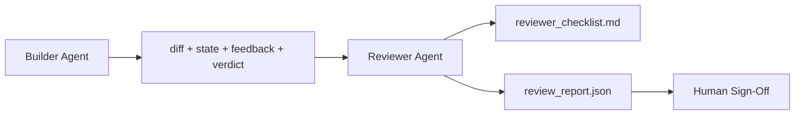

# समीक्षक एजेंट: बिल्डर और मार्कर को अलग करना

> 写代码的代理 不能给它打分── समीक्षक एक दूसरा चक्र है, विभिन्न सिस्टम प्रॉम्प्ट  विभिन्न लक्ष्य का उपयोग करता है, और बिल्डर के लिए 产生的 सभी सामग्री केवल केवल पढ़ने के लिए पहुंच है── बिल्डर और समीक्षक के बीच का अंतर, अधिकांश विश्वसनीयता है──

**Type:** Build
**Languages:** Python (stdlib)
**Prerequisites:** Phase 14 · 38 (Verification Gate)
**Time:** ~55 分钟

## 学习目标
- बताओ कि एक एजेंट अपने काम का विश्वसनीय रूप से निरीक्षण क्यों नहीं कर सकता है।
- 构建一个审查代理 循环,它消费建筑物,并输出结构化审查报告──
- 编写一个评论员条目,根据具体维度评分,而不是凭感――
-  रिव्यू करने वाला  वर्कबेंच में शामिल हो,  कृत्रिम समीक्षा  वास्तविक कलाकृतियों से कदम  शुरू करें

## 问题
आप 让代理 修复一个bug──它编辑了四个文件,运行了测试,并报告完成──验证门(Phase 14 · 38) 已运行且范围 保持不变──gate 显示 `passed: true`आपको मिला है दो दिन बाद आपको पता चला कि यह सुधार बग का दूसरा आधा है, सही आधा नहीं

स्वीकार करना आवश्यक है, लेकिन अपर्याप्त है। समीक्षक स्वीकार करने के लिए प्रश्न पूछेंगे, यह प्रश्न नहीं उठा सकतेः क्या यह सही समस्या का समाधान करता है? क्या यह बिना स्पष्टीकरण के दायरे को बढ़ाता है? क्या यह उन धारणाओं को रिकॉर्ड करता है जिन पर सवाल उठाना चाहिए? क्या यह कार्यशाला को अगले सत्र में एक सुसंगत स्थिति में रखता है?

## 概念


### समीक्षक का अनुच्छेद

五个维度, प्रत्येक आयाम 0 से 2 तक

| Dimension | Question |
|-----------|----------|
| Problem fit | 这个变更是否解决了任务所陈述的问题，而不是相近的问题？ |
| Scope discipline | 编辑是否限制在 contract 内，或者 contract 的扩展是否是有意为之？ |
| Assumptions | 所有隐藏 assumptions 是否都写在了某个可 review 的地方？ |
| Verification quality | acceptance command 是否真的证明了目标，还是只证明了一个更弱的版本？ |
| Handoff readiness | 下一个 session 是否能从当前状态干净地接手？ |

总分 10 分──7 से कम 分是软失败; 5 से कम 分是硬失败──

### समीक्षक स्वतंत्र भूमिका है, स्वतंत्र मॉडल नहीं

आप बिल्डर के साथ समान मॉडल का उपयोग कर सकते हैं 运行 समीक्षक──关键约束是角色分离: विभिन्न सिस्टम प्रॉम्प्ट、 भिन्न इनपुट、对差 没有写权──姿态的变化就是信号的变化──

### समीक्षक 不能编辑 diff

समीक्षक 读取 diff、state、feedback、verdict── यह एक रिपोर्ट लिखता है── यह कोई पैच नहीं करता है। यदि रिपोर्ट कहती है 修复这个,下一轮 बिल्डर बारी जा कर修复; समीक्षक लौट कर समीक्षा──混合角色会破坏这个段间隔──

### समीक्षाकर्ता अनुच्छेद और सत्यापन गेट के मुकाबले

गेट(चरण 14 · 38) जांच निश्चितता तथ्य:स्वीकार या नहीं चलाने, नियम या नहीं पारित, दायरा या नहीं बनाए रखने, समीक्षक करना, निश्चितता निर्णयः यह सही काम है या नहीं, दस्तावेज रिकॉर्ड है या नहीं, अनुमोदन या नहीं उपलब्ध है, दोनों की जरूरत है।


```figure
wb-builder-marker
```

##  इसे निर्माण
`code/main.py`实现:

- एक `ReviewerInputs`डेटा क्लास, इस्तेमाल करने के लिए 打包 समीक्षक 读取的文物──
- एक rubric scorer, प्रत्येक dimension एक function--- प्रत्येक function है निश्चित, और पाठ्यक्रम के लिए stub-grade का उपयोग करना;
- एक `review_report.json`लेखक, समाहित ५分数、总分和判决`pass``soft_fail``hard_fail`)。
- 两个示范案例:一个干净的变更,以及一个测试正确,问题错误的变更──

运行:

```
python3 code/main.py
```

输出: दुई份 समीक्षा रिपोर्ट 写入磁盘, और कंसोल में प्रदर्शित एक张维度分数表──

## वास्तविक परिदृश्य में उत्पादन मोड

证据如下:Cloudflare में 2026 के अप्रैल में AI कोड समीक्षा प्रणाली, 30 天内跨 5,169 个 repos、48,095 个 merge अनुरोध 运行了 131,246 बार समीक्षा。 समीक्षा 完成时间中位数为 3 分 39 秒── अधिकतम सात विशेषज्ञ समीक्षक ((सुरक्षा、性能、 कोड गुणवत्ता、 डॉक्स、 रिलीज़ मैनेजमेंट、 अनुपालन、 इंजीनियरिंग कोडेक्स) में समीक्षा समन्वयक 下并行运行, मॉडल समन्वयक द्वारा पुनः निष्कर्षों का न्याय करने, गंभीरता、 शीर्ष श्रेणी  केवल समन्वयक को बनाए रखने; विशेषज्ञ 运行在更便宜的层上.

चार प्रकार के पैटर्न  इसे बड़े पैमाने पर संचालित करने में सक्षम बनाने के लिए

**Specialist pool, not one big reviewer.**एकल repos के लिए, एक साथ 5 维 rubric के समीक्षक 足足足── एक बार कोडबेस में सुरक्षा-महत्वपूर्ण、कार्यक्षमता-महत्वपूर्ण 和 डॉक्स सतहें हों, तो इसे शीघ्र और छोटे विशेषज्ञों में विभाजित करें── समन्वयक करें;विशेषज्ञ पूर्ण rubric से नहीं चल रहे── मॉडल-स्तर की अलगाव भी स्वाभाविक रूप से गठनः सस्ते विशेषज्ञ, महंगे समन्वयक──

**Bias mitigation as design requirement, not optimization.**LLM न्यायाधीशों 会表现出四类稳定偏见(Adnan Masood,2026年 4 月):स्थिति पूर्वाग्रह(GPT-4 在 (A,B) 与 (B,A) 排序上约40%不一致) Verbosity bias(更长输出有约15% स्कोर मुद्रास्फीति) ‧自我偏好(न्यायाधीशों 偏好同一模型家族的输出) ‧权威性(न्यायाधीशों 会高估对知名作者的引用) ‧缓解方式:同时评估两种排序,只计算一致获胜;使用明确奖励简洁性的 1-4 माप;跨模型家庭 轮换法官;评分前移除作者姓名──

**Calibration set, not vibes.** एक ऐसे इतिहास के कार्य को तैयार करें जिसमें 10-20 ऐतिहासिक कार्य हों और सही निर्णयों का संग्रह हो  प्रत्येक संशोधन के लिए शीघ्र पूरी समीक्षाएँ करें यदि इतिहास के साथ अनुरूपता 80% से कम हो, तो अनुच्छेद प्रकाशित करने वाले समीक्षक को पूरी समीक्षाएँ करने की आवश्यकता हो प्रत्येक टीम को अंततः यह फिर से पता चल जाएगा; सबसे अच्छा यह करना शुरू करना है

**Hybrid norm with the gate.**सत्यापन गेट ((चरण 14 · 38) निश्चितता जांच को संसाधित करना ((स्वीकार या नहीं चल रहा है, परीक्षण या नहीं पारित किया गया है, दायरा या नहीं रखा गया है) ।

## इसका उपयोग करें
उत्पादन के पैटर्नः

- **Claude Code subagents.**रिव्यूर सबगेन्ट में बिल्डर 关闭任务后运行── यह PR में प्रकाशित होता है जिसमें रूबिरिक स्कोर होते हैं।
- **OpenAI Agents SDK handoffs.**बिल्डर में काम पूरा होने पर  दे रिव्यूर को  रिव्यूर को 交回, या 上交给人
- **Two-model pairing.**बिल्डर 运行在更快、更便宜的模型上── समीक्षक 运行在更强的模型上,更小的文本,专注判断,

समीक्षाकर्ता है जब मनुष्य  व्यक्तिगत रूप से  प्रत्येक समीक्षा  पूरा नहीं कर पाता, कार्यक्षेत्र 长出第二双眼

## 交付 यह
`outputs/skill-reviewer-agent.md`生成一个项目专用审核员条目、一个连接建设者文物的审核员 stub,以及验证门的集成,让人工审核从书面报告开始,而不是从空白页开始──

## अभ्यास
1.  जोड़ा छठा  आपके उत्पाद डोमेन से संबंधित आयामों  समझाएँ कि यह वर्तमान में पांच आयामों में क्यों नहीं अवशोषित है
2. दो अलग-अलग सिस्टम संकेतों के साथ प्रयोग करें।
3. प्रत्येक आयाम के लिए जोड़ा`confidence`◊ न्यूनतम स्तर पर विश्वास 0.6 से कम समय पर रिपोर्ट जारी करने से इनकार किया गया।
4.  एक माप सेट का निर्माण करना:10 个 带有已知正确判决的历史任务 close-outs──对它们运行审查员──它在哪里与历史记录不一致?
5. 添加一个请求更多证据                                                                                                                                                                                                                                                          

## 关键术语
| Term | What people say | What it actually means |
|------|----------------|------------------------|
| Reviewer rubric | “Checklist” | 五维 0-2 评分，每个维度都有一个书面问题 |
| Soft fail | “Needs revisions” | 总分低于 7；builder 获得需要处理的 findings |
| Hard fail | “Reject” | 总分低于 5，或任一维度为 0；暂停并呈现给 human |
| Role separation | “Different prompt” | 同一个 model 可以承担两个角色；关键约束是 inputs 和 posture |
| Confidence floor | “Don't ship low-signal reports” | 当 rubric 不确定时，拒绝输出 verdict |

## 延伸阅读
- [OpenAI Agents SDK handoffs](https://platform.openai.com/docs/guides/agents-sdk/handoffs)
- [Anthropic Claude Code subagents](https://docs.anthropic.com/en/docs/agents-and-tools/claude-code/sub-agents)
- [Cloudflare, Orchestrating AI Code Review at Scale](https://blog.cloudflare.com/ai-code-review/) 7 个 विशेषज्ञ + समन्वयक 架构,30 天 131k 次 रन
- [Agent-as-a-Judge: Evaluating Agents with Agents (OpenReview / ICLR)](https://openreview.net/forum?id=DeVm3YUnpj) DevAI बेंचमार्क,366 पदानुक्रमिक समाधान आवश्यकताएं
- [Adnan Masood, Rubric-Based Evaluations and LLM-as-a-Judge: Methodologies, Biases, Empirical Validation](https://medium.com/@adnanmasood/rubric-based-evals-llm-as-a-judge-methodologies-and-empirical-validation-in-domain-context-71936b989e80) 4 प्रकार के पूर्वाग्रह तथा उन्मूलन
- [MLflow, LLM-as-a-Judge Evaluation](https://mlflow.org/llm-as-a-judge) बिल्डर/मूल्यांकनकर्ता के उत्पादन उपकरण के लिए
- [LangChain, How to Calibrate LLM-as-a-Judge with Human Corrections](https://www.langchain.com/articles/llm-as-a-judge) कैलिब्रेशन सेट वर्कफ़्लो
- [Evidently AI, LLM-as-a-judge: a complete guide](https://www.evidentlyai.com/llm-guide/llm-as-a-judge)
- [Arize, LLM as a Judge — Primer and Pre-Built Evaluators](https://arize.com/llm-as-a-judge/)
- चरण 14 · 05  आत्म-संशोधन और आलोचनात्मक (एकल एजेंट स्व-समीक्षा आधार)
- चरण 14 · 30  Eval-driven agent development (इवल-ड्राइव्ड एजेंट विकास)
- चरण 14 · 38  समीक्षक 读取的验证门
- चरण 14 · 40  समीक्षक रिपोर्ट 输入的交付包
