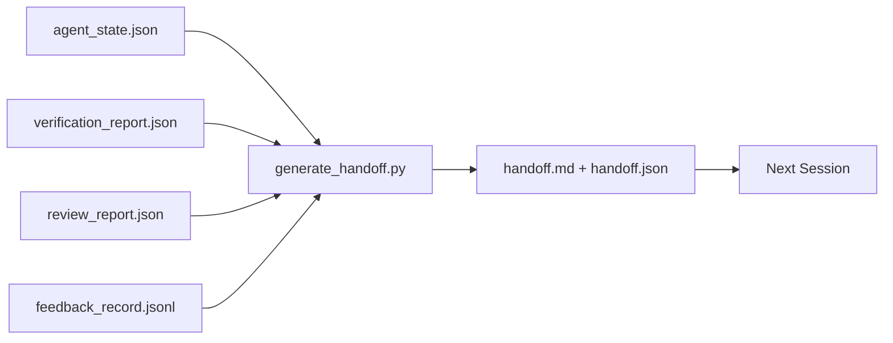

# बहु-सत्र हस्तान्तरण

> सत्र समाप्त हो गया है। काम अभी समाप्त नहीं हुआ है। दान पैकेट एक कलाकृत्य है, यह एक घंटे में कार्य करता है।

**类型:**निर्माण
**语言:**पायथन (stdlib)
**先修:**चरण 14 · 34 (रिपो मेमोरी), चरण 14 · 38 (सत्यापन), चरण 14 · 39 (समीक्षाकर्ता)
**时间:**~ 50 मिनट

## 学习目标

- 识别每一个交付包都需要的七个字段──
- कार्य डेस्क कलाकृतियों से 生成 हस्त हस्तान्तरण, बजाय हाथ से लेखन विवरण文字
- बड़े फ़ीडबैक लॉग को 剪剪成适合 हस्तान्तरण का सारांश
- 让下一个会议的第一动作具有确定性──

## 问题

सत्र समाप्त हो गया। एजेंट ने कहा, "अच्छा, हम प्रगति कर रहे हैं।" अगला सत्र खोला गया। अगला सत्र शुरू हो गया। अगला एजेंट ने पूछा, "हम आखिरी बार कहां रुकेंगे? पहला एजेंट का जवाब पहले ही नहीं मिला है।" अगला एजेंट ने एक ही प्रश्न को फिर से शुरू किया, उसी आदेश को फिर से लागू किया, उसी प्रश्न को मानव से फिर से पूछा, और केवल एक सत्र को पुनः प्राप्त करने में 30 मिनट खर्च किए। अंतिम 30 सेकंड की जानकारी।

糟糕 handoff की लागत, कार्य जीवन चक्र के दौरान प्रत्येक सत्र में लगातार भुगतान किया जाएगा।

## 概念



### हर हाथ में सात अंश हैं

| Field | 它回答的问题 |
|-------|---------------------|
| `summary` | 一段话说明完成了什么 |
| `changed_files` | 一眼看清 diff |
| `commands_run` | 实际执行过什么 |
| `failed_attempts` | 尝试过什么，以及为什么没有成功 |
| `open_risks` | 下个 session 可能踩到什么坑，附 severity |
| `next_action` | 下个 session 采取的第一个具体步骤 |
| `verdict_pointer` | 指向 verification + review reports 的路径 |

`next_action`字段是承重字段── एक जिसमें सब कुछ है लेकिन अभाव है `next_action`                                                                                                                                                                                                                                                              

### हाथ देना उत्पन्न होता है, न कि लिखा जाता है

हाथ लिखना,就是在困难日子里会被跳过的手送── जनरेटर 读取工作桌文物并输出包── एजेंट का कर्तव्य है कि कार्य桌 处于生成器的总结状态, न कि स्वयं सारांश लिखें──

### 两种形式:मानव-पठनीय और मशीन-पठनीय

`handoff.md`供人类 阅读──`handoff.json`供下一个代理 加载── दोनों एक ही स्रोत कलाकृतियों की एक ही बैच से आते हैं── यदि वे विभाजन में आते हैं, तो JSON के लिए तैयार हो जाएँ──

### प्रतिक्रिया लॉग 裁剪

完整的 `feedback_record.jsonl`हो सकता है कि वहाँ सैकड़ों लेख रिकॉर्ड हों, लेकिन केवल अंतिम K 条, साथ ही प्रत्येक लेख के साथ छोड़ने के रिकॉर्ड हो।

### 留下干净 स्थिति

handoff 描述工作; स्वच्छ स्थिति 让工作可恢复── वे एक ही बात नहीं हैं── यदि अगले सत्र 打开时面对的是半截差、代理 忘记的临时文件、游离分支,以及尚未真正运行就报错的测试,那么再完美`handoff.md`इसके अलावा कोई मूल्य नहीं है। अगला एजेंट एक सत्र में कुछ छोड़ने के बजाय एक सत्र में कुछ साफ करने में 10 मिनट खर्च करेगा। यह लागत कार्य जीवन चक्र में प्रत्येक सत्र में बढ़ेगी।

इसलिए सत्र फ़ीचर 能跑通时结束 नहीं, बल्कि कार्य डेस्क 能跑通时结束 能跑通时结束, कार्य डेस्क 能跑通时结束, अगली सत्र 能总结, अगली सत्र 能信任时结束, क्लीनअप अपने चरण है,                                                                                                                                                                                                                                

| Check | Clean means | Dirty blocks because |
|-------|-------------|----------------------|
| Working tree | 每个变更都已 commit，或明确 stash 并附带说明 | 半截 diff 会被下一个 agent 看成有意图的工作 |
| Temp artifacts | 没有 `*.tmp`、scratch dirs、debug prints 或留下的注释块 | 游离文件会污染 diff 和下一个 agent 的 mental model |
| Tests | 绿色，或红色但在 `open_risks` 中命名了失败 | 沉默的红色 test 是下一个 session 会踩进去的陷阱 |
| Feature board | `feature_list.json` status 反映真实状态（Phase 14 · 36） | 过期 board 会把下一个 session 派去做已经完成的工作 |
| Branch | 位于预期 branch，没有 detached HEAD，没有 orphan branches | 错误 branch 会让下一个 session 的第一个 commit 落到错误位置 |

सफाई 阶段会产出一个 `clean_state.json`, में से एक सूची अवरोधक मुद्दे;空列表是手机生成器 写包 前要断言的前置条件──建立在脏树上的手机不是手机,而是转发混乱── दो कलाकृतियाँ 成对出现: सफाई 证明工作台可以安全离开,handoff 证明下一个会议 知道从哪里开始──


```figure
wb-handoff-packet
```

##  इसे निर्माण

`code/main.py`实现了:

- एक लोडर, एक स्टेटस, एक निर्णय, एक समीक्षा और प्रतिक्रिया`WorkbenchSnapshot`
- एक `generate_handoff(snapshot) -> (markdown, payload)`函数──
- एक फ़िल्टर, अंतिम K 条 प्रतिक्रिया प्रविष्टियों को चुनें, सभी गैर-零 आउटपुटों को जोड़ें
- एक डेमो रन, स्क्रिप्ट के बगल में लिखा गया।`handoff.md`和 `handoff.json`

运行它:

```
python3 code/main.py
```

输出: छापी हुई हस्तान्तरण निकाय, तथा डिस्क पर दो दस्तावेज

## वास्तविक उत्पादन में मोड

कोडेक्स CLI、Claude Code 和 OpenCode अलग-अलग संपीड़न 方案 प्रदान करते हैं; संरचनात्मक हस्तान्तरण पैकेट 位于这三者之上──

**Compaction 策略各不相同；packet schema 不变。**Codex CLI का POST /v1/responses/compact एक सर्वर-साइड अस्पष्ट AES blob है;`_summary`उपयोगकर्ता-रोल संदेश 追加──Claude Code  संदर्भ में  95% तक 时运行五阶段 प्रगतिशील संपीड़न──OpenCode उपयोग समय-स्टैम्प के आधार पर संदेश छिपाना 加上 5-शीर्षक LLM सारांश──三种不同机制,同一个需求:把压缩后保留下来的内容序列化成可移植的文物──包就是这个文物──

**Fresh-session handoff 不是 compaction。**Compaction 延长一个会议;handoff 干净地关闭一个会议,并启动下一个──Hermes Issue #20372 的框架(2026 年 4 月) 是对的:当在场压缩 开始降低质量时,Agent 应写一个紧的交付,结束一个会议,并在新文中恢复──包装 让这种转换变得便宜──错误做法是直压缩到质量崩;修复方式是为早期干净的交付 预留预算──

**每个 branch 和 topic 只保留一个 active handoff。**मल्टी-एजेंट समन्वय  अधिक है क्योंकि पुराने हाथों, बजाय खराब मॉडल आउटपुट── हमेशा शामिल `branch``last_known_good_commit`, तथा `active | superseded | archived`之一的 `status`️स्थिर हस्तान्तरणों को अभिलेखागार में रखा जाएगा; केवल सक्रिय का उस ड्राइवर नेक्स्ट एक सत्र ️️️️️️️️️️️️️️️️️️️️️️️️️️️️️️️️️️️️️️️️️️️️️️️️️️️️️️️️️️️️️️️️️️️️️️️️️️️️️️️️️️️️️️️️️️️️️️️️️️️️️️️️️️️️️️️️️️️️️️️️️️️️️️️️️️️️️️️️️️️️️️️️️️️️️️️️️️️️️️️️️️️️️️️️️️️️️️️️️️️️️️️️️️️️️️️️️️️️️️️️️️️️️️️️️️️️️️️️️

**在 50-75% context 之前收尾，不要等到撞墙。**️CLAUDE.md + HANDOVER.md) रिपोर्ट में कहा गया है कि सत्र में संदर्भ बजट का 50-75%  समाप्त होता है, न कि 95% 时, प्रभाव सबसे अच्छा होता है।

## इसका उपयोग करें

生产模式:

- **Session-end hook。**रनटाइम में उपयोगकर्ता बंद चैट 时触发 जनरेटर──पैकट 写入 `outputs/handoff/<session_id>/`
- **PR template。**जनरेटर का मार्कडाउन भी PR निकाय के रूप में किया जा सकता है।
- **Cross-agent handoff。**एक उत्पाद निर्माण (क्लाउड कोड), एक अन्य जारी रखें (कोडेक्स)

पैकेट 小、规则、生成成本低──节省下来的成本会随着每次会议 复利增长──

##  इसे जारी करें

`outputs/skill-handoff-generator.md`एक अनुकूल परियोजना कलाकृतियों पथों के जनरेटर उत्पन्न करेगा, एक इसे संचालित सत्र के अंत हुक, और अगले एजेंट  चालू करते समय पढ़ने के लिए `handoff.json`योजना

## अभ्यास

1. 添加一个 `assumptions_to_validate`字段, खुलासा निर्माताओं रिकॉर्ड किया गया है, लेकिन समीक्षक 评分 नहीं 1 से अधिक प्रत्येक परिकल्पना 
2. इस प्रकार के लिए यह एक महत्वपूर्ण विषय है।
3. 加入一个 问题对人类列表――一个问题进入包,而不是进入聊天消息的值是什么?
4. 让发电机 具有无效力:运行两次产生相同的包――成立,需要什么内容保持稳定?
5. Add a Next session prequires section,精确列出 下一个会议 在行动前必须加载的文物──

## 关键术语

| Term | 人们常说 | 实际含义 |
|------|----------------|------------------------|
| Handoff packet | “Session summary” | 携带七个字段的生成 artifact，同时包含 markdown 和 JSON |
| Next action | “首先做什么” | 启动下一个 session 的一个具体步骤 |
| Feedback trim | “Log summary” | 最后 K 条 records 加上每个非零 exit |
| Status report | “我们做了什么” | 缺少 `next_action` 的文档；有用，但不是 handoff |
| Verdict pointer | “Receipt” | 指向 verification + review reports 的路径，用于 traceability |

## 延伸阅读

- [Anthropic，面向 long-running agents 的有效 harnesses](https://www.anthropic.com/engineering/effective-harnesses-for-long-running-agents)
- [OpenAI Agents SDK handoffs](https://platform.openai.com/docs/guides/agents-sdk/handoffs)
- [Codex Blog，Codex CLI Context Compaction：架构、配置、管理长会话](https://codex.danielvaughan.com/2026/03/31/codex-cli-context-compaction-architecture/) POST /v1/ प्रतिक्रिया/कॉम्पैक्ट 和 स्थानीय fallback
- [Justin3go，Shedding Heavy Memories：Context Compaction in Codex, Claude Code, OpenCode](https://justin3go.com/en/posts/2026/04/09-context-compaction-in-codex-claude-code-and-opencode) तीन विक्रेता की संपीड़न के लिए तुलना
- [JD Hodges，Claude Handoff Prompt：如何跨 Sessions 保持 Context (2026)](https://www.jdhodges.com/blog/ai-session-handoffs-keep-context-across-conversations/) क्लाउड.एमडी + हैंडओवर.एमडी,50-75% संदर्भ बजट
- [Mervin Praison，Managing Handoffs in Multi-Agent Coding Sessions：Fresh Context Without Losing Continuity](https://mer.vin/2026/04/managing-handoffs-in-multi-agent-coding-sessions-fresh-context-without-losing-continuity/) वितरित-प्रणाली 视角
- [Hermes Issue #20372 — compression 变得有风险时自动 fresh-session handoff](https://github.com/NousResearch/hermes-agent/issues/20372)
- [Hermes Issue #499 — Context Compaction Quality Overhaul](https://github.com/NousResearch/hermes-agent/issues/499) कोडेक्स सीएलआई 中面向交付 的提示
- [Microsoft Agent Framework，Compaction](https://learn.microsoft.com/en-us/agent-framework/agents/conversations/compaction)
- [OpenCode，Context Management and Compaction](https://deepwiki.com/sst/opencode/2.4-context-management-and-compaction)
- [LangChain，Context Engineering for Agents](https://www.langchain.com/blog/context-engineering-for-agents)
- चरण 14 · 34  जनरेटर 读取的状态文件
- चरण 14 · 38  पैकेट 指向的 सत्यापन फैसला
- चरण 14 · 39  打包进 पैकेट की समीक्षा रिपोर्ट
