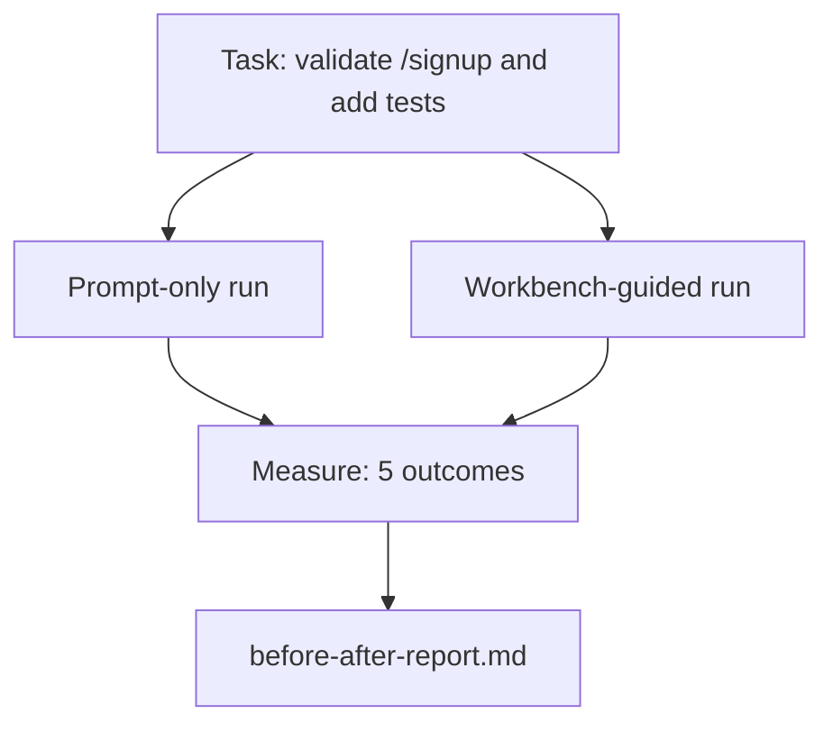

# Workbench का उपयोग करें

> 十一节 सतह के बारे में एक कोर्स, यदि वास्तविक कोडबेस परीक्षण का सामना नहीं कर पाता है, तो यह मूल्यहीन है।

**Type:** Build
**Languages:** Python (stdlib)
**Prerequisites:** Phases 14 · 32 to 14 · 40
**Time:** ~60 minutes

## 学习目标
- सात कार्यक्षेत्र सतहों को एक छोटे से अनुप्रयोग में संकलित करना
- एक ही कार्य को दो बार चलाना होगा, केवल शीघ्र और कार्यक्षेत्र-निर्देशित), तथा पाँच परिणामों का माप करना होगा।
- 阅读前/后报告,并判断哪些表面 提供最大杆──
- 面对但我的模型 已经足够好的反驳时,为工作台 辩护

## 问题
खेलौना कार्य पर प्रदर्शन करें किसी के लिए भी काम नहीं करता है। कार्यक्षेत्र का मूल्य एक वास्तविक कार्य के लिए एक वास्तविक कार्य को पूरा करने के लिए एक वास्तविक कार्य के लिए एक वास्तविक कार्य के लिए एक वास्तविक कार्य के लिए एक वास्तविक कार्य के रूप में प्रदर्शित होता हैः कम विफलता, कम रिवर्स, और एक अगले सत्र के लिए एक उपयोगी पैकेट का उत्पादन करता है।

इस कोर्स में इस वास्तविकता की भावना का पुनर्विक्रय किया गया है, और एक ही कार्य को दो पाइपलाइनों से पार कर दिया गया है। परिणाम यह है कि आप संदेह करने वाले को पूर्व / बाद की रिपोर्ट दे सकते हैं।

## 概念


### नमूना ऐप

`sample_app/`मध्य एक न्यूनतम FastAPI 风格 हैंडर:

- `app.py`, समाहित `/signup`(尚無核准) 
- `test_app.py`, एक खुश पथ परीक्षण शामिल है
- `README.md`和 `scripts/release.sh`, निषिद्ध क्षेत्र के लिए चारा के रूप में

### कार्य

> `/signup`⇒ इनपुट सत्यापनः अस्वीकार करना ⇒ 8 个字符的密码, वापसी के साथ टाइप त्रुटि कूपन के 422 ⋅ ⇒ एक परीक्षण जोड़कर नया व्यवहार प्रमाणित करें ⋅

### दो पाइपलाइनों

केवल शीघ्रः

1. 阅读 README。
2. 阅读 `app.py`
3. 编辑文件──
4. 声称完成──

कार्यक्षेत्र द्वारा निर्देशितः

1. 运行 init script (पढ़ें)
2. 阅读 अनुबंध की सीमा ((पढ़ें 36)。
3. 读取 राज्य (पाठ 34)
4. केवल संपादित करने की अनुमति है।
5. 通过反 प्रतिक्रिया धावक 运行 स्वीकृति आदेश ((37 पाठ) 👇
6. 运行 सत्यापन गेट (पाठ 38)
7. 运行 समीक्षक (पाठ 39)
8. 生成 हस्तान्तरण (पाठ 40)

### 衡量五个结果

| Outcome | Why it matters |
|---------|----------------|
| `tests_actually_run` | 大多数“tests passed”声明都无法验证 |
| `acceptance_met` | 证明目标达成的 test 必须就是实际运行过的 test |
| `files_outside_scope` | Scope creep 是主要的静默 failure |
| `handoff_quality` | 下一次 session 会为此付出代价或从中受益 |
| `reviewer_total` | 在 gate 之上的定性判断 |


```figure
wb-ab-runs
```

##  इसे निर्माण
`code/main.py`针对同样样样应用程序 编排两条管道──两条管道 都是脚本的(loop 中没有LLM),因此测量可复现──该脚本会将比较 写入 写入 `before-after-report.md`和 `comparison.json`

运行:

```
python3 code/main.py
```

输出: पाइपलाइन के अनुसार  प्रदर्शन परिणाम के कंसोल तालिका, स्क्रिप्ट 旁边的 मार्कडाउन रिपोर्ट, तथा देने के लिए सोचा बनाने के लिए चित्र का उपयोग करने वाले JSON 

## वास्तविक उत्पादन में उत्पादन पैटर्न

 संशयवादी प्रश्न है:  कार्यक्षेत्र  क्या यह बहुत मददगार है?2026 वर्ष के आंकड़े व्याख्या से अधिक आश्वस्त हैं

**Terminal Bench Top-30 到 Top-5，使用同一个 model。**LangChain का *एजेंट हर्नस का शरीर रचना*(2026 साल 4 月): एक कोडिंग एजेंट  केवल हर्नस को बदलने के माध्यम से, टर्मिनल बेंच 2.0 के 30 名 से 5 名へ ︎ एक ही मॉडल── भिन्न सतह──25 个名次的差距──

**Vercel 通过删除 tools 从 80% 到 100%。**वर्सेल  रिपोर्ट में कहा गया है कि इसके एजेंट के 80% उपकरण हटाए जाने के बाद, सफलता दर 80% से बढ़कर 100% हो गई है।

**Harvey 仅靠 harness 实现 2x accuracy。**कानूनी एजेंटों हरेंस अनुकूलन के माध्यम से सटीकता 提升到两倍以上, कोई परिवर्तन मॉडल नहीं 

**88% 的企业 AI agent projects 未能进入 production。**preprints.org का *Harness Engineering for Language Agents* paper(2026 साल 3 月) विफलता को तर्क के बजाय रनटाइम के कारण ढ़लना होगा: स्थिर स्थिति  कमजोर पुनः प्रयास  अत्यधिक विस्तार का संदर्भ  मध्य त्रुटि के पुनर्प्राप्ति क्षमता में कमी 

**Long-context collapse。**वेबएजेंट की आधारशिला 40-50% सफलता है दीर्घकालिक  शर्तों में नीचे गिरने के 10% नीचे, मुख्य कारण अनंत लूप्स और लक्ष्य हानि है;; रल्फ़ लूप और हाथ पैकेट है ताकि इन समस्याओं को लेने के लिए मौजूद है;;

**False negatives 仍然存在。**एकल-चरण वस्तुगत कार्य, एकल-पंक्ति लाइन, प्रारूपण रन, किसी भी मॉडल 已逐字记住的内容, ये केवल शीघ्र-मात्र 会更快── बेंचमार्क 应诚实地列出它们, इस प्रकार कार्यक्षेत्र 才不会被描述成过度设计──

结论不是harness 永远获胜──模型会随着时间吸收哈尼斯技巧──结论是: आज, इंजीनियरिंग लोड 落在这七面上,而数字证明这一点──

## इसका उपयोग करें
निम्नलिखित स्थिति में, इस वर्ग को मामले की फाइल के रूप में संदर्भित किया जा सकता हैः

- किसी ने पूछा क्यों हर PR के साथ है`agent-rules.md`和 दायरा अनुबंध
- टीम ने इस स्प्रिंट पर विचार किया और सत्यापन गेट को हटा दिया।
- एक नया एजेंट उत्पाद  जारी किया, और आप यह निर्धारित करने के लिए एक पोर्टेबल बेंचमार्क की जरूरत है कि यह वास्तव में समय की बचत है।

संख्याओं को समझाए जाने से अधिक दूर फैलता है।

## 交付 यह
`outputs/skill-workbench-benchmark.md`यह एक पोर्टेबल मूल्यांकन हर्न है, आप किसी भी एजेंट उत्पाद किसी भी परियोजना में अपने स्वयं के नमूना ऐप ऊपर चलाया दो पाइपलाइन, और रिपोर्ट पांच परिणामों में से एक है।

## अभ्यास
1. 添加第六个结果:समय-से-पहले-सार्थक-संपादन──如何干净地衡量它?
2. अपने कोडबेस में एक वास्तविक दूसरे दिन का कार्य ऊपर चलाने तुलना--- कार्यक्षेत्र के आंकड़े कहाँ नीचे?
3.  false negative pass:列出 शीघ्र-मात्र 本会更快、 कार्यक्षेत्र ओवरहेड  वास्तविक लागत का कार्य है──然后为继续保留工作桌 辩护──
4. एजेंट एजेंट एजेंट एजेंट एजेंट एजेंट एजेंट एजेंट एजेंट एजेंट एजेंट एजेंट एजेंट एजेंट एजेंट एजेंट एजेंट एजेंट एजेंट एजेंट एजेंट एजेंट एजेंट एजेंट एजेंट एजेंट एजेंट एजेंट एजेंट एजेंट एजेंट एजेंट एजेंट एजेंट एजेंट एजेंट एजेंट एजेंट एजेंट एजेंट एजेंट एजेंट एजेंट एजेंट एजेंट एजेंट एजेंट एजेंट एजेंट एजेंट एजेंट एजेंट एजेंट एजेंट एजेंट एजेंट एजेंट एजेंट ेंट एजेंट ेंट ेंट ेंटएजेंटएजेंट ेंटएजेंट ेंटएजेंट ेंटएजेंट
5.  एक पृष्ठ गैर इंजीनियर के लिए सारांश लिखें कौन सी सामग्री बचाई जा सकती है?

## 关键术语
| Term | What people say | What it actually means |
|------|----------------|------------------------|
| Sample app | “Toy repo” | 足够小，但也足够现实，能够演练全部七个 surface |
| Pipeline | “Workflow” | agent 遵循的 surface read/write 有序序列 |
| Before/after report | “The receipts” | 你交给怀疑者的 artifact |
| False negative | “Workbench overkill” | prompt-only 更快的任务；诚实列出它们很有用 |
| Workbench benchmark | “Reliability score” | 在你的 codebase 上运行 comparison 的 portable harness |

## 延伸阅读
- [LangChain, The Anatomy of an Agent Harness](https://blog.langchain.com/the-anatomy-of-an-agent-harness/) टर्मिनल बेंच शीर्ष-30 से शीर्ष-5 के प्रमाण
- [MongoDB, The Agent Harness: Why the LLM Is the Smallest Part of Your Agent System](https://www.mongodb.com/company/blog/technical/agent-harness-why-llm-is-smallest-part-of-your-agent-system) वर्सेल + हार्वे 数字
- [preprints.org, Harness Engineering for Language Agents](https://www.preprints.org/manuscript/202603.1756) 88%  उद्यम विफलता दर  रनटाइम मूल कारण
- [HN: Improving 15 LLMs at Coding in One Afternoon. Only the Harness Changed](https://news.ycombinator.com/item?id=46988596) में 15 个 模型 上复现
- [Cloudflare, Orchestrating AI Code Review at Scale](https://blog.cloudflare.com/ai-code-review/) उत्पादन 中 30 天 / 131k समीक्षा रन
- [Anthropic, Building Effective Agents](https://www.anthropic.com/research/building-effective-agents)
- चरण 14 · 32 से 14 · 40  本课端到端演练的表面
- चरण 14 · 19  SWE-बेंच、GAIA、एजेंटबेंच, इस पाठ्यक्रम के पूरक के रूप में मैक्रो बेंचमार्क
- चरण 14 · 30  मूल्यांकन-चालित एजेंट विकास, एक ही हर्नस में शामिल हो सकता है
