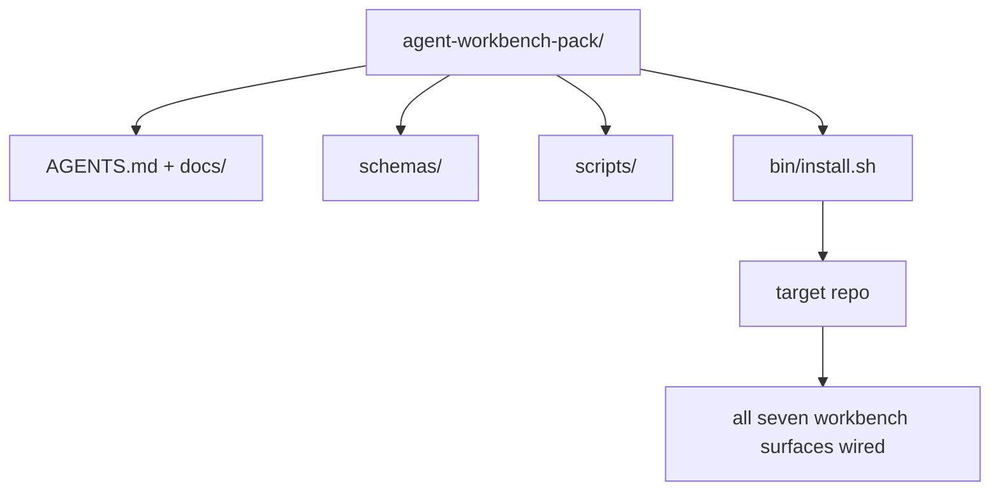

# कैपस्टोनः एक पुनः प्रयोज्य एजेंट कार्यबेंच पैक वितरित

> इस मिनी-ट्रैक को एक से किसी भी रेपो पैक में रखा जा सकता है ∞`cp -r`और फिर अगले दिन सुबह हम एजेंट को काम करने के लिए तैयार करते हैं।

**类型：**निर्माण
**语言：**पायथन (stdlib)
**前置要求：**चरण 14 · 31 से 14 · 41
**时间：**~ 75 मिनट

## 学习目标

- सात कार्यक्षेत्र सतहों को सीधे सम्मिलित करने योग्य सूची में पैक करना
- 固定 schema、script 和 template, let new repo  obtain a known available baseline── एक ज्ञात उपलब्ध आधार रेखा प्राप्त करने के लिए 
- 添加一个安装脚本, 等方式放置这个包──
- यह तय करें कि पैक में क्या सामग्री है, बाहर क्या सामग्री है, और प्रत्येक के लिए इसका निर्णय लें।

## 问题

एक कार्यक्षेत्र जो Google डॉक में मौजूद है, चर्चा इतिहास और तीन केवल अमूर्त रूप से याद किए गए स्क्रिप्ट में है, एक कार्यक्षेत्र जो हर तिमाही में पुनर्निर्माण किया जाएगा। समाधान एक संस्करण पैक हैः एक रेपो या कैटलॉग, जिसमें सतह, योजना, स्क्रिप्ट शामिल है, और एक एक आदेश है कि चलाने योग्य इंस्टॉलर।

इस कक्षा के अंत में, आप डिस्क पर वितरित किया जाएगा।`outputs/agent-workbench-pack/`, और एक जो इसे किसी भी लक्ष्य रेपो में डाल सकता है ।`bin/install.sh`

## 概念



### पैक लेआउट

```
outputs/agent-workbench-pack/
├── AGENTS.md
├── docs/
│   ├── agent-rules.md
│   ├── reliability-policy.md
│   ├── handoff-protocol.md
│   └── reviewer-rubric.md
├── schemas/
│   ├── agent_state.schema.json
│   ├── task_board.schema.json
│   └── scope_contract.schema.json
├── scripts/
│   ├── init_agent.py
│   ├── run_with_feedback.py
│   ├── verify_agent.py
│   └── generate_handoff.py
├── bin/
│   └── install.sh
└── README.md
```

### क्या छोड़ दिया, क्या बाहर रखा

留下:

- सतह योजनाएँ--- ये अनुबंध हैं---
- ऊपर चार स्क्रिप्ट हैं।
- चार भागों के दस्तावेज. . . वे नियम और अनुच्छेद हैं.

 बाहर रखाः

- 项目特定任务──任务属于目标 repo के बोर्ड, पैक में नहीं आती──
-  आपूर्तिकर्ता एसडीके 调用── यह पैक ढांचे से 无关──
- इस पैक को टीम के साथ रखा गया है, इसके बजाय इसे उसके साथ रखा गया है।

### इंस्टॉलर

एक संक्षिप्त `bin/install.sh`(या `bin/install.py`):

1.  नहीं `--force`时, अस्वीकार करना 封装装到已有包装上.
2.                                                                                                                                                                                                                                                               
3. यदि वहाँ `.github/workflows/`, तो एक सीआई में प्रवेश करें
4. 打印后续步骤:填写板、设置接受命令、运行 init script──

###  संस्करण प्रबंधन

इस पैक  एक ले लो `VERSION`文件──需要迁移的 schema bump 和脚本 变更会出现重大突破──仅 doc 的变更会出现突破补丁──目标 repo 的 `agent_state.json`记录它初始化时对应的包版──


```figure
wb-pack-install
```

##  इसे निर्माण

`code/main.py`मैं इस कक्षा के बगल में पैक                                                                                                                                                                                                                                                                                                                                                                                                                                                                                                                     `outputs/agent-workbench-pack/`इस मिनी-ट्रैक को पहले की कक्षा में स्कीमा और स्क्रिप्ट के साथ-साथ आपके द्वारा लिखे गए डॉक्यूमेंट्स को भी इस्तेमाल किया गया है।

运行它:

```
python3 code/main.py
```

इस स्क्रिप्ट को दोहराकर सतह को फिक्स्ड कर Readme में लिखें, पैक ट्री प्रिंट करें, फिर शून्य से 退出──重复运行是等的──

## वास्तविक उत्पादन में मोड

एक पैक केवल तभी मूल्यवान होता है जब वह फोरक के माध्यम से संचालित हो सके, अपडेट हो सके और अपस्ट्रीम के साथ दोस्ती न हो सके।

**`VERSION` 是 contract，不是 marketing。**प्रमुख bump  राज्य माइग्रेशन की आवश्यकता है。 मामूली bump  पुनर्प्रचालन की आवश्यकता है चेकर。 पैच bump केवल उपयोग किया जाता है डॉक。 इंस्टॉलर प्रत्येक बार स्थापना `.workbench-version`写入目标 repo; यदि लक्ष्य के लॉक और पैक के `VERSION`असंगत,`lint_pack.py`मैं इसे देने से इनकार करूंगा।`npm``Cargo`和 `pyproject.toml`能经受 10年 churn 的方式;एजेंट इन नियमों को नहीं बदलेगा。

**跨工具分发的单一来源。**एक  प्रदान `nx ai-setup`, से एकल कॉन्फ़िग स्थापना `AGENTS.md``CLAUDE.md``.cursor/rules/``.github/copilot-instructions.md`和一个MCP सर्वर──这个包也应该这样做;इंस्टॉलर 输出 symlink(`ln -s AGENTS.md CLAUDE.md`), एक तथ्य स्रोत को प्रत्येक कोडिंग एजेंट पर वितरित करें 

**`uninstall.sh` 会在存在非平凡 state 时拒绝执行。** इस पैक को हटाने के लिए नहीं किया जा सकता उपयोगकर्ता `agent_state.json``task_board.json`या `outputs/`❖उपस्थापनकर्ता 会删除 schema、script、doc 和 `AGENTS.md`(带 `--keep-agents-md`opt-out) और यदि राज्य फ़ाइल में कोई भी अनाम परिवर्तन है, तो इसे जारी रखने से इनकार करें।

**Skill-as-publishable。SkillKit-style 分发。**इस पैक को SkillKit कौशल के रूप में 交付:`skillkit install agent-workbench-pack`एक स्रोत से इसे 32 एआई एजेंटों में रखा गया है। पैक रेपो वास्तविक स्रोत है।

## इसका उपयोग करें

तीन स्थानों पर पैक किया जाएगाः

- **作为一个你放进 repo 的目录。** `cp -r outputs/agent-workbench-pack /path/to/repo`
- **作为一个公开 template repo。**फोर्क-और-अनुकूलन,并用 `VERSION` नियंत्रण बहाव 
- **作为一个 SkillKit skill。**अपने एजेंट के साथ संपर्क करें, एक आदेश पूरा करें और उसे रखें।

पैक एक नुस्खा है।

## 交付 यह

`outputs/skill-workbench-pack.md`परियोजना के अनुकूलन के लिए एक पैक उत्पन्न करेगा: नियम, टीम के इतिहास के आधार पर स्पष्ट होगा, वैश्विक दायरा, अनुसूची के अनुरूप होगा, रूबिक आयाम, एक क्षेत्र के विशिष्ट अनुच्छेद का विस्तार करेगा।

## अभ्यास

1. इस पर विचार करने के लिए, यह निर्णय लेना कि किस पांचवें दस्तावेज को कैनोनिकल पैक में अपग्रेड किया जाना चाहिए।
2. Python के साथ पुनर्लेख स्थापित,并添加 `--dry-run`ध्वज──जो एर्गोनोमिक्स से बैश के मुकाबले
3. 添加一个 `bin/uninstall.sh`, सुरक्षित रूप से पैक स्थानांतरित, और राज्य फ़ाइल में अपवादात्मक इतिहास में निष्पादन से इनकार किया गया.
4. 添加一个 `lint_pack.py`, पैक                                                                                                                                                                                                                                                                                                                                                                                                                                                                                                                           `VERSION`时失败──把它连接到自己的回复的IC──
5.  एक रिनबुक लिखें जो इस पैक के लिए एक हाथ से काम करने वाली डेस्क से स्थानांतरित हो जाए

## 关键术语

| 术语 | 人们常说 | 它实际含义 |
|------|----------------|------------------------|
| Workbench pack | “starter kit” | 一个带版本的目录，携带全部七个 surface |
| Installer | “Setup script” | 以幂等方式放置 pack 的 `bin/install.sh` |
| Pack version | “VERSION” | schema/script 变更使用 major bump，仅 doc 变更使用 patch |
| Drop-in pack | “cp -r and go” | Pack 在第一天无需按 repo 定制即可工作 |
| Forkable template | “GitHub template” | GitHub 的 “Use this template” 可以从中 clone 的公开 repo |

## 延伸阅读

- चरण 14 · 31 से 14 · 41  इस पैक 打包 के प्रत्येक सतह
- [SkillKit](https://github.com/rohitg00/skillkit) 32 एआई एजेंटों में इस कौशल को स्थापित करें
- [Nx Blog, Teach Your AI Agent How to Work in a Monorepo](https://nx.dev/blog/nx-ai-agent-skills) 跨六种工具的单一来源生成器
- [agents.md — the open spec](https://agents.md/) अपने पैक के राउटर  सामग्री को लागू करना होगा
- [HKUDS/OpenHarness](https://github.com/HKUDS/OpenHarness) पैक-समतुल्य का संदर्भ प्राप्ति
- [andrewgarst/agentic_harness](https://github.com/andrewgarst/agentic_harness) 带 eval suite के Redis समर्थित 参考实现
- [Augment Code, A good AGENTS.md is a model upgrade](https://www.augmentcode.com/blog/how-to-write-good-agents-dot-md-files) पैक डॉक की गुणवत्ता
- [Anthropic, Effective harnesses for long-running agents](https://www.anthropic.com/engineering/effective-harnesses-for-long-running-agents)
- [Anthropic, Harness design for long-running application development](https://www.anthropic.com/engineering/harness-design-long-running-apps)
- चरण 14 · 30  消费 इस पैक के सत्यापन गेट का मूल्यांकन-चालित एजेंट विकास
- चरण 14 · 41  इस पैकेज को सुधारना होगा पूर्व/पश्चात बेंचमार्क
