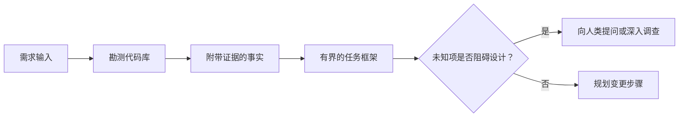

# में एजेंट 写代码前框定任务

> 编码智能体 (编码智能体) 编码代理 (编码代理) 能极其快速实现一个清晰的任务――它也极其快速实现一个模糊的任务―― दोनों की गति बिल्कुल समान है, लेकिन कीमतें बिलकुल भिन्न हैं――

**Type:** Learn + Build
**Languages:** Python (stdlib)
**Prerequisites:** Phase 14 第 31 课与第 36 课
**Time:** ~60 分钟

## 学习目标

- कोड को संशोधित करने से पहले, मूल आवश्यकताओं को स्पष्ट सीमा के साथ कार्य ढांचे में परिवर्तित किया जाएगा।
- कोडबुक के वस्तुनिष्ठ तथ्यों तथा वस्तुनिष्ठ धारणाओं को स्पष्ट रूप से छोड़ दें।
- 明确定义 अनुमति संशोधन पथ, रोकथाम पथ तथा स्वीकृति प्रमाणों
- 判断何时代码勘测(अनुभव) पर्याप्त है, औपचारिक रूप से काम शुरू किया जा सकता है。

## 代价高昂的失败

 बढ़ाएँ पुनः पुनः मेल बॉक्स सुरक्षा बहुत स्पष्ट लगता है, लेकिन वास्तव में ऐसा नहीं है। क्या यह अद्वितीयता परीक्षण एपीआई स्तर पर होना चाहिए, क्षेत्र सेवा स्तर या डेटाबेस स्तर? मेल बॉक्स तुलना क्या अंतर है? बाहरी सार्वजनिक त्रुटि प्रतिक्रिया संरचना क्या है? क्या डेटाबेस स्थानांतरण की अनुमति है? कौन सा परीक्षण इस व्यवहार को साबित कर सकता है?

एक क्षमताशाली बुद्धिमान व्यक्ति इन रिक्तियों को भरने के लिए उचित विकल्पों का उपयोग करता है। यह सबसे खतरनाक स्थिति हैः इसका कोड पूरा हो सकता है, लेकिन यह पूरी प्रणाली के साथ नहीं है।

इसलिए, कोडिंग के लिए काम करने की पहली इकाई कोड को सीधे संशोधित नहीं करना है, बल्कि कोडबुक द्वारा वास्तविक प्रमाणों के आधार पर एक कार्य ढांचा स्थापित करना है।

## 任务框架(कार्य फ्रेम)

एक व्यावहारिक कार्य ढांचे में छः मुख्य तत्व होते हैंः

| 字段 | 核心问题 |
|---|---|
| 目标（Goal） | 必须改变哪些可观测的行为？ |
| 代码库事实（Repository facts） | 你在代码、测试、配置或历史提交中验证了什么？ |
| 允许修改路径（Allowed paths） | 变更允许落在哪些位置？ |
| 禁止触碰路径（Forbidden paths） | 哪些文件与目录必须保持原样？ |
| 验收证据（Acceptance evidence） | 哪些具体命令或观测现象能证明目标已达成？ |
| 未知项（Unknowns） | 哪些决策仍需补充证据或依赖人类判断？ |

तथ्य को निश्चित प्रमाण पत्र के साथ होना चाहिए। API 遇到重复项返回 409  यह तथ्य नहीं है जब तक आप स्पष्ट रूप से मौजूदा परीक्षण उपयोग उदाहरण या अनुरोध प्रसंस्करण फ़ंक्शन की स्थिति को इंगित नहीं करते हैं।



## 勘测旨在寻找约束

मत कोशिश कर पूरे कोडबुक को पढ़ना. आपको यह खोजनी चाहिए कि कौन सी सतहें इस परिवर्तन के लिए बाध्यकारी रूप से तैयार हो सकती हैं।

1. वर्तमान व्यवहार के प्रदर्शन और उसके उपयोग के तरीके
2. हाल ही में उपलब्ध परीक्षण उपयोग के उदाहरणों में से एक
3. सार्वजनिक करार या क्रमबद्धता के बाद की डेटा संरचना
4. इस मार्ग के परियोजना विनियम एवं निर्देशों का प्रशासन करना
5. 构建与验证命令──
6. पूर्व में पूर्ण हुए समान परिवर्तनों से मध्य-提炼局部代码模式

जब योजना में प्रत्येक निर्णय के लिए वस्तुनिष्ठ प्रमाण है, तो एक स्पष्ट रूप से अधिकृत एजेंट निर्णय है, या एक ज्ञात अज्ञात परियोजना के रूप में सूचीबद्ध है, तो एक सर्वेक्षण को रोक दिया जा सकता है।

## अज्ञात项并非工作失误

अज्ञात तत्व नियंत्रण में सूचना के रिक्त स्थान हैं; जबकि अप्रत्याशित परिकल्पनाएँ इस रिक्त स्थान के बारे में अनियंत्रित अनुमान हैं।

प्रत्येक अज्ञात तत्वों को वर्गीकृत करनाः

- **可探查的（Discoverable）：**कोडबुक स्वयं या संचालन में प्रणाली उत्तर दे सकता है।
- **可自决的（Decidable）：**任务契约 ने बुद्धिमान शरीर को स्वतंत्रा चयन का अधिकार दिया है।
- **需人类判断的（Human）：**इस विकल्प से उत्पाद व्यवहार, लागत, प्रणाली जोखिम या बाहरी अनुकूलता में परिवर्तन होगा।
- **延后处理的（Deferred）：**यह चयन वर्तमान टुकड़े के दायरे से परे है, गैर-उद्देश्यों में से एक है।

智能体 को स्वयं खोज योग्य और अधिकृत स्व-निर्णय के अज्ञात कार्यों को संसाधित करना चाहिए; लेकिन जब मानव निर्णय की आवश्यकता होती है, तो निर्णय को कोड तक स्थिर करने से पहले सक्रिय रूप से रोकना और पुष्टि करना चाहिए।

## 实现之前先定验收标准

⇒ संपादन से पहले, पहले पूरा प्रमाण लिखना।

- एक लक्षित इकाई परीक्षण या एकीकरण परीक्षण आदेश;
- एक निर्दिष्ट दृश्य पोर्ट और पूर्वानुमानित स्थिति के अंत से अंत तक ब्राउज़र ऑपरेशन प्रक्रिया;
- एक नेटवर्क अनुरोध तथा पूर्ण रूप से अनुरूप प्रतिक्रिया समझौते;
- एक विशिष्ट मूल्य तक पहुँचने वाले प्रदर्शन माप;
- एक पुष्टि नहीं की गई कि कोई संबंधित दस्तावेज संशोधित किए गए हैं।

परीक्षा पारित करना并非 एक वैध प्रमाणीकरण योजना

##  इसे निर्माण

इस वर्ग के प्रयोग एक निर्माण करेंगे`TaskFrame`वस्तुओं, परीक्षण की सीमाओं और साक्ष्य की वैधता, और आउटपुट`outputs/task-frame.md`

में वर्तमान पाठ्यक्रम सूची नीचे运行:

```bash
python3 code/main.py
python3 -m unittest discover code/tests -v
```

尝试通过四种方式故意破坏示例: हटाना लक्ष्य、 हटाना तथ्य प्रमाणपत्र、 बनाने के लिए अनुमति पथ और प्रतिबंधित पथ के ओवरलैप, तथा हटाने के लिए स्वीकृति आदेशों।

## में वास्तविक代码库中使用

में मांगते हैं कि स्मार्ट शरीर में बदलाव कोड से पहलेः

1. किसी दस्तावेज में संशोधन के बजाय विशिष्ट व्यवहार के लिए लक्ष्य व्यक्त करना।
2. 记录两到三条带有确凭证的代码库事实──
3. 指定最小的允许修改路径集合──
4. 明确写出禁止触碰的负空间(नकारात्मक अंतरिक्ष)
5. 编写能够宣告任务闭环的验证命令或观测手段──
6. 列出你目前未查清且没有决定权的决策项──

任务框架 को एक स्क्रीन के भीतर पूरी तरह से प्रदर्शित किया जा सकता है  यदि एक स्क्रीन से परे, यह बताएं कि कार्य में कई स्वतंत्र रूप से सत्यापित परिवर्तन शामिल हो सकते हैं, तो इसे विभाजित किया जाना चाहिए

## अभ्यास

1. आपके लिए किसी कोडबुक में वास्तविक बग 框 निर्धारित एक कार्य ढांचे, तथा संपूर्ण प्रक्रिया किसी भी विशिष्ट समाधान का प्रस्ताव नहीं करती है।
2. 找出任务框架 में एक लेख वास्तव में केवल 主观假设的主张, इसे वस्तुगत साक्ष्य से प्रतिस्थापित करना है
3.  एक अतिरिक्त जो बाहरी सार्वजनिक संधि को बदल देगा  इसलिए मानव निर्णयों द्वारा अज्ञात तत्वों द्वारा किया जाना चाहिए
4. एक सीमा पार करने के लिए अनुमति दी गई मार्गों को न्यूनतम सुरक्षा मार्गों के समूह में विभाजित करना
5. प्रमाणीकरण प्रमाण पत्र में एक अनुबंधित प्रमाण पत्र जोड़ा गया है।

## 延伸阅读

- [Nuseibeh and Easterbrook, Requirements Engineering: A Roadmap](https://www.cs.toronto.edu/~sme/papers/2000/ICSE2000.pdf): यह पता लगाने के लिए कि सॉफ्टवेयर को वास्तविक दुनिया के उद्देश्यों और निरंतर विकास की बाध्यता के आधार पर कैसे प्राप्त किया जाए।
- [Yang et al., SWE-agent: Agent-Computer Interfaces Enable Automated Software Engineering](https://arxiv.org/abs/2405.15793): यह साबित हुआ कि कोडित बुद्धिमान शरीर के आसपास के इंटरफेस और बंधन प्रणाली का उसके कार्य परिणाम पर निर्णायक प्रभाव पड़ता है।

## 交付物与沉

कृपया ठीक से बनाए रखें उत्पन्न`outputs/task-frame.md`यह अगले अनुभाग का सीधा प्रवेश है, जहां यह ढांचा प्रमाण द्वारा समर्थित कार्यान्वयन योजना में परिवर्तित होगा
