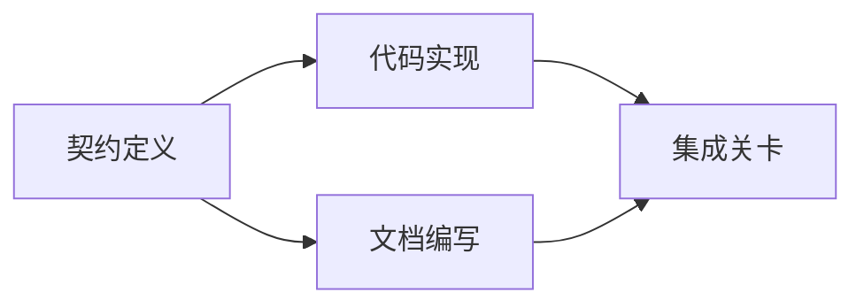

#  साक्ष्य आधारित कार्ययोजना का निर्माण

>  योजना निश्चित रूप से एक बेहतर प्रतीक्षा सूची नहीं है (To-do list)  यह एक निर्भरता है: इनमें से प्रत्येक परिवर्तन में कोई कारण नहीं है, प्रत्येक टर्मिनल बिंदु में स्पष्ट प्रमाण है

**Type:** Learn + Build
**Languages:** Python (stdlib)
**Prerequisites:** Phase 14 第 43 课
**Time:** ~65 分钟

## 学习目标

- उद्देश्य प्रमाण एवं सत्यापन प्रमाण के साथ कार्य परियोजनाओं में कार्य ढांचे का रूपांतरण करना
- क्रमबद्ध रूप से क्रमबद्ध रूप से क्रमबद्ध रूप से क्रमबद्ध रूप से क्रमबद्ध रूप से क्रमबद्ध रूप से क्रमबद्ध रूप से क्रमबद्ध रूप से क्रमबद्ध रूप से क्रमबद्ध रूप से क्रमबद्ध रूप से क्रमबद्ध रूप से क्रमबद्ध रूप से क्रमबद्ध रूप से क्रमबद्ध रूप से क्रमबद्ध रूप से क्रमबद्ध रूप से क्रमबद्ध रूप से क्रमबद्ध रूप से क्रमबद्ध रूप से क्रमबद्ध रूप से क्रमबद्ध रूप से क्रमबद्ध रूप से क्रमबद्ध रूप से क्रमबद्ध रूप से क्रमबद्ध रूप से क्रमबद्ध रूप से क्रमबद्ध रूप से क्रमबद्ध रूप से क्रमबद्ध रूप से क्रमबद्ध रूप से क्रमबद्ध रूप से क्रमबद्ध रूप से क्रमबद्ध रूप से क्रमबद्ध रूप से क्रमबद्ध रूप से क्रमबद्ध रूप से क्रमबद्ध चरणों के रूप में नहीं।
-                                                                                                                                                                                                                                                               
- 区分哪些步骤可以并行执行,哪些步骤必须按序等待──

## क्यों बुद्धिमान शरीर की योजनाएं हमेशा विफल रहती हैं

脆弱的计划只是以未来的态度为用户需求重复复述:

1. 更新API──
2. 添加测试──
3. 更新文档──

इस सूची में कोई विवरण नहीं है कि कोड तथ्य क्या हैं, क्यों इन फ़ाइलों को संशोधित करना सही है, किस अनुबंध को प्राथमिकता देने की आवश्यकता है, या यह नहीं बताया गया है कि किस काम को आगे बढ़ाया जा सकता है।

एक ठोस योजना प्रत्येक कार्यप्रणाली के लिए पांच प्रतिबद्धताओं को लेकर बनाई गई है।

| 承诺要素 | 核心作用 |
|---|---|
| 标识符（Identifier） | 用于依赖声明与会话交接（Handoff）的稳定引用 |
| 变更内容（Change） | 最小颗粒度的行为或契约改动 |
| 事实证据（Evidence） | 证明该变更合情合理且必要据实的代码库证据 |
| 前置依赖（Dependencies） | 必须率先完成并成立的前置工作项 |
| 验收证明（Proof） | 能够确凿宣告该工作项闭环的检查手段 |

## विशेष रूप से पहले योजनाबद्ध समझौता

जब कई अलग-अलग कोड सतह एक ही व्यवहार पर निर्भर करते हैं, तो व्यवहार समझौते को प्राथमिकता से परिभाषित करना आवश्यक है। इस प्रकार, परीक्षण, कार्यान्वयन, दस्तावेज और समग्र उपलब्धि एक ही समझौते को साझा कर सकती है, न कि प्रत्येक को चार परस्पर असंगत संस्करणों का निर्माण करना चाहिए।



इस निर्भरता के चित्र से स्पष्ट रूप से सुरक्षा और विकास की संभावना का पता चलता हैः समझौते के निर्धारण के बाद, कोड कार्यान्वयन और दस्तावेज़ लेखन के साथ मिलकर आगे बढ़ सकता है, जबकि अंतिम एकीकरण चरण दोनों के लिए तैयार है।

## तथ्यात्मक साक्ष्य में परिवर्तन योजना की क्षमता होनी चाहिए

代码库事实绝对无可无可的点, यह कार्य योजना पर वास्तविक प्रभाव डालने में सक्षम होना चाहिएः

-  मौजूदा सहायक कार्य का पता लगाना, जिससे मूल योजना के नए निर्माण के अमूर्त स्तर को समाप्त कर दिया जाए
- 兼容性测试 के अस्तित्व में, अनिवार्य योजना में डेटा स्थानांतरण को एक कदम बढ़ाया जाना चाहिए।
- 部署环境的约束,将模式(Schema) परिवर्तन और अलग अलग करने के लिए एक और स्वतंत्र मिशन में
- 公共响应类型 के प्रारूप, कोड को लागू करने और दस्तावेज लेखन के पूर्व क्रम को बदल दिया गया है।

यदि एक तथाकथित प्रमाण आपके योजना को बदल नहीं सकता है, तो यह शायद इस निर्णय का कोई ठोस प्रमाण नहीं है।

## 面向会话中断而设计

编码智能体的会话往往会无预警中断── एक पुनः प्राप्त करने योग्य (Resumable) योजना, इसकी कार्ययोजना पर्याप्त विस्तृत है, जिससे दूसरे सत्र में प्रवेश करते समय तत्काल निर्णय लेने में सक्षम होः

- 哪项工作已完成;
- 哪项验收证明已经走通;
- 哪些产品文件已修改;
-  कौन से निर्भरता परियोजनाओं को रोक दिया गया है;
- अगला काम सुरक्षित रूप से किया जा सकता है

️️️️️️️️️️️️️️️️️️️️️️️️️️️️️️️️️️️️️️️️️️️️️️️️️️️️️️️️️️️️️️️️️️️️️️️️️️️️️️️️️️️️️️️️️️️️️️️️️️️️️️️️️️️️️️️️️️️️️️️️️️️️️️️️️️️️️️️️️️️️️️️️️️️️️️️️️️️️️️️️️️️️️️️️️️️️️️️️️️️️️️️️️️️️️️️️️️️️️️️️️️️️️️️️️️️️️️️️️️️️️️️️️️️️️️️️️️️️️️️️️️️️️️️️️️️️️️️️️️️️️️️️️️️️️️️️️️️️️️️️️️️️️️️️️️️️️️️️️️️️️️️️️️️️️️️️️️️️️️️️️️️️️️️️️️️️️️️️️️️️️️️️️️️️️️️️️️️️️️️️️️️️️️️️️️️️️️️️️️️️️️️️️️️️️️️️️️️️️️️️️️️️️️️️️️️️️️️️️️️️️️️️️️️️️️️️️️️️️️️️️️️️️️️️️️️️️️️️️️️️️️️️️️️️️️️️️️️️️️️️️️️️️️️️️️️️️️️️️️️️️️️️️️️️

## 计划有效性校验

औपचारिक रूप से निष्पादन से पहले, यदि निम्नलिखित स्थिति उत्पन्न हो तो योजना को सीधे अस्वीकार करना चाहिएः

- 存在重复工作项标识符;
-  किसी कार्यप्रकल्प के लिए तथ्य प्रमाणों की कमी;
- 某工作项缺乏验收证明;
- किसी कार्य की अनुपस्थिति पर निर्भरता;
- चक्र के आधार पर;
- पहले ही इस संबंध में अनिश्चितता समाप्त हो चुकी है।

पहले पांच परीक्षाएं प्रक्रिया के माध्यम से स्वचालित रूप से पूरी की जा सकती हैं; अंतिम परीक्षाओं में स्पष्ट रूप से रेखांकित किए जाने वाले निर्णय की आवश्यकता होती है।

##  इसे निर्माण

`code/main.py`建模了工作项,校验其证凭证,通过拓排序计算执行波次(Execution Waves),并将结果写入 `outputs/evidence-plan.json`

运行命令:

```bash
python3 code/main.py
python3 -m unittest discover code/tests -v
```

इस उदाहरण में तीन निष्पादन चरण उत्पन्न होंगे: पहले निष्पादन करार परिभाषित; फिर कोड कार्यान्वयन एवं दस्तावेज लेखन तथा निष्पादन; अंतिम निष्पादन एकीकृत关卡──

## 配合编码智能体使用

इससे पहले कि एक स्मार्टफ़ोन कोड फ़ाइल को संशोधित कर सके, उसे यह योजना पहले निष्पादित करने की आवश्यकता होती है।

1. प्रत्येक पथ और व्यवहार के लिए क्या विशिष्ट कोडबेस है?
2. क्या प्रत्येक कार्ययोजना में एक स्पष्ट पूर्णता प्रमाण है?
3. निर्भरता यह है कि क्या यह काम महंगी या अपरिवर्तनीय हो जाएगी, इसके अवलंबित्व की अनिश्चितता समाप्त होने के बाद।

                                                                                                                                                                                                                                                              

## अभ्यास

1. ∙ एक डेटाबेस स्थानांतरण कार्य जो स्पष्ट रूप से मानव अनुमोदन की आवश्यकता है।
2.  एक चक्र निर्भरता का निर्माण, और इसके पीछे छिपे हुए उत्पाद विभाजनों की व्याख्या करना
3. 拆分一个包含两条不同证明命令的工作项──
4. एक जोड़ा जा सकता है दूसरी लहर में चलाने, और किसी भी पहले से ही उपलब्ध शाखा कार्य को स्पर्श नहीं करता है।
5.  योजना 染 के लिए मार्कडाउन  प्रारूप में प्रदर्शित, जबकि JSON 作为单一事实来源

## 延伸阅读

- [Nuseibeh and Easterbrook, Requirements Engineering: A Roadmap](https://www.cs.toronto.edu/~sme/papers/2000/ICSE2000.pdf): लक्ष्य, नियमन, सहमति और विकास के बीच संबंधों की खोज करना
- [Barry Boehm, A Spiral Model of Software Development and Enhancement](https://dl.acm.org/doi/10.1145/12944.12948)इस विषय पर चर्चा की जाए कि विकास के लिए कैसे एक प्रणाली बनाई जाए।

## 交付物与沉

कृपया ठीक से बनाए रखें उत्पन्न`outputs/evidence-plan.json`यह अनुबंध के आधार पर कार्यभार संभाला जाएगा
