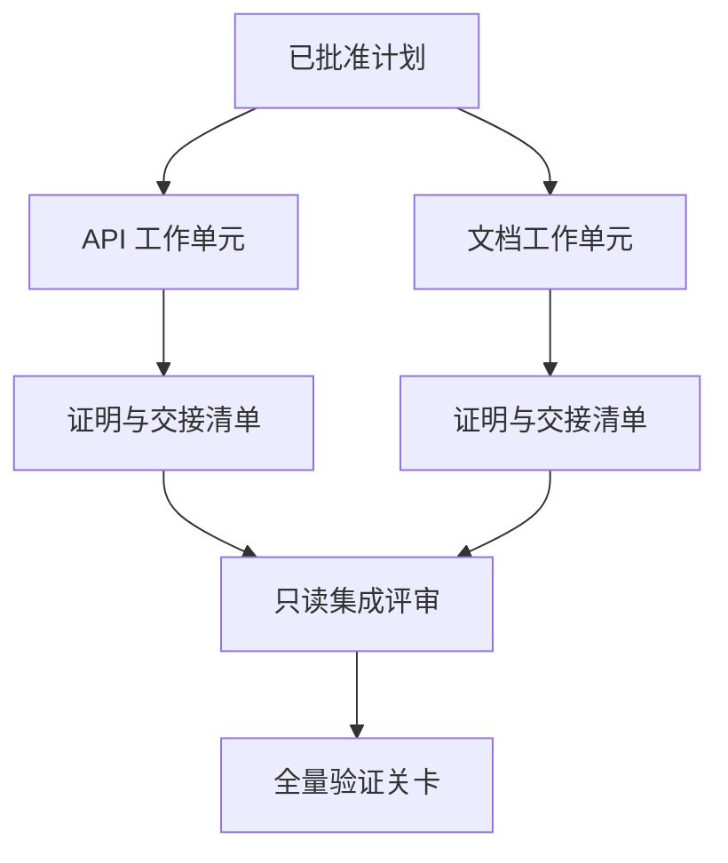

# 带隔离与合并契约的代理委托

> और बुद्धिमान शरीर केवल तब ही काम करते हैं जब वे वास्तव में एक दूसरे से स्वतंत्र होते हैं ताकि भौतिक समय बचाया जा सके। अन्यथा, वे केवल एक स्पष्ट कार्य को समन्वय लागत में बदल देंगे।

**Type:** Learn + Build
**Languages:** Python (stdlib)
**Prerequisites:** Phase 14 第 39 课与第 44 课
**Time:** ~70 分钟

## 学习目标

- वास्तविक स्वतंत्रता के आधार पर कार्यभार तथा सहकार्य उचित है या नहीं।
- प्रत्येक कार्य इकाई के लिए (वर्कर) को अपने कार्यपत्र में संशोधन और स्पष्ट पूर्णता प्रमाण पत्र प्रदान किया जाता है।
- 基于依赖关系计算安全的执行波次 (अनुपादन लहरों) 
- 设计合并契约(Merge Contract) सुरक्षित रूप से कई बुद्धिमान कार्य उत्पादों को एकजुट करने के लिए।

## तथाकथित परीक्षण मानदंड

केवल इसलिए नहीं कि अधिक बुद्धिमान शरीर अंधे के लिए कार्य करने के लिए उपलब्ध हैं। केवल तभी जब निम्नलिखित में से कम से कम एक शर्त पूरी हो, तो कार्य करने के लिए उचित हैः

-  दो जांचें स्वतंत्र रूप से विभिन्न अज्ञात प्रश्नों का समाधान कर सकेंगी;
-  दो कोडों को पारस्परिक रूप से असमान फ़ाइल पथ और संधि इंटरफ़ेस प्राप्त करना;
- 评审智能体 (आढावाकर्ता) बिना संशोधित उत्पाद की शर्त पर स्वतंत्र रूप से जांच कर सकता है;
-  समय लेने वाली बाहरी जांच स्थानीय कार्य को आगे बढ़ाने के साथ-साथ बाद की कार्यवाही में भी हो सकती है

जब कई बुद्धिमान निकायों को एक ही दस्तावेज को संशोधित करने की आवश्यकता होती है, तो एक ही अनसुलझे निर्णय पर निर्भर करते हैं, या एक ही बदलते वातावरण पर निर्भर करते हैं, तो उन्हें क्रमिक रूप से निष्पादन पर दृढ़ता से भरोसा करना चाहिए।

## 工作单元就是一份契约

प्रत्येक कार्य इकाई को स्पष्ट रूप से निर्धारित करने की आवश्यकता होती हैः

| 字段 | 含义 |
|---|---|
| 目标（Goal） | 单一可观测的结果 |
| 负责人（Owner） | 单一负责执行的工作智能体 |
| 路径（Paths） | 排他的写入所有权 |
| 前置依赖（Dependencies） | 启动前必须已完工的前置单元 |
| 证明（Proof） | 返回给集成者的确凿验证证据 |
| 交接清单（Handoff） | 已修改的文件、已做出的决策以及残留风险 |

 प्रसंस्करण के बाद के समय  तर्क  नहीं योग्य कार्य इकाई  में `app/accounts.py`में पुनः प्राप्ति की जांच और खाता के लिए विशेष परीक्षाओं के माध्यम से प्रमाणित किया गया है कि यह योग्य कार्य इकाई है।

## 隔离的三层体系

1. **文件系统隔离（Filesystem isolation）：**独立工作树 (独立工作树) ️️️️️️️️️️️️️️️️️️️️️️️️️️️️️️️️️️️️️️️️️️️️️️️️️️️️️️️️️️️️️️️️️️️️️️️️️️️️️️️️️️️️️️️️️️️️️️️️️️️️️️️️️️️️️️️️️️️️️️️️️️️️️️️️️️️️️️️️️️️️️️️️️️️️️️️️️️️️️️️️️️️️️️️️️️️️️️️️️️️️️️️️️️️️️️️️️️️️️️️️️️️️️️️️️️️️️️️️️️️️️️️️️️️️️️️️️️️️️️️️️️️️️️️️️️️️️️️️️️️️️️️️️️️️️️️️️️️️️️️️️️️️️️️️️️️️️️️️️️️️️️️️️️️️️️️️️️️️️️️️️️️️️️️️️️️️️️️️️️️️️️️️️️️️️️️️️️️️️️️️️️️️️️️️️️️️️️️️️️️️️️️️️️️️️️️️️️️️️️️️️️️️️️️️️️️️️️️️️️️️️️️️️️️️️️️️️️️️️️️️️️️️️️️️️️️️️️️️️️️️️️️️️️️️️️️️️️️️️️️️️️️️️️️️️️️️️️️️️️️
2. **所有权隔离（Ownership isolation）：**严格的契约限制, दो बुद्धिमान निकायों को एक ही मार्ग में जानबूझकर संशोधन करने से रोकना
3. **状态隔离（State isolation）：**独立日志和输出目录, एक बुद्धिमान शरीर को दूसरे बुद्धिमान शरीर के भार के प्रमाण को कवर करने से रोकना

文件系统隔离无法解决设计所有权问题―― दो干干净净的工作树仍然可能产生相互冲突的架构设计――合并契约必须在工作开始前就彻底了解共享接口――



## 集成者不负责重构代码

集成者(एग्जीटेटर) का कर्तव्य होना चाहिए:

1. ् ् ् ् ् ् ् ् ् ् ् ् ् ् ् ् ् ् ् ् ् ् ् ् ् ् ् ् ् ् ् ् ् ् ् ् ् ् ् ् ् ् ् ् ् ् ् ् ् ् ् ् ् ् ् ् ् ् ् ् ् ् ् ् ् ् ् ् ् ् ् ् ् ् ् ् ् ् ् ् ् ् ् ् ् ् ् ् ् ् ् ् ् ् ् ् ् ् ् ् ् ् ् ् ् ् ् ् ् ् ् ् ् ् ् ् ् ् ् ् ् ् ् ् ् ् ् ् ् ् ् ् ् ् ् ् ् ् ् ् ् ् ् ् ् ् ् ् ् ् ् ् ् ् ् ् ् ् ् ् ् ् ् ् ् ् ् ् ् ् ् ् ् ् ् ् ् ् ् ् ् ् ् ् ् ् ् ् ् ् ् ् ् ् ् ् ् ् ् ् ् ् ् ् ् ् ् ् ् ् ् ् ् ् ् ् ् ् ् ् ् ् ् ् ् ् ् ् ् ् ् ् ् ् ् ् ् ् ् ् ् ् ् ् ् ् ् ् ् ् ् ् ् ् ्
2. 认真审查验证证明 के आउटपुट, केवल अंधे विश्वास工作智能体 द्वारा स्वयं लिखित सारांश के बजाय;
3. ा निर्भरता के क्रम के अनुसार ांतरिक रूप से ाया परिवर्तन;
4. 运行覆盖跨单元的全量验证关卡;
5.  दृढ़ता से किसी भी छिपे हुए दायरे को फैलने से इनकार करना;
6. निजी तौर पर चुपचाप सुधारों के बजाय संघर्ष रिकॉर्ड को नए निर्णयों के लिए हल करने की आवश्यकता के लिए तैयार करना।

यदि एकीकरण चरण में किसी कार्यशील बुद्धिजीविका के अधिकांश कोड उत्पाद को फिर से लिखने की आवश्यकता होती है, तो यह स्पष्ट करें कि मूल कार्य विघटन स्वयं गलत है।

## मानव और बुद्धिमान शरीर की भूमिकाएँ

任务委托 का अर्थ मानव निर्णय को त्यागना नहीं है। मनुष्य उन मूल निर्णयों पर दृढ़ता से नियंत्रण रखता है जो सिस्टम के बाहरी व्यवहार, जोखिम के स्तर, सुरक्षा के अधिकारों को बदल देंगे या अपरिवर्तनीय लागत लाएंगे।

यह है कि**校准型自主（Calibrated Autonomy）**: प्रणाली में सबूतों के साथ और आसानी से घूमने के लिए जहां बुद्धिमान शरीर उच्च स्वतंत्रता देता है, इसके बाद गंभीर महत्वपूर्ण पहलुओं में मानव जांच कार्ड स्थापित करना अनिवार्य है।

##  इसे निर्माण

इस कक्षा के प्रयोगात्मक कार्यक्रम में पथों के ओवरलैप का परीक्षण किया जाएगा, निर्भरता का सत्यापन किया जाएगा, गणना सुरक्षा के निष्पादन के बाद परिणामों को आउटपुट किया जाएगा।`outputs/delegation-plan.json`

运行命令:

```bash
python3 code/main.py
python3 -m unittest discover code/tests -v
```

尝试修改文档单元, इसे प्राप्त करने का प्रयास करें `app/`वर्तमान स्वामित्वः- क्योंकि इस पथ और एपीआई खंड में एक-दूसरे के साथ ओवरलैप है, योजना को स्वचालित रूप से अवरुद्ध और रिपोर्ट किया जाना चाहिए।

## अभ्यास

1. एक वास्तविक व्यवसाय को दो स्वतंत्र कार्य इकाईओं और एक एकीकृत भूमिका में विभाजित करना।
2. एक ऐसी योजना का पता लगाना जो बाहरी रूप से स्वतंत्र प्रतीत हो लेकिन वास्तव में एक साथ हो, जो उन दोनों के साझा गुप्त निर्णयों को स्पष्ट रूप से इंगित करे।
3. 增加一个只读的研究型智能体 (अध्ययनकर्ता), इसका उत्पादन एक तथ्य के रूप में किया जाता है।
4. 增加一个合并关卡(Merge Gate),对照所有工作单元契约检查最终修改的文件集合──
5. 工作单元定义取消规则: जब इसके पूर्वनिर्धारित अवलंबित्व विफल हो जाता है,及时停止后续执行──

## 延伸阅读

- [Reid Smith, The Contract Net Protocol](https://doi.org/10.1109/TC.1980.1675516): वितरित कार्य वितरण तथा परिणाम汇报 के प्रारंभिक औपचारिकता क्लासिक अध्ययन
- [Eric Horvitz, Principles of Mixed-Initiative User Interfaces](https://dl.acm.org/doi/10.1145/302979.303030): स्वचालन तंत्र की खोज करें कि स्वायत्तता के साथ काम करना कब चाहिए, नियंत्रण को मानवता को वापस देना कब चाहिए।

## 交付物与沉

कृपया ठीक से बनाए रखें उत्पन्न`outputs/delegation-plan.json`यह रिकॉर्ड करता है कि विभाजन योजना सुरक्षित क्यों है, प्रत्येक मार्ग किसके स्वामित्व में है, और एकीकरण को किस प्रकार का प्रमाण स्वीकार करना चाहिए
